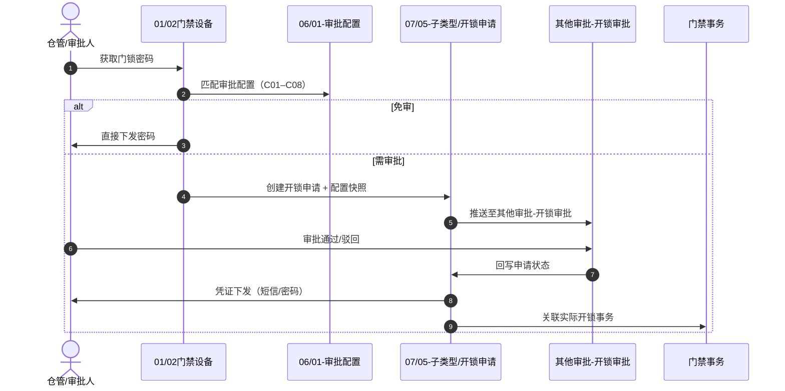

# 06-门禁开锁审批 与 07-审批中心 联合导读

> **版本**：V1.0 | **更新日期**：2026-08-28
>
> **文档定位**：6.2 门禁开锁审批扩展链路的**跨模块阅读入口**。说明 06（配置与编排）、07（审批平台与子类型）如何分工协作，**不**重复各模块 唯一定义来源 正文。
>
> **上级索引**：[6.2版本 README](../README.md) · [审批中心总索引](./审批中心总索引.md) · [门禁开锁审批总索引](../06-门禁开锁审批/门禁开锁审批总索引.md) · [08-开锁审核主PRD](../08-开锁审核/开锁审核主PRD.md)

---

## 一、一句话分工

| 模块 | 角色类比 | 管什么 | 不管什么 |
| :--- | :--- | :--- | :--- |
| **07-审批中心** | 审批大厅（平台） | 待办/已办/抄送/我的申请记录（**接入流程配置**的子类型） | 未接入流程配置的独立其他审批（如开锁走「其他审批—开锁审批」） |
| **07/05-子类型/开锁申请** | 业务单据 | 申请主表、凭证、事务；我的申请记录；申请人查看密码和受控短信重发 | 审批人列表 UI、配置 CRUD |
| **06-门禁开锁审批** | 领域编排 + 配置 | 何时需审批、审批链配置；全链路推演与规则 ID 索引 | 申请/待办/凭证字段正文 |
| **08-开锁审核** | 审批人工作台 | 其他审批—开锁审批 列表/详情/通过/驳回 | 申请状态机、配置 CRUD |

---

## 二、对象归属速查

| 序号 | 对象 | 唯一定义文档 | 物理目录 |
| :---: | :--- | :--- | :--- |
| — | 审批任务（平台） | [03-审批中心字段清单](./03-审批中心字段清单.md) | `07/` 序号 03 |
| — | 通用审批动作 | [04-操作字段清单/01通用审批处理](./04-操作字段清单/01通用审批处理字段清单.md) | `07/04-操作字段清单/` |
| 01 | 开锁申请主表 | [01开锁申请主表字段清单](./05-子类型/01-开锁申请/01-字段清单/01开锁申请主表字段清单.md) | `07/05-子类型/01-开锁申请/` |
| 02 | 临时开锁凭证 | [02临时开锁凭证字段清单](./05-子类型/01-开锁申请/01-字段清单/02临时开锁凭证字段清单.md) | 申请详情中的凭证状态、有效期和受控密码展示 |
| 03 | 门禁事务关联 | [03门禁事务关联字段清单](./05-子类型/01-开锁申请/01-字段清单/03门禁事务关联字段清单.md) | 申请详情中的实际开锁事实关联摘要 |
| — | 开锁审批配置 | [门禁开锁审批配置业务规则规格](../06-门禁开锁审批/01-审批配置/门禁开锁审批配置业务规则规格.md) | `06/01-审批配置/` |
| — | 全链路推演 | [门禁开锁审批-业务流程推演](../06-门禁开锁审批/门禁开锁审批-业务流程推演.md) | `06/` 根目录 |
| — | **审批人 UI** | [开锁审核业务规则规格](../08-开锁审核/开锁审核业务规则规格.md) | **`08/`** |

> 三板块完整导读见 [00-06-07-08联合导读](../00-06-07-08联合导读.md)。

---

## 三、端到端时序

---

## 四、推荐阅读路径

| 角色 | 建议顺序 |
| :--- | :--- |
| 产品 / 研发（审批大厅） | [01-审批中心主PRD](./01-审批中心主PRD.md) → [02-业务规则规格](./02-审批中心业务规则规格.md) → [03-字段清单](./03-审批中心字段清单.md) |
| 产品 / 研发（开锁申请） | [开锁申请业务规则规格](./05-子类型/01-开锁申请/开锁申请业务规则规格.md) → [开锁申请字段清单](./05-子类型/01-开锁申请/开锁申请字段清单.md) → [查看与下发凭证](./05-子类型/01-开锁申请/02-操作字段清单/02查看与下发凭证字段清单.md) → [06 业务流程推演 §三](../06-门禁开锁审批/门禁开锁审批-业务流程推演.md) |
| 产品 / 研发（开锁审批页） | [08 主 PRD](../08-开锁审核/开锁审核主PRD.md) → 业务规则 → ASCII |
| 产品 / 研发（审批配置） | [门禁开锁审批配置主PRD](../06-门禁开锁审批/01-审批配置/门禁开锁审批配置主PRD.md) → 配置业务规则 → 配置字段清单 |
| 架构 / 联调 | 本导读 → [06 业务规则规格](../06-门禁开锁审批/门禁开锁审批-业务规则规格.md)（规则 ID 速查）→ [全局契约](../00-全局契约与RBAC权限矩阵.md) |

---

## 修订记录

| 日期 | 版本 | 变更内容 |
| :--- | :---: | :--- |
| 2026-08-28 | V1.1 | 研发确认：开锁审批走「其他审批—开锁审批」，不进待处理 |
| 2026-08-28 | V1.2 | 补充 08-开锁审核 分工与导读链接 |
