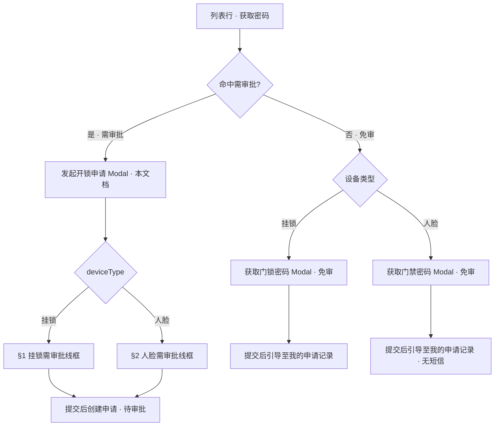

# 开锁申请 — 发起申请页 ASCII 线框

> **Demo**：[开锁申请_Demo_发起申请页](./开锁申请_Demo_发起申请页.md)
> **版本**：V1.2 | **更新时间**：2026-08-31
> **系统设计**：[门禁设备业务规则规格 §〇](../../../01-物联网IOT管理/02门禁设备/门禁设备业务规则规格.md) — 挂锁须短信；人脸仅页面
> **菜单路径**：`物联网IOT管理 → 门禁设备 → 获取门锁密码 / 获取门禁密码`（**命中需审批**时）
> **页面路径**：`/物联网IOT管理/门禁设备` · 弹窗 `unlock-apply-dialog`
> **容器类型**：Modal 弹窗（挂锁/人脸共用壳层，字段区按 `deviceType` 动态切换）
> **配套文档**：[主PRD](./开锁申请主PRD.md) · [01发起开锁申请字段清单](./02-操作字段清单/01发起开锁申请字段清单.md) · [获取门锁密码字段清单](../../../01-物联网IOT管理/02门禁设备/操作字段清单/04获取门锁密码字段清单.md) · [获取门禁密码字段清单](../../../01-物联网IOT管理/02门禁设备/操作字段清单/05获取门禁密码字段清单.md) · [业务规则规格](./开锁申请业务规则规格.md) §二（R05–R08）
> **免审对照**：[获取门锁密码 ASCII（免审）](../../../01-物联网IOT管理/02门禁设备/门禁设备_ASCII_获取门锁密码.md) · [获取门禁密码 ASCII（免审）](../../../01-物联网IOT管理/02门禁设备/门禁设备_ASCII_获取门禁密码.md)

---

## 0. 入口分流（列表行操作 → 弹窗选择）

点击「获取门锁密码」/「获取门禁密码」后，**先匹配审批配置**（C01–C03：设备 ID 命中 / 未命中 / 冲突），再决定弹窗类型：



| 分支 | 条件 | 打开弹窗 | 主按钮 | 提交后 |
| :--- | :--- | :--- | :--- | :--- |
| **免审** | 未命中需审批配置 | 获取门锁/门禁密码 | 获取密码 | 直接生成凭证 |
| **需审批** | 设备 ID 命中已启用审批配置 | **发起开锁申请**（本文档） | 提交申请 | 创建申请单，待审批 |

> 同一入口按钮文案不变；**不在 UI 上区分**「需审批/免审」，由服务端匹配结果决定弹窗组件。

---

## 1. 发起申请弹窗 — 挂锁门禁 · 需审批

```text
         +-- 发起开锁申请 ────────────────────────────────────── [ x ] --+
         |                                                              |
         |  🔒 您正在申请临时开锁授权                                        |
         |  设备：挂锁-LK02（LK-2024-0082）· 华东一号仓 · A库1区东门           |
         |  ────────────────────────────────────────────────────────────  |
         |                                                              |
         |  * 事由:        [ 出库                          v ]          |
         |  * 有效期:      [ 2026-08-28 14:00 ] ~ [ 2026-08-28 18:00 ]   |
         |    备注:        [ 今日下午提货，已与仓管确认________________ ]  ≤50字 |
         |                                                              |
         |    💡 最长 24h；超时凭证自动失效；审批通过后短信下发临时密码（**仅挂锁**）  |
         |                                                              |
         |                              [ 取消 ]  [ 提交申请 ]            |
         +--------------------------------------------------------------+
```

---

## 2. 发起申请弹窗 — 人脸门禁 · 需审批

```text
         +-- 发起开锁申请 ────────────────────────────────────── [ x ] --+
         |                                                              |
         |  👤 您正在申请临时开锁授权                                        |
         |  设备：人脸-FACE1（FACE-2024-001）· 华南二号仓 · B库主入口          |
         |  ────────────────────────────────────────────────────────────  |
         |                                                              |
         |  * 事由:        [ 入库                          v ]          |
         |  * 有效期:      [ 2026-08-31 14:00 ] ~ [ 2026-08-31 18:00 ]    |
         |  * 开锁次数:    [ - ]  [  3  ]  [ + ]   （1~100，默认1）        |
         |    备注:        [ 选填，最多50字________________ ]              |
         |                                                              |
         |    💡 最长 24h；审批通过后请在申请详情页查看临时密码（**人脸不下发短信**）      |
         |                                                              |
         |                              [ 取消 ]  [ 提交申请 ]            |
         +--------------------------------------------------------------+
```

> 人脸字段顺序与免审一致：事由 → 有效期 → 开锁次数 → 备注（见 [05获取门禁密码字段清单](../../../01-物联网IOT管理/02门禁设备/操作字段清单/05获取门禁密码字段清单.md)）。

---

## 3. 提交成功 — 结果提示（需审批 · 共用）

```text
         +-- 申请已提交 ────────────────────────────────────── [ x ] --+
         |                                                              |
         |  ✅ 开锁申请已提交，请等待审批                                  |
         |                                                              |
         |  申请单号：  UA20260828001                                     |
         |  申请状态：  待审批                                             |
         |  凭证状态：  未生成                                             |
         |                                                              |
         |  [ 查看申请详情 ]        [ 返回设备列表 ]                        |
         +--------------------------------------------------------------+
```

> 点击「查看申请详情」→ Deep link 跳转 PC「我的开锁申请」Tab 并打开详情（`ROUTE-IOT-APPR-01`）。

---

## 4. 免审分支对照（不进入本弹窗）

### 4a. 挂锁 · 免审（对照）

见 [获取门锁密码 ASCII（免审）](../../../01-物联网IOT管理/02门禁设备/门禁设备_ASCII_获取门锁密码.md) §1~§2：事由 → 有效期 → 备注；成功态引导至【我的申请记录】，弹窗内不展示明文。

### 4b. 人脸 · 免审（对照）

见 [获取门禁密码 ASCII（免审）](../../../01-物联网IOT管理/02门禁设备/门禁设备_ASCII_获取门禁密码.md) §1~§2：事由 → 有效期 → 开锁次数 → 备注；成功态引导至【我的申请记录】，无短信。

---

## 5. 需审批 vs 免审 — 字段与结果对照

| 对比项 | 免审 | 需审批（本弹窗） |
| :--- | :--- | :--- |
| 触发条件 | 未命中审批配置 | 设备 ID 命中已启用审批配置 |
| 挂锁表单 | 事由、**有效期**、备注 | **与免审相同** |
| 人脸表单 | 事由、**有效期**、开锁次数、备注 | **与免审相同** |
| 主按钮 | 获取密码 | 提交申请 |
| 挂锁提交后 | 引导至我的申请记录查看密码 + 短信 | 申请单号 + 待审批 + 凭证未生成 |
| 人脸提交后 | 引导至我的申请记录查看密码（无短信） | 申请单号 + 待审批 + 凭证未生成 |
| 挂锁手机号 | 免审须绑定 | 需审批须绑定（收短信） |
| 人脸手机号 | 不要求 | 不要求（仅档案） |

---

## 布局说明

**弹窗容器**（`Dialog` / `Modal`，宽 ~520px）：

- **安全提示区**：设备名称、设备编码、绑定仓库/位置快照（只读，行上下文带入）。
- **表单区（与免审一致）**：
  - **挂锁**：事由 → **有效期** → 备注；
  - **人脸**：事由 → **有效期** → 开锁次数 → 备注。
- **底部动作**：取消 / 提交申请。

**提交后不可见字段**（服务端写入）：请求幂等键、设备与位置快照、审批配置快照。

---

## 字段与动作投影

| 区域 | 挂锁需审批 | 人脸需审批 | 字段清单 |
| :--- | :---: | :---: | :--- |
| 上下文 | ✅ | ✅ | 门禁设备 |
| 事由 | ✅ | ✅ | 04/05 |
| 有效期 | ✅ | ✅ | 04/05 |
| 备注 | ✅ | ✅ | 04/05 |
| 开锁次数 | — | ✅ | 05获取门禁密码 |
| 提交申请 | ✅ | ✅ | R05–R08 |
| 临时密码（提交前） | ❌ | ❌ | 审批通过前不生成 |

---

## 保存校验要点

| 规则编号 | 场景 | 预期 |
| :--- | :--- | :--- |
| R05 | 无获取密码权限 / 仓库数据权限不足 | 阻断，提示无权限 |
| R05 | **挂锁**未绑定手机号 | 阻断，提示先绑定手机号 |
| R06 | 未命中需审批却误入本弹窗 | 前端不应打开；后端兜底走免审 |
| R07 | 同设备存在在途申请 | 阻断，提示已有申请单号 |
| R08 | 60 秒内重复提交 | 返回原申请单号及状态（幂等） |
| — | 有效期开始 > 结束 / 超 24h | 阻断，提示有效期不正确 |
| — | 人脸开锁次数越界 | 同免审获取门禁密码校验 |

---

## 修订记录

| 日期 | 版本 | 变更 |
| :--- | :---: | :--- |
| 2026-08-31 | V1.0 | 初版；对齐免审/需审批双分支与继承关系 |
| 2026-08-31 | V1.1 | 区分挂锁/人脸 helper；人脸不涉及短信 |
| 2026-08-31 | V1.2 | 补 §0 入口分流；新增人脸需审批线框；免审对照拆挂锁/人脸 |
| 2026-09-04 | **V1.3** | 废止「预计使用时段」；需审批与免审统一「有效期」及字段顺序 |
