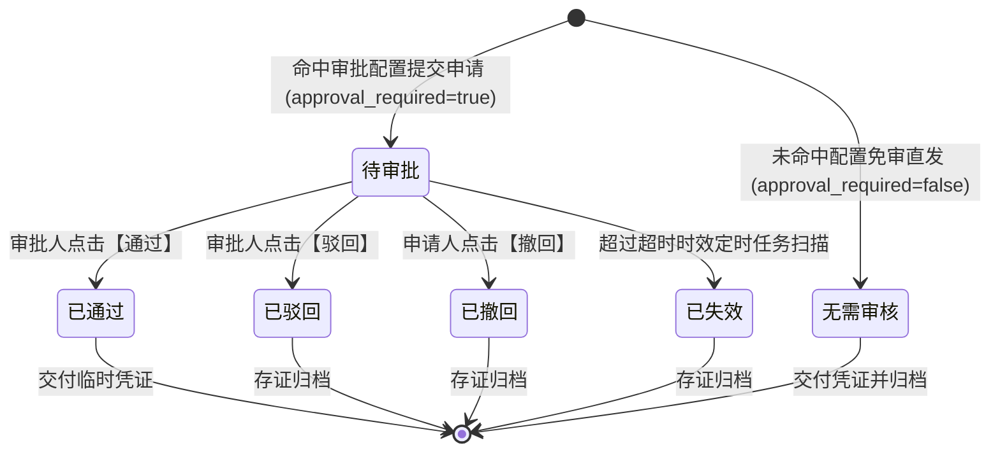
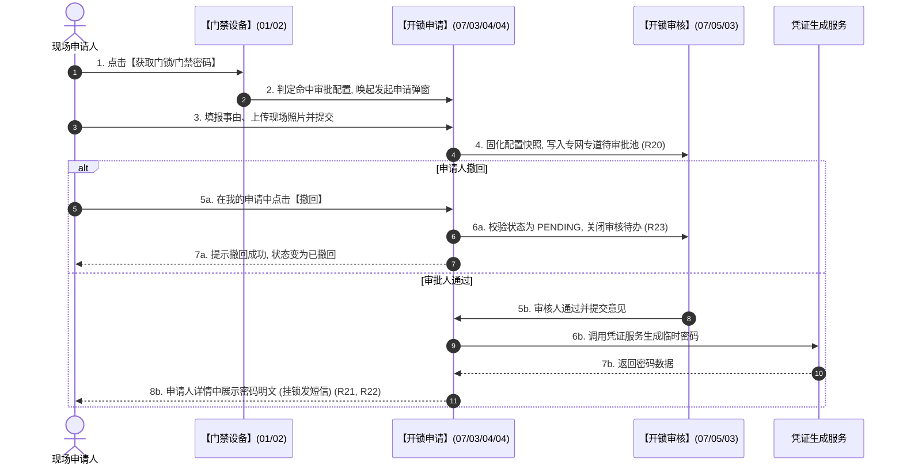

# 开锁申请 业务规则规格

> **文档定位**：**三件套核心**——状态机、动作约束、校验规则、计算联动、权限与跨模块流程的**唯一定义来源**。配套：[主PRD](./开锁申请主PRD.md)（业务与页面功能）、[字段清单](./开锁申请字段清单.md)（字段）。ASCII/Demo 为衍生，只引用本文件规则 ID，不重复定义规则本体。
>
> **统一引用规范**：
> - 本单据：【开锁申请】单据（菜单：工作中心 → 审批中心 → 业务审批 → 我的申请管理 → 开锁申请，代号 07/03/04/04）
> - 上游策略：【开锁审批配置】策略（菜单：配置管理 → 业务流程管理 → 开锁审批，代号 06/01）
> - 协同审核：【开锁审核】台账（菜单：工作中心 → 审批中心 → 其他审批 → 开锁审核，代号 07/05/03）
> - 设备实体：【门禁设备】台账（菜单：物联网IOT管理 → 门禁设备，代号 01/02）
>
> **版本**：V4.0 基准版 | **更新时间**：2026-09-18 | **责任人**：产品架构组

---

## 一、单据与能力定位

| 维度 | 标准定位规格 | 业务解释与控制边界 |
| :--- | :--- | :--- |
| **模块层级** | 业务单据与凭证交付层（Business Document & Credential Delivery Layer） | 负责现场申请意图表达、凭证交付与全量开锁审计沉淀。 |
| **菜单路径** | `工作中心 → 审批中心 → 业务审批 → 我的申请管理 → 开锁申请` | 挂载于我的申请管理标签页中，系统代号为 `07/03/04/04`。 |
| **核心职责** | 承接现场开锁申请、跟踪审批进度与交付开锁凭证 | 管理需审批与免审直发的全部开锁单据，向申请人安全交付临时开锁密码与凭证。 |
| **单据/数据源头** | 现场操作人在门禁设备列表发起 | 数据源自【门禁设备】台账（代号 01/02）行操作，策略继承自【开锁审批配置】策略（代号 06/01）。 |
| **上下游协同** | 驱动开锁审核流转与凭证解密 | 需审批申请推送到【开锁审核】台账（代号 07/05/03）；审批通过后接收凭证服务下发的动态开锁密码。 |
| **审核与存证机制**| 终态存证，双轨全量归集 | 审批通过、驳回、撤回、超时失效及免审直发均作为不可变司法存证事实永久归档。 |

---

## 二、数量与计算口径隔离表

| 指标/判定项 | 严格业务口径与判定公式 | 边界条件与约束控制 | 关联规则编号 |
| :--- | :--- | :--- | :--- |
| **开锁申请双轨模式判定** | 设目标门禁设备 ID 为 $d$，系统已启用策略集合为 $\mathbb{C}_{active}$。策略命中函数 $\text{Match}(d)$ 定义为：$$\text{Match}(d) = \begin{cases} C_k, & \text{if } \exists C_k \in \mathbb{C}_{active} \text{ s.t. } d \in D(C_k) \\ \text{NULL}, & \text{otherwise} \end{cases}$$ 则单据属性 $IsApprovalRequired$ 计算公式为：$$IsApprovalRequired = \begin{cases} \text{TRUE}, & \text{if } \text{Match}(d) \neq \text{NULL} \\ \text{FALSE}, & \text{if } \text{Match}(d) = \text{NULL} \end{cases}$$ | 1. 命中时单据初始状态为 `PENDING`，走审批流； 2. 未命中时单据初始状态即终态为 `NO_APPROVAL_REQUIRED`，直接直发凭证。 | **R20** |
| **人脸门禁凭证有效期跨度** | 设申请人选择的有效起止时间为 $[T_{start}, T_{end}]$。有效期必须满足：$$T_{end} - T_{start} \le 86400 \quad (\text{即 } 24 \text{ 小时}) \quad \land \quad T_{start} \ge T_{now}$$ | 1. 仅限设备类型为「人脸门禁」时生效； 2. 超过 24 小时前端阻断提交并标红提示。 | **R24** |
| **主动撤回有效窗口判定** | 设单据当前状态为 $S(a)$，申请撤回有效性函数 $\text{CanRevoke}(a)$ 为：$$\text{CanRevoke}(a) = \begin{cases} \text{TRUE}, & \text{if } S(a) = \text{PENDING} \;\land\; u_{current} = applicant\_id \\ \text{FALSE}, & \text{otherwise} \end{cases}$$ | 只要审批人已执行通过或驳回（$S(a) \neq \text{PENDING}$），撤回动作立即失效阻断。 | **R23** |
| **短信发送资格判定 (R31)** | 设门禁设备类型为 $Type(d)$，短信下发指示函数 $\mathbb{I}_{SMS}$ 为：$$\mathbb{I}_{SMS}(a) = \begin{cases} 1, & \text{if } Type(d) = \text{PADLOCK} \;\land\; S(a) \in \{\text{APPROVED}, \text{NO_APPROVAL_REQUIRED}\} \\ 0, & \text{if } Type(d) = \text{FACE} \end{cases}$$ | 挂锁门禁支持短信发送与页面展示；**人脸门禁严格为 0，绝对不调用短信 API**。 | **R22** |

---

## 三、单据状态机与生命周期流转

### 3.1 状态定义
* **待审批 (`PENDING`)**：已提交开锁申请，等待审批人处理，允许申请人主动撤回；
* **已通过 (`APPROVED`)**：审批人审核通过，申请终态，已生成并交付临时开锁密码；
* **已驳回 (`REJECTED`)**：审批人审核驳回，流程终止，展示具体驳回原因；
* **已撤回 (`REVOKED`)**：申请人在审批前主动撤回，流程终止；
* **已失效 (`EXPIRED`)**：超过策略设定的超时时效未处理，系统自动标记失效；
* **无需审核 (`NO_APPROVAL_REQUIRED`)**：免审直发模式自动落账状态，终态，供存证查验。

### 3.2 状态机流转图

### 3.3 全景状态流转表

| 当前状态 | 触发动作 | 适用角色 | 前置业务校验条件 | 结果状态 | 联动后置影响 | 失败阻断处理与提示 |
| :--- | :--- | :--- | :--- | :--- | :--- | :--- |
| **[草稿/无]** | 提交申请 | 现场申请人 | 1. 必填事由与照片； 2. 人脸门禁填报合法有效期。 | **待审批** | 1. 生成唯一申请单据； 2. 派发专网专道待审批任务； 3. 锁定配置快照。 | 浮窗提示：「提交失败：请完善必填信息」 |
| **[草稿/无]** | 免审开锁 | 现场申请人 | 门禁未命中任何已启用开锁审批配置 | **无需审核** | 1. 直接计算临时动态密码； 2. 写入存证单据并展示密码； 3. 挂锁下发短信通知。 | 浮窗提示：「开锁服务异常，请重试」 |
| **待审批** | 申请人撤回 | 申请人本人 | 1. 属于本人发起的单据； 2. 状态仍处于待审批。 | **已撤回** | 1. 审批人端待办自动关闭； 2. 记录撤回时间与操作人审计。 | 浮窗提示：「撤回失败：该申请已被审批人处理」 |
| **待审批** | 审批通过 | 合规审批人 | 非申请人本人，通过审批人自审校验 | **已通过** | 1. 触发后台生成开锁密码； 2. 申请人端详情开放明文密码展示； 3. 挂锁发送短信通知。 | 浮窗提示：「处理失败：数据状态已变更」 |
| **待审批** | 审批驳回 | 合规审批人 | 录入必填驳回原因（1~200字） | **已驳回** | 1. 固化驳回原因； 2. 申请人端详情高亮展示驳回结论。 | 浮窗提示：「处理失败：数据状态已变更」 |
| **待审批** | 超时扫描 | 系统守护任务 | 超过申请命中的超时时效 | **已失效** | 关闭待审批任务，记录超时结案事实 | 后台记录审计日志 |

---

## 四、动作能力与流转控制矩阵

| 触发动作 | 操作入口 | 适用角色 | 前置业务校验条件 | 结果状态 | 联动后置影响 | 失败阻断提示 |
| :--- | :--- | :--- | :--- | :--- | :--- | :--- |
| **【发起申请】** | 门禁列表【获取门锁/门禁密码】 | 现场授权人员 | 设备命中已启用审批配置 | 待审批 | 写入申请流水并向审批人推送待办 | 浮窗提示：「提交申请失败：{原因}」 |
| **【主动撤回】** | 申请详情/列表行操作【撤回】 | 申请人本人 | 状态为待审批；二次确认无误 | 已撤回 | 审批人待办关闭，释放挂起任务 | 浮窗提示：「撤回失败：审批人已处理」 |
| **【查看详情】** | 列表行操作【详情】 | 申请人本人/授权人员 | 任何状态单据 | 详情页面 | 展示基本信息、事由、照片与轨迹 | 浮窗提示：「加载详情失败」 |
| **【查看/复制密码】**| 申请详情「凭证信息」卡片 | 申请人本人 | 状态为已通过或无需审核 | 复制到剪贴板 | 现场人员可使用密码开锁 | 浮窗提示：「密码已过期失效」 |
| **【重新获取密码】**| 申请详情操作区【重新获取】 | 申请人本人 | 状态为已通过/无需审核且在有效期内 | 重新生成/展示 | 仅挂锁门禁支持重新查询凭证 | 浮窗提示：「已过使用有效期，请重新申请」 |

---

## 五、核心业务规则清单

### 5.1 申请发起与单据归集规则 (R20~R21)

#### 【开锁全量单据沉淀与双轨入库】(R20)
1. **全业务闭环落账**：无论门禁设备是否配置审批策略，现场人员点击获取密码成功后，系统**必须全量生成一条 `UNLOCK_APPLY` 单据记录**。
2. **免审单据语义标记**：
   - 命中审批配置的单据标记 `approval_required = true`，初始状态为 `PENDING`；
   - 未命中审批配置的单据标记 `approval_required = false`，初始状态直接入库为 `NO_APPROVAL_REQUIRED`（无需审核）；
3. **审计追溯统一性**：两类记录统一沉淀在「我的申请管理 → 开锁申请」中，支持通过筛选条件「是否需要审核」精准检索，彻底消除免审操作脱离系统监管的风险。

#### 【申请人凭证专属交付与知情权单一原则】(R21)
1. **凭证专属展示**：审批通过后生成的临时开锁密码及人脸开锁权限窗口，**仅允许在申请人账号名下的申请详情中查看**。
2. **多方泄密阻断**：审批人、普通库管、后台系统管理员等非申请人角色，在查看详情或调用接口时，密码字段一律脱敏或屏蔽返回，严密确保开锁凭证单向交付给现场责任人。

### 5.2 凭证通道与撤回规则 (R22~R24)

#### 【短信下发能力边界与介质隔离 (R31)】(R22)
1. **挂锁门禁规则**：挂锁门禁开锁凭证生成后，系统支持「前端界面大字号明文展示」+「向申请人手机号发送短信凭证」双通道交付。
2. **人脸门禁绝对约束**：人脸识别门禁无论免审还是审批通过，生成的通行权限一律仅在前端页面展示开锁指引与有效窗口，**绝对禁止调用短信网关发送短信**，防止通道滥用与短信费用浪费。

#### 【待审批主动撤回与防并发控制】(R23)
1. **可撤回窗口**：仅处于「待审批」状态的申请，允许申请人本人在 PC 端或移动端主动发起撤回。
2. **并发冲突保护**：若申请人在点击撤回确认的同时，审批人已先一步完成了「通过」或「驳回」，系统以数据库行级排他锁校验为准：撤回操作被阻断，前端提示「操作失败：审批人已完成该申请的审批，无法撤回」，页面自动刷新为最新终态。

#### 【人脸门禁有效期与开锁次数控制】(R24)
1. **时效约束**：人脸门禁申请人必须选择有效起止时间，跨度强制限定为 $\le 24$ 小时，禁止申请跨日期的超长权限。
2. **过期自动失效**：达到有效截止时间后，门禁设备端下发白名单自动失效注销，保障物理仓储安全。

---

## 六、异常与边界控制矩阵

| 异常编号 | 异常场景 | 系统判定与控制动作 | 前端反馈与提示 |
| :--- | :--- | :--- | :--- |
| **【现场照片未上传】(C01)** | 提交申请时未上传现场货品照片 | 前端表单校验拦截 | 输入框下方红字高亮：「请至少上传 1 张现场抓拍照片」 |
| **【人脸时效超限】(C02)** | 人脸门禁选择的有效区间大于 24 小时 | 计算 $T_{end} - T_{start} > 86400$ | 浮窗提示：「人脸通行有效时限最长不可超过 24 小时」 |
| **【审批并发撤回冲突】(C03)**| 点击撤回时审批人恰好已审核通过 | 校验数据状态离开 `PENDING` | 浮窗提示：「撤回失败：该申请已被审批人处理」 |
| **【非申请人越权撤回】(C04)**| 他人通过接口调用尝试撤回非本人单据 | 比对登录用户 $u_{current} \neq applicant\_id$ | 错误代码 403：「风控安全限制：仅允许申请人本人撤回申请」 |
| **【凭证已过失效期】(C05)** | 在申请详情中尝试复制已过期的门禁密码 | 系统校验当前时间 $T_{now} > T_{expire}$ | 浮窗提示：「该临时密码已过使用时效，无法使用，请重新申请」 |
| **【审批配置下发真空】(C06)**| 申请提交瞬间命中策略刚好被管理员停用 | 事务内重试匹配，降级按免审直发处理 | 浮窗提示：「审批策略已变更，本次开锁已按免审直发通行」 |

---

## 七、跨模块业务联动与时序推演

---

## 八、规则全景速查索引表

| 规则类别 | 规则编号 | 规则名称 | 核心约束摘要 |
| :--- | :--- | :--- | :--- |
| **双轨归集** | **R20** | 开锁全量单据沉淀与双轨入库 | 需审与免审均全量落账单据，保障全景审计零盲区。 |
| **凭证专属** | **R21** | 申请人凭证专属交付原则 | 临时开锁密码仅对申请人单向交付，审批人绝对不可见。 |
| **短信边界** | **R22** | 短信下发能力边界与介质隔离 | 挂锁门禁支持短信；人脸门禁严禁调用短信，仅界面展示。 |
| **撤回保护** | **R23** | 待审批主动撤回与防并发控制 | 仅待审批且未裁决前可撤回；发生并发时先到先得。 |
| **时效控制** | **R24** | 人脸门禁有效期跨度约束 | 有效期跨度不得超过 24 小时，过期硬件权限自动注销。 |

---
*版本说明：V4.0 基准版 | 责任人：产品架构组 | 2026年09月*
