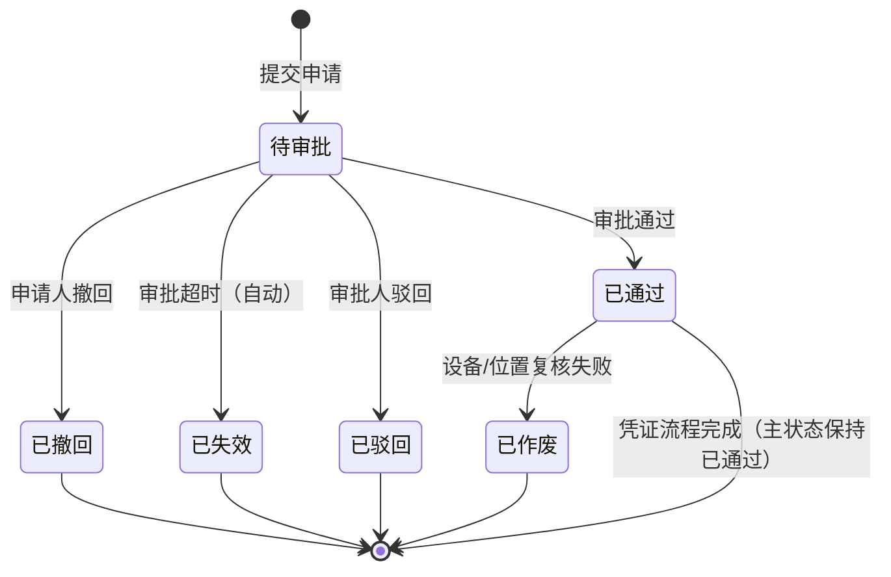
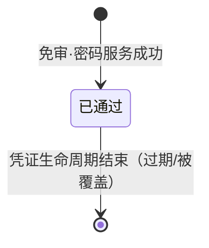
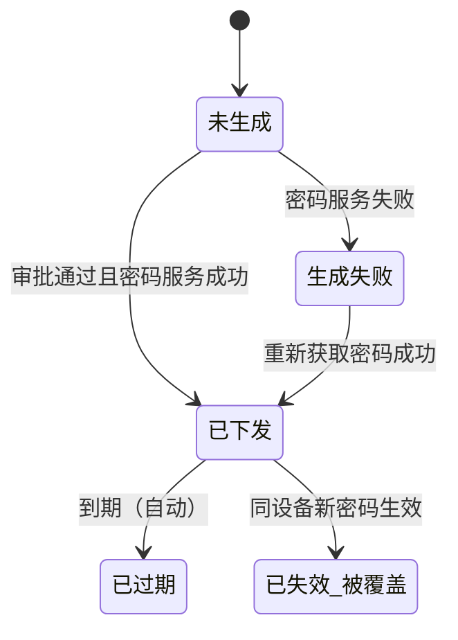

# 开锁申请 业务规则规格

> **文档定位**：开锁申请（`UNLOCK_APPLY`）单据、临时开锁凭证的状态机、动作约束、校验规则、权限与审计的**唯一定义来源**。
>
> **模块类型**：单据类 + 凭证生命周期（审批处理由「其他审批—开锁审批」承载）
>
> **所属层级**：审批中心子类型 `UNLOCK_APPLY`
>
> **参考文档**：[《开锁申请字段清单》](./开锁申请字段清单.md)、[《审批中心业务规则规格》](../../../../🌟🌟🌟-最新基准版/B端PC/01-工作中心/01-审批中心/02-审批中心业务规则规格.md)（平台任务与通用审批动作）、[《门禁开锁审批配置业务规则规格》](../../../06-门禁开锁审批/01-审批配置/门禁开锁审批配置业务规则规格.md)、[《门禁开锁审批-业务规则规格》](../../../06-门禁开锁审批/门禁开锁审批-业务规则规格.md)（全链路编排）、[《门禁开锁审批-业务流程推演》](../../../06-门禁开锁审批/门禁开锁审批-业务流程推演.md)、[《门禁设备业务规则规格》](../../../01-物联网IOT管理/02门禁设备/门禁设备业务规则规格.md)、[《门禁事务业务规则规格》](../../../01-物联网IOT管理/03门禁事务/门禁事务业务规则规格.md)
>
> **职责边界**：本文件定义开锁申请单据、凭证下发规则；**通用审批任务状态机与 R10–R13、R18–R19 等平台规则**见 [审批中心业务规则规格](../../../../🌟🌟🌟-最新基准版/B端PC/01-工作中心/01-审批中心/02-审批中心业务规则规格.md)。**不包含**审批配置的创建、启停用与匹配写入——上述规则见 [06/01-审批配置](../../../06-门禁开锁审批/01-审批配置/门禁开锁审批配置业务规则规格.md)。**不包含**门禁事务与申请的强制关联及详情展示——门禁事务在门禁事务模块独立维护。
>
> **版本**：V2.4 | 2026-09-02
>
> **菜单地图**：[B端PC/00-菜单地图](../../../../🌟🌟🌟-最新基准版/B端PC/00-菜单地图.md) · [B端H5/00-菜单地图](../../../../🌟🌟🌟-最新基准版/B端H5/00-菜单地图.md) · **审批人 UI 唯一定义来源**：[03-开锁审核主PRD](../../05-其他审批/03-开锁审核/开锁审核主PRD.md)

---

## 0. 统一执行模型约束

- 设计原则：**挂锁**须分别留痕 `审批通过 ≠ 密码生成成功 ≠ 短信发送成功`；**人脸**不涉及短信，留痕 `审批通过 ≠ 密码生成成功`（详见 §0.1）。**不在申请详情中追踪实际开锁事实**——门禁事务与申请取消强制关联（见 §五）。
- 申请提交时固化设备/位置/配置 **配置编号 + 配置版本 + 审批方式 + 审批节点快照**（C04，定义见配置模块）。
- **申请状态**、**凭证状态**、**审批处理状态** 三层独立，禁止混写在同一状态字段。
- 配置匹配（C01–C03）在门禁设备模块按设备 ID 执行；本模块在申请创建时消费匹配结果并写入快照。
### 0.1 凭证下发通道（系统设计约束 · 2026-08-31）

> 唯一定义来源：[门禁设备业务规则规格 §〇](../../../01-物联网IOT管理/02门禁设备/门禁设备业务规则规格.md)

| 设备类型 | 审批通过后 | 短信 | 申请人获取密码 |
| :--- | :--- | :---: | :--- |
| **挂锁门禁** | 密码服务 + 短信网关 | ✅ | 短信 + 详情页查看 |
| **人脸门禁** | 仅密码服务 | ❌ | **仅详情页**查看/复制 |

- 设计原则对**挂锁**仍适用：`审批通过 ≠ 密码生成成功 ≠ 短信发送成功`。
- **人脸**不涉及短信环节：`审批通过 ≠ 密码生成成功`。
- **挂锁 / 人脸统一**：密码服务成功 → 凭证=`DELIVERED`（详情可查看/复制）；**短信发送失败、三方平台下发结果均不改变凭证状态**（R31 不维护短信/三方下发状态字段）。

> **系统入口约定（研发已确认）**：
> - **审批人处理（PC）**：工作中心 → 审批中心 → 其他审批 → **开锁审批**。
> - **审批人处理（H5）**：业务办理 → 其他审批 → **开锁审批**。
> - **不**接入系统「接入流程配置」，**不**进入 07 审批中心「待处理/已处理」。
> - **申请人查询（PC）**：工作中心 → 审批中心 → 我的申请管理 → Tab「**我的开锁申请**」。
> - **申请人查询（H5）**：业务办理 → 我的申请记录 → 筛选「**开锁审批**」。
> - 通用审批动作字段（通过/驳回/意见）口径仍引用 [审批中心业务规则规格](../../../../🌟🌟🌟-最新基准版/B端PC/01-工作中心/01-审批中心/02-审批中心业务规则规格.md) R10–R13，**仅 UI 入口不同**。

---

## 一、能力定位

| 项目 | 内容 |
| :--- | :--- |
| **模块层级** | 授权意图单据层 + 凭证层 |
| **菜单/入口** | **发起**：门禁设备「获取门锁密码」→ 命中需审批规则后提交；**审批**：工作中心 → 审批中心 → 其他审批 → 开锁审批（PC）；业务办理 → 其他审批 → 开锁审批（H5）；**查询（PC）**：我的申请管理 → Tab「我的开锁申请」；**查询（H5）**：我的申请记录 → Tab「开锁审核」 |
| **核心职责** | 记录临时开锁授权意图（需审批）或直发凭证事实（免审）；需审批路径驱动其他审批处理与凭证下发 |
| **上游依赖** | **门禁设备**：设备类型、绑定位置、获取密码权限；**开锁审批配置**：已启用规则及 C01–C03 按设备 ID 匹配结果（免审路径不写入配置快照）；**人员/RBAC**：审批节点展开（仅需审批） |
| **下游影响** | **密码服务**（全类型）；**短信服务**（仅挂锁） |
| **审核流** | **有**——6.2 固定 **任一人通过**；数据模型保留按顺序审批枚举供扩展 |

---

## 二、开锁申请

> 单据类对象，具备完整审批生命周期；凭证处理状态独立维护，不混入申请主状态。

### 2.1 单据定位

| 项目 | 内容 |
| :--- | :--- |
| **单据层级** | 第2层-订单层（授权意图单据） |
| **核心职责** | 记录一次临时开锁授权意图，驱动其他审批处理与凭证下发 |
| **单据来源** | 门禁设备「获取门锁密码 / 获取门禁密码」：**需审批**—命中规则后提交申请；**免审**—未命中规则且密码服务返回成功后自动落单（§2.7） |
| **上游对象** | 门禁设备（1:1）；审批配置（需审批时按版本匹配 1:1；免审为空） |
| **下游影响** | **需审批**：生成审批任务 → 通过后触发凭证；**免审**：同步生成凭证并落单 |
| **审核流** | **需审批**时有审核流；**免审**无审核流（`approval_required=false`） |

### 2.2 状态定义

| 状态名称 | 枚举值 | 业务含义 | 是否终态 | 进入条件 | 离开条件 |
| :--- | :--- | :--- | :---: | :--- | :--- |
| 待审批 | `PENDING` | 已提交，等待审批人处理；审批前无临时密码 | 否 | 申请创建成功 | 通过 / 驳回 / 撤回 / 超时失效 |
| 已通过 | `APPROVED` | 审批结论为通过；凭证可能仍在生成或下发中 | 否 | 任一人通过即审批完成 | 凭证流程完成（凭证状态独立跟踪）；异常作废 |
| 已驳回 | `REJECTED` | 审批人驳回，不生成密码 | **是** | 审批人驳回 | — |
| 已撤回 | `WITHDRAWN` | 申请人主动撤回 | **是** | 申请人撤回 | — |
| 已失效 | `EXPIRED` | 审批超时未处理 | **是** | 定时任务超时判定 | — |
| 已作废 | `VOIDED` | 审批通过后、凭证生成前设备/位置复核失败（系统自动） | **是** | R15 复核失败 | — |

**设计说明**：

- 「凭证处理中」「已下发」属于**凭证状态**（见第四章），申请主状态「已通过」可与凭证「生成失败」同时存在。
- 状态变更禁止通过表单 Dropdown 直接修改，必须通过独立动作按钮触发。

### 2.3 状态流转图

### 2.4 状态流转表（核心规则矩阵）

| 当前状态 | 触发动作 | 前置校验条件 | 结果状态 | 二次确认弹窗 | 后置级联影响 | 失败阻断提示 |
| :--- | :--- | :--- | :--- | :--- | :--- | :--- |
| — | 提交申请 | R05: 设备类型、权限、绑定状态、手机号校验通过 R06: 设备 ID 命中需审批配置 R07: 无同设备在途申请 R08: 请求幂等键有效 R28/R30: 节点展开有效 | 待审批 | 无 | ① 固化设备/位置/审批人/配置版本快照 ② 审批方式=任一人通过，创建并行待办 ③ 建立防重复控制 ④ 推送审批待办 ⑤ 凭证=未生成 | Toast: 「提交失败：{具体原因}」 |
| 待审批 | 撤回 | R09: 申请人本人 | 已撤回 | 「撤回后审批待办将关闭，确认撤回？」 | 关闭审批任务；释放防重复控制 | Toast: 「撤回失败：申请状态已变更」 |
| 待审批 | 审批通过 | [R10–R12](../../../../🌟🌟🌟-最新基准版/B端PC/01-工作中心/01-审批中心/02-审批中心业务规则规格.md) | 已通过 | 无（审批意见选填/必填按配置） | ① 平台关闭/推进审批任务 ② 触发凭证生成流程 ③ 凭证状态=待生成 | Toast: 「审批失败：{具体原因}」 |
| 待审批 | 审批驳回 | [R10、R13](../../../../🌟🌟🌟-最新基准版/B端PC/01-工作中心/01-审批中心/02-审批中心业务规则规格.md) | 已驳回 | 无 | 关闭任务；释放防重复控制；通知申请人 | Toast: 「驳回失败：申请状态已变更」 |
| 待审批 | 超时失效 | R14: 超过配置超时时间（系统自动） | 已失效 | 系统自动，无需确认 | 关闭任务；释放防重复控制；通知申请人 | — |
| 已通过 | 凭证复核作废 | R15: 设备解绑/移除/位置失效 | 已作废 | 无（系统自动） | 不生成凭证；通知申请人 | — |

### 2.5 动作能力矩阵

| 操作动作 | 待审批 | 已通过 | 已驳回 | 已撤回 | 已失效 | 已作废 |
| :--- | :---: | :---: | :---: | :---: | :---: | :---: |
| 查看详情 | ✅ | ✅ | ✅ | ✅ | ✅ | ✅ |
| 编辑 | ❌ | ❌ | ❌ | ❌ | ❌ | ❌ |
| 撤回 | ✅（申请人；**仅** `approval_required=true` 且待审批） | ❌ | ❌ | ❌ | ❌ | ❌ |
| 审批通过 | ✅（审批人） | ❌ | ❌ | ❌ | ❌ | ❌ |
| 审批驳回 | ✅（审批人） | ❌ | ❌ | ❌ | ❌ | ❌ |
| 查看密码 | ❌ | ✅（条件：凭证=已下发） | ❌ | ❌ | ❌ | ❌ |
| 重新获取密码 | ❌ | ✅（凭证=生成失败） | ❌ | ❌ | ❌ | ❌ |

### 2.6 特殊动作对比（撤回 vs 驳回 vs 失效 vs 作废）

| 维度 | 撤回 | 驳回 | 失效（超时） | 作废 |
| :--- | :--- | :--- | :--- | :--- |
| **触发方** | 申请人 | 审批人 | 系统定时任务 | 系统复核（R15） |
| **适用状态** | 待审批 | 待审批 | 待审批 | 已通过（凭证生成前） |
| **是否生成密码** | 否 | 否 | 否 | 否 |
| **可否重新申请** | 可（释放防重后可新提） | 可（本期不允许原单修改再提交） | 可 | 视情况 |

### 2.7 免审直发记录（`approval_required=false`）

> **产品定位**：Tab「我的开锁申请」/ H5「开锁审批」展示本人**全部**开锁授权记录；筛选项「是否需要审核 = 否」专指本节对象。弹窗交互仍由门禁设备模块定义；本模块负责单据、凭证与申请人侧查询。

| 项目 | 规则 |
| :--- | :--- |
| **创建时机** | 免审弹窗确认且密码服务返回成功（挂锁含短信结果；人脸仅页面凭证） |
| **是否需要审核** | 固定 `false`；列表/详情展示「否」或 Tag「无需审核」 |
| **初始主状态** | `APPROVED`（已通过）；**不经过** `PENDING` |
| **初始凭证状态** | 密码服务成功 → `DELIVERED`（挂锁/人脸统一；短信或三方下发结果不影响凭证状态） |
| **不写入** | 审批配置快照、审批人快照、预计使用时段、审批任务 |
| **不展示** | 详情页隐藏「审批配置快照」「审批记录」分区 |
| **不可用动作** | 撤回、审批通过/驳回（无在途审批） |
| **凭证回看** | 与 §4.3 一致：有效期内详情可查看/复制；过期/被覆盖仅展示摘要，不展示明文 |
| **Deep link** | 可选 `ROUTE-IOT-DIRECT-01`：免审成功后打开本 Tab 并定位新记录详情 |
| **防重** | **不**适用 R07（在途审批防重）；沿用门禁设备 60 秒同设备防重复提交；幂等键重复返回原单号及状态 |
| **后台留痕** | 不写入与申请强制关联的门禁事务；凭证与审批结论在本模块独立留痕 |

| 当前状态 | 触发动作 | 前置校验 | 结果 | 后置影响 |
| :--- | :--- | :--- | :--- | :--- |
| — | 免审直发 | R05′：权限/仓库/设备有效；挂锁须绑定手机号；**未**命中需审批（R06） | 已通过 + 凭证已下发 | ① 创建 `approval_required=false` 记录 ② 生成凭证 ③ 可选 Deep link |

---

## 三、审批处理（其他审批入口）

> 开锁申请**不**注册至 07 审批中心「待处理/已处理」。审批人通过 `工作中心 → 审批中心 → 其他审批 → 开锁审批（PC）；业务办理 → 其他审批 → 开锁审批（H5）` 处理；列表展示字段见 [03-开锁审核列表与详情展示字段清单](../../05-其他审批/03-开锁审核/操作字段清单/01列表与详情展示字段清单.md)。
>
> 审批动作约束（R10–R13、R18–R19）仍引用 [审批中心业务规则规格](../../../../🌟🌟🌟-最新基准版/B端PC/01-工作中心/01-审批中心/02-审批中心业务规则规格.md)；操作字段见 [通用审批操作字段清单](../../../../🌟🌟🌟-最新基准版/B端PC/01-工作中心/01-审批中心/03-业务审批/00-通用审批操作字段清单.md)。

### 3.1 接入渠道与关联

| 项目 | 内容 |
| :--- | :--- |
| **biz_type** | `UNLOCK_APPLY` |
| **审批人入口** | 工作中心 → 审批中心 → 其他审批 → 开锁审批（PC）；业务办理 → 其他审批 → 开锁审批（H5）（**无**接入流程配置，**不进**待处理） |
| **申请人入口** | PC：我的申请管理 → Tab「我的开锁申请」；H5：我的申请记录 → Tab「开锁审核」 |
| **关联键** | 其他审批单据 `业务单号` = 本模块 `申请单号` |
| **分发** | 申请创建成功后，按配置快照以 **任一人通过** 模式将单据推送至「其他审批—开锁审批」供 eligible 审批人并行处理 |
| **审批可见性** | 所有参与审批的人员（含已通过/已关闭待办的审批人）均可查看审批记录及最终审批人信息 |

### 3.2 提交时节点解析规则

> 通用审批方式见 [审批中心业务规则规格 §2.2](../../../../🌟🌟🌟-最新基准版/B端PC/01-工作中心/01-审批中心/02-审批中心业务规则规格.md#22-通用审批方式规则)。**6.2 开锁审批固定为任一人通过**；本节定义本子类型在**申请提交时**对配置快照的消费与展开。

| 规则ID | 规则 | 归属 |
| :--- | :--- | :--- |
| **R28** | 指定角色节点在申请提交时展开并写入 **审批人快照**；在途不重算 | 本模块提交时执行 |
| **R30** | 角色节点展开后 eligible 为空则阻断提交 | 本模块提交时执行 |

> R27（节点类型定义与配置保存校验）见 [门禁开锁审批配置业务规则规格](../../../06-门禁开锁审批/01-审批配置/门禁开锁审批配置业务规则规格.md)。R29 已移除（配置仅指定设备）。

---

## 四、临时开锁凭证

> 记录密码生成、发送和使用生命周期；状态独立于申请主状态。

### 4.1 状态定义（6.2 精简 · 5 态）

> **6.2 收敛原则**：仅保留系统**可观测、可维护**的状态；不展示「生成中」「已生成（待下发）」「已使用」「已撤销」「密码下发失败」。**不单独维护**短信发送状态、三方平台下发状态字段与「重新下发短信」UI。

| 状态名称 | 枚举值 | 业务含义 | 是否终态 |
| :--- | :--- | :--- | :---: |
| 未生成 | `NOT_GENERATED` | 申请待审批、审批未通过或尚未进入凭证流程 | 否 |
| 已下发 | `DELIVERED` | 密码服务调用成功，且申请人可在详情页查看/复制 | 否 |
| 生成失败 | `GEN_FAILED` | 密码服务调用失败，未产生有效密码 | 否 |
| 已过期 | `EXPIRED` | 超过密码有效期 | **是** |
| 已失效（被覆盖） | `SUPERSEDED` | 同设备新密码生效导致旧凭证失效 | **是** |

> **挂锁 / 人脸统一**：
> - 密码服务成功 → `DELIVERED`（详情展示密码）；**短信成败、三方平台下发结果均不影响**凭证状态。
> - 密码服务失败 → `GEN_FAILED`；申请人可「重新获取密码」。

### 4.2 状态流转图

### 4.3 凭证关键规则

| 规则ID | 规则 |
| :--- | :--- |
| **R20** | 审批通过且设备复核仍有效时才调用密码服务；复核失败则申请→已作废，不生成凭证 |
| **R21** | 密码生成采用幂等请求；重复调用不得生成多份有效密码 |
| **R22** | 密码明文不得写入数据库、审批记录、运行日志和审计日志；申请人可在页面查看密码明文（沿用现有能力） |
| **R23** | 申请人可发起**重新获取密码**：凭证=`GEN_FAILED`（全设备类型）。成功后→`DELIVERED`；须幂等 |
| **R31** | 本模块**不维护**短信发送状态、重发短信、已使用、主动撤销等不可观测状态与 UI |
| **R24** | 同设备生成新密码并生效时，上一条仍有效凭证→已失效（被新密码覆盖）；旧申请审批结论不回退 |
| **R25** | 申请人打开旧申请详情且凭证已被覆盖时，提示：「设备密码已被更新，原密码已失效。」 |
| **R26** | 挂锁门禁临时密码有效期为 3 天（沿用门禁设备 R02）；人脸门禁按设备参数扩展 |

### 4.4 查看与下发操作

| 操作 | 允许条件 | 处理结果 | 安全约束 |
| :--- | :--- | :--- | :--- |
| 查看临时密码 | 凭证=`DELIVERED` 且仍在有效期内 | 返回凭证明文供页面展示与复制 | 服务端实时校验 |
| 复制临时密码 | 凭证=`DELIVERED`；密码卡片已展示 | 写入剪贴板 | 不记录明文 |
| 重新获取密码 | 申请=`APPROVED`；凭证=`GEN_FAILED`；未过期、未被覆盖 | 成功→`DELIVERED` 并展示密码 | 幂等（R23） |
| 查看失效原因 | 凭证已过期或被覆盖；或生成失败 | 展示状态和原因，隐藏或禁用密码卡片 | 被覆盖时提示「设备密码已被更新，原密码已失效」 |

> **6.2 不含**：重新下发短信、凭证撤销、已使用回写。「重新获取密码」与「重新下发短信」为不同操作——前者由申请人触发、面向密码获取失败；后者不在本模块维护。

---

## 五、门禁事务（不在本模块关联）

> **评审结论（2026-09-01）**：取消门禁事务与开锁申请之间的**强制关联**；申请详情**不展示**「关联事务」分区。理由：历史门禁事务多以临时 user ID 标识操作者，无法准确反映实际开锁人，关联展示不具备追踪价值。门禁事务在 [门禁事务模块](../../../01-物联网IOT管理/03门禁事务/) 独立查询，本模块不参与写入、回写或详情联动。

| 规则ID | 规则 |
| :--- | :--- |
| **W00** | 本模块**不**维护申请与门禁事务的关联字段、关联状态及详情展示 |
| **W00a** | 凭证生成成功**不强制**写入并关联「获取密码成功」门禁事务；若设备/IOT 侧仍有独立事务上报，不与 `apply_no` 绑定 |
| **W00b** | 审计追溯以本模块的申请、审批、凭证记录为准；实际开锁事实以门禁事务模块独立记录为准，二者不做强制对账 |

> 原 W01–W05 事务关联规则**废止**；门禁事务本体见《门禁事务业务规则规格》。

---

## 六、校验规则（本子类型）

| 规则ID | 规则分类 | 具体规则定义 | 失败阻断提示 |
| :--- | :--- | :--- | :--- |
| **R05** | 申请校验 | 申请人须具备获取密码权限、仓库数据权限；**挂锁**须已绑定手机号 | 「无获取密码权限」/「请先绑定手机号」 |
| **R05′** | 免审校验 | 同 R05；**人脸**不要求绑定手机号 | 同上 |
| **R06** | 路径分流 | **设备 ID 命中**需审批配置 → 创建 `approval_required=true` 待审批单；**未命中** → 走免审弹窗，成功后按 §2.7 落单 | 路径错误时后端兜底 |
| **R07** | 防重校验 | 同一设备不得存在多个在途 **`approval_required=true`** 审批申请 | 「设备已有在途申请{单号}，请等待处理完成」 |
| **R08** | 幂等校验 | 申请创建须携带请求幂等键；重复提交返回原申请结果 | 返回原申请单号及状态 |
| **R09** | 撤回校验 | 仅申请人本人可撤回待审批申请 | 「撤回失败：无操作权限」 |
| **R14** | 超时规则 | 超过配置超时时间未处理，系统自动置为已失效 | 系统通知申请人 |
| **R15** | 复核校验 | 凭证生成前重新校验设备绑定、位置有效性及申请状态 | 申请→已作废 |

> **6.2 不含人工管理动作**：管理员异常关闭（原 R16）、凭证主动撤销（原 P06）已废止；见 §4.4、R31 及修订 V2.0/V2.3。

> 配置侧 R01–R04a、C01–C04 见 [门禁开锁审批配置业务规则规格](../../../06-门禁开锁审批/01-审批配置/门禁开锁审批配置业务规则规格.md)。平台审批 R10–R13、R18–R19 见 [审批中心业务规则规格](../../../../🌟🌟🌟-最新基准版/B端PC/01-工作中心/01-审批中心/02-审批中心业务规则规格.md)。

---

## 七、权限与数据隔离规则（本子类型）

| 规则ID | 规则分类 | 具体规则定义 | 异常/无权限处理 |
| :--- | :--- | :--- | :--- |
| **P03** | 申请查看 | 须具备 `[门禁设备 · 获取密码]` 或申请相关查看权限 | 阻断操作 |
| **P07** | 审计查看 | 审计/风控人员可查询申请、审批、凭证完整证据链 | 按角色过滤敏感字段；门禁事务见独立模块 |

> 平台审批操作 P04、数据隔离 P05 见 [审批中心业务规则规格](../../../../🌟🌟🌟-最新基准版/B端PC/01-工作中心/01-审批中心/02-审批中心业务规则规格.md)。配置菜单 P01–P02 见配置模块规格。

---

## 八、并发、幂等与审计（本子类型）

| 规则ID | 规则 |
| :--- | :--- |
| **A01** | 申请创建必须具备请求幂等键，重复点击不能产生多张有效申请 |
| **A03** | 凭证生成前必须再次校验申请状态、设备状态和位置绑定 |
| **A04** | 申请、凭证、短信和实际开锁事件均记录操作人、时间、设备编码、请求标识、前后状态和失败原因 |
| **A05** | 严禁在业务库、审批记录和日志中保存密码明文和短信全文 |
| **A06** | 新旧凭证、关联申请、生成时间和覆盖原因写入审计关系 |

> 平台审批并发 A02 见 [审批中心业务规则规格](../../../../🌟🌟🌟-最新基准版/B端PC/01-工作中心/01-审批中心/02-审批中心业务规则规格.md)。配置侧审计见配置模块规格。

---

## 九、边界与异常处理

### 9.1 运行时配置冲突

| 场景 | 处理方式 |
| :--- | :--- |
| 设备命中多条冲突配置（C03 运行时） | 阻断申请提交，提示管理员修正配置 |
| 配置已停用但在途申请引用旧版本 | 正常；C04 保证快照不变 |
| 角色节点展开后无 eligible 人员 | R30 阻断提交 |

### 9.2 凭证异常

| 场景 | 处理方式 |
| :--- | :--- |
| 挂锁 · 短信发送失败 | 凭证保持 `DELIVERED`；详情照常展示密码；本模块不记录短信状态 |
| 人脸 · 三方平台下发失败 | 凭证保持 `DELIVERED`；详情照常展示密码；三方下发结果不在本模块凭证状态体现 |
| 同设备新密码覆盖 | R24 旧凭证→已失效（被覆盖）；R25 详情页提示 |

### 9.3 本模块不处理的场景

| 场景 | 归属 |
| :--- | :--- |
| 审批配置新增/启停用/匹配写入 | [06/01-审批配置](../../../06-门禁开锁审批/01-审批配置/) |
| 通用审批任务状态机与平台动作 | [审批中心业务规则规格（基准）](../../../../🌟🌟🌟-最新基准版/B端PC/01-工作中心/01-审批中心/02-审批中心业务规则规格.md) |
| 门禁事务本体字段与入库逻辑 | 《门禁事务业务规则规格》 |
| 免审弹窗 UI 与表单校验 | [门禁设备主PRD §5.5](../../../01-物联网IOT管理/02门禁设备/门禁设备主PRD.md) |

---

## 十、规则索引

| 规则类型 | 代码范围 | 说明 |
| :--- | :--- | :--- |
| 申请/审批校验 | R05 – R09、R14 – R15、R28、R30 | 提交、撤回、超时、复核、节点展开 |
| 凭证规则 | R20 – R26、R31 | 生成、下发、覆盖、有效期；不含撤销/重发短信 |
| 配置引用 | R27 | 定义在配置模块；本模块消费快照 |
| 事务边界 | W00 – W00b | 不与门禁事务强制关联 |
| 权限规则 | P03、P07 | 申请查看、审计 |
| 审计规则 | A01 – A06 | 幂等、并发、留痕（申请执行链） |

> 配置匹配与快照 C01–C04 见配置模块；全链路编排见 [《门禁开锁审批-业务规则规格》](../../../06-门禁开锁审批/门禁开锁审批-业务规则规格.md) §五。

---

## 业务流程与联动

> 本模块覆盖推演 **阶段二至三：申请 → 审批 → 凭证**；完整时序见 [《门禁开锁审批-业务流程推演》](../../../06-门禁开锁审批/门禁开锁审批-业务流程推演.md) §三；联动摘要见 [全链路规格](../../../06-门禁开锁审批/门禁开锁审批-业务规则规格.md) §五。

| 上游动作 | 触发条件 | 后置影响 |
| :--- | :--- | :--- |
| 提交开锁申请 | R05–R08、R28、R30 通过 | 申请=待审批；生成并行审批任务；凭证=未生成 |
| 审批通过 | R10–R12 通过 | 申请=已通过；进入凭证流程 |
| 审批驳回/撤回/超时 | 对应校验通过 | 申请终态；关闭任务；释放防重 |
| 凭证生成与下发 | R20 复核通过 | 凭证生命周期独立流转 |

---

## 修订记录

| 日期 | 版本 | 变更摘要 |
| :--- | :---: | :--- |
| 2026-08-28 | V1.0 | 从全链路规格第三至六章及执行侧规则拆出独立唯一定义来源；与 01-审批配置 对称 |
| 2026-08-28 | V1.3 | 研发确认双端菜单：PC 工作中心→审批中心→其他审批→开锁审批；H5 业务办理→其他审批→开锁审批 |
| 2026-08-28 | V1.2 | 删除平台层重复规则（R10–R13、P04–P05、A02）；收窄本子类型 唯一定义边界 |
| 2026-08-28 | V1.4 | 将申请人查看密码、复制密码和短信重发拆为独立操作字段清单；明确 03-开锁审核 审批人侧不展示密码明文 |
| 2026-08-31 | **V1.5** | 修复文档编码损坏；目录迁移至 03-业务审批/04-我的申请管理/04-开锁审批；更新交叉引用与申请人入口（PC Tab / H5 筛选） |
| 2026-08-31 | **V1.6** | 凭证下发按设备类型分流：短信仅挂锁，人脸仅页面（§0.1、R31） |
| 2026-09-01 | **V1.7** | 免审成功后写入 `approval_required=false` 记录；纳入我的申请记录；R06/R07 按是否需审批分流 |
| 2026-09-01 | **V1.8** | 同步 06 评审：配置按设备 ID 匹配（C01–C03）；审批方式固定任一人通过；取消门禁事务强制关联（W00）；详情移除关联事务 |
| 2026-09-01 | **V1.9** | 申请人详情「凭证信息」区 6.2 暂不接入；§4.4 操作 UI 延后；列表凭证状态保留 |
| 2026-09-02 | **V2.4** | 废止 `DELIVERY_FAILED`（密码下发失败）；凭证精简为 **5 态**；挂锁/人脸统一「密码服务成功即已下发」 |
| 2026-09-02 | **V2.2** | 挂锁短信失败→凭证仍 `DELIVERED`；`DELIVERY_FAILED` 仅人脸三方下发失败（**V2.4 废止**） |
| 2026-09-02 | **V2.1** | 恢复 `DELIVERY_FAILED`；新增 R23 与「重新获取密码」；申请人详情凭证区重新接入 |
| 2026-09-02 | **V2.3** | 同步 V2.0 范围：§2.5 移除「撤销凭证」「管理员异常关闭」；废止 R16/P06；已作废仅保留 R15 系统复核 |
| 2026-09-02 | **V2.0** | §4 凭证状态精简；移除生成中/短信/已使用/已撤销及对应 UI；不含凭证撤销与管理员异常关闭 |

---

## 设计自检清单

- [x] 申请/凭证/任务三层状态独立，无混写；不与门禁事务强制关联
- [x] 职责不含审批配置 CRUD 与 C01–C03 写入
- [x] 规则 ID 与全链路规格 R05–R09、R14–R15、R20–R26、R28、R30、R31、W00、P03/P07 保持一致；平台 R10–R13 见审批中心规格
- [x] 字段名称与《开锁申请字段清单》及子清单一致
- [x] 未引入推演与全链路规格未确认的新规则
- [x] 申请人详情「凭证信息」区已接入（密码展示/复制、重新获取密码）
- [x] 免审直发落单（§2.7）已定义；详情不含关联事务；凭证状态保留可观测 **5 态**（不含密码下发失败）
