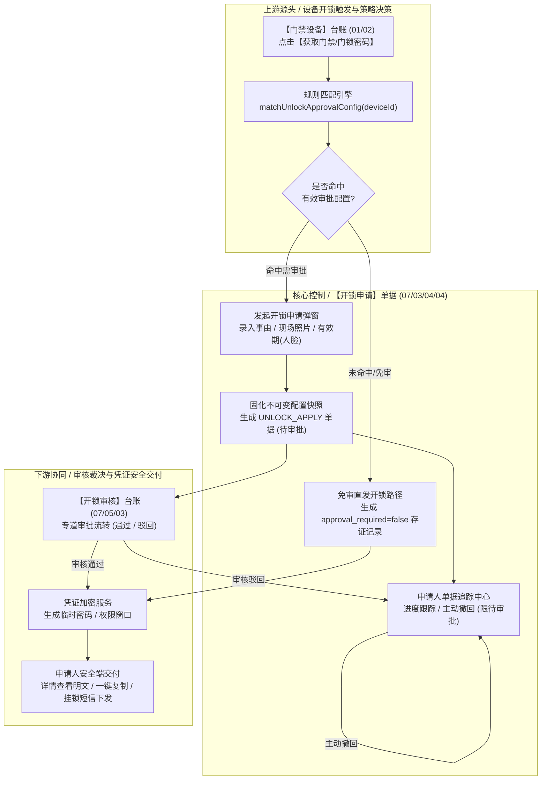
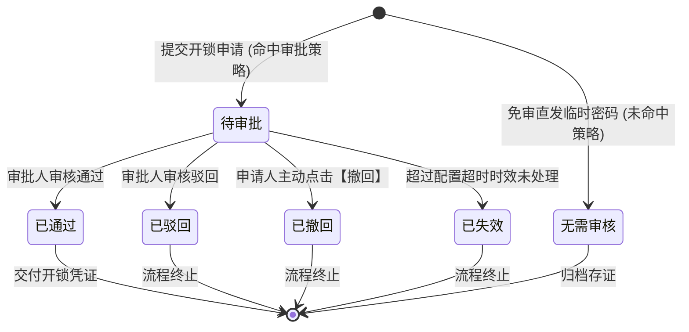

# 开锁申请 主PRD

> **文档体系（三件套为核心）**：
>
> | 层级 | 文档 | 职责 | 真源 |
> | :--- | :--- | :--- | :---: |
> | **核心** | 本文（主 PRD） | 业务背景、痛点、功能范围、模块架构、**页面功能说明**、业务场景、状态机摘要、规则摘要、验收 | ✅ |
> | **核心** | [开锁申请字段清单](./开锁申请字段清单.md) | 字段定义、发起/列表/详情/凭证查看、展示顺序、必填性与控件规格 | ✅ |
> | **核心** | [开锁申请业务规则规格](./开锁申请业务规则规格.md) | 状态机本体、R/C/P 规则、计算口径、动作矩阵、异常矩阵、时序图 | ✅ |
> | *衍生* | ASCII 线框 / Demo 文档 | 由三件套派生的可视化与原型输入，**非独立真源** | ❌ |
>
> **版本**：V4.0 基准版 | **更新时间**：2026-09-18 | **责任人**：产品架构组
>
> **统一引用规范**：
> - 本单据：【开锁申请】单据（菜单：工作中心 → 审批中心 → 业务审批 → 我的申请管理 → 开锁申请，代号 07/03/04/04）
> - 上游策略：【开锁审批配置】策略（菜单：配置管理 → 业务流程管理 → 开锁审批，代号 06/01）
> - 协同审核：【开锁审核】台账（菜单：工作中心 → 审批中心 → 其他审批 → 开锁审核，代号 07/05/03）
> - 设备实体：【门禁设备】台账（菜单：物联网IOT管理 → 门禁设备，代号 01/02）
> - 状态机与业务规则本体 → [《开锁申请业务规则规格》](./开锁申请业务规则规格.md)
> - 字段层级与属性 → [《开锁申请字段清单》](./开锁申请字段清单.md)

---

## 一、业务背景与业务痛点

### 1.1 业务背景
在动产质押与仓储监管业务中，监管仓库现场人员（库管员、查验员、货主代办人员）因日常货品盘点、质押物入库核验或提货出库，需频繁开启库房门禁设备（挂锁门禁或人脸门禁）。为满足金融机构对抵质押物理资产的穿透监管要求，必须对每一次开锁意图、开锁事由及现场证据进行完整记录与授权闭环。

【开锁申请】单据（菜单：工作中心 → 审批中心 → 业务审批 → 我的申请管理 → 开锁申请，代号 07/03/04/04）是现场申请人发起开锁授权意图、跟踪审批进度以及在审批通过后安全获取开锁凭证的载体。同时，系统支持对免审门禁开锁流水的一并归集（`approval_required=false`），实现「需审审批流转、免审全量存证」的双轨合规闭环。

### 1.2 核心业务痛点
* **【免审与需审两张皮导致审计断层】**：免审开锁若仅作为硬件交互无单据落账，会导致监管方事后复盘时无法获知免审开锁的具体责任人与事由，形成风控监管盲区。
* **【凭证权限扩散造成内鬼风险】**：若临时开锁密码在审批人端或日志中明文共享，一旦发生货权私移，难以界定泄密源头。必须确保临时密码仅向申请人单向交付。
* **【双端开锁体验割裂与消息延误】**：现场人员多在仓库作业一线使用移动端（H5），若申请进度反馈慢或需反复刷新，极易造成现场车辆滞留与操作延误。
* **【挂锁与人脸介质差异管控混乱】**：挂锁密码具有短时一次性特征，人脸门禁具备人脸白名单或特定时间段特征；若混同配置时效与下发通道，极易造成短信超频费用浪费或安防权限越期。

---

## 二、功能范围

| 包含功能范围 (In Scope) | 不包含功能范围 (Out of Scope) |
| :--- | :--- |
| **【双路径统一申请入库】**：支持命中配置时发起审批申请（`approval_required=true`），及免审直发时自动沉淀存证记录（`approval_required=false`）。 | **【审批配置规则维护】**：配置哪些设备需要审批及审批链，属于【开锁审批配置】策略（代号 06/01）。 |
| **【移动端/PC 双端发起】**：在【门禁设备】台账（代号 01/02）点击获取密码，自动弹出开锁申请弹窗，支持录入事由、照片与有效期。 | **【审批人审批处理】**：审批人在审批中心执行通过或驳回，属于【开锁审核】台账（代号 07/05/03）。 |
| **【全生命周期单据追踪】**：在「我的申请管理 → 开锁申请」中查看进度（待审批/已通过/已驳回/已撤回/已失效），支持未审批前主动撤回。 | **【常规通用流程审批】**：本申请专网专道运行，不进通用待办池。 |
| **【申请人专属凭证查看】**：审批通过后，仅申请人在申请详情中查看密码明文、一键复制，及挂锁门禁的短信通知（人脸门禁严禁发短信）。 | **【门禁硬件底层对接】**：不涉及门禁硬件 SDK 的直接报文解析与底层通信。 |

---

## 三、模块定位与系统链路

### 3.1 模块定位
【开锁申请】单据（菜单：工作中心 → 审批中心 → 业务审批 → 我的申请管理 → 开锁申请，代号 07/03/04/04）属于**业务单据与凭证交付层（Business Document & Credential Delivery Layer）**。它向上响应门禁设备的开锁交互，中游固化审批配置策略快照，下游衔接审批审核与凭证安全交付，是人货物理准入闭环的数字凭据中心。

### 3.2 系统链路图

---

## 四、业务场景与用户故事

| 场景编号与名称 | 触发角色 | 核心交互与风控约束 | 业务价值 |
| :--- | :--- | :--- | :--- |
| **【SC-01 现场查库发起审批申请】** | 驻库理货员 (`R-WH-OP`) | 在监管库房门口，通过移动端（H5）打开门禁列表，点击某保税库门挂锁的【获取门锁密码】。系统提示需审批，弹出申请页。理货员选择事由「日常巡检」，现场拍照上传仓门与锁具完好照片，点击【提交申请】。系统生成申请单据并提供查看详情入口。 | 规范现场开锁流程，完整采集现场事实证据。 |
| **【SC-02 审批通过安全获取凭证】** | 驻库理货员 (`R-WH-OP`) | 几分钟后理货员收到审批通过提示，进入「工作中心 → 审批中心 → 业务审批 → 我的申请管理 → 开锁申请」详情页。页面展示「已通过」，凭证卡片中展示生成的 6 位临时动态密码，理货员点击【复制密码】并在挂锁键盘输入完成开锁。 | 密码单向对申请人安全交付，避免多方知悉。 |
| **【SC-03 作业变更主动撤回申请】** | 提货经办人 (`R-CUST-USER`) | 提交开锁申请后，接到通知提货车辆晚点。在审批人尚未处理前，经办人在申请详情页点击【撤回申请】，二次确认后单据流转为「已撤回」，审批人端待办自动关闭。 | 避免无效待办积压，保持流程敏捷响应。 |
| **【SC-04 免审门禁快速通行存证】** | 现场普通库管 (`R-WH-USER`) | 对一般周转库房门禁点击【获取门锁密码】，系统判定未配置审批策略，直接弹出免审直发密码窗口。系统后台自动写入一条 `approval_required=false`、状态为「无需审核」的开锁记录，库管员后续可在我的申请中追溯凭据。 | 兼顾作业效率与全量审计存证合规要求。 |

---

## 五、状态机与动作能力矩阵

### 5.1 状态定义
* **待审批 (`PENDING`)**：申请已提交，等待合规审批人裁决，允许申请人主动撤回；
* **已通过 (`APPROVED`)**：审批人审核通过，申请终态，触发凭证计算并对申请人交付；
* **已驳回 (`REJECTED`)**：审批人审核驳回，申请终态，单据记录明确驳回原因；
* **已撤回 (`REVOKED`)**：申请人在审批前主动撤回，终态；
* **已失效 (`EXPIRED`)**：超过配置设定的超时时效未处理，系统自动标记失效，终态；
* **无需审核 (`NO_APPROVAL_REQUIRED`)**：免审直发模式下系统自动落账状态，终态，仅供审计存证。

### 5.2 状态流转图

### 5.3 动作能力矩阵

| 动作名称 | 待审批 (`PENDING`) | 已通过 (`APPROVED`) | 已驳回 (`REJECTED`) | 已撤回 (`REVOKED`) | 已失效 (`EXPIRED`) | 无需审核 (`NO_APPROVAL`) |
| :--- | :---: | :---: | :---: | :---: | :---: | :---: |
| **查看详情** | ✅ | ✅ | ✅ | ✅ | ✅ | ✅ |
| **主动撤回** | ✅ (二次确认) | ❌ | ❌ | ❌ | ❌ | ❌ |
| **查看/复制凭证** | ❌ (尚未生成) | ✅ (密码明文/复制) | ❌ | ❌ | ❌ | ✅ (免审密码明文) |
| **重新获取密码** | ❌ | ✅ (挂锁支持重查) | ❌ | ❌ | ❌ | ✅ (未失效前可重查) |

---

## 六、页面交互规格索引

### 6.1 发起开锁申请弹窗交互规格
* **唤起入口**：在【门禁设备】台账（代号 01/02）点击【获取门锁密码】或【获取门禁密码】，经规则匹配命中需审批配置时弹出。
* **设备信息展示区**：顶部展示设备名称、设备编码、设备类型、安装仓库与具体储位（只读）；
* **表单填写区**：
  - 开锁事由：单选下拉框（出库、入库、移库、盘点巡检、设备维保、其他），必填；
  - 补充说明：文本多行输入框，最多 200 字，选填；
  - 现场照片：上传组件，必填 1~3 张现场抓拍照片（支持手机现场拍照或相册选取）；
  - 通行有效期（仅人脸门禁展示并必填）：日期时间范围选择器，最长不超过 24 小时；挂锁门禁隐藏此项。
* **提交动作**：点击【提交申请】，成功后关闭弹窗，弹出成功提示并提供【查看申请详情】快捷跳转链接。

### 6.2 申请人列表页交互规格 (PC / H5)
* **PC 端菜单路径**：`工作中心 → 审批中心 → 业务审批 → 我的申请管理`（切换至「开锁申请」标签页）。
* **H5 移动端路径**：`工作台 → 审批中心 → 我的申请`（开锁审批专区分组）。
* **筛选区**：
  - 申请单号（精确匹配）；
  - 设备名称 / 编码（模糊搜索）；
  - 申请状态（全部、待审批、已通过、已驳回、已撤回、已失效、无需审核）；
  - 是否需要审核（全部 / 是 / 否）；
  - 提交时间（日期范围选择器）。
* **行操作区**：
  - 状态为「待审批」：展示【详情】、【撤回】；
  - 状态为「已通过」或「无需审核」：展示【详情】（点击进入可查看临时密码）；
  - 其他终态：展示【详情】。

### 6.3 申请人详情页交互规格
* **状态总览区**：展示申请单号、当前状态徽章、提交时间及最终审批结论；若被驳回则高亮展示驳回原因。
* **凭证信息专属分区 (仅已通过与无需审核展示)**：
  - 临时开锁密码：大字号突出展示明文密码，支持点击【一键复制】；
  - 凭证有效起止时间：展示密码生效与失效时间；
  - 短信通知状态（仅挂锁）：展示短信发送状态（已下发至手机号 `138****1234`）；人脸门禁展示「人脸权限已下发至设备」。
* **申请内容与佐证**：展示申请事由、现场照片缩略图（点击放大）及设备位置信息。
* **审批轨迹记录**：按时间轴顺序展示申请提交、各节点审批人审验意见及最终授权完成时间点。

---

## 七、核心业务规则索引与非功能需求

### 7.1 核心规则映射索引
| 规则类别 | 规则编号 | 规则名称 | 核心控制摘要 |
| :--- | :--- | :--- | :--- |
| **双轨入库** | R20 | 开锁全量单据沉淀规则 | 无论需审还是免审，均写入开锁申请数据表，保障审计零断层。 |
| **凭证专属** | R21 | 申请人凭证专属交付原则 | 临时开锁密码仅在申请人界面展示，严禁跨角色向审批人泄露。 |
| **短信边界** | R22 | R31 短信下发能力边界规则 | 挂锁门禁支持短信发送；人脸门禁严格禁止调用短信，仅界面展示。 |
| **撤回保护** | R23 | 待审批撤回与防并发控制 | 仅限待审批且审批人未裁决前可撤回；发生并发时先到先得。 |
| **时效控制** | R24 | 人脸有效期约束规则 | 人脸门禁有效起止跨度 $\le 24$ 小时，过期硬件权限自动注销。 |

### 7.2 非功能性需求
* **提交响应**：申请提交及照片上传响应时延 $\le 1.2\text{s}$；
* **凭证安全**：凭证密文在传输与存储中采用 AES-256 加密，前端明文展示需带会话级时效保护；
* **全量审计**：申请的发起、撤回、查看密码、复制密码行为全部计入合规安全审计日志。

---
*版本说明：V4.0 基准版 | 责任人：产品架构组 | 2026年09月*
