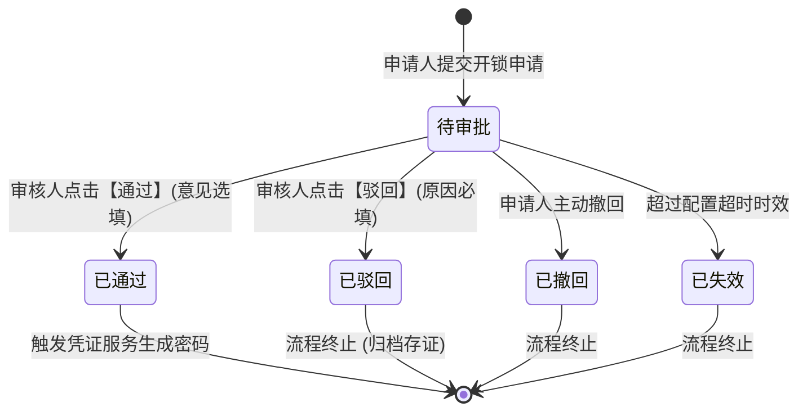
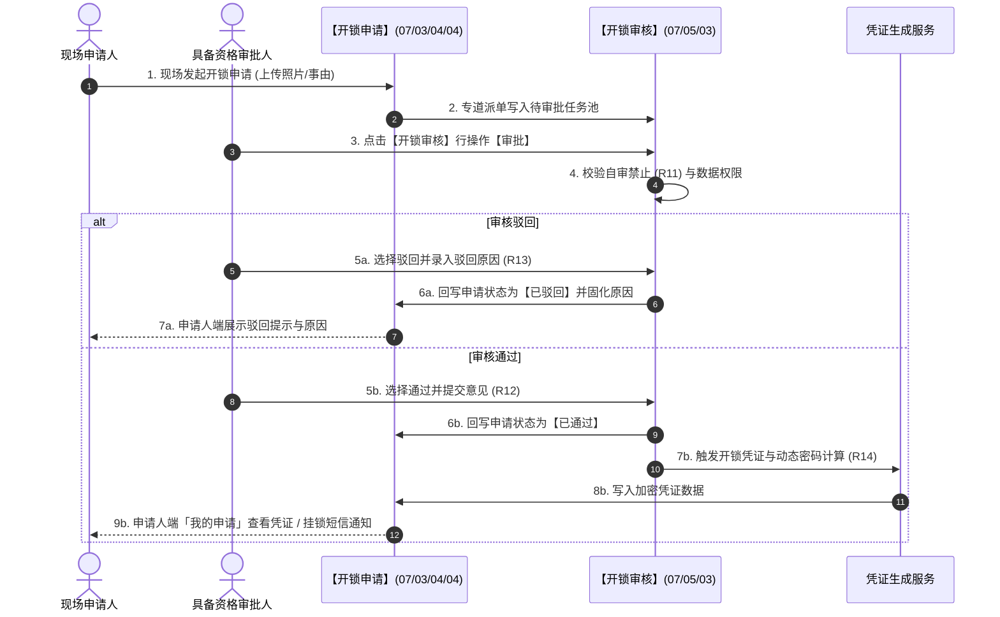

# 开锁审核 业务规则规格

> **文档定位**：**三件套核心**——状态机、动作约束、校验规则、计算联动、权限与跨模块流程的**唯一定义来源**。配套：[主PRD](./开锁审核主PRD.md)（业务与页面功能）、[字段清单](./开锁审核字段清单.md)（字段）。ASCII/Demo 为衍生，只引用本文件规则 ID，不重复定义规则本体。
>
> **统一引用规范**：
> - 本台账：【开锁审核】台账（菜单：工作中心 → 审批中心 → 其他审批 → 开锁审核，代号 07/05/03）
> - 上游策略：【开锁审批配置】策略（菜单：配置管理 → 业务流程管理 → 开锁审批，代号 06/01）
> - 协同单据：【开锁申请】单据（菜单：工作中心 → 审批中心 → 业务审批 → 我的申请管理 → 开锁申请，代号 07/03/04/04）
> - 设备实体：【门禁设备】台账（菜单：物联网IOT管理 → 门禁设备，代号 01/02）
>
> **版本**：V4.0 基准版 | **更新时间**：2026-09-18 | **责任人**：产品架构组

---

## 一、单据与能力定位

| 维度 | 标准定位规格 | 业务解释与控制边界 |
| :--- | :--- | :--- |
| **模块层级** | 授权执行交互层（Authorization Execution Layer） | 属于审批人专网专道工作台，独立于通用工作流引擎，专注于门禁准入秒级处理。 |
| **菜单路径** | `工作中心 → 审批中心 → 其他审批 → 开锁审核` | 挂载于审批中心首页卡片，无左侧二级菜单，系统代号为 `07/05/03`。 |
| **核心职责** | 门禁开锁申请的审验与授权决策 | 集中呈现管辖范围内门禁开锁申请，执行自审禁止拦截，提供通过/驳回操作与原因留痕。 |
| **单据/数据源头** | 继承开锁申请单据流水 | 上游数据来自【开锁申请】单据（代号 07/03/04/04），策略快照继承自【开锁审批配置】策略（代号 06/01）。 |
| **上下游协同** | 驱动凭证服务与申请状态回写 | 审批通过联动触发硬件凭证服务生成临时动态密码；回写开锁申请单据状态为终态。 |
| **审核与存证机制**| 终态不可逆，审计全程留痕 | 审核结论（通过/驳回）一经确认不可撤回、不可反审核；审批人、时间与意见入库归档存证。 |

---

## 二、数量与计算口径隔离表

| 指标/判定项 | 严格业务口径与判定公式 | 边界条件与约束控制 | 关联规则编号 |
| :--- | :--- | :--- | :--- |
| **P06 自审禁止资格判定** | 设当前登录用户为 $u_{current}$，待审批申请的申请人为 $u_{applicant}$。审批动作可执行指示函数 $\mathbb{I}_{audit}$ 定义为：$$\mathbb{I}_{audit}(u_{current}) = \begin{cases} 1, & \text{if } u_{current} \neq u_{applicant} \;\land\; u_{current} \in \mathbb{P}_{eligible} \\ 0, & \text{if } u_{current} = u_{applicant} \;\lor\; u_{current} \notin \mathbb{P}_{eligible} \end{cases}$$ | 1. 当 $u_{current} = u_{applicant}$ 时强制为 0，前端不展示【审批】按钮； 2. 仅提供只读【详情】链接，杜绝自审自批。 | **R11** |
| **任一人通过有效审批人集合** | 设申请命中的配置审批节点总数为 $N$，第 $k$ 节点解析出的候选人员集合为 $P_k$。当前有效可处理审批人总集合 $\mathbb{P}_{eligible}$ 定义为：$$\mathbb{P}_{eligible} = \left( \bigcup_{k=1}^N P_k \right) \setminus \{ u_{applicant} \}$$ | 1. 只要 $\exists u \in \mathbb{P}_{eligible}$ 执行了通过操作，申请即刻结案：$$S_{final} \leftarrow \text{APPROVED}$$ 2. 节点其他人员任务自动关闭。 | **R12** |
| **待审批视图过滤口径** | 用户在「待审批」视图可查阅的申请集合 $\mathbb{A}_{pending}$ 定义为：$$\mathbb{A}_{pending} = \{ a \in \mathbb{A} \mid S(a) = \text{PENDING} \;\land\; \mathbb{I}_{audit}(u_{current}) = 1 \;\land\; \text{Scope}(u_{current}, a) = \text{TRUE} \}$$ | 1. 严格排除了本人发起的申请； 2. 严格遵循仓库与机构管辖数据权限。 | **R10** |
| **审批超时失效判定** | 设当前系统时间戳为 $T_{now}$，申请提交时间为 $T_{submit}$，配置超时时效为 $H_{timeout}$ 小时。超时状态函数定义为：$$\text{IsExpired}(a) = \begin{cases} \text{TRUE}, & \text{if } T_{now} \ge T_{submit} + H_{timeout} \times 3600 \\ \text{FALSE}, & \text{if } T_{now} < T_{submit} + H_{timeout} \times 3600 \end{cases}$$ | 命中 TRUE 且状态仍为 `PENDING` 时，后台定时扫描任务自动执行状态流转：$$S(a) \leftarrow \text{EXPIRED}$$ | **R15** |

---

## 三、单据状态机与生命周期流转

### 3.1 状态定义
* **待审批 (`PENDING`)**：申请已提交，等待合规审批人裁决；
* **已通过 (`APPROVED`)**：任一有效审批人审核通过，申请终态，触发临时开锁凭证下发；
* **已驳回 (`REJECTED`)**：审批人执行驳回并录入有效原因，申请终态；
* **已撤回 (`REVOKED`)**：申请人在审批前主动撤回，申请终态；
* **已失效 (`EXPIRED`)**：超过策略设定的超时时效未处理，系统自动标记失效，终态。

### 3.2 状态机流转图

### 3.3 全景状态流转表

| 当前状态 | 触发动作 | 适用角色 | 前置业务校验条件 | 结果状态 | 联动后置影响 | 失败阻断处理与提示 |
| :--- | :--- | :--- | :--- | :--- | :--- | :--- |
| **待审批** | 审批通过 | 具备资格审批人 ($u \in \mathbb{P}_{eligible}$) | 1. 申请状态仍为待审批； 2. 非申请人本人（通过自审禁止校验）； 3. 意见选填（$\le 200$ 字）。 | **已通过** | 1. 回写开锁申请单据为已通过； 2. 触发后台凭证服务生成临时密码； 3. 记录审批人、时间与意见快照。 | 浮窗提示：「审批失败：申请状态已发生变更或已被他人处理」 |
| **待审批** | 审批驳回 | 具备资格审批人 ($u \in \mathbb{P}_{eligible}$) | 1. 申请状态仍为待审批； 2. 非申请人本人； 3. 强制录入 1~200 字驳回原因。 | **已驳回** | 1. 回写开锁申请单据为已驳回； 2. 申请人端同步展示驳回结论与原因； 3. 记录驳回操作审计流水。 | 浮窗提示：「驳回失败：必须填写驳回原因」 |
| **待审批** | 申请人撤回 | 申请人本人 | 审批人尚未做出通过/驳回前发起撤回 | **已撤回** | 审批人端待办自动关闭，列表转为已处理 | 浮窗提示：「撤回失败：该申请已被审批处理」 |
| **待审批** | 超时扫描 | 系统定时任务 | 系统时间达到或超过超时截止绝对时间戳 | **已失效** | 关闭审批待办，写入超时自动结案记录 | 后台日志告警记录 |

---

## 四、动作能力与流转控制矩阵

| 触发动作 | 操作入口 | 适用角色 | 前置业务校验条件 | 结果状态 | 联动后置影响 | 失败阻断提示 |
| :--- | :--- | :--- | :--- | :--- | :--- | :--- |
| **【快捷审批】** | 审批中心首页卡片预览区【去处理】 | 具有管辖权审批人 | 属于待审批状态且满足自审禁止判定 | 弹出审批窗口 | 审验照片与事由后直接提交通过/驳回 | 浮窗提示：「无权处理该申请」 |
| **【列表审批】** | 完整列表行操作【审批】 | 具有管辖权审批人 | 属于待审批状态且满足自审禁止判定 | 弹出审批窗口 | 同上 | 浮窗提示：「该申请已被他人处理」 |
| **【查看详情】** | 完整列表行操作【详情】 | 具有数据权限人员 | 任意状态记录均可查看 | 只读展示抽屉 | 展示申请快照、策略快照与审批记录 | 浮窗提示：「数据加载失败」 |
| **【自审拦截】** | 本人发起的待审批申请 | 申请人本人 | 当前用户即为该申请单据的发起人 | 隐藏【审批】入口 | 行操作仅提供【详情】链接 | 详情底部提示：「您是发起人，依据风控规则禁止自审」 |
| **【导出记录】** | 列表顶部操作区【导出】 | 授权风控/管理员 | 具备数据导出权限 | 生成文件下载 | 导出管辖范围内的开锁审核流水明细 | 浮窗提示：「导出失败：请缩小筛选时间范围」 |

---

## 五、核心业务规则清单

### 5.1 架构与专道准入规则 (R10~R12)

#### 【专网专道独立审批通道】(R10)
1. **专网独立运行**：开锁审核作为高频现场安防交互，不接入系统常规多级审批流转引擎，不进入「工作中心 → 审批中心 → 待处理 / 已处理」通用公共池。
2. **首页平铺聚合**：固定挂载于审批中心首页第三列「其他审批」分组下的【开锁审核】卡片，以独立视图实现专道秒级响应。
3. **视图互斥逻辑**：
   - **待审批**：仅展示当前用户具有管辖权限、处于 `PENDING` 状态、且非本人发起的待办单据；
   - **已处理**：展示当前用户曾经审批过的历史记录，或管辖范围内已结案的单据；
   - **全部**：展示管辖仓库维度下的全量开锁申请流水。

#### 【P06 自审禁止强校验规则】(R11)
1. **自审红线防线**：任何人员均严禁审批自己名下发起的开锁申请。
2. **前端交互防护**：在「待审批」视图中，若当前单据申请人等于当前登录人账号，行操作列强制隐蔽【审批】按钮，仅保留【详情】入口。
3. **后端硬性拦截**：审批提交接口层执行强校验：若 `u_current == a.applicant_id`，立即终止事务并返回错误码 `ERR_SELF_AUDIT_FORBIDDEN`，提示「风控合规限制：禁止审批本人提交的开锁申请」。

#### 【任一人通过决策机制】(R12)
1. **并行抢单审批**：多级审批节点解析出的所有符合条件的有效审批人并行产生待审任务。
2. **结案互斥控制**：任何一位审批人提交「通过」或「驳回」后，该申请立即进入终态。其他审批人再次点击处理时，系统提示「该申请已由【审批人姓名】于【处理时间】处理完成，无需重复审批」，并自动刷新列表。

### 5.2 凭证隔离与数据安全规则 (R13~R15)

#### 【合规驳回必填原因留痕】(R13)
1. **驳回原因强约束**：审批人执行【驳回】操作时，必须输入 1~200 字的具体驳回原因，禁止提交空字符或纯标点符号。
2. **留痕存证**：驳回原因将同步持久化至开锁申请单据，并对申请人实时可见，作为事后审计与现场复核的依据。

#### 【审批人凭证隔离与防泄机制】(R14)
1. **密码绝不暴露**：审批人的核心职责为审验开锁事由与物理现场真实性。审批人端列表、详情及弹窗中，**绝对严禁展示任何门禁密码明文或凭证条码**。
2. **单向知悉原则**：审批通过后生成的临时开锁密码，仅通过申请人移动端「我的申请」详情展示或向申请人手机号发送短信（仅限挂锁门禁），审批人无权知晓密码，确保现场开锁行为责任单一归属。

#### 【超时失效自动扫描与核销】(R15)
1. **时效绝对锁定**：申请提交时以当时命中的审批配置快照固化超时时效 $H_{timeout}$。
2. **后台自动巡检**：系统后台守护进程以 1 分钟为周期扫描所有状态为 `PENDING` 的开锁申请。一旦当前时间超过截止时间戳，系统自动将申请流转为 `EXPIRED`（已失效），并写入系统超时结案审计记录。

---

## 六、异常与边界控制矩阵

| 异常编号 | 异常场景 | 系统判定与控制动作 | 前端反馈与提示 |
| :--- | :--- | :--- | :--- |
| **【自审自批违规】(C01)** | 申请人尝试通过越权接口调用审批自己的申请 | 后端比对 `u_current == applicant_id` | 错误代码 403：「风控合规限制：禁止审批本人发起的开锁申请」 |
| **【他人抢先处理】(C02)** | 审批人打开弹窗审验期间，另一位审批人已先一步提交处理 | 乐观锁校验单据状态已离开 `PENDING` | 浮窗提示：「该申请已由【{审批人}】处理完成，页面将自动刷新」 |
| **【申请人提前撤回】(C03)** | 审批人点击通过瞬间，申请人已在移动端主动撤回 | 数据库行锁检测到状态已变更为 `REVOKED` | 浮窗提示：「申请人已撤回该开锁申请，本次审批已终止」 |
| **【超时自动失效】(C04)** | 审批人处理时系统定时任务刚好将单据标记为已失效 | 校验当前时间戳超过 $T_{expire}$ | 浮窗提示：「该申请已超过审批时效，已自动失效」 |
| **【驳回原因未填】(C05)** | 点击驳回按钮时输入框为空或全是空格 | 前端表单校验拦截 | 输入框红字高亮提示：「请详细录入驳回原因（1~200字）」 |
| **【凭证生成服务异常】(C06)**| 审核通过但底层硬件平台动态密码计算超时 | 事务回滚并异步重试凭证生成 | 浮窗提示：「审批已记录，底层密码生成中，请申请人稍后在移动端查看」 |

---

## 七、跨模块业务联动与时序推演

---

## 八、规则全景速查索引表

| 规则类别 | 规则编号 | 规则名称 | 核心约束摘要 |
| :--- | :--- | :--- | :--- |
| **专道机制** | **R10** | 专网专道独立审批通道 | 挂载于其他审批卡片，不进通用审批待办池，保障极速响应。 |
| **自审防线** | **R11** | P06 自审禁止强校验规则 | 申请人与审批人为同一人时强制阻断，仅展示详情，严禁自审。 |
| **决策逻辑** | **R12** | 任一人通过决策与竞争机制 | 节点人员并行待办，一人审核即生效结案，其余自动关闭。 |
| **合规存证** | **R13** | 驳回原因必填与意见留痕 | 驳回强制填写 1~200 字原因，全流程审计留痕。 |
| **安全隔离** | **R14** | 审批人凭证隔离与防泄机制 | 审批人界面绝对不展示密码明文，保障凭证知情权单一性。 |
| **失效时效** | **R15** | 超时失效自动扫描与核销 | 超出配置时长自动失效，定时任务闭环清理挂起待办。 |

---
*版本说明：V4.0 基准版 | 责任人：产品架构组 | 2026年09月*
