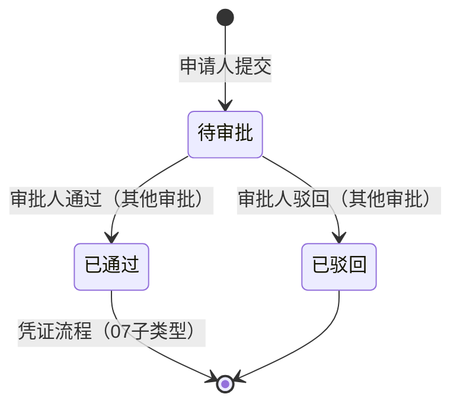

# 开锁审核主需求文档

> **文档体系（三件套为核心）**：
>
> | 层级 | 文档 | 职责 |
> | :--- | :--- | :--- |
> | **核心** | 本文（主 PRD） | 业务背景、范围、架构、**页面功能说明**、场景、状态机摘要、规则摘要、验收 |
> | **核心** | [开锁审核字段清单](./开锁审核字段清单.md) | 字段定义、列表/详情/审批处理、展示顺序与控件规格 |
> | **核心** | [开锁审核业务规则规格](./开锁审核业务规则规格.md) | 状态机本体、R/C/P 规则、时序图、流转表 |
> | *衍生* | ASCII 线框 / Demo 文档 | 由三件套派生的可视化与原型输入，**非独立真源** |
>
> **版本**：V1.6 | 2026-09-11
>
> **读者**：研发工程师、测试工程师、产品复核
>
> **业务定位**：SYZC 6.2 **审批人侧开锁审核**菜单与页面的唯一定义来源。承接「其他审批—开锁审批」列表、详情与通过/驳回操作；**不**维护申请单据字段定义、凭证生命周期与审批配置 CRUD。
>
> **菜单名称**：PC 线上文案「**开锁审核**」，挂载于审批中心首页「其他审批」区块；H5 线上文案「**开锁审批**」，挂载于业务办理 → 其他审批，与前端原型 demo 一致，**无需调整**。
>
> **编写依据**：[开锁审核字段清单](./开锁审核字段清单.md)、[开锁审核业务规则规格](./开锁审核业务规则规格.md)、[00-全局契约与RBAC权限矩阵](../00-全局契约与RBAC权限矩阵.md)
>
> **跨域关联**：
>
> - 上游配置：[06-门禁开锁审批/01-审批配置](../06-门禁开锁审批/01-审批配置/)（何时需审批、谁来审批）
> - 申请单据：[03-业务审批/04-我的申请管理/04-开锁审批](../../03-业务审批/04-我的申请管理/04-开锁审批/开锁申请字段清单.md)
> - 通用审批动作：[03-业务审批/00-通用审批操作字段清单](../../03-业务审批/00-通用审批操作字段清单.md)（R10–R13）
> - 发起入口：[01-物联网IOT管理/02门禁设备](../../../01-物联网IOT管理/02门禁设备/)
> - 全链路导读：[06-门禁开锁审批/门禁开锁审批总索引.md](../../../06-门禁开锁审批/门禁开锁审批总索引.md)
>
> **菜单地图**：[B端PC/00-菜单地图](../../🌟🌟🌟-最新基准版/B端PC/00-菜单地图.md) · [B端H5/00-菜单地图](../../🌟🌟🌟-最新基准版/B端H5/00-菜单地图.md)
>
> **职责边界**：本主 PRD **仅**定义审批人侧「其他审批—开锁审批」列表、详情与通过/驳回交互。申请主表、凭证生命周期、审批配置 CRUD 分别见 `03/04/04-开锁审批`、`06/01-审批配置`。**不进** 07 审批中心「待处理/已处理」。

---

## 1. 文档说明

| 项目       | 内容                                                                                      |
| -------- | --------------------------------------------------------------------------------------- |
| 模块编号     | 07-审批中心 / 05-其他审批 / 03-开锁审核 |
| 菜单文案     | 开锁审核（审批中心 · 其他审批卡片）                                                                                |
| 文档类型     | 审批人侧主 PRD（V3.0 标杆）                                                                      |
| 字段基准     | [开锁审核字段清单](./开锁审核字段清单.md)                                                               |
| 规则基准     | [开锁审核业务规则规格](./开锁审核业务规则规格.md)                                                           |
| biz_type | `UNLOCK_APPLY`                                                                          |
| 页面线框     | [审批中心入口](./开锁审核_ASCII_审批中心入口.md) · [列表页](./开锁审核_ASCII_列表页.md) · [详情页](./开锁审核_ASCII_详情页.md) · [移动端](./开锁审核_ASCII_移动端.md) |
| H5 Demo      | [移动端](./开锁审核_Demo_移动端.md) · [列表页](./开锁审核_Demo_列表页.md) · [详情页](./开锁审核_Demo_详情页.md) |

---

## 2. 背景与目标

SYZC 6.2 门禁开锁审批链路中，审批人需要在独立入口集中处理挂锁/人脸门禁的临时开锁申请。该入口归类为审批中心首页「其他审批」区块，**不**接入系统「接入流程配置」，因此**不**进入 07 审批中心「待处理/已处理」。

**本期目标**：

- 提供双端（PC/H5）开锁审批列表与详情页；
- 支持审批人按数据权限查看待处理与已处理申请；
- 提供通过、驳回操作及审批意见录入；
- 申请详情只读展示设备/位置/事由等快照信息；**所有参与审批的人员均可查看审批记录及最终审批人信息**；
- 审批人侧详情**不展示**开锁凭证状态、凭证编号或临时密码；凭证查看由申请人侧「我的申请」承接；
- 审批动作回写申请状态并触发凭证生成（后置业务见 07 子类型）。

---

## 3. 功能范围

### 3.1 本期范围

| 序号  | 功能     | 说明                             |
| --- | ------ | ------------------------------ |
| 1   | 开锁审批列表 | 组合筛选、Tab/状态下拉（待审批/已处理/全部）、分页   |
| 2   | 申请详情   | 只读展示申请快照、审批配置快照、审批记录           |
| 3   | 审批通过   | 引用 R10–R12；意见选填                |
| 4   | 审批驳回   | 引用 R10、R13；驳回原因必填              |
| 5   | 数据权限过滤 | 仓管按管辖仓库；管理员租户全量                |
| 6   | 双端适配   | PC 表格列表 + 抽屉/详情页；H5 卡片列表 + 详情页 |

### 3.2 不在本期范围

| 内容           | 归属                       |
| ------------ | ------------------------ |
| 发起开锁申请       | 门禁设备「获取门锁密码」→ [03/04/04-开锁审批](../03-业务审批/04-我的申请管理/04-开锁审批/开锁申请主PRD.md) |
| 申请人撤回        | [03/04/04-开锁审批](../03-业务审批/04-我的申请管理/04-开锁审批/开锁申请主PRD.md) + 我的申请记录      |
| 凭证生成与下发 | [03/04/04-开锁审批](../03-业务审批/04-我的申请管理/04-开锁审批/开锁申请主PRD.md) §四 凭证         |
| 审批配置 CRUD    | 06/01-审批配置               |
| 接入待处理/已处理    | 研发已确认不做                  |
| 批量审批、导出      | 本期不做                     |
| 抄送、转派        | 本期不做（R19）                |

---

## 4. 页面功能说明

> 本节描述**做什么、怎么交互**；字段见《[开锁审核字段清单](./开锁审核字段清单.md)》及操作字段清单；**不进**通用待处理/已处理池（专网专道）。

### 4.1 PC 审批中心入口

**路径**：工作中心 → 审批中心 → **其他审批** → **开锁审核** 卡片

| 项目 | 说明 |
| :--- | :--- |
| 页面形态 | 卡片 + 待审批角标 + 页内预览表（最多 5 条）；见 [ASCII 审批中心入口](./开锁审核_ASCII_审批中心入口.md) |
| 预览操作 | 待审批 →「查看详情」「去处理」；终态 → 仅「查看详情」 |
| 查看更多 | 跳转 §4.2 完整列表，默认=待审批 |
| P06 自审禁止 | 本人发起申请预览区仅「详情」，无「去处理」 |

### 4.2 PC / H5 列表页（完整页）

| 端 | 路径 |
| :--- | :--- |
| PC | 审批中心 → 其他审批 → 开锁审核 → 查看更多 |
| H5 | 业务办理 → 其他审批 → 开锁审批 · `/m/approval/unlock-applies` |

**筛选区**：申请单号、设备名称/编码、绑定仓库、申请人、事由、申请状态、提交时间。

**列表**：PC 表格 / H5 卡片；默认视图=待审批（当前用户 eligible）；列见 [01列表与详情展示字段清单](./操作字段清单/01列表与详情展示字段清单.md)。

**行操作**：待审批 →「审批」/「去处理」；已处理 →「查看」。

### 4.3 PC / H5 详情页

| 分区 | 内容 |
| :--- | :--- |
| 基础信息 | 申请单号、状态、提交时间 |
| 设备与位置 | 设备编码/名称、仓库/库房/分区、具体位置（快照） |
| 申请内容 | 申请人、手机号脱敏、事由、备注、有效期（人脸） |
| 审批配置快照 | 配置编号/版本、审批方式、审批节点 |
| 审批记录 | 各节点处理人/结果/意见/时间（全部 eligible 可见） |

**操作区**（待审批 + eligible + 非自审 P06）：通过（意见选填）/ 驳回（原因必填）；见 [02审批处理字段清单](./操作字段清单/02审批处理字段清单.md)。

**审批人侧不展示**：临时密码、凭证编号（申请人侧承接）。

### 4.4 审批操作交互

- **通过**：可选意见 → 提交 → Toast「审批通过」→ 返回列表；
- **驳回**：必填驳回原因 → 提交 → Toast「已驳回」；
- **并发**：状态已变更 → Toast「审批失败：申请状态已变更」并刷新（R18）。

---

## 5. 用户与权限

权限矩阵以 [00-全局契约与RBAC权限矩阵](../00-全局契约与RBAC权限矩阵.md) 为准：

| 规则ID | 场景 | 要求 |
| :--- | :--- | :--- |
| P04 | 审批操作 | 须为当前 eligible 审批人且账号启用 |
| P05 | 列表数据隔离 | 仓管：管辖仓库；管理员：租户全量 |
| P06 | 自审禁止 | 审批人不可审批自己发起的申请（R11） |

申请人侧凭证权限见 [开锁申请业务规则规格](../03-业务审批/04-我的申请管理/04-开锁审批/开锁申请业务规则规格.md)。

---

## 6. 状态与流转

本模块**不定义**申请主状态机；审批人可见状态与操作约束见 [开锁审核业务规则规格](./开锁审核业务规则规格.md) §二。

审批动作执行后，由 07 子类型消费结果并推进申请状态、触发凭证流程：

---

## 7. 路由与跳转

| 路由ID                         | 来源             | 目标     | 参数                                                  |
| ---------------------------- | -------------- | ------ | --------------------------------------------------- |
| `ROUTE-OTHER-APPR-UNLOCK-01` | 审批中心入口 / 其他审批列表 | 开锁申请详情 | `apply_no`, `biz_type=UNLOCK_APPLY`, `return_route` |
| 返回                           | 详情页 NavBar/面包屑 | 来源页（入口预览或完整列表） | 保留筛选条件                                              |

H5 路由：`/m/approval/unlock-applies`（列表）、`/m/approval/unlock-applies/:applyNo`（详情）。

---

## 8. 非功能需求

| 类别   | 要求                             |
| ---- | ------------------------------ |
| 并发幂等 | 审批动作状态条件更新（A02、R18）            |
| 审计   | 审批轨迹完整记录（A04）                  |
| 性能   | 列表首屏 ≤ 2s（租户 1 万条申请量级）         |
| 敏感数据 | 临时密码、手机号按角色脱敏；密码明文不落库（R22、A05） |

---

## 9. 跨模块引用

| 引用项    | 文档                                                                   |
| ------ | -------------------------------------------------------------------- |
| 申请主表字段 | [07/01开锁申请主表字段清单](../03-业务审批/04-我的申请管理/04-开锁审批/01-字段清单/01开锁申请主表字段清单.md) |
| 通用审批规则 | [07/02-审批中心业务规则规格](../../../../../🌟🌟🌟-最新基准版/B端PC/01-工作中心/01-审批中心/02-审批中心业务规则规格.md) R10–R13              |
| 全链路推演  | [06/业务流程推演](../06-门禁开锁审批/门禁开锁审批-业务流程推演.md)                           |
| 三板块导读  | [06-门禁开锁审批/门禁开锁审批总索引.md](../06-门禁开锁审批/门禁开锁审批总索引.md)                             |

---

## 10. 附录：双端入口对照

| 维度         | B端PC               | B端H5             |
| ---------- | ------------------ | ---------------- |
| 一级入口       | 工作中心               | 业务办理             |
| 完整路径       | 审批中心 → 其他审批 → 开锁审核 | 业务办理 → 其他审批 → 开锁审批 |
| 列表形态       | 入口预览表 + 完整列表（表格 + 筛选栏） | 卡片 + 搜索 + 申请状态下拉   |
| 详情形态       | 右侧抽屉或独立详情页         | 全屏详情页            |
| 原型 feature | `unlock-applies`        | `unlock-applies` |

---

## 修订记录

| 日期         | 版本   | 变更内容                   |
| ---------- | ---- | ---------------------- |
| 2026-08-28 | V1.0 | 初版                     |
| 2026-08-28 | V1.1 | 吸收总索引导航信息；联合导读改指向版本根目录 |
| 2026-08-31 | V1.2 | 明确 PC 入口为审批中心首页「其他审批—开锁审核」卡片；补充入口 ASCII |
| 2026-08-31 | V1.3 | 补充移动端 ASCII 线框 |
| 2026-09-01 | V1.4 | 同步 06 评审：审批方式固定任一人通过；补充审批可见性；配置按设备 ID 匹配 |
| 2026-09-10 | V1.5 | H5/PC 状态筛选名称统一为「申请状态」；补充待分配、未通过、已撤销的标准文案映射 |
| 2026-09-11 | V1.6 | **对齐三件套标杆**：§4 页面功能说明（合并原 §5 页面与交互）；§5 用户与权限 |
