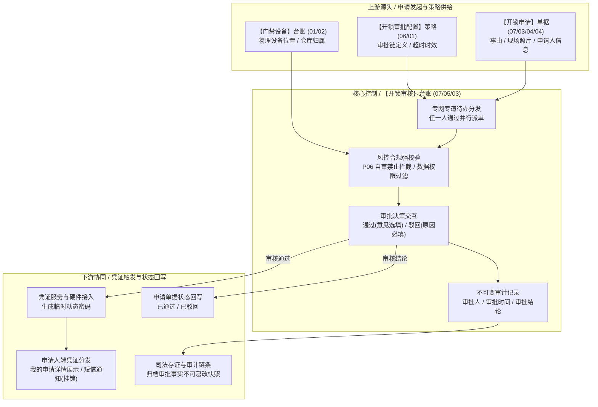
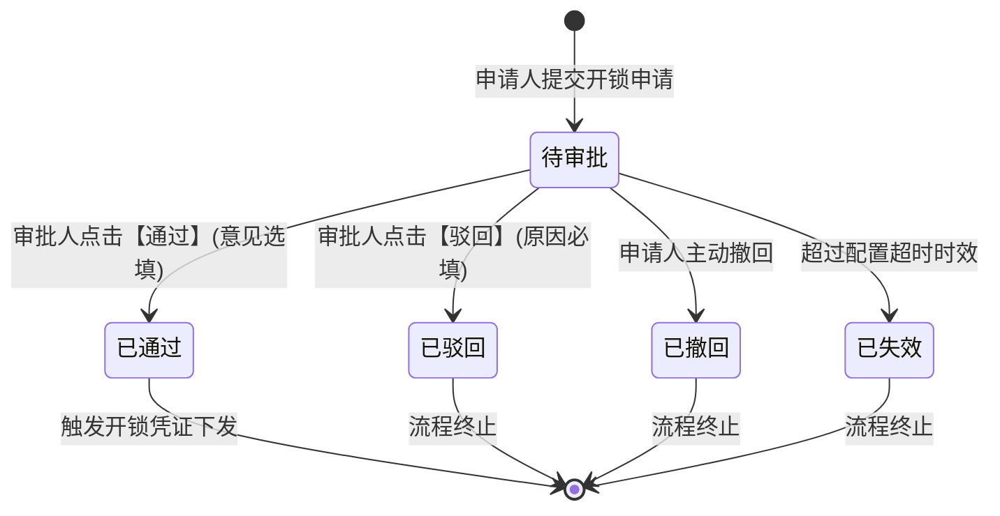

# 开锁审核 主PRD

> **文档体系（三件套为核心）**：
>
> | 层级 | 文档 | 职责 | 真源 |
> | :--- | :--- | :--- | :---: |
> | **核心** | 本文（主 PRD） | 业务背景、痛点、功能范围、模块架构、**页面功能说明**、业务场景、状态机摘要、规则摘要、验收 | ✅ |
> | **核心** | [开锁审核字段清单](./开锁审核字段清单.md) | 字段定义、筛选/列表/详情/审批弹窗、展示顺序、必填性与控件规格 | ✅ |
> | **核心** | [开锁审核业务规则规格](./开锁审核业务规则规格.md) | 状态机本体、R/C/P 规则、计算口径、动作矩阵、异常矩阵、时序图 | ✅ |
> | *衍生* | ASCII 线框 / Demo 文档 | 由三件套派生的可视化与原型输入，**非独立真源** | ❌ |
>
> **版本**：V4.0 基准版 | **更新时间**：2026-09-18 | **责任人**：产品架构组
>
> **统一引用规范**：
> - 本台账：【开锁审核】台账（菜单：工作中心 → 审批中心 → 其他审批 → 开锁审核，代号 07/05/03）
> - 上游策略：【开锁审批配置】策略（菜单：配置管理 → 业务流程管理 → 开锁审批，代号 06/01）
> - 协同单据：【开锁申请】单据（菜单：工作中心 → 审批中心 → 业务审批 → 我的申请管理 → 开锁申请，代号 07/03/04/04）
> - 设备实体：【门禁设备】台账（菜单：物联网IOT管理 → 门禁设备，代号 01/02）
> - 状态机与业务规则本体 → [《开锁审核业务规则规格》](./开锁审核业务规则规格.md)
> - 字段层级与属性 → [《开锁审核字段清单》](./开锁审核字段清单.md)

---

## 一、业务背景与业务痛点

### 1.1 业务背景
在 SYZC 供应链金融动产质押体系中，保理商、银行风控人员与核心仓储主管对质押现场的物理出入负有连带监管责任。当借款企业或货代物流因入库理货、盘点巡检或合规出库需开启挂锁门禁或人脸门禁时，必须由具备授权资格的审批人员实时审验其事由、现场证据与操作窗口。

【开锁审核】台账（菜单：工作中心 → 审批中心 → 其他审批 → 开锁审核，代号 07/05/03）是审批人集中审验、处理现场开锁申请的工作台。为了保障高频出入库场景下的毫秒级开锁响应，开锁审核采用**专网专道设计**，独立挂载于「工作中心 → 审批中心 → 其他审批」卡片中，不接入通用工作流引擎，有效隔离常规冗长业务审批的排队干扰。

### 1.2 核心业务痛点
* **【常规工作流阻塞现场通行时效】**：通用审批流多用于合同流转或借款审批，流程冗长且常伴随批量待办，现场开锁等待时间过长极易导致装卸车辆滞留或引起现场作业纠纷。
* **【权限穿透引发自审自批舞弊】**：现场驻库人员或监管员兼具申请人与审批人身份时，若缺乏强校验自审禁止机制，极易形成「自己申请、自己秒批、非法开锁」的重大风控漏洞。
* **【审批人获知密码引发内鬼隐患】**：若审批人在审核详情中直接看到计算出的门锁临时密码，会形成审批人与申请人双向知悉密码的信息泄露，破坏开锁凭证单人负责的审计闭环。
* **【驳回无因与事后追溯断裂】**：线上驳回若允许空白提交，现场人员无法获悉补充材料指引，且在事后风控复盘时无法举证开锁受阻的真实合规理由。

---

## 二、功能范围

| 包含功能范围 (In Scope) | 不包含功能范围 (Out of Scope) |
| :--- | :--- |
| **【专网专道审批工作台】**：提供开锁审核列表，支持「待审批」、「已处理」、「全部」视图切换及多维筛选。 | **【开锁申请单据录入】**：现场人员填写事由与拍照提交，属于【开锁申请】单据（代号 07/03/04/04）。 |
| **【详情审验与快照穿透】**：只读展示设备信息、位置快照、申请事由、现场图片及审批策略快照。 | **【开锁审批策略配置】**：维护适用设备与审批链，属于【开锁审批配置】策略（代号 06/01）。 |
| **【审批通过与前置授权】**：支持审批通过并录入选填审批意见，触发后台密码计算与分发服务。 | **【开锁密码生成与展示】**：审批人界面严禁展示临时开锁密码与凭证明文，防止知情泄密。 |
| **【合规驳回与原因阻断】**：支持驳回申请，强制录入 1~200 字符驳回原因，状态联动回写申请端。 | **【常规审批中心接入】**：开锁审核专网专道运行，不进入「工作中心 → 待处理 / 已处理」通用池。 |
| **【自审禁止强拦截机制】**：针对本人发起的开锁申请，操作列仅提供【详情】，强制隐藏【审批】入口。 | **【门禁设备物理控制】**：不直接向门禁下发硬件开锁脉冲，仅完成鉴权审批。 |

---

## 三、模块定位与系统链路

### 3.1 模块定位
【开锁审核】台账（菜单：工作中心 → 审批中心 → 其他审批 → 开锁审核，代号 07/05/03）属于系统**授权执行控制层（Authorization Execution Layer）**。它向上消费开锁审批配置策略与开锁申请流水，向内执行自审禁止与数据权限隔离，向下驱动开锁凭证的安全生成，是物理门禁准入闭环的关键把关口。

### 3.2 系统链路图

---

## 四、业务场景与用户故事

| 场景编号与名称 | 触发角色 | 核心交互与风控约束 | 业务价值 |
| :--- | :--- | :--- | :--- |
| **【SC-01 现场紧急开锁实时审核】** | 驻库风控监管员 (`R-RISK-AUDIT`) | 接收到现场借款企业出库开锁申请，登录系统进入「工作中心 → 审批中心 → 其他审批 → 开锁审核」，列表「待审批」视图点击第一条记录的【审批】按钮。弹窗内复核现场货品照片与出库单据无误后，录入意见「核对单证一致，准予开锁」并点击【通过】。 | 专道秒级响应现场开锁需求，避免作业停滞。 |
| **【SC-02 不合规事由阻断驳回】** | 质押风控主管 (`R-RISK-MGR`) | 在开锁审核列表中查看某申请，发现申请开锁原因为「盘点」，但上传的照片模糊不清且未见盘点清单。审核人点击【驳回】，在必填文本框中录入「照片无法辨识且未附盘点计划，请补充清晰照片后重新提交」，确认后驳回成功，申请人端收到即时反馈。 | 严守物理货权安全底线，全程留痕可溯。 |
| **【SC-03 自审禁止合规防护】** | 监管仓储主管 (`R-WH-MGR`) | 主管本人因现场紧急查库在移动端提交了开锁申请，随后在 PC 端打开开锁审核列表。该条申请在列表展示，但行操作列仅展示【详情】，不展示【审批】按钮。主管点击详情时底部提示「您是该申请的发起人，依风控规则禁止自审」。必须等待另一位审批人审核。 | 彻底杜绝既当裁判员又当运动员的道德风险。 |
| **【SC-04 超时失效单据事后追溯】** | 审计合规人员 (`R-AUDIT-USR`) | 对历史发生的一笔超时未开锁异常进行复盘，进入「开锁审核」切换至「已处理」标签页，筛选查看状态为「已失效」的单据详情。页面清晰展示申请时间、有效截止时间以及审批链未响应人员快照，作为对驻库风控人员履职考核的证据。 | 提供司法级可追溯审计线索，杜绝推诿扯皮。 |

---

## 五、状态机与动作能力矩阵

### 5.1 状态定义
* **待审批 (`PENDING`)**：已提交开锁申请，审批链已就绪，等待具有审批权的人员处理；
* **已通过 (`APPROVED`)**：任一有效审批人审核通过，申请终态，触发凭证计算；
* **已驳回 (`REJECTED`)**：审批人审核驳回，申请终态，附带明确驳回原因；
* **已撤回 (`REVOKED`)**：申请人在审批前主动撤回，终态；
* **已失效 (`EXPIRED`)**：超过策略设定的超时时效未处理，后台定时任务自动标记失效，终态。

### 5.2 状态流转图

### 5.3 动作能力矩阵

| 动作名称 | 待审批 (`PENDING`) | 已通过 (`APPROVED`) | 已驳回 (`REJECTED`) | 已撤回 (`REVOKED`) | 已失效 (`EXPIRED`) |
| :--- | :---: | :---: | :---: | :---: | :---: |
| **查看详情** | ✅ | ✅ | ✅ | ✅ | ✅ |
| **审批处理 (非本人申请)** | ✅ (通过 / 驳回) | ❌ | ❌ | ❌ | ❌ |
| **审批处理 (本人发起申请)** | ❌ (P06 自审禁止) | ❌ | ❌ | ❌ | ❌ |
| **导出记录** | ✅ | ✅ | ✅ | ✅ | ✅ |

---

## 六、页面交互规格索引

### 6.1 审批中心首页入口规格
* **页面定位**：工作中心 → 审批中心聚合首页（全宽展示，无左侧菜单）。
* **卡片布局**：位于第三列「其他审批」分组下方，子卡片命名为【开锁审核】，带待办红色角标；
* **快捷预览区**：点击「开锁审核」卡片后，下方平铺展示最多 5 条最新待审批记录，每条展示申请人、事由、设备名称、提交时间及【去处理】快捷按钮；右上角提供【查看更多 >】进入完整列表。

### 6.2 PC 完整列表页交互规格
* **路由路径**：`/工作中心/审批中心/其他审批/开锁审核`
* **视图分栏 (Tabs)**：
  - **待审批 (默认)**：仅展示状态为待审批且当前用户具备审批资格（非本人）的数据；
  - **已处理**：展示当前用户已审批或已办结的数据；
  - **全部**：当前数据权限管辖范围内的所有申请。
* **筛选交互**：
  - 申请单号（精确匹配文本框）；
  - 设备名称 / 设备编码（模糊匹配输入框）；
  - 绑定仓库（当前管辖仓库下拉选择器）；
  - 申请人（模糊匹配输入框）；
  - 提交时间（最大跨度 90 天的时间范围选择器）。
* **行操作区**：
  - 待审批且非本人申请：展示高亮【审批】按钮及次级【详情】链接；
  - 待审批且本人申请：隐藏【审批】，仅展示【详情】链接；
  - 终态记录（已通过/驳回/撤回/失效）：展示【详情】链接。

### 6.3 审批处理弹窗交互规格
* **弹窗唤起**：点击行操作【审批】或快捷预览【去处理】弹出；
* **信息审验区**：
  - 申请核心信息：申请单号、申请人姓名与手机号（脱敏）、事由、提交时间；
  - 设备与位置：设备名称、设备编码、设备类型、安装仓库与具体仓位；
  - 事由与佐证：事由详细补充说明、申请时上传的现场货品照片（支持点击放大查看大图）；
  - 人脸门禁有效期（若为挂锁门禁则不展示）。
* **审批决策区**：
  - 操作选项：单选按钮组（通过 / 驳回）；
  - 选【通过】时：展示审批意见多行文本框（选填，最多 200 字，默认提示「同意开锁」）；
  - 选【驳回】时：展示驳回原因多行文本框（必填，最多 200 字，红星标注）；
  - 提交时进行防重复提交遮罩，成功后浮窗提示并刷新列表。

---

## 七、核心业务规则索引与非功能需求

### 7.1 核心规则映射索引
| 规则类别 | 规则编号 | 规则名称 | 核心控制摘要 |
| :--- | :--- | :--- | :--- |
| **通道隔离** | R10 | 专网专道独立审批通道 | 独立挂载于其他审批卡片，不接入通用工作流待办，保障秒级响应。 |
| **风控红线** | R11 | P06 自审禁止强校验规则 | 申请人等于当前登录人时，强制剥夺审批权限，仅允许查看详情。 |
| **决策机制** | R12 | 任一人通过决策与任务竞争 | 多个有效审批人并行派发任务，一人审批即完成，其余待办自动核销。 |
| **合规追溯** | R13 | 驳回原因必填与意见留痕 | 驳回必须输入有效原因；审批全过程人员、时间、意见不可变存证。 |
| **凭证防泄** | R14 | 审批人凭证数据隔离机制 | 审批人界面绝对不展示临时密码或凭证内容，防止密码多方泄露。 |
| **超时控制** | R15 | 超时失效与扫描核销规则 | 达到策略设定的失效时间戳，系统自动将申请流转为已失效。 |

### 7.2 非功能性需求
* **审批时效**：点击审批提交后，从决策写入到申请人端凭证可用端到端时延 $\le 1.5\text{s}$；
* **数据安全**：审批详情中申请人手机号严格执行脱敏（展示为 `138****1234`），现场抓拍图仅支持临时带签名的安全防盗链访问；
* **审计留痕**：审批人的通过/驳回动作全量记入审计日志，记录审批人、终端 IP、时间戳与审批决策。

---
*版本说明：V4.0 基准版 | 责任人：产品架构组 | 2026年09月*
