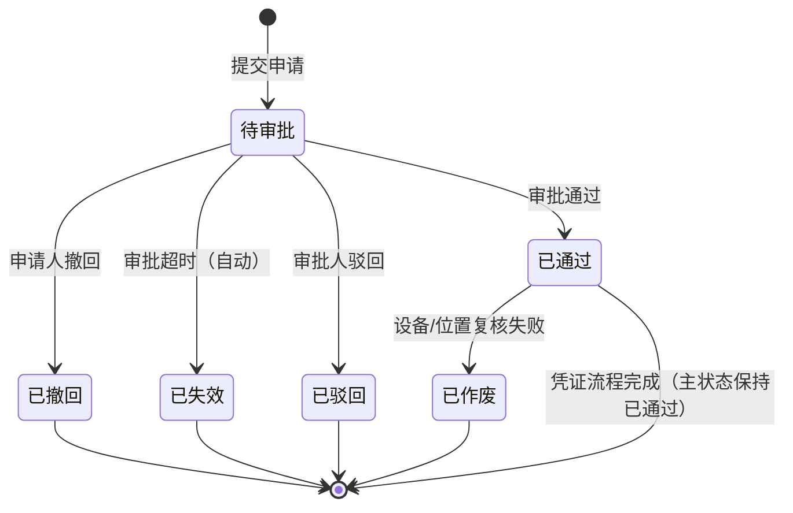
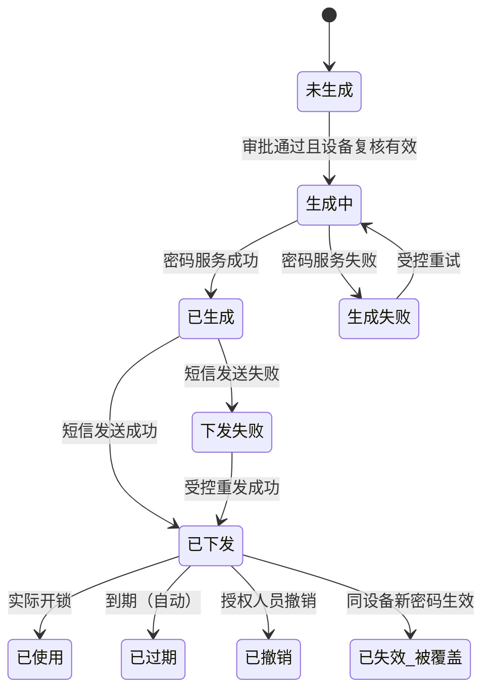

# 开锁申请 业务规则规格

> **文档定位**：开锁申请（`UNLOCK_APPLY`）单据、临时开锁凭证及门禁事务关联的状态机、动作约束、校验规则、权限与审计的**唯一定义来源**。
>
> **模块类型**：单据类 + 凭证生命周期（审批处理由「其他审批—开锁审批」承载）
>
> **所属层级**：审批中心子类型 `UNLOCK_APPLY`
>
> **参考文档**：[《开锁申请字段清单》](./开锁申请字段清单.md)、[《审批中心业务规则规格》](../../02-审批中心业务规则规格.md)（平台任务与通用审批动作）、[《门禁开锁审批配置业务规则规格》](../../../06-门禁开锁审批/01-审批配置/门禁开锁审批配置业务规则规格.md)、[《门禁开锁审批-业务规则规格》](../../../06-门禁开锁审批/门禁开锁审批-业务规则规格.md)（全链路编排）、[《门禁开锁审批-业务流程推演》](../../../06-门禁开锁审批/门禁开锁审批-业务流程推演.md)、[《门禁设备业务规则规格》](../../../01-物联网IOT管理/02门禁设备/门禁设备业务规则规格.md)、[《门禁事务业务规则规格》](../../../01-物联网IOT管理/03门禁事务/门禁事务业务规则规格.md)
>
> **职责边界**：本文件定义开锁申请单据、凭证下发与事务关联规则；**通用审批任务状态机与 R10–R13、R18–R19 等平台规则**见 [审批中心业务规则规格](../../02-审批中心业务规则规格.md)。**不包含**审批配置的创建、启停用与匹配写入——上述规则见 [06/01-审批配置](../../../06-门禁开锁审批/01-审批配置/门禁开锁审批配置业务规则规格.md)。
>
> **版本**：V1.3 | 2026-08-28
>
> **菜单地图**：[B端PC/00-菜单地图](../../../../../🌟🌟🌟-最新基准版/B端PC/00-菜单地图.md) · [B端H5/00-菜单地图](../../../../../🌟🌟🌟-最新基准版/B端H5/00-菜单地图.md) · **审批人 UI 唯一定义来源**：[08-开锁审核主PRD](../../../08-开锁审核/开锁审核主PRD.md)

---

## 0. 统一执行模型约束

- 设计原则：`审批通过 ≠ 密码生成成功 ≠ 短信发送成功 ≠ 实际开锁成功`，四者须分别留痕。
- 申请提交时固化设备/位置/配置 **配置编号 + 配置版本 + 审批方式 + 审批节点快照**（C05，定义见配置模块）。
- **申请状态**、**凭证状态**、**审批处理状态**、**门禁事务** 四层独立，禁止混写在同一状态字段。
- 配置匹配（C01–C04）在门禁设备模块执行；本模块在申请创建时消费匹配结果并写入快照。

> **系统入口约定（研发已确认）**：
> - **审批人处理（PC）**：工作中心 → 审批中心 → 其他审批 → **开锁审批**。
> - **审批人处理（H5）**：业务办理 → 其他审批 → **开锁审批**。
> - **不**接入系统「接入流程配置」，**不**进入 07 审批中心「待处理/已处理」。
> - **申请人查询（双端）**：我的申请记录，子类型 `UNLOCK_APPLY`（开锁申请）；PC 入口为工作中心 → 审批中心 → 我的申请记录；H5 入口为业务办理 → 我的申请记录。
> - 通用审批动作字段（通过/驳回/意见）口径仍引用 [审批中心业务规则规格](../../02-审批中心业务规则规格.md) R10–R13，**仅 UI 入口不同**。

---

## 一、能力定位

| 项目 | 内容 |
| :--- | :--- |
| **模块层级** | 授权意图单据层 + 凭证层 |
| **菜单/入口** | **发起**：门禁设备「获取门锁密码」→ 命中需审批规则后提交；**审批**：工作中心 → 审批中心 → 其他审批 → 开锁审批（PC）；业务办理 → 其他审批 → 开锁审批（H5）；**查询**：我的申请记录（子类型=开锁申请） |
| **核心职责** | 记录临时开锁授权意图；审批通过后触发凭证生成与短信下发；与门禁事务尝试关联 |
| **上游依赖** | **门禁设备**：设备类型、绑定位置、获取密码权限；**开锁审批配置**：已启用规则及 C01–C04 匹配结果；**人员/RBAC**：审批节点展开 |
| **下游影响** | **密码/短信服务**：凭证生成与下发；**门禁事务**：实际开锁事实入库与关联 |
| **审核流** | **有**——任一人通过 / 按顺序审批，由配置快照决定 |

---

## 二、开锁申请

> 单据类对象，具备完整审批生命周期；凭证处理状态独立维护，不混入申请主状态。

### 2.1 单据定位

| 项目 | 内容 |
| :--- | :--- |
| **单据层级** | 第2层-订单层（授权意图单据） |
| **核心职责** | 记录一次临时开锁授权意图，驱动其他审批处理与凭证下发 |
| **单据来源** | 开锁申请人在门禁设备上点击「获取门锁密码」，命中需审批规则后提交 |
| **上游对象** | 门禁设备（1:1）、审批配置（按版本匹配 1:1） |
| **下游影响** | 生成审批任务；审批通过后触发临时凭证生成与短信下发；门禁事务按设备/时间/凭证尝试关联 |
| **审核流** | **有审核流**（任一人通过 / 按顺序审批，由配置决定） |

### 2.2 状态定义

| 状态名称 | 枚举值 | 业务含义 | 是否终态 | 进入条件 | 离开条件 |
| :--- | :--- | :--- | :---: | :--- | :--- |
| 待审批 | `PENDING` | 已提交，等待审批人处理；审批前无临时密码 | 否 | 申请创建成功 | 通过 / 驳回 / 撤回 / 超时失效 |
| 已通过 | `APPROVED` | 审批结论为通过；凭证可能仍在生成或下发中 | 否 | 审批通过（全部顺序节点通过或任一人通过） | 凭证流程完成（凭证状态独立跟踪）；异常作废 |
| 已驳回 | `REJECTED` | 审批人驳回，不生成密码 | **是** | 审批人驳回 | — |
| 已撤回 | `WITHDRAWN` | 申请人主动撤回 | **是** | 申请人撤回 | — |
| 已失效 | `EXPIRED` | 审批超时未处理 | **是** | 定时任务超时判定 | — |
| 已作废 | `VOIDED` | 审批通过后设备/位置复核失败，或管理员异常关闭 | **是** | 凭证生成前复核失败 / 管理员关闭 | — |

**设计说明**：

- 「凭证处理中」「已下发」属于**凭证状态**（见第四章），申请主状态「已通过」可与凭证「生成失败/下发失败」同时存在。
- 状态变更禁止通过表单 Dropdown 直接修改，必须通过独立动作按钮触发。

### 2.3 状态流转图

### 2.4 状态流转表（核心规则矩阵）

| 当前状态 | 触发动作 | 前置校验条件 | 结果状态 | 二次确认弹窗 | 后置级联影响 | 失败阻断提示 |
| :--- | :--- | :--- | :--- | :--- | :--- | :--- |
| — | 提交申请 | R05: 设备类型、权限、绑定状态、手机号校验通过 R06: 命中需审批配置 R07: 无同设备在途申请 R08: 请求幂等键有效 R28/R30: 节点展开有效 | 待审批 | 无 | ① 固化设备/位置/审批人/配置版本快照 ② 按审批方式创建审批任务 ③ 建立防重复控制 ④ 推送审批待办 ⑤ 凭证=未生成 | Toast: 「提交失败：{具体原因}」 |
| 待审批 | 撤回 | R09: 申请人本人 | 已撤回 | 「撤回后审批待办将关闭，确认撤回？」 | 关闭审批任务；释放防重复控制 | Toast: 「撤回失败：申请状态已变更」 |
| 待审批 | 审批通过 | [R10–R12](../../02-审批中心业务规则规格.md) | 已通过 | 无（审批意见选填/必填按配置） | ① 平台关闭/推进审批任务 ② 触发凭证生成流程 ③ 凭证状态=待生成 | Toast: 「审批失败：{具体原因}」 |
| 待审批 | 审批驳回 | [R10、R13](../../02-审批中心业务规则规格.md) | 已驳回 | 无 | 关闭任务；释放防重复控制；通知申请人 | Toast: 「驳回失败：申请状态已变更」 |
| 待审批 | 超时失效 | R14: 超过配置超时时间（系统自动） | 已失效 | 系统自动，无需确认 | 关闭任务；释放防重复控制；通知申请人 | — |
| 已通过 | 凭证复核作废 | R15: 设备解绑/移除/位置失效 | 已作废 | 无（系统自动） | 不生成凭证；通知申请人 | — |
| 已通过 | 管理员异常关闭 | R16: 审批管理员/上级主管权限 | 已作废 | 「关闭后申请不可恢复，确认关闭？」 | 若凭证已下发则同步撤销凭证；记录审计 | Toast: 「关闭失败：{具体原因}」 |

### 2.5 动作能力矩阵

| 操作动作 | 待审批 | 已通过 | 已驳回 | 已撤回 | 已失效 | 已作废 |
| :--- | :---: | :---: | :---: | :---: | :---: | :---: |
| 查看详情 | ✅ | ✅ | ✅ | ✅ | ✅ | ✅ |
| 编辑 | ❌ | ❌ | ❌ | ❌ | ❌ | ❌ |
| 撤回 | ✅（申请人） | ❌ | ❌ | ❌ | ❌ | ❌ |
| 审批通过 | ✅（审批人） | ❌ | ❌ | ❌ | ❌ | ❌ |
| 审批驳回 | ✅（审批人） | ❌ | ❌ | ❌ | ❌ | ❌ |
| 查看密码 | ❌ | ✅（条件：凭证已下发且有效） | ❌ | ❌ | ❌ | ❌ |
| 短信重发 | ❌ | ✅（条件：凭证下发失败） | ❌ | ❌ | ❌ | ❌ |
| 撤销凭证 | ❌ | ✅（条件：授权人员） | ❌ | ❌ | ❌ | ❌ |
| 管理员异常关闭 | ❌ | ✅（条件） | ❌ | ❌ | ❌ | ❌ |

### 2.6 特殊动作对比（撤回 vs 驳回 vs 失效 vs 作废）

| 维度 | 撤回 | 驳回 | 失效（超时） | 作废 |
| :--- | :--- | :--- | :--- | :--- |
| **触发方** | 申请人 | 审批人 | 系统定时任务 | 系统复核 / 管理员 |
| **适用状态** | 待审批 | 待审批 | 待审批 | 已通过（凭证生成前） |
| **是否生成密码** | 否 | 否 | 否 | 否 |
| **可否重新申请** | 可（释放防重后可新提） | 可（本期不允许原单修改再提交） | 可 | 视情况 |
| **弹窗文案** | 「撤回后其他审批单据将关闭」 | 须填写驳回原因 | 系统通知 | 「关闭后申请不可恢复」 |

---

## 三、审批处理（其他审批入口）

> 开锁申请**不**注册至 07 审批中心「待处理/已处理」。审批人通过 `工作中心 → 审批中心 → 其他审批 → 开锁审批（PC）；业务办理 → 其他审批 → 开锁审批（H5）` 处理；列表展示字段见 [08-开锁审核列表与详情展示字段清单](../../../08-开锁审核/操作字段清单/01列表与详情展示字段清单.md)。
>
> 审批动作约束（R10–R13、R18–R19）仍引用 [审批中心业务规则规格](../../02-审批中心业务规则规格.md)；操作字段见 [通用审批处理字段清单](../../04-操作字段清单/01通用审批处理字段清单.md)。

### 3.1 接入渠道与关联

| 项目 | 内容 |
| :--- | :--- |
| **biz_type** | `UNLOCK_APPLY` |
| **审批人入口** | 工作中心 → 审批中心 → 其他审批 → 开锁审批（PC）；业务办理 → 其他审批 → 开锁审批（H5）（**无**接入流程配置，**不进**待处理） |
| **申请人入口** | 我的申请记录（子类型=开锁申请） |
| **关联键** | 其他审批单据 `业务单号` = 本模块 `申请单号` |
| **分发** | 申请创建成功后，按审批配置快照中的审批方式将单据推送至「其他审批—开锁审批」供 eligible 审批人处理 |

### 3.2 提交时节点解析规则

> 通用审批方式（任一人通过 / 按顺序审批）见 [审批中心业务规则规格 §2.2](../../02-审批中心业务规则规格.md#22-通用审批方式规则)。本节仅定义本子类型在**申请提交时**对配置快照的消费与展开。

| 规则ID | 规则 | 归属 |
| :--- | :--- | :--- |
| **R28** | 指定角色节点在申请提交时展开并写入 **审批人快照**；在途不重算 | 本模块提交时执行 |
| **R30** | 角色节点展开后 eligible 为空则阻断提交 | 本模块提交时执行 |

> R27、R29（节点类型定义与配置保存校验）见 [门禁开锁审批配置业务规则规格](../../../06-门禁开锁审批/01-审批配置/门禁开锁审批配置业务规则规格.md)。

---

## 四、临时开锁凭证

> 记录密码生成、发送和使用生命周期；状态独立于申请主状态。

### 4.1 状态定义

| 状态名称 | 枚举值 | 业务含义 | 是否终态 |
| :--- | :--- | :--- | :---: |
| 未生成 | `NOT_GENERATED` | 申请待审批或尚未进入凭证流程 | 否 |
| 生成中 | `GENERATING` | 正在调用密码服务 | 否 |
| 已生成 | `GENERATED` | 密码服务返回成功，待短信下发 | 否 |
| 已下发 | `DELIVERED` | 密码和短信均成功 | 否 |
| 生成失败 | `GEN_FAILED` | 密码服务调用失败 | 否 |
| 下发失败 | `DELIVERY_FAILED` | 密码成功但短信失败 | 否 |
| 已使用 | `USED` | 已用于实际开锁 | **是** |
| 已过期 | `EXPIRED` | 超过有效期未使用 | **是** |
| 已撤销 | `REVOKED` | 授权人员主动撤销 | **是** |
| 已失效（被覆盖） | `SUPERSEDED` | 同设备新密码生效导致旧凭证失效 | **是** |

### 4.2 状态流转图

### 4.3 凭证关键规则

| 规则ID | 规则 |
| :--- | :--- |
| **R20** | 审批通过且设备复核仍有效时才调用密码服务；复核失败则申请→已作废，不生成凭证 |
| **R21** | 密码生成与短信下发采用幂等请求；重复调用不得生成多份有效密码 |
| **R22** | 密码明文不得写入数据库、审批记录、运行日志和审计日志；申请人可在页面查看密码明文（沿用现有能力） |
| **R23** | 短信失败后的发送和重试由现有短信服务平台负责；本业务只接收发送成功/失败/重试结果并记录 |
| **R24** | 同设备生成新密码并生效时，上一条仍有效凭证→已失效（被新密码覆盖）；旧申请审批结论不回退 |
| **R25** | 申请人打开旧申请详情且凭证已被覆盖时，提示：「设备密码已被更新，原密码已失效。」 |
| **R26** | 挂锁门禁临时密码有效期为 3 天（沿用门禁设备 R02）；人脸门禁按设备参数扩展 |

### 4.4 查看与下发操作

> 申请人侧查看与短信下发字段见 [查看与下发凭证字段清单](./02-操作字段清单/02查看与下发凭证字段清单.md)。本节只定义操作规则；审批人侧 08 仅查看凭证状态摘要。

| 操作 | 允许条件 | 处理结果 | 安全约束 |
| :--- | :--- | :--- | :--- |
| 查看临时密码 | 当前用户为申请人或授权查看人；凭证=已下发且仍在有效期内 | 返回本次凭证明文供页面展示 | 服务端实时校验权限和凭证状态；不得使用过期缓存 |
| 复制临时密码 | 密码卡片已按查看规则展示 | 写入剪贴板并提示成功 | 不记录明文；离开详情或失焦后清理页面内明文 |
| 重新下发短信 | 凭证已生成且短信发送失败，凭证仍可用 | 复用原凭证重发短信，更新发送状态 | 使用申请单号、凭证编号和请求幂等键；不得重新生成密码 |
| 查看失效原因 | 凭证已过期、撤销或被覆盖 | 展示状态和原因，隐藏密码卡片 | 被覆盖时提示「设备密码已被更新，原密码已失效」 |

---

## 五、门禁事务关联（只读联动）

> 范式 C 裁剪：门禁事务为独立事实记录，本模块只定义关联规则，不重复定义事务写入逻辑（详见《门禁事务业务规则规格》）。

| 规则ID | 规则 |
| :--- | :--- |
| **W01** | 门禁事务按事件唯一标识幂等入库，不因重复上报生成重复记录 |
| **W02** | 事务入库后优先关联申请单和凭证；按设备、时间和凭证记录匹配，无法唯一匹配时标记「未匹配」，不默认判定为合法 |
| **W03** | 申请记录证明审批意图，不等于实际开锁事实；实际开锁失败、非法试码和无法匹配申请的事件均须保留 |
| **W04** | 设备移除后历史事务仍保留原设备和位置快照 |

---

## 六、校验规则（本子类型）

| 规则ID | 规则分类 | 具体规则定义 | 失败阻断提示 |
| :--- | :--- | :--- | :--- |
| **R05** | 申请校验 | 申请人须具备获取密码权限、仓库数据权限且已绑定手机号 | 「无获取密码权限」/「请先绑定手机号」 |
| **R06** | 申请校验 | 须命中需审批配置（含全局开关开启时的全局审批） | 免审分支走原有直发密码流程 |
| **R07** | 防重校验 | 同一设备不得存在多个在途审批申请 | 「设备已有在途申请{单号}，请等待处理完成」 |
| **R08** | 幂等校验 | 申请创建须携带请求幂等键；重复提交返回原申请结果 | 返回原申请单号及状态 |
| **R09** | 撤回校验 | 仅申请人本人可撤回待审批申请 | 「撤回失败：无操作权限」 |
| **R14** | 超时规则 | 超过配置超时时间未处理，系统自动置为已失效 | 系统通知申请人 |
| **R15** | 复核校验 | 凭证生成前重新校验设备绑定、位置有效性及申请状态 | 申请→已作废 |
| **R16** | 管理关闭 | 审批管理员/上级主管方可异常关闭 | 「无操作权限」 |

> 配置侧 R01–R04a、C01–C08 见 [门禁开锁审批配置业务规则规格](../../../06-门禁开锁审批/01-审批配置/门禁开锁审批配置业务规则规格.md)。平台审批 R10–R13、R18–R19 见 [审批中心业务规则规格](../../02-审批中心业务规则规格.md)。

---

## 七、权限与数据隔离规则（本子类型）

| 规则ID | 规则分类 | 具体规则定义 | 异常/无权限处理 |
| :--- | :--- | :--- | :--- |
| **P03** | 申请查看 | 须具备 `[门禁设备 · 获取密码]` 或申请相关查看权限 | 阻断操作 |
| **P06** | 凭证撤销 | 审批管理员 / 上级主管方可撤销已下发凭证 | 按钮隐藏 |
| **P07** | 审计查看 | 审计/风控人员可查询申请、审批、凭证和门禁事务完整证据链 | 按角色过滤敏感字段 |

> 平台审批操作 P04、数据隔离 P05 见 [审批中心业务规则规格](../../02-审批中心业务规则规格.md)。配置菜单 P01–P02 见配置模块规格。

---

## 八、并发、幂等与审计（本子类型）

| 规则ID | 规则 |
| :--- | :--- |
| **A01** | 申请创建必须具备请求幂等键，重复点击不能产生多张有效申请 |
| **A03** | 凭证生成前必须再次校验申请状态、设备状态和位置绑定 |
| **A04** | 申请、凭证、短信和实际开锁事件均记录操作人、时间、设备编码、请求标识、前后状态和失败原因 |
| **A05** | 严禁在业务库、审批记录和日志中保存密码明文和短信全文 |
| **A06** | 新旧凭证、关联申请、生成时间和覆盖原因写入审计关系 |

> 平台审批并发 A02 见 [审批中心业务规则规格](../../02-审批中心业务规则规格.md)。配置侧审计见配置模块规格。

---

## 九、边界与异常处理

### 9.1 运行时配置冲突

| 场景 | 处理方式 |
| :--- | :--- |
| 设备命中多条冲突规则（C03 运行时） | 阻断申请提交，提示管理员修正绑定或配置 |
| 配置已停用但在途申请引用旧版本 | 正常；C05 保证快照不变 |
| 角色节点展开后无 eligible 人员 | R30 阻断提交 |

### 9.2 凭证与事务异常

| 场景 | 处理方式 |
| :--- | :--- |
| 密码成功、短信失败 | 申请保持已通过；凭证=下发失败；支持受控重发（R23） |
| 同设备新密码覆盖 | R24 旧凭证→已失效（被覆盖）；R25 详情页提示 |
| 事件无法关联申请 | W02 标记未匹配，不默认合法 |

### 9.3 本模块不处理的场景

| 场景 | 归属 |
| :--- | :--- |
| 审批配置新增/启停用/匹配写入 | [06/01-审批配置](../../../06-门禁开锁审批/01-审批配置/) |
| 通用审批任务状态机与平台动作 | [07-审批中心](../../02-审批中心业务规则规格.md) |
| 门禁事务本体字段与入库逻辑 | 《门禁事务业务规则规格》 |
| 免审直发密码 | 门禁设备模块原有流程 |

---

## 十、规则索引

| 规则类型 | 代码范围 | 说明 |
| :--- | :--- | :--- |
| 申请/审批校验 | R05 – R09、R14 – R16、R28、R30 | 提交、撤回、超时、复核、节点展开 |
| 凭证规则 | R20 – R26 | 生成、下发、覆盖、有效期 |
| 配置引用 | R27、R29 | 定义在配置模块；本模块消费快照 |
| 事务关联 | W01 – W04 | 门禁事务只读联动 |
| 权限规则 | P03 – P07 | 申请、审批、凭证、审计 |
| 审计规则 | A01 – A06 | 幂等、并发、留痕（申请执行链） |

> 配置匹配与快照 C01–C05、C06–C08 见配置模块；全链路编排见 [《门禁开锁审批-业务规则规格》](../../../06-门禁开锁审批/门禁开锁审批-业务规则规格.md) §五。

---

## 业务流程与联动

> 本模块覆盖推演 **阶段二至四：申请 → 审批 → 凭证 → 事务关联**；完整时序见 [《门禁开锁审批-业务流程推演》](../../../06-门禁开锁审批/门禁开锁审批-业务流程推演.md) §三；联动摘要见 [全链路规格](../../../06-门禁开锁审批/门禁开锁审批-业务规则规格.md) §五。

| 上游动作 | 触发条件 | 后置影响 |
| :--- | :--- | :--- |
| 提交开锁申请 | R05–R08、R28、R30 通过 | 申请=待审批；生成审批任务；凭证=未生成 |
| 审批通过 | R10–R12 通过 | 申请=已通过；进入凭证流程 |
| 审批驳回/撤回/超时 | 对应校验通过 | 申请终态；关闭任务；释放防重 |
| 凭证生成与下发 | R20 复核通过 | 凭证生命周期独立流转 |
| 实际开锁上报 | W01 幂等 | 事务入库；W02 尝试关联 |

---

## 修订记录

| 日期 | 版本 | 变更摘要 |
| :--- | :---: | :--- |
| 2026-08-28 | V1.0 | 从全链路规格第三至六章及执行侧规则拆出独立唯一定义来源；与 01-审批配置 对称 |
| 2026-08-28 | V1.3 | 研发确认双端菜单：PC 工作中心→审批中心→其他审批→开锁审批；H5 业务办理→其他审批→开锁审批 |
| 2026-08-28 | V1.2 | 删除平台层重复规则（R10–R13、P04–P05、A02）；收窄本子类型 唯一定义边界 |
| 2026-08-28 | V1.4 | 将申请人查看密码、复制密码和短信重发拆为独立操作字段清单；明确 08 审批人侧不展示密码明文 |

---

## 设计自检清单

- [x] 申请/凭证/任务/事务四层状态独立，无混写
- [x] 职责不含审批配置 CRUD 与 C01–C04 写入
- [x] 规则 ID 与全链路规格 R05–R09、R14–R16、R20–R26、R28、R30、W01–W04、P03/P06/P07 保持一致；平台 R10–R13 见审批中心规格
- [x] 字段名称与《开锁申请字段清单》及子清单一致
- [x] 未引入推演与全链路规格未确认的新规则
