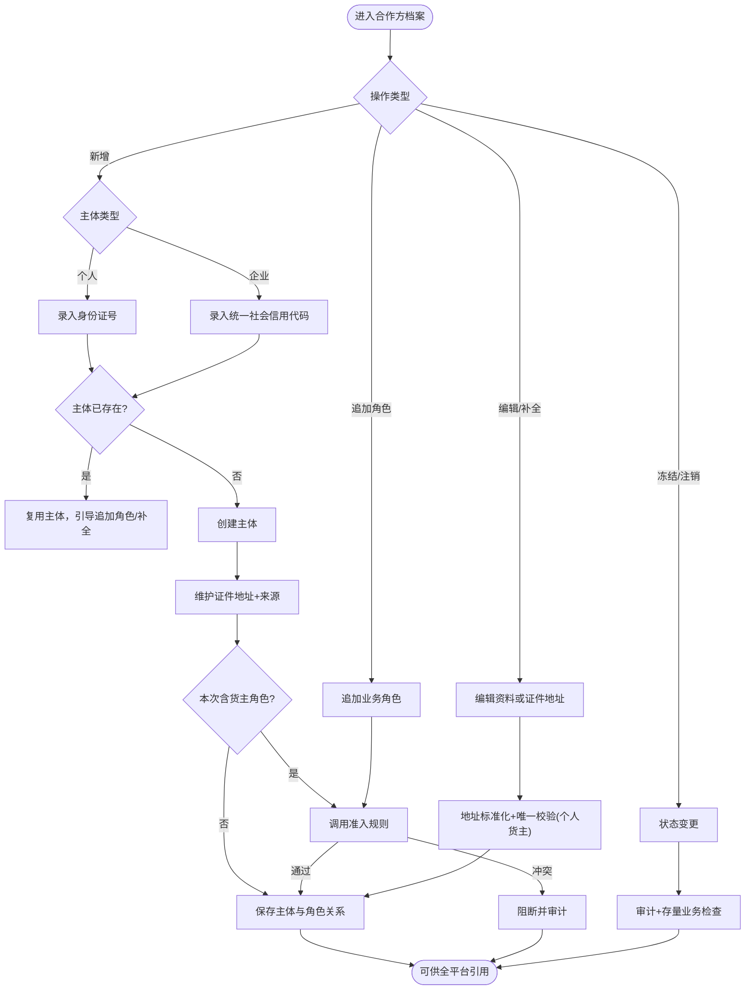
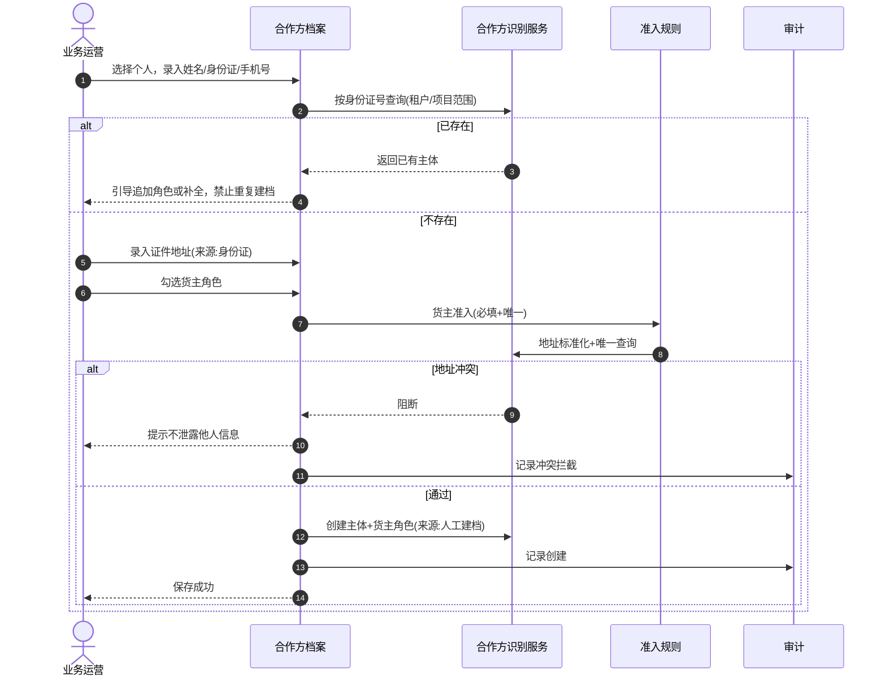
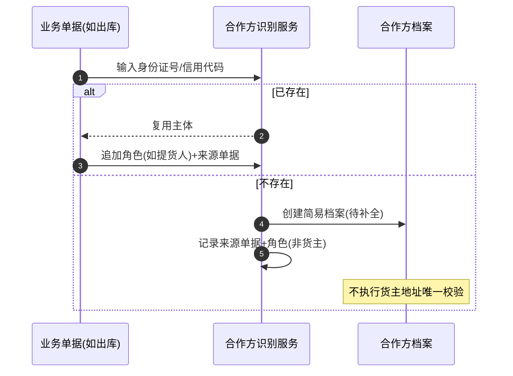
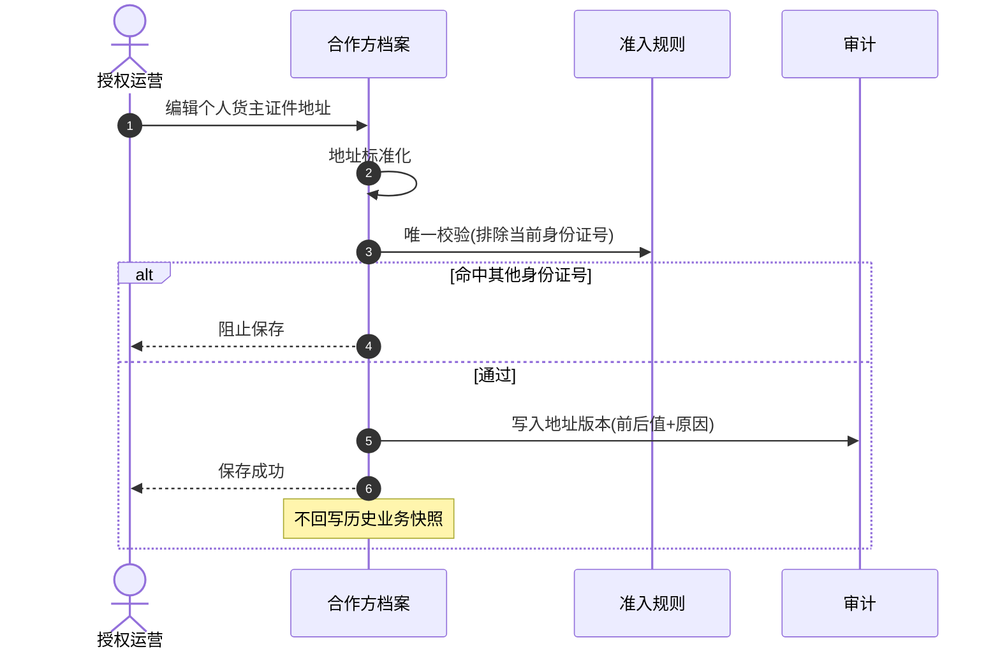

# 合作方档案-业务流程推演

> **覆盖场景**：人工建档 / C 端认证沉淀 / 业务单据静默沉淀 / 角色追加 / 证件地址维护 / 按角色冻结 / 注销  
> **不展开范围**：融资产品资方候选池内部算法、银行核心账务、具体 DB 表结构  
> **参考文档**：[合作方档案主PRD](./合作方档案主PRD.md) · [合作方档案业务规则规格](./合作方档案业务规则规格.md) · [合作方准入规则-业务流程推演](../02-合作方准入规则/合作方准入规则-业务流程推演.md) · [合作方改造-存量业务单据协同规格](../03-存量改造与关联业务协同/合作方改造-存量业务单据协同规格.md)  
> **版本**：V1.5 | 2026-09-20

---

## 一、业务流程概述

### 1.1 核心业务特征说明

- ✅ **统一主体识别**：个人按身份证号、企业按统一社会信用代码；已存在则复用，禁止重复建档。
- ✅ **角色关系留痕**：货主、提货人、接收方等以角色关系记录，含来源场景、来源单据、状态、生效/失效时间。
- ✅ **证件地址主档维护**：个人来源身份证、企业来源营业执照/企业认证资料；列表默认展示状态或脱敏，不全量暴露。
- ⚠️ **货主准入联动**：新增或生效「货主」角色时，调用合作方准入规则（必填、地址唯一校验）。
- ⚠️ **按角色隔离冻结**：冻结货主角色不自动冻结同一主体的提货人/监管仓等其他角色。

### 1.2 本业务在全局数据链路中的位置

### 1.3 完整端到端流程图

---

## 二、涉及角色与参与主体

| 参与主体 | 核心职责 | 参与节点与权限说明 |
| :--- | :--- | :--- |
| 平台管理员 | 建档、地址修改、准入规则、注销 | 全权限；敏感字段按最小必要 |
| 业务运营 | 人工建档、补全、追加角色 | 新增/编辑；地址修改需授权 |
| 风控人员 | 角色冻结/解冻、冲突治理 | 冻结货主等高风险角色；查看冲突摘要 |
| 项目管理员 | 本项目范围内合作方维护 | 按项目数据权限隔离 |
| C 端客户 | 认证时创建/绑定主体 | 经客户管理间接沉淀，非本菜单直接操作 |
| 业务单据 | 静默沉淀简易档案 | 出库/入库等触发，标记待补全 |

---

## 三、涉及单据、记录与职责

| 单据 / 记录名称 | 业务层级 | 核心职责 | 上游来源 | 下游联动 | 实物与资产状态影响 |
| :--- | :--- | :--- | :--- | :--- | :--- |
| 合作方主体 | 主档 | 个人/企业身份资料 | 人工/C端/单据 | 全业务引用 | 间接：决定能否作为货主发单 |
| 合作方角色关系 | 主档子层 | 货主/提货人等+来源 | 业务触发 | 按角色拦截新业务 | 冻结货主→拦截新入库 |
| 证件地址及来源 | 主档字段 | 开票主体识别、个人唯一校验 | 身份证/营业执照 | 结算开票引用 | 历史单据保存快照不回写 |
| 地址变更记录 | 审计层 | 前后版本、操作人、原因 | 编辑保存 | 合规追溯 | 不影响历史快照 |
| 客户账号绑定 | 关联层 | C端账号↔合作方 | 客户管理 | C端业务 | 无直接库存影响 |
| 业务主体快照 | 凭证层 | 发生时身份+地址 | 各作业单据生效 | 货权/结算/存证 | 固化不可变 |

---

## 四、主流程时序推演

### 4.1 新增个人主体并赋予货主角色

### 4.2 业务单据静默沉淀简易档案

### 4.3 个人货主修改证件地址

---

## 五、单据与事件级联联动规则表

| 触发动作 | 触发条件 | 级联影响对象 | 传递与继承数据 | 状态与后置变更 | 异常回滚策略 |
| :--- | :--- | :--- | :--- | :--- | :--- |
| 创建个人货主 | 地址唯一通过 | 合作方主体+货主角色 | 身份证、地址、来源 | 主体正常/待补全 | 事务回滚，不残留半成品 |
| 追加货主角色 | 已有个人主体 | 角色关系表 | 来源单据号 | 执行货主准入 | 冲突则不加角色 |
| 冻结货主角色 | 风控/人工 | 新入库/融资发单 | 冻结原因 | 仅拦截货主相关新业务 | 审批通过时再校验，冻结则拦截通过 |
| 注销主体 | 无存量约束 | 全部角色 | 注销原因 | 不可产生新关系 | 存量只读查询 |
| 地址主档修改 | 保存成功 | 历史单据 | 无回写 | 新单据用新地址 | 保留地址版本链 |
| C端认证绑定 | 认证通过 | 客户账号关联 | 认证资料同步地址 | 默认货主角色+同步地址准入 | 认证失败不建主体 |

---

## 六、关键异常与分支处置推演

- **分支 1【身份证号重复建档】**：提示主体已存在，引导进入原主体追加角色，禁止创建第二条主档。
- **分支 2【个人货主地址冲突】**：阻止保存/加角色；不展示已有主体姓名、身份证号、完整地址；见决策清单「地址冲突提示文案在不同场景是否统一」。
- **分支 3【简易档案直接当货主】**：待补全且缺必填地址时，追加货主或入库选为货主必须在提交前补全；见「简易沉淀档案何时能作为货主」。
- **分支 4【提货人后续加货主】**：原仅提货人角色、地址与他人货主冲突 → 追加货主时执行唯一校验并阻断。
- **分支 5【货主角色注销后地址释放】**：见决策清单「货主角色移除或注销后，证件地址是否释放」。
- **分支 6【企业地址维护】**：不参与个人一对一校验；需与营业执照/企业认证资料核对。

---

## 七、关键架构决策与证据留痕

1. **为什么业务角色不进 RBAC 角色管理？**  
   货主/提货人是业务关系，不是 B 端登录权限；混用会导致权限模型不可维护。

2. **为什么证件地址只在主档维护？**  
   避免入库、出库、转让等多处重复录入导致不一致；业务单据仅保存快照。

3. **为什么按角色隔离冻结？**  
   同一企业可能既是货主又是监管仓；全局冻结会误伤第三方存货出库（见合作方管理需求 Q4）。

4. **为什么禁止物理删除？**  
   遵循 SYZC 主数据规范（§2.3）；注销+历史快照保留司法追溯效力。

5. **为什么冲突不走审批？**  
   地址冲突属于准入校验，应同步阻断，不应进入审批中心增加无效待办。

---

## 八、本菜单相关问题与决策

| 主题 | 问题 | 决策方案 |
| :--- | :--- | :--- |
| 多入口校验一致性 | 合作方档案人工建档与入库「创建新货主」校验是否一致？ | 统一准入服务；**档案人工建档不触发【新货主二元身份核验与建档沉淀】(R03)**，入库/预约新建货主触发 |
| C 端认证默认货主 | C 端认证是否默认增加货主角色？ | **默认增加货主**；认证完成时同步执行证件地址准入 |
| 地址冲突提示 | 地址冲突提示文案如何表述？ | 「已有相同证件地址，不能绑定为该个人货主」；不泄露他人信息 |
| 简易档案当货主 | 「待补全」简易档案何时能当货主？ | 缺必填地址时**禁止**作为货主提交；须先补全 |
| 地址释放 | 货主注销后地址能否被他人使用？ | 地址从唯一池**释放**；历史快照**永久保留** |
| 作用域 | 主体与地址唯一的作用域？ | **租户隔离**；地址唯一在租户内适用项目/业务范围 |
| 地址标准化 | 地址如何做标准化比较？ | 标准化比较值做唯一校验；保留原文；见决策清单 |

完整清单见 [00-合作方统一管理-推演问题清单.md](../../00-合作方统一管理-推演问题清单.md)。

---

## 修订记录

| 日期 | 版本 | 变更说明 |
| :--- | :---: | :--- |
| 2026-09-20 | V1.0 | 初始化合作方档案业务流程推演 |
| 2026-09-20 | V1.1 | 同步已定稿决策 |
| 2026-09-20 | V1.2 | 规则引用对齐基准版格式；去除裸编号 |
