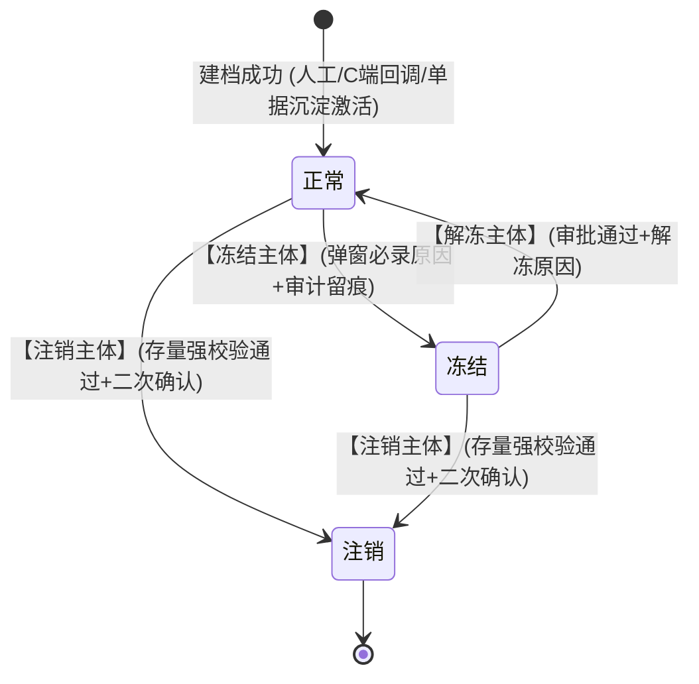
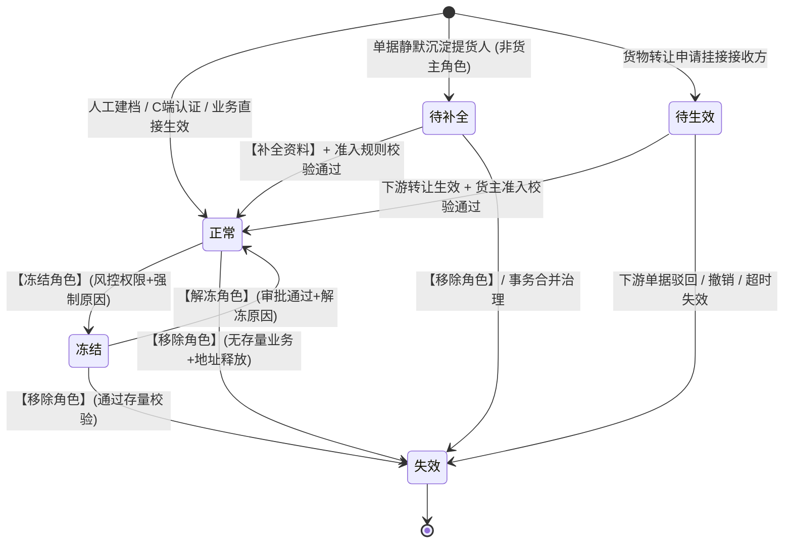
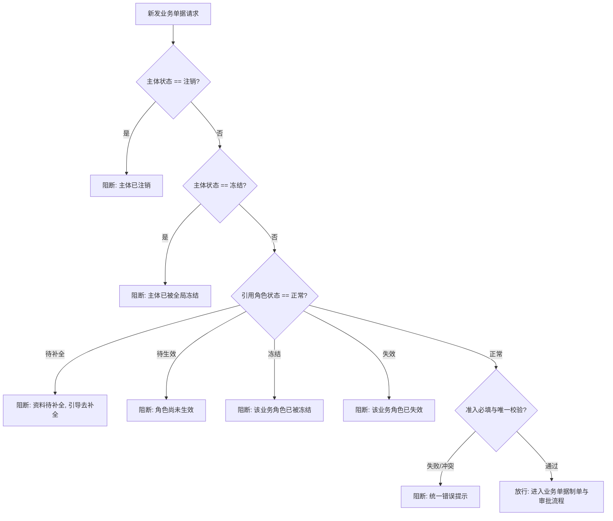

# 合作方档案业务规则规格

> **模块定位**：合作方管理 / 合作方档案模块主体状态机、角色关系状态机、动作约束、准入联动、注销强校验与并发幂等的**唯一定义来源（SSOT）**。主 PRD、字段清单及端侧原型仅引用本文件规则名称与编号，不重复定义规则本体。  
> **范式类型**：范式 D · 基础档案类（启用/冻结/注销；严禁物理删除；引用保护与快照隔离）  
> **参考文档**：[合作方档案主PRD.md](./合作方档案主PRD.md) · [合作方档案字段清单.md](./合作方档案字段清单.md) · [合作方准入规则业务规则规格.md](../02-合作方准入规则/合作方准入规则业务规则规格.md) · [合作方改造-存量业务单据协同规格.md](../03-存量改造与关联业务协同/合作方改造-存量业务单据协同规格.md)  
> **版本**：V1.5 | **更新时间**：2026-09-20 | **责任人**：森云科技（Senyun Technology）

---

## 一、单据与能力定位

| 项目 | 内容规格 |
| :--- | :--- |
| **单据层级** | **【第 1 层 · 业务主体主数据层】**（全平台个人/企业合作方统一基础档案） |
| **核心职责** | 集中维护合作方身份资料、证件地址及来源、业务角色关系（货主/提货经办人/接收方/资金方等）、主体与角色双层生命周期状态；为入库、出库、转让、仓单、融资等业务提供统一引用源与凭据快照源。 |
| **单据来源** | **三重录入与沉淀渠道**： 1. **主动建档**：业务运营在后台管理端手工新增建档； 2. **C 端回调**：客户端用户完成实名认证后系统自动回调建档； 3. **单据沉淀**：出库等作业单据录入新经办人时系统静默沉淀创建简易档案。 |
| **上游依赖** | **工商与公安核验**：企业统一社会信用代码与个人身份证真实性； **准入策略配置**：【合作方准入规则】维护的地址必填、唯一校验及场景配置。 |
| **下游影响** | **仓储模块**：为入库、出库、提货、转让、仓单提供主体选择与数据校验； **交易模块**：与 C 端客户账号建立 1:1 绑定关系； **融资与风控**：为融资产品提供合格资金方候选池，承接风控隔离冻结指令。 |
| **数据隔离机制** | 主体主档按**租户**物理隔离；地址唯一校验范围为**同一租户内适用项目/业务范围**；跨租户不做主体合并与地址比较。 |

---

## 二、双层状态模型与流转定义

合作方档案页面独立维护两个状态维度，**严禁使用单一状态下拉框混写状态含义**：
1. **主体状态**：主体全局生命周期管控，注销为不可逆终态；
2. **角色状态**：挂接在主体下的具体业务合作关系状态，失效为角色终态。

### 2.1 主体状态定义表

| 状态名称 | 业务含义 | 是否终态 | 列表可见性 | 进入条件 | 离开条件 |
| :--- | :--- | :---: | :---: | :--- | :--- |
| **正常** | 主体主档已激活，可按所属角色参与对应业务流转 | 否 | 可见 | 建档成功 / 审批解冻 | 冻结 / 注销 |
| **冻结** | 命中风控限制或人工管控，新发业务默认阻断拦截 | 否 | 可见 | 人工冻结 / 风控系统自动触发 | 解冻审批通过 |
| **注销** | 主体终止与平台合作，历史归档，凭证数据只读 | **是** | 可见（只读） | 存量强校验全部通过 | —（终态不可逆） |

#### 状态三问 · 正常
- **阶段**：主体主档生效中，可被全平台业务引用；
- **允许**：编辑资料（按权限）、追加角色、按角色冻结/解冻、主体冻结、查看穿透单据；
- **禁止**：物理删除、表单内直接改动状态、存在存量业务时注销。

#### 状态三问 · 冻结
- **阶段**：主体级风险受控期，限制发起新业务；
- **允许**：查看详情、提交解冻审批、主体注销（仍须过存量校验）；
- **禁止**：发起任何新业务单据、编辑核心资质与身份标识。

#### 状态三问 · 注销
- **阶段**：主体退出合作，历史数据永久归档；
- **允许**：只读查看台账、导出审计日志、支持历史业务凭证快照穿透；
- **禁止**：任何数据修改、追加新角色、解冻、再次激活。

---

### 2.2 角色状态定义表（单条角色关系）

| 状态名称 | 业务含义 | 是否终态 | 典型业务场景 | 离开条件 |
| :--- | :--- | :---: | :--- | :--- |
| **待补全** | 业务单据静默沉淀的简易角色，资料不完整 | 否 | 出库单录入新提货经办人 | 补全必填资料并通过准入 $\rightarrow$ 正常 |
| **待生效** | 角色关系已建立，等待下游业务生效核准 | 否 | 货物转让申请挂接接收方 | 业务生效 $\rightarrow$ 正常；业务撤销/驳回 $\rightarrow$ 失效 |
| **正常** | 具备合法资质，可参与对应业务流转 | 否 | 主动建档、C 端认证、业务生效 | 角色冻结 / 角色移除失效 |
| **冻结** | 仅限制该角色对应业务，不波及同主体其他角色 | 否 | 货主违约、现场提货违规 | 审批解冻 $\rightarrow$ 正常 |
| **失效** | 该角色合作关系终止，保留历史记录与审计 | **是** | 主动移除角色、转让撤销、主体注销 | —（终态不可逆） |

---

## 三、状态流转图

### 3.1 主体状态机流转图

### 3.2 角色状态机流转图（单条业务角色关系）

### 3.3 运行时主体与角色双层拦截决策流

---

## 四、状态流转动作表

### 4.1 主体状态流转动作表

| 当前状态 | 触发动作 | 适用角色 | 前置业务校验条件 | 目标状态 | 二次确认与弹窗 | 联动后置影响 | 失败阻断提示 |
| :--- | :--- | :--- | :--- | :--- | :--- | :--- | :--- |
| — | **创建主体** | 平台管理员 / 业务运营 | 身份证号/统一社会信用代码租户内唯一；勾选货主时通过准入校验 | 正常 | 无 / 准入冲突浮动提示 | 写入主体主档、角色子表及操作审计日志 | 「该主体已存在，请前往详情追加角色配置」 |
| **正常** | **冻结主体** | 风控专员 / 管理员 | 处于正常状态；强制录入冻结原因（$\le 200$ 字） | 冻结 | 二次确认弹窗（录入原因） | 写审计日志；拦截主体名下所有角色新发业务；**不自动修改角色状态** | 「冻结失败：请填写冻结原因」 |
| **冻结** | **解冻主体** | 部门主管 / 管理员 | 处于冻结状态；解冻审批终审通过；强制录入解冻原因 | 正常 | 审批确认弹窗 | 写审计日志；恢复主体正常业务发起资格 | 「解冻失败：解冻须审批通过」 |
| **正常 / 冻结** | **注销主体** | 平台超级管理员 | 遵循【注销与移除角色存量强校验规则】(PA-R05) 全部检查项通过 | 注销 | 二次确认弹窗（录入原因） | 全量角色置为失效；货主地址从活跃池释放；主档置为只读归档 | 「不可注销：该主体名下仍存在在库库存/有效仓单/未结融资」 |
| **任意状态** | **表单改状态** | — | — | — | **系统绝对禁止** | — | 前端不渲染状态下拉框，服务端接口强校验拦截 |

### 4.2 角色状态流转动作表

| 当前状态 | 触发动作 | 适用角色 | 前置业务校验条件 | 目标状态 | 二次确认与弹窗 | 联动后置影响 | 失败阻断提示 |
| :--- | :--- | :--- | :--- | :--- | :--- | :--- | :--- |
| — | **追加角色** | 授权业务运营 | 主体未注销；追加货主角色时调用统一准入服务（含地址唯一） | 正常 / 待补全 | 无 | 写入角色关系子表与来源单据号，记录审计日志 | 「已有相同证件地址，不能绑定为该个人货主」 |
| **待补全** | **补全资料** | 业务运营 / 制单员 | 必填字段录入完整；货主角色须通过地址唯一准入校验 | 正常 | 无 | 角色转为正常；具备发单资格；写审计日志 | 同上地址冲突提示 |
| **待生效** | **业务生效** | 下游系统模块 | 下游转让等单据终审通过；转为货主时通过地址准入校验 | 正常 | 由下游业务确认 | 角色正式激活；更新生效时间戳 | 「转让生效失败：个人货主证件地址冲突」 |
| **待生效** | **业务撤销** | 下游系统模块 | 下游单据被驳回、主动撤回或超时失效 | 失效 | 由下游业务确认 | 角色置为失效；更新失效时间戳 | — |
| **正常** | **冻结角色** | 风控专员 / 管理员 | 强制录入冻结原因（$\le 200$ 字） | 冻结 | 二次确认弹窗 | 仅拦截该特定角色新业务，同主体其他角色不受影响 | 「请填写冻结原因」 |
| **冻结** | **解冻角色** | 部门主管 / 管理员 | 具备权限；审批终审通过并录入解冻原因 | 正常 | 审批确认弹窗 | 写审计日志；恢复该特定角色业务发起资格 | — |
| **正常 / 冻结 / 待补全** | **移除角色** | 平台超级管理员 | 遵循 PA-R05 检查项：名下无进行中的该角色关联业务 | 失效 | 二次确认弹窗（录入原因） | 角色置为失效；若为货主则从唯一活跃池释放地址 (PA-R06) | 「存在进行中的关联业务，无法移除该角色」 |

---

## 五、动作能力矩阵

### 5.1 主体级动作能力矩阵

| 业务动作 | 正常 | 冻结 | 注销 ⭐终态 |
| :--- | :---: | :---: | :---: |
| **查看列表与详情** | ✅ | ✅ | ✅（只读归档展示） |
| **新增合作方主体** | ✅ | ✅ | ❌ |
| **编辑基础档案资料** | ✅（按权限） | ⚠️（仅限非关键信息） | ❌ |
| **编辑证件地址** | ✅（个人须通过准入） | ⚠️（仅限纠偏且须通过准入） | ❌ |
| **追加业务角色** | ✅ | ❌ | ❌ |
| **冻结主体** | ✅（风控权限；强制原因） | ❌ | ❌ |
| **解冻主体** | ❌ | ✅（审批通过） | ❌ |
| **注销主体** | ✅（通过存量校验 PA-R05） | ✅（通过存量校验 PA-R05） | ❌ |
| **物理删除** | ❌（系统绝对禁止） | ❌（系统绝对禁止） | ❌（系统绝对禁止） |

### 5.2 角色级动作能力矩阵（单条业务角色关系）

| 业务动作 | 待补全 | 待生效 | 正常 | 冻结 | 失效 ⭐终态 |
| :--- | :---: | :---: | :---: | :---: | :---: |
| **查看角色记录** | ✅ | ✅ | ✅ | ✅ | ✅ |
| **补全角色资料** | ✅（补全地址过准入） | ❌ | ❌ | ❌ | ❌ |
| **作为货主发起入库/预约** | ❌（前置门禁阻断） | ❌ | ✅ | ❌（前置拦截） | ❌ |
| **作为提货人办理出库** | ⚠️（按出库模块规则） | ❌ | ✅ | ❌（拦截新发） | ❌ |
| **冻结业务角色** | ❌ | ❌ | ✅（风控权限；强制原因） | ❌ | ❌ |
| **解冻业务角色** | ❌ | ❌ | ❌ | ✅（审批通过） | ❌ |
| **移除业务角色** | ✅（无存量业务） | ✅ | ✅（通过存量校验） | ✅（通过存量校验） | ❌ |

---

## 六、核心业务规则清单 (PA-R01 ~ PA-R10)

#### 【主体与角色双层拦截规则】(PA-R01)
* **【校验时机】**：全系统各业务单据接口在引用合作方主体时，必须同时指定合作方主体标识与对应的业务合作角色；
* **【主体注销阻断】**：主体状态为「已注销」时，系统绝对阻断针对该主体的一切写操作与新发单据流转；
* **【主体冻结兜底】**：主体状态为「已冻结」时，默认阻断名下所有角色新发业务；若某业务有存量履约例外，须由下游规格显式定义白名单；
* **【角色隔离拦截】**：角色状态为「已冻结」、「已失效」或「待生效」时，系统严格禁止将其作为对应角色的有效业务主体。

#### 【按角色隔离冻结规则】(PA-R02)
* **【隔离独立性】**：冻结某主体名下的某一业务角色（如货主角色）时，**严禁波及或自动冻结同主体名下的其他角色**（如提货经办人、监管仓角色）；
* **【并集最严原则】**：当主体级冻结与角色级冻结并存时，业务拦截判定取二者并集最严规则；
* **【入库审批联动】**：货主角色被冻结后，除拦截新发入库申请外，**在审批中的入库单终审通过时强制触发二次复检并执行驳回拦截**，严禁写入物理库存。

#### 【主体识别与禁止重复建档规则】(PA-R03)
* **【唯一主键标准】**：个人合作方以 **18 位公民身份证号** 为租户内唯一主键；企业合作方以 **18 位统一社会信用代码** 为租户内唯一主键；
* **【禁止重复建档】**：输入身份证号或信用代码若命中租户内已存在的主体，系统前置强阻断保存，并弹窗引导前往详情页【追加角色配置】；
* **【手机号属性定位】**：手机号统一定位为**业务联系方式**，不再作为合作方主体唯一识别键。

#### 【货主准入与地址唯一联动规则】(PA-R04)
* **【调用统一服务】**：新增货主、追加货主、修改个人货主地址及货物转让生效时，系统必须强制调用【统一准入校验服务】；
* **【内部标准化比对】**：地址唯一比对采用系统内部生成的标准化比较值（去除空格、统一全半角与行政区划别名），页面不暴露内部比较串；
* **【冲突同步阻断】**：若命中其他有效个人货主占用同地址，系统执行**同步强阻断拦截**，统一提示：「已有相同证件地址，不能绑定为该个人货主」；入库/预约场景追加提示「请核实个人货主主体信息」；**严禁泄露他人姓名、身份证号或完整地址**；
* **【二元核验分流】**：合作方档案人工建档入口仅执行准入校验，**不触发短信二元核验**；入库与预约业务场景在准入通过后再执行短信二元核验。

#### 【注销与移除角色存量强校验规则】(PA-R05)
* **【检查时机】**：超级管理员执行【注销主体】或【移除角色】操作时，系统必须原子扫描存量业务依赖；
* **【强阻断清单】**：存在以下任一情形时，系统绝对禁止操作并弹出阻断清单摘要：
  1. **在库物理库存**：该主体作为货主在监管仓存在有效在库数量 $> 0$；
  2. **有效电子仓单**：作为存货人或持有人存在未注销的有效仓单；
  3. **未结金融融资**：存在在途审批或履约存续中的抵押/质押单据；
  4. **审批中在途单据**：作为货主存在待分配、待处理或处理中的入库/转让申请；
  5. **未结算财务台账**：存在未完成结算清算的监管费用或业务台账。

#### 【货主地址活跃池释放规则】(PA-R06)
* **【释放触发时机】**：当且仅当个人主体的货主角色状态流转为「已失效」（移除货主角色），或主体状态流转为「已注销」（注销成功）时，该主体绑定的个人证件地址从唯一校验活跃池中**自动释放**；
* **【统计范围锁定】**：地址唯一校验的扫描池严格限定为：合作角色为「货主」且角色状态为「正常」的有效个人记录；
* **【凭据快照不回写】**：地址释放后，历史已发生的入库单、仓单凭据快照中的地址数据**永久保留，严禁物理回写或篡改**。

#### 【禁止物理删除与审计留痕规则】(PA-R07)
* **【防物理删除】**：合作方主体主档、角色关系子表、地址变更记录**严禁执行数据库物理删除**；
* **【全路径审计要素】**：新增建档、主体/角色状态变更、地址编辑、移除角色等操作必须全量记入审计日志，记录操作人账号、姓名、客户端 IP、操作时间戳、变动前原值、变动后新值及事由原因。

#### 【状态变更按钮驱动规则】(PA-R08)
* **【表单只读展示】**：新增页、编辑页及详情页中的主体状态与角色状态字段，必须渲染为只读状态徽章；
* **【独立按钮驱动】**：状态流转必须由专属操作按钮（【冻结】、【解冻】、【注销】、【移除角色】）呼出独立二次确认弹窗触发，弹窗强制录入 $\le 200$ 字原因事由。

#### 【并发防重与幂等规则】(PA-R09)
* **【客户端令牌防重】**：创建主体、追加角色、编辑提交必须携带客户端唯一防重令牌，提交按钮点击后立即置灰并展示加载中状态；
* **【双重并发防护】**：应用层采用基于租户与标准化地址的并发防重锁，数据库底层部署租户、标准化地址与有效货主标识的唯一约束索引，彻底杜绝高并发同地址双建漏洞。

#### 【简易沉淀与合并治理规则】(PA-R10)
* **【治理合并入口】**：因单据录入错误产生的简易沉淀档案（待补全），经线下核验确属已有真实主体的，通过数据治理功能发起事务合并；
* **【原子事务迁移】**：合并时系统原子将原单据引用外键改写指向真实主体，原简易角色标记为「已失效」归档留痕，严禁重复建档。

---

## 七、与下游业务的状态耦合与快照时点

| 下游业务模块 | 耦合交互点 | 合作方侧状态前置要求 | 快照固化时机与内容 |
| :--- | :--- | :--- | :--- |
| **入库记录** | 货主引用、审批终审二次复检 | 货主角色=「正常」；资料完整；主体未冻结/注销 | **审批通过且写库存前**，固化货主主体标识、名称、证号、证件地址及来源 |
| **客户入库预约** | 新建货主、预约单提交 | 同入库；C 端预约新建货主同样触发准入 | **审批通过时**固化主体快照；制单提交时仅存主体标识引用 |
| **出库记录/提货单** | 提货人引用、核销出库 | 角色=「正常」或「待补全」；未被冻结 | **出库单提交生成时**固化提货主体与经办人快照 |
| **货物转让** | 接收方角色待生效 $\rightarrow$ 生效 | 接收方转为货主时通过地址准入校验 | **转让终审生效且货权变更前**，原子固化双方主体快照 |
| **交易客户管理** | 实名认证回调 | 认证成功自动建档并挂接正常货主角色 | **认证通过时**固化认证资料与合作方 1:1 绑定关系 |

---

## 八、权限与数据范围规则 (PA-P01 ~ PA-P02)

#### 【租户与项目数据隔离规则】(PA-P01)
* 合作方主体主档严格按当前登录操作员所属的租户实施物理数据隔离；
* 增删改查及地址比对接口强制由服务端上下文自动注入租户标识，跨租户访问直接返回 403 权限拒绝；不同租户之间不做主体合并与地址比较。

#### 【合作方档案操作权限矩阵】(PA-P02)

| 系统角色 | 查看台账 | 新建/编辑主体 | 追加业务角色 | 冻结/解冻角色 | 冻结/解冻主体 | 注销主体 | 导出审计日志 |
| :--- | :---: | :---: | :---: | :---: | :---: | :---: | :---: |
| **平台超级管理员** | ✅ | ✅ | ✅ | ✅ | ✅ | ✅ | ✅ |
| **业务运营人员** | ✅ | ✅ | ✅ | ❌ | ❌ | ❌ | ❌ |
| **风控审核专员** | ✅ | ❌ | ❌ | ✅ | ✅ | ❌ | ✅ |
| **仓库监管主管** | ✅（管辖仓） | ✅（管辖仓） | ✅ | ⚠️（限授权角色） | ❌ | ❌ | ❌ |

---

## 九、异常边界与失败提示

| 异常业务场景 | 触发前置条件 | 系统处理与防护机制 | 交互提示与日志表现 |
| :--- | :--- | :--- | :--- |
| **身份标识重复建档** | 录入已有身份证号或统一代码 | 前置强阻断保存，不产生新单据 | 浮动提示：「该主体已存在，请前往详情追加角色配置」 |
| **个人货主地址冲突** | 使用他人已占用的证件地址建货主 | 统一准入服务同步阻断，不进审批流 | 统一提示：「已有相同证件地址，不能绑定为该个人货主」 |
| **待补全主体直接发单** | 待补全主体被选为入库货主提交 | 提交前资料完整度检查强阻断 | 弹窗阻断并展示黄色按钮：「请先补全证件地址」 |
| **在库库存注销阻断** | 存在在库物理库存时点击注销 | PA-R05 扫描存量库存 $> 0$ 强阻断 | 弹窗提示：「不可注销：该主体名下仍存在在库库存」 |
| **并发同址双建竞争** | 两名运营毫秒级同时提交同地址 | 分布式锁排队，后提交者命中唯一索引阻断 | 浮动提示：「地址已被占用，请核实后重试」 |
| **主体冻结后审批入库** | 审批流转期间货主被风控冻结 | 终审通过时二次复检（re-validate）失败 | 审批流自动驳回并记录审计：「货主已被冻结，驳回单据」 |

---

## 十、验收用例索引

| 验收用例编号 | 验收核心场景 | 测试输入与操作步骤 | 预期判定结果 |
| :--- | :--- | :--- | :--- |
| **PA-V01** | 个人身份证号重复建档拦截 | 录入已存在于租户内的身份证号点击保存 | 系统拦截提交，提示「该主体已存在，请前往详情追加角色配置」 |
| **PA-V02** | 个人货主证件地址冲突阻断 | 新建个人货主时录入他人已绑定的证件地址 | 系统同步阻断，统一错误提示，且不展示被占用方任何隐私信息 |
| **PA-V03** | 按角色维度隔离冻结生效 | 在详情页仅冻结某主体的货主角色 | 新发入库被前置拦截；该主体作为提货经办人办理出库不受影响 |
| **PA-V04** | 货主角色失效后地址释放复用 | 主动移除某个人货主角色后，新身份证绑定同址 | 系统准入校验通过，成功新建个人货主 |
| **PA-V05** | 在库库存强阻断主体注销 | 对名下有 50 吨电解铜在库的货主点击注销 | 系统扫描库存阻断注销，弹窗列示在库资产摘要 |
| **PA-V06** | 页面状态字段无下拉篡改口 | 打开新增、编辑与详情页面检查状态字段 | 状态呈现为只读徽章，页面无任何状态修改下拉选择控件 |
| **PA-V07** | 待生效接收方转让撤销流转 | 转让单申请后被驳回或申请人主动撤销 | 接收方角色状态自动流转为【失效】，不残留有效货主记录 |
| **PA-V08** | 并发同地址双建幂等防重 | 双线程并发提交相同个人货主证件地址 | 仅一条请求成功建档，另一条被分布式锁与唯一索引拦截 |

---

## 十一、修订记录

| 日期 | 版本 | 变更内容说明 | 影响范围 | 修订人 |
| :--- | :--- | :--- | :--- | :--- |
| 2026-09-20 | V1.0 | 确立范式 D 基础档案类双层状态机、动作表与 PA-R01~PA-R10 规则本体。 | 规则全章节 | AI PM / 森云科技 |
| 2026-09-20 | **V1.5** | **全量实施规范化重构（对齐基准版样式与语言去水）**： 1. 文头对齐 4 行标准精干引用块； 2. 规则标题全面升级为 `#### 【规则名称】(编号)`，正文落地小标加粗条目化； 3. 全量替换未汉化英文词汇（CRUD/Badge/Token/Loading/re-validate）； 4. 精炼状态三问与动作流转控制矩阵。 | 规则规格全章节 | AI PM / 森云科技 |
