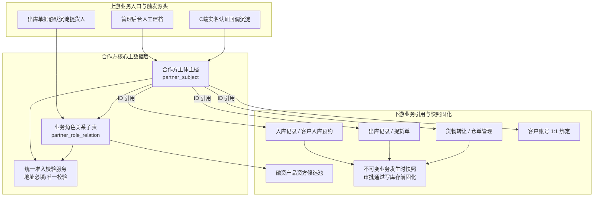

# 合作方档案主PRD

> **模块定位**：业务主体主数据层核心台账，集中维护全平台个人与企业合作方主体身份资料、证件地址、业务角色关系（货主、提货经办人、接收方、资金方等）及主体与角色双层生命周期状态。作为全平台入库、出库、转让、仓单、融资等业务的统一主数据源与防篡改凭据快照源，彻底消除多头建档与主体识别冲突。  
> **版本**：V1.5 | **更新时间**：2026-09-20 | **责任人**：森云科技（Senyun Technology）  
> **编写依据**：[合作方档案字段清单.md](./合作方档案字段清单.md) 是本模块所有字段定义、枚举与页面展示的唯一基准；[合作方档案业务规则规格.md](./合作方档案业务规则规格.md) 是本模块双层状态机、角色隔离冻结、准入联动、存量强校验及并发控制的唯一定义来源；[合作方准入规则主PRD.md](../02-合作方准入规则/合作方准入规则主PRD.md) 是准入策略控制依据；[合作方档案-用例数据推演.md](./合作方档案-用例数据推演.md) 提供业务沙盘验证。  
> **页面范围**：覆盖合作方档案列表页、新增/编辑合作方页、合作方详情页、嵌入场景「查看货主」弹窗及下游合作方选择器。  
> **ASCII 线框**：[合作方档案_ASCII_列表页](./合作方档案_ASCII_列表页.md) · [合作方档案_ASCII_新增编辑页](./合作方档案_ASCII_新增编辑页.md) · [合作方档案_ASCII_详情页](./合作方档案_ASCII_详情页.md)

---

## 1. 业务背景与业务痛点

### 1.1 业务背景
在 SYZC 供应链金融存货监管系统中，货主、提货经办人、接收方、资金方等业务主体长期分散在入库、出库、转让、仓单、融资等各模块重复手工维护。此前个人货主曾以手机号作为标识，导致主体识别标准不统一、证件地址缺失、个人货主地址重复绑定等风控漏洞。

【合作方档案】作为 6.3 版本的统一合作方主数据层，以**身份证号（个人）/ 统一社会信用代码（企业）**为租户内唯一识别键，集中收口主体身份资料、证件地址、业务角色关系及主体/角色双层生命周期状态，为全平台业务单据提供**统一引用源**与**不可变快照**来源。

### 1.2 核心业务痛点
1. **主体识别分裂**：各作业单据各自维护货主，手机号与姓名检索口径不一，历史重复建档泛滥；
2. **个人货主地址风险**：缺乏证件登记地址硬核验，同一地址被多个身份证号冒用绑定为个人货主，导致开票主体与货权归属混淆；
3. **业务角色与权限角色混淆**：货主、提货人等业务合作关系被误当作系统登录权限角色（RBAC），缺乏按角色隔离冻结机制；
4. **简易沉淀冒用货主风险**：出库等单据静默沉淀的简易经办人档案若未补全证件地址即作为货主入库，容易形成监管真空；
5. **缺乏存量强校验与防误删机制**：主数据缺乏物理防误删保护，若名下存在在库库存或有效质押仓单时被随意注销，证据链将彻底中断。

---

## 2. 功能范围

| 包含功能范围 | 不包含功能范围 |
| :--- | :--- |
| - **合作方主体主档管理**：支持个人与企业主体的新增、编辑、列表检索、穿透式详情展示与多维组合筛选； - **业务角色关系子表维护**：第一期上线支持货主、提货经办人、接收方、资金方 4 类业务角色，支持追加角色、补全资料、角色冻结/解冻与角色移除； - **双层生命周期状态机**：主体状态（正常/冻结/注销）与角色状态（待补全/正常/冻结/失效）双层驱动；状态字段仅限按钮触发，严禁表单内下拉改动； - **证件地址主档维护**：统一维护个人（身份证）与企业（营业执照）证件地址，新增/生效货主角色时联动调用统一准入校验服务； - **五大标签页详情穿透**：提供基础档案、业务角色、关联客户账号、关联业务单据（只读穿透跳转）及全路径操作审计日志； - **嵌入式组件数据供给**：为下游入库记录、客户入库预约等页面提供「查看货主」弹窗及合作方全局下拉选择器； - **多源建档与沉淀支持**：支持人工主动建档、客户端（C 端）实名认证回调沉淀，以及业务单据静默沉淀简易档案。 | - **系统登录权限与菜单分配**：后台端（B 端）账户登录与菜单按钮权限统一由系统角色管理（RBAC）负责，合作方不承担登录角色职能； - **客户端（C 端）注册与认证流程**：C 端用户账号生命周期、密码策略由交易客户管理负责； - **准入策略与开关配置**：个人货主证件地址必填与唯一校验开关由配置管理准入规则模块维护； - **具体作业单据状态流转**：入库、出库、转让、仓单各单据自身的状态流转与审核流程由各仓储模块规格唯一定义； - **新货主短信二元核验弹窗**：短信核验仅在入库记录与客户入库预约场景触发，合作方档案人工建档不触发短信下发； - **提货主体与仓单角色扩展**：企业提货主体双层关系、仓单存货人与持有人角色划入后续批次纳管； - **移动端（H5）独立档案维护菜单**：移动端不设独立维护入口，统一复用电脑端选择器与创建接口。 |

---

## 3. 模块定位与系统链路

### 3.1 实体属性与引用关系规范

| 属性项目 | 规范要求 |
| :--- | :--- |
| **数据层级** | **【第 1 层 · 业务主体主数据层】**（全平台业务主体唯一台账） |
| **唯一识别键** | 个人：18 位身份证号（租户内唯一）；企业：18 位统一社会信用代码（租户内唯一） |
| **双层状态控制** | **主体状态**（正常 / 冻结 / 注销） + **角色状态**（待补全 / 正常 / 冻结 / 失效） |
| **单据引用模式** | 业务单据保存合作方主体标识引用；**凭据快照**于单据终审通过且写库存/货权变更前固化 |
| **物理删除管控** | **严禁物理删除**；历史归档仅支持注销或角色失效，关键动作全路径审计留痕 |
| **数据隔离机制** | 租户级数据物理隔离；地址唯一校验范围为同一租户内适用项目/业务范围 |

### 3.2 档案引用与系统链路拓扑图

### 3.3 跨模块数据互通与业务快照固化

依据全系统数据互通规范，下游单据引用合作方主档时遵循以下交互约定：

| 协同模块 | 交互阶段与触发时机 | 具体数据更新行为与业务效力 |
| :--- | :--- | :--- |
| **【09-入库记录】** | 制单引用 / 审批通过 | 1. **制单选择**：根据货主类型模糊联想合作方，反显名称与脱敏证号，不平铺地址； 2. **准入校验**：新建货主时调用统一准入服务，校验通过后再执行短信二元核验； 3. **快照固化**：审批通过且写库存前，原子固化发生时货主名称、证号、证件地址及来源。 |
| **【01-客户入库预约】** | 发起预约 / 审批通过 | 1. **前置阻断**：个人货主证件地址冲突在生成预约申请前阻断，不进审批流； 2. **审批联动**：审批通过时固化主体快照，转正式入库时直接继承。 |
| **【04-货物转让】** | 发起转让 / 转让生效 | 1. **申请阶段**：挂接接收方角色为【待生效】，不执行货主地址唯一校验； 2. **转让生效**：接收方角色转为【正常】货主，触发地址准入校验，冲突则阻止生效。 |
| **【02-出库记录/提货单】** | 出库制单 / 提货办理 | 1. **提货主体/经办人分层**：企业出库支持双层主体引用，提货经办人不触发货主地址校验； 2. **静默沉淀**：录入新经办人自动创建待补全角色，记录来源单号。 |
| **【04-客户管理】** | 实名认证通过 | 1. **账号绑定**：客户账号与合作方主体建立 1:1 绑定； 2. **默认角色**：个人认证通过默认增加货主角色并同步身份证地址。 |

---

## 4. 业务场景与用户故事

| 场景编号与名称 | 触发角色 | 核心交互与风控约束 | 业务价值 |
| :--- | :--- | :--- | :--- |
| **场景 1【人工主动建档个人货主】(S01)** | 业务运营人员 | 录入姓名、身份证号、手机号与证件地址（来源：身份证），初始业务角色勾选货主；系统调用统一准入服务，无地址冲突则建档成功；**人工建档入口不触发短信二元核验**。 | 规范后台线下合作方主数据录入通道。 |
| **场景 2【身份标识重复建档阻断】(S02)** | 业务运营人员 | 录入已在租户内建档的身份证号或统一社会信用代码；系统前置强阻断保存，并弹窗提示「该主体已存在，请前往详情追加角色配置」。 | 彻底杜绝一企多档、一人多档的主数据分裂。 |
| **场景 3【个人货主证件地址冲突拦截】(S03)** | 业务运营 / C端用户 | 试图使用已被其他有效个人货主绑定的证件地址新增或修改个人货主；系统同步阻断并统一提示「已有相同证件地址，不能绑定为该个人货主」，且**严禁泄露冲突方敏感信息**。 | 防范多主体冒用同一地址虚假质押，保障开票主体唯一性。 |
| **场景 4【出库单据静默沉淀提货人】(S04)** | 仓储制单人员 | 出库单录入新提货司机身份证号与手机号；系统自动静默创建合作方档案，角色关系标记为【提货经办人 · 待补全】；**非货主角色不触发地址唯一校验**。 | 保障现场出库作业流畅度，同时沉淀人员履约主数据。 |
| **场景 5【待补全档案补全并晋升货主】(S05)** | 业务运营人员 | 在合作方详情中对待补全主体点击【补全资料】，补充必填证件地址并追加货主角色；系统调用准入规则，校验通过后角色状态转为【正常】，方可在入库中被选取为货主。 | 设立简易档案转货主前置门禁，防范缺资料主体违规发单。 |
| **场景 6【按角色维度隔离冻结】(S06)** | 风控审核专员 | 某主体因货主违约触发风控，在详情页对其【货主】角色执行冻结并强制录入原因；系统仅拦截其作为货主的新发入库与融资，**该主体名下的提货经办人角色不受影响**。 | 精准隔离单点违约风险，保障无辜第三方货权正常流转。 |
| **场景 7【审批中货主冻结联动驳回】(S07)** | 仓储审批人员 | 入库单在审批中，货主主体或货主角色被风控冻结；审批人在终审通过时触发系统二次复检（re-validate），强校验失败直接自动驳回入库单，严禁写入物理库存。 | 杜绝审批时差导致的风控穿透漏洞。 |
| **场景 8【在库库存强阻断主体注销】(S08)** | 平台超级管理员 | 对名下存在在库库存、未注销仓单或未结融资的合作方执行注销；系统扫描存量依赖并前置弹窗阻断，列示阻断摘要，严禁注销。 | 保护在押资产与司法凭证完整性，杜绝逃废债。 |
| **场景 9【货主角色失效后地址释放】(S09)** | 平台超级管理员 | 个人货主通过存量核验后注销主体或移除货主角色；该证件地址从唯一校验活跃池中释放，后续允许其他合法新身份证号绑定该地址。 | 确保地址唯一性与现实人员流动、房屋流转相契合。 |
| **场景 10【简易重复档案合并治理】(S10)** | 业务运营人员 | 发现出库录入笔误产生的简易沉淀主体与真实存量主体重复时，发起事务合并；系统将单据关联迁移至真实主体，原简易角色标记为失效留痕。 | 赋能系统数据治理，消除录入笔误对台账的干扰。 |
| **场景 11【客户端认证回调自动建档】(S11)** | 系统自动化 | C 端用户完成个人实名认证，系统自动同步身份证地址并创建合作方主档，默认挂接正常货主角色并写入 1:1 账号绑定关系。 | 实现 C 端与 B 端主体主数据秒级打通。 |

---

## 5. 状态机与动作能力矩阵

### 5.1 主体状态机与能力矩阵

| 动作名称 | 正常 | 冻结 | 注销 ⭐终态 |
| :--- | :---: | :---: | :---: |
| **查看列表与详情** | ✅ | ✅ | ✅（只读归档展示） |
| **编辑基础档案资料** | ✅（按权限） | ⚠️（仅限非关键字段） | ❌ |
| **编辑证件地址** | ✅（个人须通过准入） | ⚠️（仅限纠偏且须通过准入） | ❌ |
| **追加业务角色** | ✅ | ❌ | ❌ |
| **冻结主体** | ✅（风控权限；弹窗必录原因 $\le 200$ 字） | ❌ | ❌ |
| **解冻主体** | ❌ | ✅（审批通过；弹窗必录原因） | ❌ |
| **注销主体** | ✅（通过存量强校验 PA-R05） | ✅（通过存量强校验 PA-R05） | ❌ |
| **物理删除** | ❌（系统绝对禁止） | ❌（系统绝对禁止） | ❌（系统绝对禁止） |

### 5.2 角色状态机与能力矩阵（单条业务角色关系）

| 动作名称 | 待补全 | 待生效 | 正常 | 冻结 | 失效 ⭐终态 |
| :--- | :---: | :---: | :---: | :---: | :---: |
| **查看角色详情** | ✅ | ✅ | ✅ | ✅ | ✅ |
| **补全角色资料** | ✅（补全地址过准入） | ❌ | ❌ | ❌ | ❌ |
| **作为货主提交入库/预约** | ❌（前置强阻断） | ❌ | ✅ | ❌（前置拦截） | ❌ |
| **作为提货人办理出库** | ⚠️（按出库规则放宽） | ❌ | ✅ | ❌（拦截新发） | ❌ |
| **冻结业务角色** | ❌ | ❌ | ✅（风控权限；强制原因） | ❌ | ❌ |
| **解冻业务角色** | ❌ | ❌ | ❌ | ✅（审批通过） | ❌ |
| **移除业务角色** | ✅（通过存量校验） | ✅ | ✅（通过存量校验） | ✅（通过存量校验） | ❌ |

---

## 6. 页面交互规格索引

### 6.1 合作方档案 — 列表页
- **页面路径**：`合作方管理 → 合作方档案`
- **线框基准**：[合作方档案_ASCII_列表页](./合作方档案_ASCII_列表页.md)
- **核心规格**：
  - 两行筛选区：主体名称/身份标识（合并模糊搜索）、主体类型、业务角色、主体状态、角色状态、创建来源、创建时间范围、黄色【查询】与【重置】；
  - 数据表格（8 列）：`序号`、`主体名称/身份标识`（第一行主体名称高亮可点击下钻详情，第二行展示脱敏证号）、`主体类型`、`业务角色`（彩色标签聚合呈现）、`主体状态`（绿色/橙色/灰色状态徽章）、`创建人`、`创建时间`、`操作`；
  - 固定行操作：【详情】、【编辑】、【追加角色】、【冻结/解冻】、【注销】；
  - 页面右上角提供【+ 新增合作方】入口。

### 6.2 新增/编辑合作方页
- **页面路径**：列表页点击【+ 新增合作方】或行操作【编辑】
- **线框基准**：[合作方档案_ASCII_新增编辑页](./合作方档案_ASCII_新增编辑页.md)
- **核心规格**：
  - 新增页单选【主体类型】（个人/企业）；企业展示统一社会信用代码，个人展示真实姓名与身份证号；主体类型与识别证号保存后永久锁定；
  - 证件地址输入框下方固定展示只读辅助说明：个人为「证件地址来源：身份证」，企业为「证件地址来源：营业执照」；
  - 新增页可选勾选【初始业务角色】；勾选货主时提交即刻调用准入校验服务；
  - 表单内严禁渲染状态修改下拉框，状态字段以只读徽章展示；
  - 未保存离开页面时触发防误离开二次确认拦截。

### 6.3 合作方详情页
- **页面路径**：列表页行操作点击【详情】或名称下钻
- **线框基准**：[合作方档案_ASCII_详情页](./合作方档案_ASCII_详情页.md)
- **核心规格**：
  - 顶部单据卡片：主体名称、类型、脱敏身份标识、主体状态徽章，右上角提供【返回】、【编辑】、【追加角色】、【冻结主体】、【注销主体】动作栏；
  - 底部五标签页联动：
    - **标签页 1【基础档案】**：展示工商/个人资质明细、脱敏手机号、证件地址及来源说明；
    - **标签页 2【业务角色】**：子表格呈现该主体挂接的各角色、角色状态徽章、来源单据号（支持下钻）及角色生效时间；提供行内【补全】、【冻结】、【移除】操作；
    - **标签页 3【关联客户账号】**：只读展示绑定的 C 端账号、认证状态与绑定时间；
    - **标签页 4【关联业务单据】**：只读穿透展示关联的入库、出库、转让等单据列表，支持跳转各模块详情；
    - **标签页 5【操作审计日志】**：时间轴形式呈现主体创建、资料变更、冻结解冻、角色移除的全量审计日志。

### 6.4 嵌入场景：「查看货主」弹窗规格
- **唤起入口**：仓储入库记录、客户入库预约等页面货主选择器旁提供【查看货主】链接；
- **展示要素**：居中弹窗展示主体类型、名称、脱敏身份证号/信用代码、脱敏联系电话、脱敏证件地址、业务角色标签及主体状态；
- **交互动作**：提供【查看详情】（在新标签页打开合作方档案详情）；若主体角色为待补全或缺少必填地址，突出展示黄色【去补全】按钮直达编辑页。

### 6.5 下游合作方选择器规范
- **返回数据结构**：合作方主体唯一标识、主体名称、脱敏身份标识、主体类型、业务角色、角色状态、主体状态；
- **基础过滤规则**：默认严格过滤主体状态为「正常」且引用角色状态为「正常」的有效主体。

---

## 7. 核心业务规则索引

| 规则编码与名称 | 规则核心逻辑摘要 | 规则规格唯一定义章节 |
| :--- | :--- | :--- |
| **【主体与角色双层拦截规则】(PA-R01)** | 业务接口必须同时校验主体状态与引用角色状态；角色冻结优先拦截，主体冻结兜底拦截 | [业务规则规格 §六](./合作方档案业务规则规格.md#主体与角色双层拦截规则pa-r01) |
| **【按角色隔离冻结规则】(PA-R02)** | 冻结某一业务角色（如货主）不得波及同主体其他无关角色（如提货经办人）；拦截入库终审通过 | [业务规则规格 §六](./合作方档案业务规则规格.md#按角色隔离冻结规则pa-r02) |
| **【主体识别与禁止重复建档规则】(PA-R03)** | 个人按身份证号、企业按统一社会信用代码实现租户内唯一识别；已存在严禁双建，引导追加角色 | [业务规则规格 §六](./合作方档案业务规则规格.md#主体识别与禁止重复建档规则pa-r03) |
| **【货主准入与地址唯一联动规则】(PA-R04)** | 新增/生效货主或修改地址调用统一准入服务；个人货主同址冲突同步阻断，统一提示文案且不泄露他人隐私 | [业务规则规格 §六](./合作方档案业务规则规格.md#货主准入与地址唯一联动规则pa-r04) |
| **【注销与移除角色存量强校验规则】(PA-R05)** | 注销主体或移除货主前，强制扫描在库库存、有效仓单、未结融资及待审批单据，存在任一项绝对阻断 | [业务规则规格 §六](./合作方档案业务规则规格.md#注销与移除角色存量强校验规则pa-r05) |
| **【货主地址活跃池释放规则】(PA-R06)** | 货主角色失效或主体注销后，证件地址从唯一校验活跃池中释放，允许新身份证号重新绑定 | [业务规则规格 §六](./合作方档案业务规则规格.md#货主地址活跃池释放规则pa-r06) |
| **【禁止物理删除与审计留痕规则】(PA-R07)** | 严禁物理 DELETE 主体与角色记录；冻结、注销、改址等敏感动作强制录入 $\le 200$ 字原因全路径留痕 | [业务规则规格 §六](./合作方档案业务规则规格.md#禁止物理删除与审计留痕规则pa-r07) |
| **【状态变更按钮驱动规则】(PA-R08)** | 主体与角色状态在所有表单中设为只读徽章；严禁下拉直接改动，必须经独立按钮与二次弹窗驱动 | [业务规则规格 §六](./合作方档案业务规则规格.md#状态变更按钮驱动规则pa-r08) |
| **【并发防重与幂等规则】(PA-R09)** | 采用防重令牌、分布式锁与数据库租户级联合唯一索引三重防护，防范并发重复提交 | [业务规则规格 §六](./合作方档案业务规则规格.md#并发防重与幂等规则pa-r09) |
| **【简易沉淀与合并治理规则】(PA-R10)** | 录入错误产生的简易档案后续走原子事务合并至真实主体，原记录置失效留痕，不重复建档 | [业务规则规格 §六](./合作方档案业务规则规格.md#简易沉淀与合并治理规则pa-r10) |
| **【租户与项目数据隔离规则】(PA-P01)** | 主体增删改查与状态变更强校验当前租户标识；跨租户物理隔离且互不比较地址 | [业务规则规格 §八](./合作方档案业务规则规格.md#租户与项目数据隔离规则pa-p01) |
| **【合作方档案操作权限矩阵】(PA-P02)** | 平台管理、业务运营与风控人员严格按权限矩阵隔离新建、编辑、冻结与注销操作 | [业务规则规格 §八](./合作方档案业务规则规格.md#合作方档案操作权限矩阵pa-p02) |

---

## 8. 非功能性需求

### 8.1 性能要求
- **列表检索响应时间**：在租户 5 万级合作方数据量下，组合多条件模糊检索响应时间 $\le 0.8\text{s}$；
- **统一准入接口响应时间**：地址标准化与唯一性比对服务单次调用耗时 $\le 100\text{ms}$；
- **详情页标签切换**：各标签页采用异步按需加载，首屏渲染耗时 $\le 0.5\text{s}$。

### 8.2 安全性与合规性
- **敏感数据脱敏**：个人身份证号展示脱敏中间 8 位，手机号脱敏中间 4 位；地址冲突提示绝对禁止回显冲突主体的姓名与证号；
- **数据防篡改**：已发生业务单据中的主体历史快照一旦生成即刻固化，合作方主档后续资料变更严禁回写历史单据；
- **审计留痕追溯**：主体资料修改、状态变更、角色增删操作日志保留 5 年以上不可更改。

---

## 9. 修订记录

| 日期 | 版本 | 变更内容说明 | 影响范围 | 修订人 |
| :--- | :--- | :--- | :--- | :--- |
| 2026-09-20 | V1.0 | **初始化 6.3 统一合作方档案主 PRD**：确立以身份证/信用代码为唯一主键的主档定位与双层状态机。 | 全模块 | AI PM / 森云科技 |
| 2026-09-20 | **V1.5** | **规范化重构（对齐基准版样式与语言去水）**： 1. 规范文头为 4 行精干引用块，移除大段说教表格； 2. 建立【包含】vs【不包含】双栏功能范围表与跨模块数据互通表； 3. 全量汉化专业术语（Tab/Tag/Badge/Dirty 等）； 4. 重构 11 场景故事表为标准 4 列自解释格式，条目化核心业务规则索引。 | 主 PRD 全文 | AI PM / 森云科技 |
