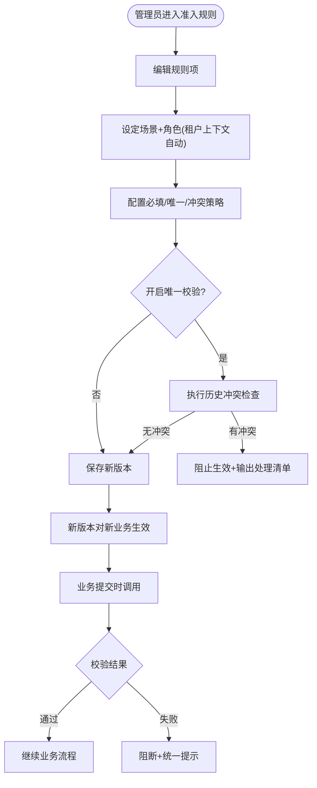
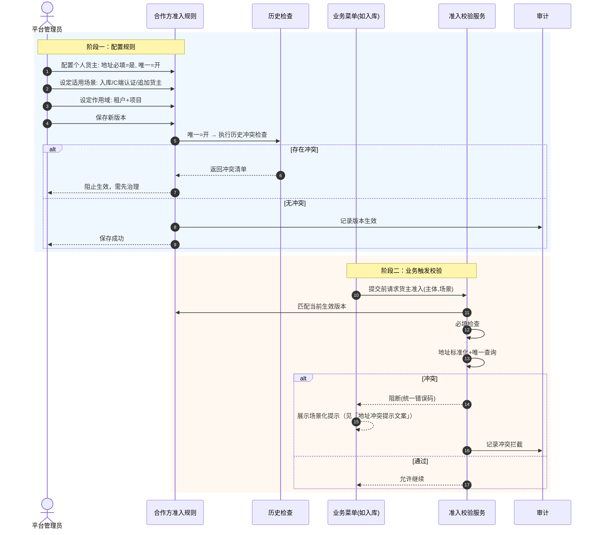

# 合作方准入规则-业务流程推演

> **覆盖场景**：规则配置 / 地址必填与唯一开关 / 规则版本生效 / 历史数据检查 / 业务场景触发校验  
> **不展开范围**：具体接口字段编码、地址标准化算法实现细节  
> **参考文档**：[合作方准入规则主PRD](./合作方准入规则主PRD.md) · [合作方准入规则业务规则规格](./合作方准入规则业务规则规格.md) · [合作方准入规则字段清单](./合作方准入规则字段清单.md) · [合作方档案主PRD](../01-合作方档案/合作方档案主PRD.md) · [合作方改造-存量业务单据协同规格](../03-存量改造与关联业务协同/合作方改造-存量业务单据协同规格.md)  
> **版本**：V1.5 | 2026-09-20

---

## 一、业务流程概述

### 1.1 核心业务特征说明

- ✅ **独立配置入口**：`配置管理 → 平台管理 → 合作方准入规则`；不埋入「基础配置」通用页。
- ✅ **双开关独立控制**：「个人货主证件地址必填」与「个人货主证件地址唯一校验」互不替代。
- ✅ **场景化规则**：按主体类型、业务角色、业务场景（C端认证、入库、转让等）配置字段要求与校验。
- ⚠️ **版本生效不回写**：规则变更仅影响新产生/新生效的业务关系；已完成业务快照不变（C08 原则）。
- ⚠️ **开启唯一校验前历史检查**：存在冲突则阻止规则直接生效（见「地址必填与地址唯一两个开关的组合行为」）。

### 1.2 本业务在全局数据链路中的位置

### 1.3 完整端到端流程图

---

## 二、涉及角色与参与主体

| 参与主体 | 核心职责 | 参与节点 |
| :--- | :--- | :--- |
| 平台管理员 | 维护全局准入规则 | 新增/编辑/启停规则 |
| 项目管理员 | 维护本项目规则（若启用项目级） | 范围配置、历史检查 |
| 业务运营 | 只读或按授权查看规则说明 | 理解阻断原因 |
| 各作业菜单 | 调用校验服务 | 提交/创建货主/追加角色时 |
| 审计 | 记录规则变更 | 版本前后值、操作人、原因 |

---

## 三、涉及单据、记录与职责

| 单据 / 记录名称 | 业务层级 | 核心职责 | 上游来源 | 下游联动 |
| :--- | :--- | :--- | :--- | :--- |
| 准入规则主记录 | 配置层 | 规则名称、编码、版本 | 人工配置 | 校验服务加载 |
| 规则维度项 | 配置子层 | 场景/角色/字段/校验 | 规则主记录 | 按场景匹配 |
| 规则版本历史 | 审计层 | 变更前后、生效时间 | 保存操作 | 新业务按新版 |
| 历史冲突检查报告 | 治理层 | 开启唯一前扫描结果 | 检查任务 | 阻止/允许生效 |
| 校验失败审计 | 运行时 | 冲突拦截留痕 | 业务触发 | 风控追溯 |

---

## 四、主流程时序推演

---

## 五、单据与事件级联联动规则表

| 触发动作 | 触发条件 | 级联影响对象 | 传递数据 | 后置变更 | 异常策略 |
| :--- | :--- | :--- | :--- | :--- | :--- |
| 保存规则新版本 | 管理员提交 | 校验服务缓存/加载 | 版本号、生效时间 | 新业务用新版 | 旧版继续服务进行中单据 |
| 开启地址唯一 | 历史无冲突 | 个人货主新建/改址 | 标准化比较值 | 冲突即阻断 | 有冲突则禁止启用 |
| 开启地址必填 | 历史缺地址 | 新货主业务 | — | 缺地址拦截提交 | 需补录窗口 |
| 非必填+唯一开 | 地址为空 | 唯一比较 | 空值不参与比较 | 允许空地址建档 | 见双开关组合行为 |
| 必填+唯一关 | 有地址 | 仅格式校验 | 地址原文 | 允许同地址不同人 | 业务方需知悉风险 |

### 推荐默认规则（最终以产品评审为准）

| 控制项 | 推荐默认 |
| :--- | :--- |
| 个人货主证件地址 | 必填 |
| 个人货主证件地址唯一校验 | 开启 |
| 冲突处理 | 阻断（不进审批） |
| 企业证件地址 | 按企业认证要求；不参与个人一对一 |

---

## 六、关键异常与分支处置推演

- **分支 1【历史冲突阻止启用】**：管理员开启唯一校验时，系统扫描存量个人货主，存在同地址不同身份证号 → 输出清单，规则不生效。
- **分支 2【规则变更不回写】**：管理员关闭唯一校验后再开启，不回写历史已产生的重复数据；重新开启仍须历史检查。
- **分支 3【多场景规则冲突】**：见决策清单「多场景准入规则冲突如何取舍」。
- **分支 4【开关关闭期间产生的重复地址】**：重新开启时由历史检查拦截，需数据治理后再启用。
- **分支 5【空地址+唯一开启】**：见决策清单「地址必填与地址唯一两个开关的组合行为」。

---

## 七、关键架构决策与证据留痕

1. **为什么独立菜单而不放基础配置？**  
   准入规则含角色、场景、版本、历史检查，与平台通用参数职责不同；独立入口可发现、可审计。

2. **为什么必填与唯一分离？**  
   解决不同业务阶段诉求：可先允许无地址建档，但对已填地址强制唯一；或强制有地址但不限重复（不推荐）。

3. **为什么采用版本管理【规则版本递增与存量流水不回写】(C08)？**  
   与预警配置一致：规则变更不影响已完成业务快照与司法存证。

4. **为什么冲突策略默认阻断？**  
   地址重复意味着主体身份风险，不适合走常规审批消化；应同步拦截并引导数据治理。

---

## 八、本菜单相关问题与决策

| 主题 | 问题 | 决策方案 |
| :--- | :--- | :--- |
| 历史缺地址 | 历史货主缺地址，开启「地址必填」前怎么办？ | **存量盘点+补录窗口**；开启前限制新发个人货主 |
| 作用域 | 准入规则与唯一校验的作用域？ | 租户隔离；地址唯一 = 租户内适用项目/业务范围 |
| 地址标准化 | 地址标准化规则如何实现唯一校验？ | 标准化比较值；保留原文；不做模糊近似 |
| 双开关组合 | 「必填」与「唯一」两开关组合行为？ | 见决策清单对应章节 |
| 多场景冲突 | 多场景/多版本规则冲突如何取舍？ | 场景优先 → 最新版本 → 更严格 |

完整清单见 [00-合作方统一管理-推演问题清单.md](../../00-合作方统一管理-推演问题清单.md)。

---

## 修订记录

| 日期 | 版本 | 变更说明 |
| :--- | :---: | :--- |
| 2026-09-20 | V1.0 | 初始化合作方准入规则业务流程推演 |
| 2026-09-20 | V1.1 | 同步已定稿决策 |
| 2026-09-20 | V1.2 | 规则引用对齐基准版格式；去除裸编号 |
| 2026-09-20 | V1.3 | 同步字段清单 V1.2：P0 单规则+个人货主双开关；校验字段映射档案 |
