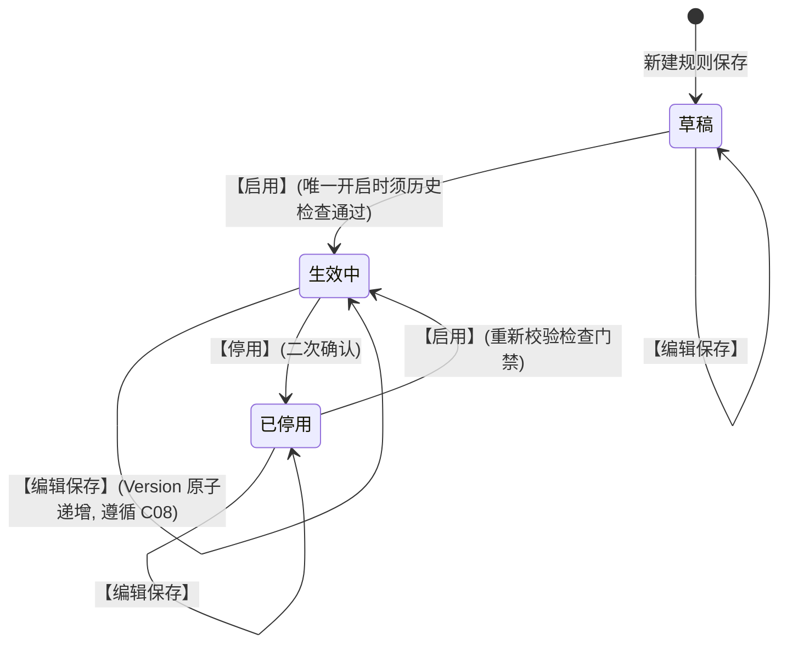
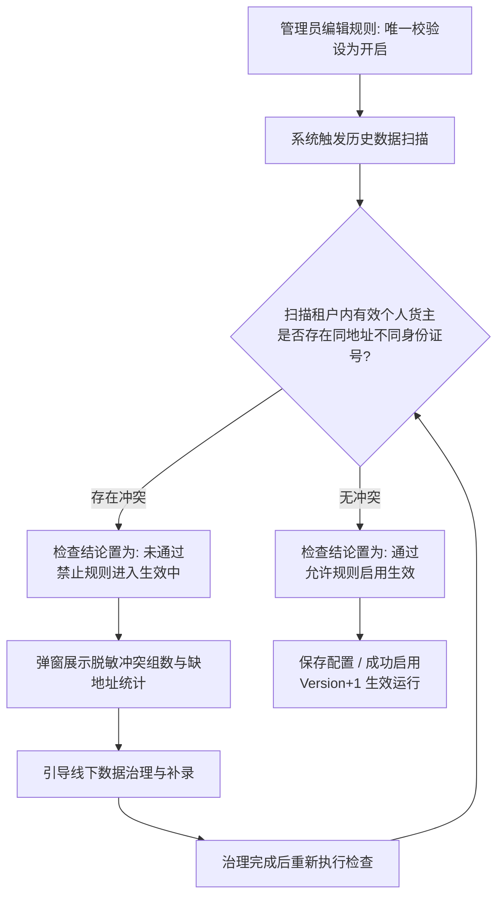

# 合作方准入规则业务规则规格

> **模块定位**：合作方准入规则模块规则生命周期、版本生效、场景匹配、地址双开关组合、历史冲突检查与运行时校验的**唯一定义来源（SSOT）**。主 PRD、字段清单及下游业务菜单仅引用本文件规则名称与编号，不重复定义规则本体。  
> **范式类型**：范式 C · 配置与规则类（规则版本递增、存量不回写、保存升版本、无审批流）  
> **参考文档**：[合作方准入规则主PRD.md](./合作方准入规则主PRD.md) · [合作方准入规则字段清单.md](./合作方准入规则字段清单.md) · [合作方档案业务规则规格.md](../01-合作方档案/合作方档案业务规则规格.md) · [合作方改造-存量业务单据协同规格.md](../03-存量改造与关联业务协同/合作方改造-存量业务单据协同规格.md)  
> **版本**：V1.5 | **更新时间**：2026-09-20 | **责任人**：森云科技（Senyun Technology）

---

## 一、单据与能力定位

| 项目 | 内容规格 |
| :--- | :--- |
| **单据层级** | **【配置策略层】**（全系统合作方主数据准入校验控制策略） |
| **菜单路径** | `配置管理 → 平台管理 → 合作方准入规则` |
| **核心职责** | 集中维护租户内个人货主准入控制策略：个人货主证件地址必填与唯一校验双开关、适用业务角色与业务场景、冲突处理策略；向全系统统一准入校验服务提供生效规则版本；开启唯一校验前强制执行历史冲突检查门禁。 |
| **不负责范围** | 合作方主体身份字段定义（由合作方档案负责）；底层地址标准化算法实现细节；仓储各业务单据自身状态机；审批中心例外流转。 |
| **数据存储结构** | 准入规则主记录、准入规则版本审计历史记录 |
| **上下游关系** | **上游**：平台超级管理员维护规则配置； **下游**：合作方档案、交易客户管理、仓储入库记录、客户入库预约、货物转让等业务单据调用**统一准入校验服务**。 |
| **数据隔离机制** | 规则严格按**租户**物理隔离；地址唯一比对范围为**同一租户内适用项目/业务范围**；跨租户不共享规则且互不比较地址。 |

---

## 二、规则状态定义与历史检查状态

### 2.1 规则主记录状态定义表

| 状态名称 | 业务含义 | 是否终态 | 列表可见性 | 进入条件 | 离开条件 |
| :--- | :--- | :---: | :---: | :--- | :--- |
| **草稿** | 新建规则尚未对外生效，处于初始编辑期 | 否 | 可见 | 新建保存未启用 | 启用成功 $\rightarrow$ 生效中 |
| **生效中** | 规则正式对外生效，准入服务按当前版本实时校验 | 否 | 可见 | 启用成功（唯一开启时须历史检查通过） | 停用 $\rightarrow$ 已停用；编辑保存 $\rightarrow$ 升版生效 |
| **已停用** | 规则临时停止对外生效，新发业务不再匹配该规则 | 否 | 可见 | 管理员手动停用确认 | 重新启用 $\rightarrow$ 生效中 |

#### 状态三问 · 草稿
- **阶段**：新规则配置中，不对运行时业务产生任何拦截影响；
- **允许**：修改全部配置项、执行历史冲突检查、执行启用操作；
- **禁止**：物理删除、被运行时准入服务加载执行。

#### 状态三问 · 生效中
- **阶段**：生产运行态，策略版本已发布；
- **允许**：查看详情、停用规则、编辑保存（触发版本号原子递增）；
- **禁止**：直接改动已发布版本的阈值（必须走升版逻辑）。

#### 状态三问 · 已停用
- **阶段**：策略下线或暂停期；
- **允许**：查看详情、编辑配置、重新启用；
- **禁止**：对新发业务执行拦截匹配。

### 2.2 历史冲突检查状态定义

| 状态名称 | 界面徽章配色 | 业务含义说明 |
| :--- | :--- | :--- |
| **未检查** | 灰色徽章 | 唯一校验为关闭状态，或规则编辑后尚未触发检测 |
| **通过** | 绿色徽章 | 历史数据扫描无同址多主体冲突，允许启用唯一校验 |
| **未通过** | 红色徽章 | 扫描发现存量同址不同身份证号冲突，绝对禁止启用唯一校验 |

---

## 三、状态流转图

### 3.1 规则主记录状态机流转图

### 3.2 开启「地址唯一」时的历史检查门禁流程图

---

## 四、状态流转动作表

| 当前状态 | 触发动作 | 适用角色 | 前置业务校验条件 | 目标状态 | 二次确认与弹窗 | 联动后置影响 | 失败阻断提示 |
| :--- | :--- | :--- | :--- | :--- | :--- | :--- | :--- |
| — | **新建/编辑保存** | 平台超级管理员 | 规则名称租户内唯一；双开关组合合法；修改开关须填写原因 | 草稿 / 保持生效中 | 调整开关强制弹窗录入变更原因 | 生效中编辑保存触发规则版本号自动递增；记录全路径审计 | 「保存失败：规则名称在租户内已存在」 |
| **草稿 / 已停用** | **启用规则** | 平台超级管理员 | 若唯一校验为【开】，必须满足历史冲突检查结果为【通过】 | 生效中 | 无 / 历史检查弹窗 | 准入服务热加载最新生效版本；新发业务立即执行校验 | 「启用失败：历史数据存在地址冲突，请先完成数据治理」 |
| **生效中** | **停用规则** | 平台超级管理员 | 处于生效中状态 | 已停用 | 二次确认弹窗 | 准入服务卸载本规则；新发业务不再匹配；在途单据按提交版本复检 | — |
| **任意状态** | **执行历史冲突检查** | 平台超级管理员 | 个人货主证件地址唯一校验处于【开】状态 | 状态不变 | 历史冲突检查弹窗 | 异步扫描存量个人货主并更新历史冲突检查状态 | 「检测失败：系统繁忙，请稍后重试」 |
| **任意状态** | **表单内直接改状态** | — | — | — | **系统绝对禁止** | — | 前端不渲染状态下拉框，服务端接口强校验拦截 |

---

## 五、动作能力矩阵

| 业务动作 | 草稿 | 生效中 | 已停用 |
| :--- | :---: | :---: | :---: |
| **查看规则列表与详情** | ✅ | ✅ | ✅ |
| **编辑规则配置** | ✅ | ✅（保存后版本自动升版） | ✅ |
| **启用规则** | ✅（唯一开启时须检查通过） | ❌ | ✅（唯一开启时须检查通过） |
| **停用规则** | ❌ | ✅（二次确认） | ❌ |
| **手动执行历史冲突检查** | ✅（限唯一开启） | ✅（限唯一开启） | ✅（限唯一开启） |
| **物理删除规则** | ❌（系统绝对禁止） | ❌（系统绝对禁止） | ❌（系统绝对禁止） |

---

## 六、核心业务规则清单 (PAR-R01 ~ PAR-R09)

#### 【规则版本递增与存量不回写】(PAR-R01 / C08)
* **【版本原子自增】**：处于生效中的规则一旦编辑保存成功，系统自动生成新版本记录，规则版本自动累加（例如由 `V1` 升为 `V2`）；
* **【存量绝对不回写】**：准入规则新版本生效后，**严禁回写或重新校验已完成的入库单、仓单及已固化的主体快照**；
* **【在途单据版本锚定】**：审批流转中的在途单据按提交时刻固化的准入规则标识与规则版本号执行二次复检，策略变更不自动撤销审批中单据。

#### 【场景优先匹配规则】(PAR-R02)
* **【匹配优先级】**：运行时统一准入校验服务按以下层级执行规则检索：
  1. **场景精确匹配**：优先匹配与触发业务场景（C端认证/人工建档/入库/客户入库预约/追加货主）完全一致的规则；
  2. **最新生效版本**：命中同一场景的多条规则时，强制加载状态为「生效中」且版本号最大的最新生效版本；
  3. **最严校验兜底**：若版本相同，取双开关组合最严规则（必填优先于非必填，唯一开启优先于唯一关闭）。

#### 【个人货主地址双开关作用域】(PAR-R03)
* **【作用范围限定】**：「个人货主证件地址必填」与「个人货主证件地址唯一校验」双开关，**严格仅对「主体类型=个人 + 业务角色=货主」生效**；
* **【免校验主体与角色】**：
  1. **企业货主**：证件地址来源为营业执照，不参与个人地址一对一校验（编辑界面双开关置灰）；
  2. **提货经办人/接收方/资金方**：非货主角色不校验地址唯一性。

#### 【地址双开关组合行为】(PAR-R04)
* **【四象限行为矩阵规范】**：

| 序号 | 地址必填配置 | 地址唯一校验配置 | 运行时系统判定行为 | 推荐度与适用场景 |
| :---: | :---: | :---: | :--- | :--- |
| 1 | **否** | **开** | 个人货主证件地址允许留空；若录入了地址，则该地址必须在租户内唯一，空地址不参与唯一比对 | 适用于存量数据清洗过渡期 |
| 2 | **是** | **关** | 个人货主证件地址为必填项；但系统不校验地址是否被他人占用（允许同址不同人） | 宽松管理模式（不推荐） |
| 3 | **是** | **开** | **【标准推荐默认】**：个人货主证件地址强制必填，且必须满足同一租户内一对一绑定单一身份证号 | **合规标准模式** |
| 4 | **否** | **关** | 个人货主证件地址为选填项；系统不执行任何地址唯一性比对 | 极端宽松模式 |

#### 【历史冲突检查拦截规则】(PAR-R05)
* **【门禁触发条件】**：当「个人货主证件地址唯一校验」由关设为开并尝试启用时，系统强制前置触发全量扫描；
* **【扫描统计范围】**：扫描租户内所有合作角色为「货主」且角色状态为「正常」的有效个人记录，根据标准化比较值执行聚合；
* **【强阻断结论】**：若存在同一标准化地址关联 2 个及以上不同身份证号，检查结论判定为「未通过」，**系统绝对阻断规则进入生效中状态**；
* **【脱敏清单输出】**：弹窗仅呈现冲突地址摘要与涉及的合作方编号，严禁向界面输出具体当事人的真实姓名与身份证号。

#### 【统一准入服务调用规则】(PAR-R06)
* **【调用一致性】**：后台合作方档案、交易客户管理、仓储入库记录、客户入库预约、货物转让各业务模块，必须强制调用底层公共准入校验服务，**严禁各业务端自行编写私有校验逻辑**；
* **【标准服务入参】**：服务调用必须完整上送：租户标识、业务场景、主体类型、业务角色、待核验的主体身份字段与证件地址原文。

#### 【冲突同步阻断不进审批规则】(PAR-R07)
* **【同步拦截红线】**：命中证件地址冲突、必填缺失或角色状态不合法时，接口直接返回错误响应，**前端前置强阻断单据提交，严禁生成单据并流入审批中心**；
* **【统一错误提示】**：系统统一下发地址冲突业务拦截错误，前端统一呈现文案：「已有相同证件地址，不能绑定为该个人货主」；入库/预约场景追加提示「请核实个人货主主体信息」；
* **【隐私安全保护】**：错误提示绝对禁止暴露已占用该地址的第三方合作方真实姓名、身份证号或完整门牌号。

#### 【历史缺地址补录窗口规则】(PAR-R08)
* **【平滑过渡机制】**：将「地址必填」配置项由否调整为是时，系统前置校验存量有效个人货主的地址完整率；
* **【发起治理限制】**：若存量存在缺地址货主，系统启动治理补录窗口，在补录完成前限制该批存量货主发起新业务，但严禁物理回写历史已归档单据快照。

#### 【规则启停与版本并发规则】(PAR-R09)
* **【乐观锁防并发】**：规则编辑保存接口采用基于版本戳的乐观锁控制，多人并发提交时先到达者成功，后到达者提示刷新；
* **【变更审计留痕】**：每次规则启停、配置调整及变更原因必须全量记入操作审计日志，规则记录在数据库底层严禁物理 DELETE。

---

## 七、运行时校验与档案字段映射

当业务场景触发统一准入校验服务时，系统自动调取【合作方档案】对应主档字段执行校验：

| 被校验档案字段 | 个人货主校验标准 | 企业货主校验标准 | 其他业务角色校验标准 |
| :--- | :--- | :--- | :--- |
| **主体名称** | 强制必填；真实姓名校验 | 强制必填；营业执照全称校验 | 依据业务场景要求校验 |
| **身份标识** | 强制必填；18 位身份证号租户唯一 | 强制必填；18 位统一代码租户唯一 | 强制必填且租户唯一 |
| **业务联系手机** | 强制必填；11 位大陆手机格式校验 | 强制必填；联系电话格式校验 | 依据业务场景要求校验 |
| **证件登记地址** | 按 PAR-R04 双开关执行必填与唯一 | 按企业认证要求必填；**不校个人唯一** | **完全免校地址唯一** |

#### 与【新货主二元身份核验与建档沉淀】的时序闭环
1. **标准执行顺序**：**统一准入校验（含地址必填与唯一） $\rightarrow$ 资料完整度复检 $\rightarrow$ 【新货主二元身份核验与建档沉淀】(R03) $\rightarrow$ 生成业务申请进入审批**；
2. **防骚扰保护**：若准入校验未通过（如地址冲突），系统直接前置阻断，**绝对严禁调用短信接口向货主发送验证码**；
3. **入口差异化**：合作方档案人工建档仅执行准入校验，不触发短信二元核验；入库与预约业务场景在准入通过后触发二元核验。

---

## 八、权限与数据范围规则 (PAR-P01 ~ PAR-P02)

#### 【租户数据隔离规则】(PAR-P01)
* 合作方准入规则的查询、编辑、启停及历史冲突检查，严格限制在当前操作员所属的租户内；
* 各租户之间的策略配置物理隔离，跨租户不共享策略规则，历史冲突检查互不跨租户比对数据。

#### 【准入规则操作权限矩阵】(PAR-P02)

| 系统角色 | 查看规则台账 | 编辑规则配置 | 启用/停用规则 | 执行历史冲突检查 |
| :--- | :---: | :---: | :---: | :---: |
| **平台超级管理员** | ✅ | ✅ | ✅ | ✅ |
| **风控架构主管** | ✅ | ⚠️（限授权） | ⚠️（限授权） | ✅ |
| **业务运营人员** | ✅（只读） | ❌ | ❌ | ❌ |
| **仓储制单人员** | ❌ | ❌ | ❌ | ❌ |

---

## 九、异常边界与失败提示

| 异常业务场景 | 触发前置条件 | 系统处理与防护机制 | 交互提示与日志表现 |
| :--- | :--- | :--- | :--- |
| **规则名称租户内重复** | 录入与已有规则相同的名称 | 保存前置校验拦截 | 浮动提示：「规则名称已存在，请更换规则名称」 |
| **历史冲突未通过强启** | 扫描存在冲突时强行点击启用 | 门禁拦截，禁止切换为「生效中」 | 弹窗阻断：「历史数据存在地址冲突，禁止启用唯一校验」 |
| **运行时个人地址冲突** | 业务单据录入被占用的地址 | 统一准入服务同步阻断拦截 | 统一文案：「已有相同证件地址，不能绑定为该个人货主」 |
| **必填证件地址缺失** | 必填开启但录入空地址 | 校验服务拦截单据提交流程 | 浮动提示：「请补全个人货主证件地址」 |
| **规则并发修改冲突** | 双管理员同时提交规则编辑 | 乐观锁判定失败，后提交者被拦截 | 浮动提示：「配置已被他人修改，请刷新页面后重试」 |

---

## 十、验收用例索引

| 验收用例编号 | 验收核心场景 | 测试输入与操作步骤 | 预期判定结果 |
| :--- | :--- | :--- | :--- |
| **PAR-V01** | P0 默认规则初始化检验 | 新开通租户登录准入规则列表检查 | 存在 1 条生效中的默认规则：个人货主、必填=是、唯一=开、V1 |
| **PAR-V02** | 历史冲突门禁强阻断生效 | 人为制造同址 2 个货主后，将唯一设为开并启用 | 历史检查置为未通过，系统强阻断启用，弹出脱敏冲突清单 |
| **PAR-V03** | 多入口校验结果绝对一致 | 分别在档案建档、入库制单、C端认证录入冲突地址 | 三端全部被同步阻断，抛出相同的地址冲突错误提示文案 |
| **PAR-V04** | 非货主角色免地址校验 | 出库单静默录入提货经办人，地址与他人重复 | 系统不校验货主地址唯一，单据正常保存并生成待补全提货人 |
| **PAR-V05** | 规则升版不回写存量快照 | 规则由 V1 升为 V2，查验历史已归档入库单 | 历史入库单的货主快照与关联版本号保持原值不变 (C08) |
| **PAR-V06** | 场景优先精确命中规则 | 在入库场景触发准入校验服务 | 服务精准命中标记为入库适用场景的最新生效版本规则 |
| **PAR-V07** | 非必填下空地址放行 | 规则设为「必填=否 + 唯一=开」，录入空地址建档 | 准入校验通过，空地址不参与唯一性扫描池比对 |
| **PAR-V08** | 准入失败阻断短信验证码 | 入库制单录入地址冲突的新货主点击提交审核 | 页面直接提示地址冲突，服务端日志显示未向货主调用发送短信接口 |

---

## 十一、修订记录

| 日期 | 版本 | 变更内容说明 | 影响范围 | 修订人 |
| :--- | :--- | :--- | :--- | :--- |
| 2026-09-20 | V1.0 | 确立范式 C 准入规则主表状态机、PAR-R01~PAR-R09 规则本体。 | 规则全章节 | AI PM / 森云科技 |
| 2026-09-20 | **V1.5** | **全量实施规范化重构（对齐基准版样式与语言去水）**： 1. 规范文头为 4 行标准精干引用块； 2. 规则标题全面升级为 `#### 【规则名称】(编号)`，正文落地小标加粗条目化； 3. 全量替换中英文混杂（Modal/Toast/Version/re-validate）； 4. 条目化状态三问、动作能力矩阵及验收索引。 | 规则规格全章节 | AI PM / 森云科技 |
