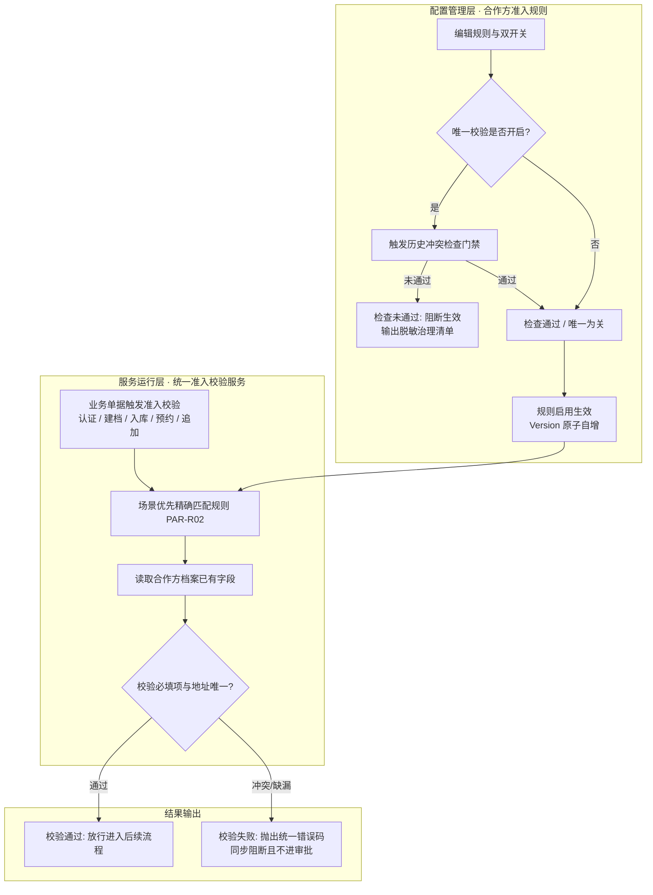

# 合作方准入规则主PRD

> **模块定位**：配置管理策略层核心控制中枢，负责维护租户内个人货主准入控制策略（证件地址必填、个人货主地址唯一校验双开关）、适用业务角色与业务场景，以及历史冲突检查门禁机制。向全系统统一准入校验服务提供生效规则版本，实现风控前置阻断与防篡改存证闭环。  
> **版本**：V1.5 | **更新时间**：2026-09-20 | **责任人**：森云科技（Senyun Technology）  
> **编写依据**：[合作方准入规则字段清单.md](./合作方准入规则字段清单.md) 是本模块所有配置字段、双开关与弹窗规格的唯一基准；[合作方准入规则业务规则规格.md](./合作方准入规则业务规则规格.md) 是规则状态机、版本递增、场景优先匹配与历史检查门禁的唯一定义来源；[合作方档案字段清单.md](../01-合作方档案/合作方档案字段清单.md) 提供被校验字段真源；[合作方档案-用例数据推演.md](../01-合作方档案/合作方档案-用例数据推演.md) 提供沙盘验证。  
> **页面范围**：覆盖合作方准入规则列表页、编辑准入规则页、准入规则详情页及历史冲突检查弹窗。  
> **ASCII 线框**：[合作方准入规则_ASCII_列表页](./合作方准入规则_ASCII_列表页.md) · [合作方准入规则_ASCII_新增编辑页](./合作方准入规则_ASCII_新增编辑页.md) · [合作方准入规则_ASCII_详情页](./合作方准入规则_ASCII_详情页.md)

---

## 1. 业务背景与风控目的

### 1.1 业务定位
在 SYZC 供应链金融存货监管系统中，【合作方档案】负责定义“存储哪些主体数据”，而【合作方准入规则】则作为策略控制中枢，负责裁决“何时执行校验、校验哪些档案字段、发生冲突时如何处置”。

本模块第一期上线聚焦于**租户内默认单规则形态**，核心围绕**个人货主证件地址双开关**（地址必填 / 地址唯一校验）展开管控，覆盖客户端（C 端）实名认证、管理端人工建档、入库记录制单、客户入库预约及档案追加货主五大业务场景。个人货主以证件地址作为开票主体与货权一对一绑定的关键依据，地址冲突意味着主体虚假或货权混淆风险，必须于业务提交前**同步阻断且严禁进入审批中心**。

### 1.2 规则设计痛点
1. **多入口校验逻辑割裂**：后台建档、入库制单、C 端认证各自编写校验代码，导致提示文案不一、校验时有时无；
2. **冲突流转浪费审批资源**：地址冲突属于硬性准入不合规，若仍生成审批单流入审批中心，将造成大量无效审批待办堆积；
3. **双开关行为歧义**：地址必填与地址唯一常被混为一谈，缺乏明确的四象限组合行为定义；
4. **历史脏数据直接开唯一引发震荡**：存量若存在同址多主体，盲目开启唯一校验会导致在途正常业务被大面积误拦；
5. **规则变更篡改历史凭证**：准入规则若发生阈值调整，若直接回写已完成的业务单据，将严重破坏金融司法存证快照效力。

---

## 2. 功能范围

| 包含功能范围 | 不包含功能范围 |
| :--- | :--- |
| - **租户准入规则配置台账**：支持准入规则的列表查询、多维筛选、详情查阅、编辑、启用与停用； - **个人货主证件地址双开关配置**：支持独立配置「个人货主证件地址必填」（是/否）与「个人货主证件地址唯一校验」（开/关）； - **适用场景与角色矩阵配置**：支持配置规则适用的业务场景（C端认证/人工建档/入库/预约/追加货主）与适用业务角色（P0 默认货主）； - **规则版本自动递增机制**：生效中规则编辑保存后，版本号原子递增（V1 $\rightarrow$ V2 $\rightarrow$ …），遵循 C08 存量不回写铁律； - **历史冲突检查门禁弹窗**：唯一校验由关开启前，强制触发历史数据扫描，弹窗呈现脱敏冲突组数与缺地址统计，未通过禁止规则生效； - **统一准入校验服务供给**：向全平台作业单据输出运行时准入校验接口，执行标准化地址比对并返回统一错误码； - **租户级默认规则预置**：新租户初始化自动预置 P0 默认规则（个人 + 货主 + 五大场景 + 必填=是 + 唯一=开）。 | - **合作方主体基础信息维护**：主体姓名、身份证号、企业资质及证件地址等主数据由【合作方档案】维护，本模块不重复录入； - **内部算法与标准化比较值呈现**：地址清洗与标准化比较值属于底层服务逻辑，界面严禁暴露内部比较字段； - **地址冲突进入审批流审批**：本期固定冲突处理策略为【阻断】，不支持走审批中心发起例外特批； - **企业主体地址一对一校验**：企业主体证件地址来源为营业执照，本期不参与个人货主一对一地址唯一比对（双开关置灰）； - **跨租户规则共享**：各租户准入规则严格物理隔离，不支持跨租户继承或比对； - **移动端（H5）规则管理**：移动端不提供准入规则管理入口，仅支持 PC 管理端运维。 |

---

## 3. 规则架构与版本模型

### 3.1 规则版本与生效机制规范

| 控制项目 | 规格要求 |
| :--- | :--- |
| **规则形态** | 租户内 1 条标准默认规则（支持后续按项目维度扩展） |
| **生效机制** | 启用状态下准入校验服务实时加载最新生效版本；停用状态下新业务不再匹配该规则 |
| **版本递增机制** | 处于【生效中】的规则每次编辑保存成功后，规则版本号自动递增（如 V1 $\rightarrow$ V2） |
| **存量不回写 (C08)** | 规则升版仅对新产生的业务关系生效；已完成单据快照与已发生凭证**绝对严禁回写** |
| **在途单据处理** | 审批流转中的单据按提交时刻固化的规则标识与版本号执行二次复检，规则变更不撤回单据 |
| **冲突处理策略** | 第一期系统全局固定为【阻断】，页面呈现场景只读说明，不进审批流 |

### 3.2 规则匹配与运行时架构图

### 3.3 准入规则与档案、业务单据的分工边界

| 模块层级 | 业务职责定位 | 数据交互与协同行为 |
| :--- | :--- | :--- |
| **合作方档案** | 唯一数据真源：定义存什么 | 维护姓名、身份证号、手机号、证件地址及来源，不维护校验策略。 |
| **合作方准入规则** | 策略控制中枢：定义何时拦 | 维护业务场景、角色范围、必填与唯一双开关；不重复定义字段属性。 |
| **统一准入校验服务** | 运行时校验执行者 | 加载当前生效规则版本，读取档案字段，返回统一布尔结果与错误码。 |
| **仓储/交易业务单据** | 业务单据制单与审批 | 准入通过后继续后续流程；新建个人货主通过后再触发短信二元核验。 |

---

## 4. 业务场景与用户故事

| 场景编号与名称 | 触发角色 | 核心交互与风控约束 | 业务价值 |
| :--- | :--- | :--- | :--- |
| **场景 1【租户开通默认规则预置】(S01)** | 系统自动化 | 新监管租户初始化开通时，系统自动预置一条生效中的个人货主准入规则 V1，默认配置必填=是、唯一=开、冲突=阻断。 | 实现新租户开箱即用的金融级合规风控。 |
| **场景 2【开启唯一前历史检查门禁】(S02)** | 平台超级管理员 | 编辑规则将「个人货主证件地址唯一校验」由关设为开并点击启用；系统自动启动历史冲突检查，存在同址多货主则强阻断启用并弹出脱敏清单。 | 防范直接开启硬规则导致存量在途业务被大面积误伤。 |
| **场景 3【规则编辑升版且存量不回写】(S03)** | 平台超级管理员 | 调整已生效规则的业务场景并保存；系统版本号自增至 V2，后续新发单据按 V2 校验，历史已归档单据快照与版本固化不变（C08）。 | 保障金融监管司法存证不可篡改与可追溯性。 |
| **场景 4【三入口地址冲突一致性阻断】(S04)** | 业务运营 / C端用户 | 无论是管理后台建档、入库新建货主还是 C 端实名认证，录入被占用的证件地址时均被统一拦截，返回相同错误码与标准文案。 | 消除多端规则不一致漏洞，杜绝系统套利。 |
| **场景 5【非货主角色不误触发唯一校验】(S05)** | 仓储制单人员 | 出库单静默沉淀录入提货经办人，即便证件地址与他人重复，系统亦不触发货主地址唯一校验，单据正常放行。 | 精准圈定风控作用域，保障常规出库履约作业效率。 |
| **场景 6【非必填状态下空地址免校验】(S06)** | 业务运营人员 | 规则配置为「必填=否 + 唯一=开」时，录入未填写证件地址的简易档案；系统跳过唯一性比对放行，已录入地址的主体仍受唯一约束。 | 赋予系统在过渡期治理时灵活配置的弹性。 |
| **场景 7【开启必填前缺地址数据治理】(S07)** | 平台超级管理员 | 将「地址必填」由否调整为是；系统启动治理补录窗口，提示存量缺地址个人货主清单，补录完成前限制新发个人货主业务。 | 确保新政推行有条不紊，防范业务突发中断。 |
| **场景 8【规则停用与在途单据重放】(S08)** | 平台超级管理员 | 管理员停用准入规则并二次确认；系统标记规则为已停用，新发业务不再匹配该规则，在途审批单据仍按提交时版本二次复检。 | 规范策略临时停用时的平滑过渡与版本衔接。 |
| **场景 9【准入校验先于短信二元核验】(S09)** | 仓储制单人员 | 入库制单新建个人货主时，若证件地址冲突，系统在制单页直接阻断，**绝对不向货主下发短信验证码**。 | 杜绝已知冲突单据徒耗短信资源并骚扰货主。 |

---

## 5. 规则状态机与动作能力矩阵

### 5.1 规则主记录状态定义表

| 状态名称 | 业务含义 | 是否终态 | 列表可见性 | 进入条件 | 离开条件 |
| :--- | :--- | :---: | :---: | :--- | :--- |
| **草稿** | 新建规则尚未对外发布生效，策略处于编辑调试期 | 否 | 可见 | 新建保存未启用 | 启用成功 $\rightarrow$ 生效中 |
| **生效中** | 策略正式生效，运行时准入校验服务实时按本版本比对 | 否 | 可见 | 启用成功（唯一开启时须历史检查通过） | 停用 $\rightarrow$ 已停用；编辑保存 $\rightarrow$ 升版生效 |
| **已停用** | 策略临时停止对外生效，新发业务不再匹配本条规则 | 否 | 可见 | 管理员手动停用确认 | 重新启用 $\rightarrow$ 生效中 |

### 5.2 规则动作能力矩阵

| 业务动作 | 草稿 | 生效中 | 已停用 |
| :--- | :---: | :---: | :---: |
| **查看规则列表与详情** | ✅ | ✅ | ✅ |
| **编辑规则配置** | ✅ | ✅（保存后 Version+1） | ✅ |
| **启用规则** | ✅（唯一开启时须检查通过） | ❌ | ✅（唯一开启时须检查通过） |
| **停用规则** | ❌ | ✅（二次确认） | ❌ |
| **手动触发历史冲突检查** | ✅（限唯一开启） | ✅（限唯一开启） | ✅（限唯一开启） |
| **物理删除规则** | ❌（系统绝对禁止） | ❌（系统绝对禁止） | ❌（系统绝对禁止） |

---

## 6. 页面交互规格索引

### 6.1 合作方准入规则 — 列表页
- **页面路径**：`配置管理 → 平台管理 → 合作方准入规则`
- **线框基准**：[合作方准入规则_ASCII_列表页](./合作方准入规则_ASCII_列表页.md)
- **核心规格**：
  - 顶部筛选区：规则名称（模糊搜索）、适用主体类型、适用业务场景、地址唯一校验（开/关）、规则状态、黄色【查询】与【重置】；
  - 数据表格（10 列）：`序号`、`规则名称`、`适用主体类型`、`适用业务场景`（摘要呈现）、`个人货主证件地址必填`（是/否）、`个人货主证件地址唯一校验`（开启/关闭标签）、`规则版本号`（`V1`/`V2`）、`规则状态`（状态徽章）、`更新时间`、`操作`；
  - 固定行操作：【编辑】、【启用/停用】、【历史冲突检查】（仅限唯一=开时点亮）；
  - 租户首期默认呈现预置的标准规则行。

### 6.2 编辑准入规则页
- **页面路径**：列表页行操作点击【编辑】
- **线框基准**：[合作方准入规则_ASCII_新增编辑页](./合作方准入规则_ASCII_新增编辑页.md)
- **核心规格**：
  - 单页表单布局，划分基础信息与准入控制双面板；
  - 基础信息：规则标识（只读）、规则名称（必填，租户唯一，$\le 50$ 字）、适用主体类型（单选个人/企业/全部，默认个人）、适用业务角色（多选，默认货主）、适用业务场景（多选，覆盖五大核心场景）；
  - 准入控制：
    - 「个人货主证件地址必填」：单选框【是】/【否】；
    - 「个人货主证件地址唯一校验」：开关控件【开启】/【关闭】；下方提供【历史冲突检查】快捷检测入口；
    - 「冲突处理策略」：只读呈现「阻断（不进入审批中心）」；
  - 联动置灰：若适用主体类型选择【企业】，个人货主双开关自动置灰并展示辅助说明「企业主体不参与个人地址一对一校验」；
  - 变更事由：若修改了双开关或关键场景，提交时强制弹出【变更原因】录入框（$\le 200$ 字）；
  - 未保存离开页面触发防误离开拦截。

### 6.3 合作方准入规则 — 详情页
- **页面路径**：列表页点击规则名称或行操作【查看详情】
- **线框基准**：[合作方准入规则_ASCII_详情页](./合作方准入规则_ASCII_详情页.md)
- **核心规格**：
  - 顶部规则识别卡片：规则名称、大字号版本号（如 `V1`）、规则状态徽章（绿色生效中/橙色已停用/灰色草稿），右上角动作栏（返回、编辑、停用/启用、历史冲突检查）；
  - 分区 1【基础策略配置】：4 列网格展示规则业务编号（支持复制）、规则名称、适用主体类型、适用业务角色、适用场景（彩色标签）及冲突处理策略（阻断）；
  - 分区 2【个人货主准入控制策略】：展示证件地址必填、地址唯一校验状态、历史冲突检查状态徽章（绿色通过/红色未通过）及规则说明；
  - 分区 3【系统与版本审计信息】：当前生效版本号、运行状态、创建人/时间、最后更新人/时间；
  - 分区 4【规则版本变更历史流水】：子表格呈现历次升版记录（版本号、生效时间、变更人、双开关取值、变更原因说明及查看快照入口），对齐 C08 存量不回写铁律。

### 6.4 历史冲突检查弹窗规格
- **线框基准**：[历史冲突检查弹窗](./合作方准入规则_ASCII_新增编辑页.md#31-历史冲突检查检测未通过强阻断弹窗-par-r05-门禁) · [主动检测报告弹窗](./合作方准入规则_ASCII_列表页.md#3-历史冲突检查主动检测报告弹窗-从行操作触发)
- **唤起时机**：规则编辑页点击【立即重新检测】、列表页点击行操作【历史冲突检查】，或启用唯一校验开启的规则时系统自动触发；
- **展示要素**：
  - 检查结论：大字号绿色【检查通过】或大红色【检查未通过】；
  - 核心指标卡片：租户内有效个人货主总数、冲突地址组数、缺地址主体总数；
  - 冲突明细表格：呈现冲突标准化地址摘要、涉及主体编号集合（**严格脱敏，严禁展示他人真实姓名与身份证号**）；
  - 底部操作：通过时呈现【确认启用/保存】；未通过时置灰确认按钮，呈现【返回治理】。

---

## 7. 核心业务规则索引

| 规则编码与名称 | 规则核心逻辑摘要 | 规则规格唯一定义章节 |
| :--- | :--- | :--- |
| **【规则版本递增与存量不回写】(PAR-R01 / C08)** | 生效规则编辑保存后版本号原子递增；已生效单据与凭据快照绝对不回写 | [业务规则规格 §六](./合作方准入规则业务规则规格.md#规则版本递增与存量不回写par-r01--c08) |
| **【场景优先匹配规则】(PAR-R02)** | 运行时按业务场景精确匹配规则，同场景命中最新生效版本，存在冲突取最严规则 | [业务规则规格 §六](./合作方准入规则业务规则规格.md#场景优先匹配规则par-r02) |
| **【个人货主地址双开关作用域】(PAR-R03)** | 地址必填与唯一双开关严格仅对「个人 + 货主」角色生效；企业货主与非货主角色不校验 | [业务规则规格 §六](./合作方准入规则业务规则规格.md#个人货主地址双开关作用域par-r03) |
| **【地址双开关组合行为】(PAR-R04)** | 规范必填（是/否）与唯一（开/关）四象限行为矩阵，明确非必填时空地址不参与比对 | [业务规则规格 §六](./合作方准入规则业务规则规格.md#地址双开关组合行为par-r04) |
| **【历史冲突检查拦截规则】(PAR-R05)** | 开启唯一校验前强制执行历史扫描，存在同址不同人冲突严禁规则生效中 | [业务规则规格 §六](./合作方准入规则业务规则规格.md#历史冲突检查拦截规则par-r05) |
| **【统一准入服务调用规则】(PAR-R06)** | 全系统所有涉及货主录入的入口必须强制调用同一服务，严禁模块私自实现 | [业务规则规格 §六](./合作方准入规则业务规则规格.md#统一准入服务调用规则par-r06) |
| **【冲突同步阻断不进审批规则】(PAR-R07)** | 地址冲突执行同步前置阻断，不生成审批流单据，统一错误文案且严禁泄露他人隐私 | [业务规则规格 §六](./合作方准入规则业务规则规格.md#冲突同步阻断不进审批规则par-r07) |
| **【历史缺地址补录窗口规则】(PAR-R08)** | 开启必填前执行存量缺地址盘点与补录窗口，补录完成前限制新发个人货主业务 | [业务规则规格 §六](./合作方准入规则业务规则规格.md#历史缺地址补录窗口规则par-r08) |
| **【规则启停与版本并发规则】(PAR-R09)** | 规则编辑保存采用乐观锁版本控制，停用写全路径审计，系统严禁物理删除规则 | [业务规则规格 §六](./合作方准入规则业务规则规格.md#规则启停与版本并发规则par-r09) |
| **【租户数据隔离规则】(PAR-P01)** | 准入规则严格限定在当前租户生效；跨租户物理隔离，互不共享规则且互不比较地址 | [业务规则规格 §八](./合作方准入规则业务规则规格.md#租户数据隔离规则par-p01) |
| **【准入规则操作权限矩阵】(PAR-P02)** | 仅平台超级管理员具备编辑与启停权限，业务运营仅具备只读查看权限 | [业务规则规格 §八](./合作方准入规则业务规则规格.md#准入规则操作权限矩阵par-p02) |

---

## 8. 非功能性需求

### 8.1 性能要求
- **策略匹配引擎时延**：单次业务场景触发规则精确命中与版本加载耗时 $\le 20\text{ms}$；
- **历史冲突离线检测**：针对租户 10 万级合作方数据，历史冲突全量扫描耗时 $\le 3.0\text{s}$；
- **规则热重载**：规则编辑保存或启停后，准入服务节点内存缓存热更新时差 $\le 1.0\text{s}$。

### 8.2 安全性与合规性
- **信息保护防泄露**：历史冲突检查清单与前端拦截提示，绝对禁止包含具体第三方的真实姓名与身份证号；
- **变更追溯审计**：规则的所有启停、版本变更、双开关调整及变更事由全量记入系统操作审计日志，保留 5 年以上不可更改。

---

## 9. 修订记录

| 日期 | 版本 | 变更内容说明 | 影响范围 | 修订人 |
| :--- | :--- | :--- | :--- | :--- |
| 2026-09-20 | V1.0 | **初始化 6.3 合作方准入规则主 PRD**：确立范式 C 规则架构与个人货主双开关体系。 | 配置管理全模块 | AI PM / 森云科技 |
| 2026-09-20 | **V1.5** | **全量实施规范化重构（对齐基准版样式与去水）**： 1. 规范文头为 4 行精干引用块； 2. 规范功能范围为【包含】vs【不包含】双栏矩阵表； 3. 全量替换中英文混杂（In/Out of Scope/Modal/Toast/Version）； 4. 条目化业务场景与核心规则索引，补齐历史检查门禁交互。 | 主 PRD 全文 | AI PM / 森云科技 |
