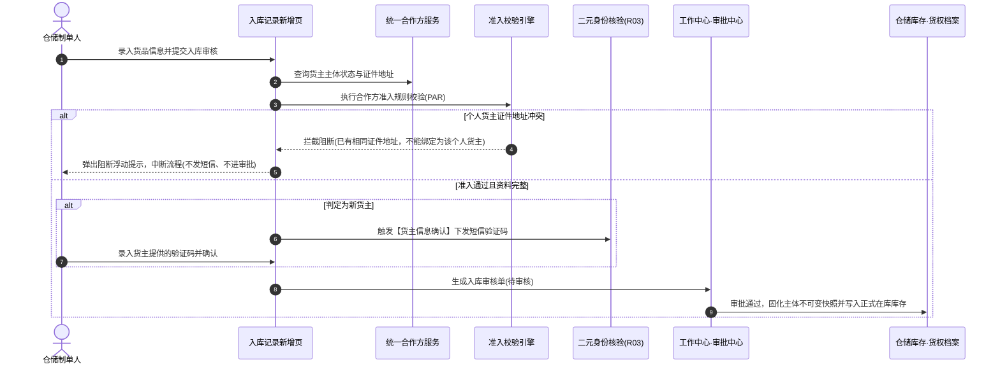
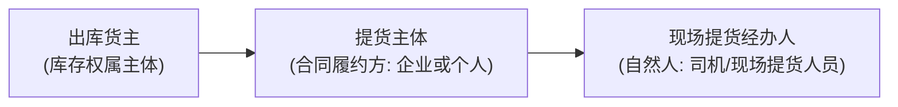
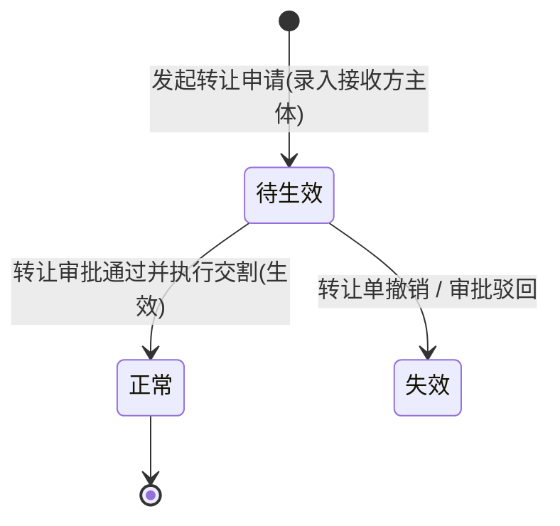

# 合作方改造 · 存量业务单据协同规格

> **版本**：V1.5 | **更新时间**：2026-09-20 | **责任人**：森云科技（Senyun Technology）  
> **文档定位**：6.3 版本存量业务单据（入库、预约、出库、提货、转让、仓单、客户管理）引用统一合作方主数据的协同改造唯一真源。  
> **编写依据**：[合作方档案主PRD.md](../01-合作方档案/合作方档案主PRD.md) · [合作方档案业务规则规格.md](../01-合作方档案/合作方档案业务规则规格.md) · [合作方准入规则主PRD.md](../02-合作方准入规则/合作方准入规则主PRD.md) · [合作方准入规则业务规则规格.md](../02-合作方准入规则/合作方准入规则业务规则规格.md)。  
> **覆盖范围**：仓储入库记录、工作中心客户入库预约、仓储出库记录、仓储提货单、货物转让记录、仓单管理、交易客户管理 7 大存量业务单据。

---

## 一、改造背景与四大基本原则

### 1.1 改造背景
在 6.3 版本之前，货主、提货人、接收方等业务主体长期分散在入库记录、出库记录、提货单、客户管理等各作业单据中各自独立手工录入与维护，导致主体识别标准混乱（原以手机号标识个人货主）、证件地址缺失、同一地址被冒用绑定等风控漏洞。  
6.3 版本正式引入【合作方档案】与【合作方准入规则】后，存量各业务单据全面改造为**引用统一合作方主数据**，不再各行其是维护第二套主数据。

### 1.2 四大协同基本原则

| 原则编号 | 原则名称 | 规范与技术约束 |
| :--- | :--- | :--- |
| **P-01** | **单一真源原则** | 所有作业单据中的货主、提货人、接收方、仓单存货人等，统一引用合作方主体标识，废除各模块独立的货主台账；主表单默认展示主体名称与脱敏证件号，详细证件地址通过【查看货主】弹窗穿透展示，主表单**绝不平铺地址编辑控件**。 |
| **P-02** | **准入时序前置原则** | 涉及个人货主新建或生效的业务单据，必须执行：**主体准入校验（含证件地址唯一性）→ 资料完整性校验 → 新货主二元核验 (R03) → 生成业务申请/进入审批**。地址冲突必须在短信验证码发送前同步阻断，杜绝无意义消耗短信与伪入库申请。 |
| **P-03** | **快照不可变原则 (C08)** | 业务单据在写库存/货权生效的关键节点（如入库审批通过、转让生效、仓单开立），必须完整固化合作方身份标识、证件地址、主体类型的**不可变业务快照**；合作方主档后续编辑变更**绝不回写**历史事实流水。 |
| **P-04** | **按角色隔离冻结原则** | 业务单据仅校验当前业务所需的角色状态（如制单入库校验「货主角色」，提货核销校验「提货经办人角色」）；合作方单一角色冻结不影响其在其他合法角色下的独立履约。 |

---

## 二、存量业务单据改造总览表

| 序号 | 业务单据 / 菜单 | 所属系统板块 | 引用合作方角色 | 证件地址规则触发时机 | 核心改造与阻断机制 |
| :---: | :--- | :--- | :--- | :--- | :--- |
| **01** | **入库记录** | 仓储 / 入库管理 | 货主 (OWNER) | 弹窗创建新个人货主时校验 | 个人货主唯一键由手机号变更为**身份证号**；统一准入前置于短信核验；冲突阻断弹窗并阻断制单。 |
| **02** | **客户入库预约** | 工作中心 / 需求审批 | 货主 (OWNER) | 客户/运营创建新货主时校验 | 提交预约时前置校验；地址冲突在生成申请前同步阻断，不产生待办审批流。 |
| **03** | **出库记录** | 仓储 / 出库管理 | 货主 + 提货主体 + 提货经办人 | 仅当提货主体/经办人兼任货主时校验 | 支持提货主体（企业/个人）与提货经办人（自然人）分层引用；支持单据静默沉淀简易提货人。 |
| **04** | **提货单** | 仓储 / 货物管理 | 提货经办人 (PICKUP_AGENT) | 不触发个人货主地址唯一校验 | 支持按身份证号/手机号快速检索高频司机；提货人角色冻结时拦截现场核销。 |
| **05** | **货物转让记录** | 仓储 / 货物管理 | 原货主 + 接收方 (RECEIVER) | **转让生效后**接收方成为新货主时校验 | 申请时接收方角色为「待生效」（不校地址）；转让审批通过且生效时校验准入，地址冲突**阻止转让生效**。 |
| **06** | **仓单管理** | 仓储 / 仓单管理 | 存货人 (STORER) + 持有人 (HOLDER) | 仅当持有人实质转为货主时校验 | 存货人优先复用货主；持有人按时点关系维护变更流水；仓单开立与质押流转固化主体快照。 |
| **07** | **客户管理** | 交易 / 客户管理 | 认证主体关联 (C 端客户) | 实名认证完成且默认开通货主时校验 | 客户账号（Account）与合作方主体（Partner）解耦绑定；认证资料自动同步证件地址。 |

---

## 三、各业务单据详细协同规格

### 3.1 仓储 · 入库记录（重点改造）

#### 1. 核心交互与主键口径变更
- **身份证号成为唯一标识**：彻底废除原基准版中以「手机号」作为个人货主主键的做法，个人货主统一以 18 位身份证号为租户内唯一主键；手机号降级为联系方式与辅助检索项。
- **主表单展示与弹窗穿透**：入库新增页仅保留货主名称、主体类型、脱敏身份证号/信用代码展示；提供【查看货主】行内链接，点击唤起只读抽屉查看证件登记地址等详细档案，**主表单不平铺地址输入框**。
- **创建新货主入口**：选择器右侧保留【+创建新货主】快捷入口，点击弹出轻量化合作方创建抽屉（强制录入证件地址三级区划+详细地址）。

#### 2. 校验时序闭环（先准入，后短信）

#### 3. 拦截与异常机制
- **地址冲突拦截**：若填写的证件地址在租户/项目内已被其他个人货主绑定，系统直接阻断制单提交，不创建合作方主体，不进入短信核验，不生成审批流。
- **审批终审二次复检 (Re-validation)**：入库单在审批人点击【审批通过】的临界时刻，后台强行复检货主主体状态与角色状态；若审批期间货主被冻结或注销，直接拦截审批通过并提示「货主已被冻结，无法完成入库入账」。

---

### 3.2 工作中心 · 客户入库预约

#### 1. 业务协同定位
- 供 C 端认证客户或业务代办人在 PC/移动端发起入库预约意向；
- 预约单中的货主信息同样来源于统一合作方服务，预约单审批通过后可一键「转入库记录」。

#### 2. 规则协同要点
- **准入前置拦截**：在预约提交时即调用统一准入服务；若所选货主信息不完整或存在个人货主地址冲突，在点击【提交预约】瞬间拦截，**严禁生成预约审批待办**，避免把地址冲突这种硬缺陷推给后台审批人员。
- **不增设地址冲突审批**：系统不设立所谓的“地址冲突特批流程”，冲突即硬阻断，确属搬家或地址变更的，必须走合作方档案主档的变更申请或历史货主角色移除流程。

---

### 3.3 仓储 · 出库记录与提货单

#### 1. 业务主体三层分离
在出库业务中，严格区分三个层级的主体概念：

- **出库货主**：必须为在库货品的合法权属主体，仅需校验其拥有有效的「货主」角色；
- **提货主体**：提货合同的签约相对方，可为企业或个人；
- **提货经办人**：实际到场提货的自然人，仅关联「提货经办人」角色。

#### 2. 协同改造规格
- **提货人不触发地址唯一校验**：提货经办人（如货车司机）即便录入了身份证与住址，由于其业务角色为提货经办人而非货主，**绝不调用**个人货主证件地址唯一校验规则，避免误伤物流人员。
- **单据静默沉淀**：出库记录制单时录入的全新提货经办人，系统自动在合作方档案静默生成一条简易合作方记录（状态为 `待补全`，来源单据标记为当前出库单号）。
- **提货单高频检索**：提货单现场核销页面支持输入身份证号或手机号快速带出已登记的提货经办人；若该经办人处于「冻结」状态，拦截提货出库。

---

### 3.4 仓储 · 货物转让记录

#### 1. 接收方角色状态变迁机制
转让业务涉及货权自原货主向接收方的转移，改造重点在于接收方角色的状态机协同：

- **申请阶段（待生效）**：转让制单时，若接收方尚未在平台建立合作方，允许录入并生成合作方主体，但其角色赋予为 `待生效接收方`，**此阶段不执行个人货主证件地址唯一校验**。
- **生效阶段（转为正式货主）**：转让单终审通过、正式执行库存货权转移瞬间，系统自动将接收方的角色转为正式 `货主`，**此时必须强制触发合作方准入规则**。若触发地址冲突，系统阻断转让生效，单据停留在待处理状态并告警通知转让双方。

#### 2. 双向主体快照固化
转让单生效归档时，必须同时固化两份快照：
- **转让人主体快照**：主体名称、证件号码、证件地址；
- **受让人主体快照**：主体名称、证件号码、证件地址。

---

### 3.5 仓储 · 仓单管理

#### 1. 存货人与持有人解耦
- **存货人 (STORER)**：仓单开立时的原始货物权属人，必须直接复用入库记录中的合作方货主，**不得**在仓单开立模块重新新建主体。
- **持有人 (HOLDER)**：仓单当前合法权利人，采用时点关系维护流水：
  - 仓单开立时：初始持有人 = 存货人；
  - 仓单质押时：持有人保持为存货人，同时记录资金方合作方质押权；
  - 仓单转让/平仓处置时：持有人变更为新的合作方主体，并记录流转时间轴。

#### 2. 快照追溯
仓单每一次状态流转（开立、锁定、转让、质押、解押、注销），均按时点固化当时的存货人与持有人合作方信息，确保仓单在金融机构与司法存证场景下的证据链闭环。

---

### 3.6 交易 · 客户管理（C 端账号绑定）

#### 1. 账号与主体关系解耦
- **概念隔离**：
  - **客户账号 (Account)**：维护 C 端登录名、登录手机号、注册时间、密码凭证；
  - **合作方主体 (Partner)**：维护法人或自然人层面的社会统一实体（身份证号/统一社会信用代码）。
- **绑定机制**：
  - 一个个人客户账号实名认证后，1:1 绑定一个个人合作方主体；
  - 认证通过后，系统**默认**在合作方档案为其开通「货主」角色；
  - 自动将实名认证填报的证件地址写入合作方主档的证件地址，并前置调用准入规则校验唯一性。

---

## 四、附录：存量改造核心决策映射（Q01~Q14 闭环查对）

| 决策编号 | 原始问题摘要 | 最终落地实施规格 | 协同单据覆盖 |
| :--- | :--- | :--- | :--- |
| **Q01** | 个人货主唯一键由手机号改为身份证号 | 个人合作方主体以 18 位身份证号为租户内唯一主键；存量数据通过清洗脚本合并；入库表单手机号仅作联系用 | 入库记录、客户管理 |
| **Q02** | 个人货主未填地址存量单据处理 | 存量货主在未补全地址前处于 `待补全` 状态；新发生入库业务时强制要求先补全方可制单 | 入库记录、预约单 |
| **Q03/04** | 业务角色与系统权限混淆 | 合作方角色（货主、提货人等）为业务身份，非 RBAC 权限；支持按角色独立冻结 | 全单据通用 |
| **Q06** | 个人货主地址唯一校验作用域 | 四象限矩阵：仅对个人有效、仅对货主有效；提货人、待生效接收方均不触发 | 准入规则、转让、提货 |
| **Q11** | 准入校验与二元短信认证时序 | 严格先准入阻断、再核验资料、后发短信验证码；杜绝地址冲突仍发短信 | 入库记录、预约单 |
| **Q12** | 历史流水单据快照不回写 | 仓储库存写入与货权变动时点固化快照，合作方后续更名/改址绝不回写历史流水 | 仓储全单据 |
| **Q14** | 简易沉淀提货人合并治理 | 出库沉淀的简易主体支持与后续正式认证主体进行合并，历史单据快照保留 | 出库、提货单 |

---
*版本说明：V1.5 | 森云科技（Senyun Technology）存量改造协同基准规范*
