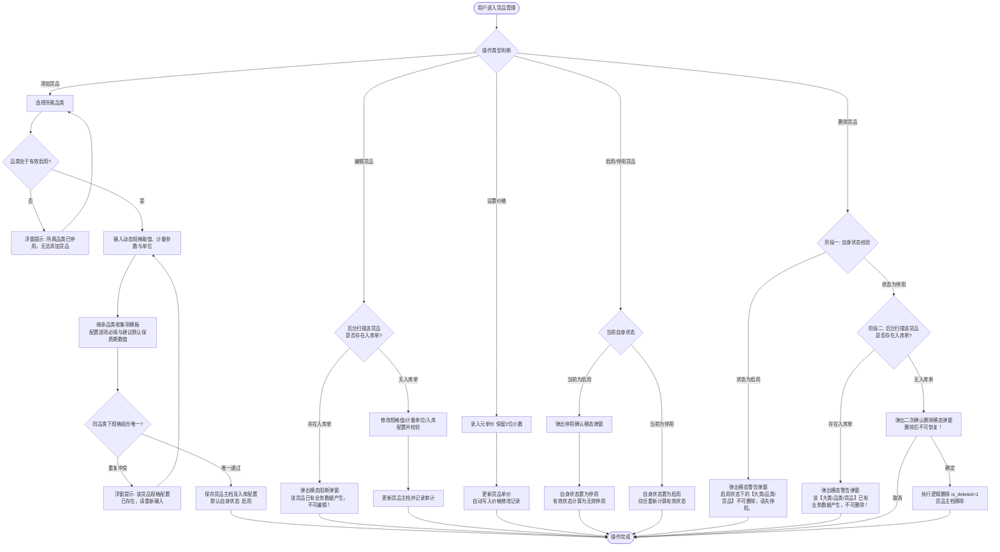
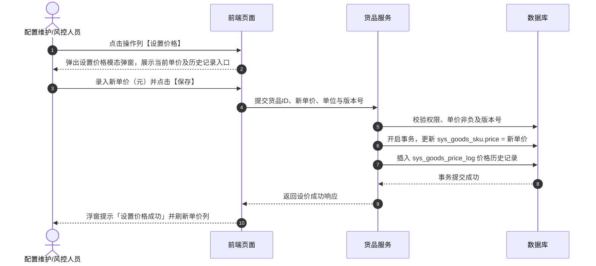
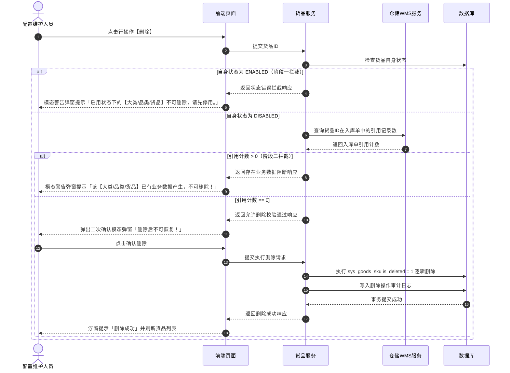

# 货品管理业务规则规格

> **文档定位**：货品管理（14-货品规格管理-货品管理 / SKU 主档）状态机模型、有效启用多级综合计算公式、动态规格组合唯一性校验、入库收集信息继承配置与保质期固定单位锁定、价格管理与展示精度、下游缺价统一提示以及两阶段安全删除的唯一定义真源（SSOT）。  
> **参考文档**：[货品管理主PRD.md](./货品管理主PRD.md)、[货品管理字段清单.md](./货品管理字段清单.md)、[入库收集项配置业务规则规格.md](../05-货品规格管理-入库收集项配置/入库收集项配置业务规则规格.md)、[大类管理业务规则规格.md](../12-货品规格管理-大类管理/大类管理业务规则规格.md)、[品类管理业务规则规格.md](../13-货品规格管理-品类管理/品类管理业务规则规格.md)  
> **版本**：V2.1（6.3版本对齐） | 更新时间：2026-09-21 | 责任人：森云科技（Senyun Technology）

---

## 一、模块与单据定位

| 项目 | 内容 |
| :--- | :--- |
| **层级定位** | **【第 3 层 - 货品 / SKU 主档】**（货品主数据与存货监管体系最小业务交易与核算单元） |
| **核心职责** | 维护从属于品类的具体货品/SKU，包含动态规格参数取值、计量参数与单位、入库收集信息配置（继承品类模板并配置必填与建议默认保质期数值）、基准参考单价与设价历史日志；向入库、库存、数字仓单、动产质押、融资与加工管理提供核心主档数据支持。 |
| **实体映射** | `sys_goods_sku`（货品 SKU 主表）、`sys_goods_price_log`（价格变更日志表）、`sys_goods_sku_field_rel`（货品收集项关联配置表） |
| **上下游关系** | **上游**：继承底座配置层（[05 入库收集项配置](../05-货品规格管理-入库收集项配置/入库收集项配置业务规则规格.md)）、品类管理（[13 品类管理](../13-货品规格管理-品类管理/品类管理业务规则规格.md)）及大类管理（[12 大类管理](../12-货品规格管理-大类管理/大类管理业务规则规格.md)）； **下游**：入库单（动态生成收集字段）、加工管理（投产与产出货品估值）、仓单与抵质押（质押标的与风控价值核算）、融资管理（押品准入强校验）。 |
| **数据约束** | 同一租户同品类下，`动态规格参数取值组合 + 计量参数 + 单位` 严格唯一。 |

---

## 二、状态定义与有效启用计算模型

### 2.1 状态定义

| 状态维度 | 字段与枚举 (`status`) | 是否允许人工切换 | 含义说明 | 下游影响与生效范围 |
| :--- | :--- | :---: | :--- | :--- |
| **自身状态 (`status`)** | `ENABLED` (启用) `DISABLED` (停用) | 是 | 货品自身维度的启停用状态 | 列表操作列人工维护；新建保存后默认为 `ENABLED`。 |
| **有效状态 (`effective_status`)** | `VALID` (有效启用) `INVALID` (无效停用) | 否 | 由系统根据自身及上层大类、品类状态实时计算得出的综合状态 | **仅“有效启用”货品允许在仓储入库单、仓单、加工、抵质押与融资申请等业务流程中被检索与选择**。 |
| **删除状态 (`is_deleted`)** | `0` (正常) `1` (已逻辑删除) | 否 | 逻辑删除标记，前台界面完全不可见 | 仅当货品处于停用状态且完全无入库单时经二次确认后触发；不可物理恢复。 |

### 2.2 有效启用状态计算公式

$$\text{货品有效状态} = \begin{cases} 
\text{有效启用 (VALID)}, & \text{当且仅当 } \text{自身状态} = \text{ENABLED} \land \text{所属品类状态} = \text{ENABLED} \land \text{所属大类状态} = \text{ENABLED} \\
\text{无效停用 (INVALID)}, & \text{其它任何情况（自身停用或任一上级大类/品类停用）}
\end{cases}$$

---

## 三、核心业务规则

### 【货品SKU唯一性校验规则】(SKU-F01)
- 同一租户同一品类下，货品的业务唯一键判定为：`动态规格参数组合（标准化JSON键值对） + 计量参数 + 计量单位`；
- 提交保存时，服务端将动态规格参数按字段编码正序标准化排序后进行比对，若数据库已存在相同组合，阻断保存并以浮窗提示（Toast）告知：「该货品规格配置已存在，请重新输入」；
- 底层采用唯一哈希字段索引兜底，防并发写入冲突。

### 【计量参数与单位分离维护规则】(SKU-F02)
- 计量参数（如 `重量`、`数量`）与计量单位（如 `吨`、`包`、`件`）在表单中独立选择与维护；
- 货品列表按 `计量参数(单位)` 规范列组合展示（如 `重量(吨)`、`数量(件)`）；
- 作为下游入库、出库、移库盘点及动产质押核算的标准数量单位依据。

### 【入库收集信息继承配置规则】(SKU-F03)
- **品类模板继承**：货品新增/编辑表单中，自动继承所属品类已勾选绑定的入库收集项模板清单；
- **固定保质期单位锁定**：若继承项包含【保质期】，其度量单位直接继承品类端固定的基准单位（如八角锁定为“月”，花椒锁定为“年”），**单位在货品表单中直接置灰只读锁定，禁止任何修改**；
- **逐项必填配置**：支持专人对继承而来的每一项采集字段单独配置是否【必填】（`required: true/false`）；
- **建议默认保质期数值**：支持在货品主档可选配置【建议默认保质期数值】（如预设 `24`）；配置后在 WMS 入库单选择该货品时自动带出，仓管员可根据实物标签微调数值；
- **空配置允许**：若所属品类未绑定任何收集项，货品端入库收集项配置区域呈现为空，入库单不展示额外自定义采集项。

### 【入库单动态联动与常识校验规则】(SKU-F04)
- **动态表单渲染**：仓储 WMS 入库单在选择具体货品后，依据该货品关联的配置动态渲染收集项：
  - 标记为 `required: true` 的字段展示红星必填，提交时强制非空校验；
  - 保质期字段渲染为【正整数数值输入框 + 固定单位只读文本标签】（如 `[ 24 ] 个月`），单位完全禁止下拉切换；
- **三字段独立填报无强制公式联动 (D02)**：
  - 生产日期、保质期、过期时间均为独立录入项，由仓管员按照实物包装喷码如实填报；
  - **基础物理常识校验**：若同时填报了生产日期与过期时间，系统仅执行基础常识强校验：$\text{过期时间} > \text{生产日期}$；若 $\text{过期时间} \le \text{生产日期}$，阻断提交并警示：「过期时间必须晚于生产日期，请核对实物包装」。
- **其他属性校验**：
  - 温度/湿度数字区间最小值 $\le$ 最大值；水分含量/杂质率处于 $0 \sim 100$ 区间；
  - 下拉枚举项防篡改校验，非法值服务端强拦截。

### 【参考单价维护与双精度展示规则】(SKU-F05)
- **录入与存储**：通过列表操作列【设置价格】模态弹窗录入，统一按**元**录入和存储，保留 2 位小数，必须为非负数值；
- **双精度展示**：
  - **元展示**：保留 6 位小数并支持千分位格式化（如 `1,234.560000 元/吨`）；
  - **万元展示**：保留 10 位小数（如 `0.1234560000 万元/吨`）；
- **设价历史留痕**：每次保存修改单价，后台自动向 `sys_goods_price_log` 表写入一条日志流水（序号、元单价、计量单位、操作人、操作时间戳）。

### 【未设置单价下游统一提示规则】(SKU-F06)
- 若货品尚未设置单价（即单价为空或 `--`），在下游业务模块（如【加工管理】、【抵质押业务单据】、【融资申请】等）中引用该货品时：
- 系统在对应单价展示位置与表格单元格中统一呈现警示提示：`系统未设置的单价`，引导业务人员前往货品管理补齐设价。

### 【价格变更与存量业务计算规则】(SKU-F07)
- 货品单价定位为基准参考单价；参考单价更新后，存量业务单据依据各业务模块规则读取最新单价重新核算估值；历史价格仅在价格日志表中供风控审计追溯。

### 【编辑操作入库单强拦截规则】(SKU-F08)
- 货品主档属性修改（动态规格值、计量单位、入库收集配置）时，服务端实时校验仓储入库单引用：
- 若该货品已在 `wms_inbound_order_detail` 中被引用（计数 $> 0$），直接阻断保存并唤起模态阻断弹窗：「该货品已有业务数据产生，不可编辑！」。

### 【两阶段安全删除控制规则】(SKU-F09)
- **阶段一（自身状态校验）**：货品自身处于 `ENABLED` 状态时，直接弹出模态警告弹窗「启用状态下的【大类/品类/货品】不可删除，请先停用。」并阻断删除；
- **阶段二（入库单扫描）**：货品自身处于 `DISABLED` 状态时，后台扫描该货品是否产生入库单：
  - 存在入库数据：弹出模态警告弹窗「该【大类/品类/货品】已有业务数据产生，不可删除！」；
  - 无入库数据：弹出风险确认模态弹窗「删除后不可恢复！」，确认后执行逻辑删除（`is_deleted = 1`）。

### 【并发控制乐观锁与幂等规则】(SKU-F10)
- 货品主档与入库收集配置更新采用基于版本号（`version`）的乐观锁机制；
- 设价与删除接口部署请求唯一防重机制，保障网络重发时不产生重复审计日志或并发脏数据。

### 【有效启用状态多级综合计算规则】(SKU-F11)
- 货品有效状态非人工直接切换，完全由系统在查询及下单时依据“自身启用 $\land$ 品类启用 $\land$ 大类启用”动态计算；
- 若上级大类或品类被停用，货品自身虽显示为启用，但在下游选择器中自动过滤隐藏，杜绝脏数据流入业务单据。

---

## 四、权限与安全规范

### 【角色与数据权限隔离规则】(SKU-P01)

| 角色代码 | 角色名称 | 查看货品列表/预览 | 新建/编辑货品 | 启用/停用货品 | 设置价格 | 查看价格记录 | 删除货品 | 数据范围 |
| :--- | :--- | :---: | :---: | :---: | :---: | :---: | :---: | :--- |
| `R-SYS-ADMIN` | 系统管理员 | ✅ | ✅ | ✅ | ✅ | ✅ | ✅ | 当前所属租户全量数据 |
| `R-CFG-MGR` | 配置维护人员 | ✅ | ✅ | ✅ | ✅ | ✅ | ✅ | 当前所属租户全量数据 |
| `R-RISK-MGR` | 风控管理人员 | ✅ | ❌ | ❌ | ✅ | ✅ | ❌ | 当前所属租户全量数据 |
| `R-BUSI-OPER` | 业务人员 / 只读用户 | ✅ | ❌ | ❌ | ❌ | ❌ | ❌ | 当前所属租户全量（只读） |

- **接口安全校验**：所有服务端应用程序编程接口（API）强校验租户上下文，严禁跨租户越权访问与修改。

---

## 五、核心业务流程图

---

## 六、核心操作时序图

### 1. 货品设价与历史记录时序

### 2. 货品两阶段安全删除时序

---

## 七、修订记录

| 日期 | 版本 | 变更摘要 | 变更人 |
| :--- | :---: | :--- | :--- |
| 2026-08-14 | V1.0 | 初版货品管理业务规则规格。 | 产品团队 |
| 2026-09-02 | V2.0 | 规范状态机、有效启用公式、16项预置收集项校验、设价精度与两阶段删除。 | AI PM / 森云科技 |
| 2026-09-16 | V2.0 规范化升级 | 1. 编号语义自解释：规则全面升级为 `【规则业务名称】(SKU-F01~11/P01)` 格式； 2. 交互术语全面汉化：Toast/Modal/Alert 全面汉化为浮窗提示、模态弹窗、模态警告弹窗； 3. 强化与主PRD、字段清单三件套真源强对齐。 | 森云科技规范化升级工作组 |
| **2026-09-21** | **V2.1 (6.3版本)** | 1. **对齐入库收集项底座 (05模块)**：重构 SKU-F03，由继承品类收集项模板替代原 16 项硬编码； 2. **锁定保质期固定单位**：货品端单位只读锁定，支持专人配置必填与建议默认保质期数值； 3. **对齐决策 D02**：重构 SKU-F04 为三字段独立填报 + 基础常识强校验（$\text{过期时间} > \text{生产日期}$）。 | 森云科技产品团队 |
