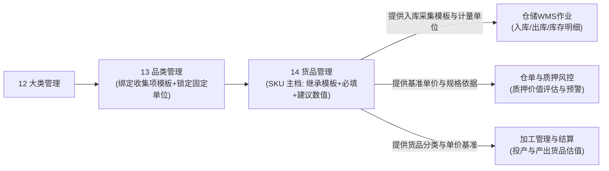

# 货品管理主PRD

> **模块定位**：货品规格管理第 3 节点（SKU 主档），作为存货监管最小业务与交易核算单元，维护动态规格参数取值、计量参数与单位、入库收集信息配置（继承品类模板并配置逐项必填与建议默认保质期数值，保质期固定单位只读锁定）、基准参考单价（元/万元精度）与设价日志，实现自身/有效状态双层控制、入库强校验与两阶段安全删除校验。  
> **版本**：V2.1（6.3版本对齐） | 更新时间：2026-09-21 | 责任人：森云科技（Senyun Technology）  
> **编写依据**：[货品管理字段清单.md](./货品管理字段清单.md) 是本模块所有字段编码、格式、入库收集继承项与页面展示的唯一定义真源；[货品管理业务规则规格.md](./货品管理业务规则规格.md) 是本模块状态机、有效启用公式、两阶段删除与设价规则的唯一定义来源；[入库收集项配置主PRD.md](../05-货品规格管理-入库收集项配置/入库收集项配置主PRD.md) 为入库收集底座字段池来源。

---

## 1. 业务背景

货品管理是 SYZC 存货监管系统“货-仓-金”全链路的最小实体基石。货品（SKU）继承品类所定义的动态规格维度，并绑定计量单位、入库信息收集规则（继承品类采集项与锁定固定保质期单位）和参考单价，向仓储入库单、实时库存台账、数字仓单、动产质押与融资核算提供唯一的货品规格与价格参照。

---

## 2. 功能范围

| 包含功能 (In Scope) | 不包含功能 (Out of Scope) |
| :--- | :--- |
| - 货品列表与左侧大类/品类层级树联动展示； - 添加货品（填写规格取值、计量参数与单位）； - 入库收集信息配置（继承所属品类已绑定的收集项模板，逐项配置是否【必填】及可选的【建议默认保质期数值】；保质期固定单位只读锁定）； - 编辑货品与入库配置（入库单引用强拦截）； - 启用/停用货品与有效状态实时多级动态计算； - 设置价格（支持元/万元双精度展示）与设价历史流水留痕； - 货品两阶段删除（阶段一启用拦截 + 阶段二入库单扫描）； - 货品详情全量只读预览与操作审计追溯。 | - 入库单、出库单业务办理与实物质检； - 数字仓单生成、流转与解押办理； - 融资授信审批与额度扣减； - 大宗商品外部行情自动拉取与自动调价； - 基础字段池的元数据新增（由【入库收集项配置】底座完成）。 |

---

## 3. 模块定位与系统链路

---

## 4. 业务场景

| 场景序号与编码 | 场景名称 | 场景类型 | 核心业务流程与约束说明 | 关联规则索引 |
| :--- | :--- | :--- | :--- | :--- |
| **场景 1 (SKU-S01)** | 【添加货品主档主流程】 | 正常主流程 | 在左侧树选择已启用品类，录入动态规格参数、计量参数与单位，校验同一品类下组合唯一性，保存后默认自身状态为启用。 | 【货品SKU唯一性校验规则】(SKU-F01) 【计量参数与单位分离维护规则】(SKU-F02) |
| **场景 2 (SKU-S02)** | 【入库收集信息配置与单位锁定】 | 主流程 | 自动继承所属品类勾选的收集项模板及保质期固定单位（只读锁定）；逐项配置是否必填，并可按需设置建议默认保质期数值；入库单动态渲染并执行必填校验。 | 【入库收集信息继承配置规则】(SKU-F03) 【入库单动态联动与常识校验规则】(SKU-F04) |
| **场景 3 (SKU-S03)** | 【编辑货品与入库单拦截校验】 | 异常拦截/主流程 | 在编辑模态弹窗中修改规格取值、计量单位或入库配置；若已产生入库单，触发模态阻断弹窗；无入库单时正常保存更新。 | 【编辑操作入库单强拦截规则】(SKU-F08) 【货品SKU唯一性校验规则】(SKU-F01) |
| **场景 4 (SKU-S04)** | 【启停用控制与有效状态动态计算】 | 管控流程 | 货品自身支持人工切换启停；有效状态由系统综合计算（$\text{自身} \land \text{品类} \land \text{大类}$），仅有效启用方可在下游业务新建中被检索。 | 【有效启用状态多级综合计算规则】(SKU-F11) |
| **场景 5 (SKU-S05)** | 【设置参考单价与修改历史留痕】 | 主流程 | 录入元单价（保留 2 位小数），支持元（6 位+千分位）与万元（10 位）切换展示，设价自动写入历史记录；未设单价下游统一提示「系统未设置的单价」。 | 【参考单价维护与双精度展示规则】(SKU-F05) 【未设置单价下游统一提示规则】(SKU-F06) |
| **场景 6 (SKU-S06)** | 【货品两阶段安全删除】 | 异常拦截/终态流程 | 阶段一校验自身状态（启用直接拦截并提示先停用）；阶段二扫描入库单（存在入库单阻断提示；无入库单经二次确认后执行逻辑删除）。 | 【两阶段安全删除控制规则】(SKU-F09) |

---

## 5. 状态机与动作能力矩阵

> 状态流转详细规则、有效启用计算公式及阻断提示详见 [货品管理业务规则规格.md §二 状态定义与有效启用计算模型](./货品管理业务规则规格.md#二状态定义与有效启用计算模型)。

| 动作名称 | 自身启用且有效启用 | 自身启用但父级停用 | 自身停用 (`DISABLED`) | 已删除 (`is_deleted=1`) |
| :--- | :---: | :---: | :---: | :---: |
| **查看列表 / 预览** | ✅ | ✅ | ✅ | ❌ |
| **添加货品** | ✅ | ✅ | ✅ | ❌ |
| **编辑货品** | ✅（需无入库数据） | ✅（需无入库数据） | ✅（需无入库数据） | ❌ |
| **设置价格 / 查看记录** | ✅ | ✅ | ✅ | ❌ |
| **停用货品** | ✅ | ✅ | ❌ | ❌ |
| **启用货品** | ❌ | ❌ | ✅（重新计算有效状态） | ❌ |
| **删除货品** | ❌（阶段一阻断） | ❌（阶段一阻断） | ✅（阶段二无入库单允许） | ❌ |
| **下游业务新建选择** | ✅ | ❌（被过滤拦截） | ❌（被过滤拦截） | ❌ |

---

## 6. 页面功能与交互说明

### 6.1 页面布局与骨架
1. **左侧层级导航树**：
   - 包含大类/品类二级层级树，顶部带检索输入框，支持拼音与文本快速过滤；
   - 树底部提供【显示已停用货品信息】复选框，默认不勾选（仅展示自身启用货品）；
2. **头部操作区**：位于右侧工作区右上角，主操作按钮【+ 添加货品】；
3. **数据表格展示区**：
   - 序号、品类、动态规格拆列列组、计量参数(单位)、入库收集信息摘要、参考单价、状态徽章、操作列；
4. **模态弹窗与交互抽屉**：
   - 添加/编辑货品表单：包含所属品类下拉单选框、动态规格输入组件、计量参数与单位选择框、16 项入库收集配置清单；
   - 设置价格模态弹窗：录入参考单价、支持元/万元单位切换、右上角带【修改记录】二级弹窗链接；
   - 货品详情预览抽屉：全量只读呈现货品主数据、规格清单与审计留痕；
   - 二次确认与警告模态弹窗：停用二次确认、删除阻断警告及两阶段删除风险提示。

---

## 7. 核心业务规则索引与追溯表

| 规则编码 | 规则业务名称 | 核心业务口径与约束 | 唯一定义来源 |
| :--- | :--- | :--- | :--- |
| **SKU-F01** | 【货品SKU唯一性校验规则】 | 同一品类下 `动态规格组合 + 计量参数 + 单位` 组合严格唯一 | [业务规则规格 SKU-F01](./货品管理业务规则规格.md#货品sku唯一性校验规则sku-f01) |
| **SKU-F02** | 【计量参数与单位分离维护规则】 | 计量参数与单位独立维护；列表按 `计量参数(单位)` 组合列拼接展示 | [业务规则规格 SKU-F02](./货品管理业务规则规格.md#计量参数与单位分离维护规则sku-f02) |
| **SKU-F03** | 【入库收集信息继承配置规则】 | 继承品类已绑定的收集项与固定保质期单位（只读锁定）；货品端配置逐项必填与可选的建议默认数值 | [业务规则规格 SKU-F03](./货品管理业务规则规格.md#入库收集信息继承配置规则sku-f03) |
| **SKU-F04** | 【入库单动态联动与常识校验规则】 | 入库单动态渲染采集项；保质期单位锁定；三字段独立填报，执行必填校验与 `过期时间 > 生产日期` 常识校验 | [业务规则规格 SKU-F04](./货品管理业务规则规格.md#入库单动态联动与常识校验规则sku-f04) |
| **SKU-F05** | 【参考单价维护与双精度展示规则】 | 按元录入存储（2 位）；展示支持元（6 位+千分位）与万元（10 位）；设价自动留痕 | [业务规则规格 SKU-F05](./货品管理业务规则规格.md#参考单价维护与双精度展示规则sku-f05) |
| **SKU-F06** | 【未设置单价下游统一提示规则】 | 货品未设单价时，下游业务单据统一提示「系统未设置的单价」 | [业务规则规格 SKU-F06](./货品管理业务规则规格.md#未设置单价下游统一提示规则sku-f06) |
| **SKU-F07** | 【价格变更与存量业务计算规则】 | 参考单价更新后存量单据按业务口径重新核算；历史价格存证追溯 | [业务规则规格 SKU-F07](./货品管理业务规则规格.md#价格变更与存量业务计算规则sku-f07) |
| **SKU-F08** | 【编辑操作入库单强拦截规则】 | 编辑前实时扫描入库单引用；存在任何入库数据阻断修改核心规则并弹窗提示 | [业务规则规格 SKU-F08](./货品管理业务规则规格.md#编辑操作入库单强拦截规则sku-f08) |
| **SKU-F09** | 【两阶段安全删除控制规则】 | 阶段一启用状态拦截；阶段二扫描入库单，无记录二次确认后逻辑删除 | [业务规则规格 SKU-F09](./货品管理业务规则规格.md#两阶段安全删除控制规则sku-f09) |
| **SKU-F10** | 【并发控制乐观锁与幂等规则】 | 采用 `version` 乐观锁；设价与删除接口做幂等防重 | [业务规则规格 SKU-F10](./货品管理业务规则规格.md#并发控制乐观锁与幂等规则sku-f10) |
| **SKU-F11** | 【有效启用状态多级综合计算规则】 | $\text{有效启用} = \text{自身启用} \land \text{品类启用} \land \text{大类启用}$ | [业务规则规格 SKU-F11](./货品管理业务规则规格.md#有效启用状态多级综合计算规则sku-f11) |
| **SKU-P01** | 【角色与数据权限隔离规则】 | 区分管理员/维护人/风控/只读角色；强隔离跨租户数据上下文 | [业务规则规格 SKU-P01](./货品管理业务规则规格.md#角色与数据权限隔离规则sku-p01) |

---

## 8. 权限与风控约束

- **数据权限**：基于 `tenant_id` 强隔离；
- **操作权限**：系统管理员与配置维护人员具备添加、编辑、启用/停用、设价与删除权限；风控人员具备查看及设价权限；普通业务人员仅具备只读与引用权限。

---

## 9. 异常边界处理

- **动态规格组合重复拦截**：提交已存在的 SKU 规格组合，浮窗提示「该货品规格配置已存在，请重新输入」；
- **日期关系基础常识拦截**：入库单提交时若同时填写了生产日期与过期时间，且 $\text{过期时间} \le \text{生产日期}$，服务端强行阻断并提示「过期时间必须晚于生产日期」；
- **并发设价冲突保护**：两人同时设置价格，后提交者提示「数据已被他人修改，请刷新后重试」。

---

## 10. 验收用例与测试标准

| 验收用例编码 | 验收项业务名称 | 前置条件与测试步骤 | 预期结果与阻断交互 |
| :--- | :--- | :--- | :--- |
| **SKU-V01** | 【SKU重复配置拦截测试】 | 同品类下录入已存在的规格组合、计量参数和单位尝试保存 | 保存失败，浮窗提示（Toast）告知「该货品规格配置已存在，请重新输入」 |
| **SKU-V02** | 【有效状态多级计算测试】 | 货品自身启用，但所属大类或品类已被停用 | 有效状态计算为无效停用，入库单等下游新建流程中无法检索与选择 |
| **SKU-V03** | 【入库收集项必填与单位锁定测试】 | 货品继承了品类收集项，将保质期设为必填并配置默认值 24；在入库单填报 | 页面渲染保质期带星必填，自动带出 24，单位只读锁定为对应品类单位（如“个月”不可下拉选）；清空数值提交时阻断提示必填 |
| **SKU-V04** | 【设价与历史留痕测试】 | 唤起设价模态弹窗，录入元单价并保存 | 更新当前单价，价格修改记录中新增一条操作流水（含时间与操作人） |
| **SKU-V05** | 【未设单价下游提示测试】 | 货品单价为空，在加工管理或抵质押单据中引用该货品 | 单价位置统一呈现「系统未设置的单价」警示 |
| **SKU-V06** | 【编辑入库业务拦截测试】 | 选中已产生入库单的货品，点击编辑并尝试保存修改 | 阻断保存，弹出模态阻断弹窗告知「该货品已有业务数据产生，不可编辑！」 |
| **SKU-V07** | 【启用状态删除阻断测试】 | 对处于启用状态的货品直接点击行操作【删除】 | 阶段一阻断，弹出模态警告弹窗「启用状态下的【大类/品类/货品】不可删除，请先停用。」 |
| **SKU-V08** | 【停用状态入库阻断测试】 | 存在入库单的停用货品点击行操作【删除】 | 阶段二阻断，弹出模态警告弹窗「该【大类/品类/货品】已有业务数据产生，不可删除！」 |
| **SKU-V09** | 【无入库数据删除成功测试】 | 货品已停用且完全无入库单，点击【删除】并在模态弹窗中二次确认 | 事务内执行逻辑删除，货品列表不再展示，删除后不可恢复 |

---

## 修订记录

| 日期 | 版本 | 变更摘要 | 变更人 |
| :--- | :---: | :--- | :--- |
| 2026-08-14 | V1.0 | 初版货品管理主 PRD | 产品团队 |
| 2026-09-02 | V2.0 | 规范 10 章结构，收拢字段至清单、收拢规则至规格 | AI PM / 森云科技 |
| 2026-09-16 | V2.0 规范化升级 | 1. 编号语义自解释；2. 交互术语全面汉化；3. 强化与三件套真源强对齐。 | 森云科技规范化升级工作组 |
| **2026-09-21** | **V2.1 (6.3版本)** | 1. **对齐入库收集项配置底座 (05模块)**：入库收集项从硬编码 16 项重构为继承品类模板； 2. **保质期单位锁定与建议默认值**：继承品类固定保质期单位并只读锁定，支持货品端配置建议默认数值； 3. **对齐决策 D02**：废除生产日/保质期/到期日强公式联动，更新为三字段独立自定义录入 + 基础常识校验（到期日 > 生产日）。 | 森云科技产品团队 |
