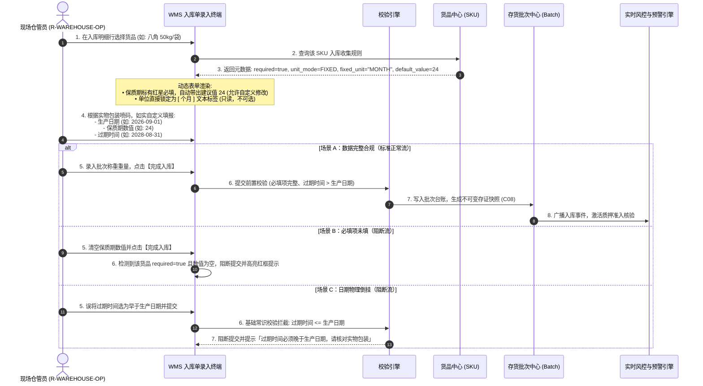

# 入库收集项配置-业务流程推演

> **覆盖场景**：
> 1. 平台/租户级基础字段池定义与度量规范；
> 2. 品类采集模板绑定与行业基准保质期单位固化；
> 3. 货品（SKU）继承、专人自定义配置【必填/选填】与建议默认数值；
> 4. 现场仓储 WMS 入库单动态渲染、单位强制锁定（只读）与现场独立自定义填报；
> 5. 入库完成后的存货批次台账快照固化 (C08)、质押准入与临期/过期风控拦截。
> 
> **不展开范围**：外部 ERP 财务主数据同步、银行内部放款核心账务系统。  
> **参考文档**：[入库收集项配置业务规则规格.md](./入库收集项配置业务规则规格.md) · [货品管理主PRD.md](../04-货品规格管理-货品管理/货品管理主PRD.md) · [2026.09.20 货品管理-入库收集信息与固定保质期单位需求方案.md](../../../../00-草稿对话/2026.09.20%20货品管理-入库收集信息与固定保质期单位需求方案.md) · [AGENTS.md](../../../../AGENTS.md)  
> **版本**：V1.0 | 2026-09-21（精准对齐：三字段独立自定义填报，无强制联动计算）

---

## 一、业务流程概述

### 1.1 核心业务特征说明

- ✅ **度量标准源头固化**：在品类/货品端直接锁定行业统一保质期单位（如八角锁定“月”、花椒锁定“年”、生鲜锁定“天”）。入库时单位只读锁定、禁止下拉自选，现场仓管员仅录入正整数数值，彻底消除多单位混选造成的口径撕裂。
- ✅ **自定义必填与建议数值带出**：由系统专人针对具体货品配置保质期是否必填；配置为必填时入库严格拦截空值；主档可按需配置建议默认数值，入库时自动回填，仓管员亦可按实物标签随时自定义修改数值。
- ✅ **独立自定义如实填报**：生产日期、保质期、过期时间作为独立的入库收集字段，均由现场人员按照实物包装标注如实填报，系统不进行三者强制联动换算，现场作业灵活无阻碍。
- ⚠️ **基础物理常识校验**：若现场同时填报了生产日期与过期时间，系统仅执行 `过期时间 > 生产日期` 的基础常识校验，防止录入倒挂。
- ⚠️ **不可变业务快照约束 (C08)**：入库单完成过账后，现场收集的批次属性、生产日期、过期时间与保质期数值/单位立即固化为不可变存证快照；主档后续调整严禁回写存量批次。
- ⚠️ **双轨平滑兼容**：历史存量批次与未维护单位的存量货品保持既有模式平稳运行，新业务全面执行受控锁定，不搞强制洗库。

### 1.2 本业务在全局数据链路中的位置


### 1.3 完整端到端流程图

```mermaid
flowchart TD
    Start(["业务起点：基础度量与主档定义"]) --> Step1["平台/租户管理员在【字段配置池】维护【保质期】周期规范 (天/月/年)"]
    Step1 --> Step2["品类管理员维护【品类】：勾选入库收集模板，锁定基准保质期单位 (如: 八角=月)"]
    Step2 --> Step3["商品管理员维护【货品(SKU)】：继承品类单位，设置【必填/选填】及建议默认数值 (如: 24个月)"]
    
    Step3 --> Step4["货主申报/仓管发起【WMS 入库单】：选择该货品 SKU"]
    Step4 --> Step5{"识别货品保质期配置模式"}
    
    Step5 -->|存量历史货品 (FREE 模式)| Step5A["展示为传统正整数输入框 + 天/月/年下拉自选框 (双轨平滑兼容)"]
    Step5 -->|新增/规范货品 (FIXED 模式)| Step5B["动态渲染：数值输入框 (带出默认值/可修改) + 固定单位置灰只读文本 (如: 个月)"]
    
    Step5A --> Step6["仓管员根据实物包装独立自定义录入：【生产日期】、【保质期数值】、【过期时间】"]
    Step5B --> Step6
    
    Step6 --> Step7["仓管员点击【提交入库单】"]
    Step7 --> Check{"入库前置基础校验"}
    
    Check -->|若配置为必填且保质期数值为空| Block1["阻断提交：提示『保质期为该货品必填项，请输入数值』"]
    Check -->|过期时间 <= 生产日期| Block2["阻断提交：提示『过期时间必须晚于生产日期』"]
    
    Check -->|校验通过| Step8["入库确认过账，写入 wms_stock_batch 批次台账并固化不可变快照 (C08)"]
    Step8 --> Step9["风控引擎接入：依据标准批次数据激活质押准入与临期预警监控"]
    Step9 --> End(["业务闭环：高可信批次进入质押监管池"])
```

---

## 二、涉及角色与参与主体

| 参与主体 | 核心职责 | 参与节点与权限说明 | 系统角色编码 |
| :--- | :--- | :--- | :--- |
| **平台运营 / 租户管理员** | 维护底层元数据字段池，定义字段类型、强语义校验及可选单位范围 | 字段池配置与版本发布，平台级维护权限 | `R-SYS-ADMIN` |
| **行业商品主管 / 运营人员** | 维护商品类目规范，指定品类专属收集项模板与固定基准单位 | 品类管理维护、模板绑定 | `R-CATEGORY-MGR` |
| **货品档案员 / 仓储主管** | 维护货品规格（SKU），设定【必填/选填】属性与建议默认数值，实施版本管控 | 货品管理新增/编辑、入库收集项配置 | `R-GOODS-ADMIN` |
| **现场仓管员 / 录单人员** | 现场验货收货，根据实物包装独立录入生产日期、保质期数值与过期时间并过账 | WMS 入库单填报、称重验票与入库执行 | `R-WAREHOUSE-OP` |
| **风控审核人员 / 系统引擎** | 依据入库固化的保质期属性执行准入核验，监控货品临期与跌价风险 | 质押准入核准、临期风控规则配置、平仓处置 | `R-RISK-MGR` |
| **资金方 / 商业银行** | 查验质押存货的数字仓单与不可变批次明细，确保押品合规 | 质押融资授信审查、放款终审 | `R-BANK-AUDIT` |

---

## 三、涉及单据、记录与职责

| 单据 / 记录名称 | 业务层级 | 核心职责 | 上游来源 | 下游联动 | 实物与资产状态影响 |
| :--- | :--- | :--- | :--- | :--- | :--- |
| **业务收集字段池定义**<br/>`sys_custom_field_pool` | 底座配置层 | 规范字段编码、单位枚举与控件类型 | 平台租户初始化 | 供品类/货品模板引用 | 定义标准，不直接影响实物状态 |
| **品类收集模板**<br/>`sys_category_field_rel` | 类目标准层 | 固化行业大宗品类的度量衡标准（如锁定月/年） | 字段池配置 | 下发并约束货品主档 | 确立类目准入基准 |
| **货品规格主档 (SKU)**<br/>`sys_goods_sku` | 货品主档层 | 维护具体商品规格、专人自定义必填标记、建议默认保质期 | 品类模板继承 | 驱动 WMS 入库单表单渲染 | 确定规格度量模型 |
| **WMS 仓储入库单**<br/>`wms_inbound_order` | 作业执行层 | 现场如实自定义录入批次、生产日期、保质期数值与过期时间 | 货主送货/预约单 | 生成库存批次与数字仓单 | 实物验收入库，从在途变为待检/在库 |
| **存货批次台账与快照**<br/>`wms_stock_batch` | 资产台账层 | 固化批次号、标准单位、实录各日期不可变快照 (C08) | 入库单过账回写 | 触发风控引擎质押准入 | 正式形成可质押或监管的现货库存 |
| **押品临期预警流水**<br/>`risk_warn_record` | 风控预警层 | 依据不可变快照实时计算剩余货龄，达到阈值触发告警 | 批次台账定时扫描 | 推送风控处置、阻断出库质押 | 资产标记风险提示，必要时冻结质押 |

---

## 四、主流程时序推演



---

## 五、单据与事件级联联动规则表

| 触发动作 | 触发条件 | 级联影响对象 | 传递与继承数据 | 状态与后置变更 | 异常回滚策略 |
| :--- | :--- | :--- | :--- | :--- | :--- |
| **品类保存固定单位** | 管理员在品类端选定固定单位（如“月”） | 下属所有未锁定货品（SKU） | 继承 `fixed_unit = MONTH` 与 `unit_mode = FIXED` | 下级货品新建或编辑时强制锁定单位，不可更改 | 若品类保存失败，事务回滚，不影响既有货品 |
| **货品自定义必填与数值** | 管理员在货品端勾选必填并配置默认值 | 货品主档规则 | 固化 `required = true/false`，`default_value = N` | 入库单渲染时依据 `required` 判定是否为必填项，带出默认值 | 字段校验错误阻断保存 |
| **货品引用主档编辑** | 货品已发生过有效入库流水 | 货品主档编辑表单 | 校验 `wms_inbound_order_detail` 关联记录 | **强校验拦截 (SKU-F08)**：禁止修改核心保质期单位与采集项，防止批次歧义 | 弹出提示「该规格已产生业务数据，禁止修改核心收集规则」 |
| **入库单选定货品** | 录单界面选中具体货品 SKU | 入库单动态收集表单项 | 继承字段编码、是否必填、固定单位标签、默认保质期数值 | 动态生成受控输入框，必填项加红星，单位下拉框被替换为只读文本标签 | 若货品主档被停用，阻断选中并提示 |
| **现场自定义录入** | 仓管员独立录入生产日、保质期数值与到期日 | 入库明细单据属性 | 保留现场实录值，单位强制使用主档固定单位 | 各字段独立成值，无相互公式强绑定强制换算 | 数值非正整数时提示纠正 |
| **入库单审核过账** | 必填项齐全、过期时间 > 生产日期 | 存货批次台账 (`wms_stock_batch`) | 固化批次号、规格、保质期数值、单位、生产日、到期日各独立字段 | 批次状态置为 `NORMAL`，固化为不可变存证快照 (C08) | 任何校验失败回滚事务，入库单保持草稿/待核实态 |
| **批次临期定时扫描** | 当前日期距批次过期时间小于预警天数 | 订单/押品预警中心 (`risk_warn_record`) | 继承批次号、货主ID、在押订单号、剩余保质期天数 | 自动生成 `EXPIRING_WARN` 预警流水，穿透通知风控员与银行 | 预警生成幂等控制，同一批次同一天不重复生成 |

---

## 六、关键异常与分支处置推演

### 6.1 分支 1【必填校验拦截（未输入保质期数值）】
* **场景**：管理员在货品管理中将该货品的保质期设为【必填】（`required: true`），现场仓管员录单时清空了建议数值或遗漏未填。
* **处置推演**：
  1. 仓管员点击【提交入库单】；
  2. 前端表单校验层检测到 `goods_sku.required == true` 且保质期数值为空；
  3. 系统强行阻断提交，保质期输入框高亮红框并弹出提示：`「【保质期】为该货品必填属性，请输入有效正整数」`；
  4. 页面停留在当前行，光标自动定位至该输入框。

### 6.2 分支 2【日期常识物理倒挂拦截（过期时间早于/等于生产日期）】
* **场景**：仓管员录入生产日期为 `2026-09-01`，但过期时间误看误填为 `2026-08-01`。
* **处置推演**：
  1. 仓管员点击提交入库单；
  2. 服务端与客户端双层校验拦截：$\text{过期时间} \le \text{生产日期}$；
  3. 强行阻断提交，弹出错误警示：`「过期时间必须晚于生产日期，请核对实物包装喷码重新录入」`。

### 6.3 分支 3【存量历史货品平滑过渡（双轨兼容）】
* **现状与场景**：系统中存在大量历史货品，其主档中未配置 `fixed_unit`。
* **处置推演**：
  1. 系统在解析入库收集规则时，若识别到 `unit_mode` 为空或为 `FREE`，前端表单自动启用**双轨兼容降级渲染**；
  2. 保持原有的 `[数值输入框] + [天/月/年 下拉框]` 交互，确保历史业务不受影响；
  3. 存量历史在库批次严格维持原历史快照（C08），不做全量强行洗库；
  4. 仅当货品档案管理员对该历史货品进行主动编辑升级并保存固定单位后，后续新入库单才切换为受控锁定模式。

---

## 七、关键架构决策与证据留痕

### 7.1 为什么采用“固定单位 + 数值自定义填报”而不是联动强制计算？
1. **尊重实物包装现实**：大宗商品与消费品的出厂喷码极为复杂，部分厂家按出厂月份统一定义失效日，部分按保质期推算，还有部分直接标死失效日。强行由系统联动推算不仅无法完全拟合各工厂算法，反而会因推算冲突频繁阻塞现场入库。
2. **根治核心痛点**：过去最大的痛点是现场单位乱选（年、月、天混用），导致系统无法做横向统计；锁定单位后，所有批次在同一规格下均统一为相同度量口径（如统一为“月”），彻底解决了口径撕裂，同时兼顾了现场录入的灵活性。

### 7.2 为什么必须采用“平台字段池 + 品类绑定 + 货品微调”的三级抽象？
1. **彻底解耦业务逻辑与存储模型**：避免每增加一个行业属性就在入库单表中新建物理字段；通用质检扩展项动态渲染。
2. **兼顾行业标准与规格个性**：品类层面代表行业通用行规（八角默认按月度量，冷链按天度量），货品规格层面代表具体包装形态与货架期（如真空包装与散装）。

### 7.3 为什么必须严格遵循不可变快照机制 (C08)？
* 供应链金融是以存货为底层资产的金融信用活动。存货一旦入库并过账，现场实录的批次属性、生产日期、过期时间与保质期构成银行放款、保险核保及数字仓单法律效力的基石。后续无论商品主档如何调整命名或规则，既有批次的司法证据镜像绝不发生篡改。

---

## 八、已确认与落地决策清单

| 编号 | 事项说明 | 最终落地决策 | 状态 |
| :--- | :--- | :--- | :---: |
| **D01** | **保质期必填性与默认数值** | 由系统专人在货品端配置是否必填；配置为必填则入库时强校验不为空；默认数值为可选预设，有值则自动带出，现场仍可修改。 | ✅ 已决策并纳入推演 |
| **D02** | **三字段独立填报无联动** | 生产日期、保质期、过期时间均为独立录入字段，如实自定义填报，无公式强制推算，仅校验 `过期时间 > 生产日期`。 | ✅ 已决策并纳入推演 |
| **D03** | **存量历史批次处理方式** | 双轨平滑兼容过渡；存量批次维持原不可变快照，不搞批量洗库，确保司法存证稳定性。 | ✅ 已决策并纳入推演 |
