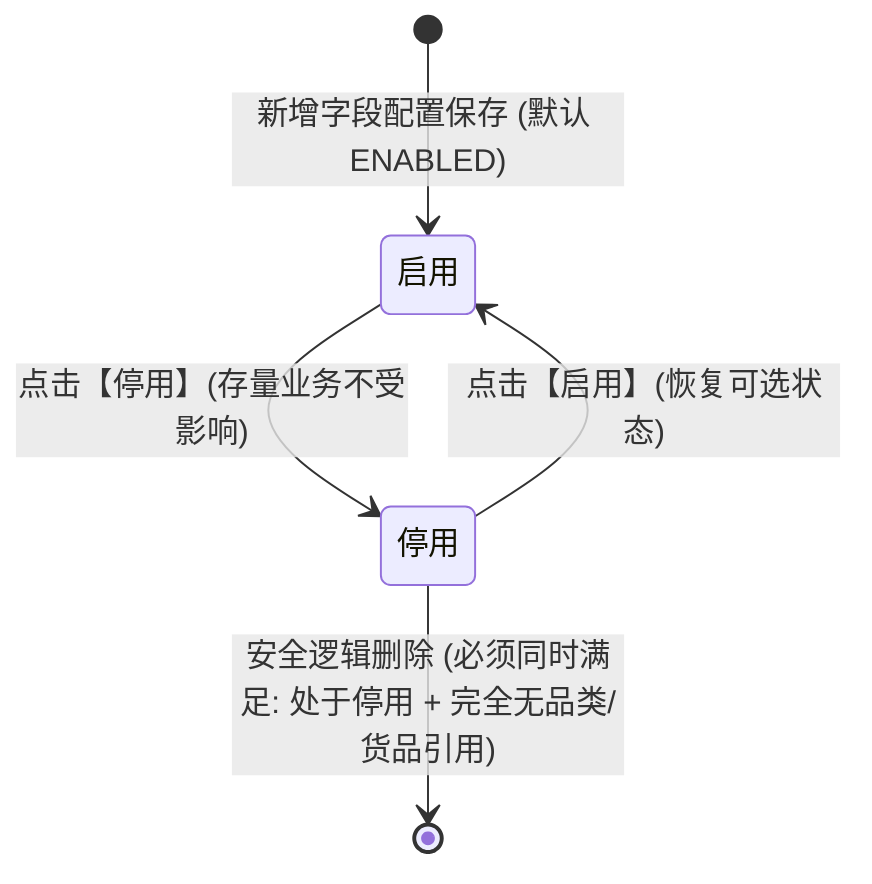

# 入库收集项配置 业务规则规格

> **文档定位**：本文件是 SYZC 存货监管系统【配置管理 → 货品规格管理 → 入库收集项配置】独立菜单**状态机、动作约束、校验规则（Rxx）、计算与版本规则（Cxx）、权限与风控约束（Pxx）的唯一定义真源（SSOT）**。  
> **适用范式**：**范式 D（基础档案类）+ 范式 C（规则配置类）**。  
> **关联依据**：[规则设计输入说明](../../../../05-常用模板/需求处理/2-1%20(输入)规则设计.md) · [业务规则规格模板](../../../../05-常用模板/需求处理/2-2%20(输出)业务规则规格模板.md) · [AGENTS.md](../../../../AGENTS.md)  
> **版本**：V1.0 | 更新时间：2026-09-21 | 责任人：森云科技（Senyun Technology）  
> **配套文档**：[主PRD](./入库收集项配置主PRD.md) · [字段清单](./入库收集项配置字段清单.md) · [列表页 ASCII](./入库收集项配置_ASCII_列表页.md) · [新增/编辑页 ASCII](./入库收集项配置_ASCII_新增编辑页.md) · [详情页 ASCII](./入库收集项配置_ASCII_详情页.md)

---

## 一、模块与对象定位

| 项目 | 内容 |
| :--- | :--- |
| **层级定位** | **【配置底座层 - 业务收集项字段池】**（货品规格管理与仓储作业采集元数据配置中心） |
| **核心职责** | 集中定义与维护全平台/租户通用的入库收集项字段元数据（包含强业务语义内置字段如保质期、生产日期，以及通用扩展质检字段）；规范控件类型与保质期度量单位枚举范围；为下游品类管理与货品规格提供标准化字段池引用源。 |
| **实体映射** | `sys_inbound_field_pool`（字段池主表）、`sys_inbound_field_unit_config`（字段度量单位配置子表） |
| **上下游关系** | **上游**：平台运营 / 系统管理员初始化与日常维护； **下游**： 1. **品类管理**：从本字段池批量勾选模板项，并锁定该品类的基准保质期单位（月/年/天）； 2. **货品管理 (SKU)**：继承品类模板，锁定固定单位（只读），由专人配置各字段必填性（`required`）与建议默认数值； 3. **WMS 入库单**：依据货品配置动态渲染录入表单，单位锁定只读，现场独立录入各字段。 |
| **数据约束** | 同一租户下，字段编码（`field_code`）与字段名称（`field_name`）严格全局唯一。 |

---

## 二、状态定义与生命周期模型

依据《2-2 单据状态与流转设计规范》第 2.3 条（基础档案与配置类禁止物理删除，强调引用保护与启用/停用生命周期）：

### 2.1 状态定义表

| 状态名称 | 枚举编码 | 业务含义 | 是否终态 | 进入条件 | 允许操作 | 严禁操作 |
| :--- | :--- | :--- | :---: | :--- | :--- | :--- |
| **启用** | `ENABLED` | 字段正常生效，在品类/货品管理的新建与编辑弹窗中可见且可被勾选引用 | 否 | 新增字段保存成功，或从停用状态重新激活 | 查看详情、编辑属性、供下游品类勾选引用、切换停用 | 物理删除、直接从主数据库清除 |
| **停用** | `DISABLED` | 字段失效停用。新增品类/货品时不可被勾选；已引用的存量货品与历史入库批次不受影响 | 否 | 管理员手动执行【停用】操作 | 查看详情、重新启用、安全逻辑删除（需满足无引用前置） | 在新增品类/货品时勾选该字段 |

### 2.2 状态流转图（Mermaid）

---

## 三、状态流转动作表（核心交付物）

| 当前状态 | 触发动作 | 触发主体 | 前置条件（准入拦截） | 目标状态 | 二次确认与弹窗交互 | 后置级联影响 | 异常与失败提示 |
| :--- | :--- | :--- | :--- | :--- | :--- | :--- | :--- |
| — | **新增字段** | 档案管理员 | 字段名称与字段编码在租户内严格唯一 | **启用** | 表单抽屉录入，点击保存 | 写入字典池，默认 `ENABLED`，立即在品类配置中可见 | Toast：「保存失败：字段编码已存在」 |
| **启用** | **编辑字段** | 档案管理员 | 非系统内置强语义字段；或内置字段仅微调描述/排序 | **启用** | 编辑抽屉，点击保存 | 更新元数据，版本号 `version` 递增 | Toast：「内置强语义字段禁止修改核心业务语义」 |
| **启用** | **切换停用** | 档案管理员 | 任意启用中字段均可停用 | **停用** | 二次确认弹窗：「确定停用该字段？停用后新建品类将不可选择此项」 | 状态置为 `DISABLED`，新建品类勾选池中自动隐藏该项 | — |
| **停用** | **切换启用** | 档案管理员 | 任意停用字段 | **启用** | 二次确认弹窗：「确定启用该字段？」 | 状态置为 `ENABLED`，恢复可选 | — |
| **停用** | **删除字段** | 档案管理员 | **强校验拦截**： 1. 非系统内置字段（内置字段严禁删除）； 2. 扫描品类/货品，**完全无任何引用记录** | **记录消失** | 警示确认弹窗：「删除后不可恢复，确定删除该字段？」 | 标记逻辑删除（`is_deleted = 1`），字典列表中清除 | 弹窗阻断：「该字段已被 X 个品类/货品引用，禁止删除！请先在主档中解绑」 |

---

## 四、动作能力矩阵

| 业务动作 | 启用 (ENABLED) | 停用 (DISABLED) | 系统内置强语义字段 (如: 保质期/生产日期) | 自定义扩展字段 (如: 质检项) |
| :--- | :---: | :---: | :---: | :---: |
| **查看字段详情** | ✅ | ✅ | ✅ | ✅ |
| **编辑基础属性** | ✅ | ✅ | ❌（仅允许调整排序与备注） | ✅ |
| **配置可选单位范围** | ✅ | ✅ | ✅（针对保质期可配置天/月/年） | ❌ |
| **切换停用** | ✅ | ❌ | ✅ | ✅ |
| **切换启用** | ❌ | ✅ | ✅ | ✅ |
| **删除字段** | ❌（必须先停用） | ✅（仅限无引用） | ❌（**永久严禁删除**） | ✅（停用且无引用） |

*说明：✅ = 允许操作；❌ = 不允许（页面隐藏按钮或置灰禁用）。*

---

## 五、核心业务规则清单（R / C / P）

### 1. 字段字典定义与校验规则（Rxx）

* **R01【收集项名称唯一性校验规则】**
  * 收集项名称（`field_name`）支持 2~30 汉字/字符，同一租户内全局严格唯一（系统底层自动生成标识键，前端无需录入英文编码）；
  * 提交保存时后台强校验唯一性，重复时阻断保存并提示：`「收集项名称已存在，请重新输入」`。

* **R02【系统核心收集项保护机制】**
  * 系统预置核心业务字段（如【保质期】、【生产日期】、【过期时间】、【批次号】等）；
  * **保护策略**：
    1. 核心项禁止修改底层控件类型，防止破坏下游入库与风控逻辑；
    2. 核心项界面直接置灰或隐藏【删除】按钮；服务端硬校验拦截任何对核心项的删除接口调用，防范风控与台账底层撕裂。

* **R03【保质期字段可选单位与基准规范】**
  * 对于【保质期】（`shelf_life`）字段，本菜单提供专项度量单位范围配置：
    * 支持开启的可选单位枚举：`天 (DAY)`、`月 (MONTH)`、`年 (YEAR)`；
    * 支持设定平台推荐基准单位（系统默认：`月`）；
  * 该范围作为下游【品类管理】在下拉锁定固定保质期单位时的白名单数据源。

* **R04【两阶段安全删除与强引用拦截规则】**
  * 任何非核心项执行删除操作时，服务端必须执行两阶段校验：
    * **阶段一（状态校验）**：必须处于 `DISABLED`（停用）状态；若处于 `ENABLED` 状态，直接阻断删除；
    * **阶段二（引用关系后台扫描）**：
      * 系统自动扫描 `sys_category_field_rel`（品类引用）与 `sys_goods_sku_field_rel`（货品引用）；
      * 若存在任何有效关联记录（引用计数 $> 0$），系统弹窗阻断删除，并展示前 5 个关联品类/货品规格名称引导解绑（无需在主列表常驻统计列）；
      * 仅当引用计数严格为 0 时，才允许在二次风险确认后执行逻辑删除（`is_deleted = 1`）。

* **R05【停用状态级联生效规则】**
  * 某收集项被置为 `DISABLED` 后，在下游【品类管理】的新增/编辑弹窗中自动隐藏，不可被新选入模板；
  * 既有已引用该字段的存量品类与货品规格，配置保留不变，WMS 入库单仍可正常展示和填报，确保业务平稳不中断。

* **R06【下游品类与货品的多级继承锁定规则】**
  * **品类端**：新增/编辑品类时，从本菜单 `ENABLED` 字段池中批量勾选收集项；勾选【保质期】时，**必须下拉单选指定唯一的【固定保质期单位】**（月/年/天）；
  * **货品端**：创建货品时继承品类的收集项和固定单位，**单位强制只读锁定**，并由专人自定义配置该字段是否为【必填】（`required = true/false`）及可选的【建议默认数值】；
  * **入库端**：根据货品配置动态渲染，单位只读展示，仓管员按实物独立如实自定义填报。

---

### 2. 计算、版本与快照规则（Cxx）

* **C01【不可变存证快照与版本不回写原则 (C08 原则)】**
  * 入库收集项配置采用内部递增版本号（`version`）；
  * 收集项属性（名称、单位开关、启停用）变更后立即递增版本，新配置仅对变更后新建立的品类或货品生效；
  * 字段变更**绝不回写**历史存量入库单据明细和既有存货批次台账，严格保障司法证据效力。

* **C02【主档乐观锁并发控制规则】**
  * 收集项编辑与状态切换提交时校验 `version` 标识；
  * 若提交时数据库版本号已发生变动，阻断更新并提示：`「数据已被他人修改，请刷新后重试」`。

---

### 3. 权限与数据安全约束（Pxx）

* **P01【入库收集项配置管理权限】**：
  * 仅具备 `R-SYS-ADMIN`（系统管理员）或 `R-GOODS-ADMIN`（商品主档管理员）角色的用户拥有本菜单的查询、新增、编辑、启停用与删除权限；
  * 普通业务人员、现场仓管员（`R-WAREHOUSE-OP`）无权访问本菜单。
* **P02【多租户数据隔离】**：
  * 自定义扩展收集项基于 `tenant_id` 进行物理/逻辑强隔离，不同租户之间数据完全独立。

---

## 六、附录：核心控件类型枚举字典 (`control_type`)

| 控件编码 | 控件类型名称 | 适用场景说明 | WMS 入库单呈现行为 |
| :--- | :--- | :--- | :--- |
| `TEXT` | **单行文本输入框** | 批次号、生产企业、检验机构等字符信息 | 标准单行文本框录入 |
| `SELECT` | **下拉单选框** | 包装方式、质量等级、存储方式等固定选项 | 下拉面板单选 |
| `DATE` | **日期选择器** | 生产日期、过期时间、检验日期等关键日期 | 日历日期选择器（`YYYY-MM-DD`） |
| `NUMBER_RANGE` | **数字区间框** | 温度要求（℃）、湿度要求（%RH）等范围参数 | 两个数字框（最小值 $\sim$ 最大值），带单位 |
| `PERCENTAGE` | **百分比数值框** | 水分含量（%）、杂质率（%）等质量比率 | 单数字输入框，固定带 `%` 后缀，校验 $0 \sim 100$ |
| `PERIOD` | **周期组合项** | **保质期专属**（数值 + 固定只读单位） | **正整数输入框 + 锁定单位文本标签** |
