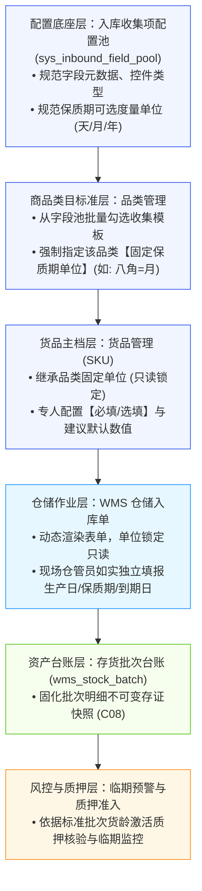
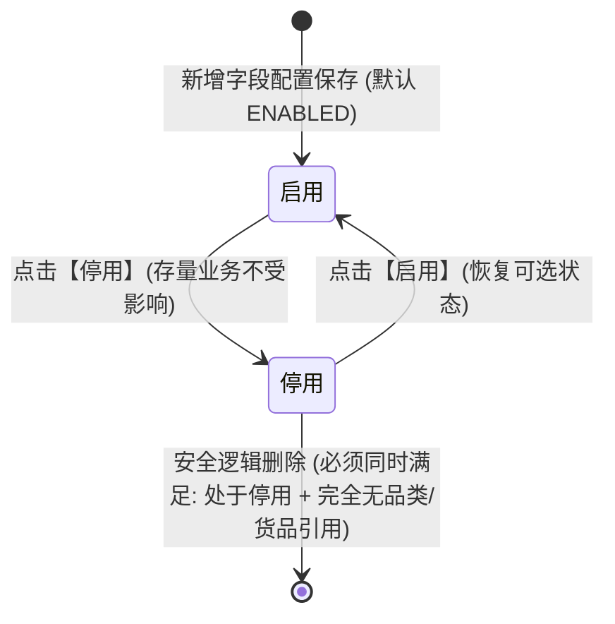

# 入库收集项配置主PRD

> **模块定位**：货品规格管理底座配置节点（业务收集项元数据池），负责集中维护全租户通用的入库采集字段规范、控件类型及保质期度量单位标准（天/月/年），实现核心项保护、保质期专项配置与两阶段安全删除拦截，为下游【品类管理】与【货品管理 (SKU)】提供统一的元数据底座。  
> **版本**：V1.0 基准版 | 更新时间：2026-09-21 | 责任人：森云科技（Senyun Technology）  
> **核心依据**：[入库收集项配置字段清单.md](./入库收集项配置字段清单.md) 是本模块所有字段、页面呈现、控件类型与展示顺序的唯一定义真源；[入库收集项配置业务规则规格.md](./入库收集项配置业务规则规格.md) 是本模块状态机、动作流转、校验规则（Rxx）、计算与版本规则（Cxx）及权限（Pxx）的唯一定义真源。  
> **衍生文档**：[列表页 ASCII](./入库收集项配置_ASCII_列表页.md) · [新增/编辑页 ASCII](./入库收集项配置_ASCII_新增编辑页.md) · [详情页 ASCII](./入库收集项配置_ASCII_详情页.md) · [业务流程推演](./入库收集项配置-业务流程推演.md)

---

## 1. 业务背景与风控目的

### 1.1 业务定位
入库收集项配置是 SYZC 存货监管系统“货-仓-金”全链路数据采集的标准基石。通过在配置底座统一规范货品入库时需采集的物理特性（如保质期、生产日期、包装规格、质检指标等），解决传统仓储作业中各仓库字段口径不一、单位混选、数据失真等问题，确保存货从验收入库起即形成高可信、标准化的批次资产数据。

### 1.2 核心痛点与管控目标
1. **度量口径撕裂与混选痛点**：过去保质期单位由现场仓管员随意下拉（年/月/天混用），导致系统无法做横向货龄分析与统一预警；本模块通过定义保质期可选单位范围，支持下游品类锁定固定单位，消除口径撕裂。
2. **核心业务项误删与断链风险**：保质期、生产日期等核心字段若被业务人员误删，会导致下游入库单与风控预警引擎崩溃；本模块确立核心内置项保护机制（永久禁止删除、禁止修改核心语义）。
3. **主数据变更与司法存证冲突**：存货入库后即作为银行质押放款凭据，若配置变更直接回写历史批次将破坏司法存证效力；本模块严格执行不可变快照与版本不回写原则 (C08)。
4. **两阶段安全防误删**：对于自定义扩展字段，杜绝物理删除，执行“停用状态校验 + 下游品类/货品引用全量扫描”两阶段拦截，杜绝孤儿配置。

---

## 2. 功能范围

| 包含功能 (In Scope) | 不包含功能 (Out of Scope) |
| :--- | :--- |
| - 入库收集项字段池列表展示（7 维精简矩阵：序号、名称、控件类型、单位/选项摘要、状态徽章、创建时间、操作列）； - 新增与编辑收集项（名称唯一性、控件类型选定、单位标签/下拉选项配置、占位提示与备注）； - 核心内置强语义字段保护（保质期、生产日期、过期时间等禁止删除、锁定控件类型）； - 【保质期】专项度量单位子表配置（支持天/月/年开关、默认推荐单位设置、至少保留一单位强校验）； - 启用与停用生命周期管理（停用后下游新建品类不可见，存量业务不受影响）； - 两阶段安全删除拦截（阶段一停用状态拦截 + 阶段二品类/货品引用扫描阻断与关联清单展示）； - 租户数据隔离与操作审计留痕。 | - 品类模板中具体收集项的勾选与锁定（由【品类管理】菜单完成）； - 具体货品（SKU）的必填性设置与默认数值配置（由【货品管理】菜单完成）； - WMS 仓储入库单的现场录单与质检验收作业（由仓储 WMS 模块完成）； - 存货批次的临期预警规则与平仓风控处置（由【风控管理/预警配置】完成）。 |

---

## 3. 架构与引用模型

### 3.1 实体定位与全链路数据拓扑

### 3.2 版本控制与不可变快照模型 (C08)
* **版本递增**：收集项元数据配置每次保存成功，系统递增内部业务版本号 `version`；
* **历史不回写**：新版本规则仅对变更后新建的品类/货品或新业务生效，**绝不回写**历史存量入库单明细与在库批次台账快照；
* **并发控制**：表单保存执行乐观锁检查，防止多管理员并发修改覆盖。

---

## 4. 业务场景

| 场景序号与编码 | 场景名称 | 场景类型 | 核心业务流程与约束说明 | 关联规则索引 |
| :--- | :--- | :--- | :--- | :--- |
| **场景 1 (FLD-S01)** | 【新增自定义收集项】 | 正常主流程 | 管理员录入收集项名称、选择控件类型（如数字区间、单数值、下拉框），配置度量单位或选项集合，校验租户内名称唯一性后保存，默认进入【启用】状态。 | 【收集项名称唯一性校验规则】(R01) 【乐观锁并发控制规则】(C02) |
| **场景 2 (FLD-S02)** | 【保质期专项度量单位配置】 | 特色主流程 | 在【保质期】行点击【配置单位】，在弹窗中配置允许开启的单位（天/月/年）及推荐基准单位，强校验至少保留 1 个开启单位，保存后更新品类可选白名单。 | 【保质期字段可选单位与基准规范】(R03) 【不可变存证快照与版本不回写】(C01) |
| **场景 3 (FLD-S03)** | 【收集项停用与启用控制】 | 管控流程 | 对非核心字段执行停用；停用后下游新建品类弹窗中自动隐藏，存量已引用品类和历史批次继续有效；支持重新启用恢复可选。 | 【停用状态级联生效规则】(R05) |
| **场景 4 (FLD-S04)** | 【两阶段安全删除拦截】 | 异常/安全拦截 | 针对自定义字段执行删除：阶段一校验是否为停用态（启用态直接阻断）；阶段二扫描品类与货品主档引用，若引用计数 $>0$ 弹窗阻断并展示前 5 个引用源引导解绑；引用计数 $=0$ 经二次确认后逻辑删除。 | 【两阶段安全删除与强引用拦截规则】(R04) 【系统核心收集项保护机制】(R02) |
| **场景 5 (FLD-S05)** | 【系统核心项保护拦截】 | 安全防护 | 针对【保质期】、【生产日期】、【过期时间】等内置项，列表操作列隐藏或置灰【删除】按钮；编辑抽屉中锁定控件类型，禁止篡改核心业务语义。 | 【系统核心收集项保护机制】(R02) |

---

## 5. 状态机与动作能力矩阵

> 状态定义、状态流转表与时序图详见 [入库收集项配置业务规则规格.md §二、§三](./入库收集项配置业务规则规格.md)。

### 5.1 状态定义与流转摘要
系统采用极简的【启用 / 停用】双态生命周期模型：
* **启用 (`ENABLED`)**：字段正常生效，在下游【品类管理】新建/编辑模板弹窗中可见且可被勾选引用；
* **停用 (`DISABLED`)**：字段失效停用，下游新建品类时自动过滤隐藏；已引用的存量品类与历史入库批次不受影响。

### 5.2 动作能力矩阵

| 收集项类别 | 当前状态 | 查看详情 | 编辑基础属性 | 配置保质期单位 | 切换停用/启用 | 删除操作 |
| :--- | :---: | :---: | :---: | :---: | :---: | :---: |
| **核心内置项** (如保质期) | 启用 | ✅ | 仅限描述/排序 | ✅ (保质期专属) | ✅ (置为停用) | ❌ (永久置灰禁用) |
| **核心内置项** (如保质期) | 停用 | ✅ | 仅限描述/排序 | ✅ (保质期专属) | ✅ (恢复启用) | ❌ (永久置灰禁用) |
| **自定义扩展项** (如质检项) | 启用 | ✅ | ✅ (无引用可改控件) | ❌ | ✅ (置为停用) | ❌ (必须先停用) |
| **自定义扩展项** (如质检项) | 停用 | ✅ | ✅ | ❌ | ✅ (恢复启用) | ✅ (仅限引用计数=0) |

---

## 6. 页面功能与交互说明

### 6.1 页面布局与骨架
1. **顶部操作与查询区**：
   - 左侧提供【收集项名称】模糊搜索框、【控件类型】下拉精确筛选框、【状态】下拉筛选框；
   - 右侧主操作按钮【+ 新增收集项】。
2. **列表数据表格区（7 维精简矩阵）**：
   - 采用极简设计，展示：序号（第 1 列）、收集项名称（加粗）、控件类型、度量单位/选项摘要（免进详情直观预览）、状态徽章（绿/灰）、创建时间、操作列（固定末列）。
3. **模态抽屉与弹窗体系**：
   - 【新增/编辑抽屉】：轻量表单录入；
   - 【保质期配置单位弹窗】：天/月/年专属度量配置；
   - 【两阶段删除拦截弹窗】：引用扫描阻断卡片 vs 无引用风险二次确认弹窗。

### 6.2 列表主表与行操作交互
- **【编辑】**：点击滑出右侧编辑抽屉，回填字段元数据；
- **【配置单位】**：**仅针对【保质期】行呈现**，点击打开度量单位配置弹窗；
- **【停用 / 启用】**：点击弹出二次确认气泡/弹窗，确认后即时切换状态并更新状态徽章；
- **【删除】**：
  - 系统内置项：按钮置灰禁用，悬浮 Tooltip 提示「系统核心字段，禁止删除」；
  * 启用中自定义项：点击提示「请先停用该字段后再执行删除」；
  * 停用中自定义项：触发两阶段后台扫描拦截。

### 6.3 新增/编辑收集项抽屉表单交互
- **表单控件联动**：
  - 选择【单数值(带单位)】或【数字区间】：动态激活【度量单位标签】输入框（必填，如 `℃`、`%RH`）；
  - 选择【下拉单选框】：动态激活【下拉选项集合】配置区，支持动态添加/删除选项行（至少 1 项）；
  - 选择【单行文本框】或【日期选择器】：隐藏度量单位与选项配置；
- **占位提示与备注**：提供输入占位提示文案及业务备注输入域。

### 6.4 保质期专项【配置单位】弹窗交互
- **单位开关**：提供【允许启用天】、【允许启用月】、【允许启用年】三个独立 Switch 开关；
- **推荐基准单位**：下拉单选，数据源联动自已开启的单位开关；
- **保底校验拦截**：若管理员试图关闭最后一个开启的单位开关，系统阻断关闭并提示「至少必须保留一个可用保质期单位」。

### 6.5 两阶段安全删除与引用拦截交互
- **触发后台扫描**：点击停用字段的【删除】时，后台实时扫描品类表与货品主档；
- **分支 A（存在引用 · 强阻断）**：
  - 弹出黄色警示阻断弹窗，标明「该字段已被 X 个品类、Y 个货品规格引用，禁止删除！」；
  - 卡片式列出前 5 个关联品类/货品名称，引导管理员先前往解绑；
  - 弹窗底部仅提供【我知道了】关闭按钮，不提供确认删除按钮。
- **分支 B（无引用 · 风险确认）**：
  - 弹出常规风险警示弹窗「确定彻底删除该收集项吗？删除后不可恢复」；
  - 点击【确认删除】后执行逻辑删除，列表行移除并 Toast 提示成功。

---

## 7. 核心业务规则索引与追溯表

| 规则编码 | 规则业务名称 | 核心业务口径与约束摘要 | 唯一定义来源 |
| :--- | :--- | :--- | :--- |
| **R01** | 【收集项名称唯一性校验规则】 | 同一租户内收集项名称全局严格唯一，重复阻断保存 | [业务规则规格 R01](./入库收集项配置业务规则规格.md#1-字段字典定义与校验规则rxx) |
| **R02** | 【系统核心收集项保护机制】 | 内置强语义字段禁止删除、禁止修改底层控件类型 | [业务规则规格 R02](./入库收集项配置业务规则规格.md#1-字段字典定义与校验规则rxx) |
| **R03** | 【保质期字段可选单位与基准规范】 | 专项配置天/月/年度量范围，作为下游品类锁定单位的白名单源头 | [业务规则规格 R03](./入库收集项配置业务规则规格.md#1-字段字典定义与校验规则rxx) |
| **R04** | 【两阶段安全删除与强引用拦截】 | 阶段一校验停用态；阶段二扫描品类/货品引用，引用计数 $>0$ 强阻断 | [业务规则规格 R04](./入库收集项配置业务规则规格.md#1-字段字典定义与校验规则rxx) |
| **R05** | 【停用状态级联生效规则】 | 停用后下游新建品类弹窗隐藏；已引用品类及存量批次业务不受影响 | [业务规则规格 R05](./入库收集项配置业务规则规格.md#1-字段字典定义与校验规则rxx) |
| **R06** | 【下游品类与货品的多级继承锁定】 | 品类勾选必选单位，货品端单位只读锁定并设必填，入库单独立录入 | [业务规则规格 R06](./入库收集项配置业务规则规格.md#1-字段字典定义与校验规则rxx) |
| **C01** | 【不可变存证快照与历史不回写】 | 遵循 C08 原则，版本递增生效，绝对不回写历史存量入库单与在库批次 | [业务规则规格 C01](./入库收集项配置业务规则规格.md#2-计算版本与快照规则cxx) |
| **C02** | 【主档乐观锁并发控制规则】 | 提交保存校验 `version` 标识，并发冲突时提示刷新重试 | [业务规则规格 C02](./入库收集项配置业务规则规格.md#2-计算版本与快照规则cxx) |
| **P01** | 【配置管理权限隔离规则】 | 仅系统管理员与商品管理员有权配置；仓管员与普通业务只读/无权访问 | [业务规则规格 P01](./入库收集项配置业务规则规格.md#3-权限与数据安全约束pxx) |
| **P02** | 【多租户数据强隔离】 | 字段池按 `tenant_id` 强隔离，各租户数据互不可见 | [业务规则规格 P02](./入库收集项配置业务规则规格.md#3-权限与数据安全约束pxx) |

---

## 8. 权限与安全控制

### 8.1 RBAC 角色权限矩阵
| 功能操作 | 平台/系统管理员 (`R-SYS-ADMIN`) | 商品主档管理员 (`R-GOODS-ADMIN`) | 品类主管 (`R-CATEGORY-MGR`) | 现场仓管员 (`R-WAREHOUSE-OP`) | 风控人员 (`R-RISK-MGR`) |
| :--- | :---: | :---: | :---: | :---: | :---: |
| **查看字段池列表与详情** | ✅ | ✅ | ✅（只读引用） | ❌ | ✅（只读） |
| **新增/编辑收集项** | ✅ | ✅ | ❌ | ❌ | ❌ |
| **配置保质期度量单位** | ✅ | ✅ | ❌ | ❌ | ❌ |
| **切换启用/停用** | ✅ | ✅ | ❌ | ❌ | ❌ |
| **删除收集项 (受控)** | ✅ | ✅ | ❌ | ❌ | ❌ |

### 8.2 数据与操作安全
* **租户隔离**：数据库层面强隔离 `tenant_id`，禁止跨租户查询与修改；
* **操作审计留痕**：字段的新增、编辑、启停用与删除操作，全程记录操作人 ID、操作时间、变更前后数据快照。

---

## 9. 验收标准与测试用例 (Vxx)

| 验收用例编码 | 验收项业务名称 | 前置条件与测试步骤 | 预期结果与阻断交互 |
| :--- | :--- | :--- | :--- |
| **FLD-V01** | 【名称租户唯一性校验】 | 录入已存在的收集项名称（如“生产企业”），点击保存抽屉 | 页面阻断提交，输入框高亮红框并 Toast 提示「收集项名称已存在，请重新输入」 |
| **FLD-V02** | 【核心字段删除防护】 | 在列表查看【保质期】或【生产日期】行操作列 | 【删除】按钮呈置灰禁用状态，鼠标悬浮提示禁止删除，无触发弹窗 |
| **FLD-V03** | 【两阶段删除-启用态拦截】 | 对处于【启用】状态的自定义字段直接点击删除（或通过控制台调用删除接口） | 系统校验前置状态，提示「处于启用状态的字段禁止删除，请先停用」 |
| **FLD-V04** | 【两阶段删除-引用扫描拦截】 | 将某已被品类或货品引用的字段置为停用后，点击【删除】操作 | 系统阻断删除，弹出黄色警示弹窗，展示「已关联 X 个品类，Y 个货品」，列出关联项，无确认删除按钮 |
| **FLD-V05** | 【两阶段删除-无引用允许】 | 创建一个未被任何品类引用的测试字段，置为停用后点击【删除】 | 弹出二次确认风险弹窗，点击确认后记录逻辑删除，列表行移除 |
| **FLD-V06** | 【保质期至少保留一单位校验】 | 进入保质期【配置单位】弹窗，在仅剩 1 个开启单位时尝试关闭该 Switch | 开关状态无法切换，系统 Toast 警告「至少必须保留一个可用保质期单位」 |
| **FLD-V07** | 【停用后下游选择隔离】 | 将自定义字段“含糖量”置为停用，打开【品类管理】新增品类弹窗 | 品类收集项勾选列表中不出现“含糖量”，不可被新选；已引用的存量品类不受影响 |
| **FLD-V08** | 【版本不回写验证 (C08)】 | 修改某收集项度量标签后，查看历史已入库的批次台账与存单详情 | 历史批次所固化的属性名称与单位快照保持原状，未被新配置覆盖 |

---

## 10. 修订记录

| 版本 | 修订日期 | 修订内容摘要 | 责任人 | 审核状态 |
| :--- | :--- | :--- | :--- | :---: |
| V1.0 | 2026-09-21 | 根据业务推演、规则规格与字段清单，完成入库收集项配置主 PRD 初稿发布 | 森云科技产品团队 | 待评审 |
