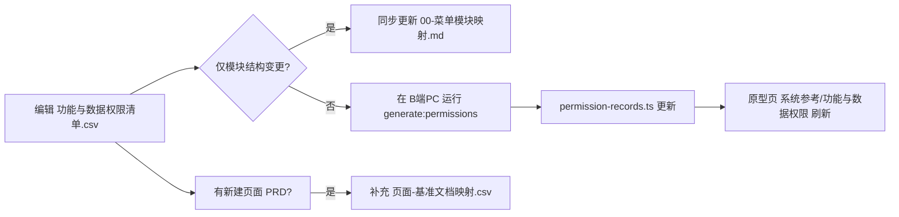

# 功能与数据权限 · 基准清单

> **版本**：V1.0 | **更新日期**：2026-09-03
>
> **定位**：全平台页面级**功能按钮**与**数据可见范围**的基准唯一定义来源，与 [B端PC/00-菜单地图.md](../B端PC/00-菜单地图.md)、[B端H5/00-菜单地图.md](../B端H5/00-菜单地图.md) 菜单目录一一对应。

---

## 一、文件清单

| 文件 | 说明 |
| :--- | :--- |
| [功能与数据权限清单.csv](./功能与数据权限清单.csv) | **主数据源**（205 条：PC 133 条、移动 72 条）；含功能按钮、数据权限、变更记录、菜单模块编码、基准目录 |
| [00-菜单模块映射.md](./00-菜单模块映射.md) | 所属模块 ↔ 顶栏/底栏 ↔ 基准 PRD 目录对照表 |
| [页面-基准文档映射.csv](./页面-基准文档映射.csv) | 页面路径 → 具体 PRD / 字段清单 / 规则规格路径（已建档部分） |
| [scripts/sync-from-draft.mjs](./scripts/sync-from-draft.mjs) | 从草稿 CSV 一次性同步脚本（模块更名 + 扩展列） |

> **菜单迭代记录**已迁至 [B-迭代需求/00-菜单迭代记录/](../../B-迭代需求/00-菜单迭代记录/README.md)（Markdown 真源，非本目录 CSV）。

---

## 二、CSV 字段说明

列名与 PC 原型页 [功能与数据权限](/系统参考/功能与数据权限) 四列一一对应：

| 原型页列 | CSV 列名 | 必填 | 说明 |
| :--- | :--- | :---: | :--- |
| **页面路径** | `端` + `所属模块` + `一级菜单` + `二级菜单` + `Tab` + `旧系统路径` | ✓ | 前四列拼装菜单路径；`旧系统路径` 对应原型「旧系统：…」 |
| **页面功能按钮** | `页面功能按钮` | ✓ | 按钮与操作权限，顿号/逗号分隔 |
| **数据可见范围** | `数据可见范围` | ✓ | 数据可见规则 |
| **变更记录** | `创建时间` + `修定时间` + `变更说明` | — | 日期格式 `YYYY年M月D日`；`变更说明` 含「计划中」→ 待开发，含「版本取消」→ 已取消 |

**菜单索引列（文档维护用，原型不展示）：**

| 列名 | 说明 |
| :--- | :--- |
| `菜单模块编码` | 如 `01-工作中心`，对齐基准目录序号 |
| `顶栏/底栏模块名` | 菜单地图显示名 |
| `基准模块目录` | 如 `B端PC/01-工作中心` |
| `记录状态` | `active` / `planned` / `cancelled` |

> 已移除历史字段：`序号`、`使用端`、`功能说明`，以及 Excel 导出的空列。

---

## 三、维护工作流



1. **日常变更**：直接编辑本目录 [功能与数据权限清单.csv](./功能与数据权限清单.csv)。
2. **同步原型参考页**：
   ```bash
   cd 03-前端原型demo/B端PC
   npm run generate:reference
   ```
   或分别运行 `generate:permissions` / `generate:iterations`。
3. **菜单迭代记录**：编辑 [B-迭代需求/{版本}/00-菜单迭代记录.md](../../B-迭代需求/00-菜单迭代记录/README.md)，再运行 `generate:iterations`。
4. **新增菜单页**：在 [页面-基准文档映射.csv](./页面-基准文档映射.csv) 追加一行，指向对应 `B端PC/` 或 `B端H5/` PRD 目录。
5. **从草稿批量导入**（仅当草稿目录有大批量更新时）：
   ```bash
   node 02-PRD文档/🌟🌟🌟-最新基准版/00-功能与数据权限/scripts/sync-from-draft.mjs
   ```
   同步后请人工 diff 基准 CSV，确认变更后再提交。
   > **继承行**：`端`、`所属模块`、`一级菜单` 留空时自动沿用上一行（Excel 合并单元格写法），不会丢行。

---

## 四、与原型、迭代文档的关系

| 层级 | 路径 | 关系 |
| :--- | :--- | :--- |
| **本目录（基准）** | `00-功能与数据权限/` | 线上已确认页面的按钮与数据权限口径 |
| 菜单地图 | `B端PC/00-菜单地图.md`、`B端H5/00-菜单地图.md` | 导航结构真源；本清单 `所属模块` 必须对齐 |
| 6.2 迭代 RBAC | [00-全局契约与RBAC权限矩阵](../../B-迭代需求/6.2版本（2026.08）/00-全局契约与RBAC权限矩阵.md) | 角色级权限矩阵；本清单为页面级落地 |
| 菜单迭代记录 | [B-迭代需求/00-菜单迭代记录/](../../B-迭代需求/00-菜单迭代记录/README.md) | 各版本菜单/导航变更历史（Markdown 真源） |
| PC 原型参考页 | `03-前端原型demo/B端PC` → `/系统参考/功能与数据权限` | 由 CSV 自动生成，只读展示 |
| PC 原型顶栏 | Header → **迭代记录** | 由 B-迭代需求 Markdown 自动生成 |

---

## 五、统计摘要（2026-09-03）

| 端 | 记录数 | 模块数 |
| :--- | :---: | :---: |
| PC | 133 | 8（当前态）+ 1（6.2目标态） |
| 移动 | 72 | 3（首页 / 工作台 / 业务办理） |
| **合计** | **205** | — |

| 记录状态 | 数量 | 说明 |
| :--- | :---: | :--- |
| active | 173 | 主列表展示 |
| planned | 10 | 待开发规划（含 H5 巡检 3 项） |
| cancelled | 10 | 已取消菜单 |
| 6.2-target | 12 | 6.2 版本目标态菜单，主列表展示并以 `6.2目标` 标识，同时支持聚合查看 |

---

## 六、修订记录

| 日期 | 版本 | 说明 |
| :--- | :---: | :--- |
| 2026-09-03 | V1.5 | 迭代记录真源迁至 B-迭代需求 Markdown（00-菜单迭代记录.md） |
| 2026-09-03 | V1.4 | 迭代记录改为版本化 CSV 真源（已废弃，见 B-迭代需求） |
| 2026-09-03 | V1.3 | 与菜单地图对齐：补 6.2 开锁/预警等级、H5 内部审批/预约/开锁；PC 原型顶栏增加迭代记录 |
| 2026-09-03 | V1.2 | 同步最新 9 条页面 + 5 处字段更新；修复继承行导入逻辑 |
| 2026-09-03 | V1.1 | CSV 列名对齐原型四列；移除功能说明等冗余字段 |
| 2026-09-03 | V1.0 | 自 `00-草稿对话/d-功能:权限清单/` 迁入基准版；PC 模块 `1.首页` 更名为 `1.工作中心` |
