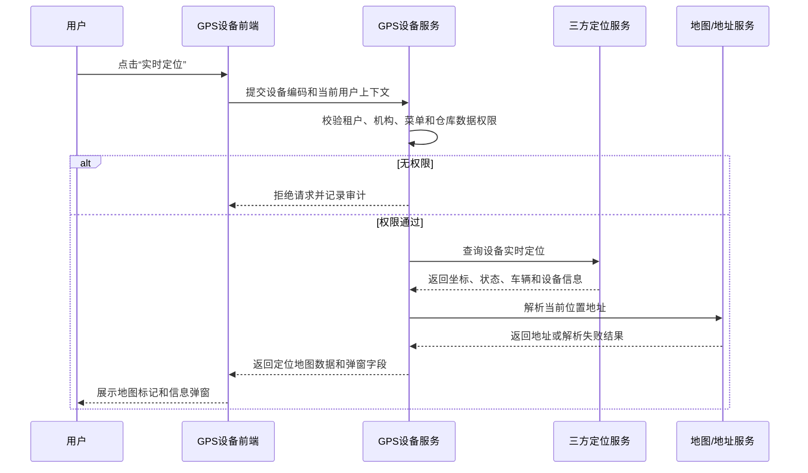
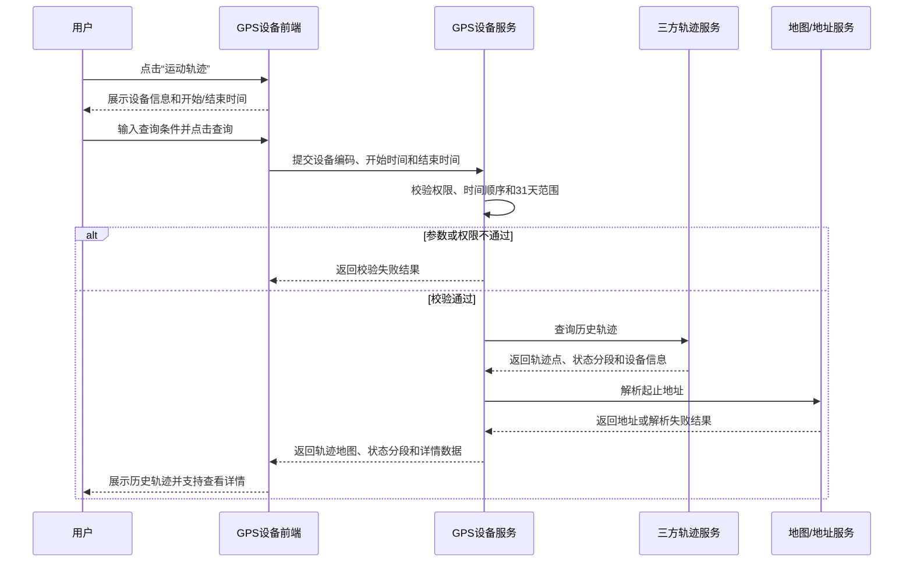
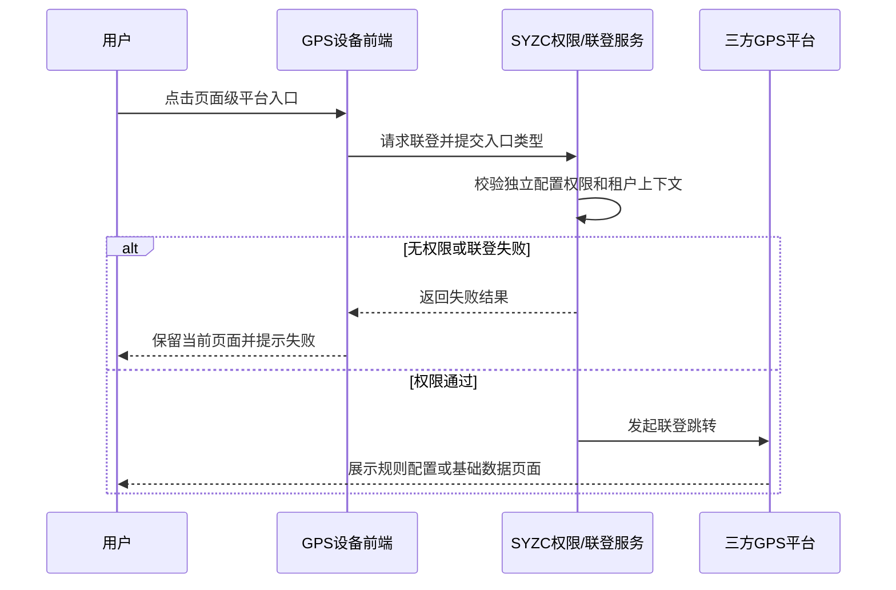

# GPS设备主需求文档

> **版本**：V1.3 | 2026-08-14
> **读者**：研发工程师、测试工程师、产品复核
> **编写依据**：GPS设备字段清单、监控设备主 PRD、物联设备主 PRD及实时定位/历史轨迹页面原型
> **字段基准**：[`GPS设备字段清单.md`](./GPS设备字段清单.md) 是设备主数据和系统字段的唯一基准；实时定位、运动轨迹、移除设备等行操作的输入、查询、展示、返回及特有审计字段以对应操作子清单为准。

## 1. 业务背景

GPS设备是仓储监管场景中的车辆定位设备，负责维护 GPS 设备基础信息、车辆关联信息和仓库绑定关系，并提供实时定位、历史运动轨迹及三方 GPS 平台入口。

GPS设备数据同时被仓储监管、车辆监控、风险识别和业务追溯功能引用。设备编码、车辆信息、定位信息和仓库权限必须保持一致；设备名称或绑定关系变更不得影响历史轨迹和审计追溯。

本菜单不承载审批单据，也不建立独立设备业务状态机。车辆“离线、停车、行驶、静止”等状态是定位数据展示状态，不通过状态按钮驱动业务流转。

## 2. 功能范围

**本期范围**：

- GPS设备列表、组合筛选和字段展示；
- 设备重命名、仓库绑定、实时定位、运动轨迹和移除设备五个行操作；
- 实时定位地图、车辆定位标记和信息弹窗；
- 历史运动轨迹查询、轨迹地图、状态分段和轨迹详情；
- GPS平台规则配置、GPS平台基础数据两个三方平台页面级入口；
- GPS设备查询和操作的数据权限、并发控制、幂等处理和审计记录。

### 2.1 移动端范围（已确认）

移动端支持 GPS 设备列表与筛选、重命名、仓库绑定、移除设备、实时定位和历史轨迹；GPS 平台外部入口和操作审计查询不纳入本次移动端范围。

**不在本期范围**：

- GPS设备接入、注册和三方平台基础档案创建；
- 三方 GPS 平台内部规则配置和基础数据维护逻辑；
- 新增页、编辑页和独立设备详情页；
- 车辆司机档案、车辆主数据和司机绑定关系的维护；
- 地图底图服务、地址解析服务和定位算法内部实现；
- 运动轨迹数据的清洗、纠偏、补点和里程算法；
- GPS设备独立业务状态机和独立审批流程。

## 3. 模块定位

| 项目 | 内容 |
| :--- | :--- |
| 模块层级 | 设备基础数据与车辆定位查询层 |
| 核心职责 | 维护 GPS 设备名称和仓库关系，展示车辆定位信息和历史运动轨迹 |
| 数据来源 | 三方 GPS 平台、系统设备配置、车辆/司机关联数据、用户仓库绑定操作 |
| 上游依赖 | 三方 GPS 设备接入、仓库/库房/分区档案、账号与数据权限、车辆及司机数据 |
| 下游引用 | 仓储监管、车辆监控、风险识别、订单追溯、设备审计及其他定位业务 |
| 业务单据 | 不生成独立业务单据，不建立单据状态机 |

## 4. 页面与字段规则

### 4.1 字段引用

列表字段、筛选字段、字段来源、取值、展示顺序和字段级校验统一以[GPS设备字段清单](./GPS设备字段清单.md)为准；实时定位、运动轨迹和移除设备的操作字段统一以[GPS设备操作字段清单索引](./操作字段清单/操作字段清单索引.md)及其子清单为准。本主 PRD 不重复定义字段属性。

GPS平台规则配置和GPS平台基础数据属于页面级三方平台入口，不纳入当前设备行操作字段子清单。

### 4.2 筛选与数据权限

| 筛选项 | 控件 | 匹配方式 | 规则 |
| :--- | :--- | :--- | :--- |
| 设备名称 | 输入框 | 模糊匹配 | 页面标签为“设备名称”，实际查询“系统内名称” |
| 车辆信息 | 输入框 | 模糊匹配 | 实际查询车辆车牌号等车辆信息 |
| 设备状态 | 下拉选择 | 精确匹配 | 离线、停车、行驶、静止；原型编码为1、2、3、4，具体编码待确认 |
| 仓库 | 下拉选择 | 精确匹配 | 引用字段“绑定仓库”；仅展示登录账号有权限的仓库 |
| 具体位置 | 输入框 | 模糊匹配 | 查询设备在仓库中的安装或布设位置 |

更新时间、设备原名称、设备编码和修改人员不参与列表筛选。分页总条数、每页条数、页码和前往页码属于通用列表组件参数，不作为业务字段。

### 4.3 数据可见范围

| 设备绑定情况 | 可见规则 |
| :--- | :--- |
| 已绑定位置 | 登录用户拥有该位置所属仓库数据权限时可见；无对应仓库权限时不返回设备数据 |
| 未绑定位置 | 当前租户内账号有效且具备 GPS设备菜单查看权限的用户可见；不要求仓库数据权限 |
| 已移除设备 | 有效 GPS设备列表不展示；历史轨迹、业务详情和审计数据按快照规则保留 |

“所有用户可见”仍受租户隔离、账号有效性和菜单功能权限限制，不代表跨租户可见。列表接口和操作接口必须执行服务端数据权限校验，不能只依赖前端隐藏控件。

## 5. 操作功能

### 5.1 操作总览

| 操作 | 入口 | 是否改变设备基础数据 | 是否涉及跨模块或第三方联动 | 规则来源 |
| :--- | :--- | :---: | :---: | :--- |
| 重命名 | 列表“操作”列 | 是 | 否 | 继承[监控设备主 PRD·5.2 重命名](../16-设备管理-监控设备/监控设备主PRD.md#52-重命名) |
| 绑定仓库 | 列表“操作”列 | 是 | 是，仓库权限和有效订单校验 | 继承[监控设备主 PRD·5.3 仓库绑定](../16-设备管理-监控设备/监控设备主PRD.md#53-仓库绑定) |
| 实时定位 | 列表“操作”列 | 否 | 是，三方 GPS 定位数据和地图服务 | 本文档第5.4节 |
| 运动轨迹 | 列表“操作”列 | 否 | 是，三方 GPS 历史轨迹和地图服务 | 本文档第5.5节 |
| 移除设备 | 列表“操作”列 | 是 | 是，订单、规则、通知和仓库绑定 | 继承[监控设备主 PRD·5.7 移除设备](../16-设备管理-监控设备/监控设备主PRD.md#57-移除设备) |

重命名、绑定仓库和移除设备使用与监控设备一致的权限、校验、并发控制、幂等、跨模块联动、异常处理和审计规则。GPS设备不复制或另行改写上述继承规则；监控设备规则发生变更时，本模块同步继承最新版本。

### 5.2 重命名

重命名继承[监控设备主 PRD·5.2 重命名](../16-设备管理-监控设备/监控设备主PRD.md#52-重命名)，本模块执行以下约束：

| 规则项 | 规则 |
| :--- | :--- |
| 字符限制 | 最多50个字，不允许提交空值；特殊字符规则待确认 |
| 默认值 | 首次默认取设备原名称；已人工维护的系统内名称作为当前值 |
| 保存结果 | 更新系统内名称、修改人员和更新时间；三方名称同步不得覆盖人工维护值 |
| 关联条件 | 使用设备编码或设备主键，不得使用列表行号 |
| 失败处理 | 保留原名称，不产生部分更新，并返回明确失败结果 |

### 5.3 绑定仓库

仓库绑定继承[监控设备主 PRD·5.3 仓库绑定](../16-设备管理-监控设备/监控设备主PRD.md#53-仓库绑定)。GPS设备本期不新增独立绑定模型，沿用监控设备的仓库、库房、分区层级校验和有效订单阻断规则。

| 规则项 | 规则 |
| :--- | :--- |
| 绑定数据 | 保存仓库唯一标识及相关位置关系；列表展示仓库名称 |
| 权限校验 | 校验当前账号租户、机构及目标仓库数据权限 |
| 有效订单校验 | 保存前校验设备是否存在申请中、抵/质押中或监管中的有效订单；存在时按继承规则阻止变更 |
| 清空绑定 | 允许清空已有绑定，但仍需执行有效订单校验和并发校验 |
| 保存结果 | 更新绑定关系、修改人员和更新时间；失败不产生部分更新 |

### 5.4 实时定位

#### 5.4.1 页面进入与地图展示

| 规则项 | 规则 |
| :--- | :--- |
| 操作入口 | 从 GPS设备列表行操作点击“实时定位” |
| 数据权限 | 按当前用户租户、机构、GPS设备菜单权限及绑定仓库数据权限校验；无权限数据不得返回 |
| 地图展示 | 展示实时定位地图、车辆当前位置及周边地理信息 |
| 定位标记 | 在地图上标识车辆当前位置，并支持打开对应信息弹窗 |
| 信息弹窗 | 展示当前车辆、司机、当前位置和定位设备详细信息 |
| 刷新机制 | 当前原型未确认自动刷新频率、手动刷新入口和定位数据轮询机制，待研发确认 |
| 无定位数据 | 页面保留地图和设备信息区域，提示暂无可用定位信息；不得展示其他设备位置 |

#### 5.4.2 信息弹窗展示规则

实时定位弹窗的设备上下文、车辆信息、定位返回、地图标记和页面状态字段以[实时定位字段清单](./操作字段清单/03实时定位字段清单.md)为准；本主 PRD 仅定义权限、查询时机、地图交互和异常处理。

#### 5.4.3 状态持续时长

- 持续时长统一按“天-小时-分钟”展示。
- 超过60分钟换算为1小时，超过24小时换算为1天。
- 当天数和小时数均为0时不展示0天和0小时；例如“0天0小时12分钟”展示为“12分钟”。
- 状态名称和持续时长由定位数据服务返回或由服务端按状态起始时间计算，具体实现方式待确认。

### 5.5 运动轨迹

#### 5.5.1 数据权限与查询条件

| 规则项 | 规则 |
| :--- | :--- |
| 操作入口 | 从 GPS设备列表行操作点击“运动轨迹” |
| 数据范围 | 仅展示当前用户具有仓库权限的数据 |
| 设备信息 | 有车牌时展示系统内名称和车牌信息；无车牌时展示设备名称并标识“未绑定” |
| 单设备进入 | 从单个设备行操作进入时，原型支持默认填充设备信息且不可修改；是否隐藏设备选择控件待确认 |
| 开始时间 | 查询历史轨迹起始时间，格式为 `YYYY-MM-DD HH:mm:ss`；原型默认不填充日期 |
| 结束时间 | 查询历史轨迹结束时间，格式为 `YYYY-MM-DD HH:mm:ss`；原型默认不填充日期 |
| 查询范围 | 开始时间至结束时间的日期范围必须小于等于31天 |
| 超限提示 | 超出范围提示：“暂时只支持查询31天内的数据” |
| 查询按钮 | 点击后加载指定时间段内的历史轨迹；查询期间应防止重复提交 |

开始时间晚于结束时间、时间为空、接口超时、无轨迹数据和查询失败时，必须分别给出明确处理结果；具体提示文案待确认。

#### 5.5.2 地图与状态分段

地图、状态分段卡片、轨迹详情和位置展示字段以[运动轨迹字段清单](./操作字段清单/04运动轨迹字段清单.md)为准。业务规则为：按车辆状态分段展示轨迹，状态分段提供详情入口；地址解析应避免一次性解析过多点，缓存和性能阈值由技术方案确认。

#### 5.5.3 轨迹详情字段

运动轨迹查询条件、状态分段、轨迹详情、地图展示和第三方返回字段以[运动轨迹字段清单](./操作字段清单/04运动轨迹字段清单.md)为准；本主 PRD 仅定义查询范围、权限、流程和异常处理。

#### 5.5.4 设备状态枚举与时长

- 原型当前展示的设备状态为：`1离线`、`2停车`、`3行驶`、`4静止`；状态编码、状态判定规则和状态优先级待研发确认。
- 状态持续时长统一按“天-小时-分钟”展示；超过60分钟换算为1小时，超过24小时换算为1天。
- 当天数和小时数均为0时不展示0天和0小时，例如“0天0小时12分钟”展示为“12分钟”。
- 未发生状态或无法计算持续时长时展示“--”。

### 5.6 移除设备

移除设备继承[监控设备主 PRD·5.7 移除设备](../16-设备管理-监控设备/监控设备主PRD.md#57-移除设备)。GPS设备执行移除时，沿用监控设备的确认弹窗、说明必填、订单/规则/通知/仓库解绑、失败回滚、历史快照保留和定时重新加入规则。

GPS设备移除成功后不再出现在 GPS设备有效列表；三方平台轮询发现设备仍存在时，按原设备 ID重新加入的处理规则与监控设备保持一致。移除设备不得使用列表序号作为请求条件，必须使用设备编码或设备主键。

### 5.7 GPS平台外部入口

| 页面级按钮 | 功能说明 | 展示权限 | 点击行为 | 规则边界 |
| :--- | :--- | :--- | :--- | :--- |
| GPS平台规则配置 | 进入三方 GPS 平台规则配置功能 | 由独立配置权限决定是否展示 | 通过联登跳转三方平台对应页面 | 三方平台内部字段、校验、保存和业务规则不在本模块定义 |
| GPS平台基础数据 | 进入三方 GPS 平台基础数据功能 | 由独立配置权限决定是否展示 | 通过联登跳转三方平台对应页面 | 三方平台内部字段、维护和同步规则不在本模块定义 |

两个页面级入口的展示权限相互独立，不能用 GPS设备列表查看权限或行操作权限直接替代。联登失败、会话无效或三方平台不可用时，应保留当前页面并提示跳转失败；具体提示文案、联登协议和平台地址待确认。

## 6. 权限、并发与审计

### 6.1 权限规则

1. 所有列表查询和操作接口必须同时校验菜单功能权限、操作权限、租户权限及绑定位置所属仓库数据权限；未绑定位置设备不要求仓库数据权限。
2. 已绑定位置设备按所属仓库数据权限控制；未绑定位置设备按当前租户、账号有效性和 GPS设备菜单查看权限控制。
3. 实时定位和运动轨迹必须在服务端按当前用户权限过滤设备和定位数据，前端地图不得接收无权设备数据后再隐藏。
4. GPS平台规则配置和GPS平台基础数据分别校验对应的独立配置权限；按钮隐藏仅用于交互优化，后端联登接口必须再次校验。
5. 手机号码等敏感信息按角色脱敏；无权限用户不得通过接口、地图弹窗或历史轨迹详情绕过脱敏规则。

### 6.2 操作权限矩阵

| 操作 | GPS设备菜单查看权限 | 对应操作权限 | 仓库数据权限 | 结果 |
| :--- | :---: | :---: | :--- | :--- |
| 重命名 | 是 | 是 | 按设备绑定规则 | 可操作 |
| 绑定仓库 | 是 | 是 | 目标仓库有权限 | 可操作 |
| 实时定位 | 是 | 是 | 按设备绑定规则 | 可查看有权限设备定位 |
| 运动轨迹 | 是 | 是 | 按设备绑定规则 | 可查询有权限设备轨迹 |
| 移除设备 | 是 | 是 | 按设备绑定规则 | 可操作 |
| GPS平台规则配置 | 是 | 独立配置权限 | 按平台入口权限 | 可展示并联登 |
| GPS平台基础数据 | 是 | 独立配置权限 | 按平台入口权限 | 可展示并联登 |

### 6.3 并发与幂等规则

- 重命名、绑定仓库和移除设备继承监控设备主 PRD的版本校验、锁或等效并发控制规则。
- 所有 GPS设备维护请求使用设备编码作为幂等关联键；禁止使用列表序号、设备名称或车牌号作为唯一请求条件。
- 实时定位和运动轨迹查询不修改设备基础数据，但必须校验设备编码、租户、机构和数据权限，防止查询上下文串设备。
- 同一设备同时发起多个移除请求时，仅首个有效请求执行；后续请求返回设备已移除，不重复解绑和写入成功审计。
- 页面重复点击、弱网重试和接口超时不得产生重复绑定、重复移除或重复审计结果。

### 6.4 审计规则

以下操作必须记录操作人、所属机构、操作时间、设备编码、请求标识、操作前后数据、操作结果和失败原因：

- 查询 GPS设备列表；
- 重命名；
- 绑定、解绑或清空仓库关系；
- 实时定位查询、定位数据获取和定位接口失败；
- 运动轨迹查询、轨迹详情查询和轨迹接口失败；
- 定位状态变更、状态同步异常及状态判定结果异常；
- 移除设备及其跨模块解绑结果；
- GPS平台规则配置、GPS平台基础数据的联登请求、权限校验结果和跳转结果。

实时定位和运动轨迹审计不得记录不必要的完整手机号等敏感信息；需要追溯时记录脱敏值、数据版本或安全引用标识。

## 7. 数据溯源与审计字段

### 7.1 数据溯源

| 数据 | 来源 | 处理规则 |
| :--- | :--- | :--- |
| 设备原名称、设备编码 | 设备接入/三方 GPS 平台 | 设备原名称使用三方返回值；设备编码作为设备维护和跨模块关联键 |
| 系统内名称 | 设备管理配置/系统带出/用户维护 | 首次继承设备原名称；人工重命名后保存当前值，三方名称变化不得覆盖 |
| 车辆信息 | 三方 GPS 平台/车辆关联数据 | 当前明确展示车牌号；车辆与司机关联规则待研发确认 |
| 绑定仓库、具体位置 | 仓库档案和用户绑定操作 | 保存仓库唯一标识及位置关系，按仓库数据权限返回 |
| 实时定位 | 三方 GPS 定位数据服务 | 页面只读展示车辆位置、状态、司机和设备信息；定位服务原始状态按接口字段映射 |
| 历史运动轨迹 | 三方 GPS 历史轨迹服务 | 按设备编码和时间范围查询；页面展示轨迹和详情，不修改原始轨迹 |
| 地址信息 | 三方地址解析或地图服务 | 展示街道门牌级地址；解析失败、性能限制和缓存规则待确认 |

### 7.2 审计要求

审计日志至少包含：操作人、角色、所属租户、所属机构、操作时间、客户端网络地址、请求标识、设备编码、操作前后数据版本、操作结果和失败原因。

涉及移除设备时，额外记录订单解绑、规则解绑、通知解绑、仓库解绑、风险状态处理和三方平台处理结果。涉及外部平台联登时，记录权限校验结果、联登请求标识、跳转结果和失败原因，不记录第三方平台会话密钥。

## 8. 边界与异常处理

### 8.1 查询条件校验

| 场景 | 处理规则 |
| :--- | :--- |
| 开始时间晚于结束时间 | 阻止查询并提示时间范围无效 |
| 查询范围超过31天 | 阻止查询并提示：“暂时只支持查询31天内的数据” |
| 查询时间为空 | 按原型默认不填充日期；是否允许无日期直接查询待确认 |
| 无轨迹数据 | 地图展示空状态，列表展示无轨迹数据，不使用其他设备数据填充 |
| 查询接口超时 | 保留当前筛选条件，提示查询失败并允许用户重新查询 |
| 重复查询 | 前端禁用重复提交，后端按请求上下文保证结果不串设备 |

### 8.2 实时定位与地图服务

- 三方定位接口必须设置超时、请求标识和设备编码校验；发生鉴权失败、超时或数据格式错误时，保留页面结构并提示定位数据获取失败。
- 三方返回设备编码与当前请求设备编码不一致时，丢弃结果并记录异常日志。
- 当前定位无坐标、地址解析失败或更新时间为空时，不得展示过期设备位置冒充当前定位；具体兜底文案待确认。
- 地图服务异常时，设备弹窗中已返回的基础定位字段可按页面降级展示，地图区域提示地图加载失败。

### 8.3 历史轨迹一致性

- 轨迹查询必须使用设备编码和时间范围，禁止使用列表序号、车牌号或设备名称作为唯一查询条件。
- 轨迹分段、状态持续时长、开始地址、结束地址和总里程必须来自同一查询结果版本，不得跨请求拼接不同设备数据。
- 地址解析失败不得阻断轨迹主线展示；详情可展示原始坐标或待解析状态，具体方案待确认。
- 轨迹查询只读，不修改设备基础信息、车辆信息、仓库绑定和历史轨迹原始数据。

### 8.4 第三方平台联登

- 联登请求必须携带当前用户、租户、机构和独立配置权限上下文，禁止以前端按钮可见状态代替后端授权。
- 联登失败、会话过期、回调失败或三方平台不可用时，不离开当前 GPS设备页面，并提示跳转失败。
- 联登接口不得返回或写入第三方平台会话密钥到前端持久化存储；具体安全协议待研发确认。

## 9. 操作时序

### 9.1 实时定位

### 9.2 运动轨迹

### 9.3 三方平台联登

---

## 4. 功能清单

> 功能能力矩阵由原《GPS设备功能清单》合并；规则细节见《GPS设备业务规则规格》。

## 一、功能清单矩阵

| 功能编号 | 功能名称 | 适用角色 | PC端能力 | 移动端能力 | 关键控制与规则 |
| :--- | :--- | :--- | :--- | :--- | :--- |
| P-01 | GPS设备列表与筛选 | 设备管理员、监管人员 | 设备、车辆、状态、仓库筛选 | 查看列表与筛选 | 按仓库和机构数据权限返回 |
| P-02 | 设备名称和仓库维护 | 设备管理员 | 重命名、绑定仓库、位置维护 | 重命名、仓库绑定 | 继承设备通用并发和审计规则 |
| P-03 | 实时定位 | 监管、风控 | 地图、车辆标记、信息弹窗 | 实时定位 | 定位设备、车辆和司机信息脱敏展示 |
| P-04 | 运动轨迹 | 监管、审计 | 时间范围查询、轨迹地图、分段详情 | 历史轨迹 | 查询范围不超过31天 |
| P-05 | GPS平台外部入口 | 配置管理员 | 规则配置、基础数据联登 | 未纳入本次移动端范围 | 入口权限独立于设备列表权限 |
| P-06 | 移除设备 | 设备管理员 | 移除确认和历史快照 | 移除设备 | 失败保留原状态和关联 |
| P-07 | 操作审计 | 审计、管理员 | 查询维护、定位和跳转记录 | 未纳入本次移动端范围 | 记录请求上下文和第三方结果 |

## 二、功能边界

- GPS平台内部规则配置和基础数据字段由第三方平台维护，SYZC只维护入口、权限和跳转结果。
- 移动端已确认支持：GPS设备列表与筛选、重命名、仓库绑定、移除设备、实时定位和历史轨迹；GPS平台外部入口和操作审计查询不纳入本次移动端范围。
- 实时定位和运动轨迹字段分别维护，不合并为一个“定位字段清单”。
- 行操作字段见[操作字段清单索引](./操作字段清单/操作字段清单索引.md)。

## 11. 验收重点

| 编号 | 验收项 |
| :--- | :--- |
| A01 | 列表字段及顺序以《GPS设备字段清单》为准 |
| A02 | “设备名称”仅查询系统内名称；设备原名称变化不得覆盖人工维护的系统内名称 |
| A03 | GPS设备不定义绑定状态字段，也不提供绑定状态筛选项；仓库筛选使用绑定仓库唯一标识 |
| A04 | 更新时间在字段清单中标记为不可筛选，车辆信息和具体位置支持模糊匹配，设备状态支持下拉精确筛选 |
| A05 | 已绑定位置设备按所属仓库数据权限可见；未绑定位置设备按租户、账号有效性和菜单权限可见 |
| A06 | 行操作仅包含重命名、绑定仓库、实时定位、运动轨迹和移除设备 |
| A07 | 重命名、绑定仓库和移除设备完整继承监控设备对应规则，不产生独立分叉逻辑 |
| A08 | 实时定位展示地图、车辆位置、状态、司机、车牌、当前位置、更新时间和定位设备信息 |
| A09 | 实时定位无权限或设备编码不匹配时不得返回或展示其他设备定位数据 |
| A10 | 运动轨迹仅展示当前用户有仓库权限的数据，查询范围不超过31天 |
| A11 | 运动轨迹按状态分段展示，支持查看详情；状态持续时长按天、小时、分钟换算 |
| A12 | 状态持续时长无值时展示“--”；当天数和小时数均为0时不展示0天和0小时 |
| A13 | 地址解析失败不阻断轨迹主线展示；状态分段列表不展示位置，轨迹详情展示起止地址 |
| A14 | GPS平台规则配置和GPS平台基础数据分别由独立配置权限控制展示，并通过联登跳转三方平台 |
| A15 | 三方定位、轨迹、地图和联登失败时有明确提示，不产生错误的设备基础数据变更 |
| A16 | 查询、重命名、绑定、解绑、移除、定位、轨迹和联登失败均记录审计日志 |
| A17 | 所有维护请求使用设备编码或设备主键，不使用列表序号作为请求关联条件 |
| A18 | 设备移除成功后有效列表不展示，历史轨迹和审计数据按快照规则保留 |

## 12. 三方接口待确认事项

| 编号 | 待确认内容 | 责任人/角色 | 确认时点 | 验收依据 |
| :--- | :--- | :--- | :--- | :--- |
| 1 | 设备编码生成方、编码格式、长度和接口字段编码 | GPS平台对接研发 | 接口评审前 | 编码样例、唯一性和幂等关联规则明确 |
| 2 | 车辆信息结构、车牌号格式、车辆与司机关联及手机号字段 | GPS平台对接研发、车辆数据负责人、安全负责人 | 接口评审前 | 车辆、司机和脱敏样例可供联调验收 |
| 3 | 状态枚举、编码、判定来源、优先级、自动刷新频率和手动刷新规则 | GPS平台对接研发、前端负责人 | 原型评审和接口联调前 | 列表、实时定位、轨迹状态和刷新请求行为一致 |
| 4 | 地图底图、坐标系、地址解析服务、失败降级和性能阈值 | GPS平台对接研发、地图服务负责人 | 技术方案评审前 | 地图不可用、地址解析失败和大数据量加载有降级方案 |
| 5 | 历史轨迹接口、轨迹点结构、状态分段算法和轨迹点清洗规则 | GPS平台对接研发 | 历史轨迹接口联调前 | 31天查询、轨迹点、分段和空数据响应结构明确 |
| 6 | 里程单位、精度、计算责任方和异常值处理 | GPS平台对接研发、车辆数据负责人 | 历史轨迹接口联调前 | 总里程样例、单位精度及缺失/异常值处理可验收 |
| 7 | GPS平台联登协议、回调方式、平台地址、会话有效期和异常提示文案 | GPS平台对接研发、安全负责人 | 联登联调前 | 联登成功、权限不足、会话过期、回调失败和平台不可用均有测试用例 |
| 8 | 设备序号是否为独立持久化字段及其生成规则 | 设备管理研发 | 技术设计评审前 | 明确序号仅为列表展示还是持久化字段 |

## 修订记录

| 日期 | 版本 | 变更内容 | 影响范围 |
| :--- | :--- | :--- | :--- |
| 2026-08-20 | — | 合并原《GPS设备功能清单》至本文件 第4章 功能清单 |
| 2026-08-07 | V1.0 | 根据 GPS设备字段清单、监控设备和物联设备主 PRD及实时定位/历史轨迹原型，新增 GPS设备主需求文档 | GPS设备列表、行操作、实时定位、运动轨迹、三方平台入口、权限、审计和验收规则 |
| 2026-08-07 | V1.1 | 新增设备状态下拉筛选，明确车辆信息和具体位置支持模糊匹配 | GPS设备筛选区、设备状态字段和验收规则 |
| 2026-08-14 | V1.2 | 收口主数据与操作字段职责；将定位弹窗、轨迹详情和返回字段统一归档到操作子清单，并补充待确认事项责任人和确认时点 | 字段引用、实时定位、运动轨迹和待确认事项 |
| 2026-08-14 | V1.3 | 将三方回传的状态、司机、地图、轨迹、里程和联登事项集中列为责任人及确认时点清单；确认移动端支持范围 | 三方接口待确认项和移动端范围 |
