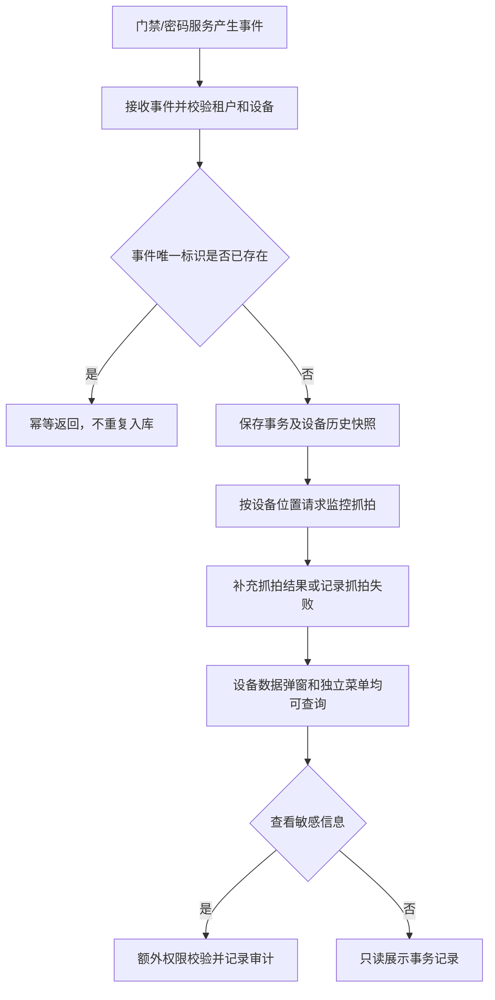

# 门禁事务业务规则规格

> **文档定位**：门禁事务状态机、动作约束、校验规则、权限与计算规则的唯一定义来源。主 PRD、字段清单只引用本文件规则 ID，不重复定义规则本体。

> **文档定位**：门禁事务记录的事件归集、展示、权限、抓拍关联和审计规则唯一来源。
> **参考文档**：[门禁事务主PRD](./门禁事务主PRD.md)、[门禁事务字段清单](./门禁事务字段清单.md)、[门禁事务业务规则规格](门禁事务业务规则规格.md)
> **版本**：V1.0 | **更新时间**：2026-08-14

## 一、对象与数据来源

| 项目 | 规则 |
| :--- | :--- |
| 对象性质 | 独立历史记录对象，一台设备对应多条事务记录，不覆盖设备主数据 |
| 数据来源 | 门禁设备事件上报、密码获取记录、人脸授权下发记录和监控抓拍结果 |
| 关联主键 | 设备编码、事件时间、事件唯一标识（幂等键）；不得使用列表序号 |
| 展示入口 | 门禁设备“设备数据”弹窗和门禁事务记录独立菜单 |

## 二、事务展示规则

1. 挂锁门禁和人脸门禁按设备类型展示不同事务类型，事务名称和说明由事件类型规则生成。
2. 开锁事件如需关联密码获取操作人，按设备、时间和密码服务记录执行动态追溯；无法匹配时展示未匹配状态。
3. 事务发生时，按设备绑定位置关联监控抓拍；抓拍失败不阻断事务记录入库。
4. 已移除设备的历史事务继续展示设备快照、历史位置和原始事件信息。

## 三、权限与审计

- 列表和详情同时校验租户、机构、仓库和设备数据权限。
- 抓拍图、大图和敏感人员信息查看需单独权限并记录审计。
- 事务记录不可被设备删除、仓库解绑或设备重入覆盖；更正只能通过来源系统产生新的更正记录。

---

## 业务流程与联动

> 以下内容由原《门禁事务业务流程》合并，与上文规则 ID 配合阅读；重复的状态机定义以上文为准。

> **版本**：V1.0 | **更新时间**：2026-08-14
> **适用模块**：门禁事件接入、事务记录生成、设备上下文查看和独立菜单查询

## 一、流程说明

1. 门禁设备或密码服务产生事件后，系统按事件唯一标识执行幂等接入。
2. 系统保存设备、类型、时间、人员、说明和原始事件快照，并按设备位置尝试关联监控抓拍。
3. 用户从门禁设备“设备数据”进入时，系统携带设备编码只读查询；从独立菜单进入时，系统支持全量筛选。
4. 用户查看抓拍图或敏感信息时，系统进行额外权限校验并记录审计。

## 二、业务流程图

## 三、异常处理

| 异常场景 | 处理规则 |
| :--- | :--- |
| 重复事件 | 按事件唯一标识幂等，不生成重复记录 |
| 设备已移除 | 仍允许历史事件入库，使用历史快照展示 |
| 抓拍失败 | 事务记录保留，抓拍字段展示无图或失败状态 |
| 事件字段缺失 | 按字段规则保存可用信息，缺失字段展示“-”，记录异常 |
| 无数据权限 | 不返回记录和图片，不通过设备上下文绕过权限 |

## 修订记录

| 日期 | 版本 | 变更 |
| :--- | :---: | :--- |
| 2026-08-20 | — | 合并原《门禁事务业务流程》至本文件「业务流程与联动」章节 |
