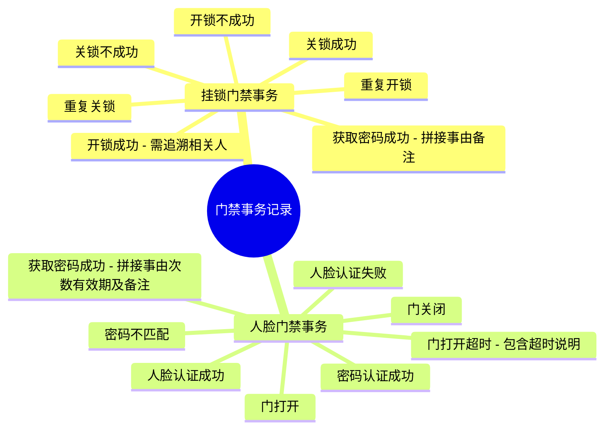
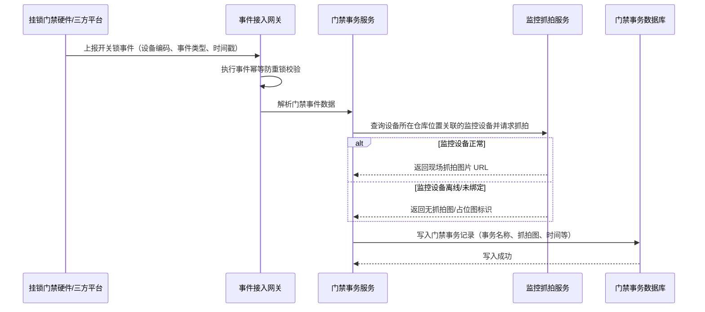
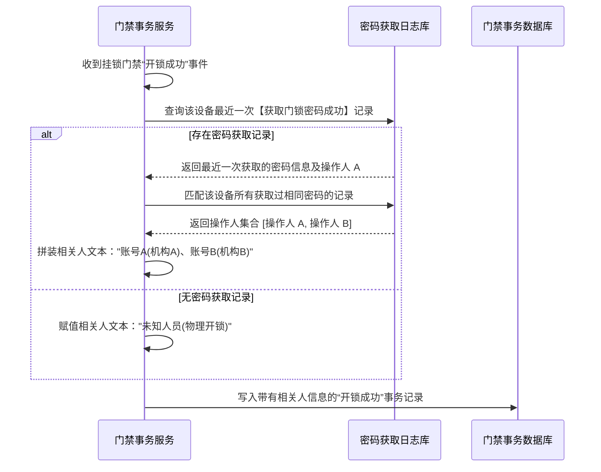
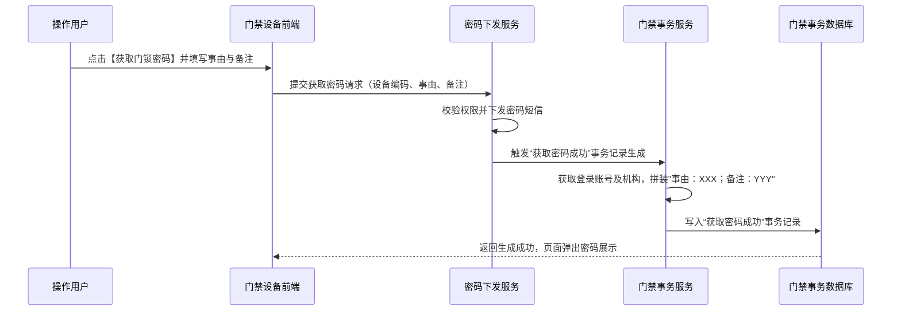

# 门禁事务主需求文档

> **版本**：V1.5 | 2026-08-14
> **读者**：研发工程师、测试工程师、产品复核、风控审计员
> **编写依据**：门禁事务字段清单、门禁设备主 PRD、监控设备主 PRD、物联设备主 PRD及 GPS 设备主 PRD
> **字段职责**：门禁事务字段、枚举和字段规则以[`门禁事务字段清单.md`](./门禁事务字段清单.md)为准；门禁设备主数据字段引用[门禁设备字段清单](../17-设备管理-门禁设备/门禁设备字段清单.md)。本主 PRD 只维护事务归集、查询流程、权限、审计和异常规则。

---

## 1. 业务背景

在供应链金融大宗商品仓储监管体系中，物理出入控制与货权质押安全是风控防御的第一道屏障。门禁设备（包括挂锁门禁与人脸门禁）作为出入控制的关键物联网节点，其每一次出入开闭、身份认证、临时密码下发及物理动作上报，均直接关乎监管仓库内质押货物的物理安全与权属合规。

**门禁事务记录**模块作为 SYZC 系统“货-仓-金”三位一体风控数据链的重要闭环组件，专门用于集中接收、记录、存储与展示全网门禁设备产生的物理出入与认证事件日志。该模块打通第三方门禁接入平台、门禁密码下发服务与仓库现场监控视频抓拍联动，实现“一次开锁/认证，全路径溯源留痕”。

本模块提供两个入口：门禁设备列表行操作“设备数据”弹窗中的“事务记录”Tab，以及独立菜单【设备管理 - 门禁事务记录】。两者共用同一套事务数据、字段枚举、权限和审计规则；前者按当前设备上下文只读展示，后者提供全量筛选检索。本模块不承载任何审批单据，亦不建立独立业务状态机或单据流转流程。

---

## 2. 功能范围

**本期范围**：

- **列表与检索**：门禁事务记录列表的分页展示、按发生时间默认倒序排列及字段全量呈现；
- **组合筛选**：支持设备名称（输入框模糊匹配系统内名称）、设备类型（下拉选择精确匹配）、仓库（下拉选择精确匹配）、事务名称（输入框模糊匹配）及时间（日期时间范围选择器）的组合查询；
- **15 种标准事务识别与分类**：
  - **挂锁门禁事务（7 种）**：开锁成功、关锁成功、开锁不成功、关锁不成功、重复开锁、重复关锁、获取密码成功；
  - **人脸门禁事务（8 种）**：人脸认证成功、人脸认证失败、门打开、门关闭、门打开超时、密码不匹配、密码认证成功、获取密码成功；
- **“开锁成功”相关人动态追溯算法**：挂锁门禁开锁成功事件自动追溯该设备在系统内最近一次“获取密码成功”记录的操作人员，并匹配使用同一密码的其他获取密码记录操作人员，统一汇总展示为“相关人”；
- **密码事务说明自动拼接**：挂锁门禁及人脸门禁【获取密码成功】事件生成后，系统自动将密码下发弹窗中填写的“事由”、“备注”（人脸门禁包含配置的开锁次数及有效期区间）自动拼接写入“说明”字段；挂锁门禁拼接格式为 `事由：XXX；备注：YYY`，人脸门禁拼接格式为 `事由：XXX；开锁次数：N次；有效期：开始时间~结束时间；备注：YYY`；
- **监控抓拍图联动与预览**：挂锁门禁全系事件及人脸门禁事件收到后，自动通知设备安装位置关联的监控设备抓拍现场图像并绑定展示，支持列表缩略图点击唤起大图预览；
- **数据权限与审计**：基于租户、机构及仓库数据权限的隔离管控，全路径记录事务日志检索、筛选及大图预览的操作审计。

### 2.1 移动端范围（已确认）

移动端支持门禁事务记录查看，包括独立菜单列表筛选、设备上下文记录、事务详情和抓拍图查看；移动端不提供事务处理、补录或修改。

**不在本期范围**：

- 门禁事务记录的手工新增、修改、手动补录或手动删除操作（本模块保持 100% 只读日志属性）；
- 第三方门禁硬件底层固件通信、蓝牙/NFC 物理开锁协议及人脸特征算法实现；
- 人脸门禁授权配置与临时开锁密码生成下发流程（由 [门禁设备主 PRD](../17-设备管理-门禁设备/门禁设备主PRD.md) 与 [人脸配置主 PRD](../21-设备管理-人脸配置/人脸配置主PRD.md) 承载）；
- 门禁预警（如门打开超时、重复开锁异常）的在线处置、解除、核销及处置工单流程（由风险预警模块承载）；
- 监控摄像头硬件本身的直播、回放及图像锚点算法任务配置（由 [监控设备主 PRD](../16-设备管理-监控设备/监控设备主PRD.md) 承载）。

---

## 3. 模块定位

### 3.1 系统位置

| 项目 | 内容 |
| :--- | :--- |
| **模块层级** | 监管数据日志与风控审计层 |
| **核心职责** | 集中存储并只读展示门禁开闭锁、身份认证、临时密码获取及异常开门等全量门禁事务日志，提供防篡改追溯与监控抓拍图复核 |
| **数据来源** | 第三方门禁平台事件上报接口、SYZC 门禁密码下发服务（挂锁/人脸）、系统监控抓拍服务 |
| **上游依赖** | 第三方设备接入平台、门禁设备档案、仓库/库房/分区档案、监控设备抓拍服务、账号与 RBAC 数据权限 |
| **下游引用** | 仓储物理出入追溯、质押物安全审计、押品异动风控预警、订单历史履约复核、出入库防盗稽核 |
| **业务单据** | 不生成独立业务单据，不建立单据状态机，无单据审批流程 |

### 3.2 设备分类与事务类型对照

门禁设备分为**挂锁门禁**与**人脸门禁**两类设备，由于物理形态与控制逻辑不同，产生的事务记录类型存在明确差异：

### 3.3 事务记录持久化与快照机制

1. **不可篡改日志**：门禁事务记录一经写入，任何角色（包括系统管理员）均不得修改或删除；
2. **设备快照保留**：若某门禁设备从系统物理移除（或解除仓库绑定），该设备历史上产生的门禁事务记录继续永久保留在事务数据库中；查询时继承事件发生时的设备原名称、系统内名称及仓库位置快照，确保历史审计完整性；
3. **接口幂等去重**：第三方门禁平台重复上报同一事件时，系统按字段清单定义的“事件唯一标识（幂等键）”执行去重；优先使用第三方事件 ID，无第三方事件 ID 时使用服务端生成的稳定哈希，并通过服务端唯一约束保证不产生重复事务行。

---

## 4. 页面与字段规则

### 4.1 列表字段与排序

列表字段及展示顺序完全继承自 [`门禁事务字段清单.md`](./门禁事务字段清单.md)，本主 PRD 不重复列出字段清单。

**排序规则**：列表默认按照事务发生/上报的时间**倒序排列**（即最新的门禁事务展示在列表最上方，时间格式为 `YYYY-MM-DD HH:mm:ss`）。

### 4.2 字段取值与计算规则

事务字段、事件唯一标识、快照字段、筛选字段、15种事务枚举及展示字段统一以[门禁事务字段清单](./门禁事务字段清单.md)为准；本主 PRD 只定义事件归集、追溯计算、权限、流程和异常处理，不重复定义字段属性。

### 4.3 筛选规则

| 筛选项 | 控件类型 | 匹配方式 | 检索字段与规则 |
| :--- | :--- | :--- | :--- |
| **设备名称** | 文本输入框 | 模糊匹配 | 页面筛选标签为“设备名称”，实际查询“系统内名称”字段；模糊匹配输入内容 |
| **设备类型** | 下拉单选框 | 精确匹配 | 下拉枚举选项：`挂锁门禁`、`人脸门禁` |
| **仓库** | 下拉单选框 | 精确匹配 | 引用字段“绑定仓库”；下拉选项按当前登录账号具备数据权限的仓库过滤 |
| **事务名称** | 文本输入框 | 模糊匹配 | 页面筛选标签为“事务名称”，支持输入关键字（如“开锁”、“密码”、“人脸”等）模糊匹配 15 种事务类型 |
| **时间** | 日期时间范围选择器 | 范围匹配 | 选择 `[开始时间 ~ 结束时间]`，按事务“时间”字段检索指定区间内的记录 |

### 4.4 数据可见范围与权限隔离

| 场景 | 可见与隔离规则 |
| :--- | :--- |
| **已绑定位置设备事务** | 仅对拥有该设备所属仓库数据权限的登录账号可见；跨仓库或无权限仓库的事务记录严禁返回 |
| **未绑定位置设备事务** | 对当前租户内账号有效且具备【门禁事务记录】菜单查看权限的用户可见；不要求仓库数据权限 |
| **已移除/已解绑设备事务** | 历史事务记录永久保留；按事件发生时的权限快照和仓库数据权限校验后展示 |

---

## 5. 事务类型与计算展示规则

> 门禁事务记录涵盖 15 种标准事务类型。列表默认按**时间倒序**展示。各事务类型的详细计算逻辑、人员推导与抓拍联动规则如下：

### 5.1 挂锁门禁事务类型（7 种）

#### 1. 开锁成功
- **时间**：收到第三方挂锁设备上报开锁成功事件的设备发生时间。
- **人员（相关人动态追溯算法）**：
  1. 系统接收到该设备的“开锁成功”事件后，反向查询系统内该挂锁设备**最近一次“获取门锁密码成功”**的记录；
  2. 获取该条记录对应的门锁密码明文/校验码及操作人员账号；
  3. 进一步以该密码为条件，匹配该设备所有在有效期内获取过**同一密码**的“获取门锁密码成功”记录的操作人员；
  4. 将匹配到的所有操作人员合并去重后作为本次开锁成功事件的“相关人”展示。格式：`操作人员账号名称（账号归属机构名称）`，例如 `张三（卡皮银行）、李四（森云科技）`。
- **设备抓拍图**：事件收到后，自动通知该设备所在仓库位置关联的所有监控摄像头抓拍现场图像，并绑定至本次事件展示。
- **说明**：展示“-”或第三方上报的开锁物理状态描述。

#### 2. 关锁成功
- **时间**：关锁成功事件上报发生时间。
- **人员**：展示 `-`（关锁属于现场物理闭锁动作，无系统操作账号参与）。
- **设备抓拍图**：自动触发所在仓库位置关联监控设备抓拍现场图像并展示。
- **说明**：展示 `-`。

#### 3. 开锁不成功
- **时间**：开锁不成功事件上报发生时间。
- **人员**：展示 `-`。
- **设备抓拍图**：自动触发所在仓库位置关联监控设备抓拍现场图像并展示。
- **说明**：展示开锁失败原因描述（如 `密码错误`、`机械故障` 或默认 `-`）。

#### 4. 关锁不成功
- **时间**：关锁不成功事件上报发生时间。
- **人员**：展示 `-`。
- **设备抓拍图**：自动触发所在仓库位置关联监控设备抓拍现场图像并展示。
- **说明**：展示关锁失败原因描述（如 `锁舌未卡入位` 或默认 `-`）。

#### 5. 重复开锁
- **时间**：重复开锁事件上报发生时间。
- **人员**：展示 `-`。
- **设备抓拍图**：自动触发所在仓库位置关联监控设备抓拍现场图像并展示。
- **说明**：展示 `重复开锁事件上报`。

#### 6. 重复关锁
- **时间**：重复关锁事件上报发生时间。
- **人员**：展示 `-`。
- **设备抓拍图**：自动触发所在仓库位置关联监控设备抓拍现场图像并展示。
- **说明**：展示 `重复关锁事件上报`。

#### 7. 获取密码成功
- **时间**：挂锁门禁【获取门锁密码】操作成功时间。
- **人员（操作人）**：执行获取门锁密码操作的登录账号名称及归属机构，格式：`账号名称（所属机构名称）`（如 `王五（卡皮银行）`）。
- **设备抓拍图**：不涉及实时监控抓拍，展示“无抓拍图”或占位图。
- **说明（自动拼接）**：由获取密码弹窗提交的“事由”与“备注”自动拼接组成，格式：`事由：XXX；备注：YYY`（如 `事由：出库；备注：紧急调拨`）。

---

### 5.2 人脸门禁事务类型（8 种）

#### 8. 人脸认证成功
- **时间**：人脸识别门禁终端上报认证成功的时间。
- **人员**：通过人脸认证的人员账号名称及所属机构，格式：`账号名称（所属机构名称）`。
- **设备抓拍图**：展示人脸门禁机具自带摄像头抓拍的现场认证人脸图像（或联动仓库摄像头抓拍图）。
- **说明**：展示 `人脸比对成功` 或默认 `-`。

#### 9. 人脸认证失败
- **时间**：人脸识别门禁终端上报认证失败的时间。
- **人员**：若终端能匹配到候选人账号则展示 `账号名称（所属机构名称）`；若完全无法识别或为未录入外部人员，则展示 `未识别人员` 或 `-`。
- **设备抓拍图**：展示机具抓拍的现场未通过认证的人脸图像。
- **说明**：展示 `人脸比对失败/未匹配`。

#### 10. 门打开
- **时间**：人脸门禁磁力锁/电动门打开事件上报时间。
- **人员**：若为认证成功后触发的门打开，继承最近一次认证通过的人员 `账号名称（所属机构名称）`；若为现场手动按键/紧急开门，展示 `-`。
- **设备抓拍图**：联动仓库监控摄像头抓拍现场开门图像展示。
- **说明**：展示 `-`。

#### 11. 门关闭
- **时间**：门磁感应闭合事件上报时间。
- **人员**：展示 `-`。
- **设备抓拍图**：联动仓库监控摄像头抓拍现场关门图像展示。
- **说明**：展示 `-`。

#### 12. 门打开超时
- **时间**：门打开持续时间超过规定阈值（如 60 秒）上报的时间。
- **人员**：展示 `-`。
- **设备抓拍图**：联动仓库监控摄像头抓拍门持续未闭合现场图像展示。
- **说明（自动记录）**：自动记录并展示超时描述，格式如：`开门持续时间已超过最大允许阈值（60秒）`。

#### 13. 密码不匹配
- **时间**：在人脸门禁键盘输入临时开锁密码校验失败上报的时间。
- **人员**：若输入的密码能关联到下发记录则展示原申请人 `账号名称（所属机构名称）`；若无关联则展示 `-`。
- **设备抓拍图**：展示机具抓拍的现场密码输入人员图像。
- **说明**：展示 `临时开锁密码校验不匹配/已失效`。

#### 14. 密码认证成功
- **时间**：在人脸门禁键盘输入临时开锁密码校验成功上报的时间。
- **人员**：取获取该临时开锁密码并校验通过的人员账号及所属机构，格式：`账号名称（所属机构名称）`。
- **设备抓拍图**：展示机具抓拍的现场开锁人员图像。
- **说明**：自动展示 `键盘临时密码认证通过`。

#### 15. 获取密码成功（人脸门禁）
- **时间**：在【门禁设备】或【人脸配置】点击【获取门禁密码】并成功生成 6 位临时密码的时间。
- **人员**：取在系统界面提交获取门禁密码请求的操作人账号及所属机构，格式：`账号名称（所属机构名称）`。
- **设备抓拍图**：由于是在线上系统弹窗生成密码，不涉及现场监控抓拍，固定展示“无抓拍图”。
- **说明（自动拼装）**：自动从弹窗配置参数中提取并按格式拼接，格式：`事由：XXX；开锁次数：N次；有效期：开始时间~结束时间；备注：YYY`（备注无输入时为空）。

---

### 5.3 事务类型汇总矩阵表

| 编号 | 事务名称 | 适用设备 | 时间取值 | 人员（相关人/操作人）计算规则 | 监控抓拍图规则 | 说明拼装规则 |
| :---: | :--- | :--- | :--- | :--- | :--- | :--- |
| 1 | 开锁成功 | 挂锁门禁 | 事件上报时间 | 追溯最近一次获取密码成功记录及同密码记录操作人 | 联动仓库监控抓拍现场 | 展示“-”或物理状态 |
| 2 | 关锁成功 | 挂锁门禁 | 事件上报时间 | 展示“-” | 联动仓库监控抓拍现场 | 展示“-” |
| 3 | 开锁不成功 | 挂锁门禁 | 事件上报时间 | 展示“-” | 联动仓库监控抓拍现场 | 展示开锁失败原因 |
| 4 | 关锁不成功 | 挂锁门禁 | 事件上报时间 | 展示“-” | 联动仓库监控抓拍现场 | 展示关锁失败原因 |
| 5 | 重复开锁 | 挂锁门禁 | 事件上报时间 | 展示“-” | 联动仓库监控抓拍现场 | 展示“重复开锁事件” |
| 6 | 重复关锁 | 挂锁门禁 | 事件上报时间 | 展示“-” | 联动仓库监控抓拍现场 | 展示“重复关锁事件” |
| 7 | 获取密码成功 | 挂锁门禁 | 密码生成时间 | 密码获取操作人的账号及所属机构 | 展示“无抓拍图” | 拼接 `事由：XXX；备注：YYY` |
| 8 | 人脸认证成功 | 人脸门禁 | 认证上报时间 | 认证通过人员账号及所属机构 | 抓拍现场认证人脸图 | 展示“人脸比对成功” |
| 9 | 人脸认证失败 | 人脸门禁 | 认证上报时间 | 候选账号或展示“未识别人员” | 抓拍未通过人脸图 | 展示“人脸比对失败” |
| 10 | 门打开 | 人脸门禁 | 门开上报时间 | 继承认证通过账号或展示“-” | 联动仓库监控抓拍现场 | 展示“-” |
| 11 | 门关闭 | 人脸门禁 | 门关上报时间 | 展示“-” | 联动仓库监控抓拍现场 | 展示“-” |
| 12 | 门打开超时 | 人脸门禁 | 超时上报时间 | 展示“-” | 联动现场未闭合图片 | 记录开门超时详细描述 |
| 13 | 密码不匹配 | 人脸门禁 | 认证上报时间 | 原申请人账号或展示“-” | 抓拍现场操作人图片 | 展示“密码不匹配/失效” |
| 14 | 密码认证成功 | 人脸门禁 | 认证上报时间 | 开锁密码申请账号及所属机构 | 抓拍现场开锁人图片 | 展示“键盘密码认证通过” |
| 15 | 获取密码成功 | 人脸门禁 | 密码生成时间 | 密码获取操作人的账号及所属机构 | 展示“无抓拍图” | 拼接 `事由：XXX；开锁次数：N次；有效期：开始时间~结束时间；备注：YYY` |

---

## 6. 权限、并发与审计

### 6.1 权限控制原则

1. **三维隔离**：列表查询、筛选及大图预览必须同时校验登录用户的**租户隔离**、**菜单功能权限**及**仓库数据权限**；
2. **数据权限约束**：已绑定位置设备的事务记录按设备所属仓库数据权限过滤；未绑定位置设备的事务记录不要求仓库数据权限；
3. **接口防护**：前端筛选控件隐藏仅用于 UI 体验，后端 API 必须独立校验数据权限与请求上下文，防止绕过前端直接调用接口。

### 6.2 操作与查询权限矩阵

| 功能/操作 | 具备菜单查看权限 | 具备对应仓库数据权限 | 结果 | 审计要求 |
| :--- | :---: | :---: | :--- | :--- |
| **查询未绑定设备事务** | 是 | 不适用 | 可查询展示 | 记录查询审计日志 |
| **查询已绑定设备事务** | 是 | 是 | 可查询展示 | 记录查询审计日志 |
| **检索无权限仓库事务** | 是 | 否 | 拒绝返回数据（返回空列表） | 记录越权拦截审计 |
| **查看抓拍大图** | 是 | 是 | 唤起大图预览弹窗 | 记录大图查看审计日志 |
| **导出事务记录** | 是 | 是 | 导出有权限的事务数据 | 记录数据导出审计日志 |

### 6.3 防刷与并发控制

- **事件接收防重**：第三方门禁事件接收接口按“事件唯一标识（幂等键）”执行唯一约束和并发防重；优先使用第三方事件 ID，无第三方事件 ID 时按字段清单规则生成稳定哈希。Redis 分布式锁可作为高并发下的前置拦截手段，但不能替代数据库唯一约束。
- **大图预览防护**：抓拍图片 URL 具备时效签名，防止非法外链盗刷。

### 6.4 全路径审计日志

以下操作必须完整记录操作人、角色、所属机构、客户端 IP、网络请求标识、操作时间、设备编码、查询条件及操作结果：

- 【门禁事务记录】列表检索及组合筛选；
- 点击查看抓拍大图；
- 导出门禁事务记录；
- 越权查询阻断事件。

---

## 7. 数据溯源与审计字段

### 7.1 数据溯源矩阵

| 数据项 | 数据源头 | 流转与处理逻辑 |
| :--- | :--- | :--- |
| **设备原名称、设备编码** | 第三方门禁接入平台 | 接入上报时写入；设备编码作为系统内全局关联唯一键 |
| **系统内名称** | 设备管理（门禁设备模块） | 继承设备主档案；用户在设备列表重命名后实时同步最新系统内名称 |
| **绑定仓库、具体位置** | 仓库档案 / 用户绑定操作 | 继承事件发生时刻设备绑定的仓库位置快照 |
| **事务名称、时间** | 门禁硬件终端 / 三方平台 / 密码服务 | 硬件事件实时上报，或系统获取密码成功时由密码服务自动下发写入 |
| **人员（相关人/操作人）** | 密码获取日志 / 人脸认证服务 | 根据 15 种事务类型分别按追溯算法推导或取操作人账号及机构 |
| **设备抓拍图** | 仓库现场监控设备 / 抓拍服务 | 门禁事件触发抓拍服务，自动截取监控摄像头当前一帧图像存储并关联 |
| **说明** | 密码下发弹窗 / 门禁事件服务 | 自动拼接密码事由备注或超时异常描述 |

### 7.2 审计日志字段要求

操作审计日志表包含以下字段：`审计ID`、`操作人账号`、`操作人姓名`、`所属机构`、`客户端IP`、`请求URL`、`设备编码`、`筛选条件快照`、`查看大图URL`、`操作结果（成功/失败）`、`失败原因`、`时间戳`。

---

## 8. 边界与异常处理

### 8.1 筛选与参数校验异常

- **时间范围颠倒**：若筛选框中 `开始时间 > 结束时间`，前端阻断查询并提示：“开始时间不得晚于结束时间”；
- **单次查询时间跨度超限**：若时间筛选区间超过 **90 天**，后端拦截并提示：“单次查询时间区间不得超过 90 天，请缩小范围查询”；
- **无匹配数据**：组合筛选无数据时，列表展示 Element Plus 标准空数据占位图，提示：“暂无符合条件的门禁事务记录”。

### 8.2 抓拍图像联动异常

- **仓库未配备监控摄像头**：门禁事件触发抓拍时，若设备所在仓库/库房未绑定任何监控摄像头，系统将抓拍图 URL 记为空，前端列表展示 `无抓拍图` 文本；
- **摄像头离线或抓拍超时**：事件触发后监控抓拍服务响应超时（超过 5 秒），系统记入默认占位图 URL，前端列表展示 `抓拍失败` 占位图，点击提示：“现场监控摄像头离线或抓拍超时”；
- **图片 URL 失效/网络加载失败**：点击查看大图若图片 URL 破损，预览弹窗内展示图片加载失败图标及重试按钮。

### 8.3 相关人追溯算法边界处理

- **挂锁开锁成功无历史获取密码记录**：若某挂锁设备上报开锁成功，但系统内从未查到该设备的“获取门锁密码成功”记录（如使用物理备用钥匙开锁），人员字段兜底展示 `未知人员（物理开锁）`；
- **多人重复获取同一密码**：若多人在不同时间获取了当前尚在有效期内的同一密码，算法将所有获取过该密码的操作人员全量汇总，格式为 `张三（卡皮银行）、李四（森云科技）`。

### 8.4 设备已被移除后的历史事务呈现

- 当设备在【门禁设备】菜单被执行“移除设备”后，该设备历史上产生的门禁事务记录**不被删除**；
- 在【门禁事务记录】列表中查询历史记录时，设备原名称、系统内名称及绑定仓库正常展示历史快照，设备类型后附带灰字标识 `(已移除)`。

---

## 9. 操作与数据流转时序

### 9.1 挂锁门禁开关锁事件接收与监控抓拍联动时序

### 9.2 挂锁门禁“开锁成功”相关人算法追溯时序

### 9.3 获取密码成功事务记录自动生成时序

---

## 4. 功能清单

> 功能能力矩阵由原《门禁事务功能清单》合并；规则细节见《门禁事务业务规则规格》。

## 一、功能清单矩阵

| 功能编号 | 功能名称 | 适用角色 | PC端能力 | 移动端能力 | 关键控制与规则 |
| :--- | :--- | :--- | :--- | :--- | :--- |
| T-01 | 事务记录独立菜单 | 监管、审计 | 全量列表、筛选和分页 | 查看列表与筛选 | 按租户、机构、仓库和设备权限过滤 |
| T-02 | 设备数据上下文查看 | 设备管理员、监管 | 从门禁设备设备数据弹窗查看当前设备记录 | 查看 | 与独立菜单共用同一数据集 |
| T-03 | 事务类型展示 | 监管、审计 | 按挂锁/人脸设备展示对应事务类型 | 查看 | 事务名称、说明和人员信息按事件来源生成 |
| T-04 | 抓拍图查看 | 监管、审计 | 查看设备事件关联抓拍图 | 查看 | 无抓拍图展示明确空状态 |
| T-05 | 事务详情与关联上下文 | 监管、审计 | 查看设备、仓库、人员、订单和时间 | 查看 | 历史记录使用设备快照，不依赖当前主数据 |
| T-06 | 查询与审计 | 审计、管理员 | 条件查询、操作日志追溯 | 查看查询结果 | 查询、失败和敏感图片查看均留痕 |

## 二、功能边界

- 本模块只读展示事务记录，不提供开锁、密码获取、风险处置或事务补录。
- 门禁设备“设备数据”弹窗和独立菜单共用同一数据集，前者携带设备上下文，后者支持全量筛选。
- 移动端已确认支持门禁事务记录查看，包括独立菜单列表筛选、设备上下文记录、事务详情和抓拍图查看；移动端不提供事务处理、补录或修改。

## 11. 验收重点

| 编号 | 验收项 |
| :---: | :--- |
| **A01** | 门禁事务记录列表字段及顺序以《门禁事务字段清单》为准；入口、权限和展示结果一致。 |
| **A02** | 列表默认按照事务发生/上报的时间**倒序排列**，最新发生的事务展示在列表第一行。 |
| **A03** | 页面“设备名称”筛选框查询“系统内名称”字段，支持文本输入框模糊匹配；“事务名称”筛选框支持文本输入框模糊匹配（例如输入“开锁”、“密码”模糊查出对应事务）；“设备类型”支持下拉单选框精确筛选（挂锁门禁、人脸门禁）。 |
| **A04** | 准确识别 15 种标准事务名称（挂锁门禁 7 种，人脸门禁 8 种），无 `【⚠️ 待明确】` 占位标记。 |
| **A05** | 挂锁门禁 `开锁成功` 事务正确执行相关人追溯算法，汇总显示最近一次及同密码获取记录的所有操作人（格式：`账号（机构）`）。 |
| **A06** | 挂锁门禁与人脸门禁 `获取密码成功` 事务，“说明”字段自动拼装弹窗提交的参数（挂锁门禁格式：`事由：XXX；备注：YYY`；人脸门禁格式：`事由：XXX；开锁次数：N次；有效期：开始时间~结束时间；备注：YYY`）。 |
| **A07** | 人脸门禁 `门打开超时` 事务自动记录并展示超时时长详细说明；认证失败及密码不匹配事务正确展示错误说明。 |
| **A08** | 挂锁门禁全系事件及人脸门禁事件上报后，系统自动通知所在仓库监控设备抓拍现场图像并在列表展示缩略图。 |
| **A09** | 点击列表抓拍图缩略图唤起大图预览弹窗，支持全屏预览与关闭；无抓拍图时展示“无抓拍图”占位图。 |
| **A10** | 纯物理/传感器上报且无对应关联人的事务（如关锁成功、重复开关锁、门关闭等），人员字段正确展示为 `-`。 |
| **A11** | 已绑定位置的设备事务按登录账号的所属仓库数据权限严格隔离，未授权仓库的事务记录不得返回。 |
| **A12** | 未绑定位置的设备事务对租户内具备有效账号及菜单权限的用户可见。 |
| **A13** | 筛选区时间范围控件支持日期时间区间选择，当开始时间晚于结束时间或跨度超过 90 天时提供明确拦截提示。 |
| **A14** | 门禁事务记录列表维持 100% 只读属性，不提供任何手工新增、修改或删除记录的入口。 |
| **A15** | 已移除设备的历史事务记录继续永久保留在列表中，查询时正确展示设备历史快照信息。 |
| **A16** | 第三方门禁事件高频重复上报时，系统按“事件唯一标识（幂等键）”执行幂等去重，并通过服务端唯一约束保证不产生重复事务记录。 |
| **A17** | 列表查询、组合筛选、查看大图及导出操作均记录完整审计日志（包含操作人、IP、设备编码及筛选条件）。 |
| **A18** | 设备原名称与系统内名称解耦展示，三方设备原名称变更不覆盖已维护的系统内名称。 |
| **A19** | 门禁事务记录不承载审批单据，亦不建立独立业务状态机或单据流转状态。 |
| **A20** | 列表翻页后展示行号从 1 重新计算，且翻页后保持时间倒序排列逻辑不变。 |

---

## 12. 待补充与可优化事项

| 编号 | 待补充/优化内容 | 说明与影响范围 |
| :---: | :--- | :--- |
| 1 | **高频事件缓存与异步入库队列** | 针对大型仓库高频通行场景，后续可引入 RocketMQ 异步消息队列缓冲事件上报，降低高并发直接写库压力。 |
| 2 | **监控抓拍重试与补抓机制** | 当前版本监控设备离线时直接展示“抓拍失败”；后续可优化为摄像头恢复在线后 5 分钟内自动调取回放补截历史画面。 |
| 3 | **相关人追溯密码匹配算法性能调优** | 当前算法在内存中比对同密码历史记录；未来获取密码记录达到百万级时，需增加密码哈希索引提升追溯查询效能。 |

---

## 修订记录

| 日期 | 版本 | 变更内容 | 影响范围 |
| :--- | :--- | :--- | :--- |
| 2026-08-20 | — | 合并原《门禁事务功能清单》至本文件 第4章 功能清单 |
| 2026-08-13 | V1.0 | 新增门禁事务主需求文档，结合 01~04 设备主 PRD 标准，完整规范 15 种事务类型、倒序展示、相关人追溯算法、监控抓拍图联动、只读审计及验收标准 | 门禁事务记录筛选区、列表字段、事务展示规则、追溯算法与审计 |
| 2026-08-13 | V1.1 | 明确“事务名称”筛选为输入框模糊匹配，可输入关键字（如“开锁”、“密码”等）查询匹配 15 种事务类型，同步修正筛选控件说明及验收重点 A03 | 筛选规则区、业务字段匹配说明、验收重点 |
| 2026-08-13 | V1.2 | 明确人脸门禁支持在线获取门禁密码并产生【获取密码成功】事务记录，扩展标准事务为 15 种，规范人脸门禁获取密码成功事件的参数与说明拼接格式（含事由、次数、有效期区间及备注） | 事务分类、获取密码说明拼接规则、矩阵表与验收重点 A04/A06 |
| 2026-08-14 | V1.3 | 事务字段统一引用字段清单，补充事件唯一标识去重规则和未绑定设备事务的机构数据权限边界 | 字段引用、事件接入去重和权限隔离 |
| 2026-08-14 | V1.4 | 明确事件唯一标识为后端幂等键；补充移动端只读查看范围 | 事件去重和移动端范围 |
| 2026-08-14 | V1.5 | 统一主 PRD 与字段清单的幂等键实现口径，明确稳定哈希和数据库唯一约束为最终防重依据 | 事件接入防重和并发控制 |
