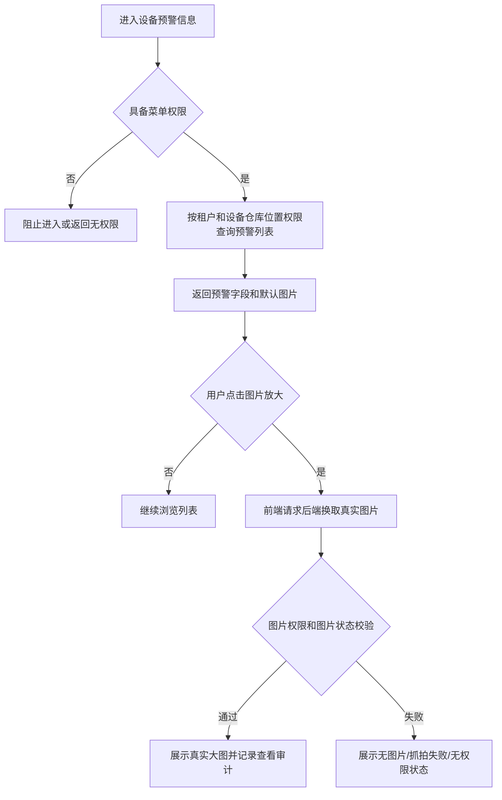
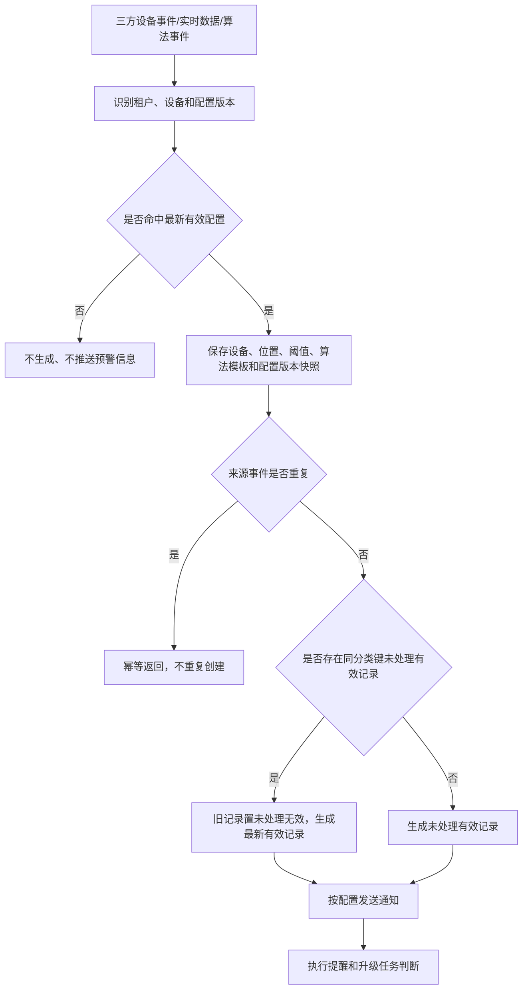
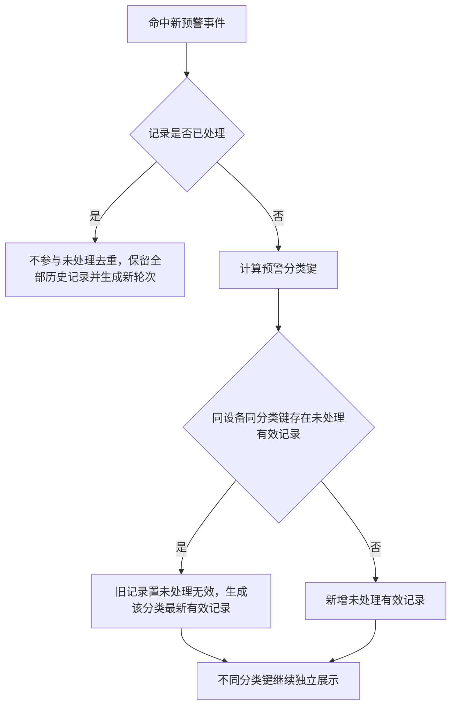
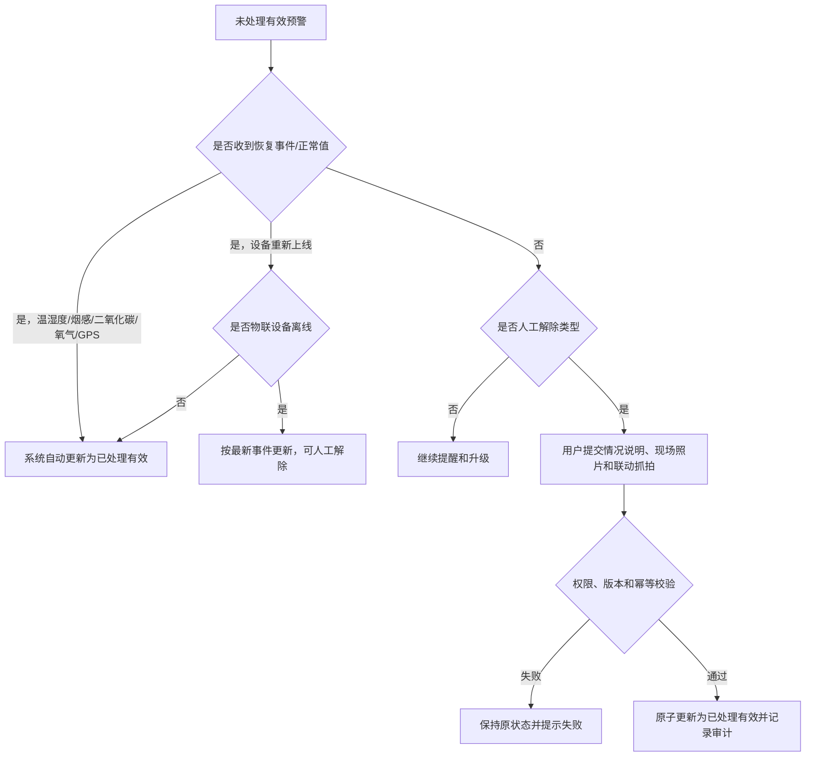
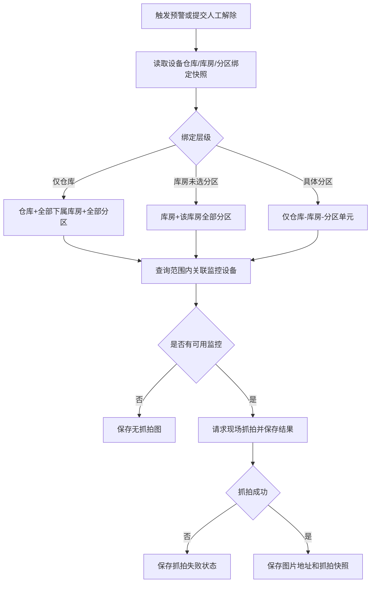

# 设备预警信息业务规则规格

> **文档定位**：设备预警信息的查询、触发、未处理去重、状态变更、自动/人工解除、抓拍、图片加载、配置版本和审计规则的唯一定义来源。字段定义引用[设备预警信息字段清单](./设备预警信息字段清单.md)，预警类型和配置规则引用[设备预警配置业务规则规格](../../08-配置管理/20-风险管理-设备预警配置/设备预警配置业务规则规格.md)。
>
> **版本**：V1.1 | 2026-08-18

## 一、术语与范围

| 项目 | 当前规则 |
| :--- | :--- |
| 预警信息 | 设备命中有效预警配置后产生的一条风险记录，包含触发事件、设备位置、配置版本和处理状态快照 |
| 未处理预警 | 处理状态为“未处理”且记录有效的预警信息，参与提醒、升级和未处理去重；同一分类键仅保留一条有效未处理记录 |
| 已处理预警 | 处理状态为“已处理”且记录有效的预警信息；不参与未处理去重，历史记录全部保留并可供用户查看 |
| 无效预警 | 记录有效性为“无效”的历史记录，页面显示为“未处理（无效）”；进入默认列表并计入总数和分页，但不再提醒、升级或允许人工处理 |
| 当前配置 | 最新有效的设备预警配置版本；旧配置版本不再展示为当前配置，也不再触发或推送新预警 |

## 二、权限与数据范围

| 规则ID | 规则 |
| :--- | :--- |
| DEV-I05 | 用户须具备设备预警信息菜单查看权限，详情、人工解除和图片查看分别校验对应操作权限。 |
| DEV-I06 | 列表、详情和处理数据按当前登录账号的仓库权限过滤；设备绑定仓库、库房或分区位置时，仅返回账号仓库权限范围内的数据。 |
| DEV-I07 | 设备未绑定具体位置时，设备预警信息对所有已登录且具备本模块菜单查看权限的账号可见，但不得突破租户隔离和菜单权限；该可见例外不等同于配置页的设备选择权限。 |
| DEV-I08 | 图片换取、人工解除和其他写接口必须在服务端重新校验租户、菜单、仓库数据权限和记录版本，不能以客户端列表结果作为授权依据。 |

设备预警信息使用仓库权限，不使用订单数据权限；设备预警配置的规则可见性和设备可选性分别按配置模块规则执行。

## 三、配置版本与触发边界

| 规则ID | 规则 |
| :--- | :--- |
| DEV-I01 | 设备预警配置被修改后，原配置版本不再作为当前有效配置在配置列表中展示，也不再根据原版本推送新预警信息；后续设备事件按照最新配置执行。 |
| DEV-I02 | 配置修改不回写已经产生的预警信息快照；历史预警是否保留由其处理状态和记录有效性决定，不能使用最新配置重新计算历史触发值、阈值或位置。 |
| DEV-I03 | 配置修改、设备关联变更、通知对象变更和阈值变更必须保存配置版本；触发记录必须关联命中的配置版本，便于追溯事件发生时的规则。 |
| DEV-I04 | 配置被删除或失效后不再匹配新事件；关联未处理预警置为“未处理（无效）”，停止普通提醒和升级任务。 |
| DEV-I15 | 设备从预警规则中解除关联，或设备发生解绑、逻辑删除、数据权限撤销时，该设备关联的未处理有效预警统一置为“未处理（无效）”，停止普通提醒和升级任务；已处理记录不回写，历史记录保留只读。设备重新关联或恢复权限后不自动恢复历史预警，须等待新的有效事件生成新预警轮次。 |

## 四、预警触发与记录生成

| 规则ID | 规则 |
| :--- | :--- |
| DEV-I11 | 三方图像事件、物联数据、门禁/挂锁事件和 GPS 事件均按“租户 + 设备 + 子类型/算法模板 + 来源事件唯一标识”执行幂等处理，重复回调不得重复创建同一事件记录。 |
| DEV-I12 | 事件命中最新有效配置后生成“未处理（有效）”预警，保存设备、仓库、库房、分区、具体位置、规则名称、配置版本、触发值、阈值、算法模板 ID 和触发时间快照。 |
| DEV-I13 | 事件未命中最新有效配置时不生成、不推送设备预警信息；不能因历史配置曾经命中过预警而继续推送。 |
| DEV-I14 | 同一设备的不同预警子类型按照分类去重规则分别处理；已处理记录不被新的未处理事件覆盖或更新。 |

## 五、未处理预警分类去重

### 4.1 当前执行规则

| 预警大类 | 子类型 | 去重键与处理方式 |
| :--- | :--- | :--- |
| 设备图像识别预警 | 行人入侵检测、车辆入侵检测、物品形态监控、设备离线 | 使用“设备 + 算法模板 ID”作为分类键；同一设备不同算法模板同时展示，同一设备同一算法模板只更新最新一条未处理记录。算法模板 ID 缺失时，使用“设备 + 图像子类型 + 事件类型”兜底。 |
| 设备物联预警 | 温度、湿度、氧气、二氧化碳、烟感、设备离线 | 温度、湿度、氧气、二氧化碳和烟感每种子类型每个设备仅保留一条有效未处理记录，覆盖时旧记录置为无效并生成最新记录，无效历史记录仍进入列表；物联设备离线按离线轮次处理，重复离线事件仅更新当前未处理记录，人工解除后设备未上线期间忽略重复离线事件。 |
| 智能挂锁预警 | 拆壳、锁舌被卡、锁杆被剪、非法开箱、拆卡报警、密码错误、关锁异常、离线、电量低于20% | 每种子类型每个设备仅保留一条有效未处理记录；覆盖时旧记录置为无效并生成最新记录，无效历史记录仍进入列表。 |
| 人脸门禁预警 | 设备离线、门未关、密码错误 | 每种子类型每个设备仅保留一条有效未处理记录；覆盖时旧记录置为无效并生成最新记录，无效历史记录仍进入列表。 |
| 设备 GPS 预警 | 设备离线、进围栏、出围栏、普通限速、怠速滞留、路线偏离、非法拆除 | 每种子类型每个设备仅保留一条有效未处理记录；覆盖时旧记录置为无效并生成最新记录，无效历史记录仍进入列表。 |

### 4.2 状态差异

物联设备离线是上述分类去重规则的例外：同一离线轮次内重复离线事件仅更新当前未处理记录，不执行“旧记录置无效并生成新记录”；人工解除后在收到有效上线事件前，重复离线事件不生成新预警。上线后下一次离线开启新的预警轮次。

- 未处理记录命中同一分类键时，当前有效记录保留审计版本并置为“未处理（无效）”，系统生成最新的“未处理（有效）”记录；同一分类键仅保留一条有效未处理记录，不同分类键的记录同时展示，用户分别处理。
- 已处理记录不参与未处理去重，用户可见的所有已处理记录均保留；后续再次触发时生成新的未处理轮次。
- 2025-03-14 的“同一设备+预警类型+预警内容”通用去重，以及 2025-05-06 的“同一设备+相同子类型+相同预警解除时间”去重，均为历史口径；当前以 2026-08-18 分类去重规则为准。

## 六、解除与状态变更

| 类型 | 解除规则 | 是否人工解除 |
| :--- | :--- | :--- |
| 温度、湿度、二氧化碳、氧气 | 有效采集值恢复到配置范围内自动更新为“已处理（有效）”；等于最低值或最高值时不触发恢复/越界 | 否 |
| 烟感 | 收到设备恢复正常的有效采集值或三方恢复事件后自动更新为“已处理（有效）” | 否 |
| GPS全部子类型 | 收到三方平台对应恢复/正常状态事件后自动更新为“已处理（有效）” | 否 |
| 物联设备离线 | 按“离线轮次”处理：同一轮次内重复收到离线事件时，仅更新当前未处理记录的最新事件快照，不新建记录、不开启新预警轮次；人工解除后设备仍未上线时，后续离线事件直接忽略，不生成新记录、不发送新通知；收到有效上线事件后结束当前离线轮次，设备下一次离线时才允许生成新的未处理预警 | 是，支持 |
| 非物联设备离线 | 收到对应三方设备重新上线结果后自动解除，更新为“已处理（有效）” | 否 |
| 图像识别、智能挂锁、人脸门禁的非离线行为类子类型 | 按设备事件和业务现场处理结果由有权限用户解除 | 是 |

人工解除必须提交情况说明；现场照片为选填，最多10张且单张不超过5 MB；提交时联动解除预警抓拍。自动解除类型不展示人工解除表单，不生成处理人账号信息，处理人展示“系统自动处理”。

## 七、抓拍与图片加载

### 6.1 抓拍范围

抓拍范围按“仓库 > 库房 > 分区”计算，库房为分区的上级单元。预警触发抓拍和人工解除抓拍均执行以下规则：

| 设备绑定位置 | 抓拍范围 |
| :--- | :--- |
| 仅绑定仓库 | 仓库本身、下属全部库房及全部分区 |
| 绑定库房且未绑定具体分区 | 该库房本身及该库房下属全部分区 |
| 绑定库房的具体分区 | 仅该仓库-库房-分区具体单元 |

设备多选绑定位置时取各位置范围并集，不得扩大到其他仓库或无关位置。无匹配监控设备展示“无抓拍图”；摄像头离线或请求超时展示“抓拍失败”，不伪造真实图片。

### 6.2 图片展示

- 列表中的图片列默认展示默认图，页面初始化不加载真实图片。
- 用户点击图片放大时，前端通过后端接口换取真实图片，再进行租户、菜单和仓库数据权限校验。
- 真实图片地址使用时效签名；图片换取失败、无图片或抓拍失败时展示对应状态。
- 图片查看、换取、失败和越权拦截均写入审计日志。

## 八、并发、幂等与审计

- 预警生成、分类去重、自动解除、人工解除、状态变更和图片换取必须使用事件幂等键、记录版本校验、分布式锁或等效机制。
- 人工解除成功时原子更新状态、处理时间、处理人、说明、现场照片、解除抓拍结果和审计日志；重复提交返回首次处理结果，不重复抓拍或写入材料。
- 审计记录事件 ID、设备、预警子类型、算法模板 ID、配置版本、操作人、时间、IP、前后状态、图片结果和失败原因。

---

## 业务流程与联动

> 以下内容由原《设备预警信息业务流程》合并，与上文规则 ID 配合阅读；重复的状态机定义以上文为准。

> **文档定位**：设备预警信息的列表查询、事件接收、分类去重、通知、自动/人工解除、图片加载和抓拍联动流程。字段定义引用[设备预警信息字段清单](./设备预警信息字段清单.md)，规则定义引用[设备预警信息业务规则规格](./设备预警信息业务规则规格.md)。
>
> **版本**：V1.1 | 2026-08-18

## 一、列表查询流程

- 筛选条件仅为预警类型和预警状态；预警时间、处理时间、处理人仅展示，不作为筛选条件。
- 列表图片初始统一展示默认图，不在列表初始化时加载真实图片；真实图片仅在点击放大后换取。
- 默认列表按查询权限返回全部有效和无效预警记录；无效记录计入总数和分页，以“未处理（无效）”展示，仅允许只读查看历史状态，不展示解除操作。用户仅可通过“预警状态”筛选有效或无效记录。
- 设备绑定仓库、库房或分区位置时，仅返回当前登录账号仓库权限范围内的数据；设备未绑定具体位置时，对所有已登录且具备设备预警信息菜单查看权限的账号可见，但不得突破租户和菜单权限。

## 二、设备事件触发流程

配置被修改后，原配置版本不再展示为当前有效配置，也不再推送新预警；新事件统一按照最新配置版本处理。已产生记录的历史快照不回写。

## 三、未处理预警去重流程

分类键按以下规则计算：图像识别使用“设备+算法模板 ID”，物联/挂锁/人脸门禁/GPS使用“设备+预警子类型”；缺少算法模板 ID时使用图像子类型和事件类型兜底。同一分类键仅保留一条有效未处理记录，历史无效记录仍进入默认列表并计入总数和分页。

## 四、自动解除与人工解除流程

人工解除类型包括图像识别、智能挂锁、人脸门禁的非离线行为类预警和物联设备离线；物联设备离线按离线轮次处理，人工解除后设备未上线期间的重复离线事件直接忽略，收到有效上线事件后下一次离线才开启新轮次；非物联设备离线、温度、湿度、烟感、二氧化碳、氧气及全部 GPS 预警不展示人工解除表单。

## 五、抓拍联动流程

多个绑定位置按范围并集计算；不得跨仓库或扩大到无关库房。列表先展示默认图，点击放大时再通过后端换取真实图片。

## 六、异常与并发处理

| 场景 | 处理 |
| :--- | :--- |
| 旧配置版本事件到达 | 不再匹配和推送；按最新配置重新判断，原历史记录保留快照 |
| 三方事件重复回调 | 按租户、设备、分类键和来源事件 ID 幂等，不重复创建 |
| 不同图像算法模板同时命中 | 分别生成并展示未处理预警，用户分别处理 |
| 已处理预警再次触发 | 不参与未处理去重，生成新轮次，历史已处理记录全部保留 |
| 图片未点击 | 只展示默认图，不请求真实图片 |
| 图片无权限或换取失败 | 不返回真实地址，展示对应状态并记录审计 |
| 并发人工解除 | 版本不一致或已处理时拒绝重复提交，保持原材料和状态 |
| 抓拍范围无监控 | 保存“无抓拍图”，不向其他仓库范围扩展 |
| 物联设备离线人工解除后再次收到离线事件 | 设备未收到有效上线事件前，忽略重复离线事件，不生成新预警、不发送通知；收到上线后下一次离线开启新轮次 |
| 设备规则关联解除、设备解绑、逻辑删除或数据权限撤销 | 关联设备的未处理有效预警置为“未处理（无效）”，停止提醒和升级，历史记录保留只读；设备重新关联或恢复权限不自动恢复历史预警 |

## 修订记录

| 日期 | 版本 | 变更 |
| :--- | :---: | :--- |
| 2026-08-20 | — | 合并原《设备预警信息业务流程》至本文件「业务流程与联动」章节 |
