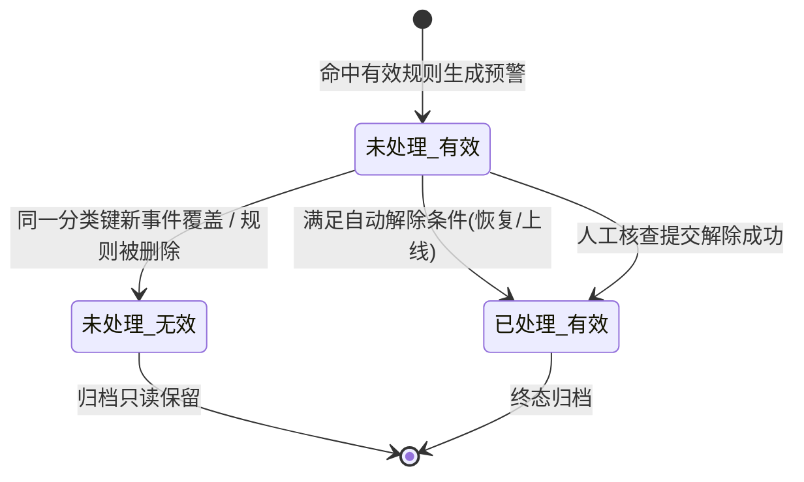
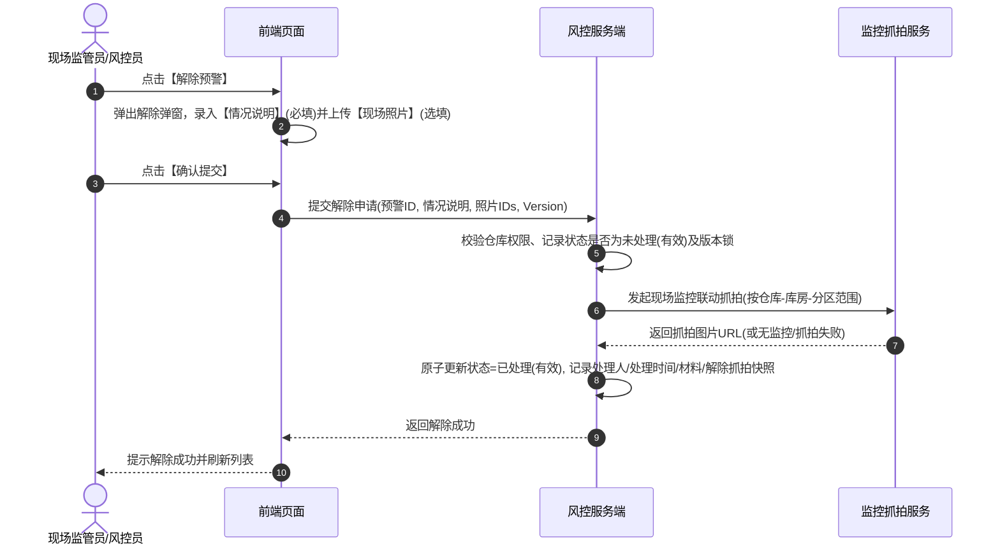

# 设备预警信息主需求文档

> **版本**：V1.8 | 2026-08-19
> **读者**：研发工程师、测试工程师、物联网风控产品经理、现场监管员
> **编写依据**：[设备预警信息字段清单](./设备预警信息字段清单.md)、[设备预警信息业务规则规格](./设备预警信息业务规则规格.md)、[设备预警信息业务流程](./设备预警信息业务规则规格.md)
> **字段基准**：`设备预警信息字段清单.md` 是本模块所有业务字段与系统字段的唯一定义来源；本主 PRD 负责业务逻辑、操作规范、状态机流转与跨系统联动闭环。

---

## 1. 业务背景

**设备预警信息**是仓储监管现场所有物理硬件资产（监控摄像头、温湿度/烟感传感器、智能门锁、人脸门禁、GPS等）异常告警事件的集中承接与处置台账。
当三方平台推送设备离线、物联指标越界或图像 AI 算法事件并命中 [02设备预警配置](../../08-配置管理/20-风险管理-设备预警配置/设备预警配置主PRD.md) 时，系统立即生成设备预警流水。本模块提供预警分类去重、现场抓拍时效展示、自动恢复解除与人工核查解除闭环，确保仓库物理安全风险实时可控、全路径留痕。

---

## 2. 功能范围

### 2.1 本期范围
- **预警信息列表与检索**：支持按预警类型、设备名称、设备编码、处理状态（未处理/已处理/全部）、仓库位置、触发时间范围多维度检索；
- **未处理分类去重与展示**：按“设备+子类型/算法模板”自动去重，同一分类键仅保留一条有效未处理记录；新事件覆盖时旧记录置为“未处理（无效）”；
- **设备离线独立轮次管理**：物联设备离线按轮次处理，同一轮次重复离线仅更新快照，收到有效上线事件后结束当前轮次；
- **自动解除与人工解除双机制**：
  - **自动解除**：温湿度恢复正常范围、烟感/GPS恢复正常、非物联设备重新上线时，系统自动更新为“已处理（有效）”；
  - **人工解除**：图像识别、门禁门锁异常行为及物联离线支持人工提交处理（情况说明必填、现场照片选填、联动现场解除抓拍）；
- **图片安全与时效签名**：列表默认展示占位状态，用户点击后通过后端权限接口换取时效签名 URL 查看现场抓拍大图；
- **权限与审计**：基于仓库数据权限隔离、全路径操作审计与快照防篡改。

### 2.2 移动端范围
- 移动端支持设备预警信息列表浏览、预警详情查看、现场照片上传与移动端人工解除提交。

### 2.3 不在本期范围
- 设备维度的规则与阈值配置维护（归属 [02设备预警配置](../../08-配置管理/20-风险管理-设备预警配置/设备预警配置主PRD.md)）；
- 抵质押/监管订单维度的押品风险与单据处置（归属 [02押品预警信息](../06-风险信息-押品预警信息/押品预警信息主PRD.md)）；
- 摄像头底层流媒体播放与云台控制（归属 [01设备管理/01监控设备](../../02-仓储/16-设备管理-监控设备/监控设备主PRD.md)）。

---

## 3. 模块定位与上下游关系

### 3.1 系统位置

| 项目 | 内容 |
| :--- | :--- |
| **模块层级** | 风险信息与处置层（物理设备告警流水中心） |
| **核心职责** | 承接设备物理告警流水，提供未处理去重、现场核查、人工/自动解除与抓拍追溯 |
| **上游依赖** | 三方设备接入服务、物联采集网关、[02设备预警配置](../../08-配置管理/20-风险管理-设备预警配置/设备预警配置主PRD.md) |
| **下游引用** | 风险大屏、现场监管处置、操作审计日志 |
| **业务单据** | 本模块生成风险预警流水记录，具备独立的未处理/已处理生命周期状态机 |

### 3.2 预警状态机与流转模型

| 状态名称 | 业务含义 | 提醒与升级行为 | 人工操作权限 |
| :--- | :--- | :--- | :--- |
| **未处理（有效）** | 当前生效且正在告警中的风险实例 | 参与站内/短信提醒，触发超时升级任务 | 允许人工解除（针对支持类型） |
| **未处理（无效）** | 被新事件覆盖或规则失效的旧未处理记录 | **停止**定时提醒与升级任务 | 不允许人工操作，列表只读展示 |
| **已处理（有效）** | 已经成功解除（自动或人工）的风险记录 | **停止**提醒与升级任务 | 终态，只读查看处理人与材料 |

---

## 4. 页面与字段规则

### 4.1 字段引用基准
- 字段名称、类型、来源及展示规则统一以 [设备预警信息字段清单](./设备预警信息字段清单.md) 为准；
- 预警触发时必须固化记录触发时的设备名称、设备编码、仓库/库房/分区、触发值、阈值及配置版本快照。

### 4.2 数据可见范围与权限控制

| 场景 | 可见范围与控制规则 | 服务端安全机制 |
| :--- | :--- | :--- |
| **预警列表** | 仅展示当前登录账号管辖仓库范围内的设备预警；设备未绑定仓库时作为例外展示 | 服务端基于账号关联仓库列表进行过滤 |
| **预警详情与图片** | 查看详情与换取抓拍图片必须经过租户、菜单及对应仓库数据权限校验 | 动态生成带过期时间的防盗链签名 URL |
| **人工解除** | 必须具备设备预警处理权限且拥有对应仓库数据权限 | 服务端二次强校验记录状态是否为“未处理（有效）” |

---

## 5. 操作功能详解

### 5.1 操作总览

| 操作名称 | 入口 | 适用状态 | 前置条件 | 是否改变流水状态 | 联动下游影响 |
| :--- | :--- | :--- | :--- | :---: | :---: |
| **查看详情** | 列表操作列 | 全部 | 拥有查看权限 | 否 | 查看快照与处理材料 |
| **图片放大预览** | 列表图片列 | 全部 | 拥有图片权限 | 否 | 换取时效签名查看大图 |
| **人工解除预警** | 列表操作列 / 详情 | 未处理（有效）且支持人工类型 | 拥有处理权限与仓库权限 | 是 | 状态更新为已处理，联动解除抓拍 |

---

### 5.2 人工解除预警操作

- **表单必填校验**：
  - **情况说明**：必填，文本域，长度不超过 200 个字符；
  - **现场照片**：选填，支持 `jpg/png/jpeg`，单个文件不超过 5 MB，最多上传 10 张；
- **联动解除抓拍**：提交时由系统自动向预警发生位置所属监控发起联动抓拍，作为现场核销佐证；
- **并发控制**：采用版本号 `Version` 校验，防止多人并发解除冲突。

---

### 5.3 自动解除机制
- **数值型传感器**：采集值恢复到配置的合法范围内，系统自动更新为 `已处理（有效）`，处理人记录为 `系统自动处理`；
- **设备离线自动恢复**：非物联设备收到三方平台推送的有效上线事件后，系统自动将离线记录更新为 `已处理（有效）`，停止升级通知。

---

## 6. 异常处理与安全保障

1. **未处理分类去重防堆积**：图像识别按 `设备+算法模板ID` 去重，物联/门禁/挂锁/GPS按 `设备+子类型` 去重，避免同类未处理流水无限堆积；
2. **抓拍异常隔离**：现场监控离线或请求超时时，抓拍状态记录为 `抓拍失败`，无可用监控记录为 `无抓拍图`，严禁伪造虚假图片；
3. **时效签名防盗链**：所有抓拍与现场照片均采用带鉴权的时效签名 URL，有效期到期自动失效。

---

## 7. 验收标准与测试用例

| 用例编号 | 测试场景 | 前置条件 | 预期输出与系统行为 |
| :---: | :--- | :--- | :--- |
| **DEV-I-TC01** | 未处理去重与无效覆盖 | 设备 A 存在未处理“行人入侵” | 再次收到设备 A 行人入侵事件，原记录变为“未处理（无效）”，新生成“未处理（有效）” |
| **DEV-I-TC02** | 温湿度越界后自动恢复 | 仓库温度超温触发预警 | 传感器上报合法温度后，预警状态自动变为“已处理（有效）”，处理人显示“系统自动处理” |
| **DEV-I-TC03** | 人工解除表单校验 | 打开人工解除弹窗 | 情况说明为空点击提交被拦截；输入 >200 字符被拦截；提交有效说明与照片成功解除 |
| **DEV-I-TC04** | 抓拍图片越权拦截 | 账号无 3 号仓权限 | 尝试请求 3 号仓设备预警抓拍签名，服务端返回 403 越权拦截 |
| **DEV-I-TC05** | 物联离线轮次人工解除 | 物联设备离线触发预警 | 人工解除后设备仍离线期间，重复离线事件不再生成新预警；待上线后再次离线才开启新轮次 |

---

## 8. 引用文档与修订记录

### 8.1 关联文档
- [设备预警信息字段清单](./设备预警信息字段清单.md)
- [设备预警信息业务规则规格](./设备预警信息业务规则规格.md)
- [设备预警信息业务流程](./设备预警信息业务规则规格.md)
- [设备预警配置主PRD](../../08-配置管理/20-风险管理-设备预警配置/设备预警配置主PRD.md)
- [设备预警信息字段清单](./设备预警信息字段清单.md)

### 8.2 修订记录

| 日期 | 版本 | 修订人 | 修订内容 |
| :--- | :---: | :---: | :--- |
| 2026-08-19 | V1.8 | 产品团队 | 深度对齐 6.1 主 PRD 标准，细化未处理去重矩阵、人工核查解除、联动抓拍时效签名与测试矩阵。 |
| 2026-08-18 | V1.0 | 产品团队 | 初版发布。 |
