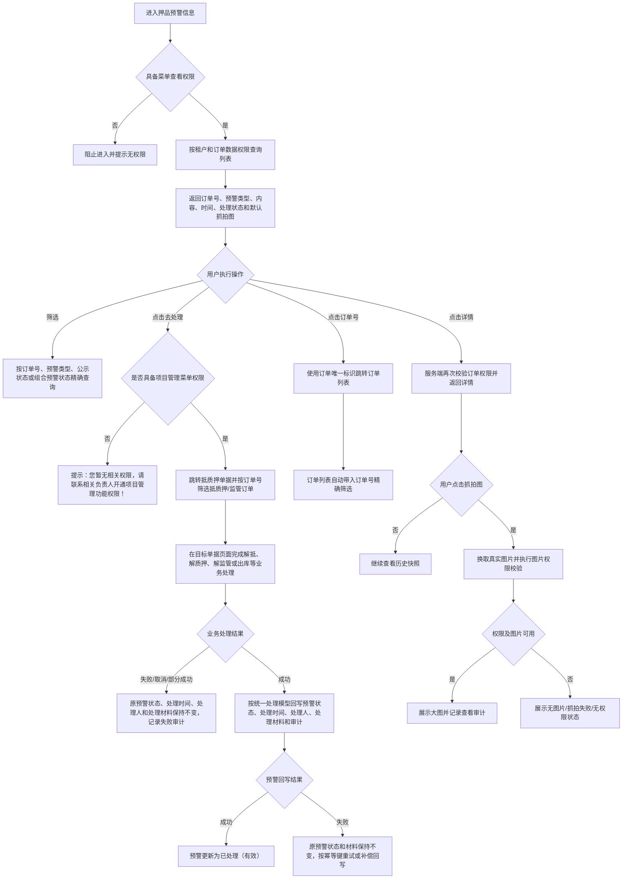
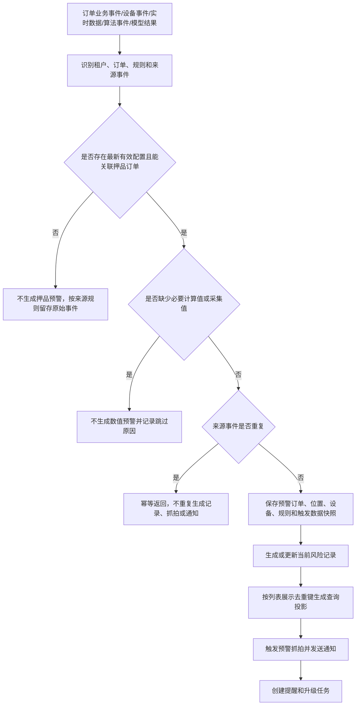
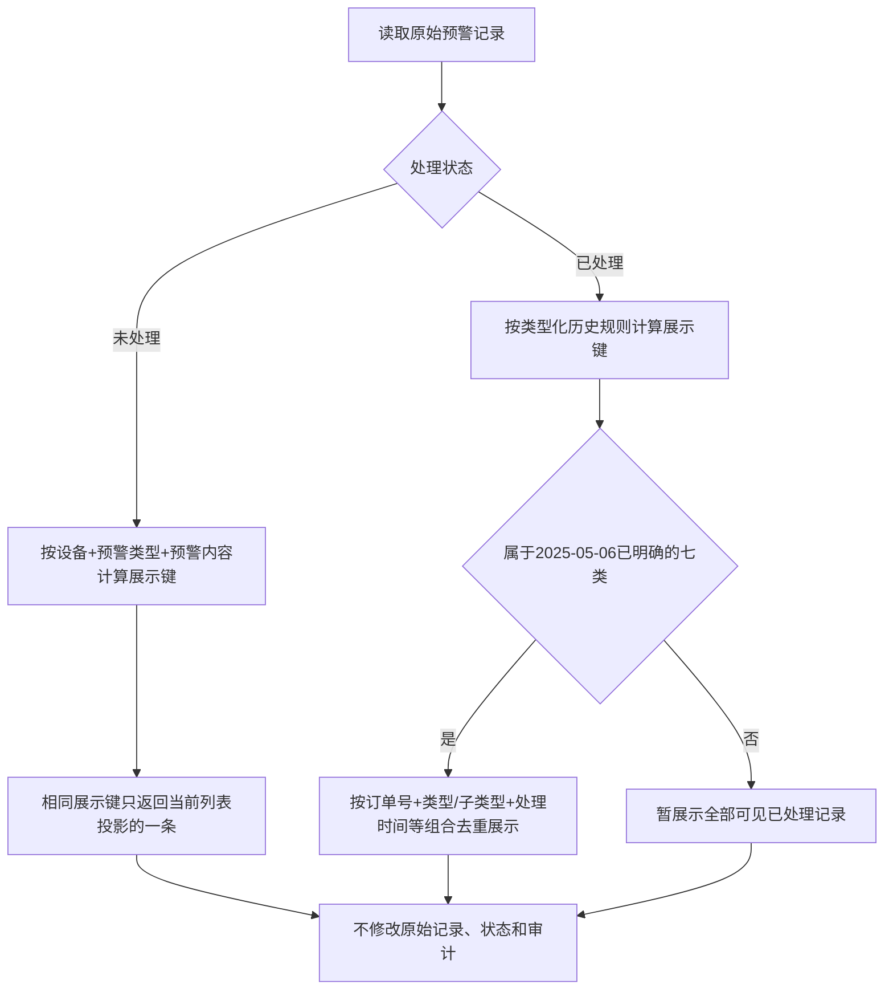
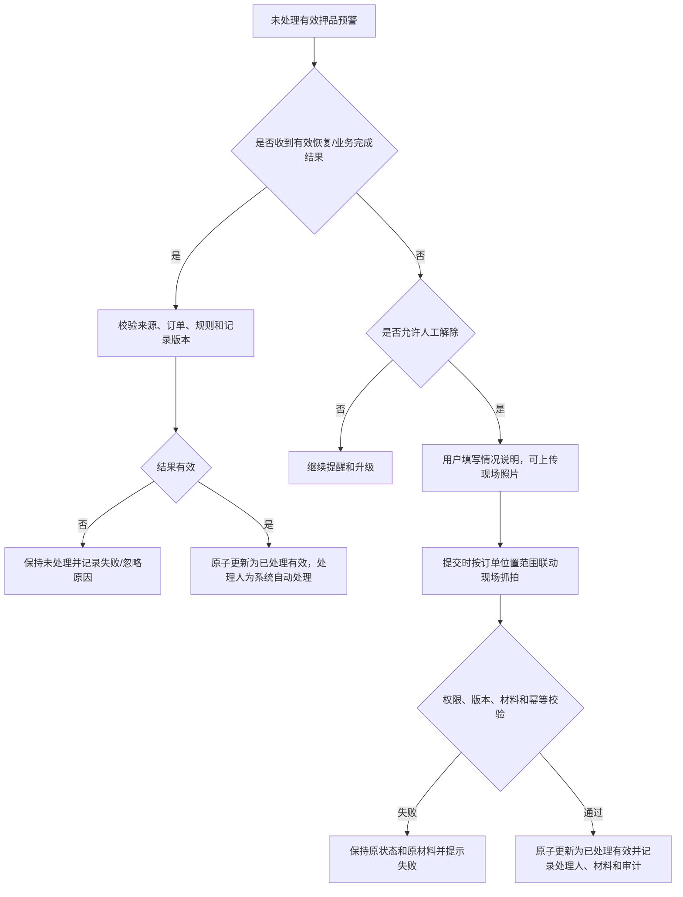
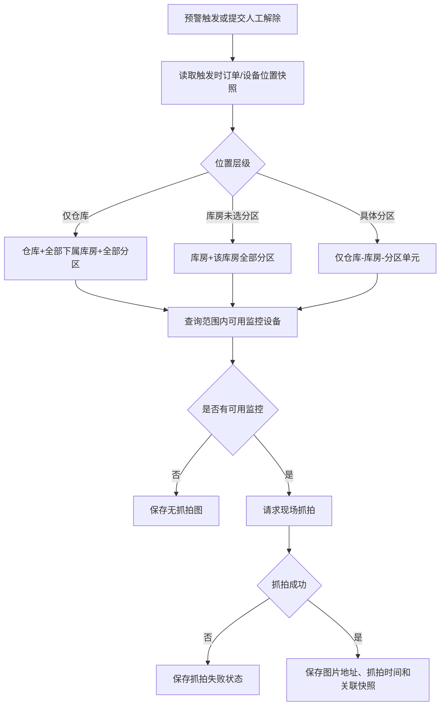
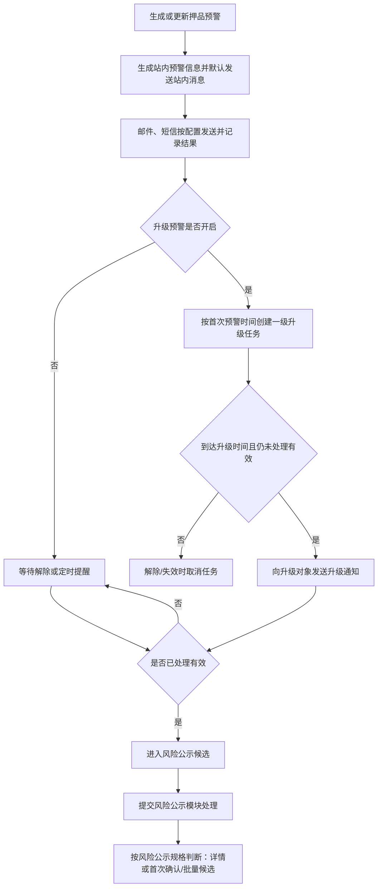
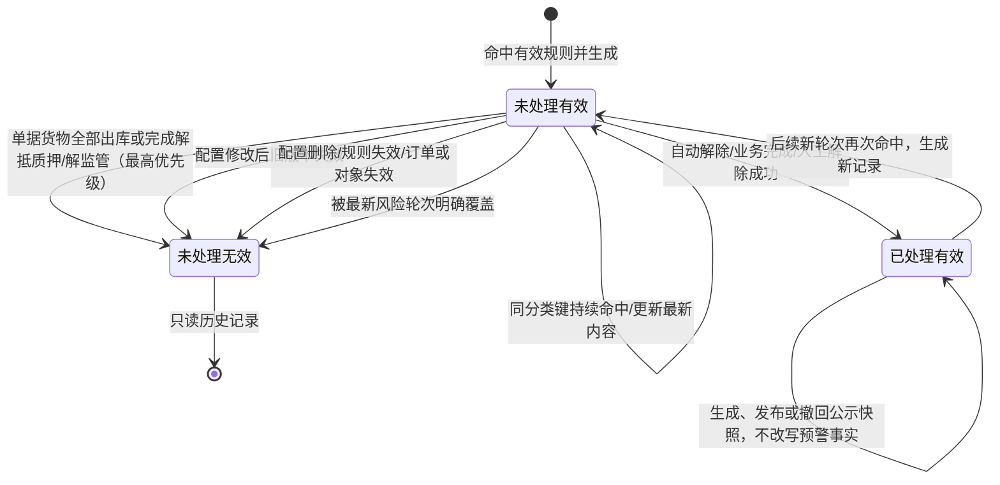

# 押品预警信息业务规则规格

> **文档定位**：押品预警信息的权限、订单跳转、预警生成、分类去重、自动/人工解除、抓拍、通知、公示、并发和审计规则的唯一定义来源。字段口径引用[押品预警信息字段清单](./押品预警信息字段清单.md)，规则触发条件引用[订单预警配置业务规则规格](../../08-配置管理/19-风险管理-订单预警配置/订单预警配置业务规则规格.md)和[设备预警配置业务规则规格](../../08-配置管理/20-风险管理-设备预警配置/设备预警配置业务规则规格.md)。
>
> **版本**：V1.3 | 2026-08-18

## 一、能力边界与术语

| 项目 | 当前规则 |
| :--- | :--- |
| 预警信息 | 订单预警配置或带有效订单关联的设备事件命中后生成的一条订单维度风险记录，包含订单、位置、触发数据、规则版本和处理状态快照 |
| 押品订单 | 抵/质押订单或监管订单；订单类型及可选预警大类继承订单模块和订单预警配置 |
| 未处理预警 | 处理状态为“未处理”且记录有效，参与提醒、升级、人工处理和当前轮次去重 |
| 已处理预警 | 处理状态为“已处理”且记录有效；不参与未处理去重，历史记录全部保留 |
| 无效预警 | 记录有效性为“无效”的历史记录，页面显示“未处理（无效）”，不再提醒、升级、处理或公示 |
| 风险公示 | 已处理（有效）且未产生公示记录的预警可进入批量公示候选；单条入口先判断公示历史，有记录直接进入详情，无记录且满足条件才进入首次确认；取消公示后保留历史且不回到未公示，具体规则以风险公示正式规格为准 |
| 当前配置 | 最新有效的订单/设备预警配置版本；旧版本不再匹配新事件，历史记录仍保留触发快照 |

本模块只管理押品订单维度的风险信息。没有订单归属的设备资产预警由“设备预警信息”模块管理，不在本模块补生成记录。

## 二、权限与数据范围

| 规则ID | 规则 |
| :--- | :--- |
| COL-P01 | 用户须具备押品预警信息菜单查看权限，才可进入列表；详情、解除预警、公示风险和批量公示风险分别校验对应操作权限。 |
| COL-P02 | 列表、详情、订单号跳转、图片查看和公示数据均按当前登录账号订单数据权限过滤；可见订单才可见其相关押品预警。 |
| COL-P03 | 订单权限变化后，已无权访问的预警不得出现在列表、详情、图片换取和公示候选中；所有写接口必须再次在服务端校验权限。 |
| COL-P04 | 订单号点击跳转使用订单唯一标识和精确筛选参数；目标订单列表再次执行权限校验，不以 URL 参数或前端缓存替代服务端权限。 |
| COL-P05 | 预警规则名称、订单、设备、仓库和库房均展示触发时快照；当前主数据无权访问或已变更，不得用当前值覆盖历史内容。 |
| COL-P06 | 图片访问同时校验租户、菜单、订单及仓库数据权限；时效签名过期或权限撤销时不得返回真实图片地址。 |
| COL-P07 | 点击“去处理”时跳转【抵质押单据】页面，并自动按订单号筛选出抵质押/监管订单；跳转前校验项目管理菜单权限。登录账号无项目管理菜单权限时，提示“您暂无相关权限，请联系相关负责人开通项目管理功能权限！”，不得进入目标页面。 |

## 三、预警生成与配置版本

| 规则ID | 规则 |
| :--- | :--- |
| COL-T01 | 订单业务事件、设备三方事件、实时采集、算法事件、定时任务和风控模型结果，均按租户、订单、规则/子类型和来源事件唯一标识执行幂等处理。 |
| COL-T02 | 事件命中最新有效配置且能关联押品订单时，生成“未处理（有效）”预警，保存订单、预警类型、规则名称、触发值、阈值、设备/位置和预警时间快照。 |
| COL-T03 | 事件未命中最新有效配置、订单不存在、订单不在配置范围或必要计算值缺失时，不生成押品预警；原始事件可按来源系统规则留存，但不得伪造风险记录。 |
| COL-T04 | 订单预警配置或设备预警配置被修改后，原版本不再匹配新事件；已产生记录保留触发时配置版本、规则名称和全部历史快照，不回写；关联未处理记录置为“未处理（无效）”。 |
| COL-T05 | 失效判断按以下优先级执行：①单据下货物全部出库，或已完成对应解抵、解质押、解监管，关联规则及未处理记录立即置为“未处理（无效）”；②配置修改，旧版本不再生效，关联未处理记录置为“未处理（无效）”；③配置删除、规则失效、订单失效或其他关联对象失效，关联未处理记录置为“未处理（无效）”。上述失效场景均停止提醒、升级和处理；已处理记录保留原处理结果和历史快照。 |
| COL-T06 | 同一来源事件重复到达时返回首次处理结果，不重复生成预警、抓拍、通知或升级任务；通知发送失败不回滚已生成的预警记录。 |

### 3.1 当前预警类型边界

押品预警侧按订单风险定义11个大类：解抵/质押/监管超时、价格下跌、图像识别异常、盘点异常、巡检异常、物联设备、智能挂锁异常、抵/质押率异常、人脸门禁异常、GPS异常、贷中风控预警。设备预警配置侧按设备资产定义5个设备大类：设备图像识别预警、设备物联预警、智能挂锁预警、人脸门禁预警、设备 GPS 预警。两套大类是不同业务维度，当前不建立正式一对一映射表；设备事件只有在携带有效订单唯一标识并符合接入规则时，才可被押品预警信息按订单维度承接，否则仅进入设备预警信息。监管订单不允许抵/质押率异常。

触发条件、阈值校验、设备资产范围、解除方式和通知配置分别继承对应配置模块。本模块保存触发结果和处理快照，不在预警信息页面编辑规则或重新计算历史值。

## 四、预警记录与列表展示去重

### 4.1 记录处理原则

预警生成、来源事件幂等和业务状态变更按订单、设备、预警子类型、二维码/批次、算法模板或业务执行批次执行；列表展示去重不得被实现为物理删除。被配置失效、对象失效或最新风险轮次明确覆盖的记录，才可按规则置为“未处理（无效）”。

### 4.2 未处理预警展示去重

2025-03-14 起，未处理预警按“同一设备 + 预警类型 + 预警内容”去重展示。押品订单类预警没有设备时，以订单号作为业务主体；设备类预警追加设备唯一标识。相同组合只返回当前列表投影中的一条记录，不改变原始预警记录、详情、处理时间、处理人和审计数据。

### 4.3 已处理预警展示去重

2025-05-06 对已处理预警增加按类型区分的展示去重规则，覆盖 2025-03-14“已处理直接展示全部可见记录”的早期口径：

| 预警类型 | 已处理列表展示去重键 |
| :--- | :--- |
| 解质押超时 | 订单号 + 相同类型 + 相同处理时间 + 相同二维码 |
| 价格下跌 | 订单号 + 相同类型 + 相同处理时间 |
| 图像识别异常 | 订单号 + 相同子类型 + 相同处理时间 |
| 盘点异常 | 订单号 + 相同类型 + 相同处理时间 |
| 巡检异常 | 订单号 + 相同类型 + 相同处理时间 + 相同巡检人员 |
| 温湿度异常 | 订单号 + 相同子类型 + 相同处理时间 |
| 智能门锁 | 订单号 + 相同子类型 + 相同处理时间 |

上述规则仅作用于已处理列表展示投影；原始已处理记录仍全部保留。未提供后续历史规则的其他已处理预警类型，暂展示全部可见记录。

历史逻辑中的“预警解除时间”或“解除时间”统一指字段清单中的“处理时间”，不单独保存或展示另一时间字段。

### 4.4 预警内容模板

2025-04-06 起，以下类型按固定模板生成预警内容，模板变量全部取触发时快照：

| 类型 | 当前展示内容 |
| :--- | :--- |
| 超时未解抵/质押 | `当前抵/质押物 品类-规格（数量+单位）未在 YYYY年MM月DD日 完成解抵/质押！（预警阈值xxx天）` |
| 超时未解监管 | `当前监管物 品类-规格（数量+单位）未在 YYYY年MM月DD日 完成解监管！（预警阈值xxx天）` |
| 价格下跌 | `抵/质押物价值下跌！当前订单货物价值已下跌超过xx%（预警阈值 xx%）` |
| 盘点异常 | `盘点异常！经盘点发现货物异常，请及时核查处理！` |
| 巡检异常 | `巡检异常！某某某未按时巡检盘点，请及时核查处理！` |
| 抵/质押率异常 | `订单抵/质押率异常！本次触发补仓线，发生预警时订单抵/质押率为xx%，贷款余额为xx.xx元，质物价值为xx.xx元（预警阈值50%）`；实际展示时替换为本次命中的预警线及触发快照值 |
| 贷中风控预警 | `模型名称：模型名称；模型分数：模型分数或--；预警描述：模型返回的结果描述`；模型名称取预警配置关联模型，模型分数取智风控平台对应产品最终分数，预警描述取模型返回结果描述 |

金额、比例、数量、日期和人员名称按照字段清单的格式化规则展示；贷中风控预警的模型名称、模型分数和预警描述均保存本次拒绝结果快照，不能使用后续配置或查询时的实时值覆盖；模型分数缺失时展示“--”，不得因缺少分数丢弃拒绝结果。

## 五、自动解除与人工解除

| 类型 | 当前解除规则 | 人工解除 |
| :--- | :--- | :--- |
| 解抵/质押/监管超时 | 对应解抵、解质押、解监管或出库业务完成后，由业务模块回写“已处理（有效）” | 业务模块允许时展示处理入口；本页面不能绕过业务完成条件直接解除 |
| 价格下跌 | 收到有效恢复估值结果或由押品预警处理人完成风险处置后解除；缺少有效估值不自动解除 | 支持，必须填写情况说明 |
| 抵/质押率异常 | 命中补仓、平仓或部分结清后，相关业务事务成功完成才解除；业务失败保持未处理 | 按命中解除方式执行，不允许直接跳过对应业务 |
| 物联数值/烟感 | 有效采集值恢复范围内或收到有效恢复事件后自动解除；空值不触发也不解除 | 不支持 |
| 图像识别、智能挂锁、人脸门禁、GPS | 收到对应业务模块的有效恢复/完成事件自动解除；未配置有效恢复事件的行为类预警由人工处理 | 按子类型和权限决定 |
| 盘点、巡检 | 对应异常作业完成且业务模块返回成功结果后解除 | 不能用本页面说明替代作业完成结果 |
| 贷中风控预警 | 收到风控模块复核通过或业务模块完成结果后解除；仅提交成功、模型调用失败、结果未知或未返回均不视为解除 | 按风控模块权限决定 |

人工解除成功后原子更新预警状态、处理时间、处理人、情况说明、现场照片、解除预警抓拍图和审计日志。自动解除处理人展示“系统自动处理”，客户端不能传入处理人。

### 5.1 去处理与直接解除的统一回写

- **直接解除**：用户在押品预警信息页面填写情况说明、上传现场照片，并完成解除预警提交。
- **去处理**：用户从押品预警信息页面跳转至【抵质押单据】页面，按订单号筛选抵质押/监管订单，在目标单据页面完成解抵、解质押、解监管或出库等业务处理；该入口不在押品预警页面直接填写处理结果。
- 两种入口成功后的回写内容完全一致：预警状态、处理时间、处理人、情况说明、现场照片、解除预警抓拍图和审计日志。其中历史“预警解除时间”“解除时间”均写入“处理时间”；人工处理人取目标页面服务端认证身份，不能由客户端传入。
- 【抵质押单据】页面的业务处理成功后，必须通过预警信息唯一标识、业务单据唯一标识、记录版本和幂等键回写本条预警；回写成功后状态为“已处理（有效）”。
- 业务处理失败、取消、部分成功或预警回写失败时，不得将预警标记为已处理，原状态、处理时间、处理人和处理材料保持不变，并记录失败原因和审计日志。若业务事务已成功但回写暂时失败，须通过幂等重试或补偿任务完成回写，禁止重复生成处理结果。

## 六、抓拍与图片安全

### 6.1 抓拍范围

预警抓拍图和人工解除抓拍图统一按订单押品触发位置的“仓库 > 库房 > 分区”计算范围：

| 触发位置 | 抓拍范围 |
| :--- | :--- |
| 仅绑定仓库 | 该仓库本身、下属全部库房及全部分区 |
| 绑定库房，未绑定具体分区 | 该库房本身及该库房下属全部分区 |
| 绑定库房的具体分区 | 仅该仓库-库房-分区具体单元 |

多个押品或设备位置取范围并集，不得跨仓库或扩大到无关库房。无匹配监控设备保存“无抓拍图”；监控不可用、请求超时或第三方失败保存“抓拍失败”。抓拍失败不影响预警记录生成，也不得伪造图片地址。

### 6.2 图片加载

- 列表默认展示默认图，初始化不加载真实图片。
- 点击放大时，后端校验预警记录、订单、仓库和图片权限后返回时效签名地址。
- 图片查看、换取、失败和越权拦截均写入审计；签名过期后必须重新换取，不复用永久 URL。

该默认图懒加载口径自 2025-04-21 起执行：列表上的所有图片先展示默认图，用户点击放大后，前端再通过后端接口换取真实图片。

## 七、通知、升级与公示

1. 预警生成后按命中配置发送站内消息；邮件、短信按配置发送。通知发送失败只记录发送结果和重试关联键，不改变预警状态。
2. 未处理提醒和一级升级通知以本条预警的首次触发时间为起点；升级不生成新的预警记录，不改变预警状态。预警处理、配置失效或记录无效后停止后续提醒和升级。
3. 发送前校验接收账号启用状态、租户和机构范围；停用账号不发送并记录跳过原因。短信批量合并不得改变预警记录数量、状态和处理入口。
4. 批量公示候选必须同时满足“已处理（有效）”且不存在任何公示记录；单条“公示风险”先查询公示历史，有记录直接进入最近一次公示详情，无记录且满足条件才进入风险公示信息确认。
5. 取消公示只改变风险公示侧最新状态为“已取消”，列表隐藏当前公示内容但保留详情和操作记录；取消后的记录不重新进入批量候选，不回到“未公示”。
6. 风险公示模块不得反向修改原始预警的触发快照、处理结果和审计事实；公示快照字段、操作记录和取消公示规则以风险公示正式规格为准。

## 八、并发、幂等与审计

- 预警生成、分类去重、自动解除、人工解除、图片换取、单条/批量公示和状态变更必须使用事件幂等键、记录版本校验、分布式锁或等效机制。
- 并发人工解除、公示或批量公示时，记录已处理、已失效、已公示或版本不一致的请求必须拒绝覆盖；失败保持原状态和原材料不变。
- 审计至少记录租户、订单唯一标识、预警信息唯一标识、来源事件、预警类型、规则版本、操作人、角色、时间、IP、请求标识、前后状态、处理材料、抓拍结果、公示版本和失败原因。
- 订单、设备、位置、触发值、阈值和规则名称以触发时快照为准；敏感原始事件、联系人、图片地址和公示内容按权限脱敏或使用时效签名。

## 九、历史兼容与待确认边界

- 2025-03-03 的“去处理”入口当前落实为跳转【抵质押单据】页面并按订单号筛选；项目管理菜单权限不足时使用固定提示，不因押品预警菜单可见而绕过目标菜单权限。
- 2025-03-06 的配置修改规则为当前规则：旧配置不再在配置列表展示，也不再推送新预警；新事件按最新配置触发，历史预警快照不回写。
- 2025-03-14 的未处理“同一设备+预警类型+预警内容”展示去重，以及“已处理全部展示”口径，已由 2025-05-06 对七类已处理预警增加的类型化展示去重规则部分覆盖。
- 早期“同一规则持续命中只更新当前未处理预警”的口径只约束事件幂等/当前风险实例；不能把列表展示去重实现为删除原始预警记录。
- 2025-04-06 的预警内容模板已纳入字段清单和本规则；模板中的“未在 YYYY年MM月DD日 完成”是规则计算出的目标完成日期，不是“处理时间”。历史逻辑中的“预警解除时间”“解除时间”作为字段或去重条件时，统一指“处理时间”。
- 2025-04-21 的默认图懒加载规则为当前图片列表展示规则。
- 历史记录若没有设备或位置快照，详情按历史存量字段展示，不用当前设备绑定关系补造历史事实。
- 当前字段清单确认押品侧11个订单风险大类，设备预警配置确认设备侧5个资产风险大类；两者没有正式映射表，当前按“有有效订单关联进入押品预警、仅设备资产进入设备预警”的数据归属边界执行，正式映射和跨模块事件分流列为优化项。
- 风险公示快照的对外字段、单条入口、批量候选、详情展示、取消公示、状态和最终权限以风险公示正式规格为准；本模块只定义预警侧的可公示记录范围和原始数据不可回写原则。

## 十、待优化与待补项

| 编号 | 项目 | 当前处理 | 后续建议 |
| :--- | :--- | :--- | :--- |
| OPT-01 | 押品11个大类与设备5个大类的正式映射 | 当前不建立一对一映射，按订单关联与设备资产归属分流；同一事件不得重复生成押品预警 | 明确设备事件携带订单标识的接入契约、分流规则、重复生成防护及跨模块追溯关系 |
| OPT-02 | 列表字段与展示顺序跨模块不一致 | 押品预警以本模块字段清单为当前基线；与项目背景及[设备预警配置字段清单](../../08-配置管理/20-风险管理-设备预警配置/设备预警配置字段清单.md)的差异暂记录，不强行合并 | 统一公共字段、模块专属字段、筛选条件、展示顺序和不同模块的配置/信息页面边界 |
| TODO-01 | RBAC 权限矩阵 | 当前仅有菜单、操作和数据权限的原则性规则，未形成角色×菜单×按钮×数据范围矩阵 | 待补充正式矩阵，并与字段可见性、处理入口、图片、公示及目标单据权限逐项核对 |

---

## 业务流程与联动

> 以下内容由原《押品预警信息业务流程》合并，与上文规则 ID 配合阅读；重复的状态机定义以上文为准。

> **文档定位**：押品预警信息的列表查询、订单跳转、预警生成、未处理去重、自动/人工解除、抓拍、通知和风险公示流程。字段定义引用[押品预警信息字段清单](./押品预警信息字段清单.md)，规则定义引用[押品预警信息业务规则规格](./押品预警信息业务规则规格.md)。
>
> **版本**：V1.3 | 2026-08-18

## 一、业务范围

押品预警信息承接有订单关联的订单级风险记录，负责列表查看、详情追溯、解除处理和风险公示；设备预警信息承接仅有设备资产归属的设备级风险记录。两者按数据归属分工，不按11个押品大类与5个设备大类建立正式映射。规则新增、编辑和配置参数维护分别在订单预警配置、设备预警配置中完成。

## 二、列表查询与订单跳转流程

“去处理”本身只负责带订单号跳转，不在押品预警页面直接完成解除。用户在【抵质押单据】页面完成业务后，按与“直接解除”相同的处理结果模型回写；处理失败、取消、部分成功或回写失败时，预警仍保持原状态。

列表初始化不请求真实图片；预警订单跳转和详情均不能使用列表序号，也不能绕过服务端数据权限。

## 三、预警生成与记录流程

配置被修改或删除后，旧版本不再匹配新事件；已产生记录的订单、位置、设备、规则和触发值快照不回写，但关联未处理记录按规则置为“未处理（无效）”。

## 四、未处理预警去重流程

持续命中只更新同一分类键的当前风险记录；已处理记录全部保留，后续再次命中生成新轮次。

## 五、自动解除与人工解除流程

解抵/质押/监管、抵/质押率、盘点、巡检和贷中风控等业务型预警必须等待对应业务模块返回成功结果，押品预警页面不能以人工说明绕过业务完成条件。价格下跌、部分设备行为类预警等允许人工处理的记录，必须填写不超过200个字符的情况说明。

## 六、抓拍联动流程

多个押品或设备位置按范围取并集；不得跨仓库或扩大到无关库房。列表展示默认图，用户点击后才换取真实图片。

## 七、通知、升级与风险公示边界

本版本定义预警通知、升级及进入风险公示的前置条件；风险公示页面的单条入口分流、批量候选、首次确认、公示详情、取消公示和最终权限规则以[风险公示正式规格](../09-风险信息-风险公示/风险公示业务规则规格.md)为准，本节不重复展开公示页面闭环。

短信合并不能改变预警记录数量、状态和处理入口；列表展示去重只作用于查询投影；批量公示按每条原始预警独立生成快照，不能将多条原始预警合并成一条事实记录。

## 八、编辑、失效和异常处理

押品预警信息页面不编辑触发规则。规则变更、配置删除、订单失效或关联对象失效由配置及业务模块处理，并按以下结果联动：

| 场景 | 处理 |
| :--- | :--- |
| 订单失去数据权限 | 列表、详情、订单跳转、图片和公示候选均不返回；已打开页面提交时阻断 |
| 去处理时无项目管理菜单权限 | 不跳转抵质押单据，提示“您暂无相关权限，请联系相关负责人开通项目管理功能权限！” |
| 单据货物全部出库，或完成解抵、解质押、解监管 | 失效优先级最高；关联规则及未处理记录立即置为“未处理（无效）”，停止提醒、升级和处理 |
| 配置修改 | 旧版本不再匹配新事件；关联未处理预警置为“未处理（无效）”，历史记录保留触发快照 |
| 旧配置版本事件到达 | 不再匹配旧版本；按最新有效配置重新判断，历史记录保留触发快照 |
| 订单设备已解绑或移除 | 设备历史快照保留；不匹配新事件，关联记录是否失效按对象失效规则执行 |
| 同分类键重复事件 | 幂等处理；不重复生成记录、抓拍或通知，当前未处理记录按分类规则更新 |
| 缺少价格、货值、抵/质押率、有效采集值 | 不生成数值预警；已有预警不因空值直接解除 |
| 通知发送失败 | 保留预警记录，记录失败原因和重试关联键，不回滚预警生成 |
| 抓拍失败或无监控 | 保存对应状态，不扩大抓拍范围，不阻断预警生成；人工解除提交保留失败结果 |
| 并发解除或公示 | 版本不一致、已处理、已失效或已公示时拒绝覆盖，保持原材料和状态 |
| 批量公示部分失败 | 成功记录独立提交，失败记录保留无公示记录状态并返回逐条失败原因；不得整体伪造成功 |

## 九、状态转换

预警状态由“处理状态 + 记录有效性”组成。配置状态、预警处理状态和公示状态相互独立；公示操作不得把未处理预警变为已处理，也不得修改原始处理材料。

## 十、待优化与待补项

| 编号 | 项目 | 当前处理 |
| :--- | :--- | :--- |
| OPT-01 | 押品11个大类与设备5个大类的正式映射 | 当前不建立一对一映射，按订单关联与设备资产归属分流；正式映射及事件分流契约列为优化项 |
| OPT-02 | 列表字段与展示顺序跨模块不一致 | 押品侧以本模块字段清单为当前基线；与项目背景及[设备预警配置字段清单](../../08-配置管理/20-风险管理-设备预警配置/设备预警配置字段清单.md)的差异列为跨模块展示优化项 |
| TODO-01 | RBAC 权限矩阵 | 当前流程仅描述权限校验节点，角色×菜单×按钮×数据范围矩阵待补充 |

## 修订记录

| 日期 | 变更内容 | 影响范围 |
| :--- | :--- | :--- |
| 2026-08-20 | — | 合并原《押品预警信息业务流程》至本文件「业务流程与联动」章节 |
| 2026-08-18 | V1.3 明确押品/设备预警按数据归属分工而非大类映射；记录列表展示优化项和 RBAC 矩阵待补项 | 预警类型边界、展示口径和权限规则 |
| 2026-08-18 | V1.2 明确处理时间历史别名、存量预警失效优先级、去处理统一回写及风险公示待补边界 | 押品预警状态、处理、去重、审计和公示候选 |
| 2026-08-18 | V1.1 纳入历史逻辑：补充“去处理”权限与跳转、内容模板、未处理/已处理展示去重和默认图懒加载，并区分列表投影与原始记录 | 押品预警信息查询、处理、展示和历史兼容 |
| 2026-08-18 | V1.0 初版：补齐押品预警权限、触发、去重、解除、抓拍、通知、风险公示、并发和审计规则 | 押品预警信息全流程 |
