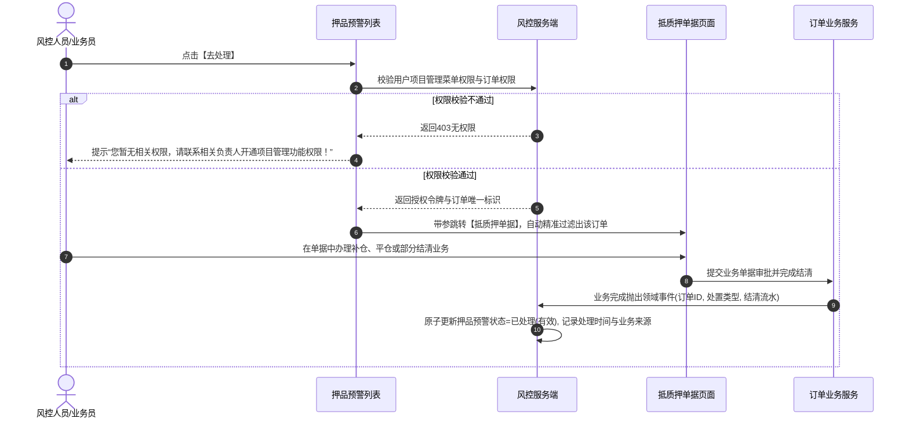

# 押品预警信息主需求文档

> **版本**：V1.8 | 2026-08-19
> **读者**：研发工程师、测试工程师、风控经理、信贷审批员、架构师
> **编写依据**：[押品预警信息字段清单](./押品预警信息字段清单.md)、[押品预警信息业务规则规格](./押品预警信息业务规则规格.md)、[押品预警信息业务流程](./押品预警信息业务规则规格.md)
> **字段基准**：`押品预警信息字段清单.md` 是本模块所有业务字段与系统字段的唯一定义来源；本主 PRD 负责业务逻辑、操作规范、状态机流转与跨系统联动闭环。

---

## 1. 业务背景

在供应链金融动产质押与存货监管业务中，质押物价值下跌、质押率突破警戒线、解押超时、盘点巡检缺失或风控模型预警，直接威胁资金方贷款安全。
**押品预警信息**是订单级与押品级风险流水的承接中枢与处置工作台。它承接由 [01订单预警配置](../../08-配置管理/19-风险管理-订单预警配置/订单预警配置主PRD.md) 与携带订单上下文的设备事件触发的 11 类预警，提供**固定模板风险描述生成、列表展示去重、跳转单据处理（补仓/平仓/部分结清）、超时升级及发起风险公示**的全流程闭环。

---

## 2. 功能范围

### 2.1 本期范围
- **预警流水列表与复合检索**：支持按订单号（模糊）、预警类型（11 类）、处理状态（未处理/已处理/已失效）、货主名称、货物名称、预警时间范围检索；
- **固定模板风险内容生成**：涵盖解质押超时、价格下跌、抵/质押率异常、盘点/巡检异常、贷中风控预警等标准文案动态组装；
- **展示去重与快照固化**：未处理按“订单+预警类型+内容”去重展示；已处理按业务类型去重投影；原始快照只读防篡改；
- **业务跳转与处置流转**：点击【去处理】跳转【抵质押单据】办理补仓、平仓或结清；业务完成后联动解除预警；
- **人工核查与自动解除**：支持价格下跌等类型的人工核查解除；支持估值恢复自动解除；
- **风险公示联动**：支持对“已处理（有效）”的风险流水发起单条/批量风险公示；
- **安全与审计**：基于订单数据权限隔离、全路径操作审计与防并发锁。

### 2.2 移动端范围
- 移动端支持押品预警列表查看、预警详情查看与人工核查处理。

### 2.3 不在本期范围
- 纯设备物理状态告警（归属 [01设备预警信息](../05-风险信息-设备预警信息/设备预警信息主PRD.md)）；
- 抵质押单据内部审批与解押业务流（归属抵质押单据业务模块）；
- 风险对外披露大屏展示与取消公示（归属 [05风险公示](../09-风险信息-风险公示/风险公示主PRD.md)）。

---

## 3. 模块定位与上下游关系

### 3.1 系统位置

| 项目 | 内容 |
| :--- | :--- |
| **模块层级** | 风险信息与处置层（核心订单押品风控工作台） |
| **核心职责** | 承接订单级风险流水，驱动业务处置、核销解除、超时升级与公示流转 |
| **上游依赖** | [01订单预警配置](../../08-配置管理/19-风险管理-订单预警配置/订单预警配置主PRD.md)、抵质押单据、估值引擎、[04贷中风控管理](../08-风险信息-贷中风控管理/贷中风控管理主PRD.md) |
| **下游引用** | [05风险公示](../09-风险信息-风险公示/风险公示主PRD.md)、抵质押单据处置、风控审计日志 |
| **业务单据** | 本模块维护订单风险流水单据，拥有独立的处置状态机 |

### 3.2 预警内容固定模板规范

| 预警大类 | 预警内容标准模板 | 变量来源与快照规则 |
| :--- | :--- | :--- |
| **解抵/质押超时** | `当前抵/质押物 品类-规格（数量+单位）未在 YYYY年MM月DD日 完成解抵/质押！（预警阈值xxx天）` | 变量取触发时订单二维码/批次快照 |
| **解监管超时** | `当前监管物 品类-规格（数量+单位）未在 YYYY年MM月DD日 完成解监管！（预警阈值xxx天）` | 变量取触发时监管单批次快照 |
| **价格下跌** | `抵/质押物价值下跌！当前订单货物价值已下跌超过xx%（预警阈值 xx%）` | 变量取触发时货值下跌比例与阈值 |
| **盘点异常** | `盘点异常！经盘点发现货物异常，请及时核查处理！` | 标准固定文案 |
| **巡检异常** | `巡检异常！【巡检人】未按时巡检盘点，请及时核查处理！` | 变量取触发时未按时巡检的人员姓名 |
| **抵/质押率异常** | `订单抵/质押率异常！本次触发【预警线名称】，发生预警时订单抵/质押率为xx%，贷款余额为xx.xx元，质物价值为xx.xx元（预警阈值xx%）` | 变量取命中预警线（补仓线/平仓线）时的实际比例、贷款余额与质物价值快照 |
| **贷中风控预警** | `模型名称：【模型名称】；模型分数：【模型分数】；预警描述：【结果描述】` | 变量取智风控平台异步返回的最终拒绝结果快照，分数缺失展示 `--` |

---

## 4. 页面与字段规则

### 4.1 字段引用基准
- 列表字段、筛选字段、固定模板变量及快照字段严格以 [押品预警信息字段清单](./押品预警信息字段清单.md) 为准。

### 4.2 数据可见范围与权限控制

| 场景 | 可见范围与控制规则 | 服务端安全机制 |
| :--- | :--- | :--- |
| **预警列表 / 详情** | 仅展示当前登录账号拥有**订单数据权限**的押品预警流水 | 服务端强制按账号订单权限过滤 |
| **订单号跳转** | 点击订单号使用订单唯一标识跳转，服务端重新校验订单详情权限 | 禁止客户端通过修改 URL 参数越权访问其他订单 |
| **去处理 (抵质押单据)** | 必须具备【项目管理/抵质押单据】菜单权限；无权限提示并拦截 | 强校验菜单功能权限与订单归属 |
| **解除预警 / 公示风险** | 必须具备对应按钮操作权限且拥有订单权限 | 服务端二次校验记录状态与乐观锁 Version |

---

## 5. 操作功能详解

### 5.1 操作总览

| 操作名称 | 入口 | 适用状态 | 前置条件 | 是否改变流水状态 | 联动下游影响 |
| :--- | :--- | :--- | :--- | :---: | :---: |
| **查看详情** | 列表操作列 | 全部 | 拥有订单权限 | 否 | 查看快照与处理记录 |
| **去处理** | 列表操作列 / 详情 | 未处理（有效） | 拥有项目管理权限与订单权限 | 否 | 精确跳转抵质押单据办理业务 |
| **解除预警** | 列表操作列 / 详情 | 未处理（有效）且支持人工类型 | 拥有处理权限与订单权限 | 是 | 状态变为已处理（有效） |
| **公示风险** | 列表操作列 / 详情 | 已处理（有效） | 拥有风险公示权限 | 否（公示侧建副本） | 联动 [05风险公示] 模块 |
| **批量公示** | 列表顶部操作栏 | 已处理（有效）且未公示 | 拥有批量公示权限 | 否（公示侧建副本） | 批量向 [05风险公示] 生成记录 |

---

### 5.2 业务处置与【去处理】流转

---

### 5.3 单条与批量公示风险流转
- **单条入口分流**：
  - 点击【公示风险】，服务端先查询该预警是否已存在公示记录；
  - 若已存在公示记录，直接打开 [05风险公示] 详情页查看最新公示内容与历史操作记录；
  - 若不存在公示记录且当前预警为“已处理（有效）”，则打开“风险公示信息确认”页，读取原预警快照生成公示初始副本；
- **批量公示候选**：
  - 仅允许筛选出“状态为已处理（有效）且从未产生过公示记录”的预警，勾选后批量提交至风险公示模块。

---

## 6. 异常处理与安全保障

1. **订单失效联动**：订单货物全部出库、完成解押或解除监管时，关联的未处理押品预警自动更新为 `未处理（无效）`，停止升级通知；
2. **快照不可篡改**：预警发生时的贷款余额、质物价值、质押率、模型分数等核心数据在落库时固化为快照，严禁以查询时的实时数据覆盖历史事实；
3. **超时升级机制**：未解除预警持续超过配置的“升级预警天数”时，系统自动触发升级通知，发送至升级预警对象。

---

## 7. 验收标准与测试用例

| 用例编号 | 测试场景 | 前置条件 | 预期输出与系统行为 |
| :---: | :--- | :--- | :--- |
| **COL-TC01** | 固定模板文案组装 | 抵/质押率达到补仓线触发预警 | 列表与详情准确展示预警线名称、触发时质押率、贷款余额与质物价值快照 |
| **COL-TC02** | “去处理”无菜单权限拦截 | 用户无项目管理菜单权限 | 点击“去处理”，弹出友好提示并拦截跳转 |
| **COL-TC03** | 抵质押业务办结后自动解除 | 订单因质押率异常告警 | 用户在抵质押单据完成补仓审批后，该预警自动转为“已处理（有效）” |
| **COL-TC04** | 单条公示风险分流 | 预警已有公示记录 | 点击【公示风险】，系统直接进入公示详情页，不进入首次确认页 |
| **COL-TC05** | 批量公示候选准确性 | 列表包含未处理、已处理未公示、已公示记录 | 点击批量公示，候选弹窗中仅出现“已处理且从未公示”的记录 |

---

## 8. 引用文档与修订记录

### 8.1 关联文档
- [押品预警信息字段清单](./押品预警信息字段清单.md)
- [押品预警信息业务规则规格](./押品预警信息业务规则规格.md)
- [押品预警信息业务流程](./押品预警信息业务规则规格.md)
- [订单预警配置主PRD](../../08-配置管理/19-风险管理-订单预警配置/订单预警配置主PRD.md)
- [风险公示主PRD](../09-风险信息-风险公示/风险公示主PRD.md)
- [押品预警信息字段清单](./押品预警信息字段清单.md)

### 8.2 修订记录

| 日期 | 版本 | 修订人 | 修订内容 |
| :--- | :---: | :---: | :--- |
| 2026-08-19 | V1.8 | 产品团队 | 深度对齐 6.1 主 PRD 标准，细化 11 类模板快照、单据跳转处置流、单条/批量公示联动及测试矩阵。 |
| 2026-08-18 | V1.0 | 产品团队 | 初版发布。 |
