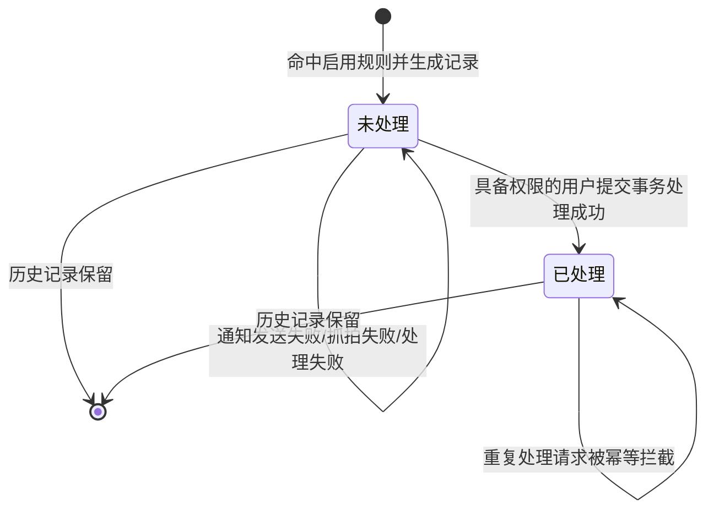
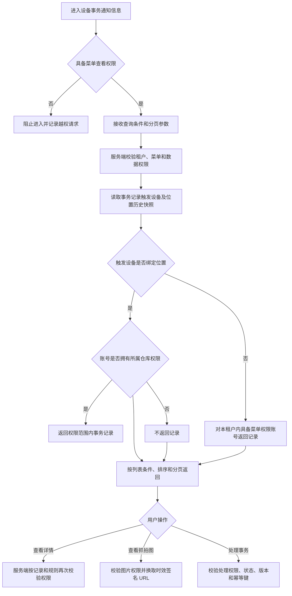
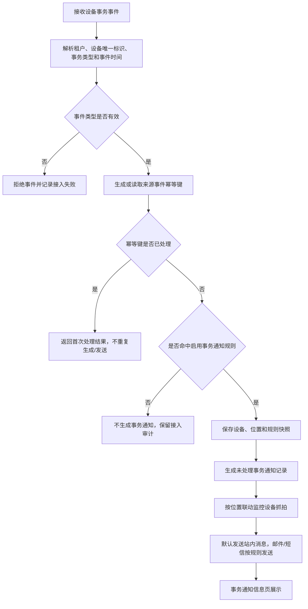
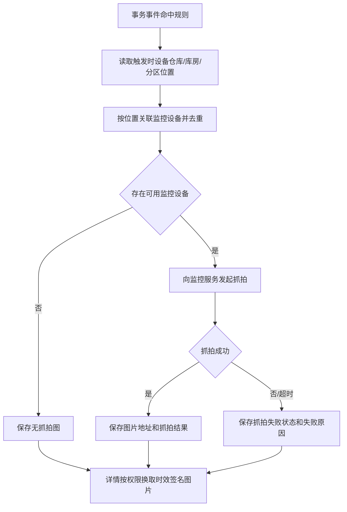
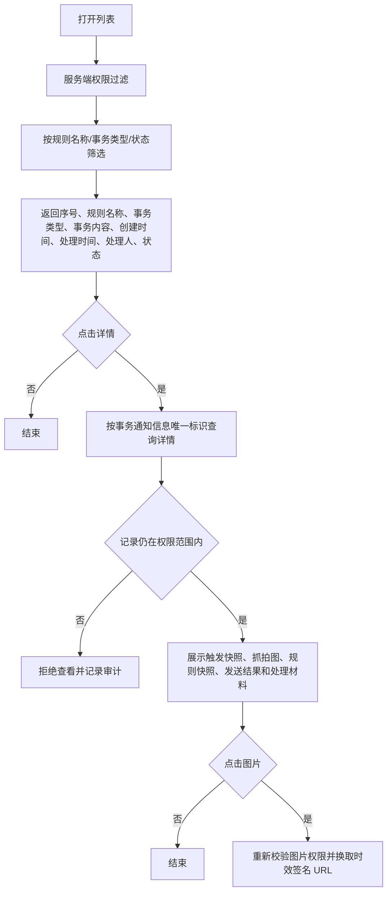
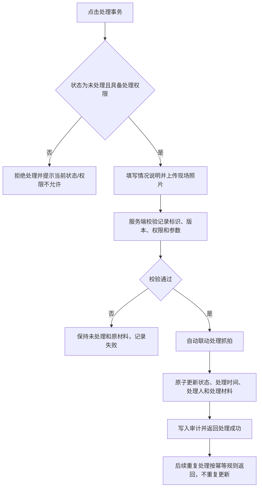

# 设备事务通知信息业务规则规格

> **文档定位**：设备事务通知信息的能力边界、权限、事务生成、幂等、列表展示、图片安全、人工处理、通知发送、历史记录、并发和审计规则的唯一定义来源。字段口径引用[设备事务通知信息字段清单](./设备事务通知信息字段清单.md)，事务规则匹配引用[设备事务通知配置业务规则规格](../../08-配置管理/21-风险管理-设备事务通知配置/设备事务通知配置业务规则规格.md)，设备主数据和位置引用设备管理模块。
>
> **版本**：V1.1 | 2026-08-18

## 一、能力边界与术语

| 项目 | 当前规则 |
| :--- | :--- |
| 业务对象 | 设备实际发生开锁、关锁、上线、移除等瞬时事务后，按启用事务通知规则生成的一条事务通知记录 |
| 事务类型 | 开锁通知、关锁通知、设备上线、设备移除；具体事务子类型由设备事务事件协议提供 |
| 规则来源 | 事务通知配置页面保存的主规则及其事务类型明细；记录保存触发时规则快照 |
| 记录状态 | 未处理、已处理；新记录为未处理，人工处理成功后为已处理 |
| 记录有效性 | 不单独建立有效/无效字段；事务通知不采用设备预警的风险有效性模型 |
| 处理方式 | 当前版本四类事务均按人工处理口径设计；处理权限、情况说明、现场照片和处理抓拍按本模块执行 |
| 风险预警关系 | 事务通知与设备预警、押品预警分开存储和处理；事务记录不直接解除、覆盖或改变预警记录 |
| 订单类型分页 | 本次不实施；未来按可扩展订单类型和订单数据权限扩展，不把抵质押监管订单写死为唯一类型 |

事务通知是即时事件消息，不提供设备预警的自动解除、定时提醒、升级通知、未处理去重或风险公示能力。相同设备事件若同时命中事务通知和设备预警规则，分别生成各自业务记录。

## 二、权限与数据范围

| 规则ID | 规则 |
| :--- | :--- |
| EVT-I01 | 用户须具备设备事务通知信息菜单查看权限，才可进入信息列表；详情、图片查看和事务处理权限分别校验。 |
| EVT-I02 | 事务通知配置页的规则可见性按规则绑定设备过滤：当前账号仓库权限与单条规则绑定设备中的任意一个设备仓库权限相匹配时展示该规则；规则绑定设备均未绑定仓库时，对具备配置菜单查看权限的用户展示。 |
| EVT-I03 | 事务通知信息页按实际触发设备的位置过滤：触发设备已绑定位置时，账号须拥有该设备所属仓库数据权限；触发设备未绑定具体位置时，对本租户内具备信息菜单查看权限的所有账号展示。该规则不沿用配置页“规则绑定设备任一命中”的可见条件。 |
| EVT-I04 | “所有人可见”只表示不受仓库绑定过滤，仍受租户隔离、菜单权限、详情权限、图片权限和处理权限约束。 |
| EVT-I05 | 规则绑定设备已经删除、移除、逻辑删除或权限撤销时，已生成的事务通知记录不因设备变化删除；历史记录继续使用触发时设备和位置快照。 |
| EVT-I06 | 列表、详情、图片换取、处理和重试接口必须由服务端重新校验租户、菜单、触发设备所属仓库数据权限、记录状态和版本；触发设备未绑定具体位置时不要求仓库数据权限，不能以客户端传入的设备、规则、分页或图片参数替代权限判断。 |
| EVT-I07 | 订单类型分页暂不开放。未来扩展时，订单类型使用可扩展枚举；账号只有在具备同类型订单数据权限时才可见对应规则和记录。 |
| EVT-I08 | 设备移除通知只由设备管理服务产生的正式“移除成功”领域事件触发；权限撤销、逻辑删除、注销、网络离线或移除失败不自动推断为设备移除事务。 |

## 三、事务事件与记录生成

### 3.1 触发条件

| 规则ID | 规则 |
| :--- | :--- |
| EVT-T01 | 开锁/关锁事务由设备事务接口或门禁事务记录提供；事件有效接收且命中启用规则时生成事务通知。 |
| EVT-T02 | 设备上线包括新设备首次同步上线和系统内已有设备由离线变为上线；具体新设备识别和设备身份复用规则继承事务通知配置及设备管理模块。 |
| EVT-T03 | 设备移除仅在设备管理服务完成用户发起的移除操作并返回成功后抛出领域事件时触发；移除失败必须保持设备原状态和原关联，不生成事务通知。 |
| EVT-T04 | 事件命中规则时，服务端按租户、事务类型、设备唯一标识和规则状态重新校验设备范围及仓库权限，不能只依赖事件请求中的规则 ID或设备列表。 |
| EVT-T05 | 停用或删除的事务通知规则不匹配新事件；已生成的通知记录不回溯删除、不回溯重发。 |
| EVT-T06 | 事件缺少租户、设备唯一标识、事务类型或无法确定来源时，不生成事务通知记录；接入失败原因、请求标识和原始事件摘要按权限脱敏后写入审计。 |

### 3.2 记录快照

| 规则ID | 规则 |
| :--- | :--- |
| EVT-T11 | 事务记录必须保存事务通知信息唯一标识、来源事件唯一标识、设备唯一标识、设备名称、设备类型、设备编码、仓库/库房/分区/具体位置、事务类型、事务内容、事务触发时间和规则版本快照。 |
| EVT-T12 | 设备、位置或规则后续改名、改绑、移除、权限变化、停用或删除，不得回写已生成事务通知的历史快照。 |
| EVT-T13 | 事务内容由事件子类型、设备信息、触发位置和事件描述组合生成；必要字段缺失时展示 `-`，不得使用查询时或处理时实时主数据补造触发事实。 |

## 四、幂等、去重与通知生成

| 规则ID | 规则 |
| :--- | :--- |
| EVT-U01 | 同一事件使用“租户 + 设备唯一标识 + 事务类型 + 来源事件唯一标识”执行幂等；三方无事件 ID 时由服务端基于稳定事件输入生成等效幂等键。 |
| EVT-U02 | 幂等键必须与事务通知记录在同一事务或等效一致性机制中落库；重复事件返回首次处理结果，不重复生成记录、抓拍或发送即时通知。 |
| EVT-U03 | 事务通知不按“同一设备 + 事务类型”合并未处理记录，不采用设备预警的分类去重和无效覆盖规则；不同来源事件即使内容相同，也按不同事件处理。 |
| EVT-U04 | 事务记录的生成、幂等键写入和初始状态写入必须具备服务端并发锁、唯一约束或等效机制，防止重复消费产生重复记录。 |
| EVT-U05 | 命中启用规则后生成一条状态为“未处理”的通知记录，并默认发送站内消息；邮件、短信按规则配置发送。 |
| EVT-U06 | 发送失败不回滚事务通知记录；发送状态、失败原因、请求标识和重试关联键必须保存，重试只能更新发送结果，不得生成新事务通知。 |
| EVT-U07 | 通知发送前校验接收账号启用状态、租户和数据权限；停用账号跳过发送并记录跳过原因。 |
| EVT-U08 | 事务通知不设置升级通知、定时提醒或风险公示；事务通知发送结果不改变事务记录处理状态。 |

## 五、列表、详情与图片规则

| 规则ID | 规则 |
| :--- | :--- |
| EVT-D01 | 列表字段顺序为：序号、事务通知规则名称、事务类型、事务内容、创建时间、处理时间、处理人、状态、操作；`操作`属于交互列，不作为业务字段。 |
| EVT-D02 | 事务通知规则名称支持模糊匹配；事务类型支持多选精确匹配；状态支持“未处理/已处理”精确匹配；页面采集中的匿名控件不在未确认前擅自固化为业务字段。 |
| EVT-D03 | 列表默认按事务触发时间倒序展示；分页、排序和筛选参数必须服务端校验，序号仅为当前页展示序号。 |
| EVT-D04 | 详情按事务通知信息唯一标识查询，展示触发快照、规则快照、事务内容、抓拍图、通知发送结果和处理材料；不得使用列表序号作为接口主键。 |
| EVT-D05 | 详情不提供新增或常规编辑；只有状态为“未处理”且用户具备事务处理权限时展示处理入口。已处理记录只读展示。 |
| EVT-D06 | 列表不直接加载真实抓拍图片，默认展示占位状态；点击预览后由后端重新校验租户、菜单、仓库权限和图片关联关系，再返回时效签名 URL。 |
| EVT-D07 | 无可用监控时展示 `无抓拍图`；第三方抓拍失败或超时展示 `抓拍失败`；不得以破损图片、永久 URL或未授权图片替代状态展示。 |
| EVT-D08 | 事务触发抓拍图和事务处理抓拍图分别保存，处理提交的新抓拍不得覆盖事务触发时抓拍；图片查看、签名换取、失败和越权拦截均记录审计。 |

## 六、事务处理与状态规则

| 规则ID | 规则 |
| :--- | :--- |
| EVT-H01 | 当前版本按四类事务均需人工处理设计；处理动作仅改变事务通知记录状态，不改变设备预警或押品预警状态。是否存在免处理或系统自动处理场景待历史规格确认。 |
| EVT-H02 | 只有状态为“未处理”且具备事务处理权限的用户可以提交处理；处理接口必须使用事务通知信息唯一标识、记录版本和服务端认证身份。 |
| EVT-H03 | 情况说明为条件必填文本域，长度不超过200个字符；现场照片可选，支持 `jpg`、`png`、`jpeg`，单个文件不超过5 MB，最多10个。 |
| EVT-H04 | 事务处理提交时自动发起现场监控抓拍；无监控保存 `无抓拍图`，失败或超时保存 `抓拍失败`，不得伪造图片地址。 |
| EVT-H05 | 处理成功必须原子更新状态、处理时间、处理人、情况说明、现场照片、事务处理抓拍图关联和审计日志；状态由“未处理”变更为“已处理”。 |
| EVT-H06 | 处理失败、权限失败、参数校验失败、版本冲突或并发锁失败时，原状态、处理时间、处理人和处理材料保持不变，并记录失败原因。 |
| EVT-H07 | 已处理记录不可再次编辑处理材料；重复处理请求按幂等规则返回已处理结果，不覆盖首次处理人、处理时间或材料。 |
| EVT-H08 | 事务通知不存在“未处理（无效）”或“已处理（有效）”组合状态；规则删除、设备删除、发送失败和抓拍失败不得把状态改写为预警无效状态。 |

## 七、抓拍范围与图片安全

| 规则ID | 规则 |
| :--- | :--- |
| EVT-PH01 | 抓拍范围按触发设备保存的仓库、库房、分区位置及监控联动规则计算，不跨租户、跨仓库或扩大到无关位置。 |
| EVT-PH02 | 同一事务触发范围内命中的监控设备按设备唯一标识去重；多次抓拍请求不得因重试生成重复事务通知记录。 |
| EVT-PH03 | 图片记录至少保存图片关联标识、来源监控设备、抓拍时间、抓拍结果、失败原因和事务通知信息唯一标识；敏感原始地址不得直接暴露给前端。 |
| EVT-PH04 | 图片 URL 使用时效签名；换取图片时同时校验租户、菜单、仓库数据权限、事务记录权限和图片关联关系，签名过期或权限撤销时不得返回真实地址。 |
| EVT-PH05 | 抓拍失败不影响事务记录生成或人工处理状态，但必须记录抓拍请求、失败原因、重试关联键和最终结果。 |

## 八、规则变化、设备变化与历史记录

| 场景 | 当前处理 |
| :--- | :--- |
| 修改通知对象、渠道或模板参数 | 仅对后续新事务生效；已生成记录保留触发时通知对象、渠道和内容快照，不回溯重发 |
| 修改关联设备或“针对新设备”配置 | 仅影响后续事件；新增设备关联按配置模块重新校验仓库权限、事务类型唯一性和版本 |
| 停用规则 | 规则状态改为停用，停止匹配新事件；历史事务通知记录保留 |
| 删除规则 | 配置不再参与新事件匹配；已生成事务通知记录保留，不能物理删除历史记录 |
| 设备删除/移除/逻辑删除 | 历史通知使用触发时设备和位置快照；只有正式移除成功事件才触发设备移除通知 |
| 设备权限撤销 | 不因权限撤销自动生成移除通知；历史记录按当前账号数据权限决定是否可见，服务端不得泄露越权数据 |
| 设备重新上线 | 按新设备或系统内已有设备规则匹配新事件；不得因为历史通知存在而重复生成同一上线事件 |
| 订单类型扩展 | 当前不实施订单类型分页；未来按可扩展订单类型和订单数据权限增加独立规则，不改变当前设备事务记录模型 |

## 九、并发、审计与安全

- 事务事件接入、规则匹配、记录生成、通知发送结果更新、抓拍结果更新和人工处理必须使用事件幂等键、版本校验、数据库唯一约束、分布式锁或等效机制。
- 并发处理同一记录时，只有一个请求可以成功从“未处理”更新为“已处理”；其他请求必须失败或返回首次成功结果，不得覆盖处理材料。
- 审计至少记录租户、规则唯一标识、事务通知信息唯一标识、来源事件、设备唯一标识、事务类型、规则版本、操作人、角色、时间、IP、请求标识、前后状态、发送结果、抓拍结果、处理材料和失败原因。
- 查询、详情、图片查看、图片越权拦截、事件接入失败、通知失败、抓拍失败、处理失败和重试均需留痕；手机号、邮箱、原始事件、图片地址等敏感信息按权限脱敏。
- 服务端不得信任客户端传入的处理人、租户、仓库、设备列表、规则状态或图片地址；所有敏感字段以认证身份和服务端查询结果为准。

## 十、历史兼容与待确认边界

- 2025-07-21 历史规则：配置页设备类型分页按单条规则绑定设备的仓库权限判断；规则绑定设备均未绑定仓库时，在租户和菜单权限范围内展示。当前信息页已按最终确认口径改为实际触发设备位置过滤；删除设备不删除已生成事务通知记录。
- 2025-07-21 历史规则：订单类型分页本次不实施；未来应支持融资订单、需求发布订单及其他订单类型，订单类型必须可扩展，不能固定为抵质押监管订单。
- 2025-07-21 早期规格仅明确开锁/关锁；当前配置规格已增加设备上线、设备移除，当前事务类型以四类配置枚举为准，具体子类型待设备事务协议确认。
- 设备移除必须区分人工移除成功、权限撤销、逻辑删除、注销、网络离线和移除失败；当前只有人工移除成功领域事件触发设备移除通知。
- 事务通知记录与设备预警、押品预警记录分开存储；任何事务状态变更不得直接回写风险预警状态。
- 当前版本按用户口径统一要求人工处理；是否存在某些事务类型仅通知不处理、由系统自动标记已处理或需要按角色分级处理，待历史规格确认。
- 事务触发抓拍和处理提交抓拍的具体位置展开、失败重试、图片保留周期和监控设备选择优先级，待设备对接规格确认。
- 页面采集中的匿名筛选控件、事务内容具体模板、通知模板变量及发送结果详情展示方式，待历史页面规格和三方协议确认。

## 十一、待优化与待补项

| 编号 | 项目 | 当前处理 | 后续建议 |
| :--- | :--- | :--- | :--- |
| OPT-01 | 事务事件具体子类型与编码 | 当前保留事务大类和事件协议子类型入口 | 补充设备事务接口字段、事件 ID、发生时间、事件内容和设备身份映射 |
| OPT-02 | 规则绑定设备权限与事务记录快照权限的联动 | 配置页按规则绑定设备，信息页按实际触发设备位置，并保留触发时设备快照 | 明确规则绑定设备变更、触发设备权限撤销和历史记录可见性的接口时序 |
| OPT-03 | 处理范围与角色矩阵 | 当前四类事务统一人工处理 | 补充角色×菜单×按钮×仓库数据范围矩阵，逐项确认处理权限 |
| OPT-04 | 抓拍与发送失败补偿 | 当前保存失败状态和重试关联键 | 补充重试次数、退避策略、补偿任务、图片保留及第三方 SLA |
| OPT-05 | 订单类型扩展 | 当前不实施 | 订单类型扩展时新增订单数据权限和跨模块跳转规则，不改写设备事务记录历史 |

---

## 业务流程与联动

> 以下内容由原《设备事务通知信息业务流程》合并，与上文规则 ID 配合阅读；重复的状态机定义以上文为准。

> **文档定位**：设备事务通知信息的权限查询、事务接入、通知生成、列表展示、详情查看、抓拍、人工处理和异常补偿流程。字段定义引用[设备事务通知信息字段清单](./设备事务通知信息字段清单.md)，规则定义引用[设备事务通知信息业务规则规格](./设备事务通知信息业务规则规格.md)，事务规则匹配引用[设备事务通知配置业务规则规格](../../08-配置管理/21-风险管理-设备事务通知配置/设备事务通知配置业务规则规格.md)。
>
> **版本**：V1.1 | 2026-08-18

## 一、业务范围与状态

设备事务通知信息承接设备开锁、关锁、上线、移除等瞬时事务事件。它与设备预警信息、押品预警信息分开存储和处理：事务通知不建立风险有效性，不自动解除，不生成升级任务，也不按预警类型合并记录。

状态只表示本条事务通知是否完成人工处理。设备删除、规则停用、规则删除和通知发送失败均不改变已生成记录的状态。

## 二、页面进入与权限查询流程

1. 事务通知配置页继续使用“规则绑定设备”权限规则：账号仓库权限命中单条规则绑定设备中的任意设备时展示整条规则；规则绑定设备均未绑定仓库时，对具备配置菜单查看权限的用户展示。
2. 事务通知信息页改用“实际触发设备位置”权限规则：触发设备已绑定位置时，按该设备所属仓库的数据权限过滤；触发设备未绑定具体位置时，对本租户内具备信息菜单查看权限的所有账号展示。
3. “所有人可见”仅表示不受仓库绑定过滤，不表示绕过租户隔离、菜单权限、详情权限、图片权限或事务处理权限。
3. 订单类型分页本次不实施；未来扩展时按可扩展订单类型和订单数据权限判断，不把抵质押监管订单写死为唯一类型。

## 三、设备事务事件接入与记录生成流程

### 3.1 事务类型分支

| 事务类型 | 触发条件 | 不触发条件 |
| :--- | :--- | :--- |
| 开锁通知 | 接收到有效开锁事务事件，且命中启用规则 | 事件无效、重复上报、规则停用或未命中设备范围 |
| 关锁通知 | 接收到有效关锁事务事件，且命中启用规则 | 事件无效、重复上报、规则停用或未命中设备范围 |
| 设备上线 | 新设备首次同步上线，或系统内已有设备由离线变为上线，并命中对应规则 | 未产生有效上线结果、规则停用、设备不在规则范围 |
| 设备移除 | 设备管理服务完成人工移除并产生“移除成功”领域事件，且命中启用规则 | 权限撤销、逻辑删除、注销、网络离线、移除失败或仅本地状态变化 |

### 3.2 生成后的处理

1. 事件幂等键优先使用三方事件 ID；三方未提供时，由服务端使用稳定输入生成等效幂等键。相同事件跨重试只能生成一条记录。
2. 记录生成时保存设备唯一标识、设备名称、设备类型、设备编码、仓库/库房/分区/具体位置、事务类型、事务内容、规则名称、规则版本和触发时间快照。
3. 事务记录生成与幂等键落库必须在同一事务或等效一致性机制内完成，避免“记录已生成但幂等键未落库”导致重复通知。
4. 发送失败不回滚事务通知记录；发送状态、失败原因、请求标识和重试关联键写入发送结果，重试只能更新发送结果，不能生成新记录。

## 四、抓拍联动流程

- 事务触发抓拍和事务处理抓拍分别保存，不互相覆盖。
- 图片访问需同时校验租户、菜单和仓库数据权限；列表不直接返回永久图片 URL。
- 无可用监控展示 `无抓拍图`；第三方失败或超时展示 `抓拍失败`。抓拍失败不影响事务记录生成和人工处理提交，但必须留存失败审计。

## 五、列表、详情与图片查看流程

列表默认按创建时间倒序展示。事务通知信息不因同一设备、同一事务类型存在未处理记录而合并；只有同一来源事件幂等键重复上报时才返回原记录。

## 六、人工处理流程

1. 当前版本按用户口径，四类事务通知均要求人工处理；是否存在免处理或系统自动处理场景列入待确认项。
2. 情况说明不超过200个字符且必填；现场照片可选，单个文件不超过5 MB，最多10个，支持 `jpg`、`png`、`jpeg`。
3. 事务处理抓拍在提交处理时自动触发，抓拍失败保留失败状态，不伪造图片地址。
4. 处理成功后状态变更为“已处理”；成功提交后不可再次编辑处理材料。

## 七、异常、并发与补偿流程

| 场景 | 流程处理 |
| :--- | :--- |
| 无菜单权限 | 页面不进入；列表、详情、图片和处理接口均由服务端拒绝并审计 |
| 无触发设备所属仓库数据权限 | 不返回已绑定位置设备的记录；已打开页面的详情、图片和处理请求重新校验并阻断 |
| 触发设备未绑定具体位置 | 在租户和菜单权限范围内返回记录 |
| 事件无法解析或缺少必要标识 | 不生成通知记录，保留接入失败原因和请求标识 |
| 同一事件重复上报 | 返回首次幂等结果，不重复生成记录、抓拍或发送消息 |
| 规则停用/删除 | 后续事件不再匹配；历史通知记录保留 |
| 设备删除/移除 | 历史通知记录保留并展示设备快照；只有移除成功事件才触发移除通知 |
| 通知发送失败 | 保留事务记录，写入失败原因和重试键；重试不创建新记录 |
| 抓拍失败或超时 | 保存失败状态，详情展示 `抓拍失败`，不伪造图片 URL |
| 处理版本冲突 | 拒绝本次处理，保持原状态和材料，提示刷新后重试并记录审计 |
| 重复处理/并发处理 | 由记录版本和分布式锁拦截；已成功处理的重复请求不得覆盖处理人和材料 |
| 图片签名过期或权限撤销 | 不返回图片，要求重新换取；越权请求写入审计 |

## 八、修订记录

| 日期 | 变更内容 | 影响范围 |
| :--- | :--- | :--- |
| 2026-08-18 | V1.1 对齐设备预警信息和押品预警信息流程结构，补充事务接入、规则匹配、幂等、通知发送、抓拍、详情、人工处理、状态转换、异常补偿和审计流程；统一按规则绑定设备仓库权限过滤 | 设备事务通知信息全流程 |
| 2026-08-18 | V1.0 补充设备事务通知信息的仓库权限、未绑定仓库全员可见、查询、处理和异常流程 | 设备事务通知信息流程 |

## 修订记录

| 日期 | 变更内容 | 影响范围 |
| :--- | :--- | :--- |
| 2026-08-20 | — | 合并原《设备事务通知信息业务流程》至本文件「业务流程与联动」章节 |
| 2026-08-19 | V1.2 区分配置页与信息页权限：配置按规则绑定设备，信息页按实际触发设备位置；未绑定具体位置的事务记录对具备菜单权限的账号可见 | 设备事务通知信息权限 |
| 2026-08-18 | V1.1 对齐设备预警信息和押品预警信息规则结构，补充能力边界、权限、事件生成、幂等、列表详情、人工处理、抓拍、发送、历史兼容、并发和审计规则；统一按规则绑定设备仓库权限过滤 | 设备事务通知信息全规则 |
| 2026-08-18 | V1.0 补充设备事务通知信息的仓库权限、未绑定仓库全员可见、历史快照、处理和审计规则 | 设备事务通知信息查询、详情、处理和图片权限 |
