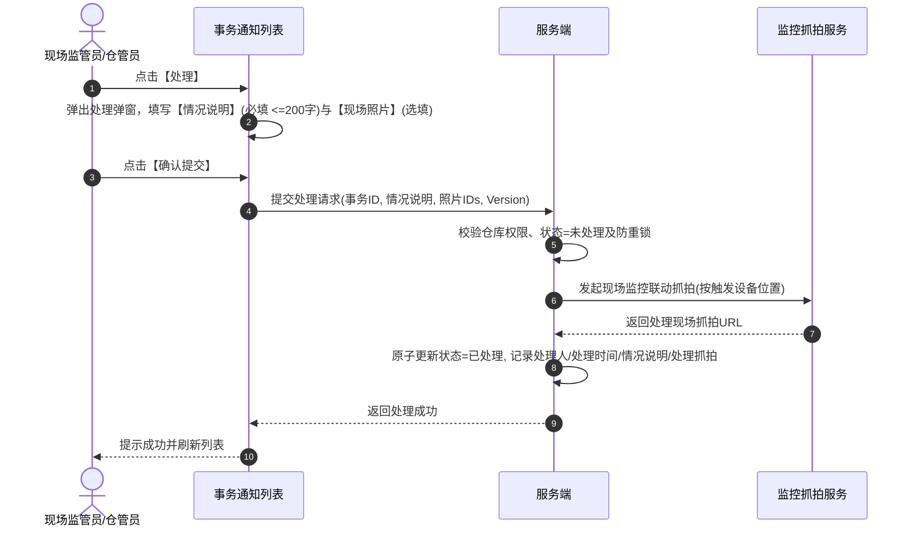

# 设备事务通知信息主需求文档

> **版本**：V1.8 | 2026-08-19
> **读者**：研发工程师、测试工程师、物联网产品经理、仓储管理员
> **编写依据**：[设备事务通知信息字段清单](./设备事务通知信息字段清单.md)、[设备事务通知信息业务规则规格](./设备事务通知信息业务规则规格.md)、[设备事务通知信息业务流程](./设备事务通知信息业务规则规格.md)
> **字段基准**：`设备事务通知信息字段清单.md` 是本模块所有业务字段与系统字段的唯一定义来源；本主 PRD 负责业务逻辑、操作规范、状态机流转与跨系统联动闭环。

---

## 1. 业务背景

在仓储监管日常业务中，门禁刷卡、挂锁开关、新设备首次同步及设备主动移除等属于**瞬时发生的操作事件**。
**设备事务通知信息**作为仓储日常操作与运维消息的明细台账，记录所有命中 [03设备事务通知配置](../../08-配置管理/21-风险管理-设备事务通知配置/设备事务通知配置主PRD.md) 的事务事件。区别于风险预警的持续告警与升级机制，事务通知属于即时到达的消息记录，提供**人工核查处理（情况说明、现场照片、联动处理抓拍）与消息推送审计**，支撑仓储日常作业溯源与责任界定。

---

## 2. 功能范围

### 2.1 本期范围
- **事务通知列表与检索**：支持按规则名称（模糊）、事务类型（开锁/关锁/上线/移除）、状态（未处理/已处理）、创建时间范围组合筛选；
- **即时流水记录与快照**：记录触发时的设备名称、设备编码、仓库/库房/分区位置、事务类型、事务内容及时间快照；
- **人工核查处理**：支持未处理记录提交人工处理（情况说明必填 <=200字、现场照片选填、自动发起现场监控处理抓拍）；
- **图片安全与时效签名**：列表默认展示占位状态，用户点击后通过后端鉴权接口换取临时时效签名 URL 查看抓拍与照片；
- **通知发送状态追溯**：记录站内信、邮件、短信的发送结果、失败原因及重试关联键；
- **安全与审计**：基于仓库数据权限隔离、全路径操作审计与防重复处理锁。

### 2.2 移动端范围
- 移动端支持事务通知列表浏览、详情查看与现场人工处理提交。

### 2.3 不在本期范围
- 事务通知推送规则与通知人员维护（归属 [03设备事务通知配置](../../08-配置管理/21-风险管理-设备事务通知配置/设备事务通知配置主PRD.md)）；
- 硬件物理异常与破坏告警（归属 [01设备预警信息](../05-风险信息-设备预警信息/设备预警信息主PRD.md)）；
- 远程开锁与门禁授权控制（归属 [01设备管理/02门禁设备](../../02-仓储/17-设备管理-门禁设备/门禁设备字段清单.md)）。

---

## 3. 模块定位与上下游关系

### 3.1 系统位置

| 项目 | 内容 |
| :--- | :--- |
| **模块层级** | 风险信息与处置层（仓储日常操作事务台账） |
| **核心职责** | 承接开锁/关锁/上线/移除即时流水，提供人工核查处理、抓拍留痕与推送审计 |
| **上游依赖** | 门禁/门锁事件接入、设备管理移除领域事件、[03设备事务通知配置](../../08-配置管理/21-风险管理-设备事务通知配置/设备事务通知配置主PRD.md) |
| **下游引用** | 仓储日常作业审计台账、监控抓拍服务、通知中心 |
| **业务单据** | 本模块记录即时事务流水，具备 `未处理 -> 已处理` 的单向处理状态机 |

### 3.2 事务类型与处理模型

| 事务类型 | 触发源与机制 | 记录状态模型 | 处理与抓拍机制 |
| :--- | :--- | :--- | :--- |
| **开锁通知** | 门禁/挂锁上报合法开锁事件 | 未处理 / 已处理 | 触发时自动抓拍；人工处理时再次联动现场抓拍 |
| **关锁通知** | 门禁/挂锁上报合法关锁事件 | 未处理 / 已处理 | 触发时自动抓拍；人工处理时再次联动现场抓拍 |
| **设备上线** | 新设备首次接入 / 离线设备恢复上线 | 未处理 / 已处理 | 记录触发快照；人工核查处理并留痕 |
| **设备移除** | 设备管理模块主动移除设备成功 | 未处理 / 已处理 | 记录触发快照；人工核查处理并留痕 |

---

## 4. 页面与字段规则

### 4.1 字段引用基准
- 列表字段、筛选参数、处理材料及系统审计字段严格以 [设备事务通知信息字段清单](./设备事务通知信息字段清单.md) 为准。

### 4.2 数据可见范围与权限控制

| 场景 | 可见范围与控制规则 | 服务端安全控制 |
| :--- | :--- | :--- |
| **事务信息列表** | 按实际触发设备所属的**仓库数据权限**过滤；触发设备未绑定具体位置时对有菜单权限者展示 | 服务端基于用户管辖仓库列表过滤 |
| **设备删除后可见性** | 规则绑定设备已被删除或移除时，已生成的事务记录**不随之删除**，历史快照保持只读 | 数据库保留触发时设备与位置快照 |
| **处理与图片换取** | 必须具备事务处理权限及对应仓库权限 | 强校验时效签名与记录状态（已处理不可重复编辑） |

---

## 5. 操作功能详解

### 5.1 操作总览

| 操作名称 | 入口 | 适用状态 | 前置条件 | 是否改变流水状态 | 联动下游影响 |
| :--- | :--- | :--- | :--- | :---: | :---: |
| **查看详情** | 列表操作列 | 全部 | 拥有查看权限 | 否 | 查看快照、通知结果与处理材料 |
| **图片查看** | 列表图片列 / 详情 | 全部 | 拥有图片权限 | 否 | 换取签名查看抓拍或现场照片 |
| **人工处理** | 列表操作列 / 详情 | 未处理 | 拥有处理权限与仓库权限 | 是 | 状态更新为已处理，联动现场抓拍 |

---

### 5.2 事务人工处理流转

- **处理规则**：
  - 仅状态为“未处理”的记录允许提交处理；
  - 情况说明必填（<=200 字符），现场照片选填（<=10 张，单张 <=5 MB）；
  - 提交成功后状态原子更新为 `已处理`，已处理记录不可重复修改；
  - 触发抓拍与处理抓拍分别独立保存，不可相互覆盖。

---

## 6. 异常处理与安全保障

1. **事件重复接入幂等**：采用 `租户ID + 设备ID + 事务类型 + 来源事件ID` 建立唯一索引与幂等锁，重复上报事件不重复生成记录；
2. **通知发送失败隔离**：短信或邮件发送失败时，保留失败原因与重试关联键，不得影响事务记录落库；
3. **免升级与免公示设计**：事务通知不属于持续性风险，触发后即时通知，不设升级等待任务，不推送到风险公示。

---

## 7. 验收标准与测试用例

| 用例编号 | 测试场景 | 前置条件 | 预期输出与系统行为 |
| :---: | :--- | :--- | :--- |
| **EVT-I-TC01** | 开锁事件即时生成记录 | 门锁发生开锁且规则启用 | 列表即时生成一条“未处理”开锁通知记录，快照记录触发设备与位置 |
| **EVT-I-TC02** | 事务人工处理必填校验 | 打开未处理记录处理弹窗 | 情况说明留空点击提交，表单拦截并提示“情况说明不能为空” |
| **EVT-I-TC03** | 联动处理抓拍保存 | 提交有效处理材料 | 处理成功后，详情页同时展示“触发抓拍图”与“处理抓拍图”两张独立照片 |
| **EVT-I-TC04** | 设备删除后历史台账保留 | 摄像头 C 在设备管理中被删除 | 06 模块中摄像头 C 历史产生的事务记录完好保留，位置快照正常展示 |
| **EVT-I-TC05** | 已处理记录防并发重复提交 | 用户 A 与用户 B 同时处理同一条事务 | 先提交者成功变更为已处理，后提交者被拒绝并提示该记录已处理 |

---

## 8. 引用文档与修订记录

### 8.1 关联文档
- [设备事务通知信息字段清单](./设备事务通知信息字段清单.md)
- [设备事务通知信息业务规则规格](./设备事务通知信息业务规则规格.md)
- [设备事务通知信息业务流程](./设备事务通知信息业务规则规格.md)
- [设备事务通知配置主PRD](../../08-配置管理/21-风险管理-设备事务通知配置/设备事务通知配置主PRD.md)
- [设备事务通知信息字段清单](./设备事务通知信息字段清单.md)

### 8.2 修订记录

| 日期 | 版本 | 修订人 | 修订内容 |
| :--- | :---: | :---: | :--- |
| 2026-08-19 | V1.8 | 产品团队 | 深度对齐 6.1 主 PRD 标准，细化即时事务台账、人工处理抓拍留痕、快照防篡改与测试矩阵。 |
| 2026-08-18 | V1.0 | 产品团队 | 初版发布。 |
