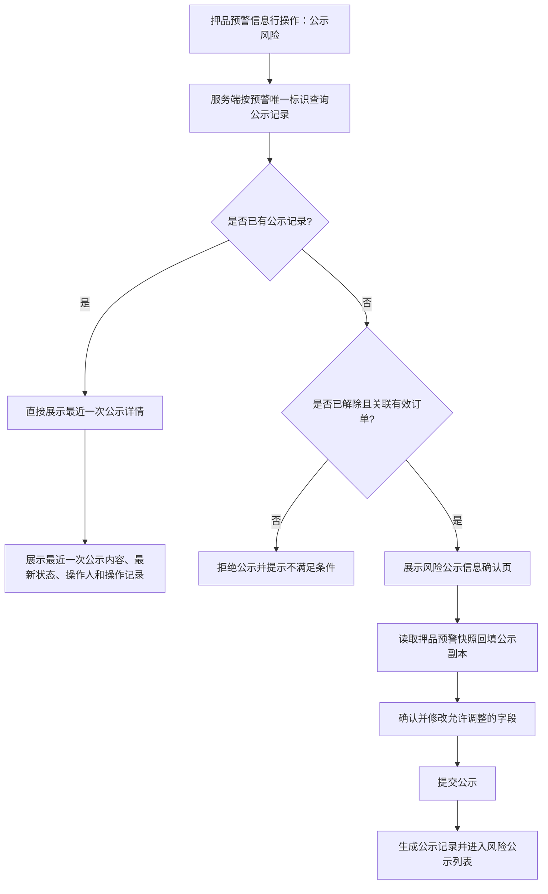
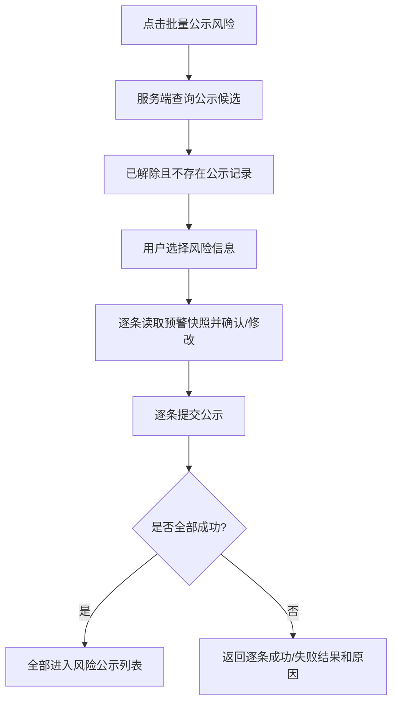
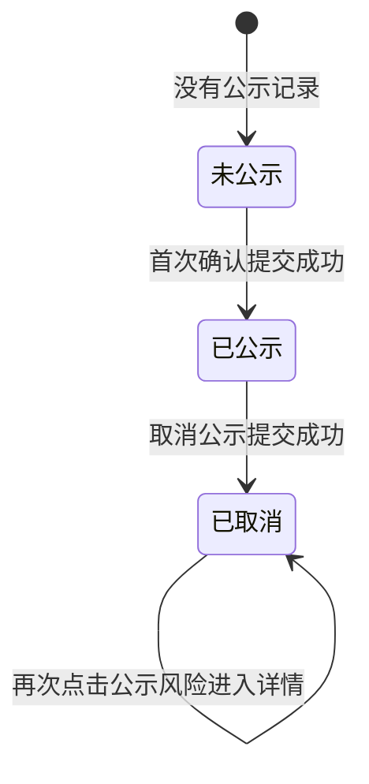

# 风险公示业务规则规格

> **文档定位**：风险公示状态机、动作约束、校验规则、权限与计算规则的唯一定义来源。主 PRD、字段清单只引用本文件规则 ID，不重复定义规则本体。

> **文档定位**：定义风险公示的记录关系、单条/批量入口、首次确认、详情查看、取消公示、权限、并发和审计规则。
>
> **版本**：V1.1 | 2026-08-18

## 一、核心定义

| 术语 | 定义 |
| :--- | :--- |
| 原预警 | 【押品预警信息】中已生成的押品预警事实，包含触发快照、处理结果和原始附件。 |
| 公示记录 | 由原预警发起、独立保存的对外展示记录，包含公示内容、公示状态、版本和操作历史。 |
| 公示快照 | 首次公示确认时从原预警读取并复制形成的初始内容；后续公示侧编辑只修改公示快照。 |
| 已解除 | 押品预警系统状态“已处理（有效）”的业务展示名称。 |
| 未公示 | 本条原预警从未产生过公示记录；取消公示后不回到该状态。 |
| 已公示 | 本条原预警存在成功提交的公示记录，当前最新公示状态为已公示。 |
| 已取消 | 本条原预警存在公示历史，且最近一次公示状态已被取消。 |

原预警与公示记录通过预警唯一标识、订单唯一标识建立关联，但不共用可变字段、不相互覆盖状态。原预警后续变化不得自动改写已生成的公示快照；公示侧的编辑、发布或取消也不得改写原预警。

## 二、权限与数据范围

| 规则ID | 规则 |
| :--- | :--- |
| RISK-PUB-P01 | 用户须具备押品预警信息菜单查看权限，才可查看来源预警；单条【公示风险】、批量【公示风险】、取消公示分别校验对应按钮操作权限。 |
| RISK-PUB-P02 | 来源预警、订单号、预警图片、公示内容和公示详情均按当前登录账号的租户、菜单和订单数据权限过滤。 |
| RISK-PUB-P03 | 用户失去订单或预警数据权限后，不得通过历史 URL、前端缓存、图片原地址或公示记录唯一标识继续查看或操作。 |
| RISK-PUB-P04 | 风险公示详情由公示 Tab 查看权限控制；发布时不选择目标机构、不按目标机构复制记录、不发送通知。 |
| RISK-PUB-P05 | 所有创建、编辑、批量提交和取消公示接口必须在服务端重新校验权限、租户和机构范围，客户端传入的操作人、机构和状态不可作为可信来源。 |

## 三、单条公示规则

| 规则ID | 规则 |
| :--- | :--- |
| RISK-PUB-S01 | 【押品预警信息】行操作中的【公示风险】以预警唯一标识发起，服务端先查询该预警是否存在公示记录。 |
| RISK-PUB-S02 | 查询到任意公示记录时，直接返回最近一次公示详情；详情必须展示最近一次公示内容、最新状态、对应操作人、操作时间和该预警全部公示操作记录。 |
| RISK-PUB-S03 | 查询不到公示记录时，只有预警状态为“已处理（有效）”、关联有效抵/质押订单或监管订单、权限有效且版本未冲突，才允许进入“风险公示信息确认”页。 |
| RISK-PUB-S04 | 首次确认页读取原预警触发/处理快照回填公示副本；允许编辑的字段按字段清单执行，保存内容只写公示记录。 |
| RISK-PUB-S05 | 首次提交成功后创建一条公示记录和首个公示版本；重复点击【公示风险】不得自动创建新记录或新版本，只进入详情。 |
| RISK-PUB-S06 | 首次确认取消、页面关闭、校验失败、权限失败或写入失败，均不得产生公示记录，不得改变原预警。 |

## 四、批量公示规则

| 规则ID | 规则 |
| :--- | :--- |
| RISK-PUB-B01 | 批量公示候选必须同时满足：原预警状态为“已处理（有效）”；关联有效抵/质押订单或监管订单；不存在任何公示记录；当前账号具备数据和批量操作权限。 |
| RISK-PUB-B02 | “不存在任何公示记录”包含从未公示的记录；已取消公示的记录仍有历史，不得重新进入批量候选。 |
| RISK-PUB-B03 | 候选列表和选择结果仅用于前端交互，提交时服务端必须逐条重新查询状态、公示记录、权限和版本。 |
| RISK-PUB-B04 | 批量提交以每条原预警为事务单元，逐条创建公示记录、快照、版本和审计日志；不得将多条原预警合并为一条公示事实。 |
| RISK-PUB-B05 | 批量部分失败时，成功项保持已公示，失败项保持无公示记录并返回逐条失败原因；不得用批量接口返回成功替代逐条落库结果。 |

## 五、取消公示规则

| 规则ID | 规则 |
| :--- | :--- |
| RISK-PUB-C01 | 取消公示只能从最新状态为“已公示”的详情页发起，必须校验取消公示按钮权限、当前公示版本和数据权限；已取消记录不重复展示或执行该操作。 |
| RISK-PUB-C02 | 确认弹窗固定展示文案：“您正在操作取消风险公示，确认后风险公示列表将取消显示当前操作的风险内容，点击确认按钮后生效。” |
| RISK-PUB-C03 | 用户确认后必须填写取消公示说明；说明不能为空且不超过200个字符，前后端均需校验。 |
| RISK-PUB-C04 | 取消成功后仅更新公示侧最新状态为“已取消”，风险公示列表不再显示当前操作的风险内容；公示详情、历史版本和操作记录继续保留。 |
| RISK-PUB-C05 | 取消公示不得改变原预警状态、处理时间、处理人、处理说明、现场照片、解除预警抓拍图、预警抓拍图或原始触发快照。 |
| RISK-PUB-C06 | 取消公示成功后，本条记录仍被视为“已公示过”；再次点击【公示风险】进入详情，不进入首次确认页和批量公示候选。 |

## 六、状态与展示规则

| 规则ID | 规则 |
| :--- | :--- |
| RISK-PUB-ST01 | 公示状态取值为“未公示、已公示、已取消”。未公示表示无公示记录；有记录后状态只可在已公示和已取消之间按操作更新，不回到未公示。 |
| RISK-PUB-ST02 | 风险公示列表只展示当前最新状态为“已公示”的记录；已取消记录不在列表展示，但可在有权限的详情和操作记录中查看。 |
| RISK-PUB-ST03 | 最近一次公示内容取最近一次提交成功的公示版本，不实时拼接原预警当前值。 |
| RISK-PUB-ST04 | 最近一次操作人由服务端根据最近一次成功状态变更记录生成；客户端不可直接写入或覆盖。 |
| RISK-PUB-ST05 | 操作记录至少包含首次提交、批量提交的逐条结果、取消公示、失败请求和版本冲突结果，按时间倒序展示且只增不改。 |

## 七、并发、幂等与审计

- 单条首次提交、批量逐条提交和取消公示必须使用幂等键、记录版本校验、分布式锁或等效机制。
- 同一预警并发首次提交时，只允许一个请求创建公示记录；其他请求必须返回“已有公示记录”，并引导进入详情，不得创建重复记录。
- 同一预警并发取消公示时，只允许一个请求更新当前版本；版本过期请求拒绝覆盖，保留已成功操作的状态和说明。
- 审计至少记录租户、预警唯一标识、订单唯一标识、公示记录唯一标识、来源入口、原始快照、公示版本、操作类型、操作人、角色、机构、时间、IP、请求标识、前后状态、字段变更前后值、取消说明、操作结果和失败原因。
- 公示图片使用带时效签名的地址；换取地址前校验租户、菜单和订单/仓库数据权限。

## 八、接口结果约束

| 场景 | 服务端结果 |
| :--- | :--- |
| 单条点击且已有公示记录 | 返回最近一次公示内容、最新状态、最新操作人和操作记录；不创建新公示记录 |
| 单条点击且无公示记录、满足条件 | 返回风险公示信息确认页所需的原预警快照和公示初始版本 |
| 单条点击且无公示记录、不满足条件 | 拒绝进入确认页，返回具体不满足原因 |
| 批量候选查询 | 只返回已解除且未产生任何公示记录的风险 |
| 批量提交 | 返回逐条成功/失败结果、生成的公示记录标识或失败原因 |
| 取消公示成功 | 返回已取消状态、取消操作人、取消时间和说明；风险公示列表隐藏当前内容 |
| 版本冲突 | 拒绝写入，原数据和公示状态保持不变，要求重新获取最新详情 |

## 九、变更记录

| 日期 | 版本 | 变更内容 |
| :--- | :--- | :--- |
| 2026-08-18 | V1.1 | 明确单条入口按公示记录分流、批量候选条件、最近一次公示详情、取消公示文案和200字说明，以及公示与原预警独立存储。 |
| 2026-08-18 | V1.0 | 初版；定义风险公示快照、编辑、公示、撤回、权限、并发和审计边界。 |

---

## 业务流程与联动

> 以下内容由原《风险公示业务流程》合并，与上文规则 ID 配合阅读；重复的状态机定义以上文为准。

> **文档定位**：定义从【押品预警信息】发起风险公示、首次确认修改、批量公示、已公示详情查看和取消公示的完整流程。风险公示字段以[风险公示字段清单](./风险公示字段清单.md)为准，业务约束以[风险公示业务规则规格](./风险公示业务规则规格.md)为准。
>
> **版本**：V1.1 | 2026-08-18

## 一、业务范围

风险公示面向资方和银行展示已解除的押品预警信息。公示内容可以关联原预警内容，但风险公示记录与原押品预警记录独立存在、相互不干扰：公示侧的编辑、发布或取消，不改变原预警的状态、处理结果、处理材料和原始审计事实。

风险公示有两种进入方式：

- 【押品预警信息】列表行操作中的【公示风险】：处理单条风险，并根据是否已有公示记录决定进入详情页或首次确认页；
- 【押品预警信息】列表的【批量公示风险】：从服务端查询可公示候选，选择后逐条生成公示记录。

## 二、单条公示入口

### 2.1 已有公示记录

服务端以预警信息唯一标识查询公示记录，不以列表按钮状态、前端缓存或列表序号判断。只要查询到一条或多条公示记录，点击【公示风险】即直接进入该风险的公示详情页，不再创建新的公示确认任务。

详情页展示：

- 最近一次成功提交的公示内容；
- 最近一次公示记录的最新状态；
- 对应的最新操作人和操作时间；
- 本条风险全部公示操作记录，按操作时间倒序展示；
- 当前公示内容关联的原预警标识，但不以原预警当前数据覆盖公示快照。

### 2.2 从未公示

服务端确认不存在公示记录后，继续校验：

1. 押品预警状态为“已处理（有效）”，业务展示名称为“已解除”；
2. 预警关联有效的抵/质押订单或监管订单；
3. 当前账号具备押品预警信息查看权限和公示风险操作权限；
4. 预警记录版本未变化，且未被其他公示请求锁定。

校验通过后打开“风险公示信息确认”页。页面从押品预警触发/处理快照生成公示初始版本，允许按字段清单修改公示副本，提交成功后生成第一条公示记录。取消确认或提交失败不产生公示记录。

## 三、批量公示风险

批量公示的可选条件固定为：

- 已解除，即押品预警状态为“已处理（有效）”；
- 从未被公示，即不存在任何公示记录，包括已取消的历史公示记录；
- 关联有效的抵/质押订单或监管订单；
- 当前账号具备对应数据权限和批量公示风险操作权限。

批量操作按每条预警独立生成公示记录、版本和审计记录，不将多条预警合并为一条风险。提交时再次校验候选条件；并发期间已被其他账号公示或取消资格的记录逐条失败，不能覆盖已有结果。部分失败不回滚已成功的其他记录。

## 四、取消公示风险

仅当公示详情的最新状态为“已公示”时，页面展示【取消公示风险】操作。点击后展示确认文案：

> 您正在操作取消风险公示，确认后风险公示列表将取消显示当前操作的风险内容，点击确认按钮后生效。

用户确认后填写取消公示说明：

- 说明必填；
- 长度不超过200个字符；
- 提交前校验非空、长度、权限和当前公示版本；
- 提交成功后，风险公示列表取消显示当前操作的风险内容；
- 公示详情仍可查看最新状态“已取消”、取消操作人、取消时间和说明；
- 取消公示不修改押品预警状态、处理时间、处理人、情况说明、现场照片、抓拍图或原始快照。

取消公示后再次从押品预警列表点击【公示风险】，由于已存在公示记录，仍直接进入公示详情页；该风险不会重新进入批量公示候选，也不会自动回到“未公示”。

## 五、状态转换

“未公示”表示从未创建过公示记录，不是可由取消公示操作回写的状态。公示状态与押品预警处理状态独立维护；任何公示状态转换均不得把预警重新标记为已处理或未处理。

## 六、异常与补偿

| 场景 | 系统处理 |
| :--- | :--- |
| 无押品预警数据权限 | 不返回公示详情、候选数据或图片地址；写接口再次校验并拒绝操作 |
| 已有公示记录但前端显示未公示 | 以服务端查询结果为准，进入详情页，不创建重复记录 |
| 首次确认时预警状态发生变化 | 拒绝提交，提示风险已失去公示条件，公示记录不落库 |
| 批量提交部分失败 | 成功项独立提交；失败项保持无公示记录并返回逐条原因 |
| 取消公示时版本过期 | 拒绝覆盖，要求重新加载最新详情；原公示状态和内容不变 |
| 图片换取失败或无监控 | 展示“无抓拍图”或“抓拍失败”等快照状态，不伪造图片、不阻断已完成的详情查询 |

## 七、审计要求

公示首次提交、批量提交、取消公示和失败请求均记录审计日志。至少包括租户、预警唯一标识、订单唯一标识、公示记录唯一标识、公示版本、操作类型、操作人、角色、机构、时间、IP、请求标识、前后状态、字段变更前后值、取消说明、操作结果和失败原因。

## 八、变更记录

| 日期 | 版本 | 变更内容 |
| :--- | :--- | :--- |
| 2026-08-18 | V1.1 | 明确单条公示按是否存在历史记录分流；已公示直接查看详情；批量仅选择已解除且从未公示的风险；补充取消公示确认、说明和状态转换。 |
| 2026-08-18 | V1.0 | 初版；定义风险公示快照、编辑、公示、撤回、权限、并发和审计边界。 |

## 修订记录

| 日期 | 版本 | 变更 |
| :--- | :---: | :--- |
| 2026-08-20 | — | 合并原《风险公示业务流程》至本文件「业务流程与联动」章节 |
