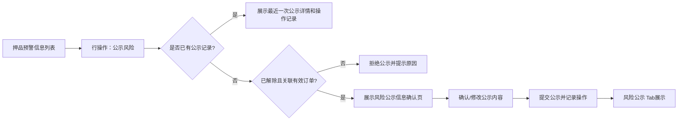

# 风险公示字段清单

> **文档定位**：定义“风险公示”页面对外展示的押品预警字段，以及从【押品预警信息】发起公示时的快照、编辑和权限边界。
>
> **版本**：V1.1 | 2026-08-18

## 一、业务定位与数据边界

风险公示用于将已处理的【押品预警信息】提供给资方和银行查看。公示内容可以关联原预警内容，但公示记录与原预警记录独立存在、相互不干扰。公示不是重新生成一条预警，也不是直接编辑原始预警记录，而是从【押品预警信息】行操作中的【公示风险】按钮进入，按本条预警唯一标识生成一份独立的公示快照。

公示快照生成后，页面可对允许编辑的公示字段进行合规化、脱敏或展示口径调整。所有修改只写入公示快照，不得回写押品预警信息的原始触发快照、处理结果、原始附件或审计事实；原始值、公示值、公示版本、操作人、操作时间和变更前后内容均须留存。

单条【公示风险】操作先按预警唯一标识查询公示记录：

- 已存在公示记录：直接进入该条风险的公示详情页，展示最近一次公示内容、最新公示状态、对应操作人和完整操作记录，不再进入首次公示确认页；
- 不存在公示记录：继续校验以下首次公示条件，满足后进入“风险公示信息确认”页：

  - 预警已解除，系统对应状态为“已处理（有效）”；
  - 预警关联有效的抵/质押订单或监管订单；
  - 当前登录账号同时具备押品预警信息的数据权限和“公示风险”操作权限；
  - 服务端校验记录版本未发生变化，且该记录未被其他公示操作锁定。

批量【公示风险】只允许选择“已解除且未被公示”的风险信息，即预警状态为“已处理（有效）”且不存在任何公示记录的风险。批量提交时每条预警独立生成公示记录；部分失败时逐条返回失败原因，不得将失败记录标记为已公示。

风险公示不在发布时选择目标机构、不发送通知。拥有风险公示 Tab 权限的资方和银行账号，可查看当前已发布的公示内容。订单、仓库、图片等关联数据在读取和换取访问地址时仍须执行租户、菜单和数据权限校验。

## 二、字段清单

| 所属模块 | 字段名称 | 字段来源 | 取值说明 | 必填性 | 新增页 | 编辑页 | 列表展示 | 可筛选 | 详情展示 | 字段说明 | 备注 |
| :--- | :--- | :--- | :--- | :--- | :--- | :--- | :--- | :--- | :--- | :--- | :--- |
| 基础识别字段 | 预警订单 | 订单数据/触发时订单快照 | 文本；展示预警订单号 | 不涉及 | 不涉及 | 不涉及 | 是 | 否 | 是 | 本条预警关联的抵/质押或监管订单 | 点击订单号跳转订单列表并自动按订单号精确筛选；点击“去处理”跳转【抵质押单据】页面并自动按订单号筛选出抵质押/监管订单；两个入口均使用订单唯一标识，不使用列表序号；订单失去数据权限时不得跳转或返回订单详情 |
| 基础识别字段 | 预警规则名称 | 订单预警配置或设备预警配置/触发时规则快照 | 文本；取触发预警的规则名称；未填写时展示“未命名规则” | 不涉及 | 不涉及 | 不涉及 | 否 | 否 | 否 | 产生本条预警信息的规则名称 | 取触发时规则名称快照，不随配置后续编辑改变；订单规则引用订单预警配置，设备触发但归属订单的记录引用设备预警配置 |
| 基础识别字段 | 预警类型 | 订单预警配置、设备预警配置/触发事件 | 枚举：解抵/质押/监管超时、价格下跌、图像识别异常、盘点异常、巡检异常、物联设备、智能挂锁异常、抵/质押率异常、人脸门禁异常、GPS异常；同时保存对应预警子类型 | 不涉及 | 不涉及 | 不涉及 | 是 | 否 | 是 | 对应触发的预警大类和子类型 | 列表按押品侧11个大类筛选；设备预警配置的5个设备大类仅作为设备事件来源口径，不与押品大类建立正式一对一映射；详情同时展示大类和子类型 |
| 基础识别字段 | 预警内容 | 触发事件/订单与设备主数据/触发快照 | 组合文本；包含预警发生位置、设备（如有）、具体触发原因、触发值及阈值 | 不涉及 | 不涉及 | 不涉及 | 是 | 否 | 是 | 说明预警发生的位置、设备及具体触发原因 | 仓库、库房、分区、设备名称和具体位置均取触发时快照；超时、价格下跌、盘点、巡检、抵/质押率异常等展示模板见“历史内容与展示去重规则”；缺少必要计算值或采集空值不生成对应数值预警 |
| 基础识别字段 | 预警抓拍图 | 预警触发服务/订单押品所在位置关联监控设备 | 图片地址或抓拍状态；无可用监控时展示“无抓拍图”，抓拍失败或超时展示“抓拍失败” | 不涉及 | 不涉及 | 不涉及 | 是 | 否 | 是 | 预警触发时的现场监控抓拍图 | 联动预警订单押品所在仓库、库房、分区范围内的监控设备；支持详情大图预览；图片访问需校验租户、菜单和订单/仓库数据权限，图片 URL 使用时效签名 |
| 基础识别字段 | 预警时间 | 三方设备事件/算法事件/业务事件/服务端时间 | 日期时间；格式为 `YYYY-MM-DD HH:mm:ss`；优先取事件发生时间，未提供时使用服务端接收时间 | 不涉及 | 不涉及 | 不涉及 | 是 | 否 | 是 | 预警事件实际触发时间 | 作为预警轮次、定时提醒和升级预警的起始时间；不得使用列表查询时间或处理时间替代 |
| 基础识别字段 | 处理时间 | 系统生成/服务端时间 | 日期时间；格式为 `YYYY-MM-DD HH:mm:ss`；未处理时为空 | 不涉及 | 不涉及 | 不涉及 | 是 | 否 | 是 | 预警完成自动解除或人工解除的时间 | 自动解除取系统收到有效恢复事件、有效恢复采集值或业务模块完成结果的时间；人工直接解除或在【抵质押单据】页面处理，均取服务端成功回写时间；历史逻辑中的“预警解除时间”“解除时间”均指本字段，不另设字段 |
| 基础识别字段 | 处理人 | 系统生成/操作人身份 | 人工直接解除或在【抵质押单据】页面处理：展示操作人账号或姓名及所属机构，格式为“账号/姓名（机构）”；系统自动解除：展示“系统自动处理” | 不涉及 | 不涉及 | 不涉及 | 是 | 否 | 是 | 完成预警处理时的责任主体 | 以服务端认证身份或业务处理服务身份为准，客户端不可直接写入；预警仍未处理时为空 |
| 解除预警 | 情况说明 | 直接解除处理人/【抵质押单据】处理人填写或回传 | 文本域；不超过200个字符；填写本次预警的处理结论和现场情况 | 条件必填 | 不涉及 | 条件展示 | 否 | 否 | 是 | 直接解除或去处理成功回写的处理说明 | 仅“未处理（有效）”且允许处理的预警展示并必填；自动解除不展示；成功后写入审计日志 |
| 解除预警 | 现场照片 | 直接解除处理人上传/【抵质押单据】处理结果回传 | 可选；支持 `jpg`、`png`、`jpeg`；单个文件不超过5 MB；最多10个文件 | 选填 | 不涉及 | 条件展示 | 否 | 否 | 是 | 直接解除或去处理成功回写的现场证明图片 | 上传或回传失败不得提交成功；图片与本条预警关联保存，详情支持缩略图和大图预览；自动解除不展示 |
| 解除预警 | 解除预警抓拍图 | 预警处理服务/订单押品所在位置关联监控设备 | 直接解除或【抵质押单据】处理提交时自动抓拍的现场图片；返回图片地址或抓拍状态；无监控时展示“无抓拍图”，失败或超时展示“抓拍失败” | 系统自动 | 不涉及 | 条件展示 | 否 | 否 | 是 | 解除预警提交时的现场监控抓拍图 | 两种处理入口均触发；提交成功前完成抓拍请求并关联本条预警；抓拍失败保留失败状态但不得伪造图片；图片访问权限与预警抓拍图一致 |
| 公示信息 | 公示状态 | 风险公示记录/系统生成 | 枚举：未公示、已公示、已取消；按最近一次公示记录取最新状态 | 系统自动 | 不涉及 | 不涉及 | 是 | 是 | 是 | 当前公示记录的最新状态 | “未公示”仅用于从未产生过公示记录的风险；有过公示记录后，即使取消公示，也保留“已取消”状态，不回到“未公示” |
| 公示信息 | 最近一次公示内容 | 最近一次公示版本快照 | 展示最近一次提交成功的公示内容；字段结构沿用本清单字段 | 系统自动 | 不涉及 | 不涉及 | 否 | 否 | 是 | 已公示风险对外展示的最新内容 | 只读取公示快照，不实时拼接原预警当前值；原预警内容变化不覆盖该字段 |
| 公示信息 | 最近一次公示时间 | 风险公示记录/服务端时间 | 日期时间；格式为 `YYYY-MM-DD HH:mm:ss` | 系统自动 | 不涉及 | 不涉及 | 是 | 否 | 是 | 最近一次提交公示成功的时间 | 取服务端成功落库时间，不使用页面打开时间或客户端时间 |
| 公示信息 | 最近一次操作人 | 风险公示记录/操作人身份 | 展示账号或姓名及所属机构，格式为“账号/姓名（机构）” | 系统自动 | 不涉及 | 不涉及 | 是 | 否 | 是 | 对最近一次公示状态产生变更的操作人 | 以服务端认证身份为准，客户端不可直接写入 |
| 公示信息 | 公示操作记录 | 风险公示审计记录 | 时间倒序展示公示确认、提交公示、取消公示等操作及操作结果 | 系统自动 | 不涉及 | 不涉及 | 否 | 否 | 是 | 本条风险公示的完整操作历史 | 至少记录操作类型、操作人、操作时间、前后状态、版本、说明、请求标识和失败原因；记录只增不改 |
| 公示信息 | 取消公示说明 | 取消公示操作人填写 | 文本域；必填；不超过200个字符 | 条件必填 | 不涉及 | 条件展示 | 否 | 否 | 是 | 取消当前风险公示的业务说明 | 取消公示确认文案为：“您正在操作取消风险公示，确认后风险公示列表将取消显示当前操作的风险内容，点击确认按钮后生效。”确认后填写并提交说明；校验非空和长度，成功后写入操作记录 |

## 三、快照与公示操作规则

| 规则项 | 规则 |
| :--- | :--- |
| 单条入口判断 | 服务端先查询本条预警是否存在公示记录；有记录直接返回最近一次公示详情及操作记录，无记录且满足首次公示条件时返回“风险公示信息确认”页数据。判断不得依赖前端列表字段或按钮文案。 |
| 快照生成 | 首次公示确认页由服务端按预警唯一标识读取押品预警触发/处理快照，生成本条记录独立的公示初始版本；批量公示时仍逐条生成，不合并原始预警。 |
| 编辑范围 | 首次公示确认页使用公示初始版本回填；具体字段是否可编辑以“编辑页”列为准。基础识别字段用于事实识别，默认只读；可编辑字段的修改仅影响公示副本。 |
| 已公示处理 | 已存在公示记录的风险再次从押品预警行点击【公示风险】时，直接进入公示详情页，展示最近一次公示内容、最新状态、对应操作人和操作记录；不重复创建公示记录。 |
| 批量选择 | 批量入口的服务端候选条件为：预警状态“已处理（有效）”且不存在任何公示记录。前端禁选不能替代服务端条件校验。 |
| 取消公示 | 取消公示只将公示侧最新状态更新为“已取消”，风险公示列表不再显示当前公示内容；不修改原预警状态、处理时间、处理人、处理说明、附件或原始快照。 |
| 原始数据保护 | 不得通过公示接口修改预警订单、预警规则、预警类型、预警内容、预警抓拍图、预警时间、处理时间、处理人及原始处理材料。 |
| 版本处理 | 首次提交公示生成公示版本；已有公示记录不因重复点击自动生成新版本；取消公示关联当前最新公示版本，历史版本和操作记录不可被覆盖。 |
| 并发控制 | 确认提交、批量提交、取消公示和状态查询必须校验公示版本及原始预警版本，并使用幂等键、记录锁或等效机制防止重复提交和并发覆盖。 |
| 审计留痕 | 记录租户、预警唯一标识、订单唯一标识、原始快照、公示版本、字段变更前后值、操作人、角色、时间、IP、请求标识、前后状态、说明、操作结果和失败原因。 |
| 图片安全 | 公示页面只返回经权限校验的时效签名 URL；图片换取失败、无权限或原图已失效时展示对应状态，不使用前端缓存或原始地址绕过权限。 |

## 四、与押品预警信息模块的交互

跳转、快照读取、图片访问和写入操作均以预警唯一标识和订单唯一标识为准，不使用列表序号。订单或预警失去当前数据权限时，不得继续创建、编辑、发布或查看对应公示内容。

批量入口单独执行候选查询，仅返回已解除且从未产生公示记录的风险；批量确认后逐条提交，每条记录独立返回成功或失败结果。

取消公示流程：打开当前公示详情，点击【取消公示风险】，展示以下确认文案：

> 您正在操作取消风险公示，确认后风险公示列表将取消显示当前操作的风险内容，点击确认按钮后生效。

确认后填写取消公示说明，说明必填且不超过200个字符；提交成功后，风险公示列表隐藏该条当前公示内容，详情页保留最新状态和完整操作记录。

## 五、变更记录

| 日期 | 版本 | 变更内容 |
| :--- | :--- | :--- |
| 2026-08-18 | V1.1 | 明确单条公示先判断历史记录；已公示记录直接进入最近一次公示详情；批量公示仅允许已解除且从未公示的风险；补充公示状态、操作人、操作记录和取消公示说明。 |
| 2026-08-18 | V1.0 | 初版；明确风险公示从已处理押品预警发起，使用独立公示快照，允许编辑公示副本且不回写原始预警，并补充字段清单、快照、并发、权限和审计规则。 |
