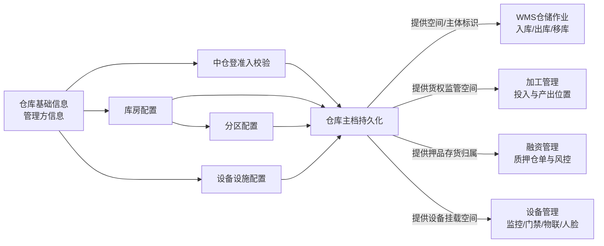
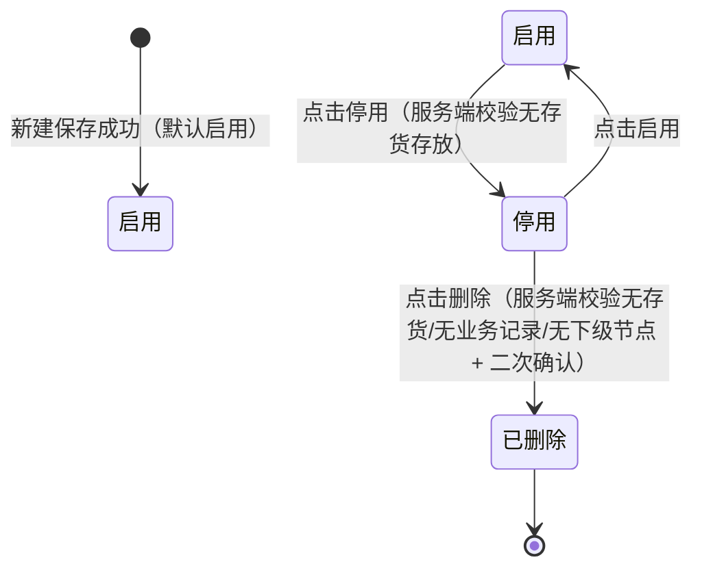
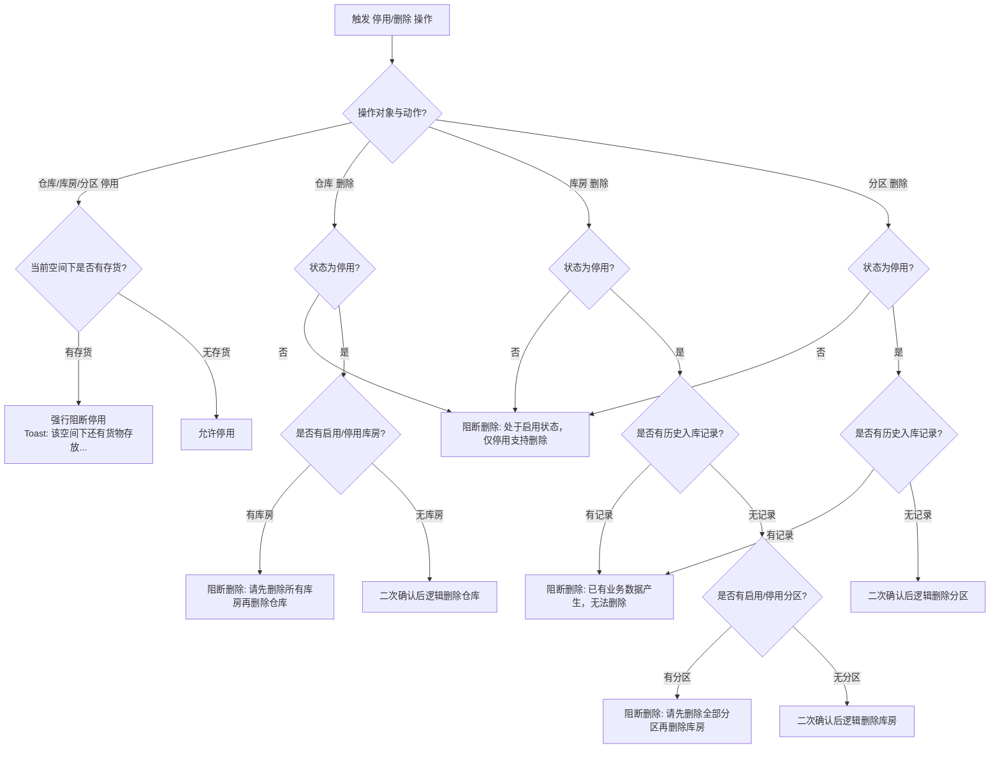
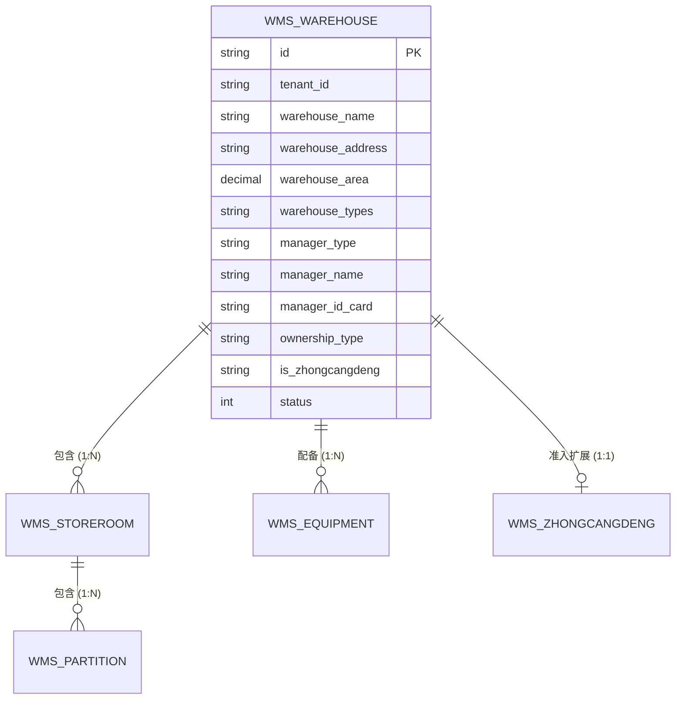
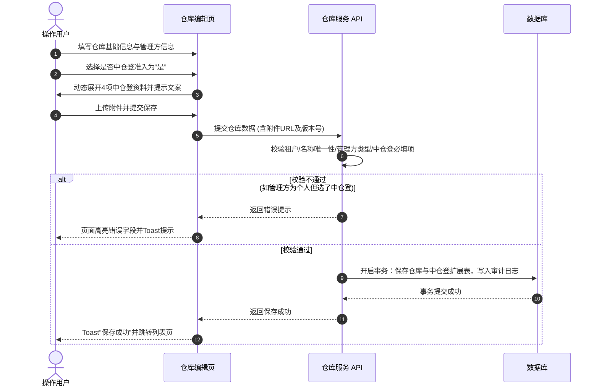
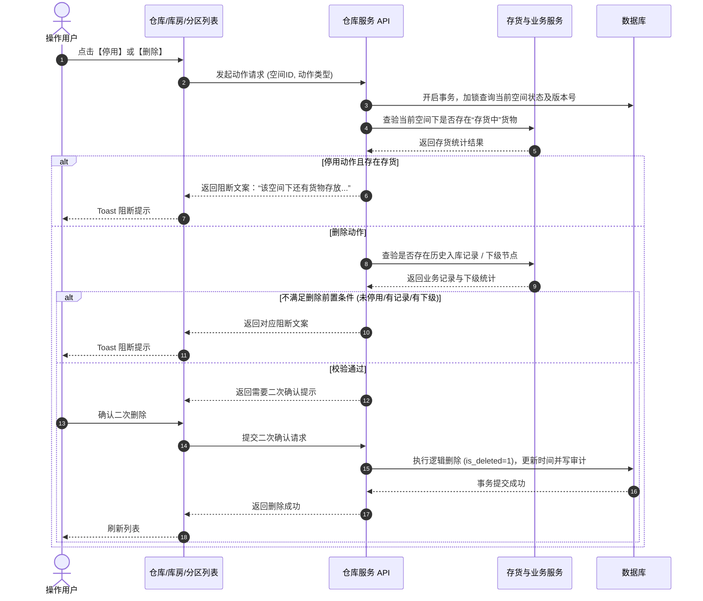

# 仓库管理主PRD

> **版本**：V1.0 | 2026-08-11  
> **读者**：研发工程师、测试工程师、产品复核、前端开发、后端开发  
> **编写依据**：[仓库管理字段清单.md](./仓库管理字段清单.md)  
> **字段基准**：[仓库管理字段清单.md](./仓库管理字段清单.md) 是本模块所有字段、枚举与校验规则的唯一基准。

---

## 1. 业务背景

仓库管理是 SYZC 供应链金融存货监管系统的空间与主体主档入口，维护“仓库 → 库房 → 分区”三级空间架构，并记录管理方主体、中仓登准入资质与设备设施配置。

缺少统一且严格闭环的仓库管理会导致：
- **账实悬空**：仓库、库房或分区被随意停用或删除，导致在库质押存货失去物理归属；
- **合规冲突**：管理方类型或中仓登准入资质随意变更，导致线上质押数据与线下监管备案冲突；
- **追溯断裂**：下游单据若仅按名称关联空间，空间同名修改时引发历史数据断裂；
- **监控盲区**：监控、门禁等传感器缺乏明确的挂载位置，无法实现动静结合的实时风控告警。

本模块通过三级空间树、管理方资质校验、中仓登联动及停用/删除强校验拦截，保障仓储主档严密与货权安全。

---

## 2. 功能范围

### 本期范围
- 仓库主档的新增、编辑、列表查询、启用/停用与逻辑删除；
- 管理方主体类型（企业/个人）、证件号及权属关系规则校验；
- 中仓登准入标记与条件联动（准入ID、库区图、登记表PDF、现场图片等）；
- 库房主档的新增、编辑、出入库审核标记、启用/停用与逻辑删除；
- 分区主档的新增、编辑、所属库房关联、启用/停用与逻辑删除；
- 仓库详情页设备设施列表的新增、编辑与删除维护；
- 仓库/库房/分区停用时“无存货存放”的后端强校验拦截；
- 仓库/库房/分区删除时“无业务记录/无下级节点”的后端强校验拦截；
- 租户数据隔离、数据权限过滤、操作审计日志、并发乐观锁与幂等校验。

### 不在本期范围
- 仓储作业（入库、出库、移库、盘点）的具体业务办理；
- 仓储租金、保管费等财务结算与合同履约管理；
- 中仓登官方 API 线上自动对接与实时打通（本期为线下准入线上信息留痕）；
- 监控、门禁、物联设备的硬件参数与网络通信协议配置（由设备管理模块维护）；
- 已逻辑删除仓库/库房/分区/设备设施主档的前台恢复功能。

---

## 3. 模块定位

### 3.1 在系统中的位置

| 项目 | 内容 |
| :--- | :--- |
| 模块层级 | **基础配置层——物理仓储空间与管理主体主档** |
| 核心职责 | 维护仓库、管理方、中仓登资质、库房、分区及设施基础配置 |
| 数据来源 | 系统管理员、仓储风控管理员或配置维护人员手动录入与维护 |
| 上游依赖 | 租户隔离标识、组织架构人员、字段基准文档 |
| 下游引用 | 入库单、出库单、移库单、盘点单、加工管理、融资押品管理、监控/门禁/物联设备绑定、中仓登备案查验 |
| 业务单据 | 本模块不直接生成金融交易单据，仅提供下游业务单据引用的底层空间与主体主档 |

### 3.2 系统链路图

### 3.3 实体关系说明

| 实体关系 | 对应关系 | 业务说明 |
| :--- | :---: | :--- |
| 仓库 : 管理方 | `N:1` | 一个管理方（企业或个人）可管理多个仓库，仓库保存管理方信息快照 |
| 仓库 : 中仓登资质 | `1:1` | 仓库选择中仓登准入时，扩展对应 1 组中仓登准入ID及附件资料 |
| 仓库 : 库房 | `1:N` | 一个仓库可下设多个库房；同仓库内库房名称唯一 |
| 库房 : 分区 | `1:N` | 一个库房可下设多个分区；同库房内分区名称唯一 |
| 仓库 : 设备设施 | `1:N` | 仓库详情内维护多条设施记录；所在仓库由系统自动带出并绑定 |
| 仓库/库房/分区 : 下游单据 | `1:N` | 下游业务单据保存空间唯一标识及业务发生时的名称快照 |

### 3.4 跨模块引用契约

| 下游模块 | 引用内容 | 约束与规则 |
| :--- | :--- | :--- |
| 入库单 / 出库单 | 仓库ID、库房ID、分区ID、出入库审核标识 | 仅允许选择有效启用且未删除的空间节点；若库房开启“出入库审核”，控制普通货物出库和转让流程 |
| 加工管理 | 仓库ID、库房ID、分区ID | 加工单主表选择仓库，产出位置必须在同仓库下选择有效库房与分区 |
| 融资管理 / 质押监管 | 仓库ID、中仓登准入标记、管理方信息 | 押品准入与质押率评估时校验中仓登准入仓资质及仓库风险状态 |
| 设备管理（监控/门禁/物联） | 仓库ID、库房ID、分区ID | 设备安装位置绑定仓库/库房/分区，提供仓储环境监控与告警 |

---

## 4. 业务场景

| 场景ID | 场景名称 | 场景类型 | 业务说明与约束 |
| :--- | :--- | :--- | :--- |
| S01 | 新建/编辑仓库 | 主流程 | 录入基础信息与管理方信息，校验同租户名称唯一性、面积数值及管理方格式 |
| S02 | 中仓登准入配置 | 主流程 | 管理方为企业时可选准入，联动显示并校验中仓登ID号及三项盖章/现场附件 |
| S03 | 库房与分区维护 | 主流程 | 仓库下建库房、库房下建分区；校验同级名称唯一性，保存持久化 ID |
| S04 | 设备设施维护 | 主流程 | 在仓库详情页配置设施名称、数量、单位及有效期，自动绑定所在仓库 |
| S05 | 仓库/库房/分区停用 | 控制流程 | 变更前服务端强校验下辖空间是否有“存货中”货物，有货物时强行阻断 |
| S06 | 仓库/库房/分区删除 | 阻断流程 | 仅停用节点可删；依次校验是否有存货、入库记录及下级节点，二次确认后逻辑删除 |
| S07 | 个人管理方限制 | 边界流程 | 管理方类型为“个人”时，禁用中仓登准入；编辑强切“个人”时若准入为“是”则阻断 |
| S08 | 中仓登状态切换 | 变更流程 | 准入由“是”切为“否”时，系统自动清空已填写的 4 个中仓登字段数据 |
| S09 | 并发修改/删停校验 | 异常流程 | 多人并发停用、删除或编辑时，基于版本号与数据库事务锁保障幂等与状态一致 |

---

## 5. 状态机

### 5.1 状态定义

| 状态维度 | 状态值 | 产生方式 | 业务含义与作用 |
| :--- | :--- | :---: | :--- |
| 自身状态 | 启用、停用 | 用户主动操作 | 控制仓库/库房/分区当前是否允许接纳新业务；列表默认展示有效启用数据 |
| 逻辑删除状态 | 未删除、已删除 | 系统逻辑写入 | 通过 `status = 删除` 或 `is_deleted = 1` 控制；已删除数据前台全局不可见，不支持恢复 |
| 中仓登准入状态 | 是、否 | 用户配置选择 | 标识仓库是否完成中仓登线下准入，控制押品风控准入与中仓登资质表单展示 |

### 5.2 状态机图

### 5.3 状态流转表

| 起始状态 | 触发动作 | 前置条件 | 目标状态 | 后置影响 | 失败与拦截处理 |
| :--- | :--- | :--- | :--- | :--- | :--- |
| 不存在 | 新建仓库/库房/分区 | 必填项完整、格式校验通过、同级名称唯一 | 启用 | 默认启用，生成空间持久化 ID 并记录审计日志 | 前端提示错误，服务端阻断保存 |
| 启用 | 点击停用 | 服务端校验当前节点及其下辖空间无任何存放货物 | 停用 | 阻止下游新业务选择该空间；更新仓库“更新时间” | Toast提示：“该[仓库/库房/分区]下还有货物存放，请处理后再进行停用操作！” |
| 停用 | 点击启用 | 操作权限及乐观锁校验通过 | 启用 | 恢复下游业务选择资格；更新仓库“更新时间” | 提示并发冲突或数据已被修改 |
| 停用 | 点击删除 | ① 状态为停用； ② 无历史/实时入库记录； ③ 无下级库房/分区节点 | 已删除 | 执行逻辑删除；前台全局不再展示；下游保存快照 | Toast提示对应阻断文案（见8.3节）；事务回滚，保持停用状态 |

---

## 6. 动作能力矩阵

> ✅ = 允许；❌ = 不允许或不展示入口；✅（条件）= 满足特定业务前置条件后允许。

| 动作名称 | 仓库-启用 | 仓库-停用 | 库房-启用 | 库房-停用 | 分区-启用 | 分区-停用 | 任意-已删除 |
| :--- | :---: | :---: | :---: | :---: | :---: | :---: | :---: |
| 查看列表/详情 | ✅ | ✅ | ✅ | ✅ | ✅ | ✅ | ❌ |
| 编辑基本信息 | ✅ | ✅ | ✅ | ✅ | ✅ | ✅ | ❌ |
| 变更中仓登准入 | ✅（企业管理方） | ✅（企业管理方） | — | — | — | — | ❌ |
| 切换管理方为个人 | ✅（非中仓登仓） | ✅（非中仓登仓） | — | — | — | — | ❌ |
| 启用 | ❌ | ✅ | ❌ | ✅ | ❌ | ✅ | ❌ |
| 停用 | ✅（无存货） | ❌ | ✅（无存货） | ❌ | ✅（无存货） | ❌ | ❌ |
| 删除 | ❌ | ✅（无下级库房） | ❌ | ✅（无入库记录且无下级分区） | ❌ | ✅（无入库记录） | ❌ |
| 下游新建单据引用 | ✅ | ❌ | ✅ | ❌ | ✅ | ❌ | ❌ |
| 维护设备设施 | ✅ | ✅ | — | — | — | — | ❌ |

---

## 7. 页面与字段规则

### 7.1 列表字段与排序规则

仓库管理主列表展示字段完全继承自 [仓库管理字段清单.md](./仓库管理字段清单.md)：

| 列顺序 | 列名称 | 字段来源 | 展示格式与规则 | 可排序/筛选 |
| :---: | :--- | :--- | :--- | :---: |
| 1 | 仓库名称 | 仓库基础信息 | 文本，点击进入仓库详情页 | 筛选（模糊匹配） |
| 2 | 管理方名称 | 管理方信息 | 继承自“管理企业名称/姓名” | 否 |
| 3 | 是否中仓登准入仓 | 中仓登准入 | 标签展示：“是” / “否” | 筛选（精确匹配） |
| 4 | 创建人 | 系统字段 | 显示创建人姓名/账号 | 否 |
| 5 | 创建时间 | 系统字段 | `YYYY-MM-DD HH:mm:ss` | 否（默认降序） |
| 6 | 最近更新时间 | 系统字段 | `YYYY-MM-DD HH:mm:ss` | 否 |
| 7 | 状态 | 系统字段 | 状态标签：“启用”（绿色） / “停用”（灰色） | 筛选（精确匹配） |
| 8 | 操作 | 界面行为 | 按钮列：【编辑】、【启用/停用】、【删除】 | 否 |

### 7.2 查询与筛选控件规范

| 筛选字段 | 控件类型 | 匹配规则 | 默认值 / 选项 |
| :--- | :--- | :--- | :--- |
| 仓库名称 | 文本输入框 | 模糊匹配 | 空 |
| 是否中仓登准入仓 | 单选下拉框 | 精确匹配 | 全部 / 是 / 否 |
| 状态 | 单选下拉框 | 精确匹配 | 全部 / 启用 / 停用（已删除数据不返回） |

### 7.3 仓库新增/编辑页面校验规则

#### 7.3.1 仓库基础信息
- **仓库名称**：必填，文本，不超过 50 字。同一租户内唯一，编辑时排除当前记录。
- **仓库地址**：必填，级联选择省、市、区/县，并填写详细地址。
- **仓库面积**：必填，数值，必须大于 0，保留两位小数，单位为平方米（㎡）。
- **仓库类型**：必填，多选枚举：`1储罐、2筒仓、3通用/常温库、4堆场、5冷库、6其他、7危化品仓库`。
  - **互斥规则**：`储罐` 与 `筒仓` 不能同时勾选；
  - **其他类型**：勾选 `6其他` 时，必须填写“其他仓库类型名称”（文本，不超过 50 字）；未勾选时清空或隐藏。
- **仓库监管员 / 片区经理**：选填，组织架构人员多选下拉。自动过滤已停用账号及无当前仓库权限人员。

#### 7.3.2 管理方信息
- **管理方类型**：必填，单选枚举：`1企业、2个人`。
- **管理企业名称 / 姓名**：必填，不超过 50 字。
- **统一社会信用代码 / 身份证号**：必填。企业填统一社会信用代码，个人填身份证号，分别按标准格式校验，按权限脱敏展示。
- **管理方联系电话**：选填，不超过 11 位，按手机号或座机格式校验。
- **仓库与管理方的权属关系**：必填，单选枚举：`1自有、2租赁、3其他`。

### 7.4 中仓登准入条件控制与提示语

#### 7.4.1 控制逻辑
- **是否中仓登准入仓**：选填单选，默认“否”。
- **前置限制**：仅当“管理方类型”为 `1企业` 时才允许选“是”。管理方类型为 `2个人` 时，强制为“否”且禁用选“是”。
- **动态联动**：选择“是”时，展开展示以下 4 个中仓登字段且均变更为**条件必填**；由“是”切为“否”时，自动清空这 4 个字段数据：
  1. **中仓登仓库ID号**：文本，条件必填；
  2. **仓库库区图或库位图**：图片上传，格式 `jpg/png/jpeg`，`≤5M`，最多 1 张；
  3. **仓库信息登记表**：文件上传，仅限 `PDF` 格式，最多 1 个，需完成仓储管理方和平台运营方盖章；
  4. **仓库图片**：图片上传，格式 `jpg/png/jpeg`，`≤5M`，建议比例 `690×390`，最多 8 张。

#### 7.4.2 界面文案提示规范（必须严格呈现）

> **[提示语 1 - 是否中仓登准入仓提示]**：  
> *重要提示：为避免线下准入中仓登填写的仓库信息与此处不一致，请确保您此处填写的仓库信息与提交给中仓登的信息一致，以及确保填写的中仓登仓库ID正确。中仓登仓库ID错误将会导致系统报错。*
> 
> **[提示语 2 - 中仓登仓库ID号提示]**：  
> *重要提示：中仓登仓库ID为您方线下通过与中仓登签订合同并提交仓库资料后，由中仓登提供。*
> 
> **[提示语 3 - 仓库信息登记表提示]**：  
> *重要提示：中仓登要求必须上传该表格，表格内需要完成仓储管理方和平台运营方盖章，表格模板在仓库列表页面下载。*

### 7.5 库房与分区配置规则

入口位于仓库详情页【库房与分区配置】页签：

| 配置对象 | 字段名称 | 校验与控制规则 |
| :--- | :--- | :--- |
| **库房** | 库房名称 | 必填，文本，不超过 50 字。同一仓库内唯一。 |
| | 出入库审核 | 选填，单选枚举：`是、否`，默认“否”。选“是”控制普通货物出库与转让审核。 |
| | 备注 | 选填，文本，不超过 500 字。 |
| | 状态 | 系统自动控制（默认“启用”）。 |
| **分区** | 分区名称 | 必填，文本，不超过 50 字。同一库房内唯一。 |
| | 所属库房 | 必填，新增时选择当前仓库下的有效库房；编辑时锁定不可修改。 |
| | 备注 | 选填，文本，不超过 500 字。 |
| | 状态 | 系统自动控制（默认“启用”）。 |

### 7.6 设备设施配置规则

入口位于仓库详情页【设备设施配置】页签：

- **所在仓库**：系统带出当前仓库，保存仓库唯一标识，不可修改。
- **设备设施名称**：必填，文本，不超过 50 字。允许同仓同名。
- **数量**：必填，正整数，不超过 5 位数字。
- **单位**：必填，文本，不超过 5 字（如：台、套、个）。
- **有效期**：必填，日期选择，格式 `YYYY-MM-DD`。
- **删除行为**：点击【删除】弹出确认框：“*你确定删除{{设备设施名称}}吗？*”，确认后直接删除，不校验存货及业务数据，删除后不可恢复。

---

## 8. 核心业务规则

### 8.1 租户隔离、层级结构与唯一性规则

| 规则ID | 规则名称 | 详细规则说明 |
| :--- | :--- | :--- |
| R01 | 租户数据隔离 | 所有数据基于 `tenant_id` 强隔离，前端接口与数据库查询必须带租户标识。 |
| R02 | 三级空间树架构 | 严格遵循“仓库（1） → 库房（N） → 分区（N）”空间树，分区不可脱离库房，库房不可脱离仓库。 |
| R03 | 名称唯一性约束 | ① 同一租户下，仓库名称唯一； ② 同一仓库下，库房名称唯一； ③ 同一库房下，分区名称唯一。 数据库建立租户/上级空间范围内的唯一索引。 |

### 8.2 管理方类型与中仓登准入规则

| 规则ID | 规则名称 | 详细规则说明 |
| :--- | :--- | :--- |
| R11 | 主体类型与中仓登互斥 | 管理方类型为 `2个人` 时，禁止开启中仓登准入。编辑仓库时，若将管理方切为个人且中仓登为“是”，后端阻断保存。 |
| R12 | 中仓登资料完整性 | 中仓登选“是”时，中仓登ID号、库区图、登记表 PDF 盖章件、仓库图片 4 项资料必须完整上传方可保存。 |
| R13 | 状态切换自动清空 | 中仓登由“是”切为“否”并保存时，后端同事务清空这 4 个中仓登字段。 |

### 8.3 存货与业务数据校验拦截规则（强闭环）

| 规则ID | 规则名称 | 校验触发点 | 校验内容与阻断提示 |
| :--- | :--- | :--- | :--- |
| R21 | 仓库停用拦截 | 点击仓库【停用】 | 校验仓库下所有库房/分区是否有“存货中”货物。 **阻断提示**：“*该仓库下还有货物存放，请处理后再进行停用操作！*” |
| R22 | 库房停用拦截 | 点击库房【停用】 | 校验库房下所有分区是否有“存货中”货物。 **阻断提示**：“*该库房下还有货物存放，请处理后再进行停用操作！*” |
| R23 | 分区停用拦截 | 点击分区【停用】 | 校验分区是否有“存货中”货物。 **阻断提示**：“*该分区下还有货物存放，请处理后再进行停用操作！*” |
| R24 | 仓库删除拦截 | 点击仓库【删除】 | ① 校验是否已停用，未停用提示：“*该仓库处于启用状态，仅停用状态支持删除操作！*”； ② 校验是否存在有效库房，存在提示：“*请先删除所有库房再进行仓库删除！*”。 |
| R25 | 库房删除拦截 | 点击库房【删除】 | ① 校验是否已停用，未停用提示：“*该库房处于启用状态，仅停用状态支持删除操作！*”； ② 校验是否有历史入库记录，有记录提示：“*该库房已有业务数据产生，无法删除！*”； ③ 校验是否存在有效分区，存在提示：“*请先删除全部分区再删除库房！*”。 |
| R26 | 分区删除拦截 | 点击分区【删除】 | ① 校验是否已停用，未停用提示：“*该分区处于启用状态，仅停用状态支持删除操作！*”； ② 校验是否有历史入库记录，有记录提示：“*该分区已有业务数据产生，无法删除！*”。 |

### 8.4 持久化唯一标识与快照机制

| 规则ID | 规则名称 | 详细规则说明 |
| :--- | :--- | :--- |
| R31 | ID关联原则 | 空间层级关联及下游单据引用必须保存持久化主键 ID（`warehouse_id`, `storeroom_id`, `partition_id`），禁止仅凭名称关联。 |
| R32 | 下游单据快照 | 仓储单据、加工单、质押仓单创建时，保存空间 ID 并冗余保存当时的空间名称与地址快照。后续空间主档修改不改写历史快照。 |

---

## 9. 权限设计

### 9.1 数据可见范围

| 角色类型 | 数据可见范围 | 说明 |
| :--- | :--- | :--- |
| 仓库监管员 / 片区经理 | 个人授权范围内的仓库及下辖空间 | 只能查看和维护被分配为监管员或片区经理的仓库 |
| 机构/风控管理员 | 所属机构及下属机构管辖的仓库 | 按机构树向上汇总、向下透视 |
| 系统管理员 | 当前租户内全部仓库 | 具备当前租户下所有仓库主档的全量可见性 |

### 9.2 操作权限矩阵

| 功能动作 | 仓库监管员 | 片区经理 | 风控管理员 | 系统管理员 |
| :--- | :---: | :---: | :---: | :---: |
| 查看仓库列表/详情 | ✅ | ✅ | ✅ | ✅ |
| 新建 / 编辑仓库 | ✅ | ✅ | ✅ | ✅ |
| 仓库 启用 / 停用 | ✅（需无存货） | ✅（需无存货） | ✅（需无存货） | ✅（需无存货） |
| 仓库 逻辑删除 | ❌ | ❌ | ✅（需停用+无库房） | ✅（需停用+无库房） |
| 维护 库房 / 分区 | ✅ | ✅ | ✅ | ✅ |
| 库房/分区 停用与删除 | ✅（遵从校验） | ✅（遵从校验） | ✅（遵从校验） | ✅（遵从校验） |
| 维护 设备设施 | ✅ | ✅ | ✅ | ✅ |

### 9.3 权限约束与安全性设计

- **后端强校验**：RESTful 接口双重校验菜单权限、数据范围权限（`tenant_id` + 仓库数据权限）及并发版本号。
- **脱敏规则**：统一社会信用代码/身份证号、联系电话对非高权限角色执行掩码脱敏（如身份证保留前 6 后 4）。

---

## 10. 数据溯源与审计

### 10.1 数据溯源结构

### 10.2 操作审计日志

系统在独立审计表中完整记录变前变后 JSON 快照：
- **触发动作**：仓库/库房/分区的【新建】、【编辑】、【启用】、【停用】、【删除】；设备设施的【新增】、【编辑】、【删除】；中仓登附件的【上传/替换/清空】。
- **审计字段**：操作人账号、姓名、IP、时间戳（`YYYY-MM-DD HH:mm:ss.SSS`）、TraceId、变更前 JSON 快照、变更后 JSON 快照、处理结果及失败原因。

---

## 11. 边界与异常处理

### 11.1 并发控制与加锁机制

| 并发场景 | 风险点 | 防控与解决机制 |
| :--- | :--- | :--- |
| 两人同时编辑同一仓库 | 覆盖彼此修改的内容 | 采用 `version` 乐观锁。提交时版本不一致则阻断并提示“*当前数据已被其他人修改，请刷新页面后重试！*”。 |
| 两人同时对同一仓库执行【停用】与【入库】 | 停用成功但同时存入了货物 | 采用数据库行级锁（`SELECT ... FOR UPDATE`）。停用校验存货与入库锁定同事务执行。 |
| 两人并发新增同名仓库 | 生成两条重名仓库记录 | 数据库建立 `(tenant_id, warehouse_name, is_deleted)` 唯一索引，后端捕获异常友好提示。 |

### 11.2 幂等与事务控制
- **接口幂等**：新增与状态变更接口携带前端生成的 `Request-ID` / Token，重复请求直接返回首次结果。
- **事务一致性**：空间状态变更与审计日志写入在同一数据库事务内完成，失败全部回滚。

### 11.3 边界与空状态处理
- **查询空状态**：筛选无匹配结果时展示“暂无数据”并保留清空筛选按钮。
- **网络中断 / 上传失败**：附件上传失败时显示错误信息并保留已填文本，不清空表单。

---

## 12. 操作时序

### 12.1 仓库新增/编辑与中仓登校验时序

### 12.2 仓库/库房/分区停用与删除校验时序

---

## 13. 验收重点

| 编号 | 验收项 | 测试输入与操作条件 | 预期结果 |
| :---: | :--- | :--- | :--- |
| **V01** | 仓库名称唯一性 | 录入同一租户下已存在的仓库名称保存 | 前/后端阻断保存，提示“仓库名称已存在” |
| **V02** | 面积数值校验 | 录入 `<=0` 或保留 3 位小数的仓库面积 | 阻断保存，提示“仓库面积必须大于0且最多保留两位小数” |
| **V03** | 仓库类型互斥 | 在仓库类型中同时勾选“储罐”与“筒仓” | 界面互斥取消上一个，后端拒绝提交 |
| **V04** | 个人管理方限制中仓登 | 管理方选“个人”，尝试勾选中仓登准入为“是” | 选项禁用；若接口强传则后端报错拦截 |
| **V05** | 编辑强切个人拦截 | 原中仓登为“是”，编辑时将管理方强切为“个人” | 保存时后端阻断，提示“个人管理方不可开启中仓登准入” |
| **V06** | 中仓登资料必填 | 中仓登选“是”，不上传信息登记表 PDF 直接提交 | 阻断提交，高亮提示“请上传中仓登仓库信息登记表” |
| **V07** | 中仓登切否清空 | 中仓登由“是”切为“否”并保存 | 保存成功，数据库中中仓登 4 个字段值自动清空置 Null |
| **V08** | 同仓库房名称唯一 | 在同一仓库下新增已存在的库房名称 | 阻断保存，提示“同一仓库下库房名称已存在” |
| **V09** | 同库房分区名称唯一 | 在同一库房下新增已存在的分区名称 | 阻断保存，提示“同一库房下分区名称已存在” |
| **V10** | 仓库停用存货拦截 | 对存放有“存货中”货物的仓库点击【停用】 | 服务端阻断，Toast：“该仓库下还有货物存放，请处理后再进行停用操作！” |
| **V11** | 库房停用存货拦截 | 对存放有货物的库房点击【停用】 | 服务端阻断，Toast：“该库房下还有货物存放，请处理后再进行停用操作！” |
| **V12** | 分区停用存货拦截 | 对存放有货物的分区点击【停用】 | 服务端阻断，Toast：“该分区下还有货物存放，请处理后再进行停用操作！” |
| **V13** | 启用仓库删除拦截 | 对处于“启用”状态的仓库直接点击【删除】 | 阻断删除，Toast：“该仓库处于启用状态，仅停用状态支持删除操作！” |
| **V14** | 有库房仓库删除拦截 | 对已停用但仍包含库房的仓库点击【删除】 | 阻断删除，Toast：“请先删除所有库房再进行仓库删除！” |
| **V15** | 有业务记录库房删除 | 对已停用但产生过入库单的库房点击【删除】 | 阻断删除，Toast：“该库房已有业务数据产生，无法删除！” |
| **V16** | 有分区库房删除拦截 | 对已停用无入库记录但包含分区的库房删除 | 阻断删除，Toast：“请先删除全部分区再删除库房！” |
| **V17** | 有业务记录分区删除 | 对产生过入库记录的分区点击【删除】 | 阻断删除，Toast：“该分区已有业务数据产生，无法删除！” |
| **V18** | 设备设施删除 | 在仓库详情页对设备设施点击删除 | 弹出确认框，确认后直接删除，不阻断 |
| **V19** | 接口幂等防重 | 重复发送相同 Request-ID 的新建/删停接口 | 仅成功处理一次，不重复写日志或改状态 |
| **V20** | 操作审计全留痕 | 执行仓库/库房/分区/设施的增删改停用操作 | 审计表准确记录前后 JSON 快照、操作人及 IP |

---

## 14. 待补充与可优化事项

| 编号 | 事项说明 | 影响范围 | 说明与后续规划 |
| :---: | :--- | :--- | :--- |
| 1 | 中仓登官方 API 自动化对接 | 仓库管理、中仓登准入 | 未来版本支持直接调用中仓登接口进行在线备案与校验反馈 |
| 2 | 3D 数字孪生大屏可视化关联 | 仓库详情、数字大屏 | 结合库房/分区坐标在 3D 大屏中进行空间建模与实时渲染 |

---

## 修订记录

| 日期 | 版本 | 变更摘要 | 变更人 |
| :---: | :---: | :--- | :--- |
| 2026-08-11 | V1.0 | 依据 `仓库管理字段清单.md` 及标准 PRD 规范全新构建；优化文案语言，将功能范围明确为“纳入范围”与“不纳入范围”，保持表达干练清晰 | AI PM / 森云科技 |
