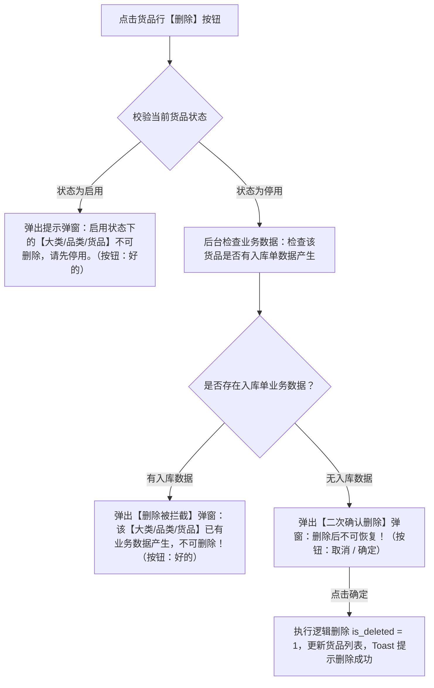

# 货品管理字段清单

> **文档定位**：货品管理（03-货品管理）所有字段的唯一定义来源。下游仓储作业、入库单、出库单、数字仓单、质押单等业务页面只引用字段名称与规格口径，不重复定义字段规则。
>
> **引用规则**：
> - 货品大类字段继承自 [01大类管理字段清单.md](../12-货品规格管理-大类管理/01大类管理字段清单.md)。
> - 品类字段与动态规格参数继承自 [02品类管理字段清单.md](../13-货品规格管理-品类管理/02品类管理字段清单.md)。
> - 下游单据及业务页面引用货品信息时，标注「继承自货品管理」，优先引用本清单口径。
>
> **修改原则**：字段定义变化 → **只改本文件**；PRD 与原型不手动修改字段规则，由产品设计/AI 统一同步更新。
>
> **版本**：V1.4 | 更新时间：2026-08-10

---

## 一、基础识别字段

| 字段名称 | 字段来源 | 取值说明 | 必填性 | 新增页 | 编辑页 | 列表展示 | 可筛选 | 详情展示 | 字段说明 | 备注 |
| :--- | :--- | :--- | :--- | :--- | :--- | :--- | :--- | :--- | :--- | :--- |
| 序号 | 系统生成 | 整数；按当前列表页排序从1开始 | 系统自动 | 不适用 | 不涉及 | 是 | 否 | 不适用 | 当前列表结果的行序号 | 仅为页面展示序号，不作为设备持久化主键；固定为列表第一列，翻页后按当前页重新计算 |
| 品类 | 用户选择（继承自品类管理） | 下拉选择/树选择；来源于已启用的品类 | 必填 | 必填 | 必填 | 是 | 是（左侧大类/品类树选择） | 是 | 货品所属的品类名称 | 继承自品类管理；关联选择已有且启用的品类 |
| 动态规格参数 | 用户填写（依据品类配置） | 文本/选项；由品类定义的参数决定，最多5个维度 | 必填 | 必填 | 必填 | 是（按品类参数拆列展示，如产地、等级） | 否 | 是 | 当前货品细分为 SKU 的具体规格取值 | 依据所选品类中配置的规格参数动态加载（如“产地”、“等级”列）；组合作为 SKU 唯一识别依据 |
| 计量参数 | 用户填写/选择 | 文本；如 `重量`、`数量` | 必填 | 必填 | 必填 | 是（与单位拼接展示） | 否 | 是 | 货品使用的计量维度 | 编辑页单独维护；列表按 `计量参数(单位)` 拼接展示 |
| 单位 | 用户填写/选择 | 文本；如 `吨`、`包`、`件` | 必填 | 必填 | 必填 | 否 | 否 | 是 | 货品使用的计量单位 | 编辑页单独维护；与计量参数共同作为入库、库存扣减、价格结算依据 |
| 入库收集信息 | 用户配置（系统预置项） | 选择一个或多个入库采集项，并逐项设置是否必填 | 配置项选填；已选项可设为必填 | 可配置 | 可配置 | 是（展示已配置项） | 否 | 是 | 货品入库时需要采集的业务信息 | 货品编辑页从预置字段中选择采集项；入库单按货品配置动态生成字段，标记为必填的字段未填写时不得提交 |
| 单价 | 用户设置 | 统一按元录入和存储，保留2位小数；展示时可切换元或万元 | 选填 | 不直接录入 | 不直接录入 | 是 | 否 | 是 | 货品的基准参考单价 | 通过列表操作列【设置价格】弹窗单独维护；未设置时列表显示 `--`；元展示保留6位小数并使用千分位，万元展示保留10位小数 |

---

## 二、系统字段

| 字段名称 | 字段来源 | 取值说明 | 必填性 | 新增页 | 编辑页 | 列表展示 | 可筛选 | 详情展示 | 字段说明 | 备注 |
| :--- | :--- | :--- | :--- | :--- | :--- | :--- | :--- | :--- | :--- | :--- |
| 创建人 | 系统生成 | 文本；当前登录用户账号/姓名 | 不适用 | 不适用 | 不涉及 | 否 | 否 | 是 | 提交货品创建成功时登录账号名称 | 系统自动留痕，不可由用户修改 |
| 创建时间 | 系统生成 | 日期时间；格式：`YYYY-MM-DD HH:mm:ss` | 不适用 | 不适用 | 不涉及 | 否 | 否 | 是 | 提交货品创建成功时间 | 系统服务端生成的时间戳，创建后不可变更 |
| 更新时间 | 系统生成 | 日期时间；格式：`YYYY-MM-DD HH:mm:ss` | 不适用 | 不适用 | 不涉及 | 否 | 否 | 是 | 货品属性、价格或状态最近一次发生变化的时间 | 货品属性修改、设置价格或启用/停用状态变更时自动更新 |
| 状态 | 系统生成 | 枚举：启用、停用 | 不适用 | 不适用 | 不涉及 | 是 | 是（左侧底部【显示已停用货品信息】勾选框） | 是 | 货品的启停用管控状态 | 新建保存后默认状态为“启用”；启用状态展示“停用”按钮，点击弹窗确认；停用状态展示“启用”按钮 |

---

## 三、操作行为与校验规则

页面提供左侧大类/品类筛选树，顶部提供 **【添加货品】** 按钮，列表操作列提供 **【预览】**、**【编辑】**、**【启用 / 停用】**、**【设置价格】** 操作按钮，具体控制规则与交互如下：

### 1. 新增 / 编辑（Add / Edit）操作规则

- **触发入口**：列表右上角【添加货品】按钮 / 列表行操作列【编辑】按钮。
- **表单交互**：
  - 先选择品类（级联自动带出大类信息）。
  - 根据所选品类动态加载配置的规格参数输入框（最多 5 个，如“产地”、“等级”），录入对应规格取值。
  - 录入“计量参数”（如 `重量(吨)`）。
  - 配置“入库收集信息”：点击【添加入库收集信息】，从系统预置项中选择需要在入库时填写的信息；每个已选项单独设置是否【必填】，支持删除已选项，不允许同一货品重复选择同一项。
- **编辑保存校验（入库数据拦截）**：
  - 点击【保存】时，系统实时校验该租户下该货品规格是否已有入库数据产生。
  - **拦截规则**：若该货品已产生入库数据，阻断保存修改，并弹窗提示：
    > ⚠️ **提示信息**：“该货品已有业务数据产生，不可编辑！”
- **正常规则**：若无入库数据产生，校验同品类下的动态规格参数、计量参数和单位组合唯一后允许保存修改，Toast 提示“保存成功”。

### 1.1 入库收集信息配置

- **配置位置**：货品新增/编辑页的【入库收集信息】区域。区域说明为：`货品入库时需要填写，可根据业务需求选择、删除字段并设置是否必填。`
- **配置方式**：点击【添加入库收集信息】打开预置项选择器；选择后生成一行配置项，展示字段名称、输入方式、【必填】复选框和删除按钮。
- **必填规则**：
  - 未选择任何采集项时，允许保存货品；入库单不展示该区域的采集字段。
  - 已选择的采集项默认不勾选【必填】，由用户逐项设置。
  - 勾选【必填】后，该字段在入库单中必须填写；未勾选时允许为空。
  - 货品已有入库数据时，按现有货品编辑规则阻断配置修改；未产生入库数据时允许新增、删除采集项或调整必填状态。
- **入库单联动**：入库单选择货品后，服务端读取该货品当前有效的入库收集信息配置，按配置生成对应字段；提交时服务端再次校验必填项，不能只依赖前端校验。
- **字段范围**：采集项名称、输入方式、枚举值和校验规则以本节表格为准；本期不支持业务人员自定义字段名称、输入类型或枚举值。

| 属性 | 项目名称 | 入库填写方式 | 选项 / 格式 | 业务说明 |
| :--- | :--- | :--- | :--- | :--- |
| **货品基础类** | 包装方式 | 下拉选择 | 箱装/盒装、袋装、散装、桶装、集装箱、托盘 | 货品包装形态 |
|  | 产地 | 选择地理位置 | 省-市-区/县三级联动 | 支持省、市、区/县三级联动 |
|  | 批次号 | 手动输入 | 文本 | 核心追溯字段；启用必填后必须填写 |
|  | 生产企业 | 手动输入 | 文本 | 生产厂家全称 |
|  | 危险品等级 | 下拉选择 | 非危；第1类 爆炸品；第2类 压缩气体和液化气体；第3类 易燃液体；第4类 易燃固体、自燃物品和遇湿易燃物品；第5类 氧化剂和有机过氧化物；第6类 毒害品和感染性物品；第7类 放射性物品；第8类 腐蚀品；第9类 杂类 | 危险品分类 |
| **生产质检类** | 质量等级 | 下拉选择 | 特级、一级、二级、三级、国标、优等品、合格品 | 货品质量等级 |
|  | 生产日期 | 选择日期 | 年-月-日 | 用于计算存储周期和临期预警 |
|  | 过期时间 | 选择日期 | 年-月-日 | 关键风险字段；如同时配置保质期，需与生产日期、保质期保持一致 |
|  | 保质期 | 选择周期 | 数值 + 天/月/年 | 与生产日期共同计算实际过期时间 |
|  | 检验日期 | 选择日期 | 年-月-日 | 货品质检日期 |
|  | 检验机构 | 手动输入 | 文本 | 检测机构名称 |
|  | 检验报告编号 | 手动输入 | 文本 | 用于质检报告追溯 |
| **仓储要求类** | 存储方式 | 下拉选择 | 常温、冷藏、冷冻 | 货品存储条件 |
|  | 温度要求 | 数字区间 | 最小值、最大值，单位 ℃；允许仅填写一侧 | 仓储环境温度控制标准，例如 `2~8℃` |
|  | 湿度要求 | 数字区间 | 最小值、最大值，单位 %RH；允许仅填写一侧 | 仓储环境湿度控制标准，例如 `≤70%RH` |
|  | 水分含量 | 数字输入 | 0～100，单位 % | 粮食类重要质量指标 |
|  | 杂质率 | 数字输入 | 0～100，单位 % | 质检关键字段 |

#### 入库收集信息通用校验

- 文本字段去除首尾空格后校验；空字符串视为未填写。
- 日期字段统一使用 `YYYY-MM-DD`；若同时填写生产日期、保质期和过期时间，必须满足 `过期时间 = 生产日期 + 保质期`，不一致时禁止提交并提示重新核对。
- 保质期数值必须为正数；单位仅允许天、月、年。
- 温度和湿度区间的最小值不能大于最大值；只填写最大值时表示“≤最大值”，只填写最小值时表示“≥最小值”。
- 水分含量和杂质率必须为 0～100 的数值，最多保留 2 位小数。
- 下拉项只能提交本清单定义的枚举值，前端隐藏选项或手工篡改请求均由服务端拦截。

---

### 2. 启用 / 停用（Enable / Disable）操作规则

- **按钮展示逻辑**：
  - 当货品状态为 **【启用】** 时，列表行操作列展示 **【停用】** 按钮。
  - 当货品状态为 **【停用】** 时，列表行操作列展示 **【启用】** 按钮。
- **停用确认弹窗**：
  - 点击【停用】按钮，唤起二次确认弹窗：
    > ⚠️ **弹窗提示内容**：“停用后后续新增业务无法选择，但历史已产生数据不受影响”
  - 用户点击【确定】后，货品状态更新为 **【停用】**，同步更新最后修改时间。
- **启用恢复**：
  - 点击【启用】按钮，确认后货品状态恢复为 **【启用】**。
- **列表显示控制**：
  - 左侧底部提供 `显示已停用货品信息` 勾选框。默认取消勾选（仅显示启用状态货品）；勾选后列表同时展示启用与停用状态的货品。

---

### 3. 设置价格（Set Price）操作规则

- **触发入口**：列表行操作列【设置价格】按钮。
- **【设置价格】弹窗界面与交互**：
  - **弹窗标题**：`设置价格`
  - **右上角入口**：提供橙色文本链接 **【修改记录】**，点击唤起【修改记录】二级弹窗。
  - **弹窗表单项**：
    1. **所属大类**：只读文本展示（如：`农作物`）。
    2. **品类**：只读文本展示（如：`糯米`）。
    3. **规格**：只读文本展示，格式为 `{计量参数}({单位})`（如：`重量(吨)`）。
    4. **`*` 设置价格**：必填，按元录入，保留2位小数，输入框右侧显示单位 `元/{单位}`（如 `元/吨`）。
  - **底部按钮**：【取消】按钮（关闭弹窗）、【保存】按钮（提交价格更新）。
- **保存校验与影响**：
  - 输入价格必须为非负数值，单位为元，精确到2位小数。
  - 点击【保存】后更新当前货品最新单价及更新时间，系统后台自动生成一条价格修改历史日志（包含元金额、计量单位、操作人、操作时间）。
  - 列表【单价】列支持用户切换展示单位：选择元时保留6位小数并使用千分位，选择万元时保留10位小数；未设置单价时列表统一显示为 `--`。
  - 价格变更后，存量业务按最新价格重新计算；历史价格只用于追溯，不锁定存量业务计算结果。
- **未设置单价的下游提示与影响规则**：
  - 若货品未设置单价（即单价为空/`--`），在下游业务模块（如【加工管理】、【抵质押业务单据】、【融资申请】等）中引用该货品时，系统无法自动计算带出价格与估值。
  - **提示规则**：在下游单据对应货品的价格展示位置/表格单元格中，系统统一提示 `系统未设置的单价`，提醒业务人员前往【配置管理-货品管理】补充设置单价。

---

### 4. 查看【修改记录】弹窗操作规则

- **触发入口**：在【设置价格】弹窗右上角点击 **【修改记录】** 链接。
- **【修改记录】弹窗界面与交互**：
  - **弹窗标题**：`修改记录`，右上角提供关闭图标（`X`）。
  - **底部按钮**：【关闭】按钮（点击后关闭修改记录弹窗并返回【设置价格】弹窗）。
- **【修改记录】弹窗列表字段表**：

| 字段名称 | 字段来源 | 取值说明 | 必填性 | 列表展示 | 字段说明 | 备注 |
| :--- | :--- | :--- | :--- | :--- | :--- | :--- |
| 序号 | 系统生成 | 整数；从 1 开始递增 | 系统自动 | 是 | 价格修改记录的展示序号 | 行序号展示 |
| 价格 | 系统生成/用户设置 | 元金额，保留2位小数；展示单位可为元或万元 | 系统自动 | 是 | 当次设置保存的货品单价 | 展示时按当前单位和精度规则换算，不改变原始元金额 |
| 操作人 | 系统生成 | 文本，如 `shy` | 系统自动 | 是 | 执行设置价格操作的用户账号/姓名 | 自动读取登录账号 |
| 操作时间 | 系统生成 | 日期时间；格式：`YYYY-MM-DD HH:mm:ss` | 系统自动 | 是 | 执行设置价格操作的服务端时间戳 | 系统时间戳留痕 |

---

### 5. 预览（Preview）操作规则

- **触发入口**：列表行操作列【预览】按钮。
- **交互形式**：唤起货品详情查看弹窗/页面，全量只读展示该货品的基础属性、动态规格参数、计量参数、入库收集信息配置、价格及系统审计字段。

---

### 6. 删除（Delete）操作规则

删除属于本期范围，系统统一按以下两阶段状态与业务引用分支进行强校验及弹窗分流：

#### 阶段一：状态强校验（启用拦截）
- **前置条件**：若货品当前 `状态 = 启用`。
- **拦截交互**：弹出提示弹窗（图标 `!`）：
  > ⚠️ **弹窗内容**：“启用状态下的【大类/品类/货品】不可删除，请先停用。”  
  > **操作按钮**：【好的】
- **处理结果**：强控阻断删除操作，货品保持启用状态。

#### 阶段二：停用货品的删除校验（检查入库单）
- **前置条件**：若货品当前 `状态 = 停用`。
- **后台扫描范围**：系统后台校验该租户下该货品规格是否有入库单数据产生。
- **分支 A（存在入库单业务数据）**：
  - 弹出【删除被拦截】弹窗（图标 `!`）：
    > ⚠️ **弹窗内容**：“该【大类/品类/货品】已有业务数据产生，不可删除！”  
    > **操作按钮**：【好的】
  - **处理结果**：强控拦截阻断删除，引导用户维持“停用”状态。
- **分支 B（无入库单业务数据）**：
  - 弹出【二次确认删除】弹窗（图标 `!`）：
    > ⚠️ **弹窗内容**：“删除后不可恢复！”  
    > **操作按钮**：【取消】【确定】
  - **处理结果**：用户点击【确定】后，系统执行逻辑删除（`is_deleted = 1`），刷新货品列表并 Toast 提示“删除成功”。

---

## 四、展示与引用规则

- **列表展示顺序**：固定为 `序号`、`品类`、`[动态规格参数列1..N]`（如产地、等级）、`计量参数`、`入库收集信息`、`单价`、`状态`、`操作`。
- **筛选与导航树**：
  - 页面左侧提供大类/品类层级树与搜索框（placeholder: `请输入查询的名称`）。
  - 点击左侧大类或品类节点，右侧列表实时过滤对应节点下的货品。
  - 左侧底部 `显示已停用货品信息` 复选框过滤控制停用货品的展示状态。
- **唯一性校验规则**：同一租户同品类下，`动态规格参数组合` + `计量参数` + `单位` 保存时触发唯一性校验，重复时提示“该货品规格配置已存在，请重新输入”。
- **停用与关联约束规则**：
  - 大类或品类启用/停用时，按现有系统规则级联更新所有下级状态；货品自身状态与所有上级状态均为启用时，才允许新建入库单、仓单或质押业务选择该货品。
  - 有效启用状态定义为：`自身启用 AND 所有上级启用`。
  - 已关联该货品的历史单据与库存流水保留既有数据快照，不受物理影响。
- **下游单价引用与未设置提示**：
  - 下游单据（如【加工管理】、【抵质押业务单据】等）引用货品主档单价信息；若货品单价未在货品管理中设置，下游单据的价格位置统一显示/提示 `系统未设置的单价`，提示用户补充设价。

---

## 修订记录

| 日期 | 变更内容 | 影响范围 | 变更人 |
| :--- | :--- | :--- | :--- |
| 2026-08-10 | 初版发布：结合原型截图与大类、品类字段清单标准规范，重构货品管理字段清单（包含动态规格参数、计量参数、设置价格、编辑校验及删除两阶段管控规则） | 03-货品管理全页面、筛选树、列表及操作交互 | AI PM / 森云科技 |
| 2026-08-10 | V1.1 规则升级：补充单价未设置时在下游业务单据（如加工管理、抵质押业务单据）中的展示与提示规则（提示：“系统未设置的单价”） | 单价字段定义、设置价格规则与下游单据引用展示 | AI PM / 森云科技 |
| 2026-08-10 | V1.2 结构优化：调整【修改记录】字段位置，保持主实体【二、系统字段】模版统一；将【修改记录】弹窗字段归集中至【3.4 查看修改记录操作规则】段落 | 设置价格弹窗、修改记录二级弹窗 | AI PM / 森云科技 |
| 2026-08-10 | V1.3 规则补充：计量参数与单位分字段维护、列表拼接展示；统一元录入及元/万元展示精度；补充上级级联状态和存量业务按最新价格计算规则 | 货品字段、价格设置、状态与下游业务引用 | AI PM / 森云科技 |
| 2026-08-10 | V1.4 新增入库收集信息配置：补充预置采集项、输入方式、枚举值、逐项必填配置、入库单动态生成及服务端校验规则 | 货品新增/编辑、入库单字段联动、入库信息校验与历史追溯 | AI PM / 森云科技 |
