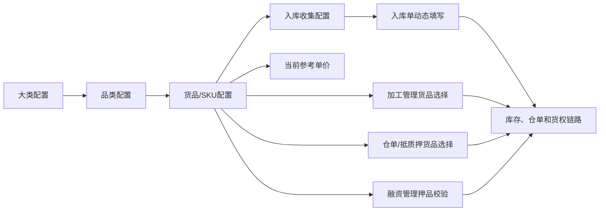
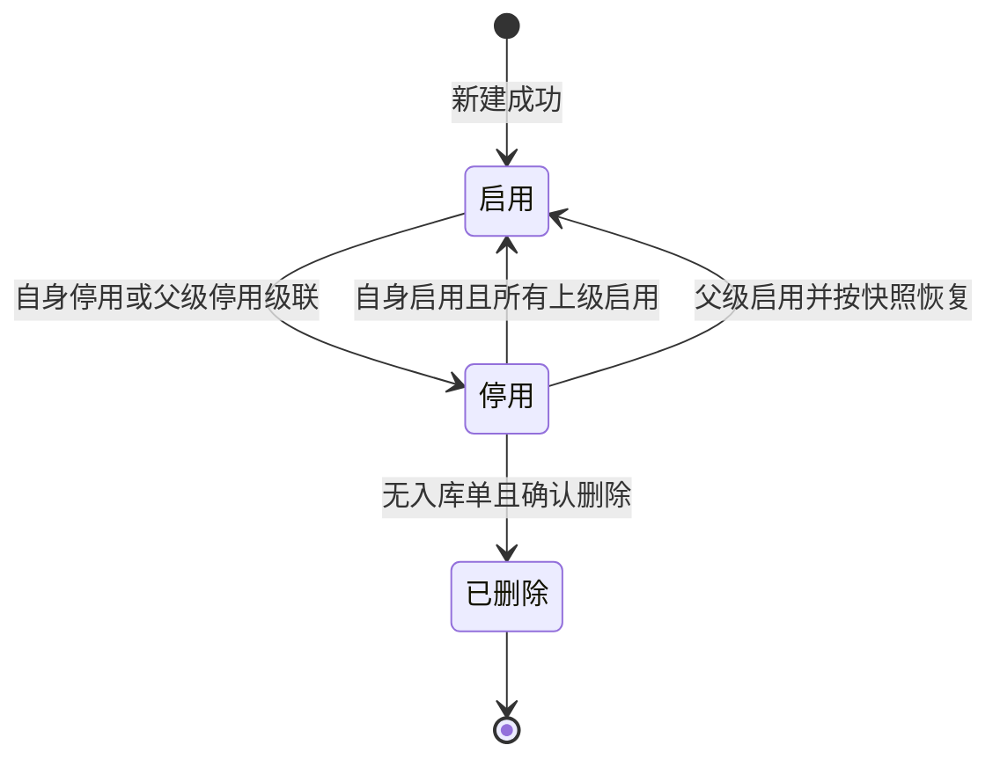
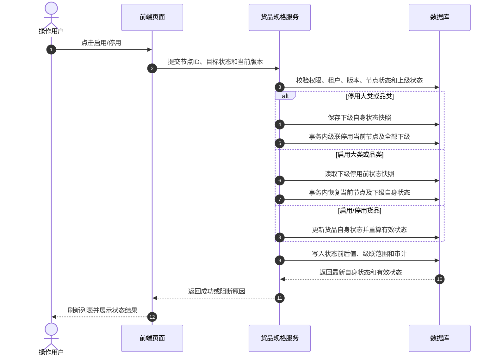
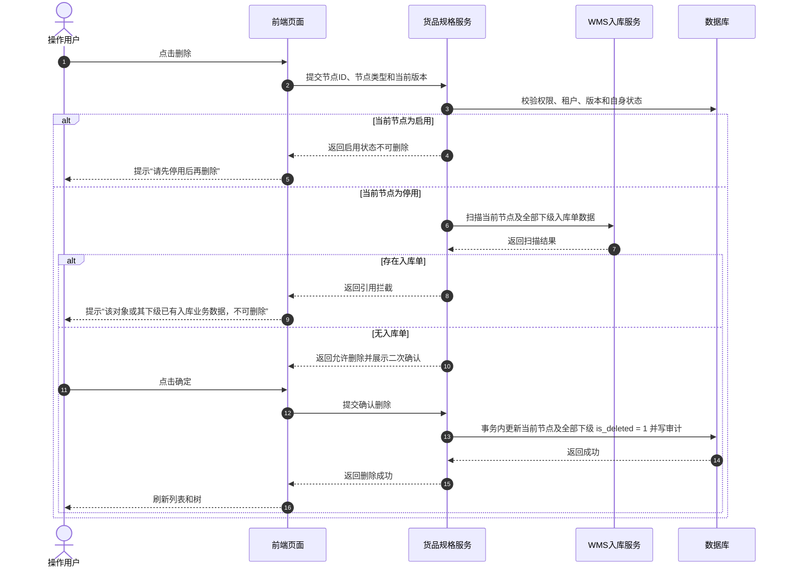
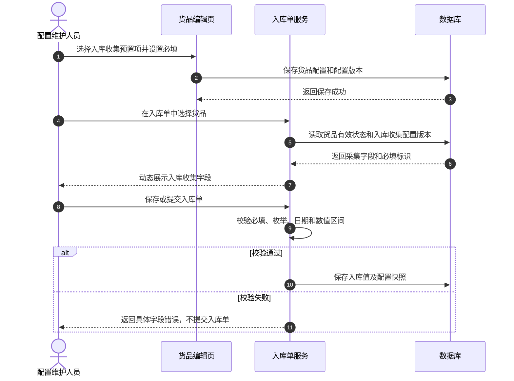
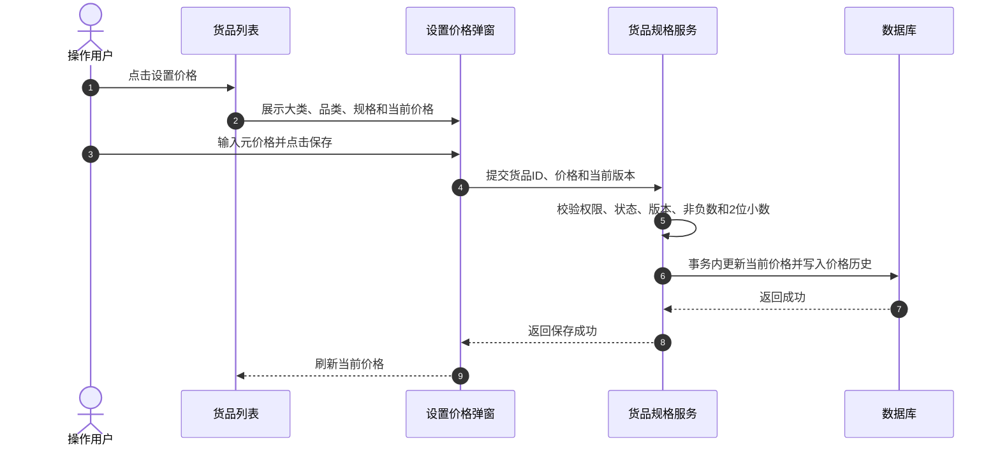

# 货品规格管理主PRD

> **版本**：V1.3 | 2026-08-11
> **读者**：研发工程师、测试工程师、产品复核、前端开发、后端开发
> **编写依据**：[01大类管理字段清单.md](../12-货品规格管理-大类管理/01大类管理字段清单.md)、[02品类管理字段清单.md](../13-货品规格管理-品类管理/02品类管理字段清单.md)、[03货品管理字段清单.md](./03货品管理字段清单.md)
> **字段基准**：[01大类管理字段清单.md](../12-货品规格管理-大类管理/01大类管理字段清单.md)、[02品类管理字段清单.md](../13-货品规格管理-品类管理/02品类管理字段清单.md)、[03货品管理字段清单.md](./03货品管理字段清单.md) 是本模块所有字段、枚举和字段规则的唯一基准。

## 1. 业务背景

货品规格管理是 SYZC 供应链金融存货监管系统的商品主档入口，维护“大类 → 品类 → 货品/SKU”三级基础数据，并为入库、加工、仓单、抵质押和融资业务提供统一的货品标识、规格、计量单位、参考价格和入库采集配置。

货品主档一旦被入库单引用，就会进入“货-仓-金”链路。入库单是货物进入仓储、仓单和抵质押业务的第一道入口，因此货品的编辑、启停、删除和价格变化必须明确前置条件、后置影响、历史快照和异常回滚规则。

本模块不办理入库、加工、融资或抵质押业务，只维护被下游业务引用的基础配置。

## 2. 功能范围

**本期范围**：

- 大类、品类和货品/SKU 的列表、查询、新建、编辑、启用、停用和删除；
- 品类动态规格参数配置，最多 5 个规格维度；
- 货品计量参数、单位、入库收集信息和参考单价维护；
- 入库收集信息预置项选择及逐项必填配置；
- 货品有效状态计算及父级停用/启用级联；
- 货品与入库单、加工管理、融资管理、仓单和抵质押业务的引用约束；
- 价格历史、状态变化、级联结果、删除结果和配置变更的审计追溯；
- 并发控制、幂等校验、入库数据拦截、异常和空状态处理。

**不在本期范围**：

- 入库单、出库单、仓单、抵质押单、加工单和融资申请的业务办理；
- 大宗商品实时行情自动拉取和自动调价；
- 仓储盘点、移库、实物质检和加工执行；
- 跨租户共享货品主档；
- 业务人员自定义入库收集字段名称、输入类型和枚举值；
- 已删除货品主档恢复。

## 3. 模块定位

### 3.1 在系统中的位置

| 项目 | 内容 |
| :--- | :--- |
| 模块层级 | 配置管理 - 货品规格管理 |
| 核心职责 | 维护大类、品类、货品/SKU、计量规则、入库收集配置和参考单价 |
| 数据来源 | 系统管理员、配置维护人员或风控管理员维护 |
| 上游依赖 | 租户权限、账号权限、大类/品类层级和字段基准 |
| 下游引用 | 入库单、库存、加工管理、仓单、抵质押业务、融资管理、货值评估和风险预警 |
| 业务单据 | 本模块不生成业务单据，不建立审批流程；仅维护被业务单据引用的基础配置 |

### 3.2 系统链路图

### 3.3 实体关系说明

| 关系 | 说明 |
| :--- | :--- |
| 大类 : 品类 | `1:N`；一个大类可包含多个品类，同租户内大类名称唯一 |
| 品类 : 货品/SKU | `1:N`；一个品类可包含多个货品，同品类内规格组合、计量参数和单位唯一 |
| 货品 : 入库收集配置 | `1:1` 当前有效配置；配置包含多个预置采集项及必填标识 |
| 货品 : 价格历史 | `1:N`；每次设置价格生成一条历史记录 |
| 货品 : 入库单明细 | `1:N`；入库单保存货品标识、规格快照和入库收集信息值 |
| 货品 : 下游业务 | `1:N`；下游业务保存货品快照，不因主档后续变更而改写历史业务展示 |

### 3.4 跨模块引用契约

| 下游模块 | 引用内容 | 使用约束 |
| :--- | :--- | :--- |
| 入库单 | 有效货品、计量参数、单位、入库收集配置 | 仅允许选择有效状态为“有效启用”的货品；按货品配置动态生成收集字段；入库单是全局货物入口 |
| 加工管理 | 预计产出和实际产出货品、当前参考单价 | 预计产出必须选择有效货品；金额按加工模块规则读取当前参考单价；加工单保存货品快照 |
| 仓单/抵质押业务 | 入库货品、货品规格、计量单位、货品价格 | 仅允许选择有效货品；在库、货权、冻结和重复占用等条件由业务模块继续校验 |
| 融资管理 | 押品货品及业务快照 | 抵质押办理前由融资/抵质押模块校验权属、在库、冻结、重复占用和业务权限；本模块只提供货品基础配置 |
| 监控设备/门禁设备 | 设备与货品不直接建立主档关系 | 设备只提供仓储环境、抓拍或门禁能力，不改变货品状态和价格 |

## 4. 业务场景

| 场景ID | 场景 | 类型 | 说明 |
| :--- | :--- | :--- | :--- |
| S01 | 新建大类、品类和货品 | 主流程 | 按三级层级建立商品主档，保存时执行必填、唯一性和上级状态校验 |
| S02 | 配置动态规格 | 主流程 | 品类配置最多 5 个规格维度，货品按品类维度填写具体规格值 |
| S03 | 配置入库收集信息 | 主流程 | 货品从预置项中选择入库采集字段，并逐项设置是否必填 |
| S04 | 入库单引用货品 | 主流程 | 入库单选择有效货品后，动态生成入库收集字段并校验必填项 |
| S05 | 父级停用/启用 | 主流程 | 大类或品类停用时级联停用下级；启用时按快照恢复下级原状态 |
| S06 | 设置货品价格 | 主流程 | 按元录入当前参考单价，保存价格历史，业务按约定读取当前价格 |
| S07 | 删除主档 | 支线 | 仅停用节点可删除；先校验整个子树是否存在入库单，删除后不可恢复 |
| S08 | 已有业务数据后编辑 | 异常流程 | 服务端发现入库引用后阻断编辑，保留历史业务快照 |
| S09 | 价格缺失或配置为空 | 容错流程 | 未设置价格显示缺价提示；未配置入库收集信息时入库单不展示额外字段 |
| S10 | 并发维护主档 | 异常流程 | 通过版本、唯一索引和事务控制，避免重复配置、半棵树状态和重复审计 |

## 5. 状态机

### 5.1 状态定义

| 状态维度 | 状态值 | 是否可直接修改 | 含义 |
| :--- | :--- | :---: | :--- |
| 自身状态 | 启用、停用 | 是 | 当前大类、品类或货品自身的维护状态；列表“状态”展示该状态 |
| 有效状态 | 有效启用、无效停用 | 否 | 按 `自身启用 AND 所有上级启用` 计算，是下游选择货品的最终条件 |
| 删除状态 | 未删除、已删除 | 否 | 通过 `is_deleted` 控制；已删除数据前台不可见，当前系统不支持恢复 |

货品只有在有效状态为“有效启用”时，才能被入库单、加工、仓单、抵质押和融资相关业务的新建流程选择。历史业务使用保存时的货品、规格、价格和入库收集信息快照。

### 5.2 状态机图

### 5.3 状态流转表

| 当前状态 | 动作 | 前置条件 | 结果状态 | 后置影响 | 失败处理 |
| :--- | :--- | :--- | :--- | :--- | :--- |
| 不存在 | 新建大类 | 名称必填且租户内唯一 | 启用 | 可继续新建品类 | 不生成记录 |
| 不存在 | 新建品类/货品 | 上级有效启用；字段和唯一性校验通过 | 启用 | 有效状态按层级计算 | 不生成记录 |
| 启用 | 停用大类 | 操作权限和版本校验通过 | 停用 | 级联停用全部品类和货品，并保存下级原状态 | 事务回滚 |
| 启用 | 停用品类 | 操作权限和版本校验通过 | 停用 | 级联停用该品类下全部货品，并保存原状态 | 事务回滚 |
| 启用 | 停用货品 | 操作权限和版本校验通过 | 停用 | 禁止新增业务选择，历史业务不受影响 | 保持启用 |
| 停用 | 父级启用级联恢复 | 父级自身状态改为启用，且下级停用前快照存在 | 按快照恢复启用或停用 | 恢复下级原自身状态，不得覆盖下级原停用状态 | 事务回滚并提示配置异常 |
| 停用 | 自身启用 | 所有上级有效启用 | 启用 | 货品有效状态恢复为有效启用 | 保持停用 |
| 停用 | 删除 | 整个节点或子树无入库单，用户确认 | 已删除 | 逻辑删除当前节点及下级，前台不可见 | 保持停用 |
| 已删除 | 任意操作 | 不适用 | — | 不提供恢复、编辑、启停和价格入口 | 返回已删除 |

父级停用期间不提供下级单独启用入口。级联更新必须在同一事务内完成；任一下级更新失败，整体回滚，禁止出现半棵树状态不一致。

## 6. 动作能力矩阵

> ✅ = 允许；❌ = 不允许或不展示入口；✅（条件）= 满足前置条件后允许。

| 动作 | 启用 | 停用 | 已删除 | 结果 |
| :--- | :---: | :---: | :---: | :--- |
| 查看列表、详情 | ✅ | ✅ | ❌ | 仅展示当前租户未删除数据；停用数据由筛选条件控制 |
| 编辑大类/品类/货品 | ✅（无入库引用） | ✅（无入库引用） | ❌ | 有入库单引用时服务端阻断编辑 |
| 配置入库收集信息 | ✅（无入库引用） | ✅（无入库引用） | ❌ | 保存字段配置和配置版本；已有入库数据后不可改 |
| 启用 | ❌ | ✅（上级有效） | ❌ | 修改自身状态；有效状态按层级重新计算 |
| 停用 | ✅ | ❌ | ❌ | 父级停用时按规则级联下级 |
| 设置价格 | ✅ | ✅ | ❌ | 记录当前价格和价格历史；不因停用删除历史记录 |
| 查看价格修改记录 | ✅ | ✅ | ❌ | 只读查看历史设价记录 |
| 删除 | ❌ | ✅（无入库单） | ❌ | 二次确认后逻辑删除，当前系统不支持恢复 |
| 下游业务选择 | ✅（有效启用） | ❌ | ❌ | 入库、加工、仓单、抵质押和融资新建流程不可选择无效货品 |

## 7. 页面与字段规则

### 7.1 列表字段与排序

列表字段定义继承自 [03货品管理字段清单.md](./03货品管理字段清单.md)。

> `序号`、`品类`、`[动态规格参数列1..N]`、`计量参数`、`入库收集信息`、`单价`、`状态`、`操作`。

大类和品类列表分别继承 [01大类管理字段清单.md](../12-货品规格管理-大类管理/01大类管理字段清单.md) 和 [02品类管理字段清单.md](../13-货品规格管理-品类管理/02品类管理字段清单.md)。动态规格参数按品类配置拆列展示；计量参数和单位按 `计量参数(单位)` 展示；入库收集信息展示已配置项摘要。

### 7.2 查询与筛选

| 板块 | 筛选项 | 控件 | 规则 |
| :--- | :--- | :--- | :--- |
| 大类管理 | 大类名称、状态 | 输入框、下拉 | 名称模糊匹配；状态精确匹配“全部/启用/停用” |
| 品类管理 | 品类、大类、状态 | 输入框、下拉 | 品类名称模糊匹配；大类仅加载有效可选项；状态精确匹配 |
| 货品管理 | 大类/品类树、树搜索、包含停用 | 树、输入框、复选框 | 点击树节点联动列表；搜索按名称模糊匹配；默认不展示停用货品 |

无数据、无匹配和树加载失败时，分别展示空状态、暂无数据和重试入口，不影响新增入口和已加载区域的正常操作。

### 7.3 新建与编辑规则

| 对象 | 规则 |
| :--- | :--- |
| 大类 | 名称必填，最多 20 字，租户内唯一；有下级入库引用时不可编辑 |
| 品类 | 名称必填，最多 20 字，同一大类下唯一；所属大类仅选择有效启用大类；规格维度最多 5 个 |
| 货品 | 选择品类后带出大类和规格维度；填写动态规格、计量参数和单位；同品类下规格组合+计量参数+单位唯一 |
| 编辑拦截 | 保存前服务端扫描当前节点及关联下级的入库数据；存在入库引用时阻断保存，不允许只依赖前端提示 |

### 7.4 入库收集信息

货品编辑页提供【入库收集信息】区域。用户从系统预置项中选择需要在入库时填写的信息，并逐项设置【必填】；未选择任何项时允许保存，入库单不展示额外采集字段。

| 属性 | 预置项 |
| :--- | :--- |
| 货品基础类 | 包装方式、产地、批次号、生产企业、危险品等级 |
| 生产质检类 | 质量等级、生产日期、过期时间、保质期、检验日期、检验机构、检验报告编号 |
| 仓储要求类 | 存储方式、温度要求、湿度要求、水分含量、杂质率 |

具体输入方式、枚举值、数值精度和日期校验唯一引用 [03货品管理字段清单.md](./03货品管理字段清单.md) 的“入库收集信息配置”章节。本期不支持自定义字段名称、输入类型或枚举值。

入库单选择货品后，服务端按当前有效配置生成采集字段；勾选必填的字段为空时，前端提示具体字段，服务端阻断保存和提交。入库单保存字段值时必须记录字段编码、字段名称和配置版本快照。

### 7.5 价格设置与展示

| 规则项 | 规则 |
| :--- | :--- |
| 价格定位 | 货品当前参考单价，是加工管理、货值评估等模块引用的基础价格；融资或抵质押模块如需业务快照，按其单据规则保存 |
| 录入单位 | 统一按元录入和存储，保留 2 位小数，允许输入非负数 |
| 元展示 | 支持用户切换，保留 6 位小数并使用千分位 |
| 万元展示 | 支持用户切换，保留 10 位小数 |
| 未设置价格 | 货品列表显示 `--`；下游价格位置显示“系统未设置的单价” |
| 价格变更 | 更新当前价格、更新时间并写入价格历史；按既定口径，存量业务重新计算时使用最新价格 |
| 历史记录 | 按操作时间倒序展示金额、计量单位、操作人和操作时间；历史记录只读 |

## 8. 核心业务规则

### 8.1 层级、唯一性与租户隔离

| 规则ID | 规则 |
| :--- | :--- |
| R01 | 大类名称在当前租户内唯一；品类名称在同一大类内唯一；系统与租户视为同一数据隔离范围，禁止跨租户查询和引用 |
| R02 | 货品唯一键为同租户、同品类下的动态规格参数组合+计量参数+单位；动态规格组合按字段编码、值标准化后比较 |
| R03 | 品类规格维度最多 5 个；货品必须完整填写品类定义的规格维度 |
| R04 | 上级选择只加载有效启用节点；保存时服务端重新校验上级状态，防止页面打开后上级被停用导致脏数据 |
| R05 | 数据库层必须建立与租户范围一致的唯一索引，防止并发重名和重复货品 |

### 8.2 入库和下游引用

| 规则ID | 规则 |
| :--- | :--- |
| R11 | 入库单是全局货物进入仓储、仓单和抵质押链路的第一道入口；本期编辑和删除校验以是否存在入库单为依据 |
| R12 | 只有有效启用货品才可被入库单、加工、仓单、抵质押和融资相关新建流程选择；下游模块仍须执行自身的货权、在库、冻结和重复占用校验 |
| R13 | 入库单提交时服务端必须按货品配置版本校验必填字段、枚举、日期关系和数值区间，不得只依赖前端校验 |
| R14 | 已入库货品的主档、规格、计量参数、入库配置和删除状态不能通过主档编辑绕过引用约束；历史业务继续展示保存时快照 |
| R15 | 加工管理选择的预计产出货品必须有效启用；加工金额按加工模块规则引用货品当前参考单价，缺价按加工模块规则提示，不由本模块阻断加工流程 |
| R16 | 融资/抵质押办理前的主体、押品权属、在库、冻结、重复占用和业务权限校验由融资/抵质押模块负责，本模块只提供标准货品基础数据 |

### 8.3 删除与恢复

| 规则ID | 规则 |
| :--- | :--- |
| R21 | 启用节点不可删除，必须先停用；停用节点删除前先校验当前节点及全部下级是否存在入库单 |
| R22 | 父级删除必须校验整棵子树；任一节点存在入库单，整体拦截，不得部分删除 |
| R23 | 整棵子树无入库单时，用户确认后在同一事务内对当前节点及全部下级执行逻辑删除 `is_deleted = 1` |
| R24 | 删除后前台列表、树和下拉不再展示；历史入库、库存、仓单、抵质押和融资业务保留货品快照 |
| R25 | 当前系统不支持恢复；删除提示必须明确“删除后不可恢复” |

## 9. 权限设计

### 9.1 数据可见范围

| 使用对象 | 可见范围 | 说明 |
| :--- | :--- | :--- |
| 配置维护人员 | 当前租户全部未删除货品主档 | 可按授权操作维护配置 |
| 风控/业务人员 | 当前租户内有权限查看的货品主档和价格信息 | 只能查看，不因业务模块权限扩大主档维护能力 |
| 只读人员 | 当前租户未删除货品主档 | 不提供新建、编辑、启停、设价和删除入口 |
| 系统管理员 | 当前租户全部货品主档和审计记录 | 仍受租户隔离，不代表跨租户可见 |

### 9.2 操作权限矩阵

| 操作 | 具备货品规格管理查看权限 | 具备本租户数据范围 | 具备对应操作权限 | 结果 |
| :--- | :---: | :---: | :---: | :--- |
| 查看大类、品类、货品列表 | 是 | 是 | 不要求 | 可查看本租户未删除数据 |
| 查看详情和价格记录 | 是 | 是 | 不要求 | 可查看货品配置、价格和审计允许展示的信息 |
| 新建/编辑大类 | 是 | 是 | 是 | 可维护大类；保存执行唯一性和入库引用校验 |
| 新建/编辑品类 | 是 | 是 | 是 | 可维护品类和规格维度；保存执行上级、唯一性和入库引用校验 |
| 新建/编辑货品 | 是 | 是 | 是 | 可维护规格、计量参数、单位和入库收集配置 |
| 启用/停用大类或品类 | 是 | 是 | 是 | 可切换状态并级联处理下级 |
| 启用/停用货品 | 是 | 是 | 是 | 可切换货品自身状态；父级停用期间不提供启用入口 |
| 设置货品价格 | 是 | 是 | 是 | 可维护当前参考单价并生成历史记录 |
| 删除大类、品类或货品 | 是 | 是 | 是 | 仅停用且通过入库单校验后允许逻辑删除 |

具体角色名称由系统角色权限配置确定。本矩阵定义业务能力和数据范围，不新增 RBAC 角色。权限编码由权限中心维护，不作为业务人员阅读本矩阵的必要信息。

### 9.3 权限约束

| 约束 | 说明 |
| :--- | :--- |
| 后端强校验 | 所有接口必须校验菜单权限、操作权限、租户范围、节点状态和数据版本，不能只依赖前端隐藏按钮 |
| 租户隔离 | 所有查询、唯一性校验、入库扫描、价格读取和审计查询均带租户条件 |
| 状态约束 | 操作前重新读取自身状态、有效状态和上级状态；状态不符时阻断请求 |
| 引用约束 | 编辑、删除和收集配置变更前重新查询入库单及明细，避免通过接口绕过前端规则 |

## 10. 数据溯源与审计

### 10.1 数据溯源

| 数据对象 | 来源 | 存储/处理规则 |
| :--- | :--- | :--- |
| 大类 | 用户新建/编辑 | `sys_goods_category`；保存名称、租户、状态、创建和更新时间 |
| 品类及规格维度 | 用户新建/编辑 | `sys_goods_subcategory`；规格维度按字段编码保存，最多 5 个 |
| 货品及规格组合 | 用户新建/编辑 | `sys_goods_sku`；动态规格按 key-value 保存，组合参与唯一性校验 |
| 计量参数、单位 | 用户填写/选择 | 分字段保存；列表和业务页面按 `计量参数(单位)` 拼接展示 |
| 入库收集配置 | 用户选择预置项并设置必填 | `sys_goods_sku.inbound_collect_config`；保存字段编码、显示名称、输入类型、必填标识和配置版本 |
| 入库收集值 | 入库单填写 | `wms_inbound_order_detail.inbound_collect_values`；保存字段值、字段名称和配置版本快照 |
| 当前参考单价 | 设置价格弹窗录入 | `sys_goods_sku.unit_price`；统一按元存储，保留 2 位小数 |
| 价格历史 | 系统自动写入 | `sys_goods_price_log`；记录金额、单位、操作人和操作时间 |
| 状态级联快照 | 系统在父级停用时生成 | 保存下级停用前自身状态；父级恢复时按快照恢复 |

### 10.2 审计动作

以下操作必须记录操作人、角色、租户、IP、时间、请求ID、数据版本、前后数据快照、操作结果和失败原因：

- 大类、品类、货品新建和编辑；
- 动态规格和入库收集配置新增、删除、必填状态变更；
- 大类、品类、货品启用/停用及父级级联前后状态；
- 设置价格和价格变更；
- 删除校验、删除确认和逻辑删除结果；
- 入库收集配置读取失败、服务端必填校验失败和非法枚举请求。

## 11. 边界与异常处理

### 11.1 并发控制

| 场景 | 处理方式 |
| :--- | :--- |
| 并发编辑同一记录 | 使用 `version` 或更新时间做乐观锁；后提交请求失败并提示“数据已被其他人修改，请刷新后重试” |
| 并发新增同名数据 | 数据库唯一索引兜底；仅一笔成功，其他请求返回重复提示 |
| 并发停用/启用父级 | 以节点版本和事务锁为准，仅一个请求成功；失败请求不得覆盖最新状态 |
| 并发删除父级 | 重新校验状态、整棵子树和入库单；仅一个请求可逻辑删除 |
| 并发设置价格 | 以货品版本校验；仅成功请求更新当前价格并写入一条历史记录 |

### 11.2 幂等与事务

| 操作 | 幂等规则 |
| :--- | :--- |
| 新建/编辑保存 | 相同请求ID或相同版本不得重复生成记录和审计日志 |
| 启用/停用 | 已完成相同状态变更的重复请求返回当前结果，不重复级联和写审计 |
| 删除 | 已删除节点重复请求返回已删除，不重复扫描和更新下级 |
| 设置价格 | 相同请求ID只更新一次当前价格并生成一条价格历史 |
| 父级级联 | 快照保存、下级更新、状态计算和审计必须在同一事务内完成；任一步失败全部回滚 |

### 11.3 业务边界和空状态

| 场景 | 处理方式 |
| :--- | :--- |
| 列表无数据 | 展示空状态，保留新增、筛选和树入口 |
| 搜索无匹配 | 展示“暂无数据”，保留筛选条件并支持清空 |
| 规格参数超过 5 个 | 隐藏或置灰添加按钮，服务端同步拦截 |
| 入库收集配置为空 | 允许保存；入库单不展示额外采集字段 |
| 入库配置加载失败 | 展示失败和重试入口；配置未确认加载成功前禁止提交 |
| 必填入库字段为空 | 提示具体字段，服务端阻断保存和提交 |
| 非法枚举值 | 服务端拦截，不接受前端篡改请求 |
| 日期关系错误 | 生产日期、保质期和过期时间不一致时阻断提交 |
| 温湿度区间错误 | 最小值大于最大值时阻断；仅填写一侧分别表示上限或下限 |
| 水分含量/杂质率越界 | 必须为 0～100，最多保留 2 位小数 |
| 价格未设置 | 列表显示 `--`；下游价格位置提示“系统未设置的单价” |
| 上级被停用后保存 | 服务端重新校验有效状态，阻断保存并提示上级配置已停用 |

## 12. 操作时序

### 12.1 状态切换与级联

### 12.2 删除校验与逻辑删除

### 12.3 入库收集信息联动

### 12.4 设置价格

## 13. 验收重点

| 编号 | 验收项 | 输入条件 | 预期结果 |
| :--- | :--- | :--- | :--- |
| A01 | 层级新建 | 新建大类、品类和货品 | 必填、唯一性、上级状态校验通过后保存成功 |
| A02 | 动态规格上限 | 品类已配置 5 个规格维度 | 添加入口置灰或隐藏，服务端拒绝第 6 个 |
| A03 | 货品唯一性 | 同品类下提交重复规格组合、计量参数和单位 | 保存被阻断并提示重复配置 |
| A04 | 列表与筛选 | 选择大类/品类树、搜索名称、切换包含停用 | 列表正确联动，停用数据按筛选条件展示 |
| A05 | 入库配置为空 | 货品未选择入库收集项 | 货品可保存，入库单不展示额外采集字段 |
| A06 | 入库配置必填 | 选择字段并勾选必填 | 入库单动态展示字段，未填写时前后端均阻断提交 |
| A07 | 入库枚举和数值校验 | 提交非法枚举、错误日期或越界数值 | 返回具体字段错误，不保存入库单 |
| A08 | 有效状态计算 | 货品自身启用但上级停用 | 有效状态为无效停用，下游业务不可选择 |
| A09 | 父级停用级联 | 停用大类或品类 | 当前节点及全部下级同事务停用，失败时整体回滚 |
| A10 | 父级启用恢复 | 父级恢复，子级停用前状态不同 | 按快照恢复，原本停用的子级不得被错误启用 |
| A11 | 下游有效货品过滤 | 在库、加工、仓单或抵质押新建流程选择货品 | 仅加载有效启用且未删除货品；业务模块继续执行自身风控校验 |
| A12 | 价格录入 | 输入负数、非数字或超过 2 位小数 | 阻断保存并保留输入内容 |
| A13 | 价格展示 | 切换元和万元展示单位 | 元保留 6 位并千分位，万元保留 10 位，不改变原始元金额 |
| A14 | 价格变更影响 | 修改货品当前参考单价后重新计算业务 | 按既定口径使用最新价格，历史设价记录可追溯 |
| A15 | 编辑引用拦截 | 已产生入库单后编辑货品或入库配置 | 服务端阻断保存并提示已有业务数据 |
| A16 | 启用状态删除 | 对启用大类、品类或货品点击删除 | 不执行扫描，直接提示先停用 |
| A17 | 父级删除校验 | 子树任一货品存在入库单 | 整体阻断，不得部分删除 |
| A18 | 删除成功 | 节点停用且整个子树无入库单 | 二次确认后同事务逻辑删除当前节点及下级，且不可恢复 |
| A19 | 并发维护 | 两人同时编辑、启停、设价或删除 | 仅一个请求成功，另一请求提示版本已变化，不产生部分结果 |
| A20 | 权限和租户 | 无查看、无操作权限或跨租户请求 | 前端不展示入口，后端拒绝请求，不返回越权数据 |
| A21 | 状态操作审计 | 执行启停和父级级联 | 记录节点、级联范围、前后状态、快照、操作人和结果 |
| A22 | 入库配置加载失败 | 入库单或货品编辑页读取配置失败 | 展示错误和重试入口，未确认配置成功前禁止提交 |

## 14. 待补充与可优化事项

| 编号 | 待补充内容 | 影响范围 |
| :--- | :--- | :--- |
| 1 | 动态规格参数元数据：参数名称、输入类型、是否必填、可选值、长度、排序和停用后的变更规则 | 品类配置、货品编辑、列表拆列和唯一性 |
| 2 | 不同品类规格不一致时的列表列合并、空值、筛选、排序和导出规则 | 货品列表和查询 |
| 3 | 大宗商品外部行情接口、价格来源和自动调价规则 | 当前参考单价和风险预警 |
| 4 | 货品主档批量导入/导出模板和错误回执 | 初始化和批量维护 |
| 5 | 父级状态快照字段的最终表结构及历史快照保留周期 | 状态级联恢复 |

## 修订记录

| 日期 | 版本 | 变更内容 | 变更人 |
| :--- | :--- | :--- | :--- |
| 2026-08-10 | V1.0 | 首次整合货品规格管理主需求，补充大类、品类、货品、价格、删除和入库收集信息规则 | AI PM / 森云科技 |
| 2026-08-10 | V1.1 | 明确删除属于本期；补充整棵子树删除校验、状态级联、价格精度、存量业务最新价格计算和异常验收 | AI PM / 森云科技 |
| 2026-08-10 | V1.2 | 对齐设备主 PRD 的章节结构；重构业务可读权限矩阵；补充自身状态、有效状态、父级级联和逻辑删除状态机 | AI PM / 森云科技 |
| 2026-08-11 | V1.3 | 参考加工管理和融资管理主 PRD 重排业务场景、状态机、动作能力、核心规则、跨模块契约、权限、异常、操作时序和验收结构 | AI PM / 森云科技 |
