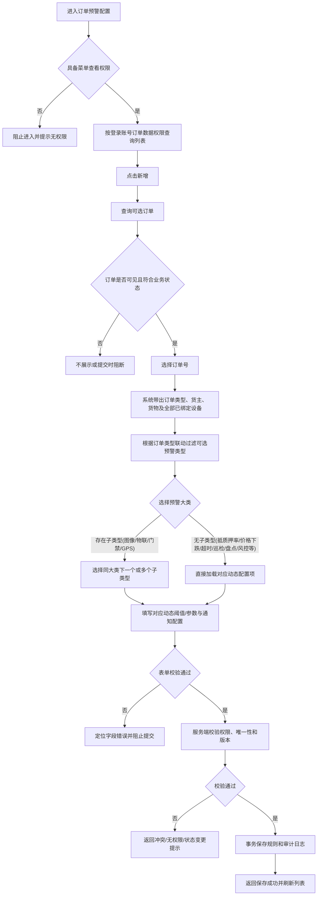
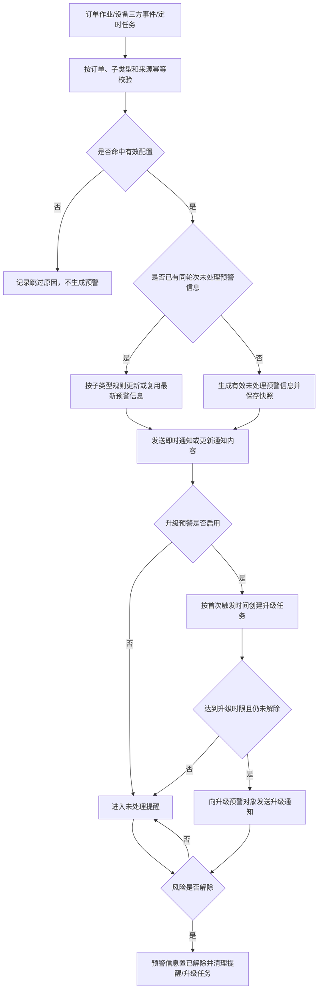
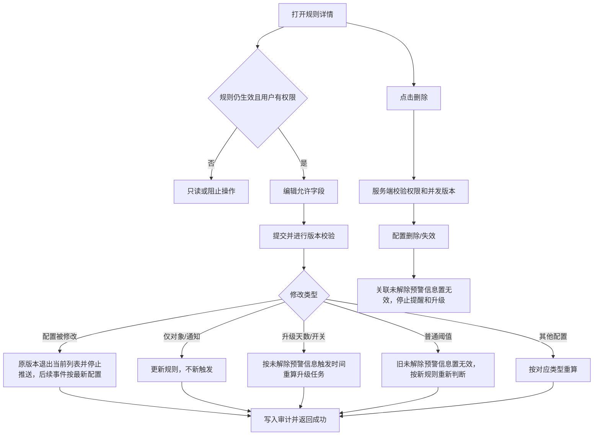
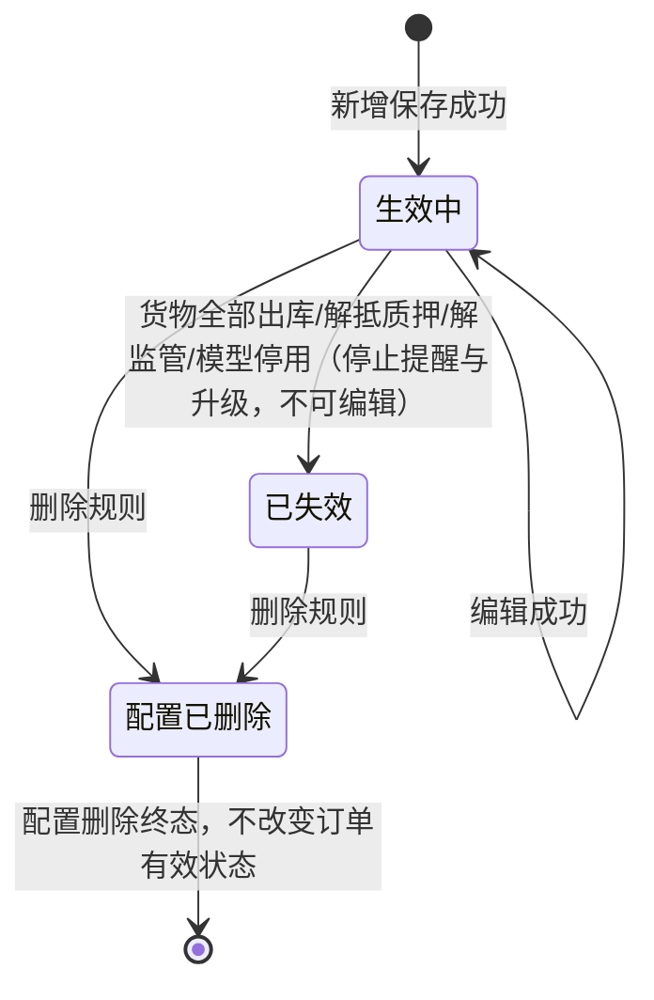

# 订单预警配置业务规则规格

> **文档定位**：订单预警配置的权限、配置校验、预警触发、风险实例、通知升级、编辑、删除和审计规则的唯一定义来源。字段名称和页面作用引用[订单预警配置字段清单](./订单预警配置字段清单.md)，业务流程引用本文件，不在其他文档重复定义规则。
>
> **当前版本**：V1.1 | 2026-08-18
>
> **版本取舍**：以当前字段清单及 2025-09-02、2025-09-18、2025-11-03 等后续规则为当前口径；更早的冲突逻辑只保留在“历史兼容说明”，不作为新配置的执行规则。

## 一、能力边界与术语

| 项目 | 当前规则 |
| :--- | :--- |
| 配置对象 | 选择一个可见订单，为该订单配置预警类型、动态条件和通知对象 |
| 当前订单类型 | 抵/质押、监管；抵/质押率异常只允许用于抵/质押订单 |
| 预警规则 | 用户保存的订单级配置，包含一个或多个同一预警大类下的预警子类型 |
| 预警信息 | 具体订单、货物/二维码、设备或事件触发后系统生成的一条风险预警记录（系统内统一术语为“预警信息”） |
| 升级任务 | 针对未解除的预警信息按升级时长生成的异步通知任务 |
| 有效配置 | 状态为“生效中”且未被删除、失效或逻辑作废的配置 |
| 未处理预警 | 处理状态为“未处理”且记录有效的预警信息；记录被新一轮预警覆盖后保留为“未处理（无效）”，预警自动解除后更新为“已处理（有效）” |

同一订单的同一预警子类型只能存在一条有效配置。一个配置可在同一大类内选择多个子类型；跨大类选择由页面阻止，编辑时不可修改预警类型，只能修改允许编辑的条件、设备和通知字段。

## 二、权限与配置前置条件

### 2.1 菜单权限与数据权限

| 规则ID | 规则 |
| :--- | :--- |
| ORD-P01 | 用户须具备订单预警配置菜单查看权限，才可进入列表；新增、编辑、删除、详情及预警处理权限分别校验对应操作权限。 |
| ORD-P02 | 订单候选范围、列表、详情和编辑对象均按当前登录账号的订单数据权限过滤；可见订单才可见其相关预警配置和动态选项。 |
| ORD-P03 | 订单数据权限变化后，已无权访问的订单不得出现在新增选择器和列表中；保存、编辑、删除接口必须再次在服务端校验权限，不能只依赖前端列表结果。 |
| ORD-P04 | 抵/质押率异常为11个预警大类之一，仅适用于抵/质押订单。新增选择订单后，系统根据订单类型联动过滤预警类型（监管订单不展示“抵/质押率异常”）；若通过非法接口提交则严格阻断。 |

### 2.2 新增候选与唯一性

| 规则ID | 规则 |
| :--- | :--- |
| ORD-P11 | 新增时选择单个订单号，订单号下拉选项只返回当前账号有权限且仍符合业务状态的订单；订单候选的状态条件由订单/抵质押模块返回，前端不得自行推断状态。 |
| ORD-P12 | 提交时按“租户 + 订单唯一标识 + 预警子类型 + 有效状态”校验唯一性；已存在有效配置的子类型不得重复配置。 |
| ORD-P13 | 同一订单的一条配置允许选择同一预警大类下的多个子类型，但不能通过拆成多条配置绕过子类型唯一性。 |
| ORD-P14 | 新增保存、编辑保存和删除均使用订单唯一标识及规则唯一标识，不得使用列表序号作为请求关联键。 |

## 三、配置表单规则

### 3.1 基础与类型字段

| 规则ID | 规则 |
| :--- | :--- |
| ORD-F01 | 规则名称仅新增页填写；编辑页只读展示。规则名称在租户内不能重复，长度不超过50个字符；列表不支持模糊筛选。 |
| ORD-F02 | 订单号、订单类型、货主姓名、货主手机号和货物由系统根据订单关系带出，用户不可直接修改。 |
| ORD-F03 | 预警类型为必填；同一大类内支持多选，不允许跨大类选择。选择预警类型后只展示对应动态字段并执行条件必填校验。 |
| ORD-F04 | 编辑页预警类型不可修改。若需增加或移除预警子类型，须按权限先处理原配置，再新增符合唯一性约束的新配置。 |
| ORD-F05 | 切换或取消预警类型时，未提交的动态字段由前端清理；已保存配置不因前端隐藏字段而自动删除，服务端按配置版本执行变更。 |

### 3.2 动态预警配置

| 预警类型 | 当前规则 |
| :--- | :--- |
| 解抵/质押/监管超时 | 对订单内可识别的二维码/批次逐条展示阈值配置；至少填写一条阈值，未填写的二维码不参与本配置触发。配置区展示按实际时间点计算的预计触发时间。 |
| 价格下跌 | 录入非负百分比；仅当货物价值基准和最新估值均可取得时计算，无法取得完整货物价值的“不参考货物价值”监管订单跳过本类型，不生成预警。 |
| 图像识别异常 | 在图像识别大类内选择行人入侵、车辆入侵、物品形态变化等子类型；同一订单同一子类型只能有一条有效配置。 |
| 盘点异常 | 勾选即启用；盘点结果异常时触发。具体盘点数量差异以盘点模块处理结果为准。 |
| 巡检异常 | 支持配置多个巡检人并为每个巡检人独立配置不同的巡检周期（非负整数，单位：天）；巡检与盘点完全解耦，巡检人员未按各自周期在巡检模块完成巡检时分别触发预警。 |
| 物联设备 | 可选择烟感、温度、湿度、二氧化碳、氧气等子类型；阈值不允许为空，温度支持负数，其他指标大于0且最低值必须小于最高值，越界触发，空值不触发。 |
| 智能挂锁异常 | 勾选即启用；对应门锁异常事件触发，包括拆壳、锁舌被卡、锁杆被剪、非法开箱、拆卡报警、密码错误、关锁异常及低电量等设备事件。 |
| 抵/质押率异常 | 固定配置平仓线、补仓线两组阈值；每组必选解除方式，可多选补仓、平仓、部分结清；抵/质押率超过对应阈值时命中预警线。 |
| 人脸门禁异常 | 选择门未关、密码错误等已定义门禁异常子类型；设备事件触发预警。 |
| GPS异常 | 选择进围栏、出围栏、普通限速、怠速滞留、路线偏离、非法拆除等已定义子类型；GPS事件触发预警。 |
| 贷中风控预警 | 勾选即启用；启用后单选智风控平台已上架且经风控确认可使用的风控模型产品。若所选产品在智风控中被停用，该预警配置自动变为“已失效”。 |

### 3.2.1 贷中风控管理数据同步

| 规则ID | 规则 |
| :--- | :--- |
| ORD-M01 | 订单预警配置选择“贷中风控预警”且保存成功后，系统按租户和订单唯一标识创建或更新一条贷中风控管理记录；保存失败不得生成管理记录。 |
| ORD-M02 | 同一订单在贷中风控管理中始终只保留一条当前记录；重复保存、重复请求或配置编辑均使用幂等更新，不得插入重复记录。 |
| ORD-M03 | 首次保存写入订单、货主、押品、订单类型、订单生成时间、关联风控模型和配置版本；编辑保存更新当前模型和配置状态，但不删除贷中风控历史执行记录。 |
| ORD-M04 | 配置停用、失效或删除后，贷中风控管理记录保留用于历史追溯并计算为不可执行；后续是否允许重新生成或恢复由配置生命周期和贷中风控管理规则共同校验。 |
| ORD-M05 | 配置同步与配置保存必须处于同一事务边界，或通过可靠消息和补偿机制保证最终一致；管理记录同步失败时不得向前端返回保存成功。 |

### 3.3 抵/质押率双阈值规则

| 规则ID | 规则 |
| :--- | :--- |
| ORD-F21 | 平仓线、补仓线两组阈值均必须配置；每组阈值支持负数和两位小数，触发比较不包含阈值本身，即严格大于阈值才命中。 |
| ORD-F22 | 平仓线阈值必须大于补仓线阈值；两组阈值区间不得产生交集。当前值高于平仓线阈值时命中平仓线；高于补仓线且不高于平仓线时命中补仓线。 |
| ORD-F23 | 每组解除方式必选且可多选：补仓、平仓、部分结清。两组解除方式可以相同，但命中哪条线就使用哪组配置的解除方式。 |
| ORD-F24 | 计算公式为：抵/质押率 = 贷款余额 / 货物当前价值。货物当前价值、贷款余额或抵/质押率无法计算时不触发，展示缺失抵/质押率为“—”。 |
| ORD-F25 | 触发预警信息必须保存命中的预警线（平仓线/补仓线）及触发时的抵/质押率、贷款余额和货物价值，用于报表统计、详情和升级通知。 |

### 3.4 通知与升级配置

| 规则ID | 规则 |
| :--- | :--- |
| ORD-F31 | 站内消息默认开启且不作为可取消的勾选项；邮件、短信为可选通知渠道。预警对象必填，但通知渠道非必填。邮件通知启用后，发件人和抄送对象按条件必填。 |
| ORD-F32 | 升级预警为选填开关；关闭时不展示或不校验升级天数、升级预警对象等条件字段；开启时升级对象和升级天数必须完整。 |
| ORD-F33 | 预警对象、升级预警对象按当前租户及机构范围选择；发送时再次校验账号为启用状态，停用账号不得发送短信/邮件，并记录跳过原因。 |
| ORD-F34 | 预警对象发生变更不生成新一轮普通预警，仅影响后续普通/定时/升级消息的接收对象。 |

## 四、预警触发与解除规则

### 4.1 通用触发与状态

| 规则ID | 规则 |
| :--- | :--- |
| ORD-T01 | 外部设备事件、订单作业事件和定时任务均必须使用幂等键处理，重复回调不能重复创建同一预警信息记录。 |
| ORD-T02 | 普通预警触发后立即生成“未处理（有效）”预警信息，并默认生成站内消息；邮件、短信按配置发送。风险未解除前，按同一规则和接收人员的最新预警消息执行定时提醒。 |
| ORD-T03 | 每条预警信息保存订单、预警子类型、触发时间、触发值、配置版本、解除方式/命中线及来源设备或二维码等快照。 |
| ORD-T04 | 预警自动解除或完成对应业务解除后，预警信息更新为“已处理（有效）”，停止该记录的定时提醒和升级任务；同一业务对象后续再次满足条件时，按新轮次生成新预警信息。 |
| ORD-T05 | 普通预警消息和站内预警信息记录不因短信合并而合并；短信批次可按接收人和发送策略合并。 |

### 4.2 订单预警类型触发矩阵

| 类型 | 触发规则 | 解除规则 |
| :--- | :--- | :--- |
| 解抵/质押/监管超时 | 以二维码/批次的实际抵/质押/监管成功时间为起点，加上配置的整数天数（1天=24小时）；超过预计时间仍未解抵/质押/监管则触发。提货或置换质押物完成对应二维码解除；置换后的新二维码从新质押时间重新计算。 | 对应二维码完成解抵/质押/监管后解除。 |
| 价格下跌 | 按当前规则取基准货物总价值与最新货物估值；跌幅计算公式为：`跌幅 = (基准货物总价值 - 最新货物估值) / 基准货物总价值 * 100%`，结果保留两位小数，跌幅计算值为正且严格大于用户配置比例时触发。 | 解除动作由“押品预警信息”菜单负责；本配置模块只定义触发、通知和升级规则。 |
| 图像识别异常 | 订单绑定监控设备收到三方推送且命中已选图像子类型时触发；不同子类型按独立配置和预警信息处理。 | 依作业端风险处理完成解除；轮次按首次触发时间计算升级。 |
| 盘点异常 | 订单盘点结果异常时触发。再次盘点时，向升级预警对象发送“已重新盘点”通知；多异常提交按盘点模块结果生成通知和升级任务。 | 按盘点模块处理结果解除。 |
| 巡检异常 | 巡检人员未按各自独立周期在巡检模块完成巡检时触发；巡检与盘点完全解耦，巡检配置修改后按新周期重新判断。 | 对应巡检人员在巡检模块完成要求的巡检后解除；与盘点作业完全解耦。 |
| 物联设备 | 订单绑定物联设备任一已配置指标越过上下限或命中异常事件时触发。 | 温度、湿度等设备数据恢复到阈值范围内时自动解除，预警信息更新为“已处理（有效）”；不能手动解除；无采集值不满足重新触发条件。 |
| 智能挂锁异常 | 订单绑定的智能挂锁收到已配置异常事件时触发。 | 由“设备预警信息”菜单负责解除；拆壳、锁舌被卡、锁杆被剪、非法开箱、拆卡报警、密码错误、关锁异常和电量低于20%等非离线行为类预警，支持具备预警处理权限的用户人工解除。人工解除必须填写情况说明，现场照片选填，并联动解除预警抓拍；提交成功后更新为“已处理（有效）”。同一设备同一子类型再次触发时，已处理记录不参与未处理去重，按新预警轮次生成记录；原有未处理记录则按设备预警信息的分类去重规则，仅保留一条有效未处理记录。门锁离线按非物联设备离线规则收到重新上线结果后自动解除，不支持人工解除。 |
| 抵/质押率异常 | 计算抵/质押率并命中补仓线或平仓线时触发，记录命中线和数值快照。 | 处理页面展示命中线对应的解除方式，完成补仓、平仓或部分结清后解除。 |
| 人脸门禁异常/GPS异常/贷中风控预警 | 命中已配置的门禁、GPS或风控模型事件时，按普通订单预警生成“未处理（有效）”预警信息并发送通知；同一子类型按有效配置唯一性处理。贷中风控模型按单选配置处理，模型停用后规则置为失效。 | 由对应业务模块提供解除结果；解除后更新为“已处理（有效）”。 |

### 4.3 设备事件展示与抓拍

图像识别、物联、智能挂锁、人脸门禁和 GPS 预警引用订单已绑定设备。智能挂锁触发时，按设备所在位置关联监控设备抓拍图片作为预警内容；列表图片默认展示默认图，点击放大时前端再通过后端换取真实图片，并执行权限校验。抓拍设备范围、失败处理和保留周期沿用设备预警信息的仓库-库房-分区抓拍规则。

## 五、通知、升级与消息去重

| 规则ID | 规则 |
| :--- | :--- |
| ORD-N01 | 触发后立即生成预警信息并默认发送站内消息；邮件、短信按配置渠道发送。同一接收人、同一规则的未处理提醒以该规则最新有效预警消息为依据，不重复发送已失效或已处理消息。 |
| ORD-N02 | 升级预警以该预警轮次第一次触发时间为起点，达到升级天数且风险未解除时生成升级任务并发送升级通知；图像识别和盘点不得用轮次内最新一次事件覆盖起点。 |
| ORD-N03 | 2025-11-03 的最新补充：编辑后新增升级预警时，从对应配置产生的最新一条未处理且有效预警消息中判断升级；多子类型配置仅对符合条件的最新类型生成升级任务，其他类型待新消息产生后再生成。 |
| ORD-N04 | 抵/质押率升级通知展示普通预警触发时快照的抵/质押率、贷款余额和货物价值，不使用升级触发时的实时值。解除方式按当前规则展示的历史兼容口径需与数值快照分开处理。 |
| ORD-N05 | 短信/邮件发送前校验接收账号启用状态、租户和机构可见范围；发送失败记录失败原因和重试关联键，不重复创建预警信息记录。 |

## 六、编辑、删除与版本处理

### 6.1 编辑与失效处理

| 变更项 | 当前处理 |
| :--- | :--- |
| 配置被修改 | 按2025-03-06口径，原订单预警配置版本不再作为当前配置在列表中展示，也不再推送新预警信息；后续预警触发按照最新配置执行。已产生预警保留触发时的配置版本和历史快照，不回写。 |
| 预警对象/升级预警对象 | 更新配置，不生成新一轮普通预警；后续消息使用新对象。 |
| 升级预警天数 | 未触发或已解除：仅更新规则；已触发且未解除：按原触发时间立即重算，达到条件则发送升级消息。 |
| 升级预警开关 | 开启：未解除风险存在时重算并生成/保留升级任务；关闭：未解除风险存在时清除升级任务；无未解除风险时仅更新配置。 |
| 普通预警阈值 | 按业务对象重新判断。若旧预警未解除且新条件成立，旧预警信息置为无效并生成新预警信息；若无未解除预警信息或旧预警信息已处理，则按新配置重新判断。 |
| 二维码超时阈值 | 只对阈值实际发生变化的二维码执行版本切换；新预警信息按该二维码质押/监管成功时间和新阈值计算。 |
| 抵/质押率阈值/解除方式 | 阈值修改按新规则重新计算；命中线和触发快照随新预警信息生成。解除方式修改是否实时覆盖历史预警信息展示，按 2025-10-22 兼容口径处理，但不覆盖数值快照。 |
| 规则失效 | 抵/质押单、监管单下的货物全部出库，或完成对应的解抵押、解质押、解除监管后，或配置的贷中风控模型在智风控中停用后，配置进入“已失效”状态；已失效规则不可编辑，只能删除；配置失效后，关联的未处理预警信息记录置为无效，停止定时提醒和升级任务。 |
| 规则删除 | 删除配置进入“配置已删除”终态，仅结束配置生命周期，不改变关联订单有效状态；该配置产生的未解除预警信息置为无效，不再继续普通提醒和升级任务，历史消息是否保留只读展示由押品预警信息模块决定。 |

### 6.2 并发与审计

- 新增、编辑、删除、升级任务生成和预警信息状态变更必须使用服务端版本校验或等效锁，避免同一配置被并发覆盖。
- 同一配置的保存请求必须幂等；重复提交返回同一处理结果，不重复产生新预警或通知任务。
- 审计记录操作人、角色、时间、IP、请求标识、配置版本、操作前后值、执行结果和失败原因；手机号、邮箱和通知内容中的敏感字段按权限脱敏。

## 七、历史兼容说明与待确认边界

- 早期“抵/质押率单阈值”已被 2025-09-02 双阈值规则替代；历史预警信息保留原命中规则，不回写为新双阈值结果。
- 2025-03-06 的配置修改规则当前解释为：原订单预警配置版本退出当前配置列表且停止推送，后续事件按最新配置执行；历史预警快照不回写。
- 早期“删除配置后历史未解除预警仍有效但停止提醒”与 2025-03-21“未解除消息置为无效”冲突，当前采用后者；历史数据迁移需由押品预警信息模块单独处理。
- 早期价格下跌曾使用最低货物价值/总货物价值口径，当前采用最新货物估值与后台货物总价值口径；历史预警信息保留触发时快照。
- 订单预警大类与子类型已在字段清单中定义；巡检异常与盘点作业完全解耦，巡检完成由巡检单确认；各类型风险解除由“押品预警信息”菜单及对应业务模块继续维护。

---

## 业务流程与联动

> 以下内容由原《订单预警配置业务流程》合并，与上文规则 ID 配合阅读；重复的状态机定义以上文为准。

> **文档定位**：订单预警配置的页面入口、配置、预警触发、通知升级、编辑、删除和异常分支流程。字段定义引用[订单预警配置字段清单](./订单预警配置字段清单.md)，规则定义引用[订单预警配置业务规则规格](./订单预警配置业务规则规格.md)。
>
> **版本**：V1.1 | 2026-08-18

## 一、业务范围

订单预警配置用于为一个可见订单配置一个或多个同一预警大类下的预警子类型，并配置预警对象、升级预警对象和通知渠道。订单相关设备预警依赖抵/质押单或订单已绑定设备；平台设备本身的预警配置由设备预警配置模块负责。

## 二、配置主流程

## 三、订单选择与数据权限流程

1. 用户进入页面后，服务端按登录账号订单数据权限返回列表和订单选择器数据。
2. 订单选择器只返回当前可见且满足订单模块状态条件的订单；前端不缓存跨权限订单。
3. 选择订单后，服务端按订单唯一标识查询订单类型、货主、货物、抵/质押批次/二维码和已绑定设备；设备相关预警默认监控该订单当前全部绑定设备，不提供部分设备选择。
4. **预警类型联动过滤**：系统根据订单类型自动过滤可选预警类型。监管订单不展示“抵/质押率异常”；抵/质押订单展示全部11个预警大类（含“抵/质押率异常”）。
5. 订单数据权限在保存、详情、编辑和删除接口再次校验。用户在页面打开后失去权限时，后续操作必须失败并保留原配置。
6. 订单内设备只能作为订单预警的关联设备上下文使用；设备资产级规则进入设备预警配置处理。

## 四、动态配置流程

### 4.1 预警类型

编辑时预警类型不可修改。需要改变预警类型时，先处理原有效配置，再按唯一性规则新建配置。

### 4.2 解抵/质押/监管超时

1. 系统拉取订单内可识别的二维码/批次，按二维码/批次逐条展示阈值输入项。
2. 至少填写一条阈值；未填写阈值的二维码不参与该规则触发。
3. 对每条已配置二维码，以实际抵/质押/监管成功时间为起点，加上阈值天数计算预计触发时间，一天按24小时计算。
4. 质押物置换产生新二维码时，新二维码从新质押成功时间重新计算；不得沿用旧二维码的起算时间。

### 4.3 抵/质押率异常

1. 仅抵/质押订单展示该类型；监管订单选择后阻止保存。
2. 展示并配置平仓线、补仓线两组阈值，每组选择补仓、平仓、部分结清等解除方式。
3. 保存时校验平仓线阈值高于补仓线阈值、阈值边界和两组范围不交集。
4. 详情和预警处理页面按命中的预警线展示对应解除方式。

## 五、预警触发与通知流程

### 5.1 触发来源

| 来源 | 处理 |
| :--- | :--- |
| 解抵/质押/监管超时定时任务 | 按二维码/批次阈值和实际时间点判断；触发后保存二维码、阈值和起算时间快照 |
| 价格/抵质押率计算任务 | 按最新有效配置计算；缺少必要价值时跳过并记录原因 |
| 监控、物联、门禁、GPS三方事件 | 校验订单绑定设备、预警子类型和配置版本后生成或更新预警 |
| 盘点/巡检作业 | 接收作业端结果；巡检支持配置多人员独立周期考核，按对应模块的异常和解除规则处理 |

### 5.2 通知与提醒

- 普通预警触发后立即生成站内预警信息并默认发送站内消息；邮件、短信按配置渠道发送。
- 未解除风险的定时提醒以同一规则、不同接收人的最新有效未处理预警信息为依据。
- 升级通知不取升级发生时的实时风险数值；抵/质押率使用首次普通预警快照。
- 发送前校验接收账号启用状态；停用账号不发送并记录跳过原因。

## 六、编辑与删除流程

配置修改后，原配置版本不再作为当前配置在列表中展示，也不再推送新预警信息；后续事件按最新配置执行，已产生预警保留触发时的配置版本和历史快照。删除不回写订单或设备主数据；已失效规则不可编辑，仅支持删除操作；配置失效后，关联未解除预警信息置为已失效，停止触发历史定时提醒和升级任务。

## 七、异常与并发流程

| 场景 | 处理 |
| :--- | :--- |
| 订单失去数据权限 | 列表不展示；已打开页面提交时阻断，原配置不变 |
| 订单已被其他规则占用同一子类型 | 阻止保存，返回冲突字段和已有规则标识 |
| 第三方事件重复回调 | 按事件唯一标识幂等，不重复生成预警信息或通知 |
| 订单设备已逻辑删除 | 订单配置可展示设备快照；不自动删除规则，按用户或后端失效规则处理 |
| 通知发送失败 | 记录失败原因和请求标识；不回滚已生成的预警信息 |
| 并发编辑 | 版本不一致时拒绝覆盖，提示重新加载最新配置 |
| 多二维码部分配置 | 只对已配置阈值的二维码生效，未配置项不触发 |

## 八、状态转换

预警信息状态独立于配置状态，采用“处理状态 + 记录有效性”表达：未处理（有效）表示预警尚未解除，未处理（无效）表示已被最新预警覆盖或因配置失效，已处理（有效）表示预警已自动解除或完成对应业务解除。配置删除、失效或设备权限撤销后，关联未处理预警信息置为无效，停止定时提醒和升级任务，历史预警记录保留只读追溯。

## 修订记录

| 日期 | 版本 | 变更 |
| :--- | :---: | :--- |
| 2026-08-20 | — | 合并原《订单预警配置业务流程》至本文件「业务流程与联动」章节 |
