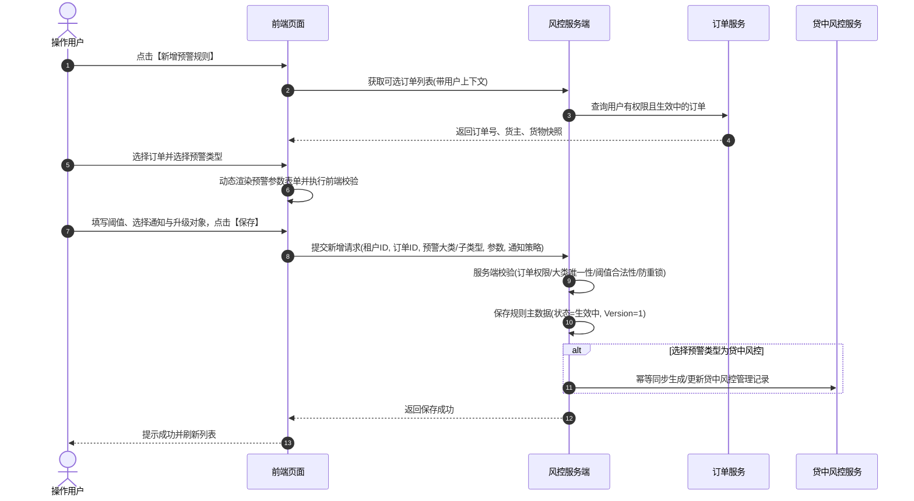

# 订单预警配置主需求文档

> **版本**：V1.8 | 2026-08-19
> **读者**：研发工程师、测试工程师、风控产品经理、架构师
> **编写依据**：[订单预警配置字段清单](./订单预警配置字段清单.md)、[订单预警配置业务规则规格](./订单预警配置业务规则规格.md)、[订单预警配置业务流程](./订单预警配置业务规则规格.md)
> **字段基准**：`订单预警配置字段清单.md` 是本模块所有业务字段与系统字段的唯一定义来源；本主 PRD 负责业务逻辑、操作规范、状态机流转与跨系统联动闭环。

---

## 1. 业务背景

在供应链金融大宗商品存货质押与监管业务中，货权质押期长、市场价格波动大、仓储作业频繁，资金方与监管方需要对质押物与监管订单进行全生命周期的风险监控。
**订单预警配置**作为订单级风险规则的中枢入口，支持针对抵/质押订单或监管订单，灵活配置价格下跌、质押率异常、图像识别、物联网异常、挂锁/门禁、巡检异常、超时解押以及贷中风控模型等 **11 大类预警规则**与动态通知升级策略。规则生效后，由风控引擎实时捕获相关事件并生成订单级押品预警流水，支撑后续风控处置。

---

## 2. 功能范围

### 2.1 本期范围
- **规则列表与组合筛选**：支持按规则名称（模糊匹配）、订单号、订单类型（抵/质押、监管）、预警类型（多选）、货物名称等多维度组合筛选；
- **订单选择与联动加载**：根据登录账号订单数据权限动态加载可选订单列表；选定订单后，根据订单类型动态过滤可选预警类型；
- **动态预警阈值配置**：支持 11 类预警子类型的差异化表单渲染与参数必填校验（如温湿度范围、巡检人员与独立周期组合、补仓线/平仓线阈值与解除方式、风控模型绑定等）；
- **通知与超时升级策略**：支持配置站内信（默认）、邮件（发件人、抄送人）、短信通知对象，以及未解除预警持续 N 天后的升级预警对象；
- **规则生命周期管理**：支持规则的新增、编辑、删除、查看详情及规则生效/失效自动流转；
- **跨模块联动**：与智风控模型平台对接、与订单解押/出库生命周期联动、与押品预警信息生成闭环；
- **安全与审计**：订单数据权限强校验、乐观锁并发控制、重复提交防重锁与全路径操作审计。

### 2.2 移动端范围
- 移动端仅支持订单预警规则列表查看与详情只读浏览；规则的新增、编辑与删除操作统一在 Web 端完成。

### 2.3 不在本期范围
- 设备物理基础档案与仓库绑定维护（归属 [01设备管理](../../02-仓储/16-设备管理-监控设备/监控设备主PRD.md)）；
- 纯设备物理状态独立预警（归属 [02设备预警配置](../20-风险管理-设备预警配置/设备预警配置主PRD.md)）；
- 押品预警产生后的核查、解除与单据处置（归属 [02押品预警信息](../../05-风控/06-风险信息-押品预警信息/押品预警信息主PRD.md)）；
- 智风控模型内部算法与评分引擎计算（归属智风控平台）。

---

## 3. 模块定位与上下游关系

### 3.1 系统位置

| 项目 | 内容 |
| :--- | :--- |
| **模块层级** | 风险管理配置层（订单级风控规则引擎入口） |
| **核心职责** | 维护订单维度风险预警类型、动态阈值参数、通知渠道与升级对象 |
| **上游依赖** | 抵/质押订单与监管单据、设备绑定档案、盘点/巡检任务、IoT 物联网采集、智风控平台产品 |
| **下游引用** | [02押品预警信息](../../05-风控/06-风险信息-押品预警信息/押品预警信息主PRD.md)、[04贷中风控管理](../../05-风控/08-风险信息-贷中风控管理/贷中风控管理主PRD.md)、通知发送服务、[05风险公示](../../05-风控/09-风险信息-风险公示/风险公示主PRD.md) |
| **业务单据** | 本模块维护风控规则配置主数据，不生成业务审批单据，但直接驱动下游风险工单 |

### 3.2 预警类型分类与模型矩阵

系统支持 11 类订单预警，按订单业务类型进行权限约束：

| 序号 | 预警大类 | 子类型 / 动态配置项 | 适用订单类型 | 触发条件与说明 |
| :---: | :--- | :--- | :--- | :--- |
| 1 | **解抵/质押/监管超时** | 超时天数（非负整数，天） | 抵/质押、监管 | 对应二维码/批次实际生效起算，超过阈值未解除且未出库触发 |
| 2 | **价格下跌** | 下跌比例（非负数字，%） | 抵/质押、监管 | 订单货物实时总价值下跌严格大于配置比例时触发 |
| 3 | **图像识别异常** | 行人入侵、车辆入侵、物品形态变化（多选） | 抵/质押、监管 | 依赖订单绑定摄像头图像锚点 AI 算法，命中已选事件时触发 |
| 4 | **盘点异常** | 开关勾选即启用 | 抵/质押、监管 | 盘点模块实际盘点数量与系统账面数量不一致时触发 |
| 5 | **巡检异常** | 巡检人（人员多选/行）+ 巡检周期（天） | 抵/质押、监管 | 巡检与盘点解耦；允许不同巡检人独立周期，超期未巡检触发 |
| 6 | **物联设备** | 烟感、温度、湿度、二氧化碳、氧气（上下限范围） | 抵/质押、监管 | 必须配置最低与最高值；采集值越界触发，恢复到范围内自动解除 |
| 7 | **智能挂锁异常** | 拆壳/卡舌/剪杆/非法开箱/拆卡/密码错误/低电等 | 抵/质押、监管 | 智能挂锁上报异常硬件事件时触发 |
| 8 | **抵/质押率异常** | 补仓线/平仓线阈值 + 解除方式（补仓/平仓/部分结清） | **仅抵/质押订单**（监管订单禁用） | 平仓线必须高于补仓线；订单实际质押率严格大于阈值时触发 |
| 9 | **人脸门禁异常** | 门未关、密码错误（多选） | 抵/质押、监管 | 人脸门禁设备上报对应安全事件时触发 |
| 10 | **GPS异常** | 进/出围栏、超速、怠速滞留、偏离、非法拆除 | 抵/质押、监管 | GPS 车载/便携设备上报越界或拆除事件时触发 |
| 11 | **贷中风控预警** | 风控模型产品（智风控上架产品单选） | **仅抵/质押订单** | 勾选后自动在贷中风控管理建立台账，模型异步拒绝时触发预警 |

---

## 4. 页面与字段规则

### 4.1 字段引用基准
- 基础识别字段（订单号、订单类型、货主、货物等）由系统自动从订单主数据带出，用户不可手动篡改。
- 具体字段定义、展示顺序、筛选类型及校验规则统一以 [订单预警配置字段清单](./订单预警配置字段清单.md) 为准。

### 4.2 数据可见范围与权限矩阵

| 数据对象 | 可见范围与权限规则 | 越权控制机制 |
| :--- | :--- | :--- |
| **规则列表** | 登录账号必须拥有规则所关联订单的**订单数据权限**才可见；无权订单自动过滤 | 服务端强制基于用户订单权限表进行 SQL `WHERE` 条件过滤 |
| **新增可选订单** | 仅展示当前登录账号有权查看且业务状态处于“抵/质押中”或“监管中”的有效订单 | 下拉接口服务端实时校验订单权限与订单生命周期状态 |
| **规则详情 / 编辑** | 必须同时校验规则所属租户、规则有效性及当前用户的订单数据权限 | 详情与更新接口均在服务端按订单 ID 进行权限拦截，禁止仅凭规则 ID 越权操作 |
| **规则删除** | 仅具备订单预警配置管理权限且拥有订单权限的用户可执行删除 | 执行软删除标记，并在审计日志中记录删除事实 |

---

## 5. 操作功能详解

### 5.1 操作总览

| 操作名称 | 操作入口 | 适用状态 | 前置条件 | 是否改变配置主数据 | 是否引发下游联动 |
| :--- | :--- | :--- | :--- | :---: | :---: |
| **新增规则** | 列表顶部操作栏 | 全部 | 具备新增权限，存在有效可选订单 | 是 | 是，若为贷中风控自动同步台账 |
| **编辑规则** | 列表操作列 | 生效中 | 具备编辑权限，拥有订单数据权限 | 是 | 是，更新动态阈值与通知对象 |
| **删除规则** | 列表操作列 | 生效中、已失效 | 具备删除权限，拥有订单数据权限 | 是 | 是，关联未处理预警置为无效 |
| **查看详情** | 列表操作列 / 规则名称 | 全部 | 具备查看权限，拥有订单数据权限 | 否 | 否 |

---

### 5.2 新增预警规则

- **表单校验规则**：
  - **规则名称**：必填，租户内唯一，长度不超过 50 字符；
  - **唯一性约束**：同一订单 + 同一预警子类型在租户内只允许存在一条有效配置；
  - **阈值校验**：温湿度最低值必须严格小于最高值；价格下跌比例严格大于 0；平仓线阈值必须高于补仓线；
- **并发与幂等**：采用 `租户ID + 订单ID + 预警子类型` 分布式锁，防止并发重复提交。

---

### 5.3 编辑预警规则
- **入口与交互**：点击列表操作列【编辑】，弹出编辑抽屉/弹窗；
- **控制规则**：
  - **规则名称、订单号、订单类型、预警大类与子类型**置灰禁止修改；
  - 允许修改：已选类型的动态阈值参数、巡检人组合、通知渠道、发件人/抄送人、预警对象、升级天数与升级对象；
- **并发控制**：提交时必须携带当前配置的 `Version` 版本号，执行乐观锁校验。若版本冲突则阻断更新并提示“当前配置已被其他人修改，请刷新后重试”。

---

### 5.4 删除预警规则与失效流转
- **删除操作**：
  - 弹出二次确认弹窗：“确认删除该预警规则？删除后系统将停止基于该规则的监控与升级通知。”
  - 确认后执行软删除，记录状态更新为已删除终态；
- **自动失效机制**：
  - 当关联订单完成解押、解质押、解除监管或货物全部出库后，系统由订单事件驱动将该配置自动置为 `已失效`；
  - 若关联的智风控模型被平台停用，配置自动置为 `已失效`；
- **未处理预警联动**：
  - 规则被删除或置为失效后，该规则已生成的处于“未处理”状态的押品预警信息，由风控引擎自动标记为 `未处理（无效）`，并停止后续定时提醒与升级通知；历史已处理记录保持只读。

---

## 6. 异常处理与安全保障

1. **订单权限穿透拦截**：所有读写接口均在服务端强制重新读取当前登录账号的订单权限，禁止前端通过拼接订单号越权；
2. **三方事件重复消费防重**：设备事件或智风控回调接入时，使用 `租户 + 订单 + 规则 + 来源事件ID` 建立幂等键，重复事件直接返回首次结果；
3. **通知异常隔离**：站内信、邮件或短信发送失败时，记录失败原因并进入补偿重试队列，不得导致风控预警生成事务回滚；停用账号自动跳过发送。

---

## 7. 验收标准与测试用例

| 用例编号 | 测试场景 | 前置条件 | 预期输出与系统行为 |
| :---: | :--- | :--- | :--- |
| **ORD-TC01** | 无订单权限用户访问列表 | 登录账号无目标订单权限 | 列表与下拉选择器均不出现该订单，直接请求接口返回 403 越权拒绝 |
| **ORD-TC02** | 监管订单选择抵/质押率异常 | 选择监管类型订单 | 预警类型下拉选项中不展示“抵/质押率异常”，若强制传参服务端直接阻断 |
| **ORD-TC03** | 同一订单重复配置相同子类型 | 订单已存在某子类型的有效配置 | 提交时系统拦截并明确报错“该订单已存在相同类型的有效预警规则” |
| **ORD-TC04** | 阈值参数非法输入校验 | 温度配置最低值 40℃、最高值 30℃ | 表单校验不通过，提示“最低值必须小于最高值”，阻止保存 |
| **ORD-TC05** | 并发编辑乐观锁测试 | 用户 A 与用户 B 同时打开同一规则编辑 | 先提交者成功（Version+1），后提交者被拒绝并提示重新加载最新数据 |
| **ORD-TC06** | 规则删除与未处理流水联动 | 某规则存在 2 条未处理押品预警 | 删除规则成功后，该 2 条预警状态自动变为“未处理（无效）”，定时提醒停止 |

---

## 8. 引用文档与修订记录

### 8.1 关联文档
- [订单预警配置字段清单](./订单预警配置字段清单.md)
- [订单预警配置业务规则规格](./订单预警配置业务规则规格.md)
- [订单预警配置业务流程](./订单预警配置业务规则规格.md)
- [订单预警配置字段清单](./订单预警配置字段清单.md)

### 8.2 修订记录

| 日期 | 版本 | 修订人 | 修订内容 |
| :--- | :---: | :---: | :--- |
| 2026-08-19 | V1.8 | 产品团队 | 深度对齐 6.1 主 PRD 标准，补齐 11 类预警模型矩阵、具体操作细化、并发乐观锁、状态机联动与编号测试用例。 |
| 2026-08-18 | V1.0 | 产品团队 | 初版发布，梳理订单预警配置基本框架。 |
