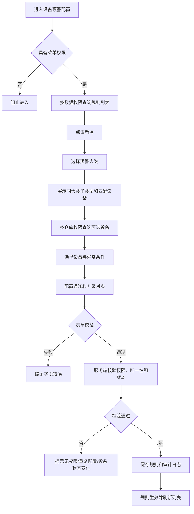
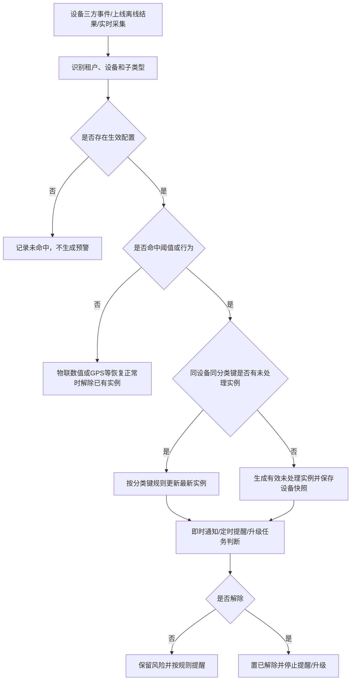
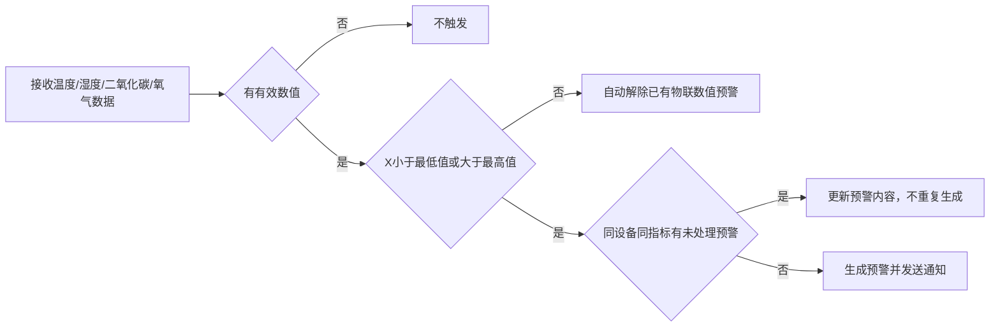
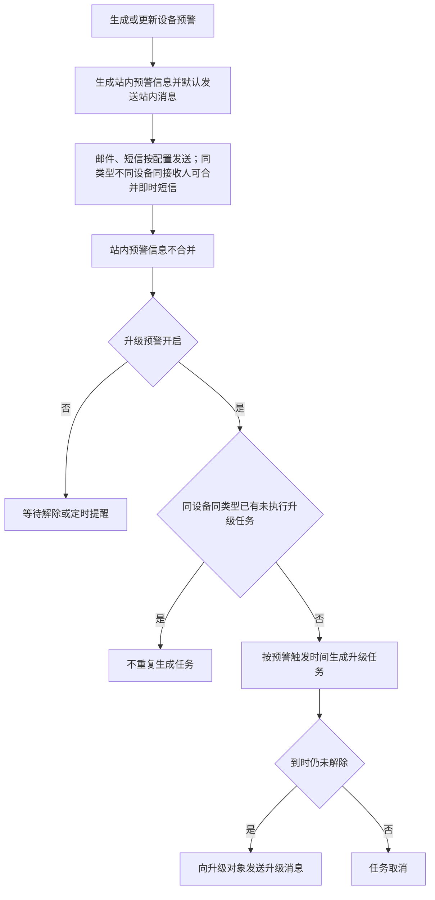
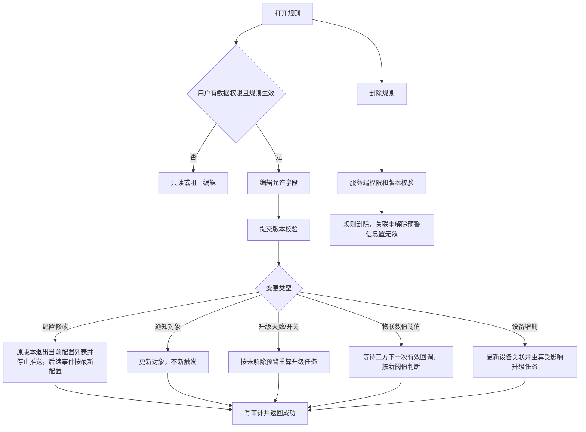
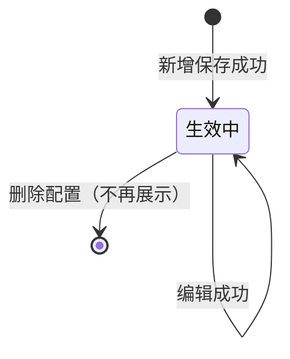

# 设备预警配置业务规则规格

> **文档定位**：设备预警配置的设备范围、权限、预警类型、触发、去重、通知升级、编辑、删除和审计规则的唯一定义来源。字段口径引用[设备预警配置字段清单](./设备预警配置字段清单.md)，设备主数据和设备实时状态引用设备管理模块。
>
> **当前版本**：V1.2 | 2026-08-18
>
> **版本取舍**：以 2025-09-18 预警类型拆分、2025-04/03 设备消息处理及当前字段清单为当前规则；更早“每个设备只能配置一条总规则”的粗粒度口径降为历史兼容说明。

## 一、能力边界与术语

| 项目 | 当前规则 |
| :--- | :--- |
| 配置对象 | 平台设备预警规则；不以订单选择作为配置入口 |
| 预警类型 | 设备图像识别预警、设备物联预警、智能挂锁预警、人脸门禁预警、设备 GPS 预警 |
| 预警子类型 | 具体行为或设备状态，如行人入侵、温度异常、设备离线等 |
| 预警信息 | 某设备命中某一预警子类型后系统产生的风险预警记录（系统统一术语为“预警信息”） |
| 有效配置 | 状态为“生效中”且未删除的设备预警配置；删除通过软删除标记控制，不新增“已删除”展示状态 |
| 配置可见 | 由登录账号数据权限决定 |
| 设备可选 | 由登录账号仓库权限决定 |

当前唯一性粒度为“设备 + 预警子类型 + 有效状态”。同一设备可以在不同图像识别异常分类下配置多个有效子类型，但同一设备同一子类型不得有两条有效配置。若一条配置选择多个同一大类子类型，系统按子类型分别校验唯一性和生成预警信息记录。

## 二、权限与配置前置条件

| 规则ID | 规则 |
| :--- | :--- |
| DEV-P01 | 用户须具备设备预警配置菜单查看权限，才可进入列表；新增、编辑、删除、详情和预警处理权限分别校验。 |
| DEV-P02 | 已绑定位置设备按当前登录账号仓库权限过滤；未绑定具体位置设备作为无仓库归属的例外，对具备设备预警配置菜单权限的账号进入选择器；可查看的设备预警配置按当前登录账号数据权限过滤。两者不能用同一前端条件替代。 |
| DEV-P03 | 设备预警配置选择器允许未绑定具体位置设备进入，但不因此扩大已绑定位置设备的可选范围；新增和编辑保存时服务端重新校验设备可配置范围、设备状态、设备唯一标识及配置唯一性。 |
| DEV-P04 | 新增和编辑保存时服务端重新校验设备权限、设备状态、设备唯一标识及配置唯一性，不能只依赖前端候选列表。 |
| DEV-P05 | 设备显示使用系统内名称、设备编码和绑定位置快照；无权限或已逻辑删除设备不应被伪造为当前可选设备。 |

## 三、配置表单规则

### 3.1 通用规则

| 规则ID | 规则 |
| :--- | :--- |
| DEV-F01 | 规则名称仅新增页填写，编辑页只读；租户内不能重复，长度不超过50个字符；列表支持按规则名称模糊搜索。 |
| DEV-F02 | 预警类型必填；同一大类内子类型可多选，不允许跨大类选择。编辑页预警类型（大类及子类型）置灰不可修改，但已选子类型的动态参数（如温度、湿度、二氧化碳和氧气上下限阈值）允许编辑修改，并支持维护关联设备及通知配置。 |
| DEV-F03 | 选择设备按预警类型过滤设备资产类型；一个配置可选择多个设备，但每个设备与子类型组合必须通过唯一性校验。 |
| DEV-F04 | 新增、编辑、删除均使用规则唯一标识和设备唯一标识，不得使用列表序号；保存采用版本号或等效并发锁。 |

### 3.2 预警类型与子类型

| 大类 | 当前子类型与触发源 |
| :--- | :--- |
| 设备图像识别预警 | 行人入侵、车辆入侵、物品形态变化、设备离线（摄像头离线）；对应监控摄像头资产，三方推送事件命中即触发。 |
| 设备物联预警 | 温度异常、湿度异常、设备离线（物联设备离线）、烟感异常、二氧化碳异常、氧气异常；对应物联设备资产，温湿度等数值类型配置最低值和最高值。 |
| 智能挂锁预警 | 拆壳、锁舌被卡、锁杆被剪、非法开箱、拆卡报警、密码错误、关锁异常、设备离线（门锁离线）、电量低于20%；对应智能挂锁资产。 |
| 人脸门禁预警 | 门未关、密码错误、设备离线（门禁设备离线）；对应人脸门禁资产。 |
| 设备 GPS 预警 | 进围栏、出围栏、普通限速、怠速滞留、路线偏离、非法拆除、设备离线（GPS设备离线）；对应GPS资产。 |

同一设备可分别配置所属大类下的子类型；不同大类针对不同设备资产，各资产类型的【设备离线】预警独立配置、独立检测与独立生成风险实例。

### 3.3 物联数值阈值

| 规则ID | 规则 |
| :--- | :--- |
| DEV-F21 | 温度、湿度、二氧化碳、氧气等需要范围配置的子类型必须同时具备最低值和最高值，配置值不允许为空；当前值满足 `X < 最低值 OR X > 最高值` 时触发。 |
| DEV-F22 | 温度最低值和最高值允许为负数，其他指标最低值和最高值必须大于0；最低值必须小于最高值；当前值等于上下限时不触发。 |
| DEV-F23 | 设备无有效采集值时不满足触发条件，不得因采集空值生成阈值预警。 |
| DEV-F24 | 温度、湿度、二氧化碳和氧气三方数据可能按3-10秒频率推送；同一设备同一指标存在未处理预警时更新现有预警内容，不重复创建风险实例，避免短信轰炸。 |

### 3.4 通知配置

通知类型、发件人、抄送对象、预警对象、升级预警及升级对象按字段清单执行。发送前校验账号启用状态；停用账号不得接收新短信/邮件，并记录跳过原因。

## 四、预警触发、去重与解除

### 4.1 通用规则

| 规则ID | 规则 |
| :--- | :--- |
| DEV-T01 | 三方系统推送设备离线/上线结果、设备实时数据和算法事件均按“租户 + 设备 + 预警大类/子类型 + 事件唯一标识”幂等处理；SYZC不自行按心跳周期判定离线。 |
| DEV-T02 | 三方推送预警信息到达且命中已启用配置时，立即生成“未处理（有效）”预警实例并默认发送站内消息；邮件、短信按配置发送，预警实例在站内不因短信合并而合并。 |
| DEV-T03 | 未处理预警按预警大类和子类型分类去重：图像识别按“设备 + 算法模板 ID”，物联/挂锁/人脸门禁/GPS按“设备 + 预警子类型”；除物联设备离线按离线轮次处理外，同一分类键仅保留一条有效未处理记录，新事件到达时将旧有效记录置为“未处理（无效）”并生成最新有效记录，不同分类键分别展示。无效记录进入设备预警信息默认列表并计入总数和分页，但不再提醒、升级或人工处理；已处理记录不参与未处理去重，全部保留。 |
| DEV-T04 | 预警实例保存设备、设备名称、绑定位置、触发类型、算法模板 ID/事件 ID、触发值、配置版本和触发时间快照。 |

### 4.2 各类型去重规则

| 类型 | 去重和展示规则 |
| :--- | :--- |
| 图像识别异常 | 行人入侵检测、车辆入侵检测、物品形态监控、设备离线按“设备 + 算法模板 ID”区分；同一设备不同算法模板分别展示，同一算法模板仅保留一条有效未处理记录，覆盖时旧记录置为无效并生成最新记录。算法模板 ID缺失时按设备+图像子类型+事件类型兜底。 |
| 物联设备 | 温度、湿度、烟感、二氧化碳、氧气分别按“设备 + 子类型”只保留一条有效未处理记录；覆盖时旧记录置为无效并生成最新记录；物联设备离线按离线轮次处理，重复离线事件仅更新当前未处理记录；已处理记录不参与该去重。 |
| 智能挂锁异常 | 拆壳、锁舌被卡、锁杆被剪、非法开箱、拆卡报警、密码错误、关锁异常、门锁离线等每种行为按设备分别只保留一条有效未处理记录；覆盖时旧记录置为无效并生成最新记录。 |
| 人脸门禁异常/GPS异常 | 按具体已选子类型（含门禁离线、GPS离线）和设备去重；同一分类键仅保留一条有效未处理记录，覆盖时旧记录置为无效并生成最新记录；已处理记录不参与该去重。 |

### 4.3 设备离线专项规则

| 规则ID | 规则 |
| :--- | :--- |
| DEV-T21 | 各预警大类的【设备离线】严格针对其对应的设备资产类型生效：监控摄像头对应【图像离线】，物联传感器对应【物联离线】，挂锁对应【门锁离线】，门禁对应【门禁离线】，GPS对应【GPS离线】。 |
| DEV-T22 | 离线/上线状态由三方系统判定并推送结果，SYZC只接收结果、匹配对应配置并生成或解除预警，不在本模块配置或计算心跳周期、离线时长；物联设备离线记录额外支持有权限用户人工解除。 |
| DEV-T23 | 三方推送的离线、上线、逻辑删除、权限撤销和物理移除事件需区分事件类型；重复事件按幂等规则处理。 |
| DEV-T24 | 收到三方设备重新上线结果后，除物联设备离线外的离线预警实例更新为“已处理（有效）”，停止定时提醒和升级任务；物联设备离线既可由上线结果自动更新，也可由有权限用户人工解除。物联设备离线按离线轮次处理：同一轮次内重复离线事件仅更新当前未处理记录，不新建记录；人工解除后设备仍未上线时，重复离线事件不生成新记录、不发送新通知；收到有效上线事件后结束当前轮次，下一次离线才生成新预警。 |

### 4.4 解除规则

| 类型 | 当前解除规则 |
| :--- | :--- |
| 物联设备（温度/湿度/二氧化碳/氧气） | 设备有效实际值恢复到配置范围内时自动解除，实例更新为“已处理（有效）”；等于最低值或最高值时不属于越界；不支持用户手动解除。 |
| 烟感异常 | 收到设备恢复正常的有效采集值或三方恢复事件后自动解除，实例更新为“已处理（有效）”；不支持用户手动解除。 |
| 非物联设备离线 | 收到三方设备重新上线结果时自动解除，实例更新为“已处理（有效）”；不支持用户手动解除。 |
| 物联设备离线 | 按离线轮次处理；同一轮次内重复离线事件仅更新当前未处理记录，不执行覆盖生成新记录；人工解除后设备未上线期间忽略重复离线事件，收到重新上线结果时结束当前轮次并可自动更新为“已处理（有效）”，下一次离线才生成新预警；无效历史记录仍进入设备预警信息列表。 |
| 设备 GPS 预警 | 收到三方平台推送的对应恢复/正常状态事件后自动解除，实例更新为“已处理（有效）”；不支持用户手动解除。 |
| 智能挂锁异常 | 解除动作由“设备预警信息”菜单负责；本配置模块只定义触发、通知和升级规则。 |
| 图像识别、人脸门禁异常 | 解除动作由“设备预警信息”菜单负责，支持具备权限的用户人工解除；本配置模块只定义触发、通知和升级规则。 |

## 五、通知与升级规则

| 规则ID | 规则 |
| :--- | :--- |
| DEV-N01 | 及时预警：默认发送站内消息；邮件、短信为可选渠道，同一预警类型、不同设备、同一接收人可合并发送短信；系统内预警实例不合并。通知渠道非必填。 |
| DEV-N02 | 定时提醒：同一预警类型、不同设备、同一接收人合并短信；推送前仅取每台设备该类型有效且未处理的最新预警消息。 |
| DEV-N03 | 升级预警不合并；按预警实例生成升级任务。若同一设备同一预警类型已有未执行升级任务，不重复生成；任务执行或不存在后，新的符合条件预警才可生成任务。 |
| DEV-N04 | 规则为不同设备选择同一接收人时，短信合并不得改变站内预警实例的数量、状态和处理入口。 |
| DEV-N05 | 发送时校验账号启用状态；停用账号不发送并写入发送结果。发送失败应保留失败原因和重试关联键。 |

## 六、编辑、删除与设备关联变更

| 变更项 | 当前处理 |
| :--- | :--- |
| 预警对象/升级对象 | 更新规则，不触发新一轮预警；后续消息按新对象发送。 |
| 配置被修改 | 按2025-03-06口径，原配置版本不再作为当前配置在列表中展示，也不再推送新预警信息；后续预警触发按照最新配置执行。已产生预警保留触发时的配置版本和历史快照，不回写。 |
| 升级预警天数 | 未触发或已解除时仅更新；未解除时按原触发时间重算，达到条件则发送升级消息。 |
| 升级开关 | 开启时对未解除预警重算并创建必要任务；关闭时清除对应未执行升级任务。 |
| 物联数值阈值 | 修改配置时不立即触发预警；等待三方下一次有效回调后，按新阈值判断。无有效值不触发；若回调命中新条件，按当前未处理实例规则更新或生成预警。 |
| 规则内设备 | 增加或移除设备均直接更新关联；对受影响设备检查未解除预警和升级任务，删除无效升级任务后按新关联重新计算。 |
| 删除配置 | 配置删除后不再在配置列表展示；该配置产生的未处理预警记录置为无效，不再继续普通提醒和升级任务。 |
| 规则内设备关联解除、设备解绑、权限撤销/逻辑删除 | 设备预警规则保留设备快照；设备不再匹配新事件，关联未处理有效预警立即置为“未处理（无效）”，停止普通提醒和升级任务；已处理记录不回写，历史记录保留只读；设备重新关联或恢复权限不自动恢复历史预警，须等待新的有效事件。 |
| 设备恢复/重入 | 逻辑删除设备恢复权限或重新接入后的规则关联、设备身份、预警状态和候选范围需按设备管理模块的重入规则处理，不自动恢复历史配置，除非有明确恢复标识。 |

## 七、状态、并发与审计

- 配置列表只展示未删除且处于“生效中”的规则；配置删除后不展示，也不得继续产生新预警。
- 配置保存、设备关联变更、预警状态变更、升级任务创建/清除必须使用版本校验、分布式锁或等效机制。
- 审计记录操作人、角色、时间、IP、请求标识、设备和规则版本、前后值、执行结果及失败原因；账号、手机号、邮箱和第三方敏感内容脱敏。

## 八、历史兼容说明与待确认边界

- 早期“每个设备只能配置一条预警规则”已被后续“同一设备同一预警子类型一条有效配置”细化替代；存量配置迁移不得造成同设备同子类型重复有效配置。
- 2025-03-14 的“同一设备+预警类型+预警内容”通用去重和 2025-05-06 的“同一设备+相同子类型+相同预警解除时间”去重，已被 2026-08-18 的分类去重规则替代；新规则按设备、算法模板或子类型执行，已处理记录全部保留。
- 2025-03-06 配置修改规则当前解释为：原配置版本退出当前配置列表且停止推送，后续事件按最新配置执行；历史预警快照不回写。
- 设备离线/上线状态、烟感恢复状态和 GPS 恢复/正常状态由三方系统判定并推送，SYZC只接收结果；温度、湿度、二氧化碳和氧气阈值修改后按下一次有效采集数据判断；上述自动解除类型均不支持人工解除。
- 设备预警信息与设备预警配置均允许未绑定具体位置设备在租户和模块菜单权限范围内被看见/选中；已绑定位置设备仍分别按信息页查看规则和配置页仓库权限规则处理。
- 图像识别预警触发智能抓拍的抓拍设备范围、图片保留、失败重试和敏感数据处理由设备预警信息菜单及设备对接规格补充。

---

## 业务流程与联动

> 以下内容由原《设备预警配置业务流程》合并，与上文规则 ID 配合阅读；重复的状态机定义以上文为准。

> **文档定位**：设备预警配置的列表、配置、设备选择、预警触发、消息处理、编辑、删除和异常分支流程。字段定义引用[设备预警配置字段清单](./设备预警配置字段清单.md)，规则定义引用[设备预警配置业务规则规格](./设备预警配置业务规则规格.md)。
>
> **版本**：V1.0 | 2026-08-17

## 一、业务范围

设备预警配置面向平台设备资产配置风险预警。设备选择由登录账号仓库权限决定，规则查看由登录账号数据权限决定；订单关联设备的订单级预警由订单预警配置负责。

## 二、配置主流程

## 三、设备选择与类型流程

1. 选择预警大类后，只展示该大类支持的子类型和匹配设备资产。
2. 设备选择器按当前登录账号仓库权限过滤已绑定位置设备；未绑定具体位置设备作为无仓库归属的例外，对具备设备预警配置菜单权限的账号进入选择器，服务端保存时再次校验设备可配置范围。
3. 同一设备同一预警子类型只能被一条有效配置占用；同一监控设备可分别配置行人入侵、车辆入侵、物品形态变化、设备离线等不同子类型。
4. 编辑时预警大类及子类型置灰不可修改；但已选子类型的动态参数（如温度、湿度、二氧化碳和氧气最低值/最高值上下限阈值等）允许编辑修改，并支持维护关联设备资产与通知字段。

## 四、预警触发流程

### 4.1 事件处理

| 事件 | 流程 |
| :--- | :--- |
| 图像识别 | 三方推送事件命中算法模板/子类型后触发；同设备同算法模板 ID未处理时更新，其他算法模板分别展示；算法模板 ID缺失时按图像子类型+事件类型兜底 |
| 物联设备采集 | 温度、湿度、烟感、二氧化碳、氧气及设备离线分别判断；数值越界触发，采集空值不触发 |
| 智能挂锁 | 拆壳、锁舌被卡、锁杆被剪、非法开箱、拆卡报警、密码错误、关锁异常、离线、低电量等事件分别处理 |
| 人脸门禁/GPS | 命中已选门禁/GPS子类型后按设备和子类型生成或更新实例 |
| 设备离线 | 按各预警大类对应资产类型分别处理（摄像头图像离线、传感器物联离线、门锁离线、门禁离线、GPS离线）；离线/上线结果由三方系统判定并推送，SYZC只接收结果并匹配配置；物联设备离线支持人工解除，按离线轮次处理，人工解除后设备未上线期间的重复离线事件不再生成新预警，收到上线后下一次离线才开启新轮次 |

### 4.2 物联数值预警处理

物联设备温度、湿度、二氧化碳和氧气预警不能手动解除，设备有效采集值恢复到配置范围内自动解除，实例更新为“已处理（有效）”；烟感收到设备恢复正常的有效采集值或三方恢复事件后自动解除；GPS预警收到三方平台推送的对应恢复/正常状态事件后自动解除；物联设备离线支持人工解除，按离线轮次处理，重复离线事件仅更新当前未处理记录，人工解除后设备未上线期间忽略重复离线事件，收到上线事件后下一次离线才开启新轮次。三方高频回调下，系统内同设备同指标未处理预警只更新最新值，避免重复短信。

## 五、通知与升级流程

- 定时短信按同一预警类型、不同设备和同一接收人合并；发送前只取每台设备该类型有效未处理的最新预警消息。
- 升级预警不合并；同一设备同一类型只有一个未执行升级任务。
- 发送前校验账号启用状态，停用账号跳过并记录原因。

## 六、编辑、设备变更与删除流程

平台端撤销设备机构权限、设备被逻辑删除、规则内解除设备关联或设备绑定关系解除时，设备快照仍可保留在设备预警规则中；设备不再匹配新事件，配置状态仍只展示“生效中”，该设备关联的未处理有效预警立即置为“未处理（无效）”，停止提醒和升级，历史记录保留只读。设备重新关联或恢复权限后不自动恢复历史预警，须等待新的有效事件。

## 七、异常与状态

| 场景 | 处理 |
| :--- | :--- |
| 无设备仓库权限 | 已绑定位置设备不进入选择器；未绑定具体位置设备按无仓库归属例外进入选择器，服务端提交时再次校验 |
| 规则无数据权限 | 列表、详情和编辑入口不展示；接口返回无权限 |
| 同设备同子类型已有有效配置 | 保存阻断，提示重复配置；事件处理去重使用图像算法模板或设备+子类型分类键 |
| 三方事件重复 | 按设备、子类型和事件幂等，不重复生成预警信息 |
| 温湿度、二氧化碳或氧气无值 | 不触发，不生成风险；已有风险不因无值直接解除 |
| 烟感/GPS未收到恢复事件 | 保持未处理状态，不得因无值、无事件或前端操作直接解除 |
| 通知失败 | 预警信息保留，记录发送失败和重试关联键 |
| 规则删除 | 配置不再在列表展示，新事件不再匹配；未处理旧预警信息置为无效，停止提醒和升级 |
| 规则内设备关联解除、设备解绑、逻辑删除或权限撤销 | 受影响设备不再匹配新事件；该设备关联的未处理有效预警置为“未处理（无效）”，停止提醒和升级，历史记录保留只读；重新关联或恢复权限不自动恢复历史预警 |

预警信息独立记录“处理状态 + 记录有效性”：未处理（有效）表示预警尚未解除，未处理（无效）表示已被最新预警覆盖、因配置删除，或因规则内设备关联解除、设备解绑、逻辑删除、权限撤销而失效，已处理（有效）表示预警已自动或人工解除；不因配置列表状态展示而混淆。

## 修订记录

| 日期 | 版本 | 变更 |
| :--- | :---: | :--- |
| 2026-08-20 | — | 合并原《设备预警配置业务流程》至本文件「业务流程与联动」章节 |
