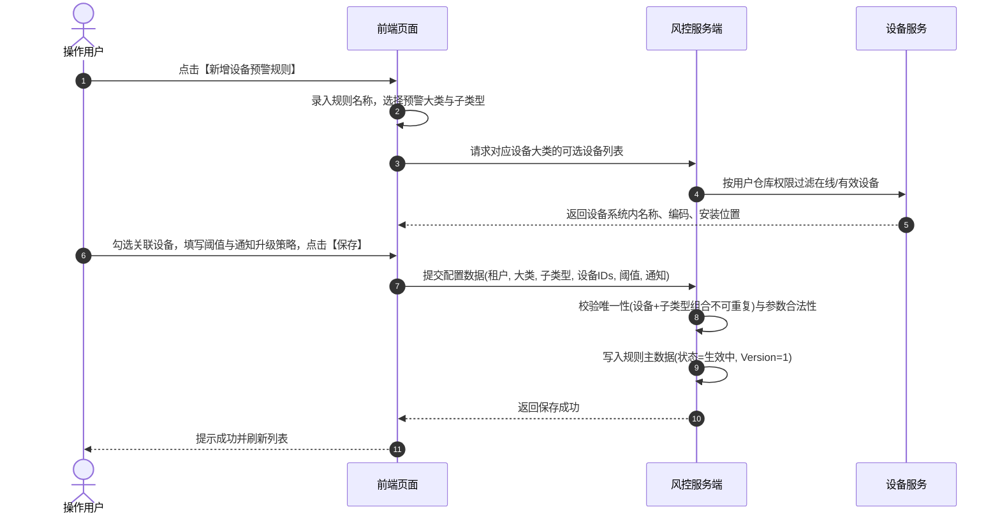

# 设备预警配置主需求文档

> **版本**：V1.8 | 2026-08-19
> **读者**：研发工程师、测试工程师、物联网风控产品经理、架构师
> **编写依据**：[设备预警配置字段清单](./设备预警配置字段清单.md)、[设备预警配置业务规则规格](./设备预警配置业务规则规格.md)、[设备预警配置业务流程](./设备预警配置业务规则规格.md)
> **字段基准**：`设备预警配置字段清单.md` 是本模块所有业务字段与系统字段的唯一定义来源；本主 PRD 负责业务逻辑、操作规范、状态机流转与跨系统联动闭环。

---

## 1. 业务背景

SYZC 存货监管系统依托海量物联网与安防监控硬件，实现对监管仓库、库房、分区及质押标的的 7x24 小时动态监库。
**设备预警配置**面向平台硬件资产（摄像头、温湿度/烟感/气体传感器、智能挂锁、人脸门禁、车载/便携 GPS 等），提供设备维度的预警规则配置能力。设备预警与订单预警采用**双轨运行模型**：设备预警不以订单绑定为前提，只要设备属于当前账号管辖仓库，即可配置离线、温湿度越界、硬件异常破坏等规则，并在异常发生时生成物理维度的设备预警流水。

---

## 2. 功能范围

### 2.1 本期范围
- **设备预警规则列表与筛选**：支持按规则名称（模糊）、设备类型、预警子类型、关联设备名称/编码等多维度检索；
- **设备大类与子类型支持**：涵盖监控图像识别预警、设备物联预警、智能挂锁预警、人脸门禁预警、设备 GPS 预警 5 大类；
- **设备范围选择与批量关联**：支持按设备类型动态选择对应在线/有效设备，支持单条规则关联多台设备；
- **动态阈值配置与离线检测**：支持温湿度/CO2/氧气上下限配置；支持各类设备独立的【设备离线】预警配置；
- **通知与升级机制**：支持站内信、邮件、短信通知渠道以及持续未解除时的升级天数与升级对象配置；
- **规则生命周期**：支持规则的新增、编辑、删除、查看详情及规则生效/失效流转；
- **安全与审计**：基于仓库数据权限控制、乐观锁并发控制与操作全链路审计。

### 2.2 移动端范围
- 移动端仅支持设备预警规则列表与详情的查看；规则的新增、编辑和删除在 Web 端完成。

### 2.3 不在本期范围
- 设备接入、协议解析与设备基础档案（归属 [01设备管理](../../02-仓储/16-设备管理-监控设备/监控设备主PRD.md)）；
- 开锁、关锁、首次上线、主动移除等即时事务通知配置（归属 [03设备事务通知配置](../21-风险管理-设备事务通知配置/设备事务通知配置主PRD.md)）；
- 设备预警流水产生后的核查、现场抓拍与人工解除（归属 [01设备预警信息](../../05-风控/05-风险信息-设备预警信息/设备预警信息主PRD.md)）；
- 硬件心跳检测与网络离线判定算法（由第三方设备接入中台实现）。

---

## 3. 模块定位与上下游关系

### 3.1 系统位置

| 项目 | 内容 |
| :--- | :--- |
| **模块层级** | 风险管理配置层（物理设备资产风控规则引擎入口） |
| **核心职责** | 维护设备维度的异常行为、环境越界、硬件破坏及设备离线预警规则 |
| **上游依赖** | 设备基础档案、仓库/库房/分区架构、三方设备中台、IoT 数据接入网关 |
| **下游引用** | [01设备预警信息](../../05-风控/05-风险信息-设备预警信息/设备预警信息主PRD.md)、通知服务、监控大屏 |
| **业务单据** | 本模块维护规则主数据，不生成业务单据，驱动设备风险流水生成 |

### 3.2 设备大类与预警子类型模型

| 设备预警大类 | 对应硬件资产 | 预警子类型与触发源 | 阈值参数 / 关键约束 |
| :--- | :--- | :--- | :--- |
| **设备图像识别预警** | 视频监控摄像头、人脸门禁摄像头 | 行人入侵、车辆入侵、物品形态变化、**摄像头离线** | 依赖图像锚点算法模板；各算法事件命中即触发 |
| **设备物联预警** | 温湿度、烟感、CO2、氧气传感器 | 温度异常、湿度异常、烟感异常、CO2异常、氧气异常、**物联离线** | 数值型必须配置最低值与最高值（`X < 最低值 OR X > 最高值` 触发） |
| **智能挂锁预警** | 智能挂锁 | 拆壳、卡舌、剪杆、非法开箱、拆卡、密码错误、关锁异常、电量低于20%、**挂锁离线** | 勾选即启用，硬件事件上报即触发 |
| **人脸门禁预警** | 人脸门禁终端 | 门未关、密码错误、**门禁离线** | 勾选即启用，硬件事件上报即触发 |
| **设备 GPS 预警** | 车载/便携 GPS 终端 | 进/出围栏、超速、怠速滞留、路线偏离、非法拆除、**GPS离线** | 围栏坐标与超速参数，硬件事件上报即触发 |

> **专项设计说明**：各预警大类的【设备离线】严格针对其对应的设备资产独立生效，独立配置通知与升级策略，独立生成风险实例。

---

## 4. 页面与字段规则

### 4.1 字段引用基准
- 列表展示、查询条件、动态参数及通知字段严格以 [设备预警配置字段清单](./设备预警配置字段清单.md) 为唯一定义来源。

### 4.2 数据可见范围与权限控制

| 数据对象 | 可见与可选规则 | 服务端安全控制 |
| :--- | :--- | :--- |
| **规则列表** | 规则关联设备中任意一台属于当前登录账号管辖仓库时可见；若规则关联设备均未绑定仓库，对拥有菜单权限者可见 | 服务端基于账号关联仓库列表进行过滤 |
| **可选设备列表** | 仅列出当前账号拥有仓库权限且设备类型匹配的设备；未绑定具体位置设备作为例外允许进入候选 | 接口服务端强校验设备资产类型与仓库归属 |
| **新增 / 编辑 / 删除** | 必须具备设备预警配置对应写权限，且拥有对应仓库数据权限 | 服务端二次强校验租户、仓库权限与规则 Version |

---

## 5. 操作功能详解

### 5.1 操作总览

| 操作名称 | 入口 | 适用状态 | 前置条件 | 是否改变配置主数据 | 联动下游影响 |
| :--- | :--- | :--- | :--- | :---: | :---: |
| **新增规则** | 列表顶部操作栏 | 全部 | 拥有新增权限，有可配置设备 | 是 | 规则生效，开启事件监听 |
| **编辑规则** | 列表操作列 | 生效中 | 拥有编辑权限与仓库权限 | 是 | 更新阈值/设备/通知，旧版本失效 |
| **删除规则** | 列表操作列 | 全部 | 拥有删除权限与仓库权限 | 是 | 规则软删除，未处理预警置为无效 |
| **查看详情** | 列表操作列 / 名称 | 全部 | 拥有查看权限 | 否 | 详情只读展示 |

---

### 5.2 新增设备预警规则

- **唯一性规则**：同一设备 + 同一预警子类型在租户内只允许存在一条有效配置；若一条规则关联多台设备或包含多个子类型，服务端逐一校验唯一性；
- **阈值校验**：数值型指标（温湿度/CO2/氧气）最低值必须小于最高值，温度支持负数，其他指标必须 > 0；
- **并发与防重**：采用 `租户ID + 预警大类 + 设备ID` 组合分布式锁防重。

---

### 5.3 编辑设备预警规则
- **交互规范**：点击【编辑】打开抽屉；
- **字段限制**：规则名称、预警大类、预警子类型置灰禁止变更；关联设备列表、动态阈值参数、通知渠道及升级策略允许编辑；
- **并发控制**：提交时强校验 `Version` 版本号，冲突时拒绝覆盖并提示刷新。

---

### 5.4 删除规则与未处理流水联动
- **删除逻辑**：二次确认后执行软删除，规则状态置为已删除；
- **未处理预警闭环**：该规则下已产生的处于“未处理”状态的设备预警信息，自动变更为 `未处理（无效）`，停止普通提醒和升级通知；历史已处理记录完整保留。

---

## 6. 异常处理与安全保障

1. **高频推送防轰炸机制**：温湿度等物联数据可能每 3~10 秒推送一次；系统采用**未处理分类去重机制**，在存在未处理记录期间仅更新实时快照，不重复创建告警实例、不重复发送短信；
2. **设备离线独立轮次机制**：物联设备离线按离线轮次管理，同一轮次内重复收到离线事件仅更新当前记录；收到三方有效上线事件后结束当前轮次；
3. **数据权限隔离**：严禁无仓库权限的账号通过越权请求获取其他仓库的设备告警与配置信息。

---

## 7. 验收标准与测试用例

| 用例编号 | 测试场景 | 前置条件 | 预期输出与系统行为 |
| :---: | :--- | :--- | :--- |
| **DEV-TC01** | 设备预警多设备关联 | 选择物联温湿度大类，勾选 3 台传感器 | 提交成功后，3 台设备均独立生效温湿度预警规则 |
| **DEV-TC02** | 同一设备重复配置相同子类型 | 设备 A 已配置“温度异常” | 新增规则再次勾选设备 A 的“温度异常”提交，系统阻断并提示重复 |
| **DEV-TC03** | 跨仓库权限越权拦截 | 用户无 2 号仓库权限 | 选择设备候选列表中不出现 2 号仓设备，若伪造 ID 提交服务端拦截 |
| **DEV-TC04** | 物联温湿度高频越界推送 | 设备 A 持续 1 分钟每 5 秒上报超温数据 | 仅生成 1 条有效未处理记录，短信仅首次发送，不产生短信轰炸 |
| **DEV-TC05** | 规则删除后流水状态更新 | 规则关联 1 条未处理设备预警 | 删除规则成功后，该未处理预警自动转为“未处理（无效）”，升级终止 |

---

## 8. 引用文档与修订记录

### 8.1 关联文档
- [设备预警配置字段清单](./设备预警配置字段清单.md)
- [设备预警配置业务规则规格](./设备预警配置业务规则规格.md)
- [设备预警配置业务流程](./设备预警配置业务规则规格.md)
- [设备预警配置字段清单](./设备预警配置字段清单.md)

### 8.2 修订记录

| 日期 | 版本 | 修订人 | 修订内容 |
| :--- | :---: | :---: | :--- |
| 2026-08-19 | V1.8 | 产品团队 | 深度对齐 6.1 主 PRD 标准，细化 5 大设备大类、离线独立轮次、防轰炸去重、并发版本控制与测试矩阵。 |
| 2026-08-18 | V1.0 | 产品团队 | 初版发布。 |
