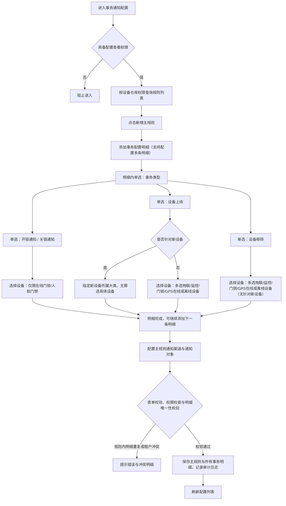
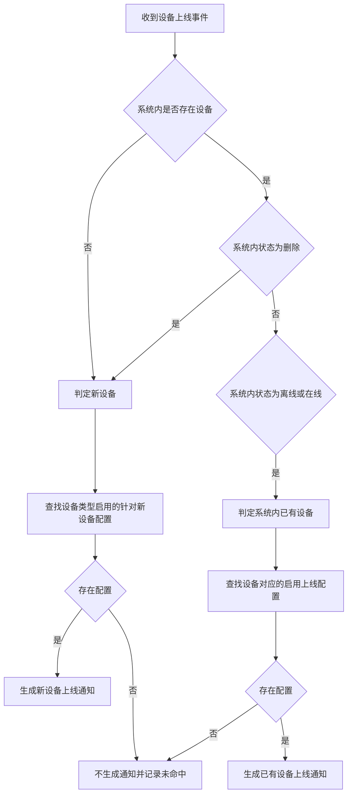
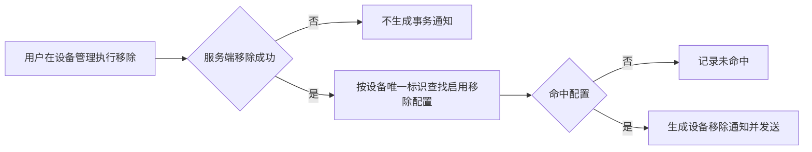
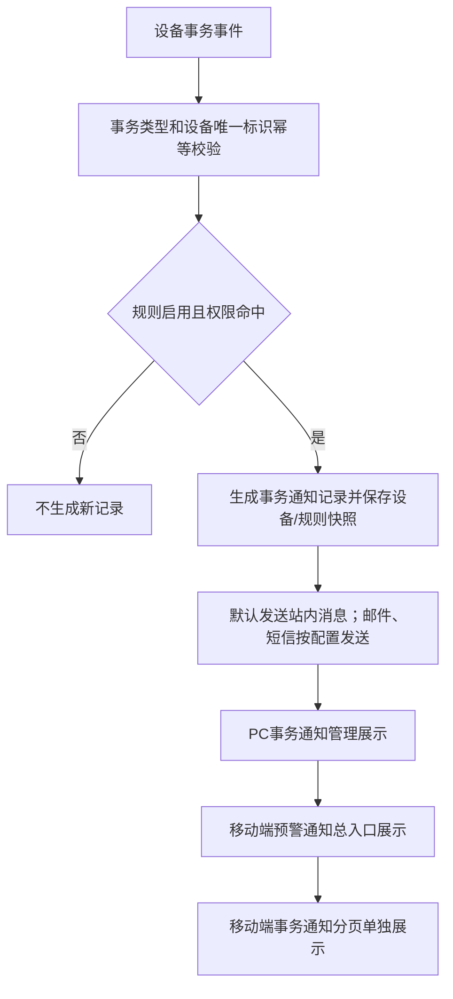
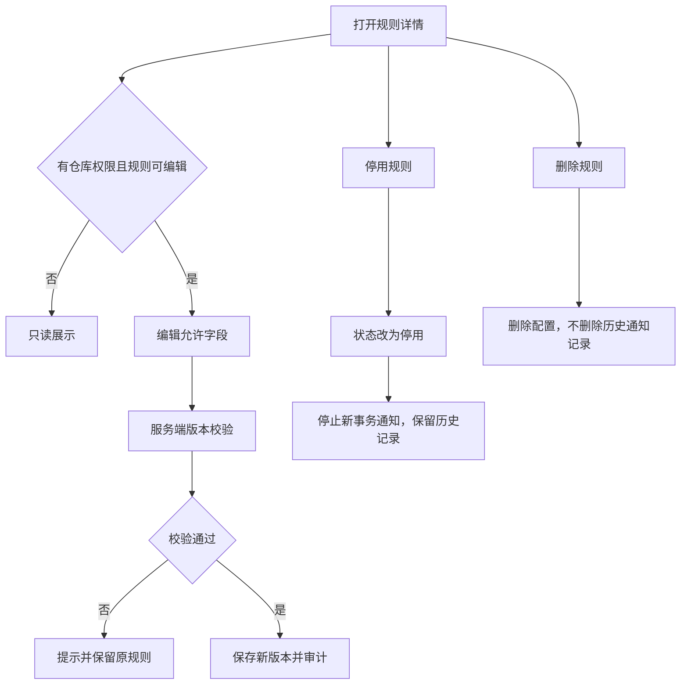
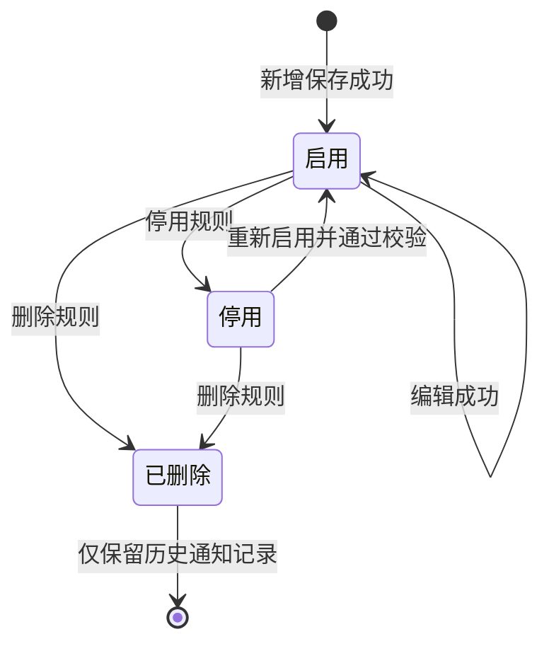

# 设备事务通知配置业务规则规格

> **文档定位**：设备事务通知配置的权限、事务类型、设备范围、通知记录、编辑删除和审计规则的唯一定义来源。字段口径引用[设备事务通知配置字段清单](./设备事务通知配置字段清单.md)，设备主数据及设备事件来源引用设备管理模块。
>
> **当前版本**：V1.1 | 2026-08-18
>
> **版本取舍**：以 2025-09-17/2025-09-18 设备上线、移除通知补充和当前字段清单为当前规则；更早仅支持开锁/关锁的描述保留为历史范围说明。

## 一、能力边界与术语

| 项目 | 当前规则 |
| :--- | :--- |
| 配置对象 | 平台设备事务通知规则，独立于设备预警规则 |
| 事务类型 | 开锁通知、关锁通知、设备上线、设备移除；枚举可扩展，编码必须稳定 |
| 通知记录 | 设备实际发生事务后按规则生成的消息记录，展示在事务通知管理；移动端同时归入预警通知并在事务通知分页单独展示 |
| 规则状态 | 启用、停用；停用规则不产生新通知。**设计意图**：事务通知规则状态属于人工控制的事件推送开关，支持操作人手动随时启用或停用；区别于订单/设备预警跟随业务对象生命周期自动“生效中/已失效”的被动流转模型 |
| 设备类型分页 | 配置页按规则绑定设备的仓库权限判断配置是否可见；事务通知信息页按事务设备的位置和仓库权限判断记录是否可见 |
| 订单类型分页 | 当前版本不实施；保留未来按订单可见范围扩展的接口边界 |

事务通知与设备预警分工：开锁、关锁、上线、移除是事务事件；图像识别、温湿度、门锁异常行为、GPS等是风险预警。相同设备事件如果同时命中两类规则，分别生成各自记录，不互相覆盖。

## 二、权限规则

| 规则ID | 规则 |
| :--- | :--- |
| EVT-P01 | 用户须具备事务通知配置或事务通知管理菜单权限，才可进入对应页面；新增、编辑、删除、详情和处理权限单独校验。 |
| EVT-P02 | 设备类型分页中，若当前账号仓库权限与一条规则绑定设备中的任意设备仓库相匹配，则展示该规则；规则绑定设备均未绑定仓库时，对所有具备模块查看权限的人员展示。 |
| EVT-P03 | 事务通知信息页面按事务触发设备的仓库、库房或分区位置过滤记录；事务设备未绑定具体位置时，对所有已登录且具备事务通知信息菜单查看权限的账号可见，但不得突破租户和菜单权限；删除设备后，已产生的事务通知记录不因设备删除而删除。 |
| EVT-P04 | 事务通知配置保存、编辑、删除及设备筛选接口均在服务端重新校验账号仓库权限，不能以客户端传入设备列表作为权限依据。 |
| EVT-P05 | 订单类型分页暂不开放；未来扩展时按当前账号是否可见同类型订单判断，订单类型应采用可扩展枚举，不将抵质押/监管写死为唯一类型。 |

## 三、事务类型与配置规则

### 3.1 类型和唯一性

| 规则ID | 规则 |
| :--- | :--- |
| EVT-F01 | 事务类型为必填单选枚举，当前枚举：1开锁通知、2关锁通知、3设备上线、4设备移除；主规则下支持“+ 添加事务明细”配置多条，每条明细内单选一个事务类型。 |
| EVT-F02 | 数据模型为“一条主规则 + 多条事务类型明细”。同一主规则内各明细之间不得重复配置相同的事务类型与设备组合；租户内唯一性按“租户 + 事务类型 + 设备/设备类型 + 是否新设备”校验，同一有效组合只允许一条启用配置；服务端按事务类型明细分别校验和生效。 |
| EVT-F03 | 规则名称仅新增页填写，编辑页只读；当前字段清单的必填性和长度以最终产品参数为准。 |
| EVT-F04 | 状态为启用/停用；新增保存后默认为启用。具有操作权限的用户可手动停用，停用只停止新事务通知，不删除历史通知记录；停用规则可编辑并可重新启用。 |
| EVT-F05 | 规则保存使用租户 + 事务类型 + 规则版本幂等校验和服务端并发锁，重复提交不得生成重复通知规则。 |

### 3.2 开锁/关锁通知

| 规则ID | 规则 |
| :--- | :--- |
| EVT-F11 | 开锁/关锁仅允许选择在线的智能挂锁或人脸门禁设备；离线设备不可选。 |
| EVT-F12 | 开锁、关锁事件由设备事务接口或门禁事件记录提供；事件成功接收且规则启用时生成事务通知记录。 |
| EVT-F13 | 开锁/关锁配置的通知渠道、发件人、抄送对象和通知对象按字段清单执行；通知账号发送时必须为启用状态。 |

### 3.3 设备上线通知

| 规则ID | 规则 |
| :--- | :--- |
| EVT-F21 | 选择设备类型后，可选择该类型下系统内状态为在线或离线的设备；删除状态设备不作为普通设备选项。 |
| EVT-F22 | “仅针对新设备”启用后隐藏具体设备选择，表示该设备类型下新设备首次同步且上线时触发；同一设备类型只能有一条启用的仅新设备配置。 |
| EVT-F23 | 新设备定义为系统内状态为删除或系统内不存在的设备；首次同步到系统且状态为上线时，匹配该设备类型启用的仅新设备配置发送通知。 |
| EVT-F24 | 系统内已有设备定义为系统内状态为在线或离线的设备；已有设备由离线变为在线时，按该设备对应的上线通知配置发送通知。 |
| EVT-F25 | 删除设备重新上线按新设备处理；设备首次接入、权限撤销后重新接入、设备重命名不改变事件类型，但设备身份是否复用必须由设备管理模块提供稳定唯一标识。 |
| EVT-F26 | 设备上线通知模板至少区分“新设备上线”和“系统内已有设备上线”；通知内容的具体字段、设备快照和消息变量待通知模板确认。 |

### 3.4 设备移除通知

| 规则ID | 规则 |
| :--- | :--- |
| EVT-F31 | 选择设备类型后，可多选该类型下系统内当前在线或离线的设备；设备移除通知不支持“针对新设备”配置，必须指定具体监控设备。设备移除成功后根据设备唯一标识查询启用的移除通知配置。 |
| EVT-F32 | 仅当平台/仓库设备管理模块中用户主动触发“移除设备”操作且服务端返回“移除成功”抛出对应领域事件时，才触发设备移除通知；平台权限撤销、逻辑删除、网络离线、设备注销或移除失败均不触发移除通知。 |
| EVT-F33 | 删除设备不删除已经生成的事务通知记录；通知记录保留触发时的设备名称、绑定位置、设备编码和规则快照。 |

### 3.5 即时通知机制说明

| 规则ID | 规则 |
| :--- | :--- |
| EVT-F41 | 设备事务通知（开锁、关锁、上线、移除）属于瞬态动作事件，触发后默认向通知对象发送站内消息，邮件、短信为可选渠道；事务通知不属于持续性风险预警，系统不设置超时升级通知机制。通知渠道非必填。 |
| EVT-F42 | 仅修改通知渠道、发件人/抄送对象或通知对象时，仅更新规则，后续新事务发生时按新配置推送，不回溯重发历史事务通知。 |
| EVT-F43 | 发送通知前校验通知对象账号为启用状态；停用账号不发送并记录跳过原因。 |

## 四、配置详情与列表规则

| 规则ID | 规则 |
| :--- | :--- |
| EVT-D01 | 配置详情直接反显已保存配置内容；多值使用顿号分隔。 |
| EVT-D02 | 涉及账号的字段使用“机构-账号”格式展示，并展示账号状态；创建人、更新人列表字段只展示账号全称，不展示机构全称。 |
| EVT-D03 | 涉及设备的字段使用“设备名称（位置信息）”格式；当前列表摘要优先展示设备名称和绑定仓库名称，未绑定位置时仅展示设备名称。 |
| EVT-D04 | 多设备默认展示一个，其余收起；光标移入展示全部设备。“仅针对新设备”与具体设备互斥；勾选“仅针对新设备”后隐藏且不可选择具体设备，详情展示“仅针对新设备”。 |
| EVT-D05 | 列表事务类型和筛选项均包含开锁通知、关锁通知、设备上线、设备移除；事务类型支持多选精确筛选。 |
| EVT-D06 | 列表增加设备名称查询条件，输入设备系统内名称进行模糊匹配；服务端查询设备唯一标识和名称，不依赖格式化展示字符串。 |
| EVT-D07 | 配置详情不展示添加、编辑、删除等操作按钮；列表操作按钮按当前用户权限和规则状态单独展示。 |
| EVT-D08 | 订单预警和设备预警配置详情采用同类只读反显原则，但字段内容必须引用各自字段清单，不直接复制事务通知字段。 |

## 五、通知记录与消息发送

| 规则ID | 规则 |
| :--- | :--- |
| EVT-N01 | 事务发生后按启用配置生成通知记录并默认发送站内消息；邮件、短信按配置发送。停用配置不产生新记录，已有记录不被删除。 |
| EVT-N02 | 同一事务事件必须使用设备唯一标识 + 事务事件 ID + 事务类型幂等，重复上报不能重复生成记录或重复发送同一条即时通知。 |
| EVT-N03 | 通知记录与预警实例是不同业务对象；设备上线/移除等事务记录不直接改变设备预警风险实例状态，设备预警按自身规则处理。 |
| EVT-N04 | 短信、邮件发送前校验接收账号启用状态、租户和数据权限；停用账号跳过发送并记录原因。 |
| EVT-N05 | 发送失败保留失败原因、请求标识和重试关联键；重试不得生成新的事务记录。 |
| EVT-N06 | 移动端将事务通知记录纳入预警通知总入口，同时在事务通知分页单独展示；同一记录使用同一唯一标识，避免两处重复生成。 |

## 六、编辑、停用、删除与设备变化

| 场景 | 当前处理 |
| :--- | :--- |
| 修改通知对象 | 更新规则，后续新事务按新对象发送；不回溯重发历史事务通知。 |
| 修改通知渠道/模板参数 | 对后续新事务生效；已生成记录保留触发时的渠道和内容快照。 |
| 修改关联设备 | 服务端校验新增设备权限和事务类型唯一性；移除设备关联不删除已生成记录。 |
| 停用规则 | 规则状态改为停用，停止产生新通知；历史记录保留。 |
| 删除规则 | 删除配置不删除历史通知记录；删除后的设备事务不再匹配该规则。 |
| 设备被平台逻辑删除/权限撤销 | 事务通知记录保留；是否触发移除通知取决于事件源是否产生“设备移除成功”事件，不因权限撤销自动推断。 |
| 设备重新上线 | 按新设备或系统内已有设备定义匹配对应上线规则；不得因为历史通知记录存在而重复生成同一事件。 |

## 七、状态、并发与审计

- 配置状态为启用/停用；停用不是删除，不能清理历史事务记录。
- 规则保存、类型唯一性校验、设备关联、通知生成和发送结果更新必须使用服务端版本校验、锁或等效机制。
- 审计记录操作人、角色、时间、IP、请求标识、规则版本、设备快照、前后值、通知结果和失败原因；账号、手机号、邮箱等敏感字段脱敏。

## 八、历史兼容说明与待确认边界

- 2025-07-21 早期规格只明确开锁/关锁；2025-09-17 后续补充已将设备上线、设备移除纳入当前事务类型。
- 当前唯一性按“租户 + 事务类型 + 设备/设备类型 + 是否新设备”处理；设备集合变更时按实际设备或设备类型范围重新校验。
- “设备移除”需区分设备管理人工移除、平台权限撤销、逻辑删除、注销和三方离线，只有正式移除事件才触发移除通知。
- 列表已支持事务通知规则名称、事务类型、事务规则状态和设备名称筛选；字段口径以字段清单为准。
- 事务通知管理页面负责通知记录、发送结果和模板展示；本配置页面仅维护通知规则及其启用/停用状态。

---

## 业务流程与联动

> 以下内容由原《设备事务通知配置业务流程》合并，与上文规则 ID 配合阅读；重复的状态机定义以上文为准。

> **文档定位**：设备事务通知配置、设备事务通知管理的权限、规则配置、事务触发、消息展示、编辑停用和异常分支流程。字段定义引用[设备事务通知配置字段清单](./设备事务通知配置字段清单.md)，规则定义引用[设备事务通知配置业务规则规格](./设备事务通知配置业务规则规格.md)。
>
> **版本**：V1.1 | 2026-08-18

## 一、业务范围

事务通知配置用于配置设备开锁、关锁、上线、移除等事务消息，数据模型为“一条主规则 + 多条事务类型明细”。事务通知管理用于展示已生成的事务通知记录；移动端将其纳入预警通知总入口，并在事务通知分页单独展示。

事务通知不是设备风险预警：设备离线、温湿度越界、图像识别异常等风险由设备预警配置处理；开锁、关锁、上线、移除由本模块处理。事务通知规则状态为“启用/停用”，是由操作人或管理员手动控制的即时推送开关；区别于订单/设备预警跟随业务对象生命周期自动“生效中/已失效”的被动流转模型。

## 二、配置主流程

## 三、权限与规则展示流程

1. 配置页和管理页按设备类型分页加载规则。
2. 配置页中，规则绑定设备任意一个设备的绑定仓库命中当前账号仓库权限，即展示整条规则。
3. 规则绑定设备全部未绑定仓库时，对所有具备对应模块查看权限的用户展示。
4. 事务通知管理页按事务触发设备的仓库、库房或分区位置过滤；事务设备未绑定具体位置时，对所有已登录且具备事务通知信息菜单查看权限的用户展示。
5. 删除设备不删除已生成的事务通知记录；管理页仍可按通知记录快照展示。
6. 订单类型分页当前不实施；未来增加订单事务通知时，按账号订单数据权限判断可见范围。

## 四、四类平级事务类型配置流程

### 4.1 开锁通知 / 关锁通知

- **平级事务类型**：开锁通知、关锁通知均为独立的瞬时动作通知。
- **设备联动**：仅允许选择当前状态为“在线”的智能挂锁或人脸门禁设备（离线设备不可选）。
- **触发与去重**：设备上报开锁/关锁成功事件后，按命中规则即时生成通知并发送；瞬态动作不设超时升级机制。

### 4.2 设备上线

- **平级事务类型**：独立处理设备接入上线或离线重连事务。
- **配置分支**：
  - **启用【针对新设备】**：指定设备大类（物联/监控/门锁/GPS），无需选择具体设备列表；新入库同类设备上线时自动匹配；
  - **未启用【针对新设备】**：在【选择设备】中从现有设备（物联/监控/门锁/GPS，支持在线/离线）中多选目标设备。

### 4.3 设备移除

- **平级事务类型**：独立处理平台/仓库设备管理中主动发起的设备移除事务。
- **设备联动**：在【选择设备】中多选目标设备（物联/监控/门锁/GPS，支持在线/离线），**不支持【针对新设备】选项**。
- **触发限定**：仅当服务端“移除成功”抛出领域事件时触发；网络离线、逻辑删除或权限撤销不触发移除通知。

## 五、通知记录与展示流程

- 同一事件重复上报不重复生成记录或重复发送。
- 通知记录与设备预警风险实例分开存储和处理；事务通知为即时事件通知，不设风险解除与升级通知机制。
- 记录保留触发时设备名称、设备编码、仓库/位置、事务类型、触发时间、规则版本和发送结果快照。
- 发送前校验账号启用状态；停用账号跳过并记录原因。

## 六、编辑、停用和删除流程

编辑成功后按变更内容处理：

1. 仅修改通知渠道、发件人/抄送对象或通知对象：系统更新规则，后续新事务发生时按新配置推送，不回溯重发历史事务通知。
2. 修改关联设备或新设备配置：仅影响后续新发生的设备事务；新增设备关联必须重新校验仓库权限和事务类型唯一性。
3. 停用规则：规则状态置为停用，后续发生的设备事务不再触发通知；历史已生成的事务通知记录完整保留。

## 七、列表与详情展示流程

- 列表字段：序号、事务通知规则名称、事务类型、设备信息摘要、状态、创建人、创建时间、更新人、更新时间。
- 事务通知规则名称支持模糊匹配；事务类型和事务规则状态支持多选精确匹配，事务类型包括开锁通知、关锁通知、设备上线、设备移除，状态包括启用、停用。
- 设备名称筛选使用系统内名称模糊匹配，不使用格式化后的设备摘要作为接口查询字段。
- 设备信息默认展示一个，其余收起；悬停展示全部；未绑定位置时只展示设备名。
- 配置详情直接反显保存内容，多值用顿号，账号用“机构-账号”并展示状态，设备用“设备名称（位置信息）”。详情不展示添加、编辑、删除等操作按钮。

## 八、异常与状态

| 场景 | 处理 |
| :--- | :--- |
| 无匹配仓库权限 | 配置页规则不展示，接口阻止访问 |
| 配置规则绑定设备全部未绑定仓库 | 对具备事务通知配置模块查看权限的用户展示 |
| 事务设备未绑定具体位置 | 事务通知信息对具备事务通知信息模块查看权限的已登录用户展示 |
| 同一“租户 + 事务类型 + 设备/设备类型 + 是否新设备”已有启用配置 | 保存阻断，提示重复配置 |
| 设备事件重复上报 | 幂等处理，不重复生成记录 |
| 设备移除失败 | 不生成移除通知 |
| 发送失败 | 记录失败，不回滚事务记录；按重试策略处理 |
| 设备删除 | 历史事务通知记录保留，使用设备快照展示 |

## 修订记录

| 日期 | 版本 | 变更 |
| :--- | :---: | :--- |
| 2026-08-20 | — | 合并原《设备事务通知配置业务流程》至本文件「业务流程与联动」章节 |
