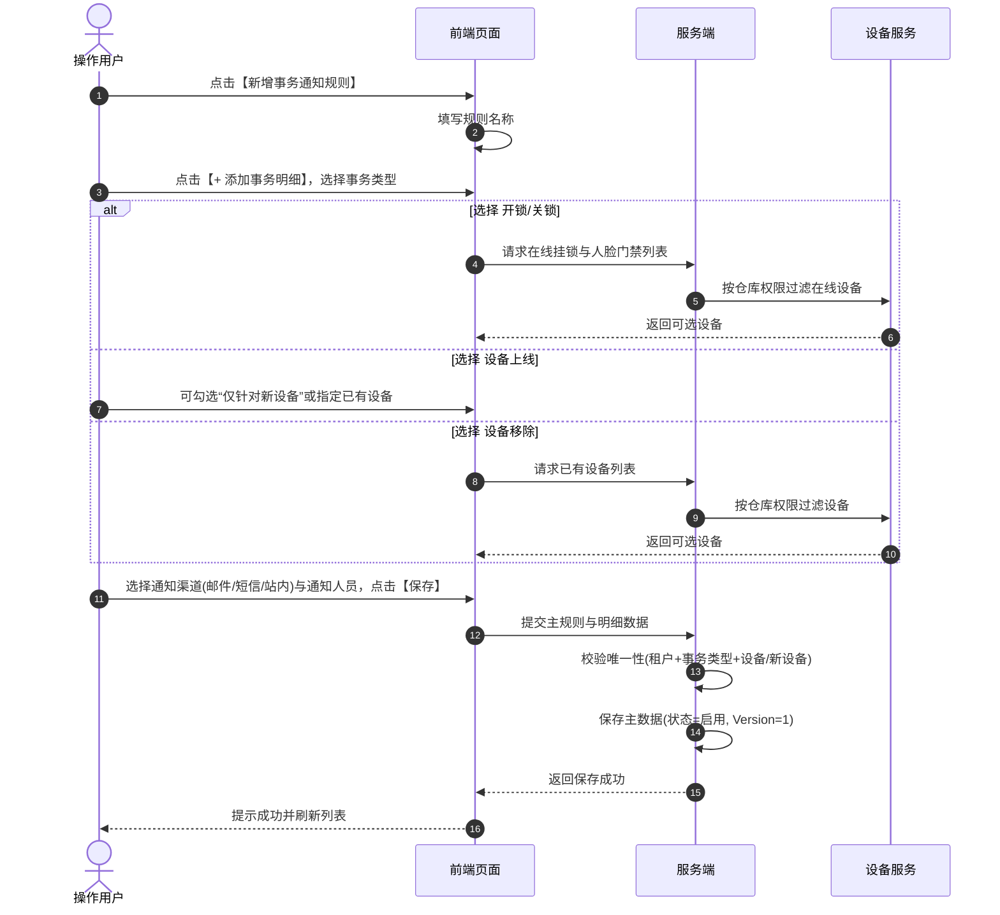

# 设备事务通知配置主需求文档

> **版本**：V1.8 | 2026-08-19
> **读者**：研发工程师、测试工程师、物联网产品经理、架构师
> **编写依据**：[设备事务通知配置字段清单](./设备事务通知配置字段清单.md)、[设备事务通知配置业务规则规格](./设备事务通知配置业务规则规格.md)、[设备事务通知配置业务流程](./设备事务通知配置业务规则规格.md)
> **字段基准**：`设备事务通知配置字段清单.md` 是本模块所有业务字段与系统字段的唯一定义来源；本主 PRD 负责业务逻辑、操作规范、状态机流转与跨系统联动闭环。

---

## 1. 业务背景

在仓储监管日常运营中，智能门锁开关、门禁通行、设备接入上线与设备主动移除属于**即时发生的常规操作事务**，而非持续性的安全风险预警。
为了让监管方与仓储管理人员第一时间掌握仓内出入与设备运维动向，系统设立**设备事务通知配置**。区别于风险预警的“生效中/已失效”被动生命周期，事务通知规则采用**人工随时“启用/停用”的主动开关模型**，触发后即时发送通知并沉淀事务台账，不设置超时升级与风险公示流程。

---

## 2. 功能范围

### 2.1 本期范围
- **事务通知规则列表与检索**：支持按规则名称（模糊）、事务类型（多选）、设备名称（模糊）、状态（启用/停用）组合筛选；
- **4 类事务类型支持**：涵盖**开锁通知、关锁通知、设备上线、设备移除**；
- **主规则与多明细模型**：支持“一条主规则 + 多条事务明细”组合配置；
- **新设备与已有设备分流配置**：支持“仅针对新设备”全局监听（新设备首次同步上线）与针对具体设备的上线通知配置；
- **通知渠道与对象配置**：支持站内信（默认）、邮件（发件人、抄送人）、短信通知对象配置；
- **生命周期管理**：支持规则新增、编辑、删除、查看详情及手动启用/停用操作；
- **安全与审计**：基于仓库权限隔离、并发锁与全路径操作审计。

### 2.2 移动端范围
- 移动端仅支持事务通知列表与详情查看，配置的新增/编辑/删除在 Web 端完成。

### 2.3 不在本期范围
- 门禁密码获取、临时密码下发与远程开锁（归属 [01设备管理/02门禁设备](../../02-仓储/17-设备管理-门禁设备/门禁设备字段清单.md)）；
- 硬件破坏告警与违规滞留预警（归属 [02设备预警配置](../20-风险管理-设备预警配置/设备预警配置主PRD.md)）；
- 事务记录产生后的人工核查与现场抓拍留痕（归属 [03设备事务通知信息](../../05-风控/07-风险信息-设备事务通知信息/设备事务通知信息主PRD.md)）。

---

## 3. 模块定位与上下游关系

### 3.1 系统位置

| 项目 | 内容 |
| :--- | :--- |
| **模块层级** | 风险管理配置层（仓储日常操作与运维即时通知中枢） |
| **核心职责** | 维护设备常规操作与运维事件的即时推送规则及接收人员 |
| **上游依赖** | 智能挂锁/人脸门禁接入、设备管理主动移除领域事件、三方设备同步服务 |
| **下游引用** | [03设备事务通知信息](../../05-风控/07-风险信息-设备事务通知信息/设备事务通知信息主PRD.md)、消息推送中心 |
| **业务单据** | 本模块维护规则配置，不产生审批单，驱动瞬时事务消息生成 |

### 3.2 事务类型模型与触发规则

| 事务类型 | 适用设备资产 | 触发源与机制 | 关键约束与设计说明 |
| :--- | :--- | :--- | :--- |
| **开锁通知** | 在线的智能挂锁、人脸门禁 | 门禁/门锁实际上报开锁事件时触发 | 离线设备不可选；事件成功接收即时推送 |
| **关锁通知** | 在线的智能挂锁、人脸门禁 | 门禁/门锁实际上报关锁事件时触发 | 离线设备不可选；事件成功接收即时推送 |
| **设备上线** | 平台支持的全部硬件资产类型 | ① 新设备首次同步上线 ② 已有设备由离线变为在线 | 支持“仅针对新设备”全局开关（每种设备类型仅限 1 条启用） |
| **设备移除** | 监控摄像头、传感器、门禁、GPS | 用户在设备管理模块主动点击【移除设备】且服务端返回“移除成功” | 不支持新设备选项，必须指定具体设备；权限撤销或网络离线不触发 |

---

## 4. 页面与字段规则

### 4.1 字段引用基准
- 字段名称、类型、必填性及校验规则严格以 [设备事务通知配置字段清单](./设备事务通知配置字段清单.md) 为准。

### 4.2 数据可见范围与权限控制

| 场景 | 可见与可选规则 | 服务端安全控制 |
| :--- | :--- | :--- |
| **规则列表** | 规则关联设备中任意一台属于当前登录账号管辖仓库时可见；规则关联设备均未绑定仓库时对有权限者可见 | 服务端基于账号关联仓库列表进行过滤 |
| **事务明细与设备选择** | 开锁/关锁仅返回在线门锁/门禁；设备移除仅返回已有设备；新设备勾选后隐藏设备选择列表 | 接口服务端强制校验设备当前状态与仓库归属 |
| **写操作与启停** | 必须具备事务通知配置对应操作权限及对应仓库数据权限 | 服务端二次校验租户、仓库权限与规则 Version |

---

## 5. 操作功能详解

### 5.1 操作总览

| 操作名称 | 入口 | 适用状态 | 前置条件 | 是否改变配置主数据 | 联动下游影响 |
| :--- | :--- | :--- | :--- | :---: | :---: |
| **新增规则** | 列表顶部操作栏 | 全部 | 拥有新增权限 | 是 | 规则生效，开启即时推送 |
| **编辑规则** | 列表操作列 | 启用、停用 | 拥有编辑权限 | 是 | 更新通知对象与设备关联 |
| **删除规则** | 列表操作列 | 全部 | 拥有删除权限 | 是 | 软删除，停止推送（历史事务保留） |
| **启用 / 停用** | 列表状态开关 | 全部 | 拥有操作权限 | 是 | 停用后停止新通知，历史记录保留 |
| **查看详情** | 列表操作列 / 名称 | 全部 | 拥有查看权限 | 否 | 详情只读反显 |

---

### 5.2 新增事务通知规则

- **主明细唯一性**：同一主规则内各明细之间不得重复配置相同事务类型与设备组合；
- **新设备唯一性**：同一设备类型下，“仅针对新设备”的启用配置在租户内只允许存在 1 条；
- **即时通知特性**：事务通知属于瞬态动作，触发后默认发送站内信，不设超时升级。

---

### 5.3 启用 / 停用操作
- 用户可随时点击操作列或状态开关切换规则的 `启用 / 停用` 状态；
- **停用影响**：停用后系统不再监听并推送该规则涉及的事务事件，但历史已产生的事务通知记录完全保留；停用规则可随时重新编辑并启用。

---

## 6. 异常处理与安全保障

1. **重复事件消费幂等**：事务接入层采用 `租户ID + 设备ID + 事务类型 + 来源事件ID` 建立强幂等键，重复上报的开锁/关锁事件不重复生成通知明细；
2. **设备移除事件防误触**：严格要求设备管理服务成功抛出“移除成功”领域事件才触发通知，网络离线或移除失败均不触发；
3. **停用账号自动跳过**：发送短信/邮件前校验接收人账号状态，停用账号记录跳过审计。

---

## 7. 验收标准与测试用例

| 用例编号 | 测试场景 | 前置条件 | 预期输出与系统行为 |
| :---: | :--- | :--- | :--- |
| **EVT-TC01** | 开锁通知离线设备过滤 | 设备 A 处于离线状态 | 新增开锁通知规则时，设备 A 不出现在可选列表中 |
| **EVT-TC02** | 新设备上线配置唯一性 | 视频监控类型已存在一条“仅针对新设备”启用配置 | 再次新增视频监控“仅针对新设备”配置时，系统拦截并提示已存在 |
| **EVT-TC03** | 规则手动停用测试 | 某挂锁开锁规则状态变更为“停用” | 现场进行合法开锁操作，系统不发送短信与站内信，不生成新事务通知 |
| **EVT-TC04** | 主动移除设备触发通知 | 规则配置了摄像头 B 的移除通知 | 在设备管理对摄像头 B 成功执行“移除设备”，系统即时生成移除通知并推送 |
| **EVT-TC05** | 规则删除与历史记录保留 | 规则关联 10 条已产生的事务通知 | 删除该规则后，06 事务通知信息列表中的 10 条历史记录完好保留且可查 |

---

## 8. 引用文档与修订记录

### 8.1 关联文档
- [设备事务通知配置字段清单](./设备事务通知配置字段清单.md)
- [设备事务通知配置业务规则规格](./设备事务通知配置业务规则规格.md)
- [设备事务通知配置业务流程](./设备事务通知配置业务规则规格.md)
- [设备事务通知配置字段清单](./设备事务通知配置字段清单.md)

### 8.2 修订记录

| 日期 | 版本 | 修订人 | 修订内容 |
| :--- | :---: | :---: | :--- |
| 2026-08-19 | V1.8 | 产品团队 | 深度对齐 6.1 主 PRD 标准，细化 4 类事务模型、新设备上线规则、主动启停状态机与测试矩阵。 |
| 2026-08-18 | V1.0 | 产品团队 | 初版发布。 |
