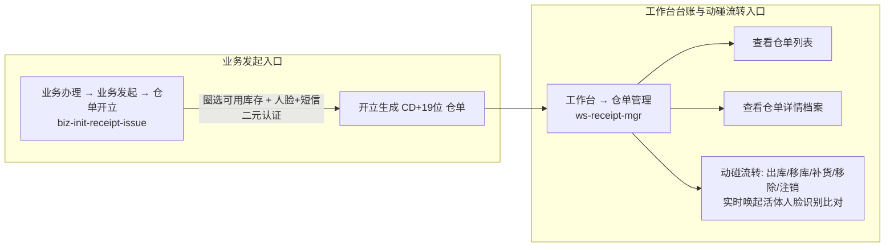

# 仓单管理（移动端工作台）

> **所属板块**：移动端工作台 · 仓储业务  
> **moduleId**：`ws-receipt-mgr`  
> **菜单路径**：**工作台 → 仓单管理**（完整路径：工作台 → 仓储 → 仓单管理）  
> **原型路由**：`/m/module/ws-receipt-mgr`  
> **业务发起入口对照**：**业务办理 → 业务发起 → 仓单开立**（`biz-init-receipt-issue`）  
> **PC 端基准对齐**：[05-仓单管理](../../../../B端PC/02-仓储/05-仓单管理/) · [仓单管理主PRD](../../../../B端PC/02-仓储/05-仓单管理/仓单管理主PRD.md) · [操作字段清单索引](../../../../B端PC/02-仓储/05-仓单管理/操作字段清单/操作字段清单索引.md)  
> **功能清单唯一定义来源**：`03-前端原型demo/B端H5/src/data/mobileMenuData.ts`  
> **导航索引**：[00-菜单地图.md](../../../00-菜单地图.md) · [01-功能清单与原型路由.md](../../../01-功能清单与原型路由.md)

---

## 一、移动端双入口协同关系

在 SYZC 移动端体系中，仓单业务严格按「业务发起」与「台账管理」划分为两大标准入口：

| 业务环节 | 移动端入口路径 | 功能与职责说明 | PC 端协同入口 |
| :--- | :--- | :--- | :--- |
| **仓单开立** | **`业务办理 → 业务发起 → 仓单开立`** | 现场仓管/货主圈选可用库存，完成人脸活体+短信二元强认证，在线签署防伪协议生成仓单 | PC 顶栏右上角【仓单开立】弹出二维码，扫码直达移动端此入口 |
| **查看仓单列表** | **`工作台 → 仓单管理`** | 集中展示名下仓单列表卡片、筛选状态、查看四行基础信息与双层货物明细 | PC 菜单【仓储 → 仓单管理】（`P-CKG-005`）列表页 |
| **动碰流转操作** | **`工作台 → 仓单管理`** | 触发仓单出库、移库、补货、移除、注销等敏感资产变更业务，强制唤起当事人活体人脸核验 | PC 列表点击操作按钮弹出移动端直达二维码，引导在手机端完成办理 |

---

## 二、功能说明与移动端界面能力

1. **仓单卡片列表页**：
   - 展示仓单编码（`CD...`）、存货人/持有人全称及脱敏标识、货物大类与规格摘要、开立时间及当前状态；
   - 四大状态标识：`正常`（绿）、`审批中`（土黄）、`冻结`（灰）、`注销`（深灰）；
   - 支持按状态、仓单编号、货主模糊检索与下拉筛选；
2. **仓单全息详情页**：
   - 基础信息卡片（仓单编号一键复制、存货人、持有人、仓库名称、开立时间、三方登记认证、制单人与注销时间）；
   - 货物明细卡片（双层嵌套结构：大类规格汇总折叠卡片 + 展开微观垛位批次明细，支持点击存货条码弹窗展示现场核验二维码）；
   - 变更记录时间轴（开立、补货、出库、移库、移除、注销历史流水及关联合同 PDF 下载）；
3. **移动端动碰流转入口**：
   - 在【正常】状态下，详情底部或列表卡片快捷菜单提供【仓单出库】、【仓单移库】、【仓单补货】、【仓单移除】、【仓单注销】、【下载】；
   - 受到 `R-DWR-04` 单流程互斥锁保护；点击后进入专属分步表单，并强制在当事人手机上唤起摄像头进行人脸活体比对。

---

## 三、相关引用与规范

- **主 PRD 需求规格**：[仓单管理主PRD.md](../../../../B端PC/02-仓储/05-仓单管理/仓单管理主PRD.md)
- **字段定义规范**：[仓单管理字段清单.md](../../../../B端PC/02-仓储/05-仓单管理/仓单管理字段清单.md)
- **操作子清单索引**：[操作字段清单索引.md](../../../../B端PC/02-仓储/05-仓单管理/操作字段清单/操作字段清单索引.md)
- **业务规则规格**：[仓单管理业务规则规格.md](../../../../B端PC/02-仓储/05-仓单管理/仓单管理业务规则规格.md)

