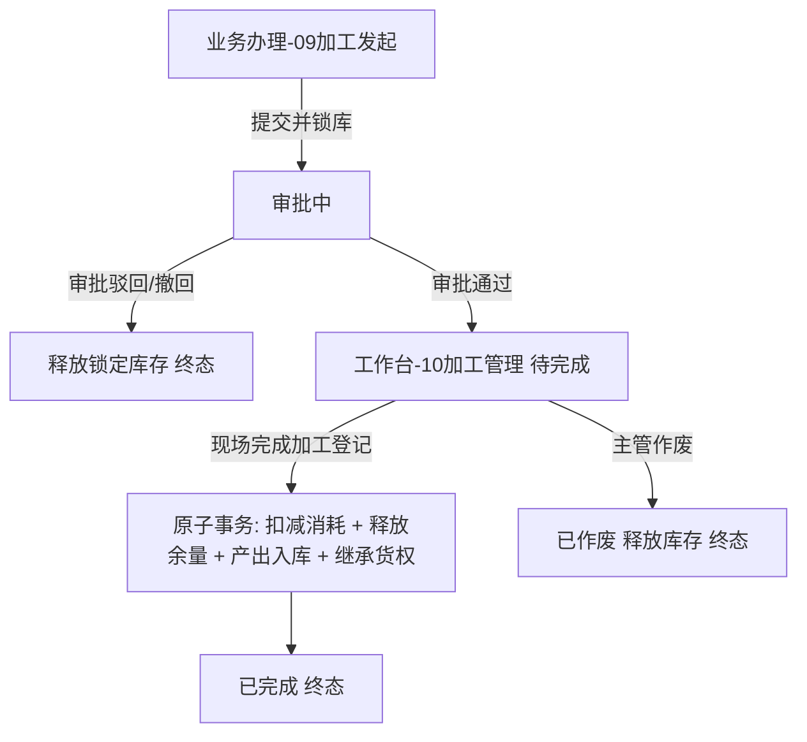

# 加工管理（移动端记录单据）

> **文档状态**：已梳理 — 对齐 6.1/6.2 标杆架构基准版
> **moduleId**：`ws-processing-mgr`
> **菜单路径**：工作台 → 仓储 → 加工管理
> **原型路由**：`/m/module/ws-processing-mgr`
> **PC 原路径**：仓储-加工管理-加工记录
> **功能清单唯一定义来源**：`03-前端原型demo/B端H5/src/data/mobileMenuData.ts`
> **基准路径**：`B端H5/02-工作台/01-仓储/10-加工管理`
> **导航索引**：[00-菜单地图.md](../../../00-菜单地图.md) · [01-功能清单与原型路由.md](../../../01-功能清单与原型路由.md)
>
> **业务规则与字段唯一定义来源（PC 基准）**：
> - [14-加工管理-加工记录/加工管理主PRD](../../../../B端PC/02-仓储/14-加工管理-加工记录/加工管理主PRD.md)
> - [14-加工管理-加工记录/加工管理业务规则规格](../../../../B端PC/02-仓储/14-加工管理-加工记录/加工管理业务规则规格.md)
> - [14-加工管理-加工记录/加工管理字段清单](../../../../B端PC/02-仓储/14-加工管理-加工记录/加工管理字段清单.md)
> - [14-加工管理-加工记录/功能清单（PC及移动端）](../../../../B端PC/02-仓储/14-加工管理-加工记录/加工管理功能清单_PC及移动端.md)
>
> **关联发起入口**：[业务办理 → 业务发起 → 09-加工发起](../../../03-业务办理/02-业务发起/09-加工发起/README.md)

---

## 一、功能说明

加工管理是移动端（App/PDA）仓储板块的核心记录单据模块。用于仓库监管人员与业务人员实时查询加工单据流转状态、查看投入物料与产出物料明细、查验审批进度历史、在现场执行“完成加工登记”（核销实际消耗、释放余量、确认产出入库与生成存货条码），以及对异常/待完成单据进行作废处理。

---

## 二、移动端主要页面与交互规范

### 1. 加工管理列表页 (`/m/module/ws-processing-mgr`)
- **顶部搜索与筛选**：
  - 支持加工单号、货主名称模糊搜索；
  - 提供单据状态 Tab / 下拉筛选：`全部`、`审批中`、`待完成`、`已完成`、`已驳回`、`已撤回`、`已作废`；
  - 支持按加工日期范围、仓库进行多维筛选。
- **卡片式列表展现**：
  - 每张单据以卡片呈现：单号（支持一键复制）、货主名称、加工类型（普通货/抵押货/质押货 Tag 标识）、仓库名称、加工日期；
  - 投入货物简述（品类/规格/数量）及产出货物简述；
  - 单据状态徽标（审批中-橙色、待完成-蓝色、已完成-绿色、已驳回/已作废-灰色）；
  - 底部操作按钮区域（根据状态与权限动态展示：`查看详情`、`完成加工`、`作废`、`撤回`）。
- **快捷发起悬浮按钮**：
  - 列表页右下角提供浮动快捷按钮【+ 发起加工】，点击直接跳转至 [09-加工发起](../../../03-业务办理/02-业务发起/09-加工发起/README.md)。

### 2. 加工单详情页
- **单据主信息**：单号、状态、加工类型、货主、加工仓库、加工日期、关联合同/单号（抵质押货时）、制单人、制单时间；
- **投入货物明细折叠面板**：大类、品类、规格、库存批次/条码、单位、计划投入数量、实际消耗数量（完成态）、释放数量；
- **产出货物明细折叠面板**：产出规格、预计数量、实际产出数量、入库库房/分区/具体位置、新生成存货条码、预计/实际总金额；
- **损耗与现场照片**：加工损耗比例（%）、损耗说明、现场实证照片/抓拍监控图（支持点击查看大图）；
- **审批记录流转时序轴**：节点名称、处理人、审批动作（发起/通过/驳回/撤回/作废）、审批意见及操作时间戳。

### 3. 现场完成加工登记页（仅「待完成」状态）
现场仓库监管人员在加工实操完成后，通过移动端（App/PDA）登记实际结果：
- **实际消耗核销**：针对每一行锁定的投入物料，录入实际物理消耗量（校验 $0 < \text{实际消耗} \le \text{计划锁定量}$）；系统自动计算未消耗余量；
- **产出入库确认**：录入实际产出数量（$> 0$），在主表所属仓库下选择库房、分区及输入具体存放位置；
- **损耗比例与说明**：必填实际损耗百分比（$0\% \sim 100\%$）及损耗原因说明；
- **确认提交**：点击【确认完成加工】，唤起二次确认弹窗，确认后后端执行全局原子事务，完成库存扣减、余量释放、产出入库、生成条码及原抵质押单自动继承。

---

## 三、移动端动作与权限矩阵

| 动作名称 | 审批中 | 待完成 | 已完成 | 已驳回 | 已撤回 | 已作废 | 权限角色 |
| :--- | :---: | :---: | :---: | :---: | :---: | :---: | :--- |
| **查看详情** | ✅ | ✅ | ✅ | ✅ | ✅ | ✅ | 仓库监管员 / 业务员 / 主管 |
| **新增加工** | — | — | — | — | — | — | [09-加工发起](../../../03-业务办理/02-业务发起/09-加工发起/README.md) 入口 |
| **申请人撤回** | ✅ | ❌ | ❌ | ❌ | ❌ | ❌ | 仅单据原制单人本人 |
| **完成加工登记** | ❌ | ✅ | ❌ | ❌ | ❌ | ❌ | 仓库监管人员 / 现场操作员 |
| **单据作废** | ❌ | ✅ | ❌ | ❌ | ❌ | ❌ | 授权业务主管 / 风控管理员 |

---

## 四、关联流转链路

