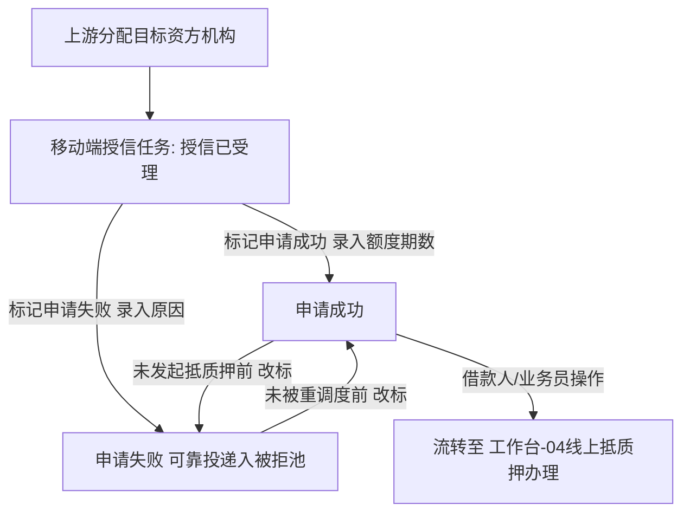

# 客户融资授信办理（移动端工作台单据）

> **文档状态**：已梳理 — 对齐 6.1/6.2 标杆架构基准版
> **moduleId**：`ws-credit-process`
> **菜单路径**：工作台 → 融资/监管 → 客户融资授信办理
> **原型路由**：`/m/module/ws-credit-process`
> **PC 原路径**：融资/监管～融资管理～客户融资授信办理
> **功能清单唯一定义来源**：`03-前端原型demo/B端H5/src/data/mobileMenuData.ts`
> **基准路径**：`B端H5/02-工作台/02-融资监管/03-客户融资授信办理`
> **导航索引**：[00-菜单地图.md](../../../00-菜单地图.md) · [01-功能清单与原型路由.md](../../../01-功能清单与原型路由.md)
>
> **业务规则与字段唯一定义来源（PC 基准）**：
> - [03-融资管理-客户融资授信办理/客户融资授信办理主PRD](../../../../B端PC/03-融资监管/03-融资管理-客户融资授信办理/客户融资授信办理主PRD.md)
> - [03-融资管理-客户融资授信办理/客户融资授信办理业务规则规格](../../../../B端PC/03-融资监管/03-融资管理-客户融资授信办理/客户融资授信办理业务规则规格.md)
> - [03-融资管理-客户融资授信办理/客户融资授信办理字段清单](../../../../B端PC/03-融资监管/03-融资管理-客户融资授信办理/客户融资授信办理字段清单.md)

---

## 一、功能说明

客户融资授信办理是移动端「工作台-融资/监管」板块面向合作资金方（银行、商业保理公司）审核人员的移动作业单据。承接在上游节点（需求线索、尽调完成或被拒池重调度）已锁定本资方机构的融资单据。所属资方机构内的授权审核专员共享任务池，在移动端进行资信与押品复核，执行标记申请成功（核定授信额度与期数）或标记申请失败（录入拒绝原因并可靠入池），并支持在下游尚未发起抵质押前进行状态改标。

---

## 二、移动端主要页面与交互规范

### 1. 机构授信任务列表页 (`/m/module/ws-credit-process`)
- **数据隔离与共享展现**：
  - 严格根据登录账号所属资方机构过滤数据，仅展示本资方名下的任务；
  - 机构全员共享，任一授权审核人员均可操作，无需抢单或转交；
  - 状态快捷筛选：`全部`、`授信已受理`、`申请成功`、`申请失败`。
- **卡片式列表展现**：
  - 单据卡片展示：客户名称、产品名称、意向融资金额、融资期数、抵/质押物类型；
  - 尽调报告简述（若需要尽调，可点击直接在线预览智风控报告）；
  - 授信额度/期数（成功态展示核定值）；
  - 底部操作按钮区域（根据状态动态展示：`查看详情`、`标记申请成功`、`标记申请失败`、`改标`）。

### 2. 标记申请成功弹窗 / 页面
- 审核人员确认给予授信后，点击【标记申请成功】：
  - **录入核定授信金额（元）**：必填正数，保留 4 位小数（作为后续线上抵质押贷款金额上限）；
  - **录入核定授信期数（期）**：必填正整数；
  - 提交后状态变更为“申请成功”，开放下游发起线上抵质押办理。

### 3. 标记申请失败弹窗 / 页面
- 审核人员评估不予授信时，点击【标记申请失败】：
  - **录入拒绝原因**：必填结构化拒绝分类及详细评语；
  - 提交后状态变更为“申请失败”，单据自动通过可靠投递写入【被拒退回池 -> 授信失败页签】。

### 4. 状态改标机制（未发起抵质押前）
- 若资方内部复议或补充担保后需修正结论，在借款人尚未发起“线上抵质押信息确认”前，允许点击【改标】：
  - 申请成功 $\to$ 改标为申请失败（录入原因）；
  - 申请失败 $\to$ 改标为申请成功（录入额度与期数，前提是该批次尚未被被拒池重调度给其他资方）。

---

## 三、移动端动作与权限矩阵

| 操作动作 | 授信已受理 | 申请成功（未发起抵质押） | 申请失败（未重调度） | 适用角色 | 关键控制与规则 |
| :--- | :---: | :---: | :---: | :--- | :--- |
| **查看详情与尽调报告** | ✅ | ✅ | ✅ | 资方审核专员 / 运营 | 严格按资方机构隔离数据 |
| **标记申请成功** | ✅ | ❌ | ✅（改标） | 所属资方机构审核人员 | 必填授信金额与期数 |
| **标记申请失败** | ✅ | ✅（改标） | ❌ | 所属资方机构审核人员 | 必填拒绝原因，可靠入池 |

---

## 四、业务流转链路

