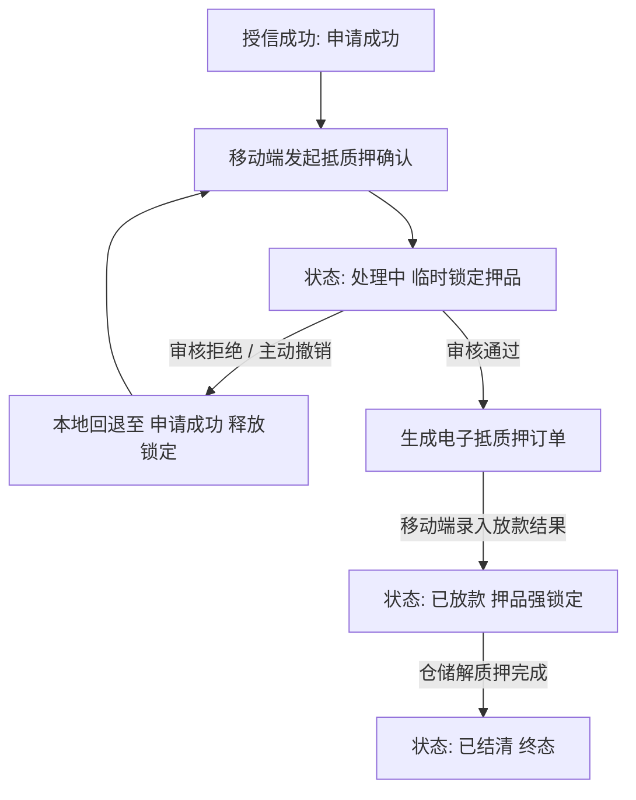

# 线上抵质押办理（移动端工作台单据）

> **文档状态**：已梳理 — 对齐 6.1/6.2 标杆架构基准版
> **moduleId**：`ws-online-pledge-process`
> **菜单路径**：工作台 → 融资/监管 → 线上抵质押办理
> **原型路由**：`/m/module/ws-online-pledge-process`
> **PC 原路径**：从【客户融资授信办理】拆出（融资结果/线上抵质押办理）
> **原型标签**：新拆分
> **功能清单唯一定义来源**：`03-前端原型demo/B端H5/src/data/mobileMenuData.ts`
> **基准路径**：`B端H5/02-工作台/02-融资监管/04-线上抵质押办理`
> **导航索引**：[00-菜单地图.md](../../../00-菜单地图.md) · [01-功能清单与原型路由.md](../../../01-功能清单与原型路由.md)
>
> **业务规则与字段唯一定义来源（PC 基准）**：
> - [04-融资管理-融资结果-线上抵质押办理/线上抵质押办理主PRD](../../../../B端PC/03-融资监管/04-融资管理-融资结果-线上抵质押办理/线上抵质押办理主PRD.md)
> - [04-融资管理-融资结果-线上抵质押办理/线上抵质押办理业务规则规格](../../../../B端PC/03-融资监管/04-融资管理-融资结果-线上抵质押办理/线上抵质押办理业务规则规格.md)
> - [04-融资管理-融资结果-线上抵质押办理/线上抵质押办理字段清单](../../../../B端PC/03-融资监管/04-融资管理-融资结果-线上抵质押办理/线上抵质押办理字段清单.md)

---

## 一、功能说明

线上抵质押办理是移动端「工作台-融资/监管」板块独立拆分的线上办理快捷通道。功能全量对齐 PC 端，支持借款人经办人或业务专员在移动端一键发起抵质押信息确认锁定资产、支持监管与资方人员在移动端审核抵质押单据（审核拒绝与撤销采用本地回退机制）、支持在生成抵质押订单后直接在移动端录入最终发放的贷款金额与期数（校验金额 $\le$ 授信金额），并实时同步抵质押订单解押结清状态。

---

## 二、移动端主要页面与交互规范

### 1. 抵质押办理列表页 (`/m/module/ws-online-pledge-process`)
- **顶部搜索与筛选**：
  - 支持申请人名称、产品名称模糊搜索；
  - 状态快捷页签 / 筛选：`全部`、`申请成功`（待发起）、`处理中`（办理/审核中）、`已放款`、`已结清`；
  - 支持按申请时间区间进行筛选。
- **卡片式列表展现**：
  - 卡片呈现：产品名称、申请人名称、意向融资金额、核准授信金额、抵/质押物类型；
  - 放款信息（已放款状态高亮展示实际贷款金额与期数）；
  - 状态徽标（申请成功-蓝色、处理中-橙色、已放款-绿色、已结清-灰色）；
  - 底部操作按钮区域（根据状态动态展示：`查看详情`、`发起抵质押确认`、`审核`、`撤销确认`、`录入贷款结果`）。

### 2. 发起抵质押信息确认页（仅「申请成功」状态）
- 借款人经办人或业务人员点击【发起抵质押确认】：
  - **押品明细核对与锁定**：展示存货明细（品类/规格/数量）或仓单号；强校验押品处于未被占用状态；
  - **签署与提交**：核对授信金额与期数，点击确认提交后状态变更为“处理中”，底层资产临时锁定并生成审核任务。

### 3. 移动端审核与主动撤销（仅「处理中」状态）
- **审核任务处理**：审核人员查看抵质押要素，若不符合要求点击【审核拒绝】（必填原因），系统执行**本地回退至“申请成功”**并释放临时锁定；若审核通过，系统自动生成电子抵质押订单；
- **用户主动撤销**：在正式抵质押订单生成前，操作人可点击【撤销确认】（必填原因），单据**本地回退至“申请成功”**。

### 4. 贷款结果录入页（仅「处理中」且订单已生成状态）
- 资方打款到账后，授权人员在移动端录入放款结果：
  - **录入贷款金额（元）**：必填，系统强校验 $0 < \text{贷款金额} \le \text{授信金额}$；
  - **录入贷款期数（期）**：必填，正整数；
  - 提交后状态更新为“已放款”，存货正式标记为“质押中”。

---

## 三、移动端动作与权限矩阵

| 操作动作 | 申请成功 | 处理中 | 已放款 | 已结清 | 适用角色 | 关键控制与规则 |
| :--- | :---: | :---: | :---: | :---: | :--- | :--- |
| **查看详情** | ✅ | ✅ | ✅ | ✅ | 客户 / 运营 / 资方 / 监管 | 全字段查看与审计留痕 |
| **发起抵质押确认** | ✅ | ❌ | ❌ | ❌ | 客户经办人 / 业务专员 | 强校验押品可用性，进入处理中 |
| **审核抵质押任务** | ❌ | ✅ | ❌ | ❌ | 监管运营 / 资方风控 | 拒绝本地回退为“申请成功” |
| **用户主动撤销** | ❌ | ✅ | ❌ | ❌ | 客户经办人 / 业务专员 | 仅未生成订单前可撤销，本地回退 |
| **录入贷款结果** | ❌ | ✅ | ❌ | ❌ | 资方账务 / 资金结算 | 订单生成后录入；校验 $\le$ 授信金额 |

---

## 四、业务流转链路

