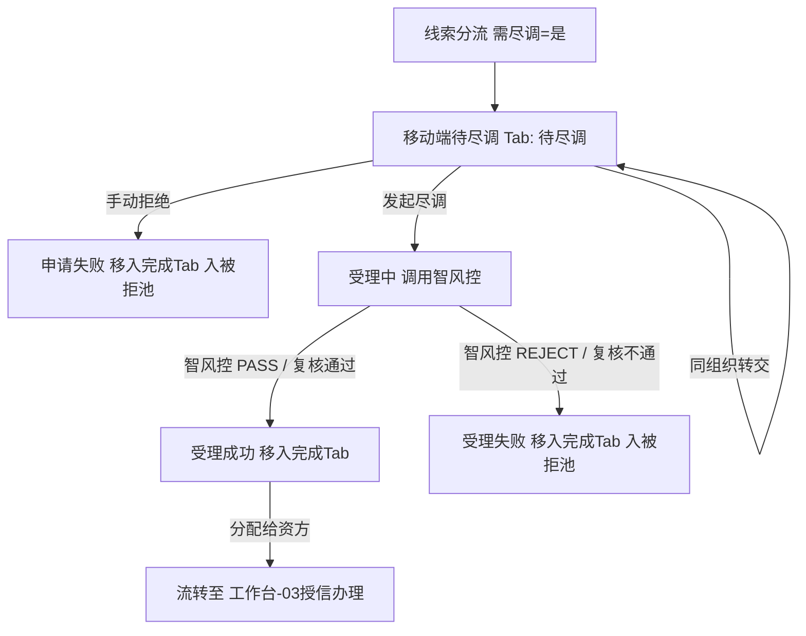

# 客户融资尽调办理（移动端工作台单据）

> **文档状态**：已梳理 — 对齐 6.1/6.2 标杆架构基准版
> **moduleId**：`ws-due-diligence-process`
> **菜单路径**：工作台 → 融资/监管 → 客户融资尽调办理
> **原型路由**：`/m/module/ws-due-diligence-process`
> **PC 原路径**：融资/监管～融资管理～客户融资尽调办理
> **功能清单唯一定义来源**：`03-前端原型demo/B端H5/src/data/mobileMenuData.ts`
> **基准路径**：`B端H5/02-工作台/02-融资监管/05-客户融资尽调办理`
> **导航索引**：[00-菜单地图.md](../../../00-菜单地图.md) · [01-功能清单与原型路由.md](../../../01-功能清单与原型路由.md)
>
> **业务规则与字段唯一定义来源（PC 基准）**：
> - [02-融资管理-客户融资尽调办理/客户融资尽调办理主PRD](../../../../B端PC/03-融资监管/02-融资管理-客户融资尽调办理/客户融资尽调办理主PRD.md)
> - [02-融资管理-客户融资尽调办理/客户融资尽调办理业务规则规格](../../../../B端PC/03-融资监管/02-融资管理-客户融资尽调办理/客户融资尽调办理业务规则规格.md)
> - [02-融资管理-客户融资尽调办理/客户融资尽调办理字段清单](../../../../B端PC/03-融资监管/02-融资管理-客户融资尽调办理/客户融资尽调办理字段清单.md)

---

## 一、功能说明

客户融资尽调办理是移动端「工作台-融资/监管」板块的核心尽职调查作业模块。用于尽调专员在移动端（手机/PDA）现场接收指派任务、发起智风控模型调用、现场拍照上传核验照片与尽调报告摘要、进行同尽调组织任务转交、对异常件执行手动拒绝，以及在尽调通过后将单据分派给合作资方机构。

---

## 二、移动端主要页面与交互规范

### 1. 尽调办理双 Tab 列表页 (`/m/module/ws-due-diligence-process`)
- **双 Tab 页面架构**：
  - **【待尽调 Tab】**（操作型）：展示`待尽调`、`受理中`状态任务，支持现场操作；
  - **【尽调完成 Tab】**（归档型）：展示`受理成功`、`受理失败`、`申请失败`状态，只读归档查验。
- **卡片式列表展现**：
  - 任务卡片呈现：产品名称、申请人名称、意向融资金额、融资期数、抵/质押物类型；
  - 当前责任尽调专员、任务接入时间、时效预警徽标（超 48 小时未发起显黄色标签）；
  - 操作按钮区域（根据状态动态展示：`查看详情`、`发起尽调`、`任务转交`、`手动拒绝`、`分配资方`）。

### 2. 尽调现场核验与发起页（仅「待尽调」状态）
- **主体与资产核对**：企业工商资质/个人身份证核验、现场存货/仓单明细对照；
- **发起智风控核验**：点击【发起尽调】，调用智风控接口，状态更新为“受理中”；
- **任务转交弹窗**：仅允许选择同尽调组织内的在职同事，确认后责任人变更，状态保持待尽调；
- **手动拒绝弹窗**：现场发现严重涉诉、空壳无实物等重大异常时，录入拒绝说明，提交后置为“申请失败”，自动写入被拒退回池【尽调失败页签】。

### 3. 现场报告上传与资方分配（仅「受理成功」状态）
- **报告与凭证拍照上传**：支持移动端调用摄像头现场拍摄尽调照片、上传尽调报告（PDF/图片）；
- **分配给资方机构**：选择启用状态的目标合作资方机构，确认后生成授信任务，流转至【客户融资授信办理】。

---

## 三、移动端动作与权限矩阵

| 操作动作 | 待尽调 | 受理中 | 受理成功 | 受理失败 | 申请失败 | 适用角色 | 关键控制与规则 |
| :--- | :---: | :---: | :---: | :---: | :---: | :--- | :--- |
| **查看详情与报告** | ✅ | ✅ | ✅ | ✅ | ✅ | 尽调人员 / 运营 / 资方 | 仅本机构及关联角色可见 |
| **发起智风控尽调** | ✅ | ❌ | ❌ | ❌ | ❌ | 当前尽调责任人 | 调用智风控，状态变更为受理中 |
| **同组织任务转交** | ✅ | ❌ | ❌ | ❌ | ❌ | 当前尽调责任人 | 仅限同尽调机构同事 |
| **手动拒绝** | ✅ | ❌ | ❌ | ❌ | ❌ | 尽调责任人 / 风控主管 | 必填原因，可靠投递入被拒池 |
| **分配给资方** | ❌ | ❌ | ✅ | ❌ | ❌ | 平台运营 / 风控专员 | 仅受理成功件可操作，转授信已受理 |

---

## 四、业务流转链路

