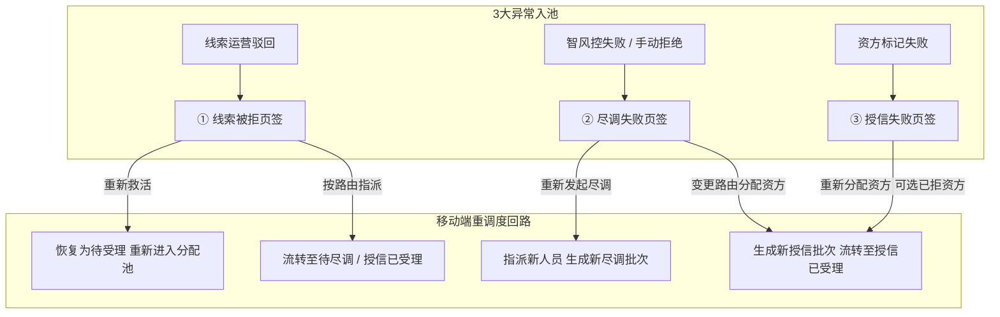

# 被拒退回记录池（移动端工作台单据）

> **文档状态**：已梳理 — 对齐 6.1/6.2 标杆架构基准版
> **moduleId**：`ws-reject-pool`
> **菜单路径**：工作台 → 融资/监管 → 被拒退回记录池
> **原型路由**：`/m/module/ws-reject-pool`
> **PC 原路径**：融资/监管～融资管理～被拒退回池
> **原型标签**：优化
> **功能清单唯一定义来源**：`03-前端原型demo/B端H5/src/data/mobileMenuData.ts`
> **基准路径**：`B端H5/02-工作台/02-融资监管/06-被拒退回记录池`
> **导航索引**：[00-菜单地图.md](../../../00-菜单地图.md) · [01-功能清单与原型路由.md](../../../01-功能清单与原型路由.md)
>
> **业务规则与字段唯一定义来源（PC 基准）**：
> - [05-融资管理-被拒退回池/被拒退回池主PRD](../../../../B端PC/03-融资监管/05-融资管理-被拒退回池/被拒退回池主PRD.md)
> - [05-融资管理-被拒退回池/被拒退回池业务规则规格](../../../../B端PC/03-融资监管/05-融资管理-被拒退回池/被拒退回池业务规则规格.md)
> - [05-融资管理-被拒退回池/被拒退回池字段清单](../../../../B端PC/03-融资监管/05-融资管理-被拒退回池/被拒退回池字段清单.md)
> - [05-融资管理-被拒退回池/被拒退回池功能清单（PC及移动端）](../../../../B端PC/03-融资监管/05-融资管理-被拒退回池/被拒退回池功能清单_PC及移动端.md)

---

## 一、功能说明

被拒退回记录池是移动端「工作台-融资/监管」板块的统一异常监控与重调度控制中心。用于集中收口融资管理前 3 个节点（需求线索驳回件、尽调失败/手动拒绝件、资方授信失败件），划分为 **3 大分类页签** 进行移动端查看与重调度救活，支持移动端单笔重新指派人员/资方及快捷救活确认，防止业务线索死锁流失。

---

## 二、移动端主要页面与交互规范

### 1. 3 大分类页签列表页 (`/m/module/ws-reject-pool`)
- **3 大页签分类架构**：
  - **【① 线索被拒页签】**：展示需求线索运营驳回件，支持【重新救活】与【按路由重新指派】；
  - **【② 尽调失败页签】**：展示智风控失败与尽调人员手动拒绝件，支持【重新发起尽调】与【变更路由直接分配资方】；
  - **【③ 授信失败页签】**：展示资方机构标记申请失败件，支持【重新分配资方】（历史已拒资方在列表中仍可选，原尽调结论继续有效）。
- **卡片式列表展现**：
  - 单据卡片展示：客户名称、产品名称、退回节点名称、失败/驳回原因（大字显示）、原处理人及处理时间；
  - 停滞时长标签（超过 72 小时未处理展示红色“超期未调度”警示）；
  - 底部操作按钮区域（根据所在页签动态提供专属重处理按钮）。

### 2. 移动端重处理操作弹窗
- **① 线索被拒页签**：
  - 点击【重新救活】：修改/补齐申请资料，确认后单据恢复为“待受理”重新进入需求线索分配池；
  - 点击【按路由重新指派】：需要尽调=是指派尽调人员；需要尽调=否分配资方机构，直接流转下游。
- **② 尽调失败页签**：
  - 点击【重新发起尽调】：选择同尽调组织在职尽调专员，创建新尽调批次推送到【待尽调 Tab】；
  - 点击【变更路由分配资方】：跳过尽调直接指定资方机构，推送到【授信已受理】。
- **③ 授信失败页签**：
  - 点击【重新分配资方】：选择目标合作资方机构（列表中历史曾经拒绝过该客户的资方不置灰、可选），确认后生成新授信批次推送到【客户融资授信办理】。

---

## 三、移动端动作与权限矩阵

| 操作动作 | ① 线索被拒页签 | ② 尽调失败页签 | ③ 授信失败页签 | 适用角色 | 关键控制与规则 |
| :--- | :---: | :---: | :---: | :--- | :--- |
| **查看详情与拒绝履历** | ✅ | ✅ | ✅ | 运营主管 / 风控专员 | 永久留存各批次拒绝原因 |
| **重新救活** | ✅ | ❌ | ❌ | 平台运营主管 | 补齐资料后恢复为待受理 |
| **按路由重新指派** | ✅ | ❌ | ❌ | 平台运营主管 | 按路由分流至尽调或授信 |
| **重新发起尽调** | ❌ | ✅ | ❌ | 平台运营主管 | 重新指派尽调人员 |
| **变更路由分配资方** | ❌ | ✅ | ❌ | 平台运营主管 / 风控主管 | 跳过尽调直接分配资方 |
| **重新分配资方** | ❌ | ❌ | ✅ | 平台运营主管 | 历史已拒资方仍可选 |

---

## 四、业务流转链路

