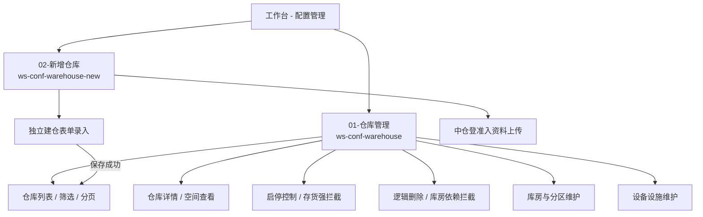

# 仓库管理

> **文档状态**：已根据 6.1 迭代及最新基准版完成 H5 端 PRD / 字段清单更新  
> **moduleId**：`ws-conf-warehouse`  
> **菜单路径**：工作台 → 配置管理 → 仓库管理  
> **原型路由**：`/m/module/ws-conf-warehouse`  
> **PC 对照**：[10-仓库管理-仓库管理](../../../../B端PC/08-配置管理/10-仓库管理-仓库管理/)  
> **功能清单唯一定义来源**：`03-前端原型demo/B端H5/src/data/mobileMenuData.ts`  
> **基准路径**：`B端H5/02-工作台/06-配置管理/01-仓库管理`  
> **导航索引**：[00-菜单地图.md](../../../00-菜单地图.md) · [01-功能清单与原型路由.md](../../../01-功能清单与原型路由.md)  
> **历史设计与拆分说明**：在 B 端 H5 端历史架构中，“**新增仓库**”作为独立功能入口由 [02-新增仓库](../02-新增仓库/)（`ws-conf-warehouse-new`）承载；本模块（`ws-conf-warehouse`）负责仓库列表查询、详情查阅、启停/删除控制、库房与分区层级维护以及设备设施配置。

---

## 模块文档清单

| 文档名称 | 类型 | 说明 | 链接 |
| :--- | :--- | :--- | :--- |
| **仓库管理主PRD.md** | 主规格 PRD | H5 端仓库管理主规格（列表、详情、启停、删除、库房分区、设备设施） | [仓库管理主PRD.md](./仓库管理主PRD.md) |
| **仓库管理字段清单.md** | 字段规格 | H5 端交互与展示字段唯一定义（对齐 PC 字段基准） | [仓库管理字段清单.md](./仓库管理字段清单.md) |

---

## 功能说明

建立并维护物理空间拓扑树（仓库-库房-分区），标记金融准入状态与安防评级，为空间建模与围栏设定提供基础锚点。

### 核心能力覆盖

1. **仓库列表与检索**：
   - 移动端卡片流展示仓库名称、管理方、中仓登准入状态、更新时间及启停状态；
   - 支持仓库名称模糊检索、中仓登准入（全部/是/否）及状态（全部/启用/停用）快捷筛选抽屉；
   - 支持下拉刷新与上拉分页加载。
2. **仓库详情查阅**：
   - 分 Tab 查阅【基础信息与管理方】、【中仓登准入资质】、【库房与分区】、【设备设施】；
   - 支持统一社会信用代码/身份证号及联系电话根据权限掩码脱敏展示。
3. **状态控制与删除拦截**：
   - **启用/停用**：支持对仓库执行启停切换，严格执行服务端“无存货存放”强校验拦截（R21）；
   - **逻辑删除**：仅停用状态支持删除，校验是否存在有效下级库房（R24），并弹出二次确认弹窗。
4. **库房与分区管理**：
   - 移动端折叠卡片层级展示库房及其下辖分区；
   - 支持库房新增/编辑/启停/删除（含出入库审核开关、存货拦截 R22、删除拦截 R25）；
   - 支持分区新增/编辑/启停/删除（含存货拦截 R23、删除拦截 R26）。
5. **设备设施配置**：
   - 仓库详情内设备设施卡片列表；
   - 支持现场录入/编辑设备设施名称、数量、单位与有效期，支持二次确认删除。

---

## 菜单与模块关系说明

---

## 修订记录

| 日期 | 版本 | 变更说明 | 变更人 |
| :--- | :---: | :--- | :--- |
| 2026-08-28 | V1.0 | 目录结构初始化（占位） | 系统架构组 |
| 2026-09-02 | V2.0 | 根据 6.1 迭代及最新 PC 基准完成 H5 端 PRD 及字段清单全量落地；明确与 02-新增仓库 的拆分架构与协同关系 | AI PM / 森云科技 |
