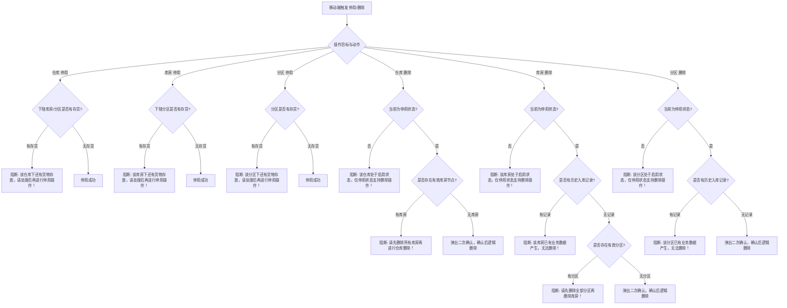

# 仓库管理主PRD（B端H5）

> **端**：B端H5（移动机构端）  
> **moduleId**：`ws-conf-warehouse`  
> **菜单路径**：工作台 → 配置管理 → 仓库管理  
> **原型路由**：`/m/module/ws-conf-warehouse`  
> **PC 对照**：[B端PC 10-仓库管理-仓库管理](../../../../B端PC/08-配置管理/10-仓库管理-仓库管理/仓库管理主PRD.md)  
> **编写依据**：[仓库管理字段清单.md](./仓库管理字段清单.md) · [PC 仓库管理主PRD](../../../../B端PC/08-配置管理/10-仓库管理-仓库管理/仓库管理主PRD.md)  
> **业务规则基准**：本模块所有业务状态流转、存货强拦截、中仓登联动规则与校验逻辑均以 [PC 仓库管理主PRD](../../../../B端PC/08-配置管理/10-仓库管理-仓库管理/仓库管理主PRD.md) 及 [仓库管理字段清单](../../../../B端PC/08-配置管理/10-仓库管理-仓库管理/仓库管理字段清单.md) 为单一真实数据源。  
> **历史设计说明**：在 H5 端历史架构中，“**新增仓库**”作为独立入口由 [02-新增仓库](../02-新增仓库/) 承载；本模块聚焦于仓库主档查阅、启停/删除控制、库房/分区维护以及设备设施配置。

---

## 1. 业务背景与移动端定位

仓库管理是 SYZC 供应链金融存货监管系统在移动端（B端H5）的空间主档与现场管理入口。通过 H5 移动化能力，现场监管员、片区经理及风控巡检人员可随时随地：
- 快速检索与查看仓库主档、管理方信息、中仓登准入资质及设备配套；
- 在移动端执行仓库/库房/分区的启用、停用与逻辑删除（受后端存货强校验严格管控）；
- 维护“仓库 → 库房 → 分区”三级空间拓扑结构，支持现场库房/分区的新增、编辑与出入库审核开关配置；
- 现场盘点与录入设备设施主档（名称、数量、单位、有效期）。

---

## 2. 功能范围

### 本期范围
- **仓库列表与检索**：卡片流展示、下拉刷新、上拉加载、名称模糊检索、中仓登准入与状态筛选抽屉；
- **仓库详情查看**：分 4 个 Tab 查看【基础与管理方】、【中仓登资质】、【库房与分区】、【设备设施】；
- **仓库启停控制**：启用/停用操作，严格触发服务端“下辖空间无存货存放”强校验拦截（R21）；
- **仓库逻辑删除**：仅停用状态允许删除，强校验是否存在有效库房节点（R24），二次确认后逻辑删除；
- **库房管理**：库房新增、编辑、出入库审核开关配置、启用/停用（存货拦截 R22）、删除（业务记录与分区拦截 R25）；
- **分区管理**：所属库房关联、分区新增、编辑、启用/停用（存货拦截 R23）、删除（业务记录拦截 R26）；
- **设备设施管理**：设备设施列表查看、移动端抽屉/弹窗新增与编辑、二次确认删除；
- **移动端数据脱敏与安全**：管理方敏感证件号/手机号掩码脱敏、租户数据隔离与操作审计日志。

### 不在本期范围
- **新增仓库全流程录入**：H5 端由独立功能模块 [02-新增仓库](../02-新增仓库/) 承载，本模块列表提供跳转至新增仓库的快捷悬浮按钮/顶部按钮；
- 仓储业务实际作业（入库、出库、移库、盘点等业务单据在“业务办理/仓储”模块办理）；
- 设备传感器实时通信协议配置（由物联网设备模块维护）。

---

## 3. 页面与移动端交互规范

### 3.1 仓库列表页 (`/m/module/ws-conf-warehouse`)

#### 页面布局与元素
1. **顶部导航栏**：
   - 标题：“仓库管理”；
   - 右侧操作：【筛选】图标按钮（点击唤起筛选抽屉）；
   - 右上角/底部悬浮：【+ 新增仓库】按钮（点击路由跳转至 `/m/module/ws-conf-warehouse-new`）。
2. **搜索栏**：
   - 顶部吸顶搜索框，支持输入仓库名称实时或回车模糊搜索。
3. **快速筛选标签（Filter Tags）**：
   - 全部 / 启用 / 停用 / 中仓登准入仓。
4. **仓库卡片流（Card List）**：
   - 每张卡片呈现：
     - **头部**：仓库名称（点击进入详情）、状态标签（“启用”绿色 / “停用”灰色）；
     - **中仓登标识**：若为中仓登准入仓，高亮展示“中仓登准入”徽章；
     - **主体内容**：管理方名称（企业/个人）、仓库类型、仓库面积（㎡）、仓库地址；
     - **底部操作栏**：
       - 【查看详情】（主操作，进入仓库详情页）；
       - 【编辑】（跳转或唤起编辑表单）；
       - 【停用】/【启用】（根据当前状态动态展示）；
       - 【删除】（仅停用状态且无下级库房时高亮，否则置灰或弹出拦截提示）。

#### 移动端筛选抽屉（Filter Drawer）
- **仓库名称**：文本输入框（模糊匹配）；
- **是否中仓登准入仓**：单选宫格【全部 / 是 / 否】；
- **状态**：单选宫格【全部 / 启用 / 停用】；
- 底部操作：【重置】、【确定】。

---

### 3.2 仓库详情页 (`/m/module/ws-conf-warehouse/:id`)

详情页采用顶部仓库基础摘要卡片 + 底部 4 个滑动 Tab 结构：

```
+------------------------------------------+
| < 仓库详情                       [操作]  |
+------------------------------------------+
| [仓库图标] 华东一号中心仓        [启用/停用]|
| 管理方: 上海森云物流有限公司   中仓登: [是] |
| 面积: 15,000.00 ㎡   类型: 通用/常温库      |
+------------------------------------------+
| [ 基础信息 ] [ 中仓登资质 ] [ 库房与分区 ] [ 设备设施 ] |
+------------------------------------------+
| (Tab 对应内容展示区)                     |
+------------------------------------------+
```

#### Tab 1: 基础信息与管理方
- **仓库基础信息**：仓库名称、仓库地址（省/市/区/详细地址）、仓库面积、仓库类型（含其他类型名称说明）、仓库监管员、片区经理；
- **管理方信息**：管理方类型（企业/个人）、管理方名称、统一社会信用代码/身份证号（权限脱敏展示）、联系电话（脱敏）、权属关系（自有/租赁/其他）；
- **系统信息**：创建人、创建时间、最近更新时间。

#### Tab 2: 中仓登准入资质
- 若非中仓登准入仓：展示空状态说明“该仓库未开启中仓登准入”；
- 若为中仓登准入仓：
  - **中仓登仓库ID号**：文本展示，支持一键复制；
  - **仓库库区图或库位图**：图片缩略图，点击可全屏放大预览；
  - **仓库信息登记表**：PDF 文件卡片，展示文件名及大小，点击支持在线预览/下载；
  - **仓库图片**：九宫格图片墙（最多 8 张），支持点击轮播放大浏览。

#### Tab 3: 库房与分区配置
- **顶部操作**：【+ 新增库房】按钮；
- **层级折叠卡片列表**：
  - **库房卡片**（一级折叠项）：
    - 展示库房名称、状态标签（启用/停用）、出入库审核标签（“开启审核”/“免审”）、分区数量统计、备注说明；
    - 库房操作菜单（更多操作）：【+ 新增分区】、【编辑库房】、【停用/启用】、【删除】；
  - **分区列表**（展开库房后内嵌展示）：
    - 展示分区名称、所属库房、状态标签（启用/停用）、备注说明；
    - 分区操作：【编辑】、【停用/启用】、【删除】。

#### Tab 4: 设备设施配置
- **顶部操作**：【+ 新增设施】按钮；
- **设施卡片列表**：
  - 展示设施名称、数量及单位（如：50 套）、有效期（YYYY-MM-DD）、添加时间；
  - 设施操作：【编辑】、【删除】（点击弹出二次确认对话框：“*你确定删除{{设备设施名称}}吗？*”）。

---

## 4. 核心业务规则与校验（统一来源 PC 基准）

本模块严格遵从 SYZC 全局仓储空间管控规则，前后端双重闭环校验：

### 4.1 空间层级与唯一性规则
- **R01 租户数据隔离**：所有数据操作强制携带 `tenant_id`；
- **R02 三级空间拓扑树**：必须满足“仓库（1） → 库房（N） → 分区（N）”严格层级；
- **R03 名称唯一性**：同一租户下仓库名称唯一；同一仓库下库房名称唯一；同一库房下分区名称唯一。

### 4.2 存货与业务数据强拦截规则（核心风控红线）



### 4.3 库房与分区维护规则
- **库房出入库审核**：单选开关（开启/关闭），开启后控制普通货物出库与转让审核流；
- **分区所属库房**：新增分区必须选择所属仓库下的有效启用库房，创建后所属库房不可修改。

### 4.4 设备设施维护规则
- 所在仓库自动绑定当前仓库主键 ID；
- 删除设备设施弹出确认框：“*你确定删除{{设备设施名称}}吗？*”，确认后物理或逻辑删除，不校验存货及业务单据。

---

## 5. 状态机定义与流转

| 状态维度 | 状态值 | 业务含义 | 移动端交互行为 |
| :--- | :--- | :--- | :--- |
| **空间状态** | **启用** | 正常作业中，允许接纳新业务 | 绿色标签，展示【停用】操作按钮 |
| | **停用** | 停止接纳新业务，下游禁止新建选择 | 灰色标签，展示【启用】及【删除】操作按钮 |
| **删除状态** | **已删除** | 逻辑删除（`is_deleted = 1`） | 前台列表全局不展示，不可恢复 |

---

## 6. 权限设计与数据安全

### 6.1 数据权限范围
- **仓库监管员 / 片区经理**：仅可见分配管辖范围内的仓库主档；
- **机构风控管理员 / 系统管理员**：按机构层级向上汇总、向下穿透查看租户内全部仓库。

### 6.2 敏感信息脱敏
- 统一社会信用代码/身份证号：保留前 6 位与后 4 位，中间使用 `*` 掩码（如 `310104********1234`）；
- 联系电话：手机号保留前 3 后 4（如 `138****5678`）。

---

## 7. 异常流与移动端边界处理

| 异常场景 | 触发条件 | 移动端交互与防护机制 |
| :--- | :--- | :--- |
| **弱网 / 提交超时** | 移动端网络不稳定 | 接口调用时全屏轻量 Loading 遮罩，超时自动提示重试，禁止表单重复提交 |
| **并发冲突** | 两人同时修改同一仓库 | 基于 `version` 乐观锁，接口返回并发冲突时弹窗提示：“*当前数据已被其他人修改，请刷新页面后重试！*”，点击刷新重新拉取最新数据 |
| **存货拦截阻断** | 尝试停用有货物的空间 | 弹出警告 Toast：“*该[仓库/库房/分区]下还有货物存放，请处理后再进行停用操作！*”，保持当前状态不变 |
| **删除前置未满足** | 启用状态直接删除 / 有下级 / 有入库记录 | 弹出警告 Toast 阻断提示，精准说明拦截原因（见 4.2 规则） |

---

## 8. 验收要点

1. **列表与检索**：搜索框模糊匹配仓库名称，筛选抽屉精确过滤状态和中仓登准入仓；
2. **存货停用拦截**：对存在在库货物的仓库/库房/分区执行【停用】，100% 触发阻断 Toast；
3. **启用删除拦截**：对处于启用状态的仓库/库房/分区执行【删除】，100% 弹出“仅停用状态支持删除”拦截；
4. **下级/业务记录删除拦截**：存在库房的停用仓库、存在分区的停用库房、存在历史入库记录的库房/分区，100% 阻断删除；
5. **库房与分区增改**：同级名称唯一性校验，出入库审核开关状态正确保存与回显；
6. **设备设施增删**：新增设施字段校验完整，删除时具备二次确认弹窗；
7. **数据脱敏**：移动端证件号与手机号严格按权限掩码脱敏呈现。

---

## 修订记录

| 日期 | 版本 | 变更摘要 | 变更人 |
| :---: | :---: | :--- | :--- |
| 2026-09-02 | V1.0 | 依据 6.1 迭代仓库管理主 PRD 及 H5 移动端交互架构规范全新编写；明确与 02-新增仓库 独立入口的协同机制 | AI PM / 森云科技 |
